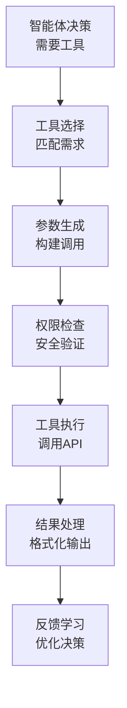

# 16.4 工具调用：赋予智能体行动能力

> **设计思想**：构建灵活的工具调用框架，使智能体能够与外部系统交互并执行实际任务

## 本节概述

工具调用是智能体系统的核心能力之一，它使智能体能够超越纯语言处理的范畴，通过调用外部工具来执行实际操作。从简单的计算器到复杂的API调用，工具调用能力极大地扩展了智能体的应用范围和实用性。本节将设计并实现一个灵活、安全、可扩展的工具调用框架。

## 学习目标

完成本节学习后，你将：

- ✅ **理解工具调用的核心概念**：掌握工具注册、调用和结果处理的完整流程
- ✅ **掌握工具注册和管理机制**：学会如何动态注册和管理各种类型的工具
- ✅ **实现工具调用的解析和执行**：掌握工具调用参数的解析和安全执行
- ✅ **学会工具执行结果的处理**：理解如何处理和格式化工具执行结果
- ✅ **掌握安全性和权限控制**：学会实现工具调用的安全控制机制
- ✅ **具备工具系统扩展能力**：能够开发自定义工具并集成到系统中

## 工具调用的核心概念

### 工具调用的工作流程



### 工具调用的基本要素

1. **工具定义**：描述工具的功能、参数和使用方法
2. **工具注册**：将工具注册到系统中供智能体调用
3. **工具调用**：智能体根据需求调用已注册的工具
4. **结果处理**：处理工具执行结果并反馈给智能体
5. **安全控制**：确保工具调用的安全性和权限管理

## 工具定义和注册机制

### 工具接口设计

```java
public abstract class Tool {
    protected String name;
    protected String description;
    protected List<ToolParameter> parameters;
    protected ToolMetadata metadata;
    protected PermissionLevel permissionLevel;
    
    public Tool(String name, String description) {
        this.name = name;
        this.description = description;
        this.parameters = new ArrayList<>();
        this.metadata = new ToolMetadata();
        this.permissionLevel = PermissionLevel.USER;
    }
    
    // 抽象方法，子类必须实现
    public abstract ToolResult execute(ToolCallContext context) throws ToolException;
    
    // 工具信息方法
    public String getName() { return name; }
    public String getDescription() { return description; }
    public List<ToolParameter> getParameters() { return parameters; }
    public ToolMetadata getMetadata() { return metadata; }
    public PermissionLevel getPermissionLevel() { return permissionLevel; }
    
    // 参数管理
    public void addParameter(ToolParameter parameter) {
        this.parameters.add(parameter);
    }
    
    public ToolParameter getParameter(String name) {
        return parameters.stream()
            .filter(p -> p.getName().equals(name))
            .findFirst()
            .orElse(null);
    }
    
    // 验证工具调用参数
    public void validateParameters(Map<String, Object> arguments) throws ToolException {
        for (ToolParameter param : parameters) {
            Object value = arguments.get(param.getName());
            
            // 检查必填参数
            if (param.isRequired() && value == null) {
                throw new ToolException("Missing required parameter: " + param.getName());
            }
            
            // 验证参数值
            if (value != null && !param.validate(value)) {
                throw new ToolException("Invalid value for parameter: " + param.getName());
            }
        }
    }
}

public class ToolParameter {
    private String name;
    private String description;
    private DataType type;
    private boolean required;
    private Object defaultValue;
    private List<Object> allowedValues;
    private Map<String, Object> constraints;
    
    public ToolParameter(String name, DataType type, String description) {
        this.name = name;
        this.type = type;
        this.description = description;
        this.required = false;
        this.constraints = new HashMap<>();
    }
    
    public boolean validate(Object value) {
        if (value == null) {
            return !required;
        }
        
        // 类型检查
        if (!isCorrectType(value)) {
            return false;
        }
        
        // 值范围检查
        if (allowedValues != null && !allowedValues.isEmpty()) {
            if (!allowedValues.contains(value)) {
                return false;
            }
        }
        
        // 自定义约束检查
        return validateConstraints(value);
    }
    
    private boolean isCorrectType(Object value) {
        switch (type) {
            case STRING:
                return value instanceof String;
            case INTEGER:
                return value instanceof Integer || value instanceof Long;
            case NUMBER:
                return value instanceof Number;
            case BOOLEAN:
                return value instanceof Boolean;
            case ARRAY:
                return value instanceof List || value instanceof Object[];
            case OBJECT:
                return value instanceof Map;
            default:
                return true;
        }
    }
    
    private boolean validateConstraints(Object value) {
        // 实现自定义约束验证逻辑
        for (Map.Entry<String, Object> constraint : constraints.entrySet()) {
            String constraintName = constraint.getKey();
            Object constraintValue = constraint.getValue();
            
            switch (constraintName) {
                case "minLength":
                    if (value instanceof String) {
                        return ((String) value).length() >= (Integer) constraintValue;
                    }
                    break;
                case "maxLength":
                    if (value instanceof String) {
                        return ((String) value).length() <= (Integer) constraintValue;
                    }
                    break;
                case "minimum":
                    if (value instanceof Number) {
                        return ((Number) value).doubleValue() >= ((Number) constraintValue).doubleValue();
                    }
                    break;
                case "maximum":
                    if (value instanceof Number) {
                        return ((Number) value).doubleValue() <= ((Number) constraintValue).doubleValue();
                    }
                    break;
                // 添加更多约束类型...
            }
        }
        return true;
    }
    
    // Getters and setters
    public String getName() { return name; }
    public DataType getType() { return type; }
    public String getDescription() { return description; }
    public boolean isRequired() { return required; }
    public void setRequired(boolean required) { this.required = required; }
    public Object getDefaultValue() { return defaultValue; }
    public void setDefaultValue(Object defaultValue) { this.defaultValue = defaultValue; }
    public List<Object> getAllowedValues() { return allowedValues; }
    public void setAllowedValues(List<Object> allowedValues) { this.allowedValues = allowedValues; }
    public Map<String, Object> getConstraints() { return constraints; }
    public void addConstraint(String name, Object value) { this.constraints.put(name, value); }
}

public enum DataType {
    STRING, INTEGER, NUMBER, BOOLEAN, ARRAY, OBJECT
}

public enum PermissionLevel {
    PUBLIC, USER, ADMIN, SYSTEM
}
```

### 工具注册管理器

```java
public class ToolRegistry {
    private final Map<String, Tool> tools;
    private final Map<String, List<Tool>> categoryTools;
    private final ReadWriteLock lock;
    private final ToolValidator validator;
    
    public ToolRegistry() {
        this.tools = new ConcurrentHashMap<>();
        this.categoryTools = new ConcurrentHashMap<>();
        this.lock = new ReentrantReadWriteLock();
        this.validator = new ToolValidator();
    }
    
    public void registerTool(Tool tool) throws ToolException {
        // 验证工具
        validator.validate(tool);
        
        lock.writeLock().lock();
        try {
            // 检查工具名称是否已存在
            if (tools.containsKey(tool.getName())) {
                throw new ToolException("Tool with name " + tool.getName() + " already exists");
            }
            
            // 注册工具
            tools.put(tool.getName(), tool);
            
            // 按类别注册
            String category = tool.getMetadata().getCategory();
            if (category != null) {
                categoryTools.computeIfAbsent(category, k -> new ArrayList<>()).add(tool);
            }
        } finally {
            lock.writeLock().unlock();
        }
    }
    
    public void unregisterTool(String toolName) {
        lock.writeLock().lock();
        try {
            Tool tool = tools.remove(toolName);
            if (tool != null) {
                // 从类别中移除
                String category = tool.getMetadata().getCategory();
                if (category != null) {
                    List<Tool> categoryList = categoryTools.get(category);
                    if (categoryList != null) {
                        categoryList.remove(tool);
                    }
                }
            }
        } finally {
            lock.writeLock().unlock();
        }
    }
    
    public Tool getTool(String toolName) {
        lock.readLock().lock();
        try {
            return tools.get(toolName);
        } finally {
            lock.readLock().unlock();
        }
    }
    
    public List<Tool> getToolsByCategory(String category) {
        lock.readLock().lock();
        try {
            List<Tool> categoryList = categoryTools.get(category);
            return categoryList != null ? new ArrayList<>(categoryList) : new ArrayList<>();
        } finally {
            lock.readLock().unlock();
        }
    }
    
    public List<Tool> getAllTools() {
        lock.readLock().lock();
        try {
            return new ArrayList<>(tools.values());
        } finally {
            lock.readLock().unlock();
        }
    }
    
    public List<Tool> searchTools(String keyword) {
        lock.readLock().lock();
        try {
            return tools.values().stream()
                .filter(tool -> tool.getName().contains(keyword) || 
                               tool.getDescription().contains(keyword))
                .collect(Collectors.toList());
        } finally {
            lock.readLock().unlock();
        }
    }
}

public class ToolValidator {
    public void validate(Tool tool) throws ToolException {
        if (tool.getName() == null || tool.getName().trim().isEmpty()) {
            throw new ToolException("Tool name cannot be null or empty");
        }
        
        if (tool.getDescription() == null || tool.getDescription().trim().isEmpty()) {
            throw new ToolException("Tool description cannot be null or empty");
        }
        
        // 验证参数名称唯一性
        Set<String> paramNames = new HashSet<>();
        for (ToolParameter param : tool.getParameters()) {
            if (!paramNames.add(param.getName())) {
                throw new ToolException("Duplicate parameter name: " + param.getName());
            }
        }
    }
}
```

## 工具调用解析和执行

### 工具调用上下文

```java
public class ToolCallContext {
    private String toolName;
    private Map<String, Object> arguments;
    private String sessionId;
    private String userId;
    private PermissionLevel userPermissionLevel;
    private Map<String, Object> context;
    private long timeout;
    
    public ToolCallContext(String toolName, Map<String, Object> arguments) {
        this.toolName = toolName;
        this.arguments = arguments != null ? arguments : new HashMap<>();
        this.context = new HashMap<>();
        this.timeout = 30000; // 默认30秒超时
    }
    
    // Getters and setters
    public String getToolName() { return toolName; }
    public Map<String, Object> getArguments() { return arguments; }
    public String getSessionId() { return sessionId; }
    public void setSessionId(String sessionId) { this.sessionId = sessionId; }
    public String getUserId() { return userId; }
    public void setUserId(String userId) { this.userId = userId; }
    public PermissionLevel getUserPermissionLevel() { return userPermissionLevel; }
    public void setUserPermissionLevel(PermissionLevel userPermissionLevel) { 
        this.userPermissionLevel = userPermissionLevel; 
    }
    public Map<String, Object> getContext() { return context; }
    public void addContext(String key, Object value) { this.context.put(key, value); }
    public long getTimeout() { return timeout; }
    public void setTimeout(long timeout) { this.timeout = timeout; }
}

public class ToolCall {
    private String id;
    private String toolName;
    private Map<String, Object> arguments;
    private long timestamp;
    
    public ToolCall(String toolName, Map<String, Object> arguments) {
        this.id = UUID.randomUUID().toString();
        this.toolName = toolName;
        this.arguments = arguments != null ? new HashMap<>(arguments) : new HashMap<>();
        this.timestamp = System.currentTimeMillis();
    }
    
    // Getters
    public String getId() { return id; }
    public String getToolName() { return toolName; }
    public Map<String, Object> getArguments() { return arguments; }
    public long getTimestamp() { return timestamp; }
}

public class ToolResult {
    private String toolCallId;
    private Object result;
    private boolean success;
    private String errorMessage;
    private long executionTime;
    private Map<String, Object> metadata;
    
    public ToolResult(String toolCallId) {
        this.toolCallId = toolCallId;
        this.success = true;
        this.metadata = new HashMap<>();
    }
    
    public static ToolResult success(String toolCallId, Object result) {
        ToolResult toolResult = new ToolResult(toolCallId);
        toolResult.result = result;
        return toolResult;
    }
    
    public static ToolResult error(String toolCallId, String errorMessage) {
        ToolResult toolResult = new ToolResult(toolCallId);
        toolResult.success = false;
        toolResult.errorMessage = errorMessage;
        return toolResult;
    }
    
    // Getters and setters
    public String getToolCallId() { return toolCallId; }
    public Object getResult() { return result; }
    public void setResult(Object result) { this.result = result; }
    public boolean isSuccess() { return success; }
    public String getErrorMessage() { return errorMessage; }
    public void setErrorMessage(String errorMessage) { this.errorMessage = errorMessage; }
    public long getExecutionTime() { return executionTime; }
    public void setExecutionTime(long executionTime) { this.executionTime = executionTime; }
    public Map<String, Object> getMetadata() { return metadata; }
    public void addMetadata(String key, Object value) { this.metadata.put(key, value); }
}
```

### 工具执行器

```java
public class ToolExecutor {
    private final ToolRegistry toolRegistry;
    private final PermissionManager permissionManager;
    private final ToolExecutionLogger logger;
    private final ExecutorService executorService;
    private final Map<String, ToolExecutionTask> runningTasks;
    
    public ToolExecutor(ToolRegistry toolRegistry, PermissionManager permissionManager) {
        this.toolRegistry = toolRegistry;
        this.permissionManager = permissionManager;
        this.logger = new ToolExecutionLogger();
        this.executorService = Executors.newCachedThreadPool();
        this.runningTasks = new ConcurrentHashMap<>();
    }
    
    public CompletableFuture<ToolResult> executeTool(ToolCallContext context) {
        return CompletableFuture.supplyAsync(() -> {
            try {
                return executeToolSync(context);
            } catch (Exception e) {
                return ToolResult.error(context.getToolName(), e.getMessage());
            }
        }, executorService);
    }
    
    private ToolResult executeToolSync(ToolCallContext context) throws ToolException {
        long startTime = System.currentTimeMillis();
        String toolCallId = UUID.randomUUID().toString();
        
        try {
            // 1. 查找工具
            Tool tool = toolRegistry.getTool(context.getToolName());
            if (tool == null) {
                throw new ToolException("Tool not found: " + context.getToolName());
            }
            
            // 2. 权限检查
            if (!permissionManager.checkPermission(context, tool)) {
                throw new ToolException("Permission denied for tool: " + context.getToolName());
            }
            
            // 3. 参数验证
            tool.validateParameters(context.getArguments());
            
            // 4. 执行工具
            ToolExecutionTask task = new ToolExecutionTask(tool, context, toolCallId);
            runningTasks.put(toolCallId, task);
            
            ToolResult result = tool.execute(context);
            result.setExecutionTime(System.currentTimeMillis() - startTime);
            result.setToolCallId(toolCallId);
            
            // 5. 记录日志
            logger.logExecution(tool, context, result);
            
            return result;
        } catch (Exception e) {
            ToolResult errorResult = ToolResult.error(toolCallId, e.getMessage());
            errorResult.setExecutionTime(System.currentTimeMillis() - startTime);
            logger.logError(context.getToolName(), e);
            return errorResult;
        } finally {
            runningTasks.remove(toolCallId);
        }
    }
    
    public void cancelExecution(String toolCallId) {
        ToolExecutionTask task = runningTasks.get(toolCallId);
        if (task != null) {
            task.cancel();
        }
    }
    
    public List<ToolExecutionInfo> getRunningExecutions() {
        return runningTasks.values().stream()
            .map(ToolExecutionTask::getExecutionInfo)
            .collect(Collectors.toList());
    }
    
    public void shutdown() {
        executorService.shutdown();
        try {
            if (!executorService.awaitTermination(60, TimeUnit.SECONDS)) {
                executorService.shutdownNow();
            }
        } catch (InterruptedException e) {
            executorService.shutdownNow();
            Thread.currentThread().interrupt();
        }
    }
}

class ToolExecutionTask {
    private final Tool tool;
    private final ToolCallContext context;
    private final String toolCallId;
    private volatile boolean cancelled;
    
    public ToolExecutionTask(Tool tool, ToolCallContext context, String toolCallId) {
        this.tool = tool;
        this.context = context;
        this.toolCallId = toolCallId;
        this.cancelled = false;
    }
    
    public ToolResult execute() throws ToolException {
        if (cancelled) {
            throw new ToolException("Tool execution cancelled");
        }
        return tool.execute(context);
    }
    
    public void cancel() {
        this.cancelled = true;
    }
    
    public ToolExecutionInfo getExecutionInfo() {
        return new ToolExecutionInfo(toolCallId, tool.getName(), context.getArguments());
    }
}

public class ToolExecutionInfo {
    private String toolCallId;
    private String toolName;
    private Map<String, Object> arguments;
    private long startTime;
    
    public ToolExecutionInfo(String toolCallId, String toolName, Map<String, Object> arguments) {
        this.toolCallId = toolCallId;
        this.toolName = toolName;
        this.arguments = arguments;
        this.startTime = System.currentTimeMillis();
    }
    
    // Getters
    public String getToolCallId() { return toolCallId; }
    public String getToolName() { return toolName; }
    public Map<String, Object> getArguments() { return arguments; }
    public long getStartTime() { return startTime; }
}
```

## 权限管理和安全控制

### 权限管理器

```java
public class PermissionManager {
    private final Map<String, UserPermissions> userPermissions;
    private final Map<String, ToolPermission> toolPermissions;
    private final ReadWriteLock lock;
    
    public PermissionManager() {
        this.userPermissions = new ConcurrentHashMap<>();
        this.toolPermissions = new ConcurrentHashMap<>();
        this.lock = new ReentrantReadWriteLock();
    }
    
    public boolean checkPermission(ToolCallContext context, Tool tool) {
        // 检查用户权限
        UserPermissions userPerms = getUserPermissions(context.getUserId());
        if (userPerms == null) {
            return false;
        }
        
        // 检查工具权限
        ToolPermission toolPerm = getToolPermission(tool.getName());
        if (toolPerm == null) {
            // 如果没有特定工具权限，默认允许PUBLIC级别的工具
            return tool.getPermissionLevel() == PermissionLevel.PUBLIC;
        }
        
        // 检查权限级别
        return hasRequiredPermission(userPerms.getPermissionLevel(), tool.getPermissionLevel());
    }
    
    private boolean hasRequiredPermission(PermissionLevel userLevel, PermissionLevel requiredLevel) {
        switch (requiredLevel) {
            case PUBLIC:
                return true;
            case USER:
                return userLevel == PermissionLevel.USER || 
                       userLevel == PermissionLevel.ADMIN || 
                       userLevel == PermissionLevel.SYSTEM;
            case ADMIN:
                return userLevel == PermissionLevel.ADMIN || 
                       userLevel == PermissionLevel.SYSTEM;
            case SYSTEM:
                return userLevel == PermissionLevel.SYSTEM;
            default:
                return false;
        }
    }
    
    public void setUserPermission(String userId, PermissionLevel level) {
        lock.writeLock().lock();
        try {
            userPermissions.put(userId, new UserPermissions(userId, level));
        } finally {
            lock.writeLock().unlock();
        }
    }
    
    public void setToolPermission(String toolName, ToolPermission permission) {
        lock.writeLock().lock();
        try {
            toolPermissions.put(toolName, permission);
        } finally {
            lock.writeLock().unlock();
        }
    }
    
    private UserPermissions getUserPermissions(String userId) {
        lock.readLock().lock();
        try {
            return userPermissions.get(userId);
        } finally {
            lock.readLock().unlock();
        }
    }
    
    private ToolPermission getToolPermission(String toolName) {
        lock.readLock().lock();
        try {
            return toolPermissions.get(toolName);
        } finally {
            lock.readLock().unlock();
        }
    }
}

class UserPermissions {
    private String userId;
    private PermissionLevel permissionLevel;
    private Set<String> allowedTools;
    private long lastUpdated;
    
    public UserPermissions(String userId, PermissionLevel permissionLevel) {
        this.userId = userId;
        this.permissionLevel = permissionLevel;
        this.allowedTools = new HashSet<>();
        this.lastUpdated = System.currentTimeMillis();
    }
    
    // Getters and setters
    public String getUserId() { return userId; }
    public PermissionLevel getPermissionLevel() { return permissionLevel; }
    public void setPermissionLevel(PermissionLevel permissionLevel) { 
        this.permissionLevel = permissionLevel; 
        this.lastUpdated = System.currentTimeMillis();
    }
    public Set<String> getAllowedTools() { return allowedTools; }
    public void addAllowedTool(String toolName) { this.allowedTools.add(toolName); }
    public long getLastUpdated() { return lastUpdated; }
}

class ToolPermission {
    private String toolName;
    private PermissionLevel requiredLevel;
    private Set<String> allowedUsers;
    private boolean enabled;
    private RateLimit rateLimit;
    
    public ToolPermission(String toolName, PermissionLevel requiredLevel) {
        this.toolName = toolName;
        this.requiredLevel = requiredLevel;
        this.allowedUsers = new HashSet<>();
        this.enabled = true;
    }
    
    // Getters and setters
    public String getToolName() { return toolName; }
    public PermissionLevel getRequiredLevel() { return requiredLevel; }
    public void setRequiredLevel(PermissionLevel requiredLevel) { this.requiredLevel = requiredLevel; }
    public Set<String> getAllowedUsers() { return allowedUsers; }
    public void addAllowedUser(String userId) { this.allowedUsers.add(userId); }
    public boolean isEnabled() { return enabled; }
    public void setEnabled(boolean enabled) { this.enabled = enabled; }
    public RateLimit getRateLimit() { return rateLimit; }
    public void setRateLimit(RateLimit rateLimit) { this.rateLimit = rateLimit; }
}

class RateLimit {
    private int maxCalls;
    private long timeWindow;
    private Map<String, List<Long>> callHistory;
    
    public RateLimit(int maxCalls, long timeWindow) {
        this.maxCalls = maxCalls;
        this.timeWindow = timeWindow;
        this.callHistory = new ConcurrentHashMap<>();
    }
    
    public boolean isAllowed(String userId) {
        long now = System.currentTimeMillis();
        List<Long> calls = callHistory.computeIfAbsent(userId, k -> new ArrayList<>());
        
        // 清理过期记录
        calls.removeIf(callTime -> now - callTime > timeWindow);
        
        // 检查是否超过限制
        if (calls.size() >= maxCalls) {
            return false;
        }
        
        // 记录本次调用
        calls.add(now);
        return true;
    }
}
```

## 实际工具实现示例

### 计算器工具

```java
public class CalculatorTool extends Tool {
    public CalculatorTool() {
        super("calculator", "Perform basic mathematical calculations");
        
        // 定义参数
        ToolParameter expressionParam = new ToolParameter("expression", DataType.STRING, 
            "Mathematical expression to evaluate (e.g., '2 + 3 * 4')");
        expressionParam.setRequired(true);
        addParameter(expressionParam);
        
        // 设置元数据
        getMetadata().setCategory("utility");
        getMetadata().setVersion("1.0");
    }
    
    @Override
    public ToolResult execute(ToolCallContext context) throws ToolException {
        String expression = (String) context.getArguments().get("expression");
        if (expression == null || expression.trim().isEmpty()) {
            throw new ToolException("Expression cannot be null or empty");
        }
        
        try {
            // 安全的数学表达式计算
            double result = evaluateExpression(expression);
            return ToolResult.success(context.getToolName(), result);
        } catch (Exception e) {
            throw new ToolException("Failed to evaluate expression: " + e.getMessage());
        }
    }
    
    private double evaluateExpression(String expression) throws Exception {
        // 简单的安全表达式计算实现
        // 实际应用中应该使用专门的数学表达式解析库
        ScriptEngineManager manager = new ScriptEngineManager();
        ScriptEngine engine = manager.getEngineByName("javascript");
        
        // 安全检查：只允许数字、基本运算符和括号
        if (!expression.matches("[0-9+\\-*/().\\s]+")) {
            throw new IllegalArgumentException("Invalid characters in expression");
        }
        
        Object result = engine.eval(expression);
        return ((Number) result).doubleValue();
    }
}
```

### 天气查询工具

```java
public class WeatherTool extends Tool {
    private final HttpClient httpClient;
    private final String apiKey;
    
    public WeatherTool(String apiKey) {
        super("weather", "Get current weather information for a location");
        this.apiKey = apiKey;
        this.httpClient = HttpClient.newHttpClient();
        
        // 定义参数
        ToolParameter locationParam = new ToolParameter("location", DataType.STRING, 
            "Location to get weather for (city name or coordinates)");
        locationParam.setRequired(true);
        addParameter(locationParam);
        
        ToolParameter unitsParam = new ToolParameter("units", DataType.STRING, 
            "Temperature units (metric, imperial, kelvin)");
        unitsParam.setAllowedValues(Arrays.asList("metric", "imperial", "kelvin"));
        unitsParam.setDefaultValue("metric");
        addParameter(unitsParam);
        
        // 设置元数据
        getMetadata().setCategory("utility");
        getMetadata().setVersion("1.0");
        getMetadata().setExternalService("OpenWeatherMap");
    }
    
    @Override
    public ToolResult execute(ToolCallContext context) throws ToolException {
        String location = (String) context.getArguments().get("location");
        String units = (String) context.getArguments().getOrDefault("units", "metric");
        
        try {
            // 构建API请求
            String url = String.format(
                "https://api.openweathermap.org/data/2.5/weather?q=%s&units=%s&appid=%s",
                URLEncoder.encode(location, StandardCharsets.UTF_8),
                units,
                apiKey
            );
            
            HttpRequest request = HttpRequest.newBuilder()
                .uri(URI.create(url))
                .timeout(Duration.ofSeconds(10))
                .build();
            
            // 发送请求
            HttpResponse<String> response = httpClient.send(request, 
                HttpResponse.BodyHandlers.ofString());
            
            if (response.statusCode() == 200) {
                // 解析响应
                ObjectMapper mapper = new ObjectMapper();
                Map<String, Object> weatherData = mapper.readValue(response.body(), Map.class);
                return ToolResult.success(context.getToolName(), weatherData);
            } else {
                throw new ToolException("Weather API error: " + response.statusCode());
            }
        } catch (Exception e) {
            throw new ToolException("Failed to get weather data: " + e.getMessage());
        }
    }
}
```

## 工具调用集成到智能体

### 智能体工具管理组件

```java
public class ToolManagementComponent extends AgentComponent {
    private ToolRegistry toolRegistry;
    private ToolExecutor toolExecutor;
    private PermissionManager permissionManager;
    
    public ToolManagementComponent() {
        super("ToolManagement");
    }
    
    @Override
    public void initialize(AgentContext context, EventBus eventBus) {
        this.toolRegistry = new ToolRegistry();
        this.permissionManager = new PermissionManager();
        this.toolExecutor = new ToolExecutor(toolRegistry, permissionManager);
        
        // 注册默认工具
        registerDefaultTools();
        
        // 设置默认权限
        setupDefaultPermissions();
    }
    
    private void registerDefaultTools() {
        try {
            toolRegistry.registerTool(new CalculatorTool());
            // 注册其他默认工具...
        } catch (ToolException e) {
            logger.error("Failed to register default tools", e);
        }
    }
    
    private void setupDefaultPermissions() {
        // 设置默认用户权限为USER级别
        permissionManager.setUserPermission("default", PermissionLevel.USER);
    }
    
    @Override
    public void process(AgentRequest request, AgentResponse response) {
        // 检查是否有工具调用请求
        List<ToolCall> toolCalls = parseToolCalls(request);
        if (!toolCalls.isEmpty()) {
            executeToolCalls(toolCalls, response);
        }
    }
    
    private List<ToolCall> parseToolCalls(AgentRequest request) {
        // 解析请求中的工具调用（例如从特定格式的输入中提取）
        // 这里简化实现，实际应用中可能需要更复杂的解析逻辑
        List<ToolCall> toolCalls = new ArrayList<>();
        
        // 示例：从JSON格式的工具调用请求中解析
        if (request.getType() == RequestType.JSON) {
            try {
                ObjectMapper mapper = new ObjectMapper();
                JsonNode rootNode = mapper.readTree(request.getInput());
                
                if (rootNode.has("tool_calls")) {
                    JsonNode toolCallsNode = rootNode.get("tool_calls");
                    if (toolCallsNode.isArray()) {
                        for (JsonNode toolCallNode : toolCallsNode) {
                            String toolName = toolCallNode.get("name").asText();
                            Map<String, Object> arguments = mapper.convertValue(
                                toolCallNode.get("arguments"), Map.class);
                            toolCalls.add(new ToolCall(toolName, arguments));
                        }
                    }
                }
            } catch (Exception e) {
                logger.warn("Failed to parse tool calls from request", e);
            }
        }
        
        return toolCalls;
    }
    
    private void executeToolCalls(List<ToolCall> toolCalls, AgentResponse response) {
        List<CompletableFuture<ToolResult>> futures = new ArrayList<>();
        
        for (ToolCall toolCall : toolCalls) {
            ToolCallContext context = new ToolCallContext(
                toolCall.getToolName(), 
                toolCall.getArguments()
            );
            
            CompletableFuture<ToolResult> future = toolExecutor.executeTool(context);
            futures.add(future);
        }
        
        // 等待所有工具调用完成
        CompletableFuture<Void> allDone = CompletableFuture.allOf(
            futures.toArray(new CompletableFuture[0])
        );
        
        try {
            allDone.get(30, TimeUnit.SECONDS); // 30秒超时
            
            // 收集结果
            List<ToolResult> results = new ArrayList<>();
            for (CompletableFuture<ToolResult> future : futures) {
                results.add(future.get());
            }
            
            // 将结果添加到响应中
            for (ToolResult result : results) {
                response.addToolCallResult(result);
            }
        } catch (Exception e) {
            logger.error("Tool execution failed", e);
            response.addMetadata("tool_execution_error", e.getMessage());
        }
    }
    
    @Override
    public void cleanup() {
        if (toolExecutor != null) {
            toolExecutor.shutdown();
        }
    }
    
    // 公共API供其他组件使用
    public void registerTool(Tool tool) throws ToolException {
        toolRegistry.registerTool(tool);
    }
    
    public void unregisterTool(String toolName) {
        toolRegistry.unregisterTool(toolName);
    }
    
    public List<Tool> getAvailableTools() {
        return toolRegistry.getAllTools();
    }
    
    public Tool getTool(String toolName) {
        return toolRegistry.getTool(toolName);
    }
}
```

## 本节小结

本节我们设计并实现了一个完整的工具调用框架，包括：

1. **工具定义和注册机制**：构建了灵活的工具定义接口和注册管理系统
2. **工具调用解析和执行**：实现了工具调用的解析、执行和结果处理机制
3. **权限管理和安全控制**：建立了完善的权限控制和安全验证体系
4. **实际工具实现示例**：提供了计算器和天气查询等实用工具的实现
5. **智能体集成**：将工具调用能力集成到智能体系统中

通过本节的实现，我们为智能体赋予了强大的行动能力，使其能够：
- 调用外部API和服务
- 执行实际的计算和操作任务
- 在安全可控的环境下扩展功能
- 通过工具调用实现更复杂的业务逻辑

工具调用能力是智能体系统从"智能对话"向"智能行动"转变的关键技术，为构建真正实用的AI应用奠定了基础。

在下一节中，我们将学习LLM集成技术，掌握如何将大语言模型与智能体系统有机结合。