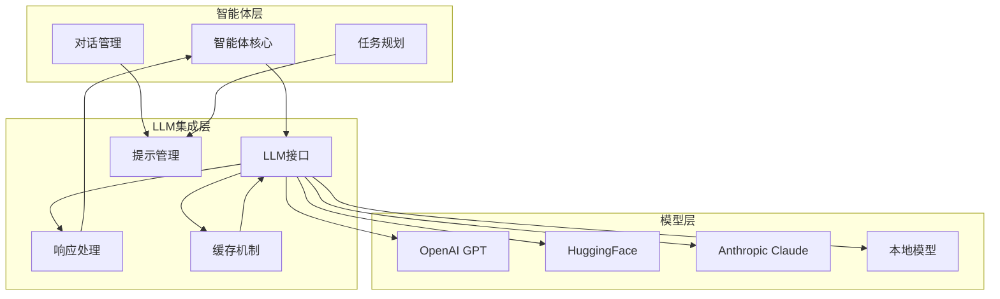

# 16.5 LLM集成：语言理解与生成

> **设计思想**：构建灵活的LLM集成框架，实现智能体与大语言模型的无缝对接

## 本节概述

大语言模型（LLM）是现代智能体系统的核心引擎，它提供了强大的语言理解和生成能力。本节将设计并实现一个灵活的LLM集成框架，支持多种大语言模型的接入，提供统一的接口和高效的调用机制，同时确保系统的可扩展性和可维护性。

## 学习目标

完成本节学习后，你将：

- ✅ **理解LLM集成的核心概念**：掌握LLM接口设计和封装原则
- ✅ **掌握提示工程和上下文管理**：学会构建有效的提示和管理对话上下文
- ✅ **实现响应解析和后处理**：掌握LLM输出的解析和格式化技术
- ✅ **掌握性能优化和缓存机制**：学会提升LLM调用效率的方法
- ✅ **具备多模型支持能力**：能够集成不同厂商和类型的LLM
- ✅ **掌握错误处理和重试机制**：实现健壮的LLM调用处理

## LLM集成的核心概念

### LLM集成架构



### LLM集成的关键组件

1. **LLM接口层**：提供统一的模型调用接口
2. **提示工程**：构建和优化输入提示
3. **上下文管理**：维护对话历史和状态
4. **响应处理**：解析和格式化模型输出
5. **缓存机制**：提升重复调用的效率
6. **错误处理**：确保系统的稳定性和可靠性

## LLM接口设计和封装

### 统一接口定义

```java
public abstract class LanguageModel {
    protected String modelId;
    protected LLMConfig config;
    protected LLMLogger logger;
    protected Cache<String, LLMResponse> responseCache;
    
    public LanguageModel(String modelId, LLMConfig config) {
        this.modelId = modelId;
        this.config = config;
        this.logger = new LLMLogger(modelId);
        this.responseCache = new LRUCache<>(config.getCacheSize());
    }
    
    // 核心生成方法
    public abstract LLMResponse generate(String prompt) throws LLMException;
    public abstract LLMResponse generate(ChatHistory history) throws LLMException;
    public abstract LLMResponse generateWithTools(String prompt, List<Tool> tools) throws LLMException;
    
    // 流式生成方法
    public abstract Stream<LLMResponseChunk> generateStream(String prompt) throws LLMException;
    
    // 嵌入向量生成
    public abstract float[] generateEmbedding(String text) throws LLMException;
    
    // 模型信息获取
    public String getModelId() { return modelId; }
    public LLMConfig getConfig() { return config; }
    public ModelInfo getModelInfo() { return new ModelInfo(modelId, config); }
    
    // 缓存管理
    protected void cacheResponse(String cacheKey, LLMResponse response) {
        if (config.isCachingEnabled()) {
            responseCache.put(cacheKey, response);
        }
    }
    
    protected LLMResponse getCachedResponse(String cacheKey) {
        if (config.isCachingEnabled()) {
            return responseCache.get(cacheKey);
        }
        return null;
    }
    
    // 工具支持检查
    public boolean supportsTools() {
        return config.isToolSupportEnabled();
    }
}

public class LLMConfig {
    private double temperature = 0.7;
    private int maxTokens = 2048;
    private double topP = 1.0;
    private int topK = 50;
    private int cacheSize = 1000;
    private boolean cachingEnabled = true;
    private boolean toolSupportEnabled = true;
    private long timeoutMs = 30000;
    private int maxRetries = 3;
    private boolean streamingEnabled = true;
    
    // Getters and setters
    public double getTemperature() { return temperature; }
    public void setTemperature(double temperature) { this.temperature = temperature; }
    public int getMaxTokens() { return maxTokens; }
    public void setMaxTokens(int maxTokens) { this.maxTokens = maxTokens; }
    public double getTopP() { return topP; }
    public void setTopP(double topP) { this.topP = topP; }
    public int getTopK() { return topK; }
    public void setTopK(int topK) { this.topK = topK; }
    public int getCacheSize() { return cacheSize; }
    public void setCacheSize(int cacheSize) { this.cacheSize = cacheSize; }
    public boolean isCachingEnabled() { return cachingEnabled; }
    public void setCachingEnabled(boolean cachingEnabled) { this.cachingEnabled = cachingEnabled; }
    public boolean isToolSupportEnabled() { return toolSupportEnabled; }
    public void setToolSupportEnabled(boolean toolSupportEnabled) { this.toolSupportEnabled = toolSupportEnabled; }
    public long getTimeoutMs() { return timeoutMs; }
    public void setTimeoutMs(long timeoutMs) { this.timeoutMs = timeoutMs; }
    public int getMaxRetries() { return maxRetries; }
    public void setMaxRetries(int maxRetries) { this.maxRetries = maxRetries; }
    public boolean isStreamingEnabled() { return streamingEnabled; }
    public void setStreamingEnabled(boolean streamingEnabled) { this.streamingEnabled = streamingEnabled; }
}

public class LLMResponse {
    private String content;
    private List<ToolCall> toolCalls;
    private String finishReason;
    private Map<String, Object> metadata;
    private long generationTime;
    private int inputTokens;
    private int outputTokens;
    
    public LLMResponse(String content) {
        this.content = content;
        this.toolCalls = new ArrayList<>();
        this.metadata = new HashMap<>();
    }
    
    public static LLMResponse withToolCalls(String content, List<ToolCall> toolCalls) {
        LLMResponse response = new LLMResponse(content);
        response.toolCalls = toolCalls != null ? toolCalls : new ArrayList<>();
        return response;
    }
    
    // Getters and setters
    public String getContent() { return content; }
    public void setContent(String content) { this.content = content; }
    public List<ToolCall> getToolCalls() { return toolCalls; }
    public void setToolCalls(List<ToolCall> toolCalls) { this.toolCalls = toolCalls; }
    public String getFinishReason() { return finishReason; }
    public void setFinishReason(String finishReason) { this.finishReason = finishReason; }
    public Map<String, Object> getMetadata() { return metadata; }
    public void addMetadata(String key, Object value) { this.metadata.put(key, value); }
    public long getGenerationTime() { return generationTime; }
    public void setGenerationTime(long generationTime) { this.generationTime = generationTime; }
    public int getInputTokens() { return inputTokens; }
    public void setInputTokens(int inputTokens) { this.inputTokens = inputTokens; }
    public int getOutputTokens() { return outputTokens; }
    public void setOutputTokens(int outputTokens) { this.outputTokens = outputTokens; }
    
    public boolean hasToolCalls() {
        return toolCalls != null && !toolCalls.isEmpty();
    }
}

public class LLMResponseChunk {
    private String content;
    private boolean isFinal;
    private String finishReason;
    
    public LLMResponseChunk(String content, boolean isFinal) {
        this.content = content;
        this.isFinal = isFinal;
    }
    
    // Getters
    public String getContent() { return content; }
    public boolean isFinal() { return isFinal; }
    public String getFinishReason() { return finishReason; }
    public void setFinishReason(String finishReason) { this.finishReason = finishReason; }
}
```

### OpenAI GPT集成实现

```java
public class OpenAILanguageModel extends LanguageModel {
    private final OpenAIClient client;
    private final String modelName;
    
    public OpenAILanguageModel(String modelName, LLMConfig config, String apiKey) {
        super("openai-" + modelName, config);
        this.modelName = modelName;
        this.client = OpenAIClient.builder()
            .apiKey(apiKey)
            .connectTimeout(Duration.ofSeconds(30))
            .readTimeout(Duration.ofSeconds(30))
            .build();
    }
    
    @Override
    public LLMResponse generate(String prompt) throws LLMException {
        String cacheKey = buildCacheKey(prompt, null);
        LLMResponse cachedResponse = getCachedResponse(cacheKey);
        if (cachedResponse != null) {
            logger.logCacheHit(modelId, prompt);
            return cachedResponse;
        }
        
        try {
            long startTime = System.currentTimeMillis();
            
            CreateChatCompletionRequest request = CreateChatCompletionRequest.builder()
                .model(modelName)
                .messages(Arrays.asList(ChatMessage.of("user", prompt)))
                .temperature(config.getTemperature())
                .maxTokens(config.getMaxTokens())
                .topP(config.getTopP())
                .build();
            
            CreateChatCompletionResponse response = withRetry(() -> 
                client.createChatCompletion(request));
            
            long endTime = System.currentTimeMillis();
            
            LLMResponse llmResponse = buildResponse(response);
            llmResponse.setGenerationTime(endTime - startTime);
            
            // 缓存响应
            cacheResponse(cacheKey, llmResponse);
            logger.logGeneration(modelId, prompt, llmResponse);
            
            return llmResponse;
        } catch (Exception e) {
            logger.logError(modelId, prompt, e);
            throw new LLMException("Failed to generate response from OpenAI", e);
        }
    }
    
    @Override
    public LLMResponse generate(ChatHistory history) throws LLMException {
        String cacheKey = buildCacheKey(null, history);
        LLMResponse cachedResponse = getCachedResponse(cacheKey);
        if (cachedResponse != null) {
            logger.logCacheHit(modelId, history.toString());
            return cachedResponse;
        }
        
        try {
            long startTime = System.currentTimeMillis();
            
            List<ChatMessage> messages = convertHistoryToMessages(history);
            
            CreateChatCompletionRequest request = CreateChatCompletionRequest.builder()
                .model(modelName)
                .messages(messages)
                .temperature(config.getTemperature())
                .maxTokens(config.getMaxTokens())
                .topP(config.getTopP())
                .build();
            
            CreateChatCompletionResponse response = withRetry(() -> 
                client.createChatCompletion(request));
            
            long endTime = System.currentTimeMillis();
            
            LLMResponse llmResponse = buildResponse(response);
            llmResponse.setGenerationTime(endTime - startTime);
            
            // 缓存响应
            cacheResponse(cacheKey, llmResponse);
            logger.logGeneration(modelId, history.toString(), llmResponse);
            
            return llmResponse;
        } catch (Exception e) {
            logger.logError(modelId, history.toString(), e);
            throw new LLMException("Failed to generate response from OpenAI", e);
        }
    }
    
    @Override
    public LLMResponse generateWithTools(String prompt, List<Tool> tools) throws LLMException {
        if (!supportsTools()) {
            return generate(prompt);
        }
        
        try {
            long startTime = System.currentTimeMillis();
            
            List<ChatMessage> messages = Arrays.asList(ChatMessage.of("user", prompt));
            List<ChatCompletionTool> chatTools = convertToolsToChatTools(tools);
            
            CreateChatCompletionRequest request = CreateChatCompletionRequest.builder()
                .model(modelName)
                .messages(messages)
                .tools(chatTools)
                .temperature(config.getTemperature())
                .maxTokens(config.getMaxTokens())
                .topP(config.getTopP())
                .build();
            
            CreateChatCompletionResponse response = withRetry(() -> 
                client.createChatCompletion(request));
            
            long endTime = System.currentTimeMillis();
            
            LLMResponse llmResponse = buildResponseWithTools(response);
            llmResponse.setGenerationTime(endTime - startTime);
            
            logger.logGenerationWithTools(modelId, prompt, tools, llmResponse);
            
            return llmResponse;
        } catch (Exception e) {
            logger.logError(modelId, prompt, e);
            throw new LLMException("Failed to generate response with tools from OpenAI", e);
        }
    }
    
    @Override
    public Stream<LLMResponseChunk> generateStream(String prompt) throws LLMException {
        if (!config.isStreamingEnabled()) {
            throw new LLMException("Streaming is not enabled for this model");
        }
        
        try {
            CreateChatCompletionRequest request = CreateChatCompletionRequest.builder()
                .model(modelName)
                .messages(Arrays.asList(ChatMessage.of("user", prompt)))
                .temperature(config.getTemperature())
                .maxTokens(config.getMaxTokens())
                .topP(config.getTopP())
                .stream(true)
                .build();
            
            Stream<CreateChatCompletionResponse> responseStream = client.streamChatCompletion(request);
            
            return responseStream.map(this::buildResponseChunk);
        } catch (Exception e) {
            logger.logError(modelId, prompt, e);
            throw new LLMException("Failed to generate streaming response from OpenAI", e);
        }
    }
    
    @Override
    public float[] generateEmbedding(String text) throws LLMException {
        try {
            CreateEmbeddingRequest request = CreateEmbeddingRequest.builder()
                .model("text-embedding-ada-002")
                .input(text)
                .build();
            
            CreateEmbeddingResponse response = withRetry(() -> 
                client.createEmbedding(request));
            
            if (response.getData() != null && !response.getData().isEmpty()) {
                return response.getData().get(0).getEmbedding().stream()
                    .mapToDouble(Double::doubleValue)
                    .toArray();
            }
            
            throw new LLMException("No embedding data returned");
        } catch (Exception e) {
            logger.logError(modelId, "Embedding generation failed for: " + text, e);
            throw new LLMException("Failed to generate embedding from OpenAI", e);
        }
    }
    
    private <T> T withRetry(Supplier<T> operation) throws Exception {
        Exception lastException = null;
        
        for (int attempt = 0; attempt <= config.getMaxRetries(); attempt++) {
            try {
                return operation.get();
            } catch (Exception e) {
                lastException = e;
                if (attempt < config.getMaxRetries()) {
                    long delay = (long) Math.pow(2, attempt) * 1000; // 指数退避
                    Thread.sleep(delay);
                    logger.logRetry(modelId, attempt + 1, e);
                }
            }
        }
        
        throw lastException;
    }
    
    private LLMResponse buildResponse(CreateChatCompletionResponse response) {
        if (response.getChoices() != null && !response.getChoices().isEmpty()) {
            ChatCompletionChoice choice = response.getChoices().get(0);
            ChatMessage message = choice.getMessage();
            
            LLMResponse llmResponse = new LLMResponse(message.getContent());
            llmResponse.setFinishReason(choice.getFinishReason());
            llmResponse.setInputTokens(response.getUsage().getPromptTokens());
            llmResponse.setOutputTokens(response.getUsage().getCompletionTokens());
            
            return llmResponse;
        }
        
        return new LLMResponse("");
    }
    
    private LLMResponse buildResponseWithTools(CreateChatCompletionResponse response) {
        if (response.getChoices() != null && !response.getChoices().isEmpty()) {
            ChatCompletionChoice choice = response.getChoices().get(0);
            ChatMessage message = choice.getMessage();
            
            List<ToolCall> toolCalls = new ArrayList<>();
            if (message.getToolCalls() != null) {
                for (ChatCompletionMessageToolCall toolCall : message.getToolCalls()) {
                    ToolCall call = new ToolCall(
                        toolCall.getFunction().getName(),
                        parseJson(toolCall.getFunction().getArguments())
                    );
                    call.setId(toolCall.getId());
                    toolCalls.add(call);
                }
            }
            
            LLMResponse llmResponse = LLMResponse.withToolCalls(
                message.getContent(), toolCalls);
            llmResponse.setFinishReason(choice.getFinishReason());
            llmResponse.setInputTokens(response.getUsage().getPromptTokens());
            llmResponse.setOutputTokens(response.getUsage().getCompletionTokens());
            
            return llmResponse;
        }
        
        return new LLMResponse("");
    }
    
    private LLMResponseChunk buildResponseChunk(CreateChatCompletionResponse response) {
        if (response.getChoices() != null && !response.getChoices().isEmpty()) {
            ChatCompletionChoice choice = response.getChoices().get(0);
            ChatMessage delta = choice.getDelta();
            
            boolean isFinal = choice.getFinishReason() != null;
            LLMResponseChunk chunk = new LLMResponseChunk(delta.getContent(), isFinal);
            chunk.setFinishReason(choice.getFinishReason());
            
            return chunk;
        }
        
        return new LLMResponseChunk("", true);
    }
    
    private String buildCacheKey(String prompt, ChatHistory history) {
        StringBuilder keyBuilder = new StringBuilder(modelId);
        if (prompt != null) {
            keyBuilder.append(":prompt:").append(prompt.hashCode());
        }
        if (history != null) {
            keyBuilder.append(":history:").append(history.hashCode());
        }
        keyBuilder.append(":config:").append(config.hashCode());
        return keyBuilder.toString();
    }
    
    private List<ChatMessage> convertHistoryToMessages(ChatHistory history) {
        List<ChatMessage> messages = new ArrayList<>();
        for (ChatMessageEntry entry : history.getMessages()) {
            messages.add(ChatMessage.of(entry.getRole(), entry.getContent()));
        }
        return messages;
    }
    
    private List<ChatCompletionTool> convertToolsToChatTools(List<Tool> tools) {
        List<ChatCompletionTool> chatTools = new ArrayList<>();
        for (Tool tool : tools) {
            ChatCompletionTool chatTool = ChatCompletionTool.builder()
                .type(ChatCompletionTool.Type.FUNCTION)
                .function(buildFunctionDefinition(tool))
                .build();
            chatTools.add(chatTool);
        }
        return chatTools;
    }
    
    private ChatCompletionFunction buildFunctionDefinition(Tool tool) {
        Map<String, Object> properties = new HashMap<>();
        Map<String, Object> required = new HashMap<>();
        
        for (ToolParameter param : tool.getParameters()) {
            Map<String, Object> paramDef = new HashMap<>();
            paramDef.put("type", param.getType().toString().toLowerCase());
            paramDef.put("description", param.getDescription());
            
            if (param.getAllowedValues() != null && !param.getAllowedValues().isEmpty()) {
                paramDef.put("enum", param.getAllowedValues());
            }
            
            properties.put(param.getName(), paramDef);
            
            if (param.isRequired()) {
                ((List<String>) required.computeIfAbsent("required", k -> new ArrayList<>()))
                    .add(param.getName());
            }
        }
        
        Map<String, Object> parameters = new HashMap<>();
        parameters.put("type", "object");
        parameters.put("properties", properties);
        parameters.put("required", required.get("required"));
        
        return ChatCompletionFunction.builder()
            .name(tool.getName())
            .description(tool.getDescription())
            .parameters(parameters)
            .build();
    }
    
    private Map<String, Object> parseJson(String json) {
        try {
            ObjectMapper mapper = new ObjectMapper();
            return mapper.readValue(json, new TypeReference<Map<String, Object>>() {});
        } catch (Exception e) {
            logger.warn("Failed to parse JSON arguments: " + json, e);
            return new HashMap<>();
        }
    }
}
```

## 提示工程和上下文管理

### 提示模板管理

```java
public class PromptTemplateManager {
    private final Map<String, PromptTemplate> templates;
    private final ReadWriteLock lock;
    
    public PromptTemplateManager() {
        this.templates = new ConcurrentHashMap<>();
        this.lock = new ReentrantReadWriteLock();
        loadDefaultTemplates();
    }
    
    private void loadDefaultTemplates() {
        // 系统提示模板
        addTemplate("system.default", new PromptTemplate(
            "You are a helpful AI assistant. Provide clear and accurate responses."
        ));
        
        // 问答提示模板
        addTemplate("qa.default", new PromptTemplate(
            "Answer the following question:\n{question}\n\nContext:\n{context}"
        ));
        
        // 总结提示模板
        addTemplate("summarize.default", new PromptTemplate(
            "Summarize the following text in {length} words:\n{text}"
        ));
        
        // 翻译提示模板
        addTemplate("translate.default", new PromptTemplate(
            "Translate the following text from {source_lang} to {target_lang}:\n{text}"
        ));
    }
    
    public void addTemplate(String name, PromptTemplate template) {
        lock.writeLock().lock();
        try {
            templates.put(name, template);
        } finally {
            lock.writeLock().unlock();
        }
    }
    
    public String renderTemplate(String templateName, Map<String, Object> variables) {
        lock.readLock().lock();
        try {
            PromptTemplate template = templates.get(templateName);
            if (template == null) {
                throw new IllegalArgumentException("Template not found: " + templateName);
            }
            return template.render(variables);
        } finally {
            lock.readLock().unlock();
        }
    }
    
    public PromptTemplate getTemplate(String name) {
        lock.readLock().lock();
        try {
            return templates.get(name);
        } finally {
            lock.readLock().unlock();
        }
    }
}

public class PromptTemplate {
    private final String template;
    private final List<String> variables;
    
    public PromptTemplate(String template) {
        this.template = template;
        this.variables = extractVariables(template);
    }
    
    public String render(Map<String, Object> variables) {
        String result = template;
        for (String variable : this.variables) {
            Object value = variables.get(variable);
            if (value != null) {
                result = result.replace("{" + variable + "}", value.toString());
            }
        }
        return result;
    }
    
    private List<String> extractVariables(String template) {
        List<String> variables = new ArrayList<>();
        Pattern pattern = Pattern.compile("\\{([^}]+)\\}");
        Matcher matcher = pattern.matcher(template);
        
        while (matcher.find()) {
            variables.add(matcher.group(1));
        }
        
        return variables;
    }
    
    public String getTemplate() { return template; }
    public List<String> getVariables() { return variables; }
}
```

### 对话历史管理

```java
public class ChatHistory {
    private final List<ChatMessageEntry> messages;
    private final int maxTokens;
    private final Tokenizer tokenizer;
    private final ReadWriteLock lock;
    
    public ChatHistory(int maxTokens, Tokenizer tokenizer) {
        this.messages = new ArrayList<>();
        this.maxTokens = maxTokens;
        this.tokenizer = tokenizer;
        this.lock = new ReentrantReadWriteLock();
    }
    
    public void addMessage(String role, String content) {
        lock.writeLock().lock();
        try {
            messages.add(new ChatMessageEntry(role, content, System.currentTimeMillis()));
            trimHistoryIfNeeded();
        } finally {
            lock.writeLock().unlock();
        }
    }
    
    public void addUserMessage(String content) {
        addMessage("user", content);
    }
    
    public void addAssistantMessage(String content) {
        addMessage("assistant", content);
    }
    
    public void addSystemMessage(String content) {
        addMessage("system", content);
    }
    
    public List<ChatMessageEntry> getMessages() {
        lock.readLock().lock();
        try {
            return new ArrayList<>(messages);
        } finally {
            lock.readLock().unlock();
        }
    }
    
    public String getFormattedHistory() {
        lock.readLock().lock();
        try {
            StringBuilder sb = new StringBuilder();
            for (ChatMessageEntry entry : messages) {
                sb.append(entry.getRole()).append(": ").append(entry.getContent()).append("\n");
            }
            return sb.toString();
        } finally {
            lock.readLock().unlock();
        }
    }
    
    private void trimHistoryIfNeeded() {
        int totalTokens = calculateTotalTokens();
        while (totalTokens > maxTokens && messages.size() > 1) {
            // 移除最早的消息（保留系统消息）
            ChatMessageEntry removed = messages.remove(1); // 0是系统消息，1是最早用户消息
            totalTokens -= tokenizer.countTokens(removed.getContent());
        }
    }
    
    private int calculateTotalTokens() {
        return messages.stream()
            .mapToInt(entry -> tokenizer.countTokens(entry.getContent()))
            .sum();
    }
    
    public void clear() {
        lock.writeLock().lock();
        try {
            messages.clear();
        } finally {
            lock.writeLock().unlock();
        }
    }
    
    public int size() {
        lock.readLock().lock();
        try {
            return messages.size();
        } finally {
            lock.readLock().unlock();
        }
    }
    
    @Override
    public String toString() {
        return getFormattedHistory();
    }
}

public class ChatMessageEntry {
    private final String role;
    private final String content;
    private final long timestamp;
    
    public ChatMessageEntry(String role, String content, long timestamp) {
        this.role = role;
        this.content = content;
        this.timestamp = timestamp;
    }
    
    // Getters
    public String getRole() { return role; }
    public String getContent() { return content; }
    public long getTimestamp() { return timestamp; }
}

public interface Tokenizer {
    int countTokens(String text);
    List<String> tokenize(String text);
    String detokenize(List<String> tokens);
}

public class SimpleTokenizer implements Tokenizer {
    @Override
    public int countTokens(String text) {
        if (text == null || text.isEmpty()) {
            return 0;
        }
        // 简单的基于空格的分词
        return text.trim().split("\\s+").length;
    }
    
    @Override
    public List<String> tokenize(String text) {
        if (text == null || text.isEmpty()) {
            return new ArrayList<>();
        }
        return Arrays.asList(text.trim().split("\\s+"));
    }
    
    @Override
    public String detokenize(List<String> tokens) {
        return String.join(" ", tokens);
    }
}
```

## 响应解析和后处理

### 响应解析器

```java
public class ResponseParser {
    private final ObjectMapper objectMapper;
    
    public ResponseParser() {
        this.objectMapper = new ObjectMapper();
        this.objectMapper.configure(DeserializationFeature.FAIL_ON_UNKNOWN_PROPERTIES, false);
    }
    
    public <T> T parseJsonResponse(String response, Class<T> targetType) throws LLMException {
        try {
            // 清理响应中的Markdown代码块标记
            String cleanedResponse = cleanJsonResponse(response);
            return objectMapper.readValue(cleanedResponse, targetType);
        } catch (Exception e) {
            throw new LLMException("Failed to parse JSON response", e);
        }
    }
    
    public <T> T parseJsonResponse(String response, TypeReference<T> typeReference) throws LLMException {
        try {
            String cleanedResponse = cleanJsonResponse(response);
            return objectMapper.readValue(cleanedResponse, typeReference);
        } catch (Exception e) {
            throw new LLMException("Failed to parse JSON response", e);
        }
    }
    
    private String cleanJsonResponse(String response) {
        if (response == null) {
            return null;
        }
        
        // 移除Markdown代码块标记
        String cleaned = response.trim();
        if (cleaned.startsWith("```json")) {
            cleaned = cleaned.substring(7);
        } else if (cleaned.startsWith("```")) {
            cleaned = cleaned.substring(3);
        }
        
        if (cleaned.endsWith("```")) {
            cleaned = cleaned.substring(0, cleaned.length() - 3);
        }
        
        return cleaned.trim();
    }
    
    public List<String> extractCodeBlocks(String response) {
        List<String> codeBlocks = new ArrayList<>();
        Pattern pattern = Pattern.compile("```(?:\\w+)?\\s*([\\s\\S]*?)```");
        Matcher matcher = pattern.matcher(response);
        
        while (matcher.find()) {
            codeBlocks.add(matcher.group(1).trim());
        }
        
        return codeBlocks;
    }
    
    public String extractFirstCodeBlock(String response) {
        List<String> codeBlocks = extractCodeBlocks(response);
        return codeBlocks.isEmpty() ? null : codeBlocks.get(0);
    }
    
    public Map<String, Object> parseKeyValuePairs(String response) {
        Map<String, Object> pairs = new HashMap<>();
        Pattern pattern = Pattern.compile("(\\w+):\\s*(.+)");
        Matcher matcher = pattern.matcher(response);
        
        while (matcher.find()) {
            String key = matcher.group(1).trim();
            String value = matcher.group(2).trim();
            pairs.put(key, value);
        }
        
        return pairs;
    }
}

public class ToolCallParser {
    private final ResponseParser responseParser;
    
    public ToolCallParser() {
        this.responseParser = new ResponseParser();
    }
    
    public List<ToolCall> parseToolCalls(String response) {
        List<ToolCall> toolCalls = new ArrayList<>();
        
        try {
            // 尝试解析JSON格式的工具调用
            if (response.contains("\"tool_calls\"") || response.contains("\"function\"")) {
                ToolCallResponse toolCallResponse = responseParser.parseJsonResponse(
                    response, ToolCallResponse.class);
                if (toolCallResponse.getToolCalls() != null) {
                    toolCalls.addAll(toolCallResponse.getToolCalls());
                }
            }
        } catch (Exception e) {
            // 如果JSON解析失败，尝试其他格式
            toolCalls.addAll(parseToolCallsFromText(response));
        }
        
        return toolCalls;
    }
    
    private List<ToolCall> parseToolCallsFromText(String response) {
        List<ToolCall> toolCalls = new ArrayList<>();
        
        // 解析类似 "Action: calculator\nAction Input: {\"expression\": \"2 + 3\"}" 的格式
        Pattern pattern = Pattern.compile("Action:\\s*(\\w+)\\s*Action Input:\\s*(\\{[^}]+\\})");
        Matcher matcher = pattern.matcher(response);
        
        while (matcher.find()) {
            String toolName = matcher.group(1).trim();
            String argumentsJson = matcher.group(2).trim();
            
            try {
                Map<String, Object> arguments = responseParser.parseJsonResponse(
                    argumentsJson, new TypeReference<Map<String, Object>>() {});
                toolCalls.add(new ToolCall(toolName, arguments));
            } catch (Exception e) {
                // 忽略解析失败的工具调用
            }
        }
        
        return toolCalls;
    }
}

class ToolCallResponse {
    private List<ToolCall> toolCalls;
    
    // Getters and setters
    public List<ToolCall> getToolCalls() { return toolCalls; }
    public void setToolCalls(List<ToolCall> toolCalls) { this.toolCalls = toolCalls; }
}
```

## 性能优化和缓存机制

### 智能缓存系统

```java
public class IntelligentCache {
    private final Map<String, CacheEntry> cache;
    private final int maxSize;
    private final long ttlMs;
    private final ReadWriteLock lock;
    private final CacheEvictionPolicy evictionPolicy;
    
    public IntelligentCache(int maxSize, long ttlMs) {
        this.maxSize = maxSize;
        this.ttlMs = ttlMs;
        this.cache = new LinkedHashMap<String, CacheEntry>(16, 0.75f, true) {
            @Override
            protected boolean removeEldestEntry(Map.Entry<String, CacheEntry> eldest) {
                return size() > maxSize;
            }
        };
        this.lock = new ReentrantReadWriteLock();
        this.evictionPolicy = new LRUEvictionPolicy();
    }
    
    public void put(String key, Object value) {
        lock.writeLock().lock();
        try {
            cache.put(key, new CacheEntry(value, System.currentTimeMillis()));
        } finally {
            lock.writeLock().unlock();
        }
    }
    
    public <T> T get(String key, Class<T> type) {
        lock.readLock().lock();
        try {
            CacheEntry entry = cache.get(key);
            if (entry != null) {
                if (System.currentTimeMillis() - entry.getTimestamp() < ttlMs) {
                    Object value = entry.getValue();
                    if (type.isInstance(value)) {
                        return type.cast(value);
                    }
                } else {
                    // 过期，异步清理
                    CompletableFuture.runAsync(() -> remove(key));
                }
            }
            return null;
        } finally {
            lock.readLock().unlock();
        }
    }
    
    public boolean contains(String key) {
        lock.readLock().lock();
        try {
            CacheEntry entry = cache.get(key);
            return entry != null && (System.currentTimeMillis() - entry.getTimestamp() < ttlMs);
        } finally {
            lock.readLock().unlock();
        }
    }
    
    public void remove(String key) {
        lock.writeLock().lock();
        try {
            cache.remove(key);
        } finally {
            lock.writeLock().unlock();
        }
    }
    
    public void clear() {
        lock.writeLock().lock();
        try {
            cache.clear();
        } finally {
            lock.writeLock().unlock();
        }
    }
    
    public int size() {
        lock.readLock().lock();
        try {
            return cache.size();
        } finally {
            lock.readLock().unlock();
        }
    }
    
    public CacheStats getStats() {
        lock.readLock().lock();
        try {
            long hits = cache.values().stream()
                .filter(entry -> System.currentTimeMillis() - entry.getTimestamp() < ttlMs)
                .count();
            return new CacheStats(cache.size(), hits);
        } finally {
            lock.readLock().unlock();
        }
    }
}

class CacheEntry {
    private final Object value;
    private final long timestamp;
    
    public CacheEntry(Object value, long timestamp) {
        this.value = value;
        this.timestamp = timestamp;
    }
    
    public Object getValue() { return value; }
    public long getTimestamp() { return timestamp; }
}

public class CacheStats {
    private final int size;
    private final long hits;
    
    public CacheStats(int size, long hits) {
        this.size = size;
        this.hits = hits;
    }
    
    public int getSize() { return size; }
    public long getHits() { return hits; }
}

interface CacheEvictionPolicy {
    <T> T selectEntryForEviction(Map<String, T> cache);
}

class LRUEvictionPolicy implements CacheEvictionPolicy {
    @Override
    public <T> T selectEntryForEviction(Map<String, T> cache) {
        // LRU策略在LinkedHashMap中已实现
        return null;
    }
}
```

### 批处理优化

```java
public class BatchProcessor {
    private final LanguageModel languageModel;
    private final int batchSize;
    private final long batchTimeoutMs;
    private final ExecutorService executorService;
    private final Queue<BatchRequest> requestQueue;
    private final ScheduledExecutorService scheduler;
    
    public BatchProcessor(LanguageModel languageModel, int batchSize, long batchTimeoutMs) {
        this.languageModel = languageModel;
        this.batchSize = batchSize;
        this.batchTimeoutMs = batchTimeoutMs;
        this.executorService = Executors.newFixedThreadPool(4);
        this.requestQueue = new ConcurrentLinkedQueue<>();
        this.scheduler = Executors.newScheduledThreadPool(1);
        
        // 启动批处理调度器
        startBatchScheduler();
    }
    
    public CompletableFuture<LLMResponse> submitRequest(String prompt) {
        CompletableFuture<LLMResponse> future = new CompletableFuture<>();
        BatchRequest request = new BatchRequest(prompt, future);
        requestQueue.offer(request);
        return future;
    }
    
    private void startBatchScheduler() {
        scheduler.scheduleAtFixedRate(this::processBatch, 0, batchTimeoutMs, TimeUnit.MILLISECONDS);
    }
    
    private void processBatch() {
        if (requestQueue.isEmpty()) {
            return;
        }
        
        List<BatchRequest> batch = new ArrayList<>();
        int count = 0;
        
        // 收集一批请求
        while (count < batchSize && !requestQueue.isEmpty()) {
            BatchRequest request = requestQueue.poll();
            if (request != null) {
                batch.add(request);
                count++;
            }
        }
        
        if (!batch.isEmpty()) {
            executorService.submit(() -> processBatchRequests(batch));
        }
    }
    
    private void processBatchRequests(List<BatchRequest> batch) {
        try {
            // 构建批处理提示
            String batchPrompt = buildBatchPrompt(batch);
            
            // 生成响应
            LLMResponse response = languageModel.generate(batchPrompt);
            
            // 解析并分发响应
            distributeBatchResponse(batch, response);
        } catch (Exception e) {
            // 处理错误
            handleBatchError(batch, e);
        }
    }
    
    private String buildBatchPrompt(List<BatchRequest> batch) {
        StringBuilder sb = new StringBuilder();
        sb.append("Process the following requests:\n\n");
        
        for (int i = 0; i < batch.size(); i++) {
            sb.append("Request ").append(i + 1).append(": ")
              .append(batch.get(i).getPrompt()).append("\n\n");
        }
        
        sb.append("Provide responses in the same order, numbered accordingly.");
        return sb.toString();
    }
    
    private void distributeBatchResponse(List<BatchRequest> batch, LLMResponse response) {
        // 解析批处理响应并分发给各个请求
        String[] responses = parseBatchResponse(response.getContent(), batch.size());
        
        for (int i = 0; i < batch.size(); i++) {
            BatchRequest request = batch.get(i);
            String individualResponse = i < responses.length ? responses[i] : "";
            request.getFuture().complete(new LLMResponse(individualResponse));
        }
    }
    
    private String[] parseBatchResponse(String batchResponse, int expectedCount) {
        // 简单解析批处理响应
        return batchResponse.split("\n\\d+\\.\\s*");
    }
    
    private void handleBatchError(List<BatchRequest> batch, Exception e) {
        for (BatchRequest request : batch) {
            request.getFuture().completeExceptionally(e);
        }
    }
    
    public void shutdown() {
        scheduler.shutdown();
        executorService.shutdown();
    }
}

class BatchRequest {
    private final String prompt;
    private final CompletableFuture<LLMResponse> future;
    
    public BatchRequest(String prompt, CompletableFuture<LLMResponse> future) {
        this.prompt = prompt;
        this.future = future;
    }
    
    public String getPrompt() { return prompt; }
    public CompletableFuture<LLMResponse> getFuture() { return future; }
}
```

## LLM集成到智能体系统

### LLM管理组件

```java
public class LLMManagementComponent extends AgentComponent {
    private LanguageModel languageModel;
    private PromptTemplateManager promptManager;
    private ResponseParser responseParser;
    private ChatHistory chatHistory;
    private ToolCallParser toolCallParser;
    private BatchProcessor batchProcessor;
    
    public LLMManagementComponent() {
        super("LLMManagement");
    }
    
    @Override
    public void initialize(AgentContext context, EventBus eventBus) {
        // 初始化LLM
        this.languageModel = createLanguageModel();
        
        // 初始化提示管理器
        this.promptManager = new PromptTemplateManager();
        
        // 初始化响应解析器
        this.responseParser = new ResponseParser();
        
        // 初始化对话历史
        this.chatHistory = new ChatHistory(4096, new SimpleTokenizer());
        
        // 初始化工具调用解析器
        this.toolCallParser = new ToolCallParser();
        
        // 初始化批处理器
        this.batchProcessor = new BatchProcessor(languageModel, 10, 1000);
        
        logger.info("LLM Management component initialized");
    }
    
    private LanguageModel createLanguageModel() {
        // 根据配置创建相应的LLM实例
        String modelType = System.getenv("LLM_MODEL_TYPE");
        String apiKey = System.getenv("LLM_API_KEY");
        
        LLMConfig config = new LLMConfig();
        config.setTemperature(0.7);
        config.setMaxTokens(2048);
        config.setCachingEnabled(true);
        
        if ("openai".equalsIgnoreCase(modelType)) {
            return new OpenAILanguageModel("gpt-3.5-turbo", config, apiKey);
        } else {
            // 默认使用模拟模型用于测试
            return new MockLanguageModel("mock-model", config);
        }
    }
    
    @Override
    public void process(AgentRequest request, AgentResponse response) {
        try {
            // 构建提示
            String prompt = buildPrompt(request);
            
            // 添加到对话历史
            chatHistory.addUserMessage(prompt);
            
            // 生成响应
            LLMResponse llmResponse = generateResponse(prompt);
            
            // 添加到对话历史
            chatHistory.addAssistantMessage(llmResponse.getContent());
            
            // 设置响应内容
            response.setOutput(llmResponse.getContent());
            
            // 解析工具调用
            List<ToolCall> toolCalls = toolCallParser.parseToolCalls(llmResponse.getContent());
            if (!toolCalls.isEmpty()) {
                for (ToolCall toolCall : toolCalls) {
                    response.addToolCall(toolCall);
                }
            }
            
            // 发布事件
            publishEvent(new LLMResponseEvent(this, llmResponse, request));
            
        } catch (Exception e) {
            logger.error("Failed to process LLM request", e);
            response.setOutput("Sorry, I encountered an error processing your request.");
            response.setType(ResponseType.ERROR);
        }
    }
    
    private String buildPrompt(AgentRequest request) {
        // 构建包含上下文的提示
        StringBuilder promptBuilder = new StringBuilder();
        
        // 添加系统提示
        promptBuilder.append("You are a helpful AI assistant.\n\n");
        
        // 添加对话历史
        String history = chatHistory.getFormattedHistory();
        if (!history.isEmpty()) {
            promptBuilder.append("Conversation history:\n").append(history).append("\n\n");
        }
        
        // 添加当前请求
        promptBuilder.append("Current request: ").append(request.getInput());
        
        return promptBuilder.toString();
    }
    
    private LLMResponse generateResponse(String prompt) throws LLMException {
        // 根据配置决定是否使用批处理
        if (shouldUseBatchProcessing(prompt)) {
            return batchProcessor.submitRequest(prompt).join();
        } else {
            return languageModel.generate(prompt);
        }
    }
    
    private boolean shouldUseBatchProcessing(String prompt) {
        // 简单策略：短提示使用批处理
        return prompt.length() < 100;
    }
    
    @Override
    public void cleanup() {
        if (batchProcessor != null) {
            batchProcessor.shutdown();
        }
    }
    
    // 公共API
    public LanguageModel getLanguageModel() {
        return languageModel;
    }
    
    public ChatHistory getChatHistory() {
        return chatHistory;
    }
    
    public void clearChatHistory() {
        chatHistory.clear();
    }
    
    public <T> T parseJsonResponse(String response, Class<T> targetType) throws LLMException {
        return responseParser.parseJsonResponse(response, targetType);
    }
}

// 模拟语言模型用于测试
class MockLanguageModel extends LanguageModel {
    public MockLanguageModel(String modelId, LLMConfig config) {
        super(modelId, config);
    }
    
    @Override
    public LLMResponse generate(String prompt) throws LLMException {
        // 模拟响应生成
        try {
            Thread.sleep(100); // 模拟处理时间
        } catch (InterruptedException e) {
            Thread.currentThread().interrupt();
        }
        
        String response = "This is a mock response for: " + prompt;
        return new LLMResponse(response);
    }
    
    @Override
    public LLMResponse generate(ChatHistory history) throws LLMException {
        return generate(history.getFormattedHistory());
    }
    
    @Override
    public LLMResponse generateWithTools(String prompt, List<Tool> tools) throws LLMException {
        return generate(prompt);
    }
    
    @Override
    public Stream<LLMResponseChunk> generateStream(String prompt) throws LLMException {
        return Stream.empty();
    }
    
    @Override
    public float[] generateEmbedding(String text) throws LLMException {
        // 返回随机嵌入向量
        float[] embedding = new float[1536];
        for (int i = 0; i < embedding.length; i++) {
            embedding[i] = (float) Math.random();
        }
        return embedding;
    }
}
```

## 本节小结

本节我们设计并实现了一个完整的LLM集成框架，包括：

1. **统一接口设计**：构建了支持多种LLM的统一接口层
2. **OpenAI集成实现**：实现了与OpenAI GPT模型的完整集成
3. **提示工程和上下文管理**：提供了强大的提示模板和对话历史管理功能
4. **响应解析和后处理**：实现了智能的响应解析和格式化机制
5. **性能优化和缓存**：构建了智能缓存和批处理优化系统
6. **智能体集成**：将LLM能力无缝集成到智能体系统中

通过本节的实现，我们为智能体提供了强大的语言处理能力，使其能够：
- 理解和生成自然语言
- 维护对话上下文和历史
- 解析复杂的响应格式
- 高效地处理大量请求
- 支持多种LLM模型的接入

LLM集成是智能体系统的核心能力，它使智能体具备了类人的语言理解和表达能力，为构建更加智能和自然的AI交互体验奠定了基础。

在下一节中，我们将创建第16章的综合项目，将本章学到的所有技术整合到一个完整的智能体系统中。