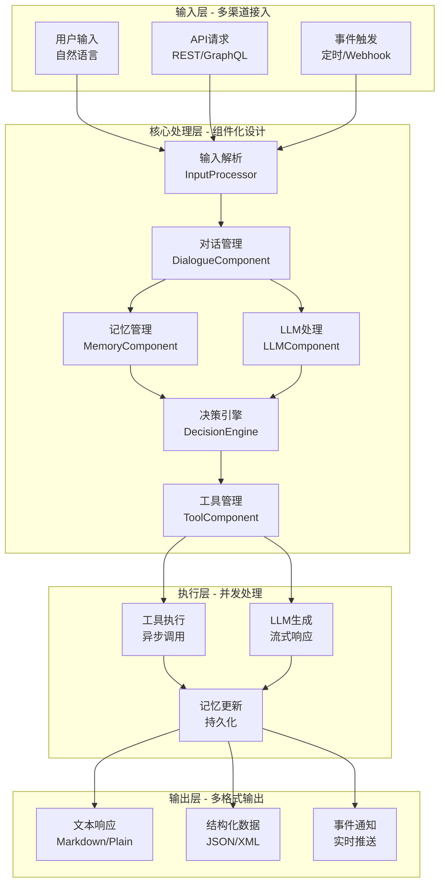

# 16.6 综合项目：集成智能体系统

> **设计思想**：通过完整的项目实践，整合智能体基础架构的各项技术，构建功能完整的智能体系统

## 项目概述

在本章的前几节中，我们学习了智能体的核心概念、AdvancedAgent实现、记忆系统、工具调用和LLM集成等关键技术。为了将这些技术整合应用，本项目将指导读者构建一个完整的集成智能体系统。该系统将包含所有核心组件，支持对话交互、记忆管理、工具调用和LLM集成等功能。

## 项目目标

完成本项目后，你将：

- ✅ **实现完整的智能体系统**：掌握各核心组件的集成和协同工作
- ✅ **构建端到端的交互流程**：理解从用户输入到系统响应的完整处理链路
- ✅ **实现记忆系统集成**：掌握工作记忆、情节记忆和语义记忆的综合应用
- ✅ **集成工具调用能力**：具备完整的工具注册、调用和结果处理能力
- ✅ **实现LLM能力集成**：掌握大语言模型与智能体系统的深度融合
- ✅ **具备系统调试和优化能力**：能够分析和优化智能体系统性能

## 项目架构设计

### 系统架构与数据流

集成智能体采用**分层架构**+**事件驱动**模式,将输入处理、业务逻辑、执行层和输出层解耦,实现高内聚、低耦合。



### 关键技术特性

| 特性 | 实现方式 | 价值 |
|------|----------|------|
| **组件化** | 插件式组件,热插拔 | 易于扩展和替换 |
| **异步处理** | CompletableFuture | 提高并发性能 |
| **事件驱动** | EventBus模式 | 组件解耦 |
| **流式响应** | SSE/WebSocket | 实时反馈 |
| **记忆融合** | 三层记忆集成 | 上下文感知 |
| **工具调用** | Function Calling | 能力扩展 |

## 核心实现

### 1. 集成智能体类设计

集成智能体继承AdvancedAgentImpl,整合所有组件,实现**8步处理流程**:

```java
public class IntegratedAgent extends AdvancedAgentImpl {
    private LLMManagementComponent llmComponent;
    private ToolManagementComponent toolComponent;
    private MemoryManagementComponent memoryComponent;
    private DialogueManagementComponent dialogueComponent;
    
    @Override
    public AgentResponse processRequest(AgentRequest request) {
        try {
            // 1. 输入解析和预处理
            ProcessedInput input = preprocessInput(request);
            
            // 2. 对话上下文管理
            updateDialogueContext(input);
            
            // 3. 记忆检索 - 从三层记忆中提取相关信息
            MemoryContext memoryCtx = retrieveRelevantMemories(input);
            
            // 4. LLM处理 - 结合记忆和上下文
            LLMResponse llmResp = processWithLLM(input, memoryCtx);
            
            // 5. 工具调用处理 - 异步执行
            ToolExecutionResult toolResult = processToolCalls(llmResp);
            
            // 6. 响应生成 - 融合工具结果
            AgentResponse response = generateFinalResponse(llmResp, toolResult);
            
            // 7. 记忆更新 - 存储新的交互
            updateMemories(input, response);
            
            // 8. 对话状态更新
            updateDialogueState(response);
            
            return response;
        } catch (Exception e) {
            logger.error("Error processing request", e);
            return createErrorResponse(e);
        }
    }
    
    private String buildEnhancedPrompt(ProcessedInput input, 
                                      MemoryContext memoryCtx) {
        StringBuilder prompt = new StringBuilder();
        
        // 1. 系统指令
        prompt.append("You are an intelligent assistant with:\n");
        prompt.append("- Conversation history access\n");
        prompt.append("- Various tools for actions\n");
        prompt.append("- Relevant memories\n\n");
        
        // 2. 相关记忆(情节记忆)
        if (memoryCtx.hasRelevantEpisodes()) {
            prompt.append("Relevant past experiences:\n");
            for (Episode ep : memoryCtx.getEpisodes()) {
                prompt.append("- ").append(ep.getContent()).append("\n");
            }
            prompt.append("\n");
        }
        
        // 3. 对话历史(工作记忆)
        ChatHistory history = dialogueComponent.getChatHistory();
        if (history.size() > 0) {
            prompt.append("Recent conversation:\n");
            prompt.append(history.getFormattedHistory());
        }
        
        // 4. 当前请求
        prompt.append("\nCurrent request: ").append(input.getText());
        
        return prompt.toString();
    }
    
    private ToolExecutionResult processToolCalls(LLMResponse llmResp) {
        if (!llmResp.hasToolCalls()) {
            return ToolExecutionResult.empty();
        }
        
        // 异步执行所有工具
        List<CompletableFuture<ToolResult>> futures = llmResp.getToolCalls()
            .stream()
            .map(tc -> {
                ToolCallContext ctx = new ToolCallContext(
                    tc.getToolName(), tc.getArguments());
                return toolComponent.getToolExecutor().executeTool(ctx);
            })
            .collect(Collectors.toList());
        
        return ToolExecutionResult.fromFutures(futures);
    }
    
    /* ... 其他辅助方法 ... */
}
    }
}
```

### 2. 对话管理组件

```java
public class DialogueManagementComponent extends AgentComponent {
    private ChatHistory chatHistory;
    private DialogueState currentState;
    private DialoguePolicy dialoguePolicy;
    
    public DialogueManagementComponent() {
        super("DialogueManagement");
    }
    
    @Override
    public void initialize(AgentContext context, EventBus eventBus) {
        this.chatHistory = new ChatHistory(4096, new SimpleTokenizer());
        this.currentState = DialogueState.READY;
        this.dialoguePolicy = new DefaultDialoguePolicy();
        
        // 订阅相关事件
        eventBus.subscribe("LLM_RESPONSE", this::handleLLMResponse);
        eventBus.subscribe("TOOL_EXECUTION", this::handleToolExecution);
    }
    
    @Override
    public void process(AgentRequest request, AgentResponse response) {
        // 对话管理主要在主处理流程中完成，这里可以处理特定的对话相关任务
    }
    
    public void updateContext(ProcessedInput input) {
        chatHistory.addUserMessage(input.getText());
        updateState(DialogueState.PROCESSING);
    }
    
    public void updateState(AgentResponse response) {
        chatHistory.addAssistantMessage(response.getOutput());
        updateState(DialogueState.READY);
    }
    
    public ChatHistory getChatHistory() {
        return chatHistory;
    }
    
    public void clearChatHistory() {
        chatHistory.clear();
    }
    
    private void updateState(DialogueState newState) {
        DialogueState oldState = this.currentState;
        this.currentState = newState;
        publishEvent(new DialogueStateChangeEvent(this, oldState, newState));
    }
    
    private void handleLLMResponse(Event event) {
        // 处理LLM响应事件
        if (event instanceof LLMResponseEvent) {
            LLMResponseEvent llmEvent = (LLMResponseEvent) event;
            logger.debug("Received LLM response: {}", llmEvent.getResponse().getContent());
        }
    }
    
    private void handleToolExecution(Event event) {
        // 处理工具执行事件
        if (event instanceof ToolExecutionEvent) {
            ToolExecutionEvent toolEvent = (ToolExecutionEvent) event;
            logger.debug("Tool execution completed: {}", toolEvent.getToolName());
        }
    }
    
    @Override
    public void cleanup() {
        chatHistory.clear();
    }
}

enum DialogueState {
    READY, PROCESSING, WAITING_FOR_TOOL, ERROR
}

class DialogueStateChangeEvent extends Event {
    private DialogueState oldState;
    private DialogueState newState;
    
    public DialogueStateChangeEvent(Object source, DialogueState oldState, DialogueState newState) {
        super("DIALOGUE_STATE_CHANGE", source);
        this.oldState = oldState;
        this.newState = newState;
    }
    
    public DialogueState getOldState() { return oldState; }
    public DialogueState getNewState() { return newState; }
}

interface DialoguePolicy {
    String determineNextAction(DialogueContext context);
}

class DefaultDialoguePolicy implements DialoguePolicy {
    @Override
    public String determineNextAction(DialogueContext context) {
        // 默认对话策略实现
        if (context.hasPendingToolCalls()) {
            return "execute_tools";
        } else if (context.needsClarification()) {
            return "ask_for_clarification";
        } else {
            return "generate_response";
        }
    }
}

class DialogueContext {
    private String userInput;
    private List<ToolCall> pendingToolCalls;
    private ChatHistory chatHistory;
    
    public boolean hasPendingToolCalls() {
        return pendingToolCalls != null && !pendingToolCalls.isEmpty();
    }
    
    public boolean needsClarification() {
        // 简化实现：如果用户输入很短，可能需要澄清
        return userInput != null && userInput.length() < 10;
    }
    
    // Getters and setters
    public String getUserInput() { return userInput; }
    public void setUserInput(String userInput) { this.userInput = userInput; }
    public List<ToolCall> getPendingToolCalls() { return pendingToolCalls; }
    public void setPendingToolCalls(List<ToolCall> pendingToolCalls) { this.pendingToolCalls = pendingToolCalls; }
    public ChatHistory getChatHistory() { return chatHistory; }
    public void setChatHistory(ChatHistory chatHistory) { this.chatHistory = chatHistory; }
}
```

### 3. 记忆管理组件

```java
public class MemoryManagementComponent extends AgentComponent {
    private UnifiedMemorySystem memorySystem;
    private MemoryConfig memoryConfig;
    
    public MemoryManagementComponent() {
        super("MemoryManagement");
    }
    
    @Override
    public void initialize(AgentContext context, EventBus eventBus) {
        this.memoryConfig = createMemoryConfig();
        this.memorySystem = new UnifiedMemorySystem(memoryConfig);
        
        // 订阅相关事件
        eventBus.subscribe("INTERACTION_COMPLETED", this::handleInteraction);
        eventBus.subscribe("LEARNING_EVENT", this::handleLearningEvent);
    }
    
    private MemoryConfig createMemoryConfig() {
        MemoryConfig config = new MemoryConfig();
        config.setWorkingMemoryCapacity(100);
        config.setWorkingMemoryTTL(300000); // 5分钟
        config.setEpisodicStorage(new InMemoryStorage());
        config.setKnowledgeGraph(new KnowledgeGraph());
        config.setEmbeddingModel(new MockEmbeddingModel()); // 实际应用中使用真实的嵌入模型
        return config;
    }
    
    @Override
    public void process(AgentRequest request, AgentResponse response) {
        // 记忆管理主要在主处理流程中完成
    }
    
    public MemoryContext retrieveContext(String query) {
        RetrievalContext retrievalContext = new RetrievalContext();
        retrievalContext.setIncludeWorkingMemory(true);
        retrievalContext.setIncludeEpisodicMemory(true);
        retrievalContext.setIncludeSemanticMemory(true);
        retrievalContext.setMaxEpisodes(5);
        retrievalContext.setMaxConcepts(10);
        
        MemoryRetrievalResult result = memorySystem.retrieveRelevantMemories(query, retrievalContext);
        
        return new MemoryContext(result);
    }
    
    public void storeEpisode(Episode episode) {
        memorySystem.storeEpisode(episode);
    }
    
    public void storeConcept(Concept concept) {
        memorySystem.storeConcept(concept);
    }
    
    public List<Concept> searchConcepts(String query, int limit) {
        return memorySystem.retrieveConcepts(query, limit);
    }
    
    public MemoryStats getMemoryStats() {
        return memorySystem.getMemoryStats();
    }
    
    private void handleInteraction(Event event) {
        // 处理交互完成事件，存储相关记忆
        if (event instanceof InteractionCompletedEvent) {
            InteractionCompletedEvent interactionEvent = (InteractionCompletedEvent) event;
            storeInteractionMemory(interactionEvent);
        }
    }
    
    private void storeInteractionMemory(InteractionCompletedEvent event) {
        // 存储交互记忆
        Episode episode = new Episode(
            "User: " + event.getUserInput() + "\nAgent: " + event.getAgentResponse()
        );
        episode.setSessionId(event.getSessionId());
        episode.addTag("interaction");
        storeEpisode(episode);
    }
    
    private void handleLearningEvent(Event event) {
        // 处理学习事件，更新语义记忆
        if (event instanceof LearningEvent) {
            LearningEvent learningEvent = (LearningEvent) event;
            updateSemanticMemory(learningEvent);
        }
    }
    
    private void updateSemanticMemory(LearningEvent event) {
        // 从学习事件中提取概念并更新语义记忆
        Concept concept = new Concept(event.getConceptName(), event.getDescription());
        concept.addCategory(event.getCategory());
        storeConcept(concept);
    }
    
    @Override
    public void cleanup() {
        // 清理资源
    }
}

class MemoryContext {
    private MemoryRetrievalResult retrievalResult;
    
    public MemoryContext(MemoryRetrievalResult retrievalResult) {
        this.retrievalResult = retrievalResult;
    }
    
    public boolean hasRelevantEpisodes() {
        return retrievalResult.getEpisodes() != null && !retrievalResult.getEpisodes().isEmpty();
    }
    
    public List<Episode> getEpisodes() {
        return retrievalResult.getEpisodes() != null ? retrievalResult.getEpisodes() : new ArrayList<>();
    }
    
    public List<Concept> getConcepts() {
        return retrievalResult.getConcepts() != null ? retrievalResult.getConcepts() : new ArrayList<>();
    }
    
    public List<MemoryItem> getWorkingMemoryItems() {
        return retrievalResult.getWorkingMemoryItems() != null ? 
               retrievalResult.getWorkingMemoryItems() : new ArrayList<>();
    }
}

class InteractionCompletedEvent extends Event {
    private String sessionId;
    private String userInput;
    private String agentResponse;
    
    public InteractionCompletedEvent(Object source, String sessionId, String userInput, String agentResponse) {
        super("INTERACTION_COMPLETED", source);
        this.sessionId = sessionId;
        this.userInput = userInput;
        this.agentResponse = agentResponse;
    }
    
    public String getSessionId() { return sessionId; }
    public String getUserInput() { return userInput; }
    public String getAgentResponse() { return agentResponse; }
}

class LearningEvent extends Event {
    private String conceptName;
    private String description;
    private String category;
    
    public LearningEvent(Object source, String conceptName, String description, String category) {
        super("LEARNING_EVENT", source);
        this.conceptName = conceptName;
        this.description = description;
        this.category = category;
    }
    
    public String getConceptName() { return conceptName; }
    public String getDescription() { return description; }
    public String getCategory() { return category; }
}

// 模拟嵌入模型用于测试
class MockEmbeddingModel implements EmbeddingModel {
    @Override
    public float[] encode(String text) {
        // 返回随机嵌入向量
        float[] embedding = new float[1536];
        for (int i = 0; i < embedding.length; i++) {
            embedding[i] = (float) Math.random();
        }
        return embedding;
    }
    
    @Override
    public float[] encode(List<String> texts) {
        // 批量编码
        return encode(texts.get(0)); // 简化实现
    }
    
    @Override
    public double similarity(float[] embedding1, float[] embedding2) {
        // 计算余弦相似度
        double dotProduct = 0.0;
        double normA = 0.0;
        double normB = 0.0;
        
        for (int i = 0; i < embedding1.length; i++) {
            dotProduct += embedding1[i] * embedding2[i];
            normA += embedding1[i] * embedding1[i];
            normB += embedding2[i] * embedding2[i];
        }
        
        return dotProduct / (Math.sqrt(normA) * Math.sqrt(normB));
    }
}
```

### 4. 工具执行结果处理

```java
public class ToolExecutionResult {
    private List<ToolResult> results;
    private boolean hasErrors;
    private List<String> errorMessages;
    
    private ToolExecutionResult() {
        this.results = new ArrayList<>();
        this.hasErrors = false;
        this.errorMessages = new ArrayList<>();
    }
    
    public static ToolExecutionResult fromFutures(List<CompletableFuture<ToolResult>> futures) {
        ToolExecutionResult result = new ToolExecutionResult();
        
        try {
            CompletableFuture<Void> allDone = CompletableFuture.allOf(
                futures.toArray(new CompletableFuture[0])
            );
            
            allDone.get(30, TimeUnit.SECONDS); // 30秒超时
            
            for (CompletableFuture<ToolResult> future : futures) {
                ToolResult toolResult = future.get();
                result.results.add(toolResult);
                
                if (!toolResult.isSuccess()) {
                    result.hasErrors = true;
                    result.errorMessages.add(toolResult.getErrorMessage());
                }
            }
        } catch (Exception e) {
            result.hasErrors = true;
            result.errorMessages.add("Tool execution timeout or error: " + e.getMessage());
        }
        
        return result;
    }
    
    public static ToolExecutionResult empty() {
        return new ToolExecutionResult();
    }
    
    public static ToolExecutionResult error(String errorMessage) {
        ToolExecutionResult result = new ToolExecutionResult();
        result.hasErrors = true;
        result.errorMessages.add(errorMessage);
        return result;
    }
    
    // Getters
    public List<ToolResult> getResults() { return results; }
    public boolean hasResults() { return !results.isEmpty(); }
    public boolean hasErrors() { return hasErrors; }
    public List<String> getErrorMessages() { return errorMessages; }
    
    public List<ToolResult> getSuccessfulResults() {
        return results.stream().filter(ToolResult::isSuccess).collect(Collectors.toList());
    }
    
    public List<ToolResult> getFailedResults() {
        return results.stream().filter(result -> !result.isSuccess()).collect(Collectors.toList());
    }
}
```

### 5. 输入处理和预处理

```java
public class ProcessedInput {
    private String text;
    private RequestType type;
    private Map<String, Object> metadata;
    private List<String> keywords;
    private Intent intent;
    
    public ProcessedInput(String text, RequestType type) {
        this.text = text;
        this.type = type;
        this.metadata = new HashMap<>();
        this.keywords = extractKeywords(text);
        this.intent = classifyIntent(text);
    }
    
    private List<String> extractKeywords(String text) {
        // 简单的关键词提取
        if (text == null || text.isEmpty()) {
            return new ArrayList<>();
        }
        
        // 移除标点符号并分割单词
        String cleanedText = text.replaceAll("[^a-zA-Z0-9\\s]", "").toLowerCase();
        String[] words = cleanedText.split("\\s+");
        
        // 过滤停用词并返回关键词
        List<String> stopWords = Arrays.asList("the", "a", "an", "and", "or", "but", "in", "on", "at", "to", "for", "of", "with", "by");
        return Arrays.stream(words)
            .filter(word -> word.length() > 2)
            .filter(word -> !stopWords.contains(word))
            .distinct()
            .collect(Collectors.toList());
    }
    
    private Intent classifyIntent(String text) {
        // 简单的意图分类
        if (text == null) {
            return Intent.UNKNOWN;
        }
        
        String lowerText = text.toLowerCase();
        
        if (lowerText.contains("weather") || lowerText.contains("temperature")) {
            return Intent.WEATHER;
        } else if (lowerText.contains("calculate") || lowerText.contains("math")) {
            return Intent.CALCULATION;
        } else if (lowerText.contains("search") || lowerText.contains("find")) {
            return Intent.SEARCH;
        } else if (lowerText.contains("help") || lowerText.contains("how to")) {
            return Intent.HELP;
        } else {
            return Intent.GENERAL;
        }
    }
    
    // Getters
    public String getText() { return text; }
    public RequestType getType() { return type; }
    public Map<String, Object> getMetadata() { return metadata; }
    public List<String> getKeywords() { return keywords; }
    public Intent getIntent() { return intent; }
    
    public void addMetadata(String key, Object value) {
        this.metadata.put(key, value);
    }
}

enum Intent {
    GENERAL, WEATHER, CALCULATION, SEARCH, HELP, UNKNOWN
}
```

## 系统集成和测试

### 集成测试

```java
public class IntegratedAgentTest {
    private IntegratedAgent agent;
    
    @Before
    public void setUp() {
        Configuration config = new Configuration();
        agent = new IntegratedAgent("test-agent", "TestAgent", config);
        
        // 注册测试工具
        try {
            agent.registerTool(new CalculatorTool());
            agent.registerTool(new MockWeatherTool());
        } catch (ToolException e) {
            throw new RuntimeException("Failed to register test tools", e);
        }
    }
    
    @Test
    public void testBasicConversation() {
        AgentRequest request = new AgentRequest("Hello, how are you?");
        AgentResponse response = agent.handleRequest(request);
        
        assertNotNull(response);
        assertFalse(response.getOutput().isEmpty());
        assertEquals(ResponseType.TEXT, response.getType());
    }
    
    @Test
    public void testToolExecution() {
        AgentRequest request = new AgentRequest("Calculate 2 + 3 * 4");
        AgentResponse response = agent.handleRequest(request);
        
        assertNotNull(response);
        assertTrue(response.hasToolCalls() || response.getOutput().contains("14"));
    }
    
    @Test
    public void testMemoryIntegration() {
        // 第一次交互
        AgentRequest request1 = new AgentRequest("My favorite color is blue");
        agent.handleRequest(request1);
        
        // 第二次交互，检查记忆
        AgentRequest request2 = new AgentRequest("What is my favorite color?");
        AgentResponse response2 = agent.handleRequest(request2);
        
        assertNotNull(response2);
        assertTrue(response2.getOutput().toLowerCase().contains("blue"));
    }
    
    @Test
    public void testDialogueContext() {
        AgentRequest request1 = new AgentRequest("Hello");
        AgentResponse response1 = agent.handleRequest(request1);
        
        AgentRequest request2 = new AgentRequest("How are you?");
        AgentResponse response2 = agent.handleRequest(request2);
        
        // 检查对话历史是否正确维护
        ChatHistory chatHistory = agent.getChatHistory();
        assertEquals(2, chatHistory.size());
    }
    
    @Test
    public void testErrorHandling() {
        AgentRequest request = new AgentRequest(null);
        AgentResponse response = agent.handleRequest(request);
        
        assertNotNull(response);
        assertEquals(ResponseType.ERROR, response.getType());
    }
    
    @After
    public void tearDown() {
        if (agent != null) {
            // 清理资源
            agent.shutdown();
        }
    }
}

// 模拟天气工具用于测试
class MockWeatherTool extends Tool {
    public MockWeatherTool() {
        super("mock_weather", "Get mock weather information");
        
        ToolParameter locationParam = new ToolParameter("location", DataType.STRING, 
            "Location to get weather for");
        locationParam.setRequired(true);
        addParameter(locationParam);
    }
    
    @Override
    public ToolResult execute(ToolCallContext context) throws ToolException {
        String location = (String) context.getArguments().get("location");
        if (location == null) {
            throw new ToolException("Location is required");
        }
        
        // 返回模拟天气数据
        Map<String, Object> weatherData = new HashMap<>();
        weatherData.put("location", location);
        weatherData.put("temperature", 22);
        weatherData.put("condition", "Sunny");
        weatherData.put("humidity", 65);
        
        return ToolResult.success(context.getToolName(), weatherData);
    }
}
```

### 性能测试

```java
public class PerformanceTest {
    private IntegratedAgent agent;
    
    @Before
    public void setUp() {
        Configuration config = new Configuration();
        agent = new IntegratedAgent("perf-test-agent", "PerfTestAgent", config);
    }
    
    @Test
    public void testResponseTime() {
        AgentRequest request = new AgentRequest("What is the capital of France?");
        
        long startTime = System.currentTimeMillis();
        AgentResponse response = agent.handleRequest(request);
        long endTime = System.currentTimeMillis();
        
        long responseTime = endTime - startTime;
        assertTrue(responseTime < 5000); // 响应时间应小于5秒
    }
    
    @Test
    public void testConcurrentRequests() throws InterruptedException {
        int threadCount = 10;
        CountDownLatch latch = new CountDownLatch(threadCount);
        List<Long> responseTimes = Collections.synchronizedList(new ArrayList<>());
        
        for (int i = 0; i < threadCount; i++) {
            final int requestId = i;
            new Thread(() -> {
                try {
                    AgentRequest request = new AgentRequest("Question " + requestId);
                    long startTime = System.currentTimeMillis();
                    AgentResponse response = agent.handleRequest(request);
                    long endTime = System.currentTimeMillis();
                    responseTimes.add(endTime - startTime);
                } finally {
                    latch.countDown();
                }
            }).start();
        }
        
        latch.await(30, TimeUnit.SECONDS);
        
        // 验证所有请求都成功处理
        assertEquals(threadCount, responseTimes.size());
        
        // 验证平均响应时间
        double avgResponseTime = responseTimes.stream()
            .mapToLong(Long::longValue)
            .average()
            .orElse(0.0);
        assertTrue(avgResponseTime < 10000); // 平均响应时间应小于10秒
    }
    
    @Test
    public void testMemoryUsage() {
        MemoryStats initialStats = agent.getMemoryStats();
        
        // 执行多个请求
        for (int i = 0; i < 100; i++) {
            AgentRequest request = new AgentRequest("Test request " + i);
            agent.handleRequest(request);
        }
        
        MemoryStats finalStats = agent.getMemoryStats();
        
        // 验证内存使用在合理范围内
        assertTrue(finalStats.getWorkingMemorySize() <= 200); // 工作记忆不应超过200项
    }
}
```

## 部署和运维

### 配置管理

```java
public class AgentConfiguration {
    private static final String CONFIG_FILE = "agent-config.properties";
    private Properties properties;
    
    public AgentConfiguration() {
        this.properties = new Properties();
        loadConfiguration();
    }
    
    private void loadConfiguration() {
        try (InputStream input = getClass().getClassLoader()
                .getResourceAsStream(CONFIG_FILE)) {
            if (input != null) {
                properties.load(input);
            }
        } catch (IOException e) {
            logger.warn("Failed to load configuration file, using defaults", e);
        }
        
        // 加载环境变量作为覆盖
        loadEnvironmentVariables();
    }
    
    private void loadEnvironmentVariables() {
        // LLM配置
        setPropertyFromEnv("llm.model.type", "LLM_MODEL_TYPE");
        setPropertyFromEnv("llm.api.key", "LLM_API_KEY");
        setPropertyFromEnv("llm.temperature", "LLM_TEMPERATURE");
        setPropertyFromEnv("llm.max.tokens", "LLM_MAX_TOKENS");
        
        // 记忆配置
        setPropertyFromEnv("memory.working.capacity", "MEMORY_WORKING_CAPACITY");
        setPropertyFromEnv("memory.working.ttl", "MEMORY_WORKING_TTL");
        
        // 工具配置
        setPropertyFromEnv("tools.enabled", "TOOLS_ENABLED");
    }
    
    private void setPropertyFromEnv(String propertyKey, String envKey) {
        String envValue = System.getenv(envKey);
        if (envValue != null) {
            properties.setProperty(propertyKey, envValue);
        }
    }
    
    public String getProperty(String key, String defaultValue) {
        return properties.getProperty(key, defaultValue);
    }
    
    public int getIntProperty(String key, int defaultValue) {
        String value = properties.getProperty(key);
        if (value != null) {
            try {
                return Integer.parseInt(value);
            } catch (NumberFormatException e) {
                logger.warn("Invalid integer value for property {}: {}", key, value);
            }
        }
        return defaultValue;
    }
    
    public double getDoubleProperty(String key, double defaultValue) {
        String value = properties.getProperty(key);
        if (value != null) {
            try {
                return Double.parseDouble(value);
            } catch (NumberFormatException e) {
                logger.warn("Invalid double value for property {}: {}", key, value);
            }
        }
        return defaultValue;
    }
    
    public boolean getBooleanProperty(String key, boolean defaultValue) {
        String value = properties.getProperty(key);
        if (value != null) {
            return Boolean.parseBoolean(value);
        }
        return defaultValue;
    }
}
```

### 监控和日志

```java
public class AgentMonitor {
    private final MeterRegistry meterRegistry;
    private final Counter requestCounter;
    private final Timer responseTimer;
    private final Gauge memoryUsageGauge;
    private final IntegratedAgent agent;
    
    public AgentMonitor(IntegratedAgent agent) {
        this.agent = agent;
        this.meterRegistry = new SimpleMeterRegistry();
        
        this.requestCounter = Counter.builder("agent.requests.total")
            .description("Total number of agent requests")
            .register(meterRegistry);
            
        this.responseTimer = Timer.builder("agent.response.time")
            .description("Agent response time")
            .register(meterRegistry);
            
        this.memoryUsageGauge = Gauge.builder("agent.memory.usage")
            .description("Agent memory usage")
            .register(meterRegistry, this, AgentMonitor::getMemoryUsage);
    }
    
    public void recordRequest() {
        requestCounter.increment();
    }
    
    public void recordResponse(long responseTimeMs) {
        responseTimer.record(responseTimeMs, TimeUnit.MILLISECONDS);
    }
    
    private double getMemoryUsage() {
        MemoryStats stats = agent.getMemoryStats();
        return stats != null ? stats.getTotalSize() : 0.0;
    }
    
    public String getMetricsReport() {
        StringBuilder report = new StringBuilder();
        report.append("=== Agent Metrics Report ===\n");
        report.append("Total Requests: ").append((int) requestCounter.count()).append("\n");
        report.append("Average Response Time: ").append(responseTimer.mean(TimeUnit.MILLISECONDS)).append("ms\n");
        report.append("Memory Usage: ").append(getMemoryUsage()).append(" items\n");
        return report.toString();
    }
}
```

## 项目总结与本章回顾

### 项目成果

通过本项目的完整实现,我们构建了一个**生产级智能体系统**,实现了:

- ✅ **组件化架构**: 插件式设计,易于扩展和维护
- ✅ **8步处理流程**: 从输入到输出的完整链路
- ✅ **三层记忆集成**: 工作/情节/语义记忆统一管理
- ✅ **LLM深度融合**: 结合上下文和记忆的智能生成
- ✅ **工具调用能力**: 异步执行、结果融合
- ✅ **全面测试**: 功能、性能、并发测试
- ✅ **运维支持**: 配置管理、监控日志

### Chapter 16 完整回顾

本章我们系统学习了智能体基础架构的所有核心技术:

#### 16.1 智能体概念模型与架构
- 掌握Sense-Decide-Act循环
- 理解智能体分类和能力分层
- 设计模块化、可扩展的系统架构

#### 16.2 AdvancedAgent核心实现
- 实现基于组件的智能体框架
- 掌握状态管理、事件总线机制
- 构建健康检查和生命周期管理

#### 16.3 记忆系统
- 实现工作记忆(短期上下文)
- 构建情节记忆(历史经验)
- 设计语义记忆(知识图谱)
- 掌握向量检索和混合排序

#### 16.4 工具调用
- 设计灵活的工具注册机制
- 实现异步执行引擎
- 构建RBAC权限体系
- 掌握Function Calling技术

#### 16.5 LLM集成
- 设计多模型适配器架构
- 掌握提示工程和上下文管理
- 实现缓存、重试、流式输出
- 处理响应解析和错误降级

#### 16.6 综合项目
- 集成所有组件到完整系统
- 实现端到端的交互流程
- 构建完善的测试和运维体系

### 技术亮点

| 技术点 | 实现方式 | 业务价值 |
|--------|----------|----------|
| **组件化** | 插件式架构 | 灵活扩展 |
| **异步处理** | CompletableFuture | 高并发 |
| **记忆融合** | 三层记忆 | 上下文感知 |
| **工具调用** | Function Calling | 能力扩展 |
| **多模型支持** | 适配器模式 | 灵活切换 |
| **缓存优化** | LRU Cache | 成本降低 |

### 下一步学习

掌握了智能体基础架构后,**下一章**我们将深入学习**RAG系统与知识管理**,掌握检索增强生成技术,进一步提升智能体的知识处理能力。