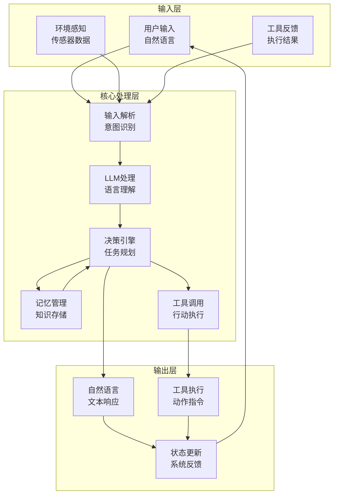

# 第16章：智能体基础架构

> **设计思想**：理解智能体的概念模型与架构设计，掌握核心智能体实现

## 章节概述

智能体（Agent）是人工智能领域的一个重要概念，它代表了一个能够感知环境、进行决策并采取行动的实体。在大语言模型时代，智能体系统将LLM的强大语言理解和生成能力与外部工具的执行能力相结合，构建出能够自主完成复杂任务的智能系统。

本章将从智能体的基本概念出发，深入探讨智能体的核心架构设计，包括记忆系统、工具调用和LLM集成等关键技术，为后续章节的学习奠定基础。

## 学习目标

完成本章学习后，你将：

- ✅ **理解智能体的基本概念**：掌握智能体的定义、特征和分类
- ✅ **掌握智能体架构设计**：理解智能体的核心组件和工作流程
- ✅ **实现AdvancedAgent核心**：掌握智能体核心功能的实现方法
- ✅ **构建记忆系统**：理解工作记忆、情节记忆和语义记忆的实现
- ✅ **掌握工具调用技术**：学会如何赋予智能体行动能力
- ✅ **集成LLM能力**：掌握语言模型与智能体系统的集成方法

## 章节内容

### 16.1 智能体的概念模型与架构设计
**学习重点**：理解智能体的基本概念和核心架构
- 智能体的定义和基本特征
- 智能体的分类和应用场景
- 智能体核心架构设计原则
- 感知-决策-行动循环

### 16.2 AdvancedAgent：核心智能体实现
**学习重点**：掌握智能体核心功能的实现
- Agent类的基本设计
- 状态管理和生命周期控制
- 输入处理和输出生成
- 错误处理和异常管理

### 16.3 记忆系统：工作记忆、情节记忆与语义记忆
**学习重点**：构建完整的记忆管理系统
- 工作记忆：短期信息存储和处理
- 情节记忆：历史交互记录管理
- 语义记忆：知识和概念存储
- 记忆检索和更新机制

### 16.4 工具调用：赋予智能体行动能力
**学习重点**：实现智能体的工具调用功能
- 工具注册和管理机制
- 工具调用的解析和执行
- 工具执行结果的处理
- 安全性和权限控制

### 16.5 LLM集成：语言理解与生成
**学习重点**：掌握语言模型与智能体的集成
- LLM接口设计和封装
- 提示工程和上下文管理
- 响应解析和后处理
- 性能优化和缓存机制

## 技术架构图

## 实践项目

**项目名称**：基础智能体系统实现

**项目目标**：
- 实现一个具备基本功能的智能体系统
- 集成记忆管理和工具调用能力
- 构建完整的对话交互流程
- 实现基本的任务规划和执行能力

**技术要求**：
- 代码质量：完整注释、单元测试覆盖率>85%
- 功能完整性：支持对话、记忆、工具调用等核心功能
- 性能要求：响应时间<1秒
- 易用性：提供简洁的API和配置接口

**预期成果**：
- 可运行的完整智能体系统
- 详细的使用文档和技术说明
- 性能测试报告和优化建议
- 扩展性设计和未来改进方向

## 本章小结

第16章将为读者建立起智能体系统的基础知识体系，从基本概念到核心实现，再到记忆系统和工具调用等关键技术。通过本章的学习，读者将具备独立开发基础智能体系统的能力，为后续章节中更高级的智能体应用奠定坚实基础。

---

**下一章预告**：第17章我们将学习RAG系统与知识管理，掌握检索增强生成的核心技术。