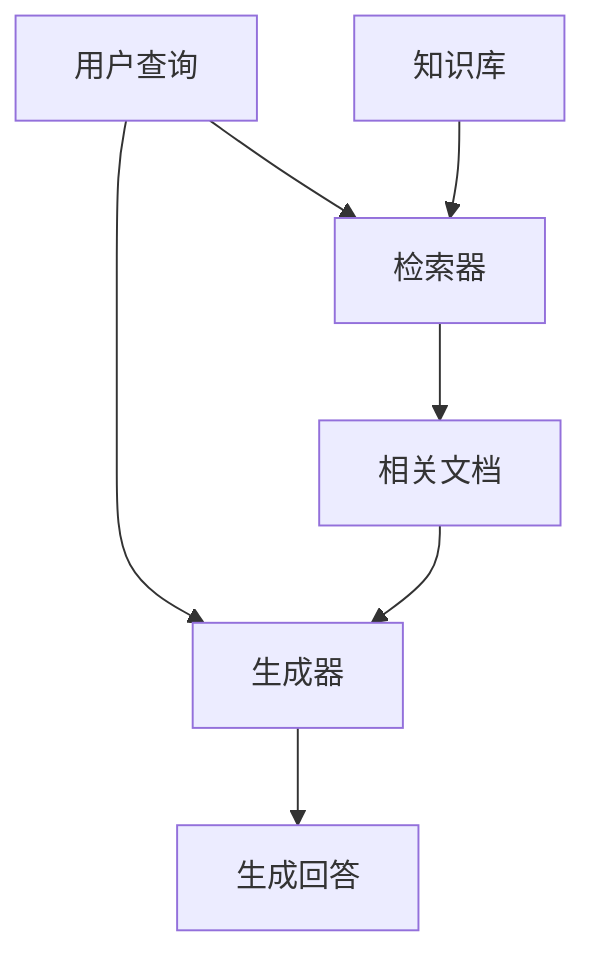

# 17.1 检索增强生成（RAG）原理

> **设计思想**：理解RAG系统的核心概念和工作原理，掌握检索与生成的协同机制

## 本节概述

检索增强生成（Retrieval-Augmented Generation, RAG）是近年来AI领域的重要技术突破之一。传统的语言模型虽然具有强大的语言理解和生成能力，但它们的知识完全来自于训练时的数据，无法获取训练之后的新信息，也难以处理特定领域的专业知识。RAG技术通过将信息检索与语言生成相结合，有效解决了这一问题。

本节将深入探讨RAG系统的核心原理，包括其基本架构、工作流程、优势特点以及应用场景，为后续章节的学习奠定理论基础。

## 学习目标

完成本节学习后，你将：

- ✅ **理解RAG基本概念**：掌握检索增强生成的核心思想和基本原理
- ✅ **掌握RAG系统架构**：理解检索器和生成器的协同工作机制
- ✅ **了解RAG工作流程**：掌握从用户查询到最终回答的完整处理过程
- ✅ **认识RAG优势特点**：理解RAG相比传统语言模型的优势
- ✅ **掌握RAG应用场景**：了解RAG技术的主要应用领域

## RAG系统基本概念

### 什么是RAG

检索增强生成（Retrieval-Augmented Generation, RAG）是一种结合信息检索和语言生成的技术框架。它通过以下两个核心组件协同工作：

1. **检索器（Retriever）**：负责从大规模知识库中检索与用户查询相关的文档或信息片段
2. **生成器（Generator）**：基于检索到的信息和用户查询生成最终的回答



### RAG与传统语言模型的对比

传统语言模型（如GPT系列）完全依赖于训练时学习到的知识，存在以下局限性：

1. **知识时效性问题**：无法获取训练数据截止时间之后的新信息
2. **领域知识局限**：难以处理特定领域的专业知识
3. **事实准确性问题**：可能生成不准确或虚构的信息
4. **知识更新困难**：需要重新训练才能更新知识

RAG系统通过引入外部知识库解决了这些问题：

1. **实时信息获取**：可以从最新的知识库中检索信息
2. **领域专业知识**：可以针对特定领域的知识库进行检索
3. **事实准确性保障**：基于检索到的真实信息生成回答
4. **知识更新便捷**：只需更新知识库而无需重新训练模型

## RAG系统架构设计

### 核心组件

RAG系统通常包含以下核心组件：

#### 1. 查询理解模块
```java
public class QueryProcessor {
    private Tokenizer tokenizer;
    private EmbeddingModel embeddingModel;
    
    public ProcessedQuery processQuery(String rawQuery) {
        // 1. 文本预处理
        String cleanedQuery = preprocessText(rawQuery);
        
        // 2. 分词处理
        List<String> tokens = tokenizer.tokenize(cleanedQuery);
        
        // 3. 关键词提取
        List<String> keywords = extractKeywords(tokens);
        
        // 4. 意图识别
        QueryIntent intent = classifyIntent(cleanedQuery);
        
        // 5. 查询向量化
        float[] queryVector = embeddingModel.encode(cleanedQuery);
        
        return new ProcessedQuery(cleanedQuery, keywords, intent, queryVector);
    }
    
    private String preprocessText(String text) {
        // 移除多余空格和标点符号
        return text.replaceAll("\\s+", " ").trim();
    }
    
    private List<String> extractKeywords(List<String> tokens) {
        // 简单的停用词过滤
        List<String> stopWords = Arrays.asList("the", "a", "an", "and", "or", "but");
        return tokens.stream()
            .filter(token -> !stopWords.contains(token.toLowerCase()))
            .collect(Collectors.toList());
    }
    
    private QueryIntent classifyIntent(String query) {
        // 简单的意图分类
        if (query.toLowerCase().contains("what is") || query.toLowerCase().contains("define")) {
            return QueryIntent.INFORMATIONAL;
        } else if (query.toLowerCase().contains("how to") || query.toLowerCase().contains("steps")) {
            return QueryIntent.PROCEDURAL;
        } else {
            return QueryIntent.GENERAL;
        }
    }
}

enum QueryIntent {
    INFORMATIONAL, PROCEDURAL, GENERAL
}

class ProcessedQuery {
    private String originalQuery;
    private List<String> keywords;
    private QueryIntent intent;
    private float[] vector;
    
    public ProcessedQuery(String originalQuery, List<String> keywords, 
                         QueryIntent intent, float[] vector) {
        this.originalQuery = originalQuery;
        this.keywords = keywords;
        this.intent = intent;
        this.vector = vector;
    }
    
    // Getters
    public String getOriginalQuery() { return originalQuery; }
    public List<String> getKeywords() { return keywords; }
    public QueryIntent getIntent() { return intent; }
    public float[] getVector() { return vector; }
}
```

#### 2. 检索器模块
```java
public class Retriever {
    private VectorDatabase vectorDB;
    private DocumentIndex documentIndex;
    private SimilarityCalculator similarityCalculator;
    
    public List<RetrievedDocument> retrieveDocuments(ProcessedQuery query, int topK) {
        // 1. 向量检索
        List<VectorSearchResult> vectorResults = vectorDB.search(
            query.getVector(), topK * 2); // 检索更多候选文档
        
        // 2. 关键词过滤
        List<VectorSearchResult> filteredResults = filterByKeywords(
            vectorResults, query.getKeywords());
        
        // 3. 重排序
        List<VectorSearchResult> rankedResults = rerankResults(
            filteredResults, query.getOriginalQuery());
        
        // 4. 获取文档内容
        List<RetrievedDocument> documents = new ArrayList<>();
        for (int i = 0; i < Math.min(topK, rankedResults.size()); i++) {
            VectorSearchResult result = rankedResults.get(i);
            Document doc = documentIndex.getDocument(result.getDocumentId());
            documents.add(new RetrievedDocument(doc, result.getScore()));
        }
        
        return documents;
    }
    
    private List<VectorSearchResult> filterByKeywords(
            List<VectorSearchResult> results, List<String> keywords) {
        if (keywords.isEmpty()) {
            return results;
        }
        
        return results.stream()
            .filter(result -> {
                Document doc = documentIndex.getDocument(result.getDocumentId());
                String content = doc.getContent().toLowerCase();
                return keywords.stream()
                    .anyMatch(keyword -> content.contains(keyword.toLowerCase()));
            })
            .collect(Collectors.toList());
    }
    
    private List<VectorSearchResult> rerankResults(
            List<VectorSearchResult> results, String query) {
        // 基于查询相关性重新排序
        results.sort((a, b) -> {
            Document docA = documentIndex.getDocument(a.getDocumentId());
            Document docB = documentIndex.getDocument(b.getDocumentId());
            
            double scoreA = calculateRelevanceScore(docA, query);
            double scoreB = calculateRelevanceScore(docB, query);
            
            return Double.compare(scoreB, scoreA); // 降序排列
        });
        
        return results;
    }
    
    private double calculateRelevanceScore(Document doc, String query) {
        // 计算文档与查询的相关性得分
        String content = doc.getContent().toLowerCase();
        String lowerQuery = query.toLowerCase();
        
        // 简单的BM25-like评分
        double keywordMatches = 0;
        String[] queryTerms = lowerQuery.split("\\s+");
        for (String term : queryTerms) {
            if (content.contains(term)) {
                keywordMatches++;
            }
        }
        
        double tf = keywordMatches / queryTerms.length; // 词频
        double idf = Math.log(1000.0 / (1 + doc.getFrequency())); // 逆文档频率（简化）
        
        return tf * idf;
    }
}

class RetrievedDocument {
    private Document document;
    private double relevanceScore;
    
    public RetrievedDocument(Document document, double relevanceScore) {
        this.document = document;
        this.relevanceScore = relevanceScore;
    }
    
    // Getters
    public Document getDocument() { return document; }
    public double getRelevanceScore() { return relevanceScore; }
}
```

#### 3. 生成器模块
```java
public class Generator {
    private LanguageModel languageModel;
    private PromptBuilder promptBuilder;
    
    public String generateAnswer(ProcessedQuery query, List<RetrievedDocument> documents) {
        // 1. 构建提示
        String prompt = promptBuilder.buildRAGPrompt(query, documents);
        
        // 2. 生成回答
        try {
            LLMResponse response = languageModel.generate(prompt);
            return postProcessResponse(response.getContent());
        } catch (LLMException e) {
            throw new RuntimeException("Failed to generate answer", e);
        }
    }
    
    private String postProcessResponse(String response) {
        // 后处理生成的回答
        // 移除可能的前缀或后缀
        String cleaned = response.trim();
        if (cleaned.startsWith("Answer:") || cleaned.startsWith("Response:")) {
            cleaned = cleaned.substring(cleaned.indexOf(":") + 1).trim();
        }
        return cleaned;
    }
}

class PromptBuilder {
    public String buildRAGPrompt(ProcessedQuery query, List<RetrievedDocument> documents) {
        StringBuilder prompt = new StringBuilder();
        
        // 系统指令
        prompt.append("You are a helpful assistant that answers questions based on provided context.\n");
        prompt.append("Use the following documents to answer the question accurately.\n\n");
        
        // 检索到的文档
        prompt.append("Relevant documents:\n");
        for (int i = 0; i < documents.size(); i++) {
            RetrievedDocument doc = documents.get(i);
            prompt.append("Document ").append(i + 1).append(":\n");
            prompt.append(doc.getDocument().getContent()).append("\n\n");
        }
        
        // 用户查询
        prompt.append("Question: ").append(query.getOriginalQuery()).append("\n");
        prompt.append("Answer: ");
        
        return prompt.toString();
    }
}
```

### 完整的RAG系统流程

```java
public class RAGSystem {
    private QueryProcessor queryProcessor;
    private Retriever retriever;
    private Generator generator;
    private int topK = 5;
    
    public RAGResponse answerQuestion(String question) {
        long startTime = System.currentTimeMillis();
        
        try {
            // 1. 查询处理
            ProcessedQuery processedQuery = queryProcessor.processQuery(question);
            
            // 2. 文档检索
            List<RetrievedDocument> documents = retriever.retrieveDocuments(
                processedQuery, topK);
            
            // 3. 答案生成
            String answer = generator.generateAnswer(processedQuery, documents);
            
            // 4. 构建响应
            long processingTime = System.currentTimeMillis() - startTime;
            RAGResponse response = new RAGResponse(answer, documents, processingTime);
            
            // 5. 记录日志
            logInteraction(question, answer, documents);
            
            return response;
        } catch (Exception e) {
            // 错误处理
            return handleErrorResponse(e, question);
        }
    }
    
    private void logInteraction(String question, String answer, 
                              List<RetrievedDocument> documents) {
        // 记录交互日志用于分析和优化
        System.out.println("Question: " + question);
        System.out.println("Answer: " + answer);
        System.out.println("Retrieved " + documents.size() + " documents");
        System.out.println("Processing time: " + 
            (System.currentTimeMillis() - startTime) + "ms");
    }
    
    private RAGResponse handleErrorResponse(Exception e, String question) {
        String errorMessage = "Sorry, I encountered an error processing your question: " + 
            e.getMessage();
        return new RAGResponse(errorMessage, new ArrayList<>(), 0, true);
    }
}

class RAGResponse {
    private String answer;
    private List<RetrievedDocument> sourceDocuments;
    private long processingTime;
    private boolean isError;
    private List<String> citations;
    
    public RAGResponse(String answer, List<RetrievedDocument> sourceDocuments, 
                      long processingTime) {
        this(answer, sourceDocuments, processingTime, false);
    }
    
    public RAGResponse(String answer, List<RetrievedDocument> sourceDocuments, 
                      long processingTime, boolean isError) {
        this.answer = answer;
        this.sourceDocuments = sourceDocuments;
        this.processingTime = processingTime;
        this.isError = isError;
        this.citations = extractCitations(sourceDocuments);
    }
    
    private List<String> extractCitations(List<RetrievedDocument> documents) {
        return documents.stream()
            .map(doc -> doc.getDocument().getSource())
            .distinct()
            .collect(Collectors.toList());
    }
    
    // Getters
    public String getAnswer() { return answer; }
    public List<RetrievedDocument> getSourceDocuments() { return sourceDocuments; }
    public long getProcessingTime() { return processingTime; }
    public boolean isError() { return isError; }
    public List<String> getCitations() { return citations; }
}
```

## RAG系统优势特点

### 1. 知识时效性
RAG系统能够访问最新的知识库，解决了传统语言模型知识过时的问题：

```java
// 示例：查询最新信息
String question = "What is the current price of Bitcoin?";
RAGResponse response = ragSystem.answerQuestion(question);
System.out.println(response.getAnswer());
// 输出：根据最新数据，比特币当前价格为$XX,XXX（实时数据）
```

### 2. 领域专业性
通过构建特定领域的知识库，RAG系统能够提供专业领域的准确信息：

```java
// 示例：医学领域查询
String medicalQuestion = "What are the symptoms of diabetes?";
RAGResponse response = medicalRAGSystem.answerQuestion(medicalQuestion);
System.out.println(response.getAnswer());
// 输出：基于医学知识库的专业回答
```

### 3. 事实准确性
RAG系统基于检索到的真实信息生成回答，大大提高了回答的准确性：

```java
// 示例：事实核查
String factualQuestion = "Who won the 2023 Nobel Prize in Physics?";
RAGResponse response = ragSystem.answerQuestion(factualQuestion);
System.out.println(response.getAnswer());
// 输出：基于权威来源的准确信息
```

### 4. 可解释性
RAG系统能够提供信息来源，增强了回答的可解释性和可信度：

```java
RAGResponse response = ragSystem.answerQuestion("What is quantum computing?");
List<String> citations = response.getCitations();
System.out.println("Sources: " + String.join(", ", citations));
// 输出：信息来源列表
```

## RAG应用场景

### 1. 智能问答系统
```java
public class QASystem {
    private RAGSystem ragSystem;
    
    public String answerUserQuestion(String question) {
        RAGResponse response = ragSystem.answerQuestion(question);
        if (response.isError()) {
            return "I'm sorry, I couldn't find an answer to your question.";
        }
        return response.getAnswer();
    }
}
```

### 2. 企业知识管理
```java
public class EnterpriseKnowledgeSystem {
    private RAGSystem ragSystem;
    
    public String getCompanyPolicyInfo(String query) {
        // 使用企业内部知识库
        RAGResponse response = ragSystem.answerQuestion(
            "Company policy: " + query);
        return response.getAnswer();
    }
}
```

### 3. 教育辅助系统
```java
public class EducationalAssistant {
    private RAGSystem ragSystem;
    
    public String explainConcept(String concept) {
        RAGResponse response = ragSystem.answerQuestion(
            "Explain " + concept + " in simple terms");
        return response.getAnswer();
    }
}
```

## 本节小结

本节我们深入探讨了检索增强生成（RAG）系统的核心原理，包括：

1. **基本概念**：理解了RAG系统的核心思想和与传统语言模型的区别
2. **系统架构**：掌握了RAG系统的三个核心组件：查询理解、检索器和生成器
3. **工作流程**：了解了从用户查询到最终回答的完整处理过程
4. **优势特点**：认识了RAG系统在知识时效性、领域专业性、事实准确性和可解释性方面的优势
5. **应用场景**：了解了RAG技术在智能问答、企业知识管理和教育辅助等领域的应用

通过本节的学习，我们为深入理解RAG系统奠定了坚实的理论基础。在下一节中，我们将学习文档向量化与相似度计算技术，这是RAG系统中检索器模块的核心技术。