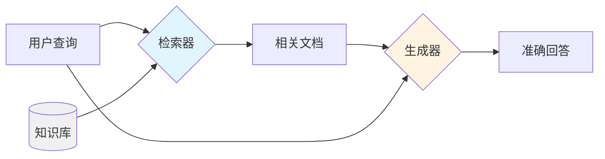
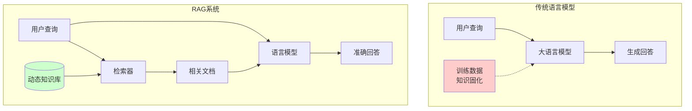
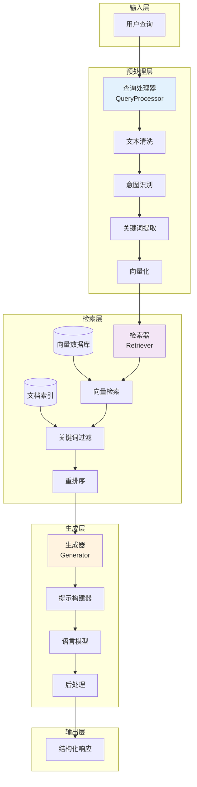
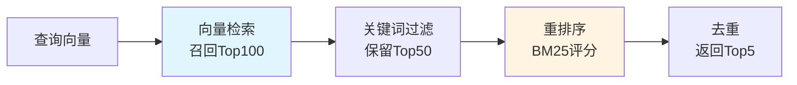
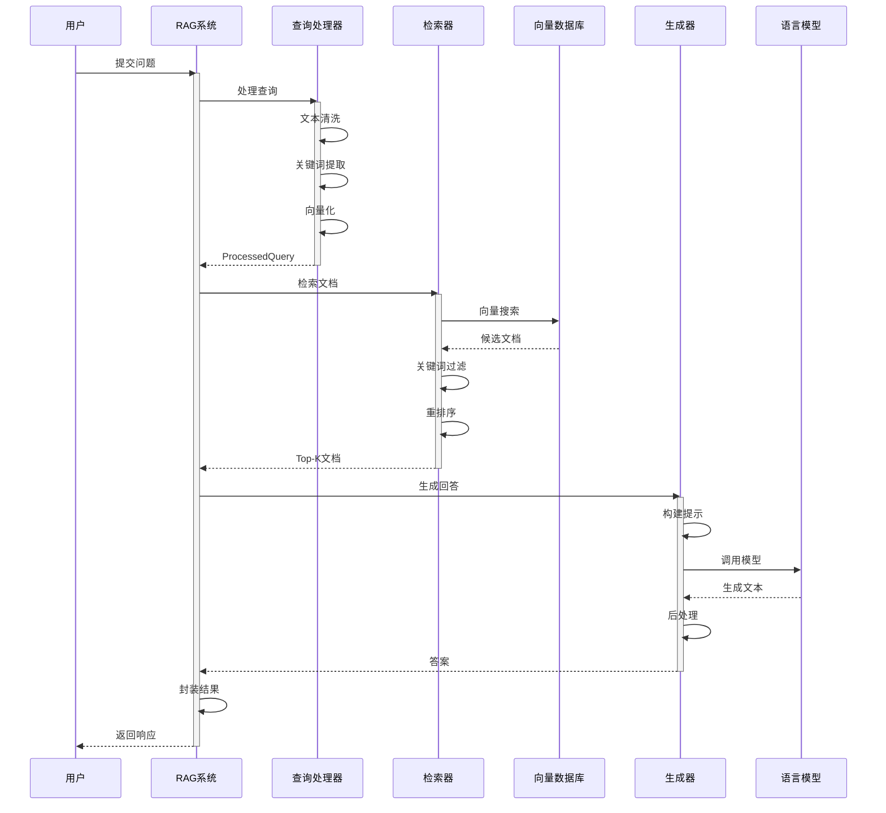
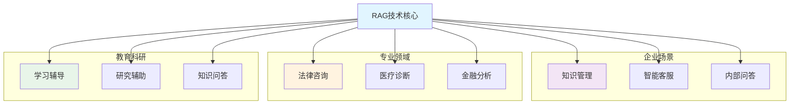

# 17.1 检索增强生成（RAG）原理

> **设计思想**：理解RAG系统的核心概念和工作原理，掌握检索与生成的协同机制

## 本节概述

检索增强生成（Retrieval-Augmented Generation, RAG）是近年来AI领域的重要技术突破之一。传统的语言模型虽然具有强大的语言理解和生成能力，但它们的知识完全来自于训练时的数据，无法获取训练之后的新信息，也难以处理特定领域的专业知识。RAG技术通过将信息检索与语言生成相结合，有效解决了这一问题。

本节将深入探讨RAG系统的核心原理，包括其基本架构、工作流程、优势特点以及应用场景，为后续章节的学习奠定理论基础。

## 学习目标

完成本节学习后，你将：

- ✅ **理解RAG基本概念**：掌握检索增强生成的核心思想和基本原理
- ✅ **掌握RAG系统架构**：理解检索器和生成器的协同工作机制
- ✅ **了解RAG工作流程**：掌握从用户查询到最终回答的完整处理过程
- ✅ **认识RAG优势特点**：理解RAG相比传统语言模型的优势
- ✅ **掌握RAG应用场景**：了解RAG技术的主要应用领域

## RAG系统基本概念

### 什么是RAG

检索增强生成（Retrieval-Augmented Generation, RAG）是一种结合信息检索和语言生成的技术框架。与传统的端到端语言模型不同，RAG采用"检索+生成"的混合架构，在生成回答之前先从外部知识库中检索相关信息，从而显著提升了生成内容的准确性和时效性。

**核心组件：**

1. **检索器（Retriever）**：负责从大规模知识库中检索与用户查询相关的文档或信息片段。检索器通常基于向量相似度或关键词匹配等技术，能够快速定位最相关的信息。

2. **生成器（Generator）**：基于检索到的信息和用户查询生成最终的回答。生成器通常是一个预训练的大语言模型（如GPT系列），它能够理解检索到的上下文并生成连贯、准确的回答。

**工作原理：**

RAG系统的工作流程可以概括为"检索-增强-生成"三个阶段：



**技术优势：**

- **知识外化**：将知识存储在可更新的外部知识库中，而非固化在模型参数中
- **可解释性强**：可以追溯信息来源，提供引用和证据
- **降低幻觉**：基于真实文档生成回答，减少模型编造信息的现象
- **动态更新**：无需重新训练模型即可更新知识库

### RAG与传统语言模型的对比

为了更好地理解RAG的价值，我们来对比一下RAG系统与传统语言模型的特点：

| 维度 | 传统语言模型 | RAG系统 |
|------|------------|--------|
| **知识来源** | 模型参数（训练时固化） | 外部知识库（可动态更新） |
| **时效性** | 受训练数据截止时间限制 | 可实时获取最新信息 |
| **准确性** | 可能产生幻觉（编造信息） | 基于检索文档，准确性更高 |
| **可解释性** | 黑盒模型，难以追溯来源 | 可提供引用来源和证据 |
| **专业性** | 通用知识，专业深度有限 | 可针对特定领域构建知识库 |
| **更新成本** | 需重新训练，成本高昂 | 仅需更新知识库，成本低 |
| **响应速度** | 快速（单次推理） | 较慢（检索+生成） |
| **资源需求** | 大模型需要大量算力 | 可使用较小模型+高效检索 |

**核心区别示意图：**



**应用场景选择：**

- **适合传统LLM**：创意写作、闲聊对话、通用任务
- **适合RAG系统**：专业问答、企业知识管理、法律咨询、医疗诊断辅助等需要准确性和可追溯性的场景

## RAG系统架构设计

### 核心组件概览

RAG系统的架构设计遵循"解耦、模块化"的原则,将复杂的问答过程分解为多个独立且可复用的组件。这种设计不仅提高了系统的可维护性,也便于针对不同场景进行定制化优化。



### 1. 查询理解模块

查询理解是RAG系统的第一步,负责将用户的自然语言查询转换为系统可处理的结构化表示。这个阶段的质量直接影响后续检索的准确性。

**核心功能:**
- **文本预处理**: 去除噪音、标准化格式
- **意图识别**: 判断查询类型(事实性、过程性、对比性等)
- **关键词提取**: 识别查询中的核心概念
- **查询扩展**: 补充同义词、相关术语
- **向量化**: 将查询转换为语义向量

**简化实现示例:**

```java
public class QueryProcessor {
    private Tokenizer tokenizer;
    private EmbeddingModel embeddingModel;
    
    public ProcessedQuery processQuery(String rawQuery) {
        // 1. 文本预处理
        String cleaned = preprocessText(rawQuery);
        
        // 2. 关键词提取
        List<String> keywords = extractKeywords(cleaned);
        
        // 3. 意图识别
        QueryIntent intent = classifyIntent(cleaned);
        
        // 4. 查询向量化
        float[] vector = embeddingModel.encode(cleaned);
        
        return new ProcessedQuery(cleaned, keywords, intent, vector);
    }
    
    private QueryIntent classifyIntent(String query) {
        // 基于关键词的简单意图分类
        if (query.contains("what is") || query.contains("define")) {
            return QueryIntent.INFORMATIONAL;  // 定义性查询
        } else if (query.contains("how to")) {
            return QueryIntent.PROCEDURAL;     // 过程性查询
        }
        return QueryIntent.GENERAL;
    }
}
```

### 2. 检索器模块

检索器是RAG系统的核心,负责从海量文档中快速定位最相关的信息。一个高效的检索器通常采用"粗筛+精排"的两阶段策略:

**检索策略:**

1. **粗筛阶段**: 使用向量相似度快速召回TopK候选文档
2. **精排阶段**: 基于多种信号(关键词匹配、BM25评分等)重新排序
3. **多样性保证**: 避免返回内容重复的文档



**核心代码示例:**

```java
public class Retriever {
    private VectorDatabase vectorDB;
    private DocumentIndex documentIndex;
    
    public List<RetrievedDocument> retrieveDocuments(ProcessedQuery query, int topK) {
        // 阶段1: 向量检索,召回更多候选文档
        List<VectorSearchResult> candidates = vectorDB.search(
            query.getVector(), topK * 2
        );
        
        // 阶段2: 关键词过滤
        List<VectorSearchResult> filtered = filterByKeywords(
            candidates, query.getKeywords()
        );
        
        // 阶段3: 重排序(基于BM25等算法)
        List<VectorSearchResult> ranked = rerankResults(
            filtered, query.getOriginalQuery()
        );
        
        // 阶段4: 构建最终结果
        return ranked.stream()
            .limit(topK)
            .map(result -> new RetrievedDocument(
                documentIndex.getDocument(result.getDocumentId()),
                result.getScore()
            ))
            .collect(Collectors.toList());
    }
    
    // BM25相关性评分(简化版)
    private double calculateRelevanceScore(Document doc, String query) {
        String content = doc.getContent().toLowerCase();
        String[] queryTerms = query.toLowerCase().split("\\s+");
        
        double score = 0;
        for (String term : queryTerms) {
            if (content.contains(term)) {
                score += Math.log(1 + doc.getTermFrequency(term));
            }
        }
        return score;
    }
}
```

### 3. 生成器模块

生成器将检索到的文档与用户查询相结合,生成自然、准确的回答。这个过程中最关键的是**提示工程**(Prompt Engineering),即如何将检索到的信息有效地传递给语言模型。

**提示设计原则:**

1. **结构化**: 明确区分系统指令、上下文信息和用户问题
2. **简洁性**: 避免冗余信息,提取文档关键内容
3. **引用要求**: 明确要求模型基于提供的文档回答
4. **格式约束**: 指定回答的格式和风格

**提示模板示例:**

```java
public class PromptBuilder {
    
    public String buildRAGPrompt(ProcessedQuery query, 
                                 List<RetrievedDocument> documents) {
        StringBuilder prompt = new StringBuilder();
        
        // 1. 系统指令 - 定义角色和行为规范
        prompt.append("You are a helpful assistant. ");
        prompt.append("Answer based ONLY on the provided documents. ");
        prompt.append("If the answer is not in the documents, say so.\n\n");
        
        // 2. 上下文文档 - 提供事实依据
        prompt.append("=== Reference Documents ===\n");
        for (int i = 0; i < documents.size(); i++) {
            RetrievedDocument doc = documents.get(i);
            prompt.append(String.format("[Doc %d] %s\n\n", 
                i + 1, doc.getDocument().getContent()));
        }
        
        // 3. 用户问题 - 明确任务
        prompt.append("=== Question ===\n");
        prompt.append(query.getOriginalQuery()).append("\n\n");
        
        // 4. 输出要求 - 引导格式
        prompt.append("=== Answer ===\n");
        
        return prompt.toString();
    }
}

public class Generator {
    private LanguageModel languageModel;
    private PromptBuilder promptBuilder;
    
    public String generateAnswer(ProcessedQuery query, 
                                 List<RetrievedDocument> documents) {
        // 1. 构建提示
        String prompt = promptBuilder.buildRAGPrompt(query, documents);
        
        // 2. 调用LLM生成
        LLMResponse response = languageModel.generate(prompt);
        
        // 3. 后处理(清洗格式、提取关键信息)
        return postProcessResponse(response.getContent());
    }
}
```

**提示优化技巧:**

- **Few-shot Learning**: 在提示中包含示例问答
- **Chain-of-Thought**: 引导模型逐步推理
- **角色设定**: 指定专业角色(如医生、律师)
- **约束条件**: 明确回答长度、语言风格等要求


### 完整的RAG系统流程

下面展示一个RAG系统的完整工作流程,包括错误处理、性能监控和结果封装:



**核心实现:**

```java
public class RAGSystem {
    private QueryProcessor queryProcessor;
    private Retriever retriever;
    private Generator generator;
    private int topK = 5;
    
    public RAGResponse answerQuestion(String question) {
        long startTime = System.currentTimeMillis();
        
        try {
            // 步骤1: 查询理解
            ProcessedQuery processedQuery = queryProcessor.processQuery(question);
            
            // 步骤2: 文档检索
            List<RetrievedDocument> documents = retriever.retrieveDocuments(
                processedQuery, topK);
            
            // 步骤3: 答案生成
            String answer = generator.generateAnswer(processedQuery, documents);
            
            // 步骤4: 结果封装
            long processingTime = System.currentTimeMillis() - startTime;
            return new RAGResponse(answer, documents, processingTime);
            
        } catch (Exception e) {
            return new RAGResponse(
                "Sorry, I encountered an error: " + e.getMessage(),
                new ArrayList<>(), 0, true
            );
        }
    }
}

// 结果封装类
class RAGResponse {
    private String answer;                          // 生成的答案
    private List<RetrievedDocument> sources;        // 参考文档
    private long processingTime;                    // 处理时间(毫秒)
    private boolean isError;                        // 是否错误
    private List<String> citations;                 // 引用信息
    
    public RAGResponse(String answer, List<RetrievedDocument> sources, 
                      long processingTime) {
        this(answer, sources, processingTime, false);
    }
    
    public RAGResponse(String answer, List<RetrievedDocument> sources,
                      long processingTime, boolean isError) {
        this.answer = answer;
        this.sources = sources;
        this.processingTime = processingTime;
        this.isError = isError;
        this.citations = extractCitations(sources);
    }
    
    private List<String> extractCitations(List<RetrievedDocument> docs) {
        return docs.stream()
            .map(doc -> doc.getDocument().getSource())
            .distinct()
            .collect(Collectors.toList());
    }
    
    // Getters...
}
```

## RAG系统优势与挑战

### 核心优势

#### 1. 知识时效性

RAG系统能够访问实时更新的知识库,解决了传统语言模型知识过时的问题。例如,查询最新的股票价格、新闻事件或政策变化时,RAG系统可以从更新的知识库中获取最新信息。

#### 2. 领域专业性

通过构建特定领域的知识库,RAG系统能够提供专业领域的准确信息。比如医疗诊断辅助系统可以基于最新的医学文献和临床指南,法律咨询系统可以基于最新的法律条文和判例。

#### 3. 事实准确性

RAG系统基于检索到的真实文档生成回答,大大降低了语言模型产生“幻觉”(编造信息)的问题。每个回答都有明确的文档来源作为支撑。

#### 4. 可解释性与可追溯性

RAG系统能够提供信息来源,增强了回答的可解释性和可信度。用户可以查看引用的文档,验证回答的准确性。

#### 5. 知识更新便捷

更新RAG系统的知识只需更新知识库,无需重新训练模型。这大大降低了知识更新的成本和时间。

### 面临的挑战

#### 1. 检索质量问题

检索质量直接影响生成结果。如果检索不到相关文档,或者检索到的文档不相关,都会导致回答质量下降。

**解决方案:**
- 使用高质量的嵌入模型
- 采用混合检索策略(向量检索+关键词检索)
- 定期评估和优化检索算法

#### 2. 上下文窗口限制

语言模型的上下文窗口有限,无法将所有相关文档都传入模型。需要在信息完整性和窗口限制之间取得平衡。

**解决方案:**
- 文档分块(Chunking)策略
- 智能摘要提取
- 分层检索和过滤

#### 3. 响应延迟

RAG系统需要先检索再生成,响应时间比直接生成更长。

**解决方案:**
- 优化向量检索算法(ANN)
- 异步处理和流式输出
- 缓存高频查询结果

#### 4. 成本问题

构建和维护高质量的知识库需要持续的投入,包括数据清洗、标注、存储和索引等。

**解决方案:**
- 自动化文档处理流程
- 使用开源向量数据库
- 增量更新策略

## RAG应用场景

RAG技术在众多领域都有广泛的应用，以下是一些典型场景：

### 1. 企业知识管理

企业内部通常积累了大量的文档、政策、流程等知识。RAG系统可以帮助员工快速查找和获取所需信息。

**应用价值:**
- 提高员工工作效率
- 减少重复性咨询
- 促进知识共享和传承
- 降低新员工培训成本

### 2. 智能客服系统

基于产品文档、常见问题和历史客服记录构建RAG系统，可以提供24/7的智能客服服务。

**应用价值:**
- 降低人工客服成本
- 提供一致性的服务质量
- 快速响应客户咨询
- 支持多语言服务

### 3. 法律与医疗咨询

在法律和医疗领域，准确性和可追溯性至关重要。RAG系统可以基于权威文献提供专业建议。

**应用价值:**
- 提供有据可查的专业建议
- 辅助专业人员决策
- 减少信息查找时间
- 降低专业错误风险

### 4. 教育辅助系统

RAG系统可以基于教材、课件和参考资料，为学生提供个性化的学习辅导。

**应用价值:**
- 个性化学习辅导
- 24/7问答服务
- 提供权威参考资料
- 提高学习效率

### 5. 研究辅助工具

帮助研究人员快速检索和理解文献，发现研究趋势和知识缺口。

**应用价值:**
- 加速文献综述
- 发现相关研究
- 提高研究效率
- 促进跨学科发现

### 应用场景对比



## 本节小结

本节我们系统地学习了检索增强生成（RAG）系统的核心原理,主要内容包括:

### 核心知识点

1. **RAG基本概念**
   - RAG是“检索+生成”的混合架构
   - 由检索器和生成器两大核心组件构成
   - 相比传统LLM,具有知识外化、可追溯、准确性高等优势

2. **系统架构设计**
   - **查询理解模块**: 将自然语言查询转换为结构化表示
   - **检索器模块**: 采用“粗筛+精排”策略实现高效检索
   - **生成器模块**: 通过精心设计的提示工程生成高质量回答

3. **核心优势**
   - 知识时效性: 可实时获取最新信息
   - 领域专业性: 支持特定领域深度知识
   - 事实准确性: 基于真实文档降低幻觉
   - 可解释性: 提供可验证的信息来源
   - 更新便捷: 无需重训模型

4. **应用场景**
   - 企业知识管理与智能客服
   - 法律与医疗专业咨询
   - 教育辅导与研究辅助

### 设计思想总结

RAG系统的设计体现了以下重要的工程思想:

1. **关注点分离**: 将知识存储与推理能力分离,各自独立优化
2. **模块化设计**: 每个组件职责单一、可独立替换和升级
3. **数据驱动**: 基于真实数据而非模型记忆，提高准确性
4. **用户中心**: 提供可解释、可验证的结果，增强信任

### 实践建议

在实际应用RAG系统时,建议:

1. **从小规模开始**: 先在小范围验证效果，再逐步扩展
2. **持续评估优化**: 定期评估检索质量和生成效果
3. **注重知识质量**: 高质量的知识库是成功的关键
4. **用户反馈闭环**: 收集用户反馈不断改进系统

### 后续学习

掌握了RAG系统的基本原理后,后续章节将深入学习:

- **17.2节**: 文档向量化与相似度计算 - 检索器的核心技术
- **17.3节**: 知识图谱构建与维护 - 结构化知识表示
- **17.4节**: 多模态检索 - 处理文本、图像、代码等多种数据
- **17.5节**: 智能推理 - 多步骤问题解决能力
- **17.6节**: 综合项目 - 构建完整的智能问答系统

通过系统学习，你将掌握构建RAG系统的完整技能链，为开发高质量的AI应用奠定坚实基础。