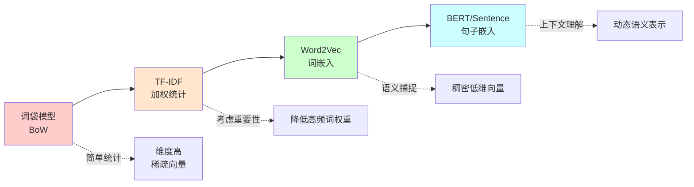
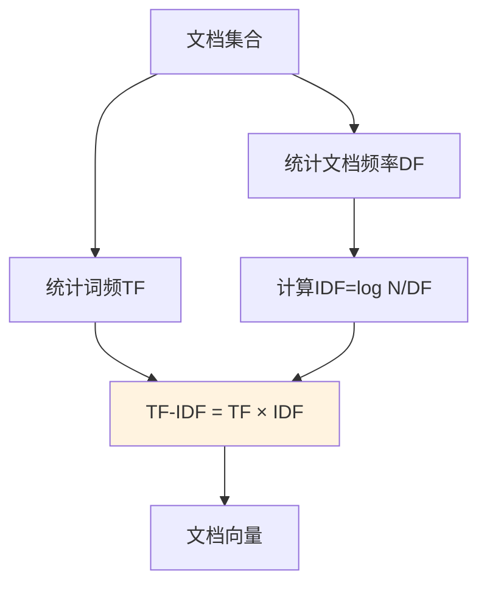
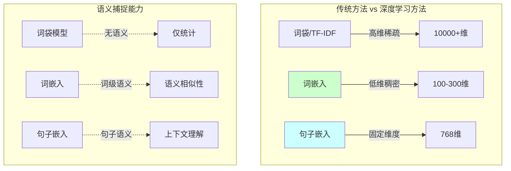
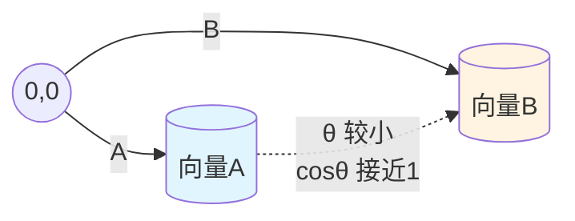
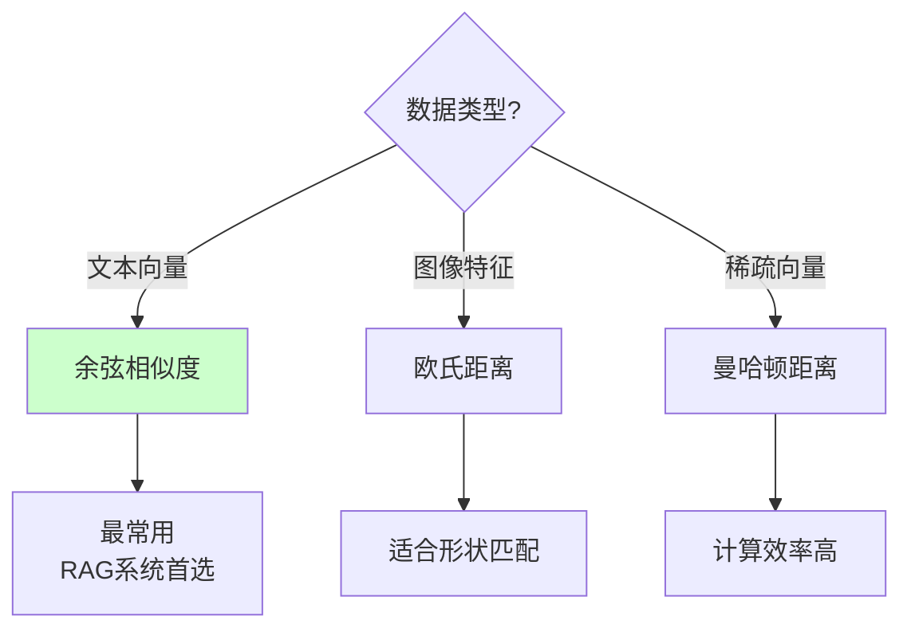
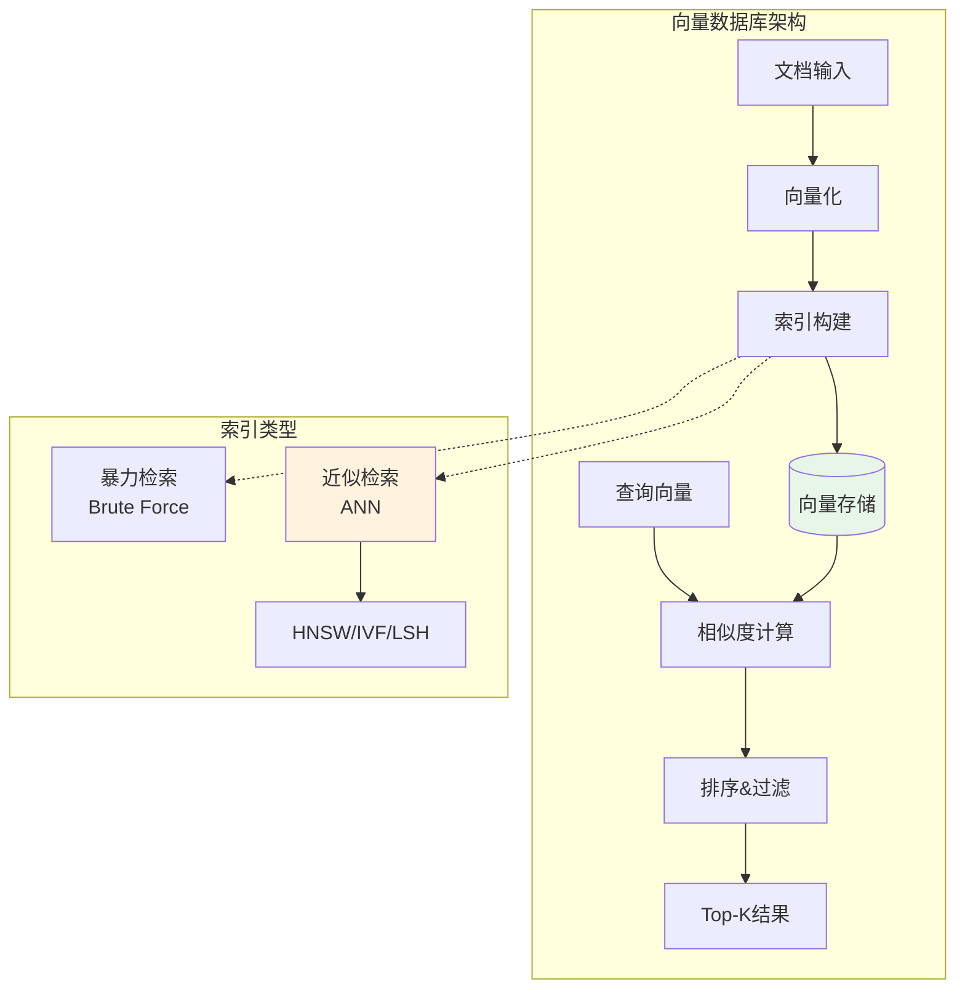
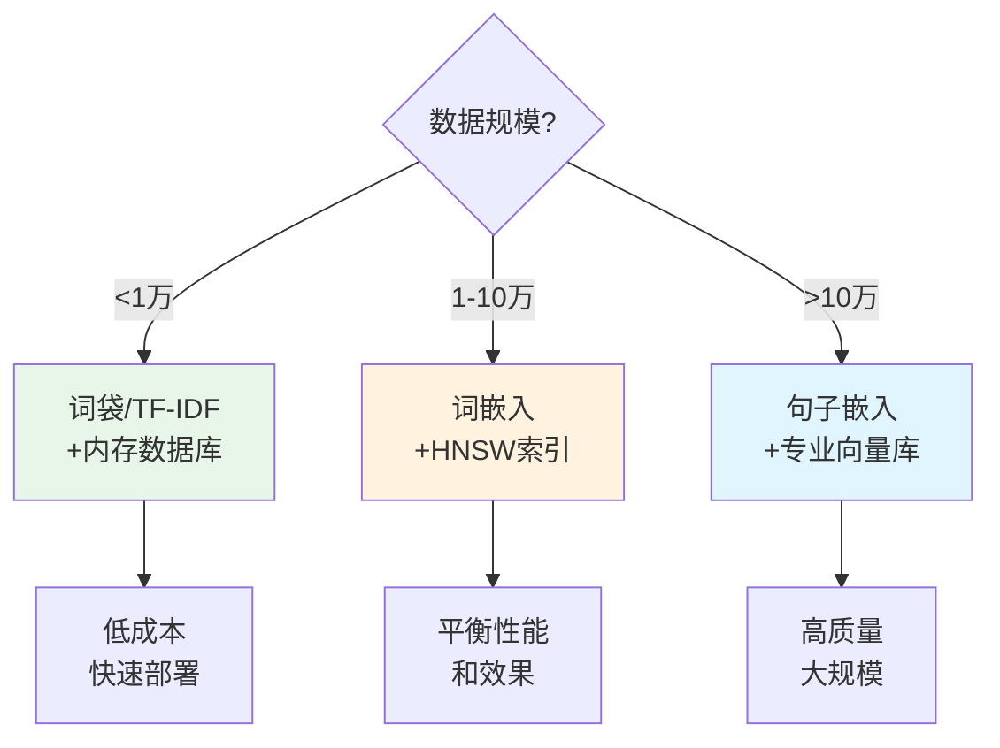

# 17.2 文档向量化与相似度计算

> **设计思想**：掌握文档向量化和相似度计算技术，实现高效的文档检索和匹配

## 本节概述

文档向量化是RAG系统中的核心技术之一，它将文本、图像等非结构化数据转换为数值向量表示，使得计算机能够进行数学计算和相似度比较。相似度计算则是基于这些向量表示来衡量文档之间的相关性，从而实现高效的文档检索。

本节将深入探讨文档向量化的方法，包括传统的词袋模型、TF-IDF，以及现代的词嵌入和句子嵌入技术。同时，我们还将学习各种相似度计算方法，如余弦相似度、欧氏距离等，并通过实际代码实现来加深理解。

## 学习目标

完成本节学习后，你将：

- ✅ **掌握文档向量化方法**：理解词袋模型、TF-IDF、词嵌入和句子嵌入的原理和实现
- ✅ **实现向量化系统**：学会构建完整的文档向量化处理流程
- ✅ **掌握相似度计算技术**：理解各种相似度计算方法的原理和应用场景
- ✅ **构建向量数据库**：学会设计和实现高效的向量存储和检索系统
- ✅ **优化向量化性能**：掌握向量化和相似度计算的性能优化技术

## 文档向量化方法

文档向量化是将非结构化文本转换为数值向量的过程,这是实现语义检索的基础。向量化方法经历了从简单统计到深度语义理解的演进过程。

### 向量化方法演进



### 1. 词袋模型(Bag of Words, BoW)

**核心思想**: 将文档表示为词汇表中各个词的出现次数,忽略词序和语法结构。

**优点**: 简单直观,计算效率高  
**缺点**: 丢失词序信息,向量维度高且稀疏,无法捕捉语义

**技术原理**:
1. 构建词汇表V = {w₁, w₂, ..., wₙ}
2. 对文档D,统计每个词wᵢ的出现次数c(wᵢ,D)
3. 构建向量 v = [c(w₁,D), c(w₂,D), ..., c(wₙ,D)]

**示例**: 
- 文档1: "I love machine learning"
- 文档2: "I love deep learning"
- 词汇表: {I, love, machine, learning, deep}
- 向量1: [1, 1, 1, 1, 0]
- 向量2: [1, 1, 0, 1, 1]

**简化实现**:

```java
public class BagOfWordsVectorizer {
    private Map<String, Integer> wordToIndex = new HashMap<>();
    
    // 构建词汇表
    public void buildVocabulary(List<String> documents) {
        Set<String> vocabulary = new HashSet<>();
        for (String doc : documents) {
            String[] words = doc.toLowerCase().split("\\s+");
            vocabulary.addAll(Arrays.asList(words));
        }
        
        int index = 0;
        for (String word : vocabulary) {
            wordToIndex.put(word, index++);
        }
    }
    
    // 文档向量化
    public double[] vectorize(String document) {
        double[] vector = new double[wordToIndex.size()];
        String[] words = document.toLowerCase().split("\\s+");
        
        for (String word : words) {
            Integer idx = wordToIndex.get(word);
            if (idx != null) {
                vector[idx]++;
            }
        }
        return vector;
    }
}
```


### 2. TF-IDF(Term Frequency-Inverse Document Frequency)

**核心思想**: 在词频基础上引入逆文档频率,降低常见词权重,突出区分性词汇。

**技术原理**:

TF-IDF由两部分组成:

1. **词频(TF)**: 词在文档中出现的频率
   ```
   TF(t,d) = count(t,d) / |d|
   ```
   其中count(t,d)是词t在文档d中出现次数,|d|是文档总词数

2. **逆文档频率(IDF)**: 衡量词的普遍程度
   ```
   IDF(t) = log(N / df(t))
   ```
   其中N是总文档数,df(t)是包含词t的文档数

3. **TF-IDF值**:
   ```
   TF-IDF(t,d) = TF(t,d) × IDF(t)
   ```

**直观理解**:
- 高频词(如"的"、"是")在很多文档中出现 → IDF低 → TF-IDF低
- 特征词(如"量子计算")仅在少数文档出现 → IDF高 → TF-IDF高



**优点**: 突出区分性特征,效果优于BoW  
**缺点**: 仍然是稀疏向量,无法捕捉语义

**简化实现**:

```java
public class TFIDFVectorizer {
    private Map<String, Integer> wordToIndex = new HashMap<>();
    private Map<String, Double> idfMap = new HashMap<>();
    
    // 训练:构建词汇表和计算IDF
    public void fit(List<String> documents) {
        // 1. 构建词汇表
        Set<String> vocabulary = new HashSet<>();
        for (String doc : documents) {
            for (String word : doc.toLowerCase().split("\\s+")) {
                vocabulary.add(word);
            }
        }
        
        int index = 0;
        for (String word : vocabulary) {
            wordToIndex.put(word, index++);
        }
        
        // 2. 计算IDF
        int N = documents.size();
        for (String word : vocabulary) {
            int df = 0;
            for (String doc : documents) {
                if (doc.toLowerCase().contains(word)) {
                    df++;
                }
            }
            idfMap.put(word, Math.log((double)N / df));
        }
    }
    
    // 转换:文档向量化
    public double[] transform(String document) {
        double[] vector = new double[wordToIndex.size()];
        String[] words = document.toLowerCase().split("\\s+");
        
        // 统计词频
        Map<String, Integer> tf = new HashMap<>();
        for (String word : words) {
            tf.put(word, tf.getOrDefault(word, 0) + 1);
        }
        
        // 计算TF-IDF
        for (Map.Entry<String, Integer> entry : tf.entrySet()) {
            String word = entry.getKey();
            if (wordToIndex.containsKey(word)) {
                int idx = wordToIndex.get(word);
                double tfValue = (double)entry.getValue() / words.length;
                double idfValue = idfMap.get(word);
                vector[idx] = tfValue * idfValue;
            }
        }
        return vector;
    }
}
```

### 3. 词嵌入与句子嵌入

**词嵌入(Word Embeddings)**将词汇映射到低维稠密向量空间,能够捕捉词汇间的语义关系。代表技术包括Word2Vec、GloVe等。

**句子嵌入(Sentence Embeddings)**进一步将整个句子或段落编码为固定维度的向量,能够保留句子级别的语义信息。代表技术包括BERT、Sentence-BERT等。

**核心优势**:
- 低维稠密向量(通常100-768维)
- 语义相似的词在向量空间中距离较近
- 支持词汇的语义运算(如:king - man + woman ≈ queen)



**实现示例**:

```java
public class SentenceEmbedding {
    private EmbeddingModel model;  // 可替换为实际的BERT模型
    private int embeddingDim;
    
    public float[] encode(String sentence) {
        // 调用预训练模型编码句子
        return model.encode(sentence);
    }
    
    public double similarity(String sentence1, String sentence2) {
        float[] vec1 = encode(sentence1);
        float[] vec2 = encode(sentence2);
        return cosineSimilarity(vec1, vec2);
    }
}
```

**应用建议**:
- **小规模数据**: TF-IDF即可满足需求
- **中等规模**: 词嵌入(Word2Vec)提供更好的语义理解
- **大规模/高质量要求**: 句子嵌入(BERT)提供最佳效果

## 相似度计算方法

相似度计算是衡量两个向量之间相关性的核心技术。不同的相似度度量适用于不同的场景。

### 常用相似度度量对比

| 度量方法 | 公式 | 值域 | 特点 | 适用场景 |
|---------|------|------|------|----------|
| **余弦相似度** | cosθ = (A·B)/(\|A\|\|B\|) | [-1,1] | 与向量长度无关 | 文本相似度 |
| **欧氏距离** | d = √∑(aᵢ-bᵢ)² | [0,∞) | 直线距离 | 图像、点位置 |
| **曼哈顿距离** | d = ∑\|aᵢ-bᵢ\| | [0,∞) | 城市距离 | 稀疏向量 |
| **皮尔逊相关** | r = cov(A,B)/(σₐσₑ) | [-1,1] | 线性相关 | 统计分析 |

### 1. 余弦相似度(Cosine Similarity)

**核心思想**: 计算两个向量夹角的余弦值,值越接近1表示越相似。

**数学原理**:
```
cos(θ) = (A · B) / (||A|| ||B||)
       = ∑(aᵢ × bᵢ) / (√∑aᵢ² × √∑bᵢ²)
```

**几何意义**:


**优点**: 
- 不受向量长度影响,适合文本比较
- 计算简单,效率高

**实现示例**:
```java
public class SimilarityCalculator {
    
    // 余弦相似度
    public static double cosine(float[] vec1, float[] vec2) {
        double dotProduct = 0.0, norm1 = 0.0, norm2 = 0.0;
        
        for (int i = 0; i < vec1.length; i++) {
            dotProduct += vec1[i] * vec2[i];
            norm1 += vec1[i] * vec1[i];
            norm2 += vec2[i] * vec2[i];
        }
        
        if (norm1 == 0 || norm2 == 0) return 0.0;
        return dotProduct / (Math.sqrt(norm1) * Math.sqrt(norm2));
    }
    
    // 欧氏距离
    public static double euclidean(float[] vec1, float[] vec2) {
        double sum = 0.0;
        for (int i = 0; i < vec1.length; i++) {
            double diff = vec1[i] - vec2[i];
            sum += diff * diff;
        }
        return Math.sqrt(sum);
    }
    
    // 欧氏距离转相似度
    public static double euclideanToSimilarity(double distance) {
        return 1.0 / (1.0 + distance);
    }
}
```

### 2. 相似度选择指南



**实践建议**:
1. **文本检索**: 优先使用余弦相似度
2. **图像检索**: 欧氏距离或L2归一化+余弦
3. **混合检索**: 多种度量加权组合
4. **高维向量**: 考虑降维后再计算


## 向量数据库实现

向量数据库是存储和检索高维向量的专用数据库,是RAG系统的核心基础设施。

### 向量数据库架构



### 简单向量数据库实现

```java
public class VectorDatabase {
    private List<VectorDoc> documents = new ArrayList<>();
    private int dimension;
    
    public VectorDatabase(int dimension) {
        this.dimension = dimension;
    }
    
    // 添加文档
    public void addDocument(String id, String content, float[] vector) {
        if (vector.length != dimension) {
            throw new IllegalArgumentException("向量维度不匹配");
        }
        documents.add(new VectorDoc(id, content, vector));
    }
    
    // 检索Top-K文档
    public List<SearchResult> search(float[] queryVector, int topK) {
        // 1. 计算所有文档相似度
        List<SearchResult> results = new ArrayList<>();
        for (VectorDoc doc : documents) {
            double similarity = SimilarityCalculator.cosine(
                queryVector, doc.vector
            );
            results.add(new SearchResult(doc.id, similarity));
        }
        
        // 2. 排序并返回Top-K
        return results.stream()
            .sorted((a,b) -> Double.compare(b.similarity, a.similarity))
            .limit(topK)
            .collect(Collectors.toList());
    }
    
    // 内部类
    static class VectorDoc {
        String id;
        String content;
        float[] vector;
        
        VectorDoc(String id, String content, float[] vector) {
            this.id = id;
            this.content = content;
            this.vector = vector;
        }
    }
    
    static class SearchResult {
        String docId;
        double similarity;
        
        SearchResult(String docId, double similarity) {
            this.docId = docId;
            this.similarity = similarity;
        }
    }
}
```

### 性能优化策略

#### 1. 向量归一化

对向量进行归一化(模长=1),可以简化余弦相似度计算:

```java
public class VectorNormalizer {
    public static float[] normalize(float[] vector) {
        float norm = 0;
        for (float v : vector) {
            norm += v * v;
        }
        norm = (float)Math.sqrt(norm);
        
        if (norm == 0) return vector;
        
        float[] normalized = new float[vector.length];
        for (int i = 0; i < vector.length; i++) {
            normalized[i] = vector[i] / norm;
        }
        return normalized;
    }
}
```

归一化后,余弦相似度 = 点积,计算效率提升!

#### 2. 近似最近邻检索(ANN)

对于大规模数据,使用ANN算法(如HNSW、IVF)可将检索时间介O(n)降低到O(log n):

**常用ANN算法**:
- **HNSW** (Hierarchical Navigable Small World): 基于图的分层索引
- **IVF** (Inverted File Index): 基于聚类的倒排索引
- **LSH** (Locality Sensitive Hashing): 局部敏感哈希

**性能对比**:

| 方法 | 检索时间 | 索引大小 | 召回率 | 适用场景 |
|------|----------|----------|---------|----------|
| 暴力检索 | O(n) | 小 | 100% | <10万文档 |
| HNSW | O(log n) | 大 | 95%+ | 通用场景 |
| IVF | O(√n) | 中 | 90%+ | 极大规模 |

### 实际应用建议

1. **小规模(<1万文档)**: 使用内存向量数据库,暴力检索
2. **中等规模(1-100万)**: 使用HNSW等ANN算法
3. **大规模(>100万)**: 使用专业向量数据库(如Milvus, Faiss, Weaviate)
4. **生产环境**: 考虑持久化、分布式、备份等需求

## 实际应用示例

下面展示一个完整的文档检索系统,整合向量化、存储和检索功能:

```java
public class DocumentRetrievalSystem {
    private SentenceEmbedding embedding;
    private VectorDatabase vectorDB;
    
    public DocumentRetrievalSystem(int dimension) {
        this.embedding = new SentenceEmbedding(dimension);
        this.vectorDB = new VectorDatabase(dimension);
    }
    
    // 文档索引
    public void indexDocument(String id, String content) {
        float[] vector = embedding.encode(content);
        vectorDB.addDocument(id, content, vector);
    }
    
    // 文档检索
    public List<SearchResult> search(String query, int topK) {
        float[] queryVector = embedding.encode(query);
        return vectorDB.search(queryVector, topK);
    }
}
```

**使用示例**:
```java
// 1. 初始化系统
DocumentRetrievalSystem system = new DocumentRetrievalSystem(768);

// 2. 索引文档
system.indexDocument("doc1", "人工智能是计算机科学的分支");
system.indexDocument("doc2", "机器学习是AI的核心技术");

// 3. 检索相关文档
List<SearchResult> results = system.search("什么是AI", 5);
for (SearchResult result : results) {
    System.out.println(result.docId + ": " + result.similarity);
}
```

## 本节小结

本节我们系统学习了文档向量化与相似度计算的核心技术:

### 核心知识点

1. **向量化方法演进**
   - 词袋模型: 简单统计,高维稀疏
   - TF-IDF: 加权统计,突出特征词
   - 词嵌入: 低维稠密,语义捕捉
   - 句子嵌入: 上下文理解,效果最佳

2. **相似度计算**
   - 余弦相似度: 文本检索首选,与长度无关
   - 欧氏距离: 直线距离,适合图像特征
   - 度量选择: 根据数据类型和应用场景

3. **向量数据库**
   - 基础实现: 内存存储+暴力检索
   - 性能优化: 归一化、ANN算法
   - 规模选择: 根据数据规模选择方案

### 技术选型指南



### 实践建议

1. **向量化方法选择**
   - 快速原型: TF-IDF即可
   - 生产系统: 使用预训练嵌入模型
   - 高质量要求: BERT等句子嵌入

2. **性能优化策略**
   - 向量归一化: 简化相似度计算
   - 批量处理: 提高吞吐量
   - ANN算法: 大规模数据必选

3. **工程化建议**
   - 选用成熟向量库: Milvus, Faiss, Weaviate
   - 监控指标: 检索延迟、召回率、准确率
   - 版本管理: 嵌入模型和索引同步更新

### 后续学习

掌握了向量化和相似度计算技术后,下一节将学习**知识图谱构建与维护**,探索如何以结构化方式表示和管理知识,进一步提升RAG系统的能力。