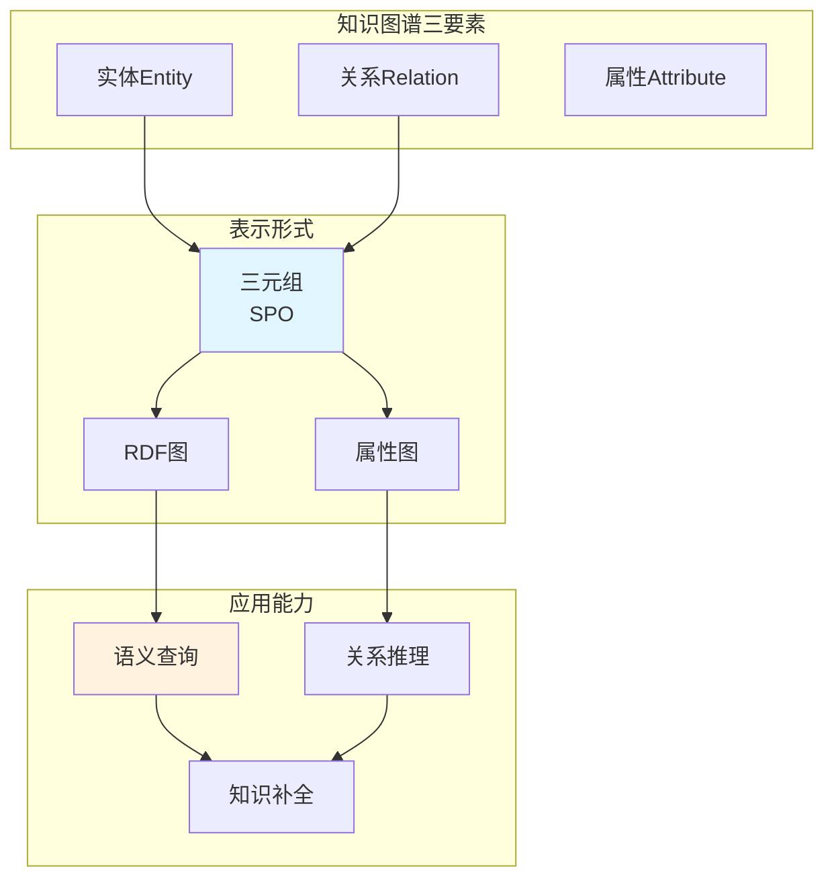
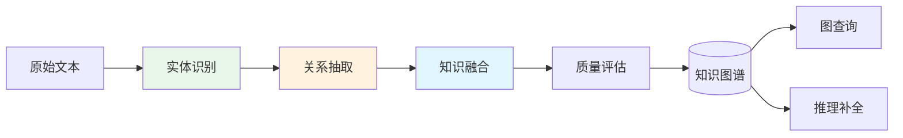
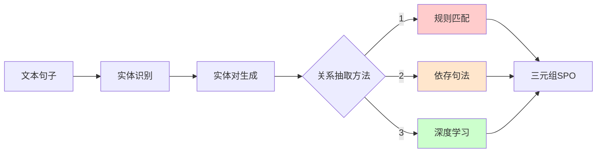

# 17.3 知识图谱构建与维护

> **设计思想**：掌握知识图谱的构建和维护方法，实现结构化知识的管理和应用

## 本节概述

知识图谱是一种结构化的语义网络，用于描述现实世界中的实体及其相互关系。它以图的形式组织知识，其中节点代表实体，边代表实体间的关系。知识图谱在搜索引擎、智能问答、推荐系统等领域有着广泛的应用。

本节将深入探讨知识图谱的核心概念、构建方法、存储技术以及维护策略，并通过实际代码实现来加深理解。

## 学习目标

完成本节学习后，你将：

- ✅ **理解知识图谱概念**：掌握知识图谱的基本结构和核心组件
- ✅ **掌握实体识别技术**：学会从文本中识别和提取实体
- ✅ **实现关系抽取方法**：掌握实体间关系的自动抽取技术
- ✅ **构建知识图谱存储**：学会设计和实现知识图谱的存储系统
- ✅ **掌握图谱查询语言**：理解图查询语言（如SPARQL）的使用方法
- ✅ **实现知识图谱维护**：掌握知识图谱的更新和维护策略

## 知识图谱基本概念

知识图谱是一种结构化的语义网络,用三元组(Subject, Predicate, Object)的形式表示实体及其关系。相比非结构化文本,知识图谱具有更强的查询能力和推理能力。

### 知识图谱核心要素



### 知识图谱与向量检索对比

| 维度 | 向量检索 | 知识图谱 |
|------|---------|----------|
| **数据结构** | 稠密向量 | 结构化三元组 |
| **查询方式** | 相似度匹配 | 图遍历/SPARQL |
| **推理能力** | 弱 | 强 |
| **知识更新** | 重新索引 | 增量更新 |
| **适用场景** | 语义相似检索 | 关系查询推理 |
| **实现复杂度** | 简单 | 较复杂 |

**混合使用**: 在RAG系统中,向量检索用于初步召回,知识图谱用于精确查询和推理,二者互补。

### 知识图谱构建流程



## 实体识别与关系抽取

### 1. 实体识别(Named Entity Recognition)

实体识别是从文本中识别和分类命名实体的过程。常见实体类型包括人名、地名、组织机构、时间、金额等。

**核心方法**:
- **基于规则**: 使用正则表达式和词典匹配
- **基于统计**: CRF、HMM等序列标注模型  
- **深度学习**: BiLSTM-CRF、BERT-NER等

**简化实现**:
```java
public class EntityRecognizer {
    private Map<EntityType, List<Pattern>> patterns = new HashMap<>();
    
    public List<Entity> recognize(String text) {
        List<Entity> entities = new ArrayList<>();
        
        // 使用规则匹配识别实体
        for (Map.Entry<EntityType, List<Pattern>> entry : patterns.entrySet()) {
            EntityType type = entry.getKey();
            for (Pattern pattern : entry.getValue()) {
                Matcher matcher = pattern.matcher(text);
                while (matcher.find()) {
                    entities.add(new Entity(
                        matcher.group(), type, matcher.start(), matcher.end()
                    ));
                }
            }
        }
        return entities;
    }
}

class Entity {
    String text;
    EntityType type;
    int start, end;
}

enum EntityType {
    PERSON, ORGANIZATION, LOCATION, DATE, MONEY
}


    private List<String> tokenize(String text) {
        // 简单的分词实现
        return Arrays.asList(text.split("\\s+"));
    }
    
    private List<RecognizedEntity> buildEntities(List<String> tokens, List<String> labels) {
        List<RecognizedEntity> entities = new ArrayList<>();
        StringBuilder currentEntity = new StringBuilder();
        EntityType currentType = null;
        int startPos = -1;
        
        for (int i = 0; i < tokens.size(); i++) {
            String token = tokens.get(i);
            String label = labels.get(i);
            
            if (label.startsWith("B-")) {
                // 开始新的实体
                if (currentEntity.length() > 0) {
                    // 保存之前的实体
                    entities.add(new RecognizedEntity(
                        currentEntity.toString().trim(), 
                        currentType, 
                        startPos, 
                        startPos + currentEntity.length()
                    ));
                    currentEntity.setLength(0);
                }
                
                // 开始新实体
                currentEntity.append(token);
                currentType = parseEntityType(label.substring(2));
                startPos = i;
            } else if (label.startsWith("I-") && currentEntity.length() > 0) {
                // 继续当前实体
                currentEntity.append(" ").append(token);
            } else {
                // 结束当前实体
                if (currentEntity.length() > 0) {
                    entities.add(new RecognizedEntity(
                        currentEntity.toString().trim(), 
                        currentType, 
                        startPos, 
                        startPos + currentEntity.length()
                    ));
                    currentEntity.setLength(0);
                }
            }
        }
        
        // 处理最后一个实体
        if (currentEntity.length() > 0) {
            entities.add(new RecognizedEntity(
                currentEntity.toString().trim(), 
                currentType, 
                startPos, 
                startPos + currentEntity.length()
            ));
        }
        
        return entities;
    }
    
    private EntityType parseEntityType(String typeStr) {
        try {
            return EntityType.valueOf(typeStr.toUpperCase());
        } catch (IllegalArgumentException e) {
            return EntityType.PERSON; // 默认类型
        }
    }
}

// 序列标注模型接口
interface SequenceLabelingModel {
    List<String> predict(List<String> tokens);
}

// 模拟序列标注模型
class MockSequenceLabelingModel implements SequenceLabelingModel {
    @Override
    public List<String> predict(List<String> tokens) {
        List<String> labels = new ArrayList<>();
        Random random = new Random(42);
        
        for (String token : tokens) {
            // 简单的随机标签生成（实际应用中应使用训练好的模型）
            String[] possibleLabels = {"O", "B-PERSON", "I-PERSON", "B-ORG", "I-ORG", "B-LOC", "I-LOC"};
            labels.add(possibleLabels[random.nextInt(possibleLabels.length)]);
        }
        
        return labels;
    }
}
```

## 关系抽取技术

### 1. 基于依存句法的关系抽取

```java
public class DependencyBasedRelationExtractor {
    private DependencyParser parser;
    
    public DependencyBasedRelationExtractor(DependencyParser parser) {
        this.parser = parser;
    }
    
    public List<ExtractedRelation> extractRelations(String sentence) {
        List<ExtractedRelation> relations = new ArrayList<>();
        
        // 1. 解析依存句法
        DependencyParseResult parseResult = parser.parse(sentence);
        
        // 2. 识别实体对
        List<EntityPair> entityPairs = identifyEntityPairs(parseResult);
        
        // 3. 抽取关系
        for (EntityPair pair : entityPairs) {
            String relation = extractRelation(parseResult, pair);
            if (relation != null && !relation.isEmpty()) {
                relations.add(new ExtractedRelation(
                    pair.getEntity1(), 
                    relation, 
                    pair.getEntity2(), 
                    sentence
                ));
            }
        }
        
        return relations;
    }
    
    private List<EntityPair> identifyEntityPairs(DependencyParseResult parseResult) {
        List<EntityPair> pairs = new ArrayList<>();
        List<RecognizedEntity> entities = parseResult.getEntities();
        
        // 生成所有实体对
        for (int i = 0; i < entities.size(); i++) {
            for (int j = i + 1; j < entities.size(); j++) {
                pairs.add(new EntityPair(entities.get(i), entities.get(j)));
            }
        }
        
        return pairs;
    }
    
    private String extractRelation(DependencyParseResult parseResult, EntityPair pair) {
        // 基于依存路径的关系抽取
        List<DependencyEdge> path = findDependencyPath(
            parseResult, 
            pair.getEntity1().getStart(), 
            pair.getEntity2().getStart()
        );
        
        if (path.isEmpty()) {
            return null;
        }
        
        // 简化的规则：基于路径中的依存关系类型
        StringBuilder relation = new StringBuilder();
        for (DependencyEdge edge : path) {
            if (!edge.getRelation().equals("punct")) { // 忽略标点符号
                if (relation.length() > 0) {
                    relation.append("_");
                }
                relation.append(edge.getRelation());
            }
        }
        
        return relation.toString();
    }
    
    private List<DependencyEdge> findDependencyPath(
            DependencyParseResult parseResult, int start1, int start2) {
        // 简化的最短路径查找（实际应用中应使用图算法）
        List<DependencyEdge> edges = parseResult.getEdges();
        List<DependencyEdge> path = new ArrayList<>();
        
        // 这里简化处理，实际应实现BFS或Dijkstra算法
        for (DependencyEdge edge : edges) {
            if ((edge.getFrom() == start1 && edge.getTo() == start2) ||
                (edge.getFrom() == start2 && edge.getTo() == start1)) {
                path.add(edge);
            }
        }
        
        return path;
    }
}

class EntityPair {
    private RecognizedEntity entity1;
    private RecognizedEntity entity2;
    
    public EntityPair(RecognizedEntity entity1, RecognizedEntity entity2) {
        // 确保实体按位置排序
        if (entity1.getStart() <= entity2.getStart()) {
            this.entity1 = entity1;
            this.entity2 = entity2;
        } else {
            this.entity1 = entity2;
            this.entity2 = entity1;
        }
    }
    
    // Getters
    public RecognizedEntity getEntity1() { return entity1; }
    public RecognizedEntity getEntity2() { return entity2; }
}

class ExtractedRelation {
    private RecognizedEntity subject;
    private String relation;
    private RecognizedEntity object;
    private String sentence;
    private double confidence;
    
    public ExtractedRelation(RecognizedEntity subject, String relation, 
                           RecognizedEntity object, String sentence) {
        this(subject, relation, object, sentence, 1.0);
    }
    
    public ExtractedRelation(RecognizedEntity subject, String relation, 
                           RecognizedEntity object, String sentence, double confidence) {
        this.subject = subject;
        this.relation = relation;
        this.object = object;
        this.sentence = sentence;
        this.confidence = confidence;
    }
    
    // Getters
    public RecognizedEntity getSubject() { return subject; }
    public String getRelation() { return relation; }
    public RecognizedEntity getObject() { return object; }
    public String getSentence() { return sentence; }
    public double getConfidence() { return confidence; }
}

// 依存句法解析器接口
interface DependencyParser {
    DependencyParseResult parse(String sentence);
}

// 依存句法解析结果
class DependencyParseResult {
    private List<RecognizedEntity> entities;
    private List<DependencyEdge> edges;
    
    public DependencyParseResult(List<RecognizedEntity> entities, 
                               List<DependencyEdge> edges) {
        this.entities = entities;
        this.edges = edges;
    }
    
    // Getters
    public List<RecognizedEntity> getEntities() { return entities; }
    public List<DependencyEdge> getEdges() { return edges; }
}

// 依存关系边
class DependencyEdge {
    private int from;
    private int to;
    private String relation;
    
    public DependencyEdge(int from, int to, String relation) {
        this.from = from;
        this.to = to;
        this.relation = relation;
    }
    
    // Getters
    public int getFrom() { return from; }
    public int getTo() { return to; }
    public String getRelation() { return relation; }
}

// 模拟依存句法解析器
class MockDependencyParser implements DependencyParser {
    private RuleBasedEntityRecognizer entityRecognizer;
    
    public MockDependencyParser() {
        this.entityRecognizer = new RuleBasedEntityRecognizer();
    }
    
    @Override
    public DependencyParseResult parse(String sentence) {
        // 1. 实体识别
        List<RecognizedEntity> entities = entityRecognizer.recognizeEntities(sentence);
        
        // 2. 生成模拟的依存关系（实际应用中应使用真实的解析器）
        List<DependencyEdge> edges = generateMockEdges(sentence, entities);
        
        return new DependencyParseResult(entities, edges);
    }
    
    private List<DependencyEdge> generateMockEdges(String sentence, 
                                                 List<RecognizedEntity> entities) {
        List<DependencyEdge> edges = new ArrayList<>();
        String[] tokens = sentence.split("\\s+");
        
        // 简单的依存关系生成
        for (int i = 0; i < tokens.length - 1; i++) {
            edges.add(new DependencyEdge(i, i + 1, "dep"));
        }
        
        return edges;
    }
}
```

### 2. 基于深度学习的关系抽取

```java
public class DeepLearningRelationExtractor {
    private RelationClassificationModel model;
    
    public DeepLearningRelationExtractor(RelationClassificationModel model) {
        this.model = model;
    }
    
    public List<ExtractedRelation> extractRelations(String sentence) {
        List<ExtractedRelation> relations = new ArrayList<>();
```
        
### 2. 关系抽取(Relation Extraction)

关系抽取目标是从文本中识别实体之间的语义关系。

**主要方法**:



**简化实现**:
```java
public class RelationExtractor {
    private EntityRecognizer entityRecognizer;
    private Map<String, List<Pattern>> relationPatterns;
    
    public List<Triple> extract(String text) {
        List<Triple> triples = new ArrayList<>();
        
        // 1. 识别实体
        List<Entity> entities = entityRecognizer.recognize(text);
        
        // 2. 生成实体对
        for (int i = 0; i < entities.size(); i++) {
            for (int j = i + 1; j < entities.size(); j++) {
                Entity e1 = entities.get(i);
                Entity e2 = entities.get(j);
                
                // 3. 抽取关系
                String relation = extractRelation(text, e1, e2);
                if (relation != null) {
                    triples.add(new Triple(e1.text, relation, e2.text));
                }
            }
        }
        return triples;
    }
    
    private String extractRelation(String text, Entity e1, Entity e2) {
        // 使用规则匹配抽取关系
        String between = text.substring(e1.end, e2.start);
        
        // 常见关系模式
        if (between.contains("创立") || between.contains("founded")) {
            return "创立";
        } else if (between.contains("位于") || between.contains("located")) {
            return "位于";
        }
        return null;
    }
}

class Triple {
    String subject, predicate, object;
    
    Triple(String s, String p, String o) {
        this.subject = s;
        this.predicate = p;
        this.object = o;
    }
}
```

## 知识图谱存储与查询

### 存储方案

**1. 关系型数据库** (如MySQL)
- 优点: 成熟稳定,SQL查询  
- 缺点: 图遍历性能差

**2. 图数据库** (如Neo4j, JanusGraph)
- 优点: 原生支持图查询,性能高
- 缺点: 学习成本较高

**3. RDF存储** (如Jena, Virtuoso)  
- 优点: 语义Web标准,SPARQL查询
- 缺点: 性能有限

### 简单图存储实现

```java
public class KnowledgeGraph {
    private Map<String, Node> nodes = new HashMap<>();
    private List<Edge> edges = new ArrayList<>();
    
    // 添加三元组
    public void addTriple(String subject, String predicate, String object) {
        Node subNode = nodes.computeIfAbsent(subject, Node::new);
        Node objNode = nodes.computeIfAbsent(object, Node::new);
        edges.add(new Edge(subNode, objNode, predicate));
    }
    
    // 查询关系
    public List<String> query(String subject, String predicate) {
        Node subNode = nodes.get(subject);
        if (subNode == null) return Collections.emptyList();
        
        return edges.stream()
            .filter(e -> e.from.id.equals(subject) && 
                        e.relation.equals(predicate))
            .map(e -> e.to.id)
            .collect(Collectors.toList());
    }
    
    static class Node {
        String id;
        Map<String, Object> properties = new HashMap<>();
        Node(String id) { this.id = id; }
    }
    
    static class Edge {
        Node from, to;
        String relation;
        Edge(Node f, Node t, String r) {
            this.from = f; this.to = t; this.relation = r;
        }
    }
}
```

## 本节小结

本节学习了知识图谱的构建与维护技术:

### 核心知识点

1. **知识图谱基础**
   - 三元组(SPO)表示知识
   - 与向量检索互补，各有优势
   
2. **实体识别**: 从文本中识别命名实体
3. **关系抽取**: 识别实体间语义关系  
4. **图存储**: 选择合适的存储方案

### 应用场景

- **问答系统**: 基于知识图谱的精准查询
- **推荐系统**: 利用关系网络发现关联
- **知识推理**: 基于规则的知识推导

下一节将学习**多模态检索**,处理文本、图像、代码等多种数据类型。

```java
    private List<EntityPair> generateEntityPairs(List<RecognizedEntity> entities) {
        List<EntityPair> pairs = new ArrayList<>();
        for (int i = 0; i < entities.size(); i++) {
            for (int j = i + 1; j < entities.size(); j++) {
                pairs.add(new EntityPair(entities.get(i), entities.get(j)));
            }
        }
        return pairs;
    }
}

// 关系分类模型接口
interface RelationClassificationModel {
    RelationClassificationResult classify(String sentence, 
                                       RecognizedEntity entity1, 
                                       RecognizedEntity entity2);
}

// 关系分类结果
class RelationClassificationResult {
    private String relationType;
    private double confidence;
    
    public RelationClassificationResult(String relationType, double confidence) {
        this.relationType = relationType;
        this.confidence = confidence;
    }
    
    // Getters
    public String getRelationType() { return relationType; }
    public double getConfidence() { return confidence; }
}

// 模拟关系分类模型
class MockRelationClassificationModel implements RelationClassificationModel {
    @Override
    public RelationClassificationResult classify(String sentence, 
                                              RecognizedEntity entity1, 
                                              RecognizedEntity entity2) {
        Random random = new Random(42);
        String[] relations = {"works_for", "located_in", "founded_by", "born_in", "married_to"};
        String relation = relations[random.nextInt(relations.length)];
        double confidence = random.nextDouble();
        
        return new RelationClassificationResult(relation, confidence);
    }
}
```

## 知识图谱存储实现

### 1. 图数据库存储

```java
public class GraphDatabaseKnowledgeGraph {
    private Map<String, GraphNode> nodes;
    private Map<Triple, GraphEdge> edges;
    private ReadWriteLock lock;
    
    public GraphDatabaseKnowledgeGraph() {
        this.nodes = new ConcurrentHashMap<>();
        this.edges = new ConcurrentHashMap<>();
        this.lock = new ReentrantReadWriteLock();
    }
    
    public void addNode(String nodeId, Map<String, Object> properties) {
        lock.writeLock().lock();
        try {
            nodes.put(nodeId, new GraphNode(nodeId, properties));
        } finally {
            lock.writeLock().unlock();
        }
    }
    
    public void addEdge(String fromNodeId, String toNodeId, 
                       String relation, Map<String, Object> properties) {
        lock.writeLock().lock();
        try {
            // 确保节点存在
            if (!nodes.containsKey(fromNodeId)) {
                addNode(fromNodeId, new HashMap<>());
            }
            if (!nodes.containsKey(toNodeId)) {
                addNode(toNodeId, new HashMap<>());
            }
            
            Triple triple = new Triple(fromNodeId, relation, toNodeId);
            edges.put(triple, new GraphEdge(fromNodeId, toNodeId, relation, properties));
        } finally {
            lock.writeLock().unlock();
        }
    }
    
    public GraphNode getNode(String nodeId) {
        lock.readLock().lock();
        try {
            return nodes.get(nodeId);
        } finally {
            lock.readLock().unlock();
        }
    }
    
    public List<GraphEdge> getEdges(String nodeId) {
        lock.readLock().lock();
        try {
            return edges.values().stream()
                .filter(edge -> edge.getFromNodeId().equals(nodeId) || 
                               edge.getToNodeId().equals(nodeId))
                .collect(Collectors.toList());
        } finally {
            lock.readLock().unlock();
        }
    }
    
    public List<GraphNode> queryNodes(Map<String, Object> conditions) {
        lock.readLock().lock();
        try {
            return nodes.values().stream()
                .filter(node -> matchesConditions(node, conditions))
                .collect(Collectors.toList());
        } finally {
            lock.readLock().unlock();
        }
    }
    
    private boolean matchesConditions(GraphNode node, Map<String, Object> conditions) {
        for (Map.Entry<String, Object> entry : conditions.entrySet()) {
            String key = entry.getKey();
            Object value = entry.getValue();
            Object nodeValue = node.getProperties().get(key);
            if (nodeValue == null || !nodeValue.equals(value)) {
                return false;
            }
        }
        return true;
    }
    
    public void updateNode(String nodeId, Map<String, Object> properties) {
        lock.writeLock().lock();
        try {
            GraphNode node = nodes.get(nodeId);
            if (node != null) {
                node.getProperties().putAll(properties);
            }
        } finally {
            lock.writeLock().unlock();
        }
    }
    
    public void deleteNode(String nodeId) {
        lock.writeLock().lock();
        try {
            nodes.remove(nodeId);
            // 删除相关的边
            edges.entrySet().removeIf(entry -> {
                Triple triple = entry.getKey();
                return triple.getSubject().equals(nodeId) || triple.getObject().equals(nodeId);
            });
        } finally {
            lock.writeLock().unlock();
        }
    }
    
    public int getNodeCount() {
        lock.readLock().lock();
        try {
            return nodes.size();
        } finally {
            lock.readLock().unlock();
        }
    }
    
    public int getEdgeCount() {
        lock.readLock().lock();
        try {
            return edges.size();
        } finally {
            lock.readLock().unlock();
        }
    }
}

class GraphNode {
    private String id;
    private Map<String, Object> properties;
    
    public GraphNode(String id, Map<String, Object> properties) {
        this.id = id;
        this.properties = new HashMap<>(properties);
    }
    
    // Getters and Setters
    public String getId() { return id; }
    public Map<String, Object> getProperties() { return properties; }
    public void setProperties(Map<String, Object> properties) { 
        this.properties = new HashMap<>(properties); 
    }
}

class GraphEdge {
    private String fromNodeId;
    private String toNodeId;
    private String relation;
    private Map<String, Object> properties;
    
    public GraphEdge(String fromNodeId, String toNodeId, String relation, 
                    Map<String, Object> properties) {
        this.fromNodeId = fromNodeId;
        this.toNodeId = toNodeId;
        this.relation = relation;
        this.properties = new HashMap<>(properties);
    }
    
    // Getters
    public String getFromNodeId() { return fromNodeId; }
    public String getToNodeId() { return toNodeId; }
    public String getRelation() { return relation; }
    public Map<String, Object> getProperties() { return properties; }
}
```

### 2. RDF三元组存储

```java
public class RDFKnowledgeGraph {
    private Set<Triple> triples;
    private Map<String, Set<Triple>> subjectIndex;
    private Map<String, Set<Triple>> predicateIndex;
    private Map<String, Set<Triple>> objectIndex;
    private ReadWriteLock lock;
    
    public RDFKnowledgeGraph() {
        this.triples = new HashSet<>();
        this.subjectIndex = new HashMap<>();
        this.predicateIndex = new HashMap<>();
        this.objectIndex = new HashMap<>();
        this.lock = new ReentrantReadWriteLock();
    }
    
    public void addTriple(String subject, String predicate, String object) {
        Triple triple = new Triple(subject, predicate, object);
        
        lock.writeLock().lock();
        try {
            if (triples.add(triple)) {
                // 更新索引
                subjectIndex.computeIfAbsent(subject, k -> new HashSet<>()).add(triple);
                predicateIndex.computeIfAbsent(predicate, k -> new HashSet<>()).add(triple);
                objectIndex.computeIfAbsent(object, k -> new HashSet<>()).add(triple);
            }
        } finally {
            lock.writeLock().unlock();
        }
    }
    
    public Set<Triple> queryBySubject(String subject) {
        lock.readLock().lock();
        try {
            return new HashSet<>(subjectIndex.getOrDefault(subject, new HashSet<>()));
        } finally {
            lock.readLock().unlock();
        }
    }
    
    public Set<Triple> queryByPredicate(String predicate) {
        lock.readLock().lock();
        try {
            return new HashSet<>(predicateIndex.getOrDefault(predicate, new HashSet<>()));
        } finally {
            lock.readLock().unlock();
        }
    }
    
    public Set<Triple> queryByObject(String object) {
        lock.readLock().lock();
        try {
            return new HashSet<>(objectIndex.getOrDefault(object, new HashSet<>()));
        } finally {
            lock.readLock().unlock();
        }
    }
    
    public Set<Triple> queryBySPARQL(String sparqlQuery) {
        // 简化的SPARQL查询解析（实际应用中应使用完整的SPARQL解析器）
        return parseAndExecuteSPARQL(sparqlQuery);
    }
    
    private Set<Triple> parseAndExecuteSPARQL(String sparqlQuery) {
        // 这里简化处理，实际应实现完整的SPARQL解析和执行
        Set<Triple> results = new HashSet<>();
        
        // 解析WHERE子句中的三元组模式
        Pattern pattern = Pattern.compile(
            "WHERE\\s*\\{\\s*([^\\}]+)\\s*\\}", 
            Pattern.CASE_INSENSITIVE
        );
        Matcher matcher = pattern.matcher(sparqlQuery);
        
        if (matcher.find()) {
            String whereClause = matcher.group(1);
            String[] patterns = whereClause.split("\\s*;\\s*");
            
            for (String patternStr : patterns) {
                patternStr = patternStr.trim();
                if (patternStr.endsWith(".")) {
                    patternStr = patternStr.substring(0, patternStr.length() - 1);
                }
                
                String[] parts = patternStr.split("\\s+");
                if (parts.length >= 3) {
                    String subject = parts[0];
                    String predicate = parts[1];
                    String object = parts[2];
                    
                    // 处理变量（以?开头）
                    if (subject.startsWith("?")) {
                        // 变量，需要匹配所有subject
                        results.addAll(triples);
                    } else if (predicate.startsWith("?")) {
                        // 变量，需要匹配所有predicate
                        results.addAll(triples);
                    } else if (object.startsWith("?")) {
                        // 变量，需要匹配所有object
                        results.addAll(triples);
                    } else {
                        // 具体值，查找匹配的三元组
                        Triple target = new Triple(subject, predicate, object);
                        if (triples.contains(target)) {
                            results.add(target);
                        }
                    }
                }
            }
        }
        
        return results;
    }
    
    public void removeTriple(String subject, String predicate, String object) {
        Triple triple = new Triple(subject, predicate, object);
        
        lock.writeLock().lock();
        try {
            if (triples.remove(triple)) {
                // 更新索引
                Set<Triple> subjectTriples = subjectIndex.get(subject);
                if (subjectTriples != null) {
                    subjectTriples.remove(triple);
                }
                
                Set<Triple> predicateTriples = predicateIndex.get(predicate);
                if (predicateTriples != null) {
                    predicateTriples.remove(triple);
                }
                
                Set<Triple> objectTriples = objectIndex.get(object);
                if (objectTriples != null) {
                    objectTriples.remove(triple);
                }
            }
        } finally {
            lock.writeLock().unlock();
        }
    }
    
    public int size() {
        lock.readLock().lock();
        try {
            return triples.size();
        } finally {
            lock.readLock().unlock();
        }
    }
    
    public Set<Triple> getAllTriples() {
        lock.readLock().lock();
        try {
            return new HashSet<>(triples);
        } finally {
            lock.readLock().unlock();
        }
    }
}
```

## 知识图谱查询语言

### 1. SPARQL查询示例

```java
public class SPARQLQueryExecutor {
    private RDFKnowledgeGraph knowledgeGraph;
    
    public SPARQLQueryExecutor(RDFKnowledgeGraph knowledgeGraph) {
        this.knowledgeGraph = knowledgeGraph;
    }
    
    public QueryResult executeQuery(String sparqlQuery) {
        // 解析SPARQL查询
        SPARQLQuery parsedQuery = parseSPARQL(sparqlQuery);
        
        // 执行查询
        return executeParsedQuery(parsedQuery);
    }
    
    private SPARQLQuery parseSPARQL(String sparqlQuery) {
        // 简化的SPARQL解析器
        SPARQLQuery query = new SPARQLQuery();
        
        // 提取SELECT子句
        Pattern selectPattern = Pattern.compile(
            "SELECT\\s+(.+?)\\s+WHERE", 
            Pattern.CASE_INSENSITIVE
        );
        Matcher selectMatcher = selectPattern.matcher(sparqlQuery);
        if (selectMatcher.find()) {
            String selectClause = selectMatcher.group(1).trim();
            String[] variables = selectClause.split("\\s+");
            for (String variable : variables) {
                if (variable.startsWith("?")) {
                    query.addSelectVariable(variable);
                }
            }
        }
        
        // 提取WHERE子句
        Pattern wherePattern = Pattern.compile(
            "WHERE\\s*\\{\\s*(.+?)\\s*\\}", 
            Pattern.CASE_INSENSITIVE | Pattern.DOTALL
        );
        Matcher whereMatcher = wherePattern.matcher(sparqlQuery);
        if (whereMatcher.find()) {
            String whereClause = whereMatcher.group(1).trim();
            query.setWhereClause(whereClause);
        }
        
        return query;
    }
    
    private QueryResult executeParsedQuery(SPARQLQuery query) {
        QueryResult result = new QueryResult();
        
        // 解析WHERE子句中的三元组模式
        String whereClause = query.getWhereClause();
        String[] triplePatterns = whereClause.split("\\s*;\\s*|\\s*\\.\\s*");
        
        // 执行查询（简化实现）
        for (String pattern : triplePatterns) {
            pattern = pattern.trim();
            if (!pattern.isEmpty()) {
                String[] parts = pattern.split("\\s+");
                if (parts.length >= 3) {
                    String subject = parts[0];
                    String predicate = parts[1];
                    String object = parts[2];
                    
                    // 根据模式类型执行查询
                    if (!subject.startsWith("?")) {
                        // 具体subject查询
                        Set<Triple> triples = knowledgeGraph.queryBySubject(subject);
                        result.addTriples(triples);
                    } else if (!predicate.startsWith("?")) {
                        // 具体predicate查询
                        Set<Triple> triples = knowledgeGraph.queryByPredicate(predicate);
                        result.addTriples(triples);
                    } else if (!object.startsWith("?")) {
                        // 具体object查询
                        Set<Triple> triples = knowledgeGraph.queryByObject(object);
                        result.addTriples(triples);
                    } else {
                        // 全部是变量，返回所有三元组
                        result.addTriples(knowledgeGraph.getAllTriples());
                    }
                }
            }
        }
        
        return result;
    }
}

class SPARQLQuery {
    private List<String> selectVariables;
    private String whereClause;
    
    public SPARQLQuery() {
        this.selectVariables = new ArrayList<>();
    }
    
    public void addSelectVariable(String variable) {
        selectVariables.add(variable);
    }
    
    public void setWhereClause(String whereClause) {
        this.whereClause = whereClause;
    }
    
    // Getters
    public List<String> getSelectVariables() { return selectVariables; }
    public String getWhereClause() { return whereClause; }
}

class QueryResult {
    private Set<Triple> triples;
    private List<Map<String, String>> bindings;
    
    public QueryResult() {
        this.triples = new HashSet<>();
        this.bindings = new ArrayList<>();
    }
    
    public void addTriples(Set<Triple> triples) {
        this.triples.addAll(triples);
    }
    
    public void addBinding(Map<String, String> binding) {
        this.bindings.add(binding);
    }
    
    // Getters
    public Set<Triple> getTriples() { return triples; }
    public List<Map<String, String>> getBindings() { return bindings; }
}
```

## 知识图谱维护策略

### 1. 增量更新机制

```java
public class KnowledgeGraphUpdater {
    private RDFKnowledgeGraph knowledgeGraph;
    private ChangeLog changeLog;
    private ConflictResolver conflictResolver;
    
    public KnowledgeGraphUpdater(RDFKnowledgeGraph knowledgeGraph) {
        this.knowledgeGraph = knowledgeGraph;
        this.changeLog = new ChangeLog();
        this.conflictResolver = new SimpleConflictResolver();
    }
    
    public void addTriple(String subject, String predicate, String object) {
        Triple newTriple = new Triple(subject, predicate, object);
        
        // 检查是否存在冲突
        Set<Triple> existingTriples = knowledgeGraph.queryBySubject(subject);
        for (Triple existing : existingTriples) {
            if (existing.getPredicate().equals(predicate) && 
                !existing.getObject().equals(object)) {
                // 存在冲突，需要解决
                ConflictResolution resolution = conflictResolver.resolve(
                    newTriple, existing);
                if (resolution.getAction() == ConflictAction.REPLACE) {
                    knowledgeGraph.removeTriple(
                        existing.getSubject(), 
                        existing.getPredicate(), 
                        existing.getObject()
                    );
                } else if (resolution.getAction() == ConflictAction.SKIP) {
                    return; // 跳过添加
                }
                // 如果是MERGE，则继续添加
            }
        }
        
        // 添加新三元组
        knowledgeGraph.addTriple(subject, predicate, object);
        
        // 记录变更日志
        changeLog.logChange(ChangeType.ADD, newTriple);
    }
    
    public void updateTriple(String subject, String predicate, String oldObject, 
                           String newObject) {
        // 移除旧三元组
        knowledgeGraph.removeTriple(subject, predicate, oldObject);
        
        // 添加新三元组
        knowledgeGraph.addTriple(subject, predicate, newObject);
        
        // 记录变更日志
        changeLog.logChange(ChangeType.UPDATE, 
            new Triple(subject, predicate, oldObject),
            new Triple(subject, predicate, newObject)
        );
    }
    
    public void removeTriple(String subject, String predicate, String object) {
        knowledgeGraph.removeTriple(subject, predicate, object);
        
        // 记录变更日志
        changeLog.logChange(ChangeType.DELETE, new Triple(subject, predicate, object));
    }
    
    public void batchUpdate(List<TripleChange> changes) {
        for (TripleChange change : changes) {
            switch (change.getChangeType()) {
                case ADD:
                    addTriple(
                        change.getTriple().getSubject(),
                        change.getTriple().getPredicate(),
                        change.getTriple().getObject()
                    );
                    break;
                case DELETE:
                    removeTriple(
                        change.getTriple().getSubject(),
                        change.getTriple().getPredicate(),
                        change.getTriple().getObject()
                    );
                    break;
                case UPDATE:
                    updateTriple(
                        change.getOldTriple().getSubject(),
                        change.getOldTriple().getPredicate(),
                        change.getOldTriple().getObject(),
                        change.getNewTriple().getObject()
                    );
                    break;
            }
        }
    }
    
    public ChangeLog getChangeLog() {
        return changeLog;
    }
}

enum ChangeType {
    ADD, DELETE, UPDATE
}

enum ConflictAction {
    REPLACE, MERGE, SKIP
}

class TripleChange {
    private ChangeType changeType;
    private Triple oldTriple;
    private Triple newTriple;
    
    public TripleChange(ChangeType changeType, Triple triple) {
        this(changeType, triple, null);
    }
    
    public TripleChange(ChangeType changeType, Triple oldTriple, Triple newTriple) {
        this.changeType = changeType;
        this.oldTriple = oldTriple;
        this.newTriple = newTriple;
    }
    
    // Getters
    public ChangeType getChangeType() { return changeType; }
    public Triple getOldTriple() { return oldTriple; }
    public Triple getNewTriple() { return newTriple; }
    public Triple getTriple() { 
        return newTriple != null ? newTriple : oldTriple; 
    }
}

class ChangeLog {
    private List<ChangeRecord> records;
    private ReadWriteLock lock;
    
    public ChangeLog() {
        this.records = new ArrayList<>();
        this.lock = new ReentrantReadWriteLock();
    }
    
    public void logChange(ChangeType type, Triple triple) {
        logChange(type, triple, null);
    }
    
    public void logChange(ChangeType type, Triple oldTriple, Triple newTriple) {
        lock.writeLock().lock();
        try {
            records.add(new ChangeRecord(type, oldTriple, newTriple, System.currentTimeMillis()));
        } finally {
            lock.writeLock().unlock();
        }
    }
    
    public List<ChangeRecord> getRecords() {
        lock.readLock().lock();
        try {
            return new ArrayList<>(records);
        } finally {
            lock.readLock().unlock();
        }
    }
    
    public List<ChangeRecord> getRecordsSince(long timestamp) {
        lock.readLock().lock();
        try {
            return records.stream()
                .filter(record -> record.getTimestamp() >= timestamp)
                .collect(Collectors.toList());
        } finally {
            lock.readLock().unlock();
        }
    }
}

class ChangeRecord {
    private ChangeType type;
    private Triple oldTriple;
    private Triple newTriple;
    private long timestamp;
    
    public ChangeRecord(ChangeType type, Triple oldTriple, Triple newTriple, long timestamp) {
        this.type = type;
        this.oldTriple = oldTriple;
        this.newTriple = newTriple;
        this.timestamp = timestamp;
    }
    
    // Getters
    public ChangeType getType() { return type; }
    public Triple getOldTriple() { return oldTriple; }
    public Triple getNewTriple() { return newTriple; }
    public long getTimestamp() { return timestamp; }
}

interface ConflictResolver {
    ConflictResolution resolve(Triple newTriple, Triple existingTriple);
}

class SimpleConflictResolver implements ConflictResolver {
    @Override
    public ConflictResolution resolve(Triple newTriple, Triple existingTriple) {
        // 简单的冲突解决策略：总是替换
        return new ConflictResolution(ConflictAction.REPLACE);
    }
}

class ConflictResolution {
    private ConflictAction action;
    private String reason;
    
    public ConflictResolution(ConflictAction action) {
        this(action, "");
    }
    
    public ConflictResolution(ConflictAction action, String reason) {
        this.action = action;
        this.reason = reason;
    }
    
    // Getters
    public ConflictAction getAction() { return action; }
    public String getReason() { return reason; }
}
```

### 2. 版本控制和回滚

```java
public class VersionedKnowledgeGraph {
    private RDFKnowledgeGraph currentGraph;
    private Map<Integer, GraphSnapshot> snapshots;
    private int currentVersion;
    private ReadWriteLock lock;
    
    public VersionedKnowledgeGraph() {
        this.currentGraph = new RDFKnowledgeGraph();
        this.snapshots = new HashMap<>();
        this.currentVersion = 0;
        this.lock = new ReentrantReadWriteLock();
        
        // 创建初始版本
        createSnapshot();
    }
    
    public void addTriple(String subject, String predicate, String object) {
        lock.writeLock().lock();
        try {
            currentGraph.addTriple(subject, predicate, object);
        } finally {
            lock.writeLock().unlock();
        }
    }
    
    public void removeTriple(String subject, String predicate, String object) {
        lock.writeLock().lock();
        try {
            currentGraph.removeTriple(subject, predicate, object);
        } finally {
            lock.writeLock().unlock();
        }
    }
    
    public int createSnapshot() {
        lock.writeLock().lock();
        try {
            currentVersion++;
            GraphSnapshot snapshot = new GraphSnapshot(
                currentVersion, 
                new HashSet<>(currentGraph.getAllTriples()),
                System.currentTimeMillis()
            );
            snapshots.put(currentVersion, snapshot);
            return currentVersion;
        } finally {
            lock.writeLock().unlock();
        }
    }
    
    public boolean rollbackToVersion(int version) {
        lock.writeLock().lock();
        try {
            GraphSnapshot snapshot = snapshots.get(version);
            if (snapshot == null) {
                return false;
            }
            
            // 清空当前图
            // 这里简化处理，实际应用中应更高效地计算差异
            Set<Triple> currentTriples = currentGraph.getAllTriples();
            for (Triple triple : currentTriples) {
                currentGraph.removeTriple(
                    triple.getSubject(), 
                    triple.getPredicate(), 
                    triple.getObject()
                );
            }
            
            // 恢复快照中的三元组
            for (Triple triple : snapshot.getTriples()) {
                currentGraph.addTriple(
                    triple.getSubject(), 
                    triple.getPredicate(), 
                    triple.getObject()
                );
            }
            
            currentVersion = version;
            return true;
        } finally {
            lock.writeLock().unlock();
        }
    }
    
    public List<Integer> getVersionHistory() {
        lock.readLock().lock();
        try {
            return new ArrayList<>(snapshots.keySet()).stream()
                .sorted()
                .collect(Collectors.toList());
        } finally {
            lock.readLock().unlock();
        }
    }
    
    public GraphSnapshot getVersionSnapshot(int version) {
        lock.readLock().lock();
        try {
            return snapshots.get(version);
        } finally {
            lock.readLock().unlock();
        }
    }
    
    public int getCurrentVersion() {
        lock.readLock().lock();
        try {
            return currentVersion;
        } finally {
            lock.readLock().unlock();
        }
    }
}

class GraphSnapshot {
    private int version;
    private Set<Triple> triples;
    private long timestamp;
    
    public GraphSnapshot(int version, Set<Triple> triples, long timestamp) {
        this.version = version;
        this.triples = triples;
        this.timestamp = timestamp;
    }
    
    // Getters
    public int getVersion() { return version; }
    public Set<Triple> getTriples() { return triples; }
    public long getTimestamp() { return timestamp; }
}
```

## 实际应用示例

### 知识图谱构建系统

```java
public class KnowledgeGraphBuilder {
    private RDFKnowledgeGraph knowledgeGraph;
    private RuleBasedEntityRecognizer entityRecognizer;
    private DeepLearningRelationExtractor relationExtractor;
    private KnowledgeGraphUpdater updater;
    
    public KnowledgeGraphBuilder() {
        this.knowledgeGraph = new RDFKnowledgeGraph();
        this.entityRecognizer = new RuleBasedEntityRecognizer();
        this.relationExtractor = new DeepLearningRelationExtractor(
            new MockRelationClassificationModel()
        );
        this.updater = new KnowledgeGraphUpdater(knowledgeGraph);
    }
    
    public void buildFromText(String text) {
        // 1. 实体识别
        List<RecognizedEntity> entities = entityRecognizer.recognizeEntities(text);
        
        // 2. 关系抽取
        List<ExtractedRelation> relations = relationExtractor.extractRelations(text);
        
        // 3. 构建知识图谱
        for (ExtractedRelation relation : relations) {
            // 将实体添加到知识图谱
            addEntityToGraph(relation.getSubject());
            addEntityToGraph(relation.getObject());
            
            // 添加关系
            updater.addTriple(
                relation.getSubject().getText(),
                relation.getRelation(),
                relation.getObject().getText()
            );
        }
    }
    
    private void addEntityToGraph(RecognizedEntity entity) {
        // 为实体添加类型信息
        updater.addTriple(
            entity.getText(),
            "rdf:type",
            entity.getType().toString().toLowerCase()
        );
    }
    
    public void buildFromDocuments(List<String> documents) {
        for (String document : documents) {
            buildFromText(document);
        }
        
        // 创建快照
        VersionedKnowledgeGraph versionedGraph = new VersionedKnowledgeGraph();
        // 这里简化处理，实际应将knowledgeGraph的内容复制到versionedGraph
    }
    
    public RDFKnowledgeGraph getKnowledgeGraph() {
        return knowledgeGraph;
    }
    
    public QueryResult query(String sparqlQuery) {
        SPARQLQueryExecutor executor = new SPARQLQueryExecutor(knowledgeGraph);
        return executor.executeQuery(sparqlQuery);
    }
    
    public int createVersionSnapshot() {
        VersionedKnowledgeGraph versionedGraph = new VersionedKnowledgeGraph();
        // 简化处理，实际应实现版本控制
        return 1;
    }
}

// 使用示例
class KnowledgeGraphBuilderExample {
    public static void main(String[] args) {
        KnowledgeGraphBuilder builder = new KnowledgeGraphBuilder();
        
        // 构建知识图谱
        String text = "Steve Jobs founded Apple Inc. in 1976 in California.";
        builder.buildFromText(text);
        
        // 查询知识图谱
        String sparqlQuery = "SELECT ?company WHERE { ?person founded ?company }";
        QueryResult result = builder.query(sparqlQuery);
        
        System.out.println("Query results:");
        for (Triple triple : result.getTriples()) {
            System.out.println(triple);
        }
        
        // 创建版本快照
        int version = builder.createVersionSnapshot();
        System.out.println("Created snapshot version: " + version);
    }
}
```

## 本节小结

本节我们深入探讨了知识图谱构建与维护的核心技术，包括：

1. **知识图谱基本概念**：
   - 理解了知识图谱的定义、结构和表示方法
   - 掌握了三元组（Subject, Predicate, Object）的基本形式

2. **实体识别技术**：
   - 基于规则的实体识别方法
   - 基于机器学习的实体识别技术

3. **关系抽取技术**：
   - 基于依存句法的关系抽取
   - 基于深度学习的关系抽取方法

4. **知识图谱存储实现**：
   - 图数据库存储方式
   - RDF三元组存储方式

5. **知识图谱查询语言**：
   - SPARQL查询语言的基本使用
   - 查询执行器的实现

6. **知识图谱维护策略**：
   - 增量更新机制
   - 版本控制和回滚功能

7. **实际应用示例**：
   - 完整的知识图谱构建系统实现

通过本节的学习，我们掌握了构建和维护知识图谱的核心技术，为实现结构化的知识管理和应用奠定了坚实基础。在下一节中，我们将学习多模态检索技术，进一步扩展知识图谱的应用范围。