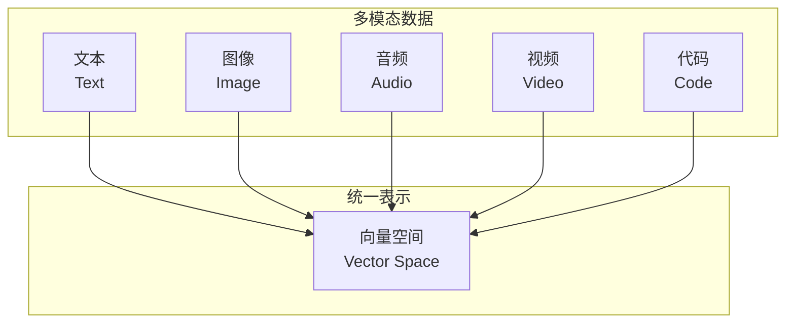

# 17.4 多模态检索：文本、图像与代码

> **设计思想**：掌握多模态数据的向量化和检索技术，实现跨模态的信息检索和匹配

## 本节概述

随着人工智能技术的发展，现实世界中的信息呈现多模态特性，包括文本、图像、音频、视频等多种形式。传统的单模态检索已经无法满足复杂应用场景的需求，多模态检索技术应运而生。多模态检索能够处理和理解不同模态的数据，并实现跨模态的信息检索和匹配。

本节将深入探讨多模态检索的核心技术，包括文本、图像和代码的向量化方法，跨模态相似度计算，以及多模态检索系统的实现。

## 学习目标

完成本节学习后，你将：

- ✅ **理解多模态检索概念**：掌握多模态数据的特点和检索挑战
- ✅ **掌握文本向量化技术**：学会使用先进的文本嵌入模型
- ✅ **实现图像向量化方法**：掌握图像特征提取和表示技术
- ✅ **掌握代码向量化技术**：学会代码文档的向量化处理方法
- ✅ **实现跨模态相似度计算**：掌握不同模态间相似度的计算方法
- ✅ **构建多模态检索系统**：学会设计和实现完整的多模态检索系统

## 多模态检索基础概念

### 1. 多模态数据特点

多模态数据具有以下特点：

1. **异构性**：不同模态的数据结构和表示方式不同
2. **互补性**：不同模态的信息可以相互补充
3. **关联性**：不同模态间存在语义关联
4. **复杂性**：处理和理解多模态数据更加复杂



### 2. 多模态检索挑战

多模态检索面临以下挑战：

1. **模态间语义鸿沟**：不同模态的语义表示存在差异
2. **特征表示不一致**：不同模态的特征维度和分布不同
3. **计算复杂度高**：需要处理多种模态的数据
4. **标注数据稀缺**：跨模态的标注数据获取困难

## 文本向量化技术

### 1. 高级文本嵌入模型

```java
public class AdvancedTextEmbedder {
    private TransformerModel transformerModel;
    private int embeddingDimension;
    
    public AdvancedTextEmbedder(TransformerModel transformerModel) {
        this.transformerModel = transformerModel;
        this.embeddingDimension = transformerModel.getEmbeddingDimension();
    }
    
    public float[] embedText(String text) {
        try {
            return transformerModel.encode(text);
        } catch (Exception e) {
            // 失败时返回零向量
            return new float[embeddingDimension];
        }
    }
    
    public float[][] embedTexts(List<String> texts) {
        try {
            return transformerModel.encodeBatch(texts);
        } catch (Exception e) {
            // 批量编码失败时逐个编码
            float[][] embeddings = new float[texts.size()][embeddingDimension];
            for (int i = 0; i < texts.size(); i++) {
                embeddings[i] = embedText(texts.get(i));
            }
            return embeddings;
        }
    }
    
    public double calculateSimilarity(String text1, String text2) {
        float[] embedding1 = embedText(text1);
        float[] embedding2 = embedText(text2);
        return cosineSimilarity(embedding1, embedding2);
    }
    
    private double cosineSimilarity(float[] vector1, float[] vector2) {
        double dotProduct = 0.0;
        double norm1 = 0.0;
        double norm2 = 0.0;
        
        for (int i = 0; i < vector1.length; i++) {
            dotProduct += vector1[i] * vector2[i];
            norm1 += vector1[i] * vector1[i];
            norm2 += vector2[i] * vector2[i];
        }
        
        if (norm1 == 0 || norm2 == 0) {
            return 0.0;
        }
        
        return dotProduct / (Math.sqrt(norm1) * Math.sqrt(norm2));
    }
    
    public int getEmbeddingDimension() {
        return embeddingDimension;
    }
}

// Transformer模型接口
interface TransformerModel {
    float[] encode(String text) throws Exception;
    float[][] encodeBatch(List<String> texts) throws Exception;
    int getEmbeddingDimension();
}

// 模拟Transformer模型
class MockTransformerModel implements TransformerModel {
    private int dimension;
    private Random random;
    
    public MockTransformerModel(int dimension) {
        this.dimension = dimension;
        this.random = new Random(42);
    }
    
    @Override
    public float[] encode(String text) {
        float[] vector = new float[dimension];
        for (int i = 0; i < dimension; i++) {
            vector[i] = random.nextFloat() * 2 - 1; // [-1, 1]范围内的随机数
        }
        return vector;
    }
    
    @Override
    public float[][] encodeBatch(List<String> texts) {
        float[][] vectors = new float[texts.size()][dimension];
        for (int i = 0; i < texts.size(); i++) {
            vectors[i] = encode(texts.get(i));
        }
        return vectors;
    }
    
    @Override
    public int getEmbeddingDimension() {
        return dimension;
    }
}
```

### 2. 文本预处理和增强

```java
public class TextPreprocessor {
    
    public String preprocess(String text) {
        // 1. 转换为小写
        String processed = text.toLowerCase();
        
        // 2. 移除多余空格
        processed = processed.replaceAll("\\s+", " ").trim();
        
        // 3. 移除特殊字符（保留基本标点）
        processed = processed.replaceAll("[^a-zA-Z0-9\\s.,!?;:]", "");
        
        return processed;
    }
    
    public List<String> tokenize(String text) {
        // 简单的分词实现
        return Arrays.asList(preprocess(text).split("\\s+"));
    }
    
    public String removeStopWords(String text) {
        Set<String> stopWords = getStopWords();
        List<String> tokens = tokenize(text);
        return tokens.stream()
            .filter(token -> !stopWords.contains(token.toLowerCase()))
            .collect(Collectors.joining(" "));
    }
    
    public String stemText(String text) {
        List<String> tokens = tokenize(text);
        return tokens.stream()
            .map(this::stemWord)
            .collect(Collectors.joining(" "));
    }
    
    private String stemWord(String word) {
        // 简单的词干提取（实际应用中应使用Porter Stemmer等）
        if (word.endsWith("ing")) {
            return word.substring(0, word.length() - 3);
        } else if (word.endsWith("ed")) {
            return word.substring(0, word.length() - 2);
        } else if (word.endsWith("s") && word.length() > 1) {
            return word.substring(0, word.length() - 1);
        }
        return word;
    }
    
    private Set<String> getStopWords() {
        return new HashSet<>(Arrays.asList(
            "the", "a", "an", "and", "or", "but", "in", "on", "at", "to", "for", "of", "with", "by",
            "is", "are", "was", "were", "be", "been", "have", "has", "had", "do", "does", "did",
            "will", "would", "could", "should", "may", "might", "must", "can"
        ));
    }
    
    public List<String> generateNgrams(String text, int n) {
        List<String> tokens = tokenize(text);
        List<String> ngrams = new ArrayList<>();
        
        for (int i = 0; i <= tokens.size() - n; i++) {
            StringBuilder ngram = new StringBuilder();
            for (int j = 0; j < n; j++) {
                if (j > 0) ngram.append(" ");
                ngram.append(tokens.get(i + j));
            }
            ngrams.add(ngram.toString());
        }
        
        return ngrams;
    }
}
```

## 图像向量化技术

### 1. 卷积神经网络特征提取

```java
public class ImageFeatureExtractor {
    private CNNModel cnnModel;
    private int featureDimension;
    
    public ImageFeatureExtractor(CNNModel cnnModel) {
        this.cnnModel = cnnModel;
        this.featureDimension = cnnModel.getFeatureDimension();
    }
    
    public float[] extractFeatures(byte[] imageBytes) {
        try {
            return cnnModel.extractFeatures(imageBytes);
        } catch (Exception e) {
            // 失败时返回零向量
            return new float[featureDimension];
        }
    }
    
    public float[] extractFeatures(BufferedImage image) {
        try {
            return cnnModel.extractFeatures(image);
        } catch (Exception e) {
            return new float[featureDimension];
        }
    }
    
    public float[][] extractFeaturesBatch(List<byte[]> imageBytesList) {
        try {
            return cnnModel.extractFeaturesBatch(imageBytesList);
        } catch (Exception e) {
            // 批量提取失败时逐个提取
            float[][] features = new float[imageBytesList.size()][featureDimension];
            for (int i = 0; i < imageBytesList.size(); i++) {
                features[i] = extractFeatures(imageBytesList.get(i));
            }
            return features;
        }
    }
    
    public double calculateSimilarity(byte[] image1, byte[] image2) {
        float[] features1 = extractFeatures(image1);
        float[] features2 = extractFeatures(image2);
        return cosineSimilarity(features1, features2);
    }
    
    private double cosineSimilarity(float[] vector1, float[] vector2) {
        double dotProduct = 0.0;
        double norm1 = 0.0;
        double norm2 = 0.0;
        
        for (int i = 0; i < vector1.length; i++) {
            dotProduct += vector1[i] * vector2[i];
            norm1 += vector1[i] * vector1[i];
            norm2 += vector2[i] * vector2[i];
        }
        
        if (norm1 == 0 || norm2 == 0) {
            return 0.0;
        }
        
        return dotProduct / (Math.sqrt(norm1) * Math.sqrt(norm2));
    }
    
    public int getFeatureDimension() {
        return featureDimension;
    }
}

// CNN模型接口
interface CNNModel {
    float[] extractFeatures(byte[] imageBytes) throws Exception;
    float[] extractFeatures(BufferedImage image) throws Exception;
    float[][] extractFeaturesBatch(List<byte[]> imageBytesList) throws Exception;
    int getFeatureDimension();
}

// 模拟CNN模型
class MockCNNModel implements CNNModel {
    private int dimension;
    private Random random;
    
    public MockCNNModel(int dimension) {
        this.dimension = dimension;
        this.random = new Random(42);
    }
    
    @Override
    public float[] extractFeatures(byte[] imageBytes) {
        float[] features = new float[dimension];
        for (int i = 0; i < dimension; i++) {
            features[i] = random.nextFloat() * 2 - 1; // [-1, 1]范围内的随机数
        }
        return features;
    }
    
    @Override
    public float[] extractFeatures(BufferedImage image) {
        return extractFeatures(new byte[0]); // 简化处理
    }
    
    @Override
    public float[][] extractFeaturesBatch(List<byte[]> imageBytesList) {
        float[][] features = new float[imageBytesList.size()][dimension];
        for (int i = 0; i < imageBytesList.size(); i++) {
            features[i] = extractFeatures(imageBytesList.get(i));
        }
        return features;
    }
    
    @Override
    public int getFeatureDimension() {
        return dimension;
    }
}
```

### 2. 图像预处理

```java
public class ImagePreprocessor {
    
    public byte[] preprocessImage(byte[] imageBytes, int targetWidth, int targetHeight) {
        try {
            BufferedImage image = ImageIO.read(new ByteArrayInputStream(imageBytes));
            BufferedImage processedImage = preprocessImage(image, targetWidth, targetHeight);
            ByteArrayOutputStream baos = new ByteArrayOutputStream();
            ImageIO.write(processedImage, "JPEG", baos);
            return baos.toByteArray();
        } catch (Exception e) {
            throw new RuntimeException("Image preprocessing failed", e);
        }
    }
    
    public BufferedImage preprocessImage(BufferedImage image, int targetWidth, int targetHeight) {
        // 1. 调整大小
        Image scaledImage = image.getScaledInstance(targetWidth, targetHeight, Image.SCALE_SMOOTH);
        BufferedImage scaledBufferedImage = new BufferedImage(targetWidth, targetHeight, BufferedImage.TYPE_INT_RGB);
        Graphics2D g2d = scaledBufferedImage.createGraphics();
        g2d.drawImage(scaledImage, 0, 0, null);
        g2d.dispose();
        
        // 2. 转换为RGB
        BufferedImage rgbImage = new BufferedImage(targetWidth, targetHeight, BufferedImage.TYPE_INT_RGB);
        Graphics g = rgbImage.getGraphics();
        g.drawImage(scaledBufferedImage, 0, 0, null);
        g.dispose();
        
        return rgbImage;
    }
    
    public byte[] normalizeImage(byte[] imageBytes) {
        // 图像归一化处理
        // 这里简化处理，实际应用中可能需要更复杂的归一化
        return imageBytes;
    }
    
    public byte[] augmentImage(byte[] imageBytes) {
        // 图像增强处理（旋转、翻转、亮度调整等）
        // 这里简化处理，实际应用中应实现具体的增强算法
        return imageBytes;
    }
    
    public List<byte[]> generateImagePyramid(byte[] imageBytes, int levels) {
        List<byte[]> pyramid = new ArrayList<>();
        try {
            BufferedImage image = ImageIO.read(new ByteArrayInputStream(imageBytes));
            int width = image.getWidth();
            int height = image.getHeight();
            
            for (int i = 0; i < levels; i++) {
                int scale = (int) Math.pow(2, i);
                int newWidth = Math.max(width / scale, 32);
                int newHeight = Math.max(height / scale, 32);
                
                BufferedImage scaledImage = preprocessImage(image, newWidth, newHeight);
                ByteArrayOutputStream baos = new ByteArrayOutputStream();
                ImageIO.write(scaledImage, "JPEG", baos);
                pyramid.add(baos.toByteArray());
            }
        } catch (Exception e) {
            throw new RuntimeException("Image pyramid generation failed", e);
        }
        
        return pyramid;
    }
}
```

## 代码向量化技术

### 1. 代码AST解析和特征提取

```java
public class CodeFeatureExtractor {
    private CodeParser codeParser;
    private TextEmbedder textEmbedder;
    private int embeddingDimension;
    
    public CodeFeatureExtractor(CodeParser codeParser, TextEmbedder textEmbedder) {
        this.codeParser = codeParser;
        this.textEmbedder = textEmbedder;
        this.embeddingDimension = textEmbedder.getEmbeddingDimension();
    }
    
    public float[] extractFeatures(String code) {
        try {
            // 1. 解析代码为AST
            ASTNode ast = codeParser.parse(code);
            
            // 2. 提取代码特征
            CodeFeatures features = extractCodeFeatures(ast);
            
            // 3. 向量化特征
            return vectorizeFeatures(features);
        } catch (Exception e) {
            // 失败时返回零向量
            return new float[embeddingDimension];
        }
    }
    
    private CodeFeatures extractCodeFeatures(ASTNode ast) {
        CodeFeatures features = new CodeFeatures();
        
        // 提取基本特征
        features.setLineCount(ast.getLineCount());
        features.setFunctionCount(ast.getFunctionCount());
        features.setClassCount(ast.getClassCount());
        features.setVariableCount(ast.getVariableCount());
        
        // 提取复杂度特征
        features.setCyclomaticComplexity(ast.calculateCyclomaticComplexity());
        features.setNestingDepth(ast.calculateMaxNestingDepth());
        
        // 提取关键词特征
        features.setKeywords(ast.extractKeywords());
        
        // 提取注释特征
        features.setCommentRatio(ast.calculateCommentRatio());
        
        return features;
    }
    
    private float[] vectorizeFeatures(CodeFeatures features) {
        // 将代码特征转换为向量表示
        List<Float> vectorComponents = new ArrayList<>();
        
        // 数值特征
        vectorComponents.add((float) features.getLineCount());
        vectorComponents.add((float) features.getFunctionCount());
        vectorComponents.add((float) features.getClassCount());
        vectorComponents.add((float) features.getVariableCount());
        vectorComponents.add((float) features.getCyclomaticComplexity());
        vectorComponents.add((float) features.getNestingDepth());
        vectorComponents.add((float) features.getCommentRatio());
        
        // 关键词特征向量化
        String keywordsText = String.join(" ", features.getKeywords());
        float[] keywordVector = textEmbedder.embedText(keywordsText);
        for (float value : keywordVector) {
            vectorComponents.add(value);
        }
        
        // 转换为数组
        float[] vector = new float[vectorComponents.size()];
        for (int i = 0; i < vectorComponents.size(); i++) {
            vector[i] = vectorComponents.get(i);
        }
        
        return vector;
    }
    
    public double calculateSimilarity(String code1, String code2) {
        float[] features1 = extractFeatures(code1);
        float[] features2 = extractFeatures(code2);
        return cosineSimilarity(features1, features2);
    }
    
    private double cosineSimilarity(float[] vector1, float[] vector2) {
        double dotProduct = 0.0;
        double norm1 = 0.0;
        double norm2 = 0.0;
        
        for (int i = 0; i < vector1.length; i++) {
            dotProduct += vector1[i] * vector2[i];
            norm1 += vector1[i] * vector1[i];
            norm2 += vector2[i] * vector2[i];
        }
        
        if (norm1 == 0 || norm2 == 0) {
            return 0.0;
        }
        
        return dotProduct / (Math.sqrt(norm1) * Math.sqrt(norm2));
    }
    
    public int getEmbeddingDimension() {
        return embeddingDimension;
    }
}

// 代码解析器接口
interface CodeParser {
    ASTNode parse(String code) throws Exception;
}

// AST节点基类
abstract class ASTNode {
    protected int lineCount;
    protected int functionCount;
    protected int classCount;
    protected int variableCount;
    
    public abstract int getLineCount();
    public abstract int getFunctionCount();
    public abstract int getClassCount();
    public abstract int getVariableCount();
    public abstract int calculateCyclomaticComplexity();
    public abstract int calculateMaxNestingDepth();
    public abstract Set<String> extractKeywords();
    public abstract double calculateCommentRatio();
}

// 代码特征类
class CodeFeatures {
    private int lineCount;
    private int functionCount;
    private int classCount;
    private int variableCount;
    private int cyclomaticComplexity;
    private int nestingDepth;
    private double commentRatio;
    private Set<String> keywords;
    
    public CodeFeatures() {
        this.keywords = new HashSet<>();
    }
    
    // Getters and Setters
    public int getLineCount() { return lineCount; }
    public void setLineCount(int lineCount) { this.lineCount = lineCount; }
    
    public int getFunctionCount() { return functionCount; }
    public void setFunctionCount(int functionCount) { this.functionCount = functionCount; }
    
    public int getClassCount() { return classCount; }
    public void setClassCount(int classCount) { this.classCount = classCount; }
    
    public int getVariableCount() { return variableCount; }
    public void setVariableCount(int variableCount) { this.variableCount = variableCount; }
    
    public int getCyclomaticComplexity() { return cyclomaticComplexity; }
    public void setCyclomaticComplexity(int cyclomaticComplexity) { this.cyclomaticComplexity = cyclomaticComplexity; }
    
    public int getNestingDepth() { return nestingDepth; }
    public void setNestingDepth(int nestingDepth) { this.nestingDepth = nestingDepth; }
    
    public double getCommentRatio() { return commentRatio; }
    public void setCommentRatio(double commentRatio) { this.commentRatio = commentRatio; }
    
    public Set<String> getKeywords() { return keywords; }
    public void setKeywords(Set<String> keywords) { this.keywords = keywords; }
}

// 模拟代码解析器
class MockCodeParser implements CodeParser {
    @Override
    public ASTNode parse(String code) throws Exception {
        return new MockASTNode(code);
    }
}

// 模拟AST节点
class MockASTNode extends ASTNode {
    private String code;
    
    public MockASTNode(String code) {
        this.code = code;
        this.lineCount = code.split("\n").length;
        this.functionCount = countOccurrences(code, "function") + countOccurrences(code, "def");
        this.classCount = countOccurrences(code, "class");
        this.variableCount = countOccurrences(code, "var") + countOccurrences(code, "let");
    }
    
    private int countOccurrences(String text, String pattern) {
        return text.split(pattern, -1).length - 1;
    }
    
    @Override
    public int getLineCount() { return lineCount; }
    
    @Override
    public int getFunctionCount() { return functionCount; }
    
    @Override
    public int getClassCount() { return classCount; }
    
    @Override
    public int getVariableCount() { return variableCount; }
    
    @Override
    public int calculateCyclomaticComplexity() {
        // 简化计算
        return countOccurrences(code, "if") + countOccurrences(code, "for") + 
               countOccurrences(code, "while") + 1;
    }
    
    @Override
    public int calculateMaxNestingDepth() {
        // 简化计算
        return Math.min(countOccurrences(code, "{"), 10);
    }
    
    @Override
    public Set<String> extractKeywords() {
        Set<String> keywords = new HashSet<>();
        String[] words = code.split("\\W+");
        for (String word : words) {
            if (word.length() > 0) {
                keywords.add(word.toLowerCase());
            }
        }
        return keywords;
    }
    
    @Override
    public double calculateCommentRatio() {
        int commentLines = countOccurrences(code, "//") + countOccurrences(code, "#");
        return lineCount > 0 ? (double) commentLines / lineCount : 0.0;
    }
}

// 文本嵌入器接口
interface TextEmbedder {
    float[] embedText(String text);
    int getEmbeddingDimension();
}
```

### 2. 代码文档向量化

```java
public class CodeDocumentationVectorizer {
    private TextEmbedder textEmbedder;
    private CodeFeatureExtractor codeFeatureExtractor;
    private int embeddingDimension;
    
    public CodeDocumentationVectorizer(TextEmbedder textEmbedder, 
                                     CodeFeatureExtractor codeFeatureExtractor) {
        this.textEmbedder = textEmbedder;
        this.codeFeatureExtractor = codeFeatureExtractor;
        // 假设文本嵌入维度和代码特征维度相同
        this.embeddingDimension = textEmbedder.getEmbeddingDimension();
    }
    
    public float[] vectorizeCodeWithDocumentation(CodeDocument codeDoc) {
        // 1. 代码向量化
        float[] codeVector = codeFeatureExtractor.extractFeatures(codeDoc.getCode());
        
        // 2. 文档向量化
        float[] docVector = textEmbedder.embedText(codeDoc.getDocumentation());
        
        // 3. 函数名向量化
        float[] functionNameVector = textEmbedder.embedText(codeDoc.getFunctionName());
        
        // 4. 融合向量（加权平均）
        float[] combinedVector = new float[embeddingDimension];
        float codeWeight = 0.5f;
        float docWeight = 0.3f;
        float nameWeight = 0.2f;
        
        for (int i = 0; i < embeddingDimension; i++) {
            combinedVector[i] = codeWeight * codeVector[i] + 
                              docWeight * docVector[i] + 
                              nameWeight * functionNameVector[i];
        }
        
        return combinedVector;
    }
    
    public double calculateSimilarity(CodeDocument doc1, CodeDocument doc2) {
        float[] vector1 = vectorizeCodeWithDocumentation(doc1);
        float[] vector2 = vectorizeCodeWithDocumentation(doc2);
        return cosineSimilarity(vector1, vector2);
    }
    
    private double cosineSimilarity(float[] vector1, float[] vector2) {
        double dotProduct = 0.0;
        double norm1 = 0.0;
        double norm2 = 0.0;
        
        for (int i = 0; i < vector1.length; i++) {
            dotProduct += vector1[i] * vector2[i];
            norm1 += vector1[i] * vector1[i];
            norm2 += vector2[i] * vector2[i];
        }
        
        if (norm1 == 0 || norm2 == 0) {
            return 0.0;
        }
        
        return dotProduct / (Math.sqrt(norm1) * Math.sqrt(norm2));
    }
    
    public int getEmbeddingDimension() {
        return embeddingDimension;
    }
}

class CodeDocument {
    private String code;
    private String documentation;
    private String functionName;
    private String filePath;
    private Set<String> tags;
    
    public CodeDocument(String code, String documentation, String functionName) {
        this.code = code;
        this.documentation = documentation;
        this.functionName = functionName;
        this.tags = new HashSet<>();
    }
    
    // Getters and Setters
    public String getCode() { return code; }
    public void setCode(String code) { this.code = code; }
    
    public String getDocumentation() { return documentation; }
    public void setDocumentation(String documentation) { this.documentation = documentation; }
    
    public String getFunctionName() { return functionName; }
    public void setFunctionName(String functionName) { this.functionName = functionName; }
    
    public String getFilePath() { return filePath; }
    public void setFilePath(String filePath) { this.filePath = filePath; }
    
    public Set<String> getTags() { return tags; }
    public void addTag(String tag) { this.tags.add(tag); }
}
```

## 跨模态相似度计算

### 1. 多模态联合嵌入

```java
public class MultimodalEmbedder {
    private Map<ModalityType, Embedder> embedders;
    private MultimodalFusionModel fusionModel;
    private int jointEmbeddingDimension;
    
    public MultimodalEmbedder(MultimodalFusionModel fusionModel) {
        this.embedders = new HashMap<>();
        this.fusionModel = fusionModel;
        this.jointEmbeddingDimension = fusionModel.getOutputDimension();
    }
    
    public void registerEmbedder(ModalityType modality, Embedder embedder) {
        embedders.put(modality, embedder);
    }
    
    public float[] embedMultimodal(MultimodalData data) {
        try {
            // 1. 分别嵌入各模态数据
            Map<ModalityType, float[]> embeddings = new HashMap<>();
            for (Map.Entry<ModalityType, Object> entry : data.getData().entrySet()) {
                ModalityType modality = entry.getKey();
                Object modalityData = entry.getValue();
                
                Embedder embedder = embedders.get(modality);
                if (embedder != null) {
                    float[] embedding = embedder.embed(modalityData);
                    embeddings.put(modality, embedding);
                }
            }
            
            // 2. 融合多模态嵌入
            return fusionModel.fuse(embeddings);
        } catch (Exception e) {
            // 失败时返回零向量
            return new float[jointEmbeddingDimension];
        }
    }
    
    public double calculateSimilarity(MultimodalData data1, MultimodalData data2) {
        float[] embedding1 = embedMultimodal(data1);
        float[] embedding2 = embedMultimodal(data2);
        return cosineSimilarity(embedding1, embedding2);
    }
    
    private double cosineSimilarity(float[] vector1, float[] vector2) {
        double dotProduct = 0.0;
        double norm1 = 0.0;
        double norm2 = 0.0;
        
        for (int i = 0; i < vector1.length; i++) {
            dotProduct += vector1[i] * vector2[i];
            norm1 += vector1[i] * vector1[i];
            norm2 += vector2[i] * vector2[i];
        }
        
        if (norm1 == 0 || norm2 == 0) {
            return 0.0;
        }
        
        return dotProduct / (Math.sqrt(norm1) * Math.sqrt(norm2));
    }
    
    public int getJointEmbeddingDimension() {
        return jointEmbeddingDimension;
    }
}

enum ModalityType {
    TEXT, IMAGE, AUDIO, VIDEO, CODE
}

// 嵌入器接口
interface Embedder {
    float[] embed(Object data) throws Exception;
}

// 多模态融合模型接口
interface MultimodalFusionModel {
    float[] fuse(Map<ModalityType, float[]> embeddings) throws Exception;
    int getOutputDimension();
}

// 多模态数据类
class MultimodalData {
    private Map<ModalityType, Object> data;
    
    public MultimodalData() {
        this.data = new HashMap<>();
    }
    
    public void addData(ModalityType modality, Object data) {
        this.data.put(modality, data);
    }
    
    public Map<ModalityType, Object> getData() {
        return data;
    }
    
    public Object getData(ModalityType modality) {
        return data.get(modality);
    }
}

// 模拟多模态融合模型
class MockMultimodalFusionModel implements MultimodalFusionModel {
    private int outputDimension;
    private Random random;
    
    public MockMultimodalFusionModel(int outputDimension) {
        this.outputDimension = outputDimension;
        this.random = new Random(42);
    }
    
    @Override
    public float[] fuse(Map<ModalityType, float[]> embeddings) throws Exception {
        // 简单的融合策略：平均各模态嵌入
        if (embeddings.isEmpty()) {
            return new float[outputDimension];
        }
        
        float[] fused = new float[outputDimension];
        int count = 0;
        
        for (float[] embedding : embeddings.values()) {
            int minLength = Math.min(outputDimension, embedding.length);
            for (int i = 0; i < minLength; i++) {
                fused[i] += embedding[i];
            }
            count++;
        }
        
        // 计算平均值
        if (count > 0) {
            for (int i = 0; i < outputDimension; i++) {
                fused[i] /= count;
            }
        }
        
        return fused;
    }
    
    @Override
    public int getOutputDimension() {
        return outputDimension;
    }
}
```

### 2. 跨模态检索

```java
public class CrossModalRetriever {
    private MultimodalEmbedder embedder;
    private MultimodalVectorDatabase vectorDB;
    private int topK;
    
    public CrossModalRetriever(MultimodalEmbedder embedder, 
                             MultimodalVectorDatabase vectorDB) {
        this.embedder = embedder;
        this.vectorDB = vectorDB;
        this.topK = 10;
    }
    
    public List<RetrievalResult> retrieve(MultimodalData queryData) {
        try {
            // 1. 查询数据向量化
            float[] queryVector = embedder.embedMultimodal(queryData);
            
            // 2. 向量检索
            List<VectorSearchResult> searchResults = vectorDB.search(queryVector, topK);
            
            // 3. 构建检索结果
            List<RetrievalResult> results = new ArrayList<>();
            for (VectorSearchResult result : searchResults) {
                MultimodalDocument doc = vectorDB.getDocument(result.getDocumentId());
                results.add(new RetrievalResult(doc, result.getSimilarity()));
            }
            
            return results;
        } catch (Exception e) {
            throw new RuntimeException("Cross-modal retrieval failed", e);
        }
    }
    
    public void indexDocument(String id, MultimodalData data) {
        try {
            // 1. 文档向量化
            float[] vector = embedder.embedMultimodal(data);
            
            // 2. 存储到向量数据库
            vectorDB.addDocument(id, data, vector);
        } catch (Exception e) {
            throw new RuntimeException("Document indexing failed", e);
        }
    }
    
    public void setTopK(int topK) {
        this.topK = topK;
    }
    
    public int getTopK() {
        return topK;
    }
}

class RetrievalResult {
    private MultimodalDocument document;
    private double similarity;
    
    public RetrievalResult(MultimodalDocument document, double similarity) {
        this.document = document;
        this.similarity = similarity;
    }
    
    // Getters
    public MultimodalDocument getDocument() { return document; }
    public double getSimilarity() { return similarity; }
}

class MultimodalDocument {
    private String id;
    private MultimodalData data;
    private Map<String, Object> metadata;
    
    public MultimodalDocument(String id, MultimodalData data) {
        this.id = id;
        this.data = data;
        this.metadata = new HashMap<>();
    }
    
    // Getters and Setters
    public String getId() { return id; }
    public MultimodalData getData() { return data; }
    public Map<String, Object> getMetadata() { return metadata; }
    public void addMetadata(String key, Object value) { metadata.put(key, value); }
}
```

## 多模态向量数据库

### 1. 多模态向量存储

```java
public class MultimodalVectorDatabase {
    private Map<String, MultimodalDocument> documents;
    private Map<String, float[]> vectors;
    private SimilarityCalculator similarityCalculator;
    private ReadWriteLock lock;
    
    public MultimodalVectorDatabase() {
        this.documents = new ConcurrentHashMap<>();
        this.vectors = new ConcurrentHashMap<>();
        this.similarityCalculator = new CosineSimilarityCalculator();
        this.lock = new ReentrantReadWriteLock();
    }
    
    public void addDocument(String id, MultimodalData data, float[] vector) {
        lock.writeLock().lock();
        try {
            MultimodalDocument document = new MultimodalDocument(id, data);
            documents.put(id, document);
            vectors.put(id, Arrays.copyOf(vector, vector.length));
        } finally {
            lock.writeLock().unlock();
        }
    }
    
    public List<VectorSearchResult> search(float[] queryVector, int topK) {
        lock.readLock().lock();
        try {
            // 计算所有文档与查询向量的相似度
            List<VectorSearchResult> results = new ArrayList<>();
            for (Map.Entry<String, float[]> entry : vectors.entrySet()) {
                String docId = entry.getKey();
                float[] docVector = entry.getValue();
                double similarity = similarityCalculator.calculate(queryVector, docVector);
                results.add(new VectorSearchResult(docId, similarity));
            }
            
            // 按相似度降序排序
            results.sort((a, b) -> Double.compare(b.getSimilarity(), a.getSimilarity()));
            
            // 返回前topK个结果
            return results.subList(0, Math.min(topK, results.size()));
        } finally {
            lock.readLock().unlock();
        }
    }
    
    public MultimodalDocument getDocument(String id) {
        lock.readLock().lock();
        try {
            return documents.get(id);
        } finally {
            lock.readLock().unlock();
        }
    }
    
    public void updateDocument(String id, MultimodalData newData, float[] newVector) {
        lock.writeLock().lock();
        try {
            MultimodalDocument document = documents.get(id);
            if (document != null) {
                document = new MultimodalDocument(id, newData);
                documents.put(id, document);
                vectors.put(id, Arrays.copyOf(newVector, newVector.length));
            }
        } finally {
            lock.writeLock().unlock();
        }
    }
    
    public void deleteDocument(String id) {
        lock.writeLock().lock();
        try {
            documents.remove(id);
            vectors.remove(id);
        } finally {
            lock.writeLock().unlock();
        }
    }
    
    public int size() {
        lock.readLock().lock();
        try {
            return documents.size();
        } finally {
            lock.readLock().unlock();
        }
    }
    
    public void clear() {
        lock.writeLock().lock();
        try {
            documents.clear();
            vectors.clear();
        } finally {
            lock.writeLock().unlock();
        }
    }
}

class VectorSearchResult {
    private String documentId;
    private double similarity;
    
    public VectorSearchResult(String documentId, double similarity) {
        this.documentId = documentId;
        this.similarity = similarity;
    }
    
    // Getters
    public String getDocumentId() { return documentId; }
    public double getSimilarity() { return similarity; }
}

interface SimilarityCalculator {
    double calculate(float[] vector1, float[] vector2);
}

class CosineSimilarityCalculator implements SimilarityCalculator {
    @Override
    public double calculate(float[] vector1, float[] vector2) {
        double dotProduct = 0.0;
        double norm1 = 0.0;
        double norm2 = 0.0;
        
        for (int i = 0; i < vector1.length; i++) {
            dotProduct += vector1[i] * vector2[i];
            norm1 += vector1[i] * vector1[i];
            norm2 += vector2[i] * vector2[i];
        }
        
        if (norm1 == 0 || norm2 == 0) {
            return 0.0;
        }
        
        return dotProduct / (Math.sqrt(norm1) * Math.sqrt(norm2));
    }
}
```

### 2. 近似最近邻搜索优化

```java
public class ANNMultimodalVectorDatabase {
    private List<MultimodalDocument> documents;
    private List<float[]> vectors;
    private int numTrees;
    private List<KDTree> trees;
    private int dimension;
    private ReadWriteLock lock;
    
    public ANNMultimodalVectorDatabase(int dimension, int numTrees) {
        this.documents = new ArrayList<>();
        this.vectors = new ArrayList<>();
        this.numTrees = numTrees;
        this.trees = new ArrayList<>();
        this.dimension = dimension;
        this.lock = new ReentrantReadWriteLock();
    }
    
    public void addDocument(String id, MultimodalData data, float[] vector) {
        if (vector.length != dimension) {
            throw new IllegalArgumentException("Vector dimension mismatch");
        }
        
        lock.writeLock().lock();
        try {
            MultimodalDocument document = new MultimodalDocument(id, data);
            documents.add(document);
            vectors.add(Arrays.copyOf(vector, dimension));
        } finally {
            lock.writeLock().unlock();
        }
    }
    
    public void buildIndex() {
        lock.writeLock().lock();
        try {
            // 构建多个KD树以提高搜索准确性
            trees.clear();
            for (int i = 0; i < numTrees; i++) {
                KDTree tree = new KDTree(documents, vectors, i);
                trees.add(tree);
            }
        } finally {
            lock.writeLock().unlock();
        }
    }
    
    public List<VectorSearchResult> search(float[] queryVector, int topK) {
        if (queryVector.length != dimension) {
            throw new IllegalArgumentException("Query vector dimension mismatch");
        }
        
        lock.readLock().lock();
        try {
            // 使用多个树进行搜索并合并结果
            Map<String, Double> scoreMap = new HashMap<>();
            
            for (KDTree tree : trees) {
                List<VectorSearchResult> treeResults = tree.search(queryVector, topK * 2);
                for (VectorSearchResult result : treeResults) {
                    String docId = result.getDocumentId();
                    double score = result.getSimilarity();
                    scoreMap.merge(docId, score, Double::max); // 取最大相似度
                }
            }
            
            // 按相似度排序并返回前topK个结果
            List<VectorSearchResult> results = scoreMap.entrySet().stream()
                .map(entry -> new VectorSearchResult(entry.getKey(), entry.getValue()))
                .sorted((a, b) -> Double.compare(b.getSimilarity(), a.getSimilarity()))
                .limit(topK)
                .collect(Collectors.toList());
                
            return results;
        } finally {
            lock.readLock().unlock();
        }
    }
    
    // KD树实现（简化版）
    static class KDTree {
        private Node root;
        private List<MultimodalDocument> documents;
        private List<float[]> vectors;
        private Random random;
        
        public KDTree(List<MultimodalDocument> documents, List<float[]> vectors, int seed) {
            this.documents = documents;
            this.vectors = vectors;
            this.random = new Random(seed);
            this.root = buildTree(documents, vectors, 0);
        }
        
        private Node buildTree(List<MultimodalDocument> docs, List<float[]> vecs, int depth) {
            if (docs.isEmpty()) {
                return null;
            }
            
            if (docs.size() == 1) {
                return new Node(docs.get(0), vecs.get(0), depth);
            }
            
            // 选择分割维度
            int splitDim = depth % vecs.get(0).length;
            
            // 按分割维度排序并选择中位数
            List<Pair> pairs = new ArrayList<>();
            for (int i = 0; i < docs.size(); i++) {
                pairs.add(new Pair(docs.get(i), vecs.get(i), i));
            }
            
            pairs.sort(Comparator.comparingDouble(pair -> pair.vector[splitDim]));
            int medianIndex = pairs.size() / 2;
            
            Pair medianPair = pairs.get(medianIndex);
            List<MultimodalDocument> leftDocs = new ArrayList<>();
            List<float[]> leftVecs = new ArrayList<>();
            List<MultimodalDocument> rightDocs = new ArrayList<>();
            List<float[]> rightVecs = new ArrayList<>();
            
            for (int i = 0; i < pairs.size(); i++) {
                Pair pair = pairs.get(i);
                if (i < medianIndex) {
                    leftDocs.add(pair.document);
                    leftVecs.add(pair.vector);
                } else if (i > medianIndex) {
                    rightDocs.add(pair.document);
                    rightVecs.add(pair.vector);
                }
            }
            
            Node node = new Node(medianPair.document, medianPair.vector, depth);
            node.left = buildTree(leftDocs, leftVecs, depth + 1);
            node.right = buildTree(rightDocs, rightVecs, depth + 1);
            
            return node;
        }
        
        public List<VectorSearchResult> search(float[] queryVector, int topK) {
            PriorityQueue<SearchCandidate> candidates = new PriorityQueue<>(
                Comparator.comparingDouble(SearchCandidate::getDistance));
            
            searchRecursive(root, queryVector, candidates, topK);
            
            // 转换为结果列表
            List<VectorSearchResult> results = new ArrayList<>();
            while (!candidates.isEmpty()) {
                SearchCandidate candidate = candidates.poll();
                results.add(new VectorSearchResult(
                    candidate.getDocument().getId(), 
                    1.0 / (1.0 + candidate.getDistance()))); // 转换为相似度
            }
            
            return results;
        }
        
        private void searchRecursive(Node node, float[] queryVector, 
                                   PriorityQueue<SearchCandidate> candidates, int topK) {
            if (node == null) {
                return;
            }
            
            // 计算到当前节点的距离
            double distance = euclideanDistance(queryVector, node.vector);
            candidates.offer(new SearchCandidate(node.document, distance));
            
            // 保持候选集大小不超过topK
            if (candidates.size() > topK) {
                candidates.poll();
            }
            
            // 递归搜索子树
            int splitDim = node.depth % queryVector.length;
            Node nextNode = queryVector[splitDim] < node.vector[splitDim] ? 
                           node.left : node.right;
            Node otherNode = nextNode == node.left ? node.right : node.left;
            
            searchRecursive(nextNode, queryVector, candidates, topK);
            
            // 如果可能包含更近的点，则搜索另一子树
            if (candidates.size() < topK || 
                Math.abs(queryVector[splitDim] - node.vector[splitDim]) < 
                candidates.peek().getDistance()) {
                searchRecursive(otherNode, queryVector, candidates, topK);
            }
        }
        
        private double euclideanDistance(float[] v1, float[] v2) {
            double sum = 0.0;
            for (int i = 0; i < v1.length; i++) {
                double diff = v1[i] - v2[i];
                sum += diff * diff;
            }
            return Math.sqrt(sum);
        }
        
        static class Node {
            MultimodalDocument document;
            float[] vector;
            int depth;
            Node left;
            Node right;
            
            Node(MultimodalDocument document, float[] vector, int depth) {
                this.document = document;
                this.vector = vector;
                this.depth = depth;
            }
        }
        
        static class Pair {
            MultimodalDocument document;
            float[] vector;
            int index;
            
            Pair(MultimodalDocument document, float[] vector, int index) {
                this.document = document;
                this.vector = vector;
                this.index = index;
            }
        }
        
        static class SearchCandidate {
            MultimodalDocument document;
            double distance;
            
            SearchCandidate(MultimodalDocument document, double distance) {
                this.document = document;
                this.distance = distance;
            }
            
            MultimodalDocument getDocument() { return document; }
            double getDistance() { return distance; }
        }
    }
}
```

## 实际应用示例

### 多模态检索系统

```java
public class MultimodalRetrievalSystem {
    private MultimodalEmbedder embedder;
    private ANNMultimodalVectorDatabase vectorDB;
    private TextPreprocessor textPreprocessor;
    private ImagePreprocessor imagePreprocessor;
    
    public MultimodalRetrievalSystem() {
        // 初始化组件
        this.embedder = createEmbedder();
        this.vectorDB = new ANNMultimodalVectorDatabase(512, 5);
        this.textPreprocessor = new TextPreprocessor();
        this.imagePreprocessor = new ImagePreprocessor();
    }
    
    private MultimodalEmbedder createEmbedder() {
        MultimodalEmbedder embedder = new MultimodalEmbedder(
            new MockMultimodalFusionModel(512)
        );
        
        // 注册各模态嵌入器
        embedder.registerEmbedder(ModalityType.TEXT, new TextEmbedderAdapter(
            new AdvancedTextEmbedder(new MockTransformerModel(512))
        ));
        
        embedder.registerEmbedder(ModalityType.IMAGE, new ImageEmbedderAdapter(
            new ImageFeatureExtractor(new MockCNNModel(512))
        ));
        
        embedder.registerEmbedder(ModalityType.CODE, new CodeEmbedderAdapter(
            new CodeFeatureExtractor(
                new MockCodeParser(),
                new AdvancedTextEmbedder(new MockTransformerModel(512))
            )
        ));
        
        return embedder;
    }
    
    public void indexDocument(String id, String text, byte[] image, String code) {
        MultimodalData data = new MultimodalData();
        
        // 预处理并添加文本数据
        if (text != null && !text.isEmpty()) {
            String processedText = textPreprocessor.preprocess(text);
            data.addData(ModalityType.TEXT, processedText);
        }
        
        // 预处理并添加图像数据
        if (image != null && image.length > 0) {
            byte[] processedImage = imagePreprocessor.preprocessImage(image, 224, 224);
            data.addData(ModalityType.IMAGE, processedImage);
        }
        
        // 预处理并添加代码数据
        if (code != null && !code.isEmpty()) {
            CodeDocument codeDoc = new CodeDocument(code, "", "");
            data.addData(ModalityType.CODE, codeDoc);
        }
        
        // 向量化并索引
        float[] vector = embedder.embedMultimodal(data);
        vectorDB.addDocument(id, data, vector);
    }
    
    public List<RetrievalResult> searchByText(String queryText) {
        String processedText = textPreprocessor.preprocess(queryText);
        MultimodalData queryData = new MultimodalData();
        queryData.addData(ModalityType.TEXT, processedText);
        
        return search(queryData);
    }
    
    public List<RetrievalResult> searchByImage(byte[] queryImage) {
        byte[] processedImage = imagePreprocessor.preprocessImage(queryImage, 224, 224);
        MultimodalData queryData = new MultimodalData();
        queryData.addData(ModalityType.IMAGE, processedImage);
        
        return search(queryData);
    }
    
    public List<RetrievalResult> searchByCode(String queryCode) {
        CodeDocument codeDoc = new CodeDocument(queryCode, "", "");
        MultimodalData queryData = new MultimodalData();
        queryData.addData(ModalityType.CODE, codeDoc);
        
        return search(queryData);
    }
    
    private List<RetrievalResult> search(MultimodalData queryData) {
        CrossModalRetriever retriever = new CrossModalRetriever(embedder, vectorDB);
        return retriever.retrieve(queryData);
    }
    
    public void buildIndex() {
        vectorDB.buildIndex();
    }
    
    public int getDocumentCount() {
        return vectorDB.size();
    }
}

// 各模态嵌入器适配器
class TextEmbedderAdapter implements Embedder {
    private AdvancedTextEmbedder textEmbedder;
    
    public TextEmbedderAdapter(AdvancedTextEmbedder textEmbedder) {
        this.textEmbedder = textEmbedder;
    }
    
    @Override
    public float[] embed(Object data) throws Exception {
        if (data instanceof String) {
            return textEmbedder.embedText((String) data);
        }
        throw new IllegalArgumentException("Expected String data for text embedding");
    }
}

class ImageEmbedderAdapter implements Embedder {
    private ImageFeatureExtractor imageExtractor;
    
    public ImageEmbedderAdapter(ImageFeatureExtractor imageExtractor) {
        this.imageExtractor = imageExtractor;
    }
    
    @Override
    public float[] embed(Object data) throws Exception {
        if (data instanceof byte[]) {
            return imageExtractor.extractFeatures((byte[]) data);
        } else if (data instanceof BufferedImage) {
            return imageExtractor.extractFeatures((BufferedImage) data);
        }
        throw new IllegalArgumentException("Expected byte[] or BufferedImage for image embedding");
    }
}

class CodeEmbedderAdapter implements Embedder {
    private CodeFeatureExtractor codeExtractor;
    
    public CodeEmbedderAdapter(CodeFeatureExtractor codeExtractor) {
        this.codeExtractor = codeExtractor;
    }
    
    @Override
    public float[] embed(Object data) throws Exception {
        if (data instanceof CodeDocument) {
            CodeDocument codeDoc = (CodeDocument) data;
            return codeExtractor.extractFeatures(codeDoc.getCode());
        }
        throw new IllegalArgumentException("Expected CodeDocument for code embedding");
    }
}

// 使用示例
class MultimodalRetrievalExample {
    public static void main(String[] args) {
        MultimodalRetrievalSystem system = new MultimodalRetrievalSystem();
        
        // 索引文档
        system.indexDocument("doc1", "机器学习算法", new byte[0], "public class MLAlgorithm {}");
        system.indexDocument("doc2", "深度学习模型", new byte[0], "public class DeepLearningModel {}");
        system.indexDocument("doc3", "自然语言处理", new byte[0], "public class NLPProcessor {}");
        
        // 构建索引
        system.buildIndex();
        
        // 文本检索
        List<RetrievalResult> results = system.searchByText("机器学习");
        System.out.println("Text search results:");
        for (RetrievalResult result : results) {
            System.out.println("Document: " + result.getDocument().getId() + 
                             ", Similarity: " + result.getSimilarity());
        }
        
        System.out.println("Total documents indexed: " + system.getDocumentCount());
    }
}
```

## 本节小结

本节我们深入探讨了多模态检索的核心技术，包括：

1. **多模态检索基础概念**：
   - 理解了多模态数据的特点和检索挑战
   - 掌握了多模态数据的统一表示方法

2. **文本向量化技术**：
   - 高级文本嵌入模型的实现
   - 文本预处理和增强技术

3. **图像向量化技术**：
   - 卷积神经网络特征提取
   - 图像预处理技术

4. **代码向量化技术**：
   - 代码AST解析和特征提取
   - 代码文档向量化方法

5. **跨模态相似度计算**：
   - 多模态联合嵌入技术
   - 跨模态检索实现

6. **多模态向量数据库**：
   - 多模态向量存储实现
   - 近似最近邻搜索优化

7. **实际应用示例**：
   - 完整的多模态检索系统实现

通过本节的学习，我们掌握了处理文本、图像和代码等多模态数据的向量化和检索技术，为构建更加智能和全面的信息检索系统奠定了坚实基础。在下一节中，我们将学习智能推理技术，进一步提升系统的复杂问题解决能力。