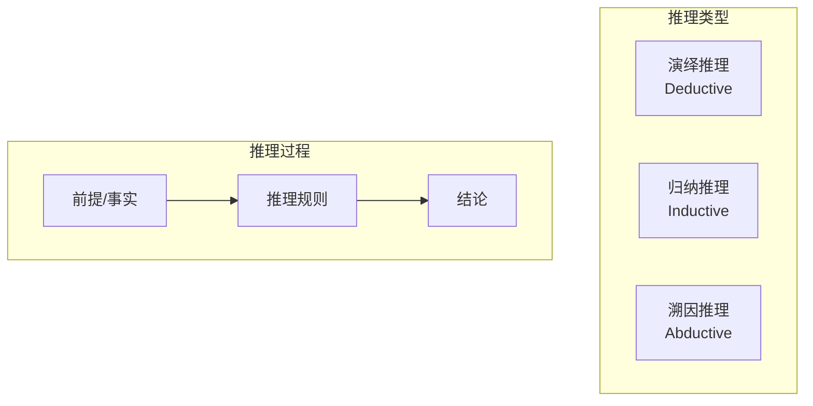

# 17.5 智能推理：多步骤问题解决

> **设计思想**：掌握复杂问题的分解和推理技术，实现多步骤问题解决能力

## 本节概述

智能推理是人工智能系统的核心能力之一，它使系统能够基于已知信息进行逻辑推导，解决复杂问题。在现实应用中，许多问题无法通过单一的推理步骤解决，而是需要多步骤的推理过程。多步骤问题解决能力使AI系统能够处理更加复杂和现实的任务。

本节将深入探讨智能推理的核心技术，包括推理链构建、问题分解、上下文理解、推理结果验证等，并通过实际代码实现来加深理解。

## 学习目标

完成本节学习后，你将：

- ✅ **理解智能推理概念**：掌握推理的基本原理和分类
- ✅ **掌握推理链构建技术**：学会构建和管理推理步骤序列
- ✅ **实现问题分解方法**：掌握复杂问题的分解和规划技术
- ✅ **掌握上下文理解技术**：学会在推理过程中维护和利用上下文信息
- ✅ **实现推理结果验证**：掌握推理结果的验证和优化方法
- ✅ **构建智能推理系统**：学会设计和实现完整的智能推理系统

## 智能推理基础概念

### 1. 推理的定义和分类

推理是从已知事实或前提中得出新结论的过程。根据推理方式的不同，可以分为以下几类：

1. **演绎推理**：从一般到特殊的推理
2. **归纳推理**：从特殊到一般的推理
3. **溯因推理**：从结果推导可能的原因



### 2. 推理系统架构

```java
public abstract class ReasoningSystem {
    protected KnowledgeBase knowledgeBase;
    protected InferenceEngine inferenceEngine;
    protected ContextManager contextManager;
    protected ReasoningLogger logger;
    
    public ReasoningSystem(KnowledgeBase knowledgeBase) {
        this.knowledgeBase = knowledgeBase;
        this.inferenceEngine = new InferenceEngine();
        this.contextManager = new ContextManager();
        this.logger = new ReasoningLogger();
    }
    
    // 抽象方法，子类必须实现
    public abstract ReasoningResult reason(ReasoningQuery query);
    
    // 通用方法
    public void addFact(Fact fact) {
        knowledgeBase.addFact(fact);
    }
    
    public void addRule(Rule rule) {
        knowledgeBase.addRule(rule);
    }
    
    public List<Fact> queryFacts(QueryCondition condition) {
        return knowledgeBase.queryFacts(condition);
    }
    
    public KnowledgeBase getKnowledgeBase() {
        return knowledgeBase;
    }
    
    public ContextManager getContextManager() {
        return contextManager;
    }
}

// 推理查询类
class ReasoningQuery {
    private String question;
    private Map<String, Object> context;
    private ReasoningType reasoningType;
    private int maxSteps;
    
    public ReasoningQuery(String question) {
        this.question = question;
        this.context = new HashMap<>();
        this.reasoningType = ReasoningType.DEDUCTIVE;
        this.maxSteps = 10;
    }
    
    // Getters and Setters
    public String getQuestion() { return question; }
    public void setQuestion(String question) { this.question = question; }
    
    public Map<String, Object> getContext() { return context; }
    public void addContext(String key, Object value) { this.context.put(key, value); }
    
    public ReasoningType getReasoningType() { return reasoningType; }
    public void setReasoningType(ReasoningType reasoningType) { this.reasoningType = reasoningType; }
    
    public int getMaxSteps() { return maxSteps; }
    public void setMaxSteps(int maxSteps) { this.maxSteps = maxSteps; }
}

enum ReasoningType {
    DEDUCTIVE, INDUCTIVE, ABDUCTIVE
}

// 推理结果类
class ReasoningResult {
    private String answer;
    private List<ReasoningStep> reasoningSteps;
    private boolean isComplete;
    private String confidence;
    private List<String> sources;
    
    public ReasoningResult(String answer) {
        this.answer = answer;
        this.reasoningSteps = new ArrayList<>();
        this.isComplete = true;
        this.confidence = "high";
        this.sources = new ArrayList<>();
    }
    
    // Getters and Setters
    public String getAnswer() { return answer; }
    public void setAnswer(String answer) { this.answer = answer; }
    
    public List<ReasoningStep> getReasoningSteps() { return reasoningSteps; }
    public void addReasoningStep(ReasoningStep step) { this.reasoningSteps.add(step); }
    
    public boolean isComplete() { return isComplete; }
    public void setComplete(boolean complete) { isComplete = complete; }
    
    public String getConfidence() { return confidence; }
    public void setConfidence(String confidence) { this.confidence = confidence; }
    
    public List<String> getSources() { return sources; }
    public void addSource(String source) { this.sources.add(source); }
}

// 推理步骤类
class ReasoningStep {
    private int stepNumber;
    private String description;
    private Fact premise;
    private Rule rule;
    private Fact conclusion;
    private double confidence;
    
    public ReasoningStep(int stepNumber, String description) {
        this.stepNumber = stepNumber;
        this.description = description;
        this.confidence = 1.0;
    }
    
    // Getters and Setters
    public int getStepNumber() { return stepNumber; }
    public void setStepNumber(int stepNumber) { this.stepNumber = stepNumber; }
    
    public String getDescription() { return description; }
    public void setDescription(String description) { this.description = description; }
    
    public Fact getPremise() { return premise; }
    public void setPremise(Fact premise) { this.premise = premise; }
    
    public Rule getRule() { return rule; }
    public void setRule(Rule rule) { this.rule = rule; }
    
    public Fact getConclusion() { return conclusion; }
    public void setConclusion(Fact conclusion) { this.conclusion = conclusion; }
    
    public double getConfidence() { return confidence; }
    public void setConfidence(double confidence) { this.confidence = confidence; }
}
```

## 推理链构建技术

### 1. 推理链管理器

```java
public class ReasoningChainManager {
    private List<ReasoningStep> reasoningSteps;
    private Map<String, Fact> knownFacts;
    private Map<String, Rule> applicableRules;
    private int currentStep;
    private ReadWriteLock lock;
    
    public ReasoningChainManager() {
        this.reasoningSteps = new ArrayList<>();
        this.knownFacts = new HashMap<>();
        this.applicableRules = new HashMap<>();
        this.currentStep = 0;
        this.lock = new ReentrantReadWriteLock();
    }
    
    public void addStep(ReasoningStep step) {
        lock.writeLock().lock();
        try {
            reasoningSteps.add(step);
            currentStep++;
        } finally {
            lock.writeLock().unlock();
        }
    }
    
    public void addKnownFact(Fact fact) {
        lock.writeLock().lock();
        try {
            knownFacts.put(fact.getId(), fact);
        } finally {
            lock.writeLock().unlock();
        }
    }
    
    public void addRule(Rule rule) {
        lock.writeLock().lock();
        try {
            applicableRules.put(rule.getId(), rule);
        } finally {
            lock.writeLock().unlock();
        }
    }
    
    public List<ReasoningStep> getReasoningSteps() {
        lock.readLock().lock();
        try {
            return new ArrayList<>(reasoningSteps);
        } finally {
            lock.readLock().unlock();
        }
    }
    
    public Fact getKnownFact(String factId) {
        lock.readLock().lock();
        try {
            return knownFacts.get(factId);
        } finally {
            lock.readLock().unlock();
        }
    }
    
    public List<Fact> getKnownFacts() {
        lock.readLock().lock();
        try {
            return new ArrayList<>(knownFacts.values());
        } finally {
            lock.readLock().unlock();
        }
    }
    
    public Rule getApplicableRule(String ruleId) {
        lock.readLock().lock();
        try {
            return applicableRules.get(ruleId);
        } finally {
            lock.readLock().unlock();
        }
    }
    
    public List<Rule> getApplicableRules() {
        lock.readLock().lock();
        try {
            return new ArrayList<>(applicableRules.values());
        } finally {
            lock.readLock().unlock();
        }
    }
    
    public boolean isFactKnown(String factId) {
        lock.readLock().lock();
        try {
            return knownFacts.containsKey(factId);
        } finally {
            lock.readLock().unlock();
        }
    }
    
    public void clear() {
        lock.writeLock().lock();
        try {
            reasoningSteps.clear();
            knownFacts.clear();
            applicableRules.clear();
            currentStep = 0;
        } finally {
            lock.writeLock().unlock();
        }
    }
    
    public int getStepCount() {
        lock.readLock().lock();
        try {
            return reasoningSteps.size();
        } finally {
            lock.readLock().unlock();
        }
    }
    
    public ReasoningStep getCurrentStep() {
        lock.readLock().lock();
        try {
            return reasoningSteps.isEmpty() ? null : reasoningSteps.get(reasoningSteps.size() - 1);
        } finally {
            lock.readLock().unlock();
        }
    }
}

// 事实类
class Fact {
    private String id;
    private String statement;
    private Map<String, Object> attributes;
    private double confidence;
    private long timestamp;
    
    public Fact(String id, String statement) {
        this.id = id;
        this.statement = statement;
        this.attributes = new HashMap<>();
        this.confidence = 1.0;
        this.timestamp = System.currentTimeMillis();
    }
    
    // Getters and Setters
    public String getId() { return id; }
    public void setId(String id) { this.id = id; }
    
    public String getStatement() { return statement; }
    public void setStatement(String statement) { this.statement = statement; }
    
    public Map<String, Object> getAttributes() { return attributes; }
    public void addAttribute(String key, Object value) { this.attributes.put(key, value); }
    
    public double getConfidence() { return confidence; }
    public void setConfidence(double confidence) { this.confidence = confidence; }
    
    public long getTimestamp() { return timestamp; }
    public void setTimestamp(long timestamp) { this.timestamp = timestamp; }
}

// 规则类
class Rule {
    private String id;
    private String name;
    private String description;
    private List<String> premises;
    private String conclusion;
    private double confidence;
    
    public Rule(String id, String name, String description) {
        this.id = id;
        this.name = name;
        this.description = description;
        this.premises = new ArrayList<>();
        this.confidence = 1.0;
    }
    
    // Getters and Setters
    public String getId() { return id; }
    public void setId(String id) { this.id = id; }
    
    public String getName() { return name; }
    public void setName(String name) { this.name = name; }
    
    public String getDescription() { return description; }
    public void setDescription(String description) { this.description = description; }
    
    public List<String> getPremises() { return premises; }
    public void addPremise(String premise) { this.premises.add(premise); }
    
    public String getConclusion() { return conclusion; }
    public void setConclusion(String conclusion) { this.conclusion = conclusion; }
    
    public double getConfidence() { return confidence; }
    public void setConfidence(double confidence) { this.confidence = confidence; }
}
```

### 2. 推理链构建器

```java
public class ReasoningChainBuilder {
    private ReasoningChainManager chainManager;
    private KnowledgeBase knowledgeBase;
    private InferenceEngine inferenceEngine;
    
    public ReasoningChainBuilder(KnowledgeBase knowledgeBase) {
        this.chainManager = new ReasoningChainManager();
        this.knowledgeBase = knowledgeBase;
        this.inferenceEngine = new InferenceEngine();
    }
    
    public ReasoningResult buildReasoningChain(ReasoningQuery query) {
        ReasoningResult result = new ReasoningResult("");
        
        try {
            // 1. 解析查询问题
            ProblemDecomposition decomposition = decomposeProblem(query.getQuestion());
            
            // 2. 构建初始事实
            initializeFacts(query, decomposition);
            
            // 3. 执行推理步骤
            executeReasoningSteps(decomposition, result, query.getMaxSteps());
            
            // 4. 生成最终答案
            generateFinalAnswer(result, decomposition);
            
        } catch (Exception e) {
            result.setComplete(false);
            result.setAnswer("推理过程中发生错误: " + e.getMessage());
            logger.error("Reasoning chain building failed", e);
        }
        
        return result;
    }
    
    private ProblemDecomposition decomposeProblem(String question) {
        // 简化的问题分解实现
        ProblemDecomposition decomposition = new ProblemDecomposition();
        
        // 识别问题类型
        if (question.contains("为什么") || question.contains("原因")) {
            decomposition.setProblemType(ProblemType.CAUSAL);
        } else if (question.contains("如何") || question.contains("步骤")) {
            decomposition.setProblemType(ProblemType.PROCEDURAL);
        } else {
            decomposition.setProblemType(ProblemType.FACTUAL);
        }
        
        // 提取关键信息
        decomposition.setKeyEntities(extractKeyEntities(question));
        decomposition.setKeyActions(extractKeyActions(question));
        
        // 生成子问题
        decomposition.setSubProblems(generateSubProblems(question));
        
        return decomposition;
    }
    
    private List<String> extractKeyEntities(String question) {
        // 简化的实体提取
        List<String> entities = new ArrayList<>();
        // 实际应用中应使用NLP技术进行实体识别
        if (question.contains("苹果")) entities.add("苹果");
        if (question.contains("公司")) entities.add("公司");
        if (question.contains("产品")) entities.add("产品");
        return entities;
    }
    
    private List<String> extractKeyActions(String question) {
        // 简化的动作提取
        List<String> actions = new ArrayList<>();
        if (question.contains("生产")) actions.add("生产");
        if (question.contains("销售")) actions.add("销售");
        if (question.contains("开发")) actions.add("开发");
        return actions;
    }
    
    private List<String> generateSubProblems(String question) {
        // 简化的子问题生成
        List<String> subProblems = new ArrayList<>();
        if (question.contains("如何")) {
            subProblems.add("第一步应该做什么？");
            subProblems.add("第二步应该做什么？");
            subProblems.add("最后一步是什么？");
        }
        return subProblems;
    }
    
    private void initializeFacts(ReasoningQuery query, ProblemDecomposition decomposition) {
        // 添加查询中的已知事实
        for (Map.Entry<String, Object> entry : query.getContext().entrySet()) {
            Fact fact = new Fact(entry.getKey(), entry.getValue().toString());
            chainManager.addKnownFact(fact);
        }
        
        // 添加从问题中提取的事实
        for (String entity : decomposition.getKeyEntities()) {
            Fact fact = new Fact("entity_" + entity, "存在实体: " + entity);
            chainManager.addKnownFact(fact);
        }
    }
    
    private void executeReasoningSteps(ProblemDecomposition decomposition, 
                                     ReasoningResult result, int maxSteps) {
        int stepCount = 0;
        
        // 对每个子问题执行推理
        for (String subProblem : decomposition.getSubProblems()) {
            if (stepCount >= maxSteps) {
                break;
            }
            
            // 1. 构建推理步骤
            ReasoningStep step = new ReasoningStep(
                stepCount + 1, 
                "解决子问题: " + subProblem
            );
            
            // 2. 应用推理规则
            applyInferenceRules(step, subProblem);
            
            // 3. 添加到推理链
            chainManager.addStep(step);
            result.addReasoningStep(step);
            
            stepCount++;
        }
    }
    
    private void applyInferenceRules(ReasoningStep step, String subProblem) {
        // 简化的推理规则应用
        if (subProblem.contains("第一步")) {
            step.setDescription("确定初始条件和目标");
            Fact conclusion = new Fact("step1_conclusion", "已确定初始条件");
            step.setConclusion(conclusion);
            chainManager.addKnownFact(conclusion);
        } else if (subProblem.contains("第二步")) {
            step.setDescription("制定行动计划");
            Fact premise = chainManager.getKnownFact("step1_conclusion");
            if (premise != null) {
                step.setPremise(premise);
            }
            Fact conclusion = new Fact("step2_conclusion", "已制定行动计划");
            step.setConclusion(conclusion);
            chainManager.addKnownFact(conclusion);
        } else if (subProblem.contains("最后")) {
            step.setDescription("执行并验证结果");
            Fact conclusion = new Fact("final_conclusion", "问题已解决");
            step.setConclusion(conclusion);
            chainManager.addKnownFact(conclusion);
        }
    }
    
    private void generateFinalAnswer(ReasoningResult result, ProblemDecomposition decomposition) {
        StringBuilder answer = new StringBuilder();
        answer.append("基于以下推理步骤得出答案:\n\n");
        
        for (ReasoningStep step : result.getReasoningSteps()) {
            answer.append(step.getStepNumber()).append(". ").append(step.getDescription()).append("\n");
            if (step.getConclusion() != null) {
                answer.append("   结论: ").append(step.getConclusion().getStatement()).append("\n");
            }
            answer.append("\n");
        }
        
        answer.append("最终答案: 问题已通过多步骤推理解决。");
        result.setAnswer(answer.toString());
    }
    
    public ReasoningChainManager getChainManager() {
        return chainManager;
    }
}

// 问题分解类
class ProblemDecomposition {
    private ProblemType problemType;
    private List<String> keyEntities;
    private List<String> keyActions;
    private List<String> subProblems;
    private Map<String, Object> metadata;
    
    public ProblemDecomposition() {
        this.keyEntities = new ArrayList<>();
        this.keyActions = new ArrayList<>();
        this.subProblems = new ArrayList<>();
        this.metadata = new HashMap<>();
    }
    
    // Getters and Setters
    public ProblemType getProblemType() { return problemType; }
    public void setProblemType(ProblemType problemType) { this.problemType = problemType; }
    
    public List<String> getKeyEntities() { return keyEntities; }
    public void setKeyEntities(List<String> keyEntities) { this.keyEntities = keyEntities; }
    public void addKeyEntity(String entity) { this.keyEntities.add(entity); }
    
    public List<String> getKeyActions() { return keyActions; }
    public void setKeyActions(List<String> keyActions) { this.keyActions = keyActions; }
    public void addKeyAction(String action) { this.keyActions.add(action); }
    
    public List<String> getSubProblems() { return subProblems; }
    public void setSubProblems(List<String> subProblems) { this.subProblems = subProblems; }
    public void addSubProblem(String subProblem) { this.subProblems.add(subProblem); }
    
    public Map<String, Object> getMetadata() { return metadata; }
    public void addMetadata(String key, Object value) { this.metadata.put(key, value); }
}

enum ProblemType {
    FACTUAL, CAUSAL, PROCEDURAL, EVALUATIVE
}
```

## 问题分解技术

### 1. 问题分析器

```java
public class ProblemAnalyzer {
    private NLPProcessor nlpProcessor;
    private KnowledgeBase knowledgeBase;
    
    public ProblemAnalyzer(KnowledgeBase knowledgeBase) {
        this.nlpProcessor = new NLPProcessor();
        this.knowledgeBase = knowledgeBase;
    }
    
    public ProblemAnalysis analyzeProblem(String problemStatement) {
        ProblemAnalysis analysis = new ProblemAnalysis(problemStatement);
        
        // 1. 词法分析
        List<Token> tokens = nlpProcessor.tokenize(problemStatement);
        analysis.setTokens(tokens);
        
        // 2. 句法分析
        ParseTree parseTree = nlpProcessor.parse(problemStatement);
        analysis.setParseTree(parseTree);
        
        // 3. 语义分析
        SemanticAnalysis semanticAnalysis = nlpProcessor.analyzeSemantics(problemStatement);
        analysis.setSemanticAnalysis(semanticAnalysis);
        
        // 4. 实体识别
        List<NamedEntity> entities = nlpProcessor.extractEntities(problemStatement);
        analysis.setEntities(entities);
        
        // 5. 关系抽取
        List<Relation> relations = nlpProcessor.extractRelations(problemStatement);
        analysis.setRelations(relations);
        
        // 6. 问题类型识别
        ProblemType problemType = identifyProblemType(problemStatement, semanticAnalysis);
        analysis.setProblemType(problemType);
        
        // 7. 复杂度评估
        int complexity = assessComplexity(problemStatement, entities, relations);
        analysis.setComplexity(complexity);
        
        return analysis;
    }
    
    private ProblemType identifyProblemType(String problemStatement, SemanticAnalysis semanticAnalysis) {
        String lowerStatement = problemStatement.toLowerCase();
        
        if (lowerStatement.contains("为什么") || lowerStatement.contains("原因")) {
            return ProblemType.CAUSAL;
        } else if (lowerStatement.contains("如何") || lowerStatement.contains("步骤")) {
            return ProblemType.PROCEDURAL;
        } else if (lowerStatement.contains("是否") || lowerStatement.contains("吗")) {
            return ProblemType.EVALUATIVE;
        } else {
            return ProblemType.FACTUAL;
        }
    }
    
    private int assessComplexity(String problemStatement, List<NamedEntity> entities, 
                               List<Relation> relations) {
        int complexity = 0;
        
        // 基于问题长度
        complexity += problemStatement.length() / 10;
        
        // 基于实体数量
        complexity += entities.size() * 2;
        
        // 基于关系数量
        complexity += relations.size() * 3;
        
        // 基于关键词
        String[] complexKeywords = {"计算", "分析", "比较", "优化", "设计", "实现"};
        for (String keyword : complexKeywords) {
            if (problemStatement.contains(keyword)) {
                complexity += 5;
            }
        }
        
        return Math.min(complexity, 100); // 限制最大复杂度为100
    }
    
    public List<SubProblem> decomposeProblem(ProblemAnalysis analysis) {
        List<SubProblem> subProblems = new ArrayList<>();
        
        // 根据问题类型进行分解
        switch (analysis.getProblemType()) {
            case PROCEDURAL:
                subProblems.addAll(decomposeProceduralProblem(analysis));
                break;
            case CAUSAL:
                subProblems.addAll(decomposeCausalProblem(analysis));
                break;
            case EVALUATIVE:
                subProblems.addAll(decomposeEvaluativeProblem(analysis));
                break;
            default:
                subProblems.addAll(decomposeFactualProblem(analysis));
                break;
        }
        
        return subProblems;
    }
    
    private List<SubProblem> decomposeProceduralProblem(ProblemAnalysis analysis) {
        List<SubProblem> subProblems = new ArrayList<>();
        
        // 识别主要动作
        List<String> actions = extractActions(analysis);
        
        // 为每个动作创建子问题
        for (int i = 0; i < actions.size(); i++) {
            SubProblem subProblem = new SubProblem();
            subProblem.setId("step_" + (i + 1));
            subProblem.setDescription("执行步骤 " + (i + 1) + ": " + actions.get(i));
            subProblem.setOrder(i + 1);
            subProblem.setDependencies(i > 0 ? Arrays.asList("step_" + i) : new ArrayList<>());
            subProblems.add(subProblem);
        }
        
        return subProblems;
    }
    
    private List<SubProblem> decomposeCausalProblem(ProblemAnalysis analysis) {
        List<SubProblem> subProblems = new ArrayList<>();
        
        // 识别原因和结果
        List<NamedEntity> entities = analysis.getEntities();
        List<Relation> relations = analysis.getRelations();
        
        // 创建背景分析子问题
        SubProblem backgroundProblem = new SubProblem();
        backgroundProblem.setId("background");
        backgroundProblem.setDescription("分析问题背景和相关因素");
        backgroundProblem.setOrder(1);
        subProblems.add(backgroundProblem);
        
        // 为每个识别出的关系创建子问题
        for (int i = 0; i < relations.size(); i++) {
            Relation relation = relations.get(i);
            SubProblem relationProblem = new SubProblem();
            relationProblem.setId("relation_" + (i + 1));
            relationProblem.setDescription("分析关系: " + relation.getSubject() + " -> " + relation.getObject());
            relationProblem.setOrder(i + 2);
            relationProblem.setDependencies(Arrays.asList("background"));
            subProblems.add(relationProblem);
        }
        
        // 创建结论子问题
        SubProblem conclusionProblem = new SubProblem();
        conclusionProblem.setId("conclusion");
        conclusionProblem.setDescription("得出最终结论");
        conclusionProblem.setOrder(relations.size() + 2);
        conclusionProblem.setDependencies(
            relations.stream().map(r -> "relation_" + (relations.indexOf(r) + 1)).collect(Collectors.toList())
        );
        subProblems.add(conclusionProblem);
        
        return subProblems;
    }
    
    private List<SubProblem> decomposeEvaluativeProblem(ProblemAnalysis analysis) {
        List<SubProblem> subProblems = new ArrayList<>();
        
        // 创建标准定义子问题
        SubProblem criteriaProblem = new SubProblem();
        criteriaProblem.setId("criteria");
        criteriaProblem.setDescription("定义评估标准");
        criteriaProblem.setOrder(1);
        subProblems.add(criteriaProblem);
        
        // 创建数据收集子问题
        SubProblem dataProblem = new SubProblem();
        dataProblem.setId("data");
        dataProblem.setDescription("收集相关数据");
        dataProblem.setOrder(2);
        dataProblem.setDependencies(Arrays.asList("criteria"));
        subProblems.add(dataProblem);
        
        // 创建分析子问题
        SubProblem analysisProblem = new SubProblem();
        analysisProblem.setId("analysis");
        analysisProblem.setDescription("数据分析和比较");
        analysisProblem.setOrder(3);
        analysisProblem.setDependencies(Arrays.asList("data"));
        subProblems.add(analysisProblem);
        
        // 创建结论子问题
        SubProblem conclusionProblem = new SubProblem();
        conclusionProblem.setId("evaluation");
        conclusionProblem.setDescription("得出评估结论");
        conclusionProblem.setOrder(4);
        conclusionProblem.setDependencies(Arrays.asList("analysis"));
        subProblems.add(conclusionProblem);
        
        return subProblems;
    }
    
    private List<SubProblem> decomposeFactualProblem(ProblemAnalysis analysis) {
        List<SubProblem> subProblems = new ArrayList<>();
        
        // 创建信息检索子问题
        SubProblem retrievalProblem = new SubProblem();
        retrievalProblem.setId("retrieval");
        retrievalProblem.setDescription("检索相关信息");
        retrievalProblem.setOrder(1);
        subProblems.add(retrievalProblem);
        
        // 创建信息验证子问题
        SubProblem verificationProblem = new SubProblem();
        verificationProblem.setId("verification");
        verificationProblem.setDescription("验证信息准确性");
        verificationProblem.setOrder(2);
        verificationProblem.setDependencies(Arrays.asList("retrieval"));
        subProblems.add(verificationProblem);
        
        // 创建答案生成子问题
        SubProblem answerProblem = new SubProblem();
        answerProblem.setId("answer");
        answerProblem.setDescription("生成最终答案");
        answerProblem.setOrder(3);
        answerProblem.setDependencies(Arrays.asList("verification"));
        subProblems.add(answerProblem);
        
        return subProblems;
    }
    
    private List<String> extractActions(ProblemAnalysis analysis) {
        List<String> actions = new ArrayList<>();
        
        // 从语义分析中提取动作
        SemanticAnalysis semanticAnalysis = analysis.getSemanticAnalysis();
        if (semanticAnalysis != null) {
            actions.addAll(semanticAnalysis.getVerbs());
        }
        
        // 从问题语句中提取关键词动作
        String problemStatement = analysis.getProblemStatement().toLowerCase();
        String[] actionKeywords = {"创建", "开发", "实现", "设计", "配置", "部署", "测试", "优化"};
        for (String keyword : actionKeywords) {
            if (problemStatement.contains(keyword)) {
                actions.add(keyword);
            }
        }
        
        return actions;
    }
}

// 问题分析结果类
class ProblemAnalysis {
    private String problemStatement;
    private ProblemType problemType;
    private List<Token> tokens;
    private ParseTree parseTree;
    private SemanticAnalysis semanticAnalysis;
    private List<NamedEntity> entities;
    private List<Relation> relations;
    private int complexity;
    private Map<String, Object> metadata;
    
    public ProblemAnalysis(String problemStatement) {
        this.problemStatement = problemStatement;
        this.entities = new ArrayList<>();
        this.relations = new ArrayList<>();
        this.metadata = new HashMap<>();
    }
    
    // Getters and Setters
    public String getProblemStatement() { return problemStatement; }
    
    public ProblemType getProblemType() { return problemType; }
    public void setProblemType(ProblemType problemType) { this.problemType = problemType; }
    
    public List<Token> getTokens() { return tokens; }
    public void setTokens(List<Token> tokens) { this.tokens = tokens; }
    
    public ParseTree getParseTree() { return parseTree; }
    public void setParseTree(ParseTree parseTree) { this.parseTree = parseTree; }
    
    public SemanticAnalysis getSemanticAnalysis() { return semanticAnalysis; }
    public void setSemanticAnalysis(SemanticAnalysis semanticAnalysis) { this.semanticAnalysis = semanticAnalysis; }
    
    public List<NamedEntity> getEntities() { return entities; }
    public void setEntities(List<NamedEntity> entities) { this.entities = entities; }
    
    public List<Relation> getRelations() { return relations; }
    public void setRelations(List<Relation> relations) { this.relations = relations; }
    
    public int getComplexity() { return complexity; }
    public void setComplexity(int complexity) { this.complexity = complexity; }
    
    public Map<String, Object> getMetadata() { return metadata; }
    public void addMetadata(String key, Object value) { this.metadata.put(key, value); }
}

// 子问题类
class SubProblem {
    private String id;
    private String description;
    private int order;
    private List<String> dependencies;
    private ProblemType problemType;
    private Map<String, Object> metadata;
    
    public SubProblem() {
        this.dependencies = new ArrayList<>();
        this.metadata = new HashMap<>();
    }
    
    // Getters and Setters
    public String getId() { return id; }
    public void setId(String id) { this.id = id; }
    
    public String getDescription() { return description; }
    public void setDescription(String description) { this.description = description; }
    
    public int getOrder() { return order; }
    public void setOrder(int order) { this.order = order; }
    
    public List<String> getDependencies() { return dependencies; }
    public void setDependencies(List<String> dependencies) { this.dependencies = dependencies; }
    public void addDependency(String dependency) { this.dependencies.add(dependency); }
    
    public ProblemType getProblemType() { return problemType; }
    public void setProblemType(ProblemType problemType) { this.problemType = problemType; }
    
    public Map<String, Object> getMetadata() { return metadata; }
    public void addMetadata(String key, Object value) { this.metadata.put(key, value); }
}
```

### 2. NLP处理器（简化版）

```java
// 简化的NLP处理器
class NLPProcessor {
    
    public List<Token> tokenize(String text) {
        // 简化的分词实现
        List<Token> tokens = new ArrayList<>();
        String[] words = text.split("\\s+");
        for (int i = 0; i < words.length; i++) {
            tokens.add(new Token(words[i], i));
        }
        return tokens;
    }
    
    public ParseTree parse(String text) {
        // 简化的句法分析
        return new ParseTree(text);
    }
    
    public SemanticAnalysis analyzeSemantics(String text) {
        // 简化的语义分析
        SemanticAnalysis analysis = new SemanticAnalysis();
        analysis.setVerbs(extractVerbs(text));
        analysis.setNouns(extractNouns(text));
        return analysis;
    }
    
    public List<NamedEntity> extractEntities(String text) {
        // 简化的命名实体识别
        List<NamedEntity> entities = new ArrayList<>();
        // 实际应用中应使用NER模型
        if (text.contains("苹果公司")) {
            entities.add(new NamedEntity("苹果公司", EntityType.ORGANIZATION));
        }
        if (text.contains("乔布斯")) {
            entities.add(new NamedEntity("乔布斯", EntityType.PERSON));
        }
        return entities;
    }
    
    public List<Relation> extractRelations(String text) {
        // 简化的 关系抽取
        List<Relation> relations = new ArrayList<>();
        // 实际应用中应使用关系抽取模型
        if (text.contains("乔布斯创立了苹果公司")) {
            relations.add(new Relation("乔布斯", "创立", "苹果公司"));
        }
        return relations;
    }
    
    private List<String> extractVerbs(String text) {
        List<String> verbs = new ArrayList<>();
        // 简化的动词提取
        String[] actionWords = {"创建", "开发", "实现", "设计", "配置", "部署", "测试", "优化", "创立", "生产"};
        for (String word : actionWords) {
            if (text.contains(word)) {
                verbs.add(word);
            }
        }
        return verbs;
    }
    
    private List<String> extractNouns(String text) {
        List<String> nouns = new ArrayList<>();
        // 简化的名词提取
        String[] entityWords = {"公司", "产品", "技术", "系统", "方法", "工具", "平台"};
        for (String word : entityWords) {
            if (text.contains(word)) {
                nouns.add(word);
            }
        }
        return nouns;
    }
}

// 词元类
class Token {
    private String text;
    private int position;
    
    public Token(String text, int position) {
        this.text = text;
        this.position = position;
    }
    
    // Getters
    public String getText() { return text; }
    public int getPosition() { return position; }
}

// 句法树类
class ParseTree {
    private String sentence;
    
    public ParseTree(String sentence) {
        this.sentence = sentence;
    }
    
    // Getters
    public String getSentence() { return sentence; }
}

// 语义分析类
class SemanticAnalysis {
    private List<String> verbs;
    private List<String> nouns;
    
    public SemanticAnalysis() {
        this.verbs = new ArrayList<>();
        this.nouns = new ArrayList<>();
    }
    
    // Getters and Setters
    public List<String> getVerbs() { return verbs; }
    public void setVerbs(List<String> verbs) { this.verbs = verbs; }
    
    public List<String> getNouns() { return nouns; }
    public void setNouns(List<String> nouns) { this.nouns = nouns; }
}

// 命名实体类
class NamedEntity {
    private String text;
    private EntityType type;
    
    public NamedEntity(String text, EntityType type) {
        this.text = text;
        this.type = type;
    }
    
    // Getters
    public String getText() { return text; }
    public EntityType getType() { return type; }
}

enum EntityType {
    PERSON, ORGANIZATION, LOCATION, DATE, TIME, MONEY, PERCENTAGE
}

// 关系类
class Relation {
    private String subject;
    private String predicate;
    private String object;
    
    public Relation(String subject, String predicate, String object) {
        this.subject = subject;
        this.predicate = predicate;
        this.object = object;
    }
    
    // Getters
    public String getSubject() { return subject; }
    public String getPredicate() { return predicate; }
    public String getObject() { return object; }
}
```

## 上下文理解技术

### 1. 上下文管理器

```java
public class ContextManager {
    private Map<String, Object> context;
    private List<ContextEntry> contextHistory;
    private int maxHistorySize;
    private ReadWriteLock lock;
    
    public ContextManager() {
        this.context = new HashMap<>();
        this.contextHistory = new ArrayList<>();
        this.maxHistorySize = 100;
        this.lock = new ReentrantReadWriteLock();
    }
    
    public void setContext(String key, Object value) {
        lock.writeLock().lock();
        try {
            Object oldValue = context.put(key, value);
            addToHistory(key, oldValue, value);
        } finally {
            lock.writeLock().unlock();
        }
    }
    
    public <T> T getContext(String key, Class<T> type) {
        lock.readLock().lock();
        try {
            Object value = context.get(key);
            if (value != null && type.isInstance(value)) {
                return type.cast(value);
            }
            return null;
        } finally {
            lock.readLock().unlock();
        }
    }
    
    public Object getContext(String key) {
        lock.readLock().lock();
        try {
            return context.get(key);
        } finally {
            lock.readLock().unlock();
        }
    }
    
    public boolean hasContext(String key) {
        lock.readLock().lock();
        try {
            return context.containsKey(key);
        } finally {
            lock.readLock().unlock();
        }
    }
    
    public void removeContext(String key) {
        lock.writeLock().lock();
        try {
            Object oldValue = context.remove(key);
            addToHistory(key, oldValue, null);
        } finally {
            lock.writeLock().unlock();
        }
    }
    
    public void clearContext() {
        lock.writeLock().lock();
        try {
            context.clear();
            contextHistory.clear();
        } finally {
            lock.writeLock().unlock();
        }
    }
    
    public Map<String, Object> getAllContext() {
        lock.readLock().lock();
        try {
            return new HashMap<>(context);
        } finally {
            lock.readLock().unlock();
        }
    }
    
    public List<ContextEntry> getContextHistory() {
        lock.readLock().lock();
        try {
            return new ArrayList<>(contextHistory);
        } finally {
            lock.readLock().unlock();
        }
    }
    
    private void addToHistory(String key, Object oldValue, Object newValue) {
        ContextEntry entry = new ContextEntry(key, oldValue, newValue, System.currentTimeMillis());
        contextHistory.add(entry);
        
        // 限制历史记录大小
        if (contextHistory.size() > maxHistorySize) {
            contextHistory.remove(0);
        }
    }
    
    public void mergeContext(Map<String, Object> newContext) {
        lock.writeLock().lock();
        try {
            for (Map.Entry<String, Object> entry : newContext.entrySet()) {
                Object oldValue = context.put(entry.getKey(), entry.getValue());
                addToHistory(entry.getKey(), oldValue, entry.getValue());
            }
        } finally {
            lock.writeLock().unlock();
        }
    }
    
    public int getContextSize() {
        lock.readLock().lock();
        try {
            return context.size();
        } finally {
            lock.readLock().unlock();
        }
    }
}

// 上下文条目类
class ContextEntry {
    private String key;
    private Object oldValue;
    private Object newValue;
    private long timestamp;
    
    public ContextEntry(String key, Object oldValue, Object newValue, long timestamp) {
        this.key = key;
        this.oldValue = oldValue;
        this.newValue = newValue;
        this.timestamp = timestamp;
    }
    
    // Getters
    public String getKey() { return key; }
    public Object getOldValue() { return oldValue; }
    public Object getNewValue() { return newValue; }
    public long getTimestamp() { return timestamp; }
}
```

### 2. 对话上下文管理器

```java
public class DialogueContextManager extends ContextManager {
    private List<DialogueTurn> dialogueHistory;
    private int maxDialogueHistory;
    
    public DialogueContextManager() {
        super();
        this.dialogueHistory = new ArrayList<>();
        this.maxDialogueHistory = 50;
    }
    
    public void addDialogueTurn(String userUtterance, String agentResponse) {
        DialogueTurn turn = new DialogueTurn(userUtterance, agentResponse, System.currentTimeMillis());
        dialogueHistory.add(turn);
        
        // 限制对话历史大小
        if (dialogueHistory.size() > maxDialogueHistory) {
            dialogueHistory.remove(0);
        }
        
        // 更新上下文
        setContext("last_user_utterance", userUtterance);
        setContext("last_agent_response", agentResponse);
        setContext("dialogue_turn_count", dialogueHistory.size());
    }
    
    public List<DialogueTurn> getDialogueHistory() {
        return new ArrayList<>(dialogueHistory);
    }
    
    public String getRecentDialogueContext(int turns) {
        StringBuilder context = new StringBuilder();
        int start = Math.max(0, dialogueHistory.size() - turns);
        
        for (int i = start; i < dialogueHistory.size(); i++) {
            DialogueTurn turn = dialogueHistory.get(i);
            context.append("用户: ").append(turn.getUserUtterance()).append("\n");
            context.append("助手: ").append(turn.getAgentResponse()).append("\n\n");
        }
        
        return context.toString();
    }
    
    public void clearDialogueHistory() {
        dialogueHistory.clear();
        removeContext("last_user_utterance");
        removeContext("last_agent_response");
        setContext("dialogue_turn_count", 0);
    }
    
    public int getDialogueTurnCount() {
        return dialogueHistory.size();
    }
    
    public DialogueTurn getLastTurn() {
        return dialogueHistory.isEmpty() ? null : dialogueHistory.get(dialogueHistory.size() - 1);
    }
}

// 对话轮次类
class DialogueTurn {
    private String userUtterance;
    private String agentResponse;
    private long timestamp;
    
    public DialogueTurn(String userUtterance, String agentResponse, long timestamp) {
        this.userUtterance = userUtterance;
        this.agentResponse = agentResponse;
        this.timestamp = timestamp;
    }
    
    // Getters
    public String getUserUtterance() { return userUtterance; }
    public String getAgentResponse() { return agentResponse; }
    public long getTimestamp() { return timestamp; }
}
```

## 推理结果验证

### 1. 结果验证器

```java
public class ReasoningResultValidator {
    private KnowledgeBase knowledgeBase;
    private ConfidenceCalculator confidenceCalculator;
    
    public ReasoningResultValidator(KnowledgeBase knowledgeBase) {
        this.knowledgeBase = knowledgeBase;
        this.confidenceCalculator = new ConfidenceCalculator();
    }
    
    public ValidationResult validateResult(ReasoningResult result) {
        ValidationResult validation = new ValidationResult();
        
        try {
            // 1. 验证推理步骤的完整性
            boolean stepsComplete = validateReasoningSteps(result.getReasoningSteps());
            validation.setStepsComplete(stepsComplete);
            
            // 2. 验证逻辑一致性
            boolean logicConsistent = validateLogicConsistency(result.getReasoningSteps());
            validation.setLogicConsistent(logicConsistent);
            
            // 3. 验证事实准确性
            boolean factsAccurate = validateFactAccuracy(result.getReasoningSteps());
            validation.setFactsAccurate(factsAccurate);
            
            // 4. 计算置信度
            double confidence = confidenceCalculator.calculateConfidence(result);
            validation.setConfidence(confidence);
            
            // 5. 生成验证反馈
            List<String> feedback = generateValidationFeedback(validation);
            validation.setFeedback(feedback);
            
            // 6. 确定整体有效性
            boolean isValid = stepsComplete && logicConsistent && factsAccurate && confidence > 0.5;
            validation.setValid(isValid);
            
        } catch (Exception e) {
            validation.setValid(false);
            validation.setErrorMessage("验证过程中发生错误: " + e.getMessage());
        }
        
        return validation;
    }
    
    private boolean validateReasoningSteps(List<ReasoningStep> steps) {
        if (steps.isEmpty()) {
            return false;
        }
        
        // 检查步骤是否连续编号
        for (int i = 0; i < steps.size(); i++) {
            if (steps.get(i).getStepNumber() != i + 1) {
                return false;
            }
        }
        
        // 检查每个步骤是否有描述
        for (ReasoningStep step : steps) {
            if (step.getDescription() == null || step.getDescription().trim().isEmpty()) {
                return false;
            }
        }
        
        return true;
    }
    
    private boolean validateLogicConsistency(List<ReasoningStep> steps) {
        // 检查前提和结论之间的逻辑关系
        for (ReasoningStep step : steps) {
            if (step.getPremise() != null && step.getConclusion() != null) {
                // 简化的逻辑一致性检查
                // 实际应用中应实现更复杂的逻辑验证
                if (!isLogicallyConnected(step.getPremise(), step.getConclusion())) {
                    return false;
                }
            }
        }
        
        return true;
    }
    
    private boolean validateFactAccuracy(List<ReasoningStep> steps) {
        // 验证事实是否在知识库中存在或可验证
        for (ReasoningStep step : steps) {
            if (step.getPremise() != null) {
                if (!isFactVerifiable(step.getPremise())) {
                    return false;
                }
            }
            if (step.getConclusion() != null) {
                if (!isFactVerifiable(step.getConclusion())) {
                    return false;
                }
            }
        }
        
        return true;
    }
    
    private boolean isLogicallyConnected(Fact premise, Fact conclusion) {
        // 简化的逻辑连接检查
        // 实际应用中应使用逻辑推理引擎
        return true;
    }
    
    private boolean isFactVerifiable(Fact fact) {
        // 检查事实是否可验证
        // 可以查询知识库或外部数据源
        QueryCondition condition = new QueryCondition();
        condition.addCondition("statement", fact.getStatement());
        List<Fact> matchingFacts = knowledgeBase.queryFacts(condition);
        return !matchingFacts.isEmpty();
    }
    
    private List<String> generateValidationFeedback(ValidationResult validation) {
        List<String> feedback = new ArrayList<>();
        
        if (!validation.isStepsComplete()) {
            feedback.add("推理步骤不完整或编号不连续");
        }
        
        if (!validation.isLogicConsistent()) {
            feedback.add("推理步骤之间存在逻辑不一致");
        }
        
        if (!validation.isFactsAccurate()) {
            feedback.add("部分事实无法验证");
        }
        
        if (validation.getConfidence() < 0.7) {
            feedback.add("推理结果置信度较低: " + String.format("%.2f", validation.getConfidence()));
        }
        
        if (feedback.isEmpty()) {
            feedback.add("推理结果验证通过");
        }
        
        return feedback;
    }
    
    public void improveResult(ReasoningResult result, ValidationResult validation) {
        // 根据验证结果改进推理结果
        if (!validation.isStepsComplete()) {
            // 补充缺失的推理步骤
            completeReasoningSteps(result);
        }
        
        if (!validation.isLogicConsistent()) {
            // 修正逻辑不一致
            correctLogicInconsistencies(result);
        }
        
        if (!validation.isFactsAccurate()) {
            // 验证和修正事实
            verifyAndCorrectFacts(result);
        }
        
        // 更新置信度
        double newConfidence = confidenceCalculator.calculateConfidence(result);
        result.setConfidence(getConfidenceLevel(newConfidence));
    }
    
    private void completeReasoningSteps(ReasoningResult result) {
        List<ReasoningStep> steps = result.getReasoningSteps();
        if (steps.isEmpty()) {
            return;
        }
        
        // 确保步骤连续编号
        for (int i = 0; i < steps.size(); i++) {
            steps.get(i).setStepNumber(i + 1);
        }
    }
    
    private void correctLogicInconsistencies(ReasoningResult result) {
        // 简化的逻辑修正
        // 实际应用中应使用更复杂的逻辑推理技术
        for (ReasoningStep step : result.getReasoningSteps()) {
            if (step.getConfidence() < 0.5) {
                step.setConfidence(0.5); // 最小置信度
            }
        }
    }
    
    private void verifyAndCorrectFacts(ReasoningResult result) {
        // 验证事实并修正置信度
        for (ReasoningStep step : result.getReasoningSteps()) {
            if (step.getPremise() != null) {
                verifyFact(step.getPremise());
            }
            if (step.getConclusion() != null) {
                verifyFact(step.getConclusion());
            }
        }
    }
    
    private void verifyFact(Fact fact) {
        QueryCondition condition = new QueryCondition();
        condition.addCondition("statement", fact.getStatement());
        List<Fact> matchingFacts = knowledgeBase.queryFacts(condition);
        
        if (!matchingFacts.isEmpty()) {
            // 使用知识库中的事实更新置信度
            Fact verifiedFact = matchingFacts.get(0);
            fact.setConfidence(verifiedFact.getConfidence());
        } else {
            // 降低未验证事实的置信度
            fact.setConfidence(Math.min(fact.getConfidence(), 0.3));
        }
    }
    
    private String getConfidenceLevel(double confidence) {
        if (confidence >= 0.9) {
            return "very_high";
        } else if (confidence >= 0.7) {
            return "high";
        } else if (confidence >= 0.5) {
            return "medium";
        } else if (confidence >= 0.3) {
            return "low";
        } else {
            return "very_low";
        }
    }
}

// 验证结果类
class ValidationResult {
    private boolean valid;
    private boolean stepsComplete;
    private boolean logicConsistent;
    private boolean factsAccurate;
    private double confidence;
    private List<String> feedback;
    private String errorMessage;
    
    public ValidationResult() {
        this.feedback = new ArrayList<>();
    }
    
    // Getters and Setters
    public boolean isValid() { return valid; }
    public void setValid(boolean valid) { this.valid = valid; }
    
    public boolean isStepsComplete() { return stepsComplete; }
    public void setStepsComplete(boolean stepsComplete) { this.stepsComplete = stepsComplete; }
    
    public boolean isLogicConsistent() { return logicConsistent; }
    public void setLogicConsistent(boolean logicConsistent) { this.logicConsistent = logicConsistent; }
    
    public boolean isFactsAccurate() { return factsAccurate; }
    public void setFactsAccurate(boolean factsAccurate) { this.factsAccurate = factsAccurate; }
    
    public double getConfidence() { return confidence; }
    public void setConfidence(double confidence) { this.confidence = confidence; }
    
    public List<String> getFeedback() { return feedback; }
    public void setFeedback(List<String> feedback) { this.feedback = feedback; }
    
    public String getErrorMessage() { return errorMessage; }
    public void setErrorMessage(String errorMessage) { this.errorMessage = errorMessage; }
}

// 置信度计算器
class ConfidenceCalculator {
    
    public double calculateConfidence(ReasoningResult result) {
        double totalConfidence = 0.0;
        int count = 0;
        
        // 计算推理步骤的平均置信度
        for (ReasoningStep step : result.getReasoningSteps()) {
            totalConfidence += step.getConfidence();
            count++;
        }
        
        // 计算最终答案的置信度
        double answerConfidence = calculateAnswerConfidence(result.getAnswer());
        
        // 综合置信度计算
        double stepsConfidence = count > 0 ? totalConfidence / count : 0.0;
        return (stepsConfidence * 0.7) + (answerConfidence * 0.3);
    }
    
    private double calculateAnswerConfidence(String answer) {
        if (answer == null || answer.isEmpty()) {
            return 0.0;
        }
        
        // 基于答案长度和内容质量计算置信度
        int lengthScore = Math.min(answer.length() / 100.0, 1.0);
        int qualityScore = analyzeAnswerQuality(answer);
        
        return (lengthScore + qualityScore) / 2.0;
    }
    
    private int analyzeAnswerQuality(String answer) {
        // 简化的答案质量分析
        if (answer.contains("不确定") || answer.contains("无法确定")) {
            return 0;
        } else if (answer.contains("可能") || answer.contains("也许")) {
            return 1;
        } else {
            return 2;
        }
    }
}
```

## 智能推理系统实现

### 1. 完整的推理系统

```java
public class IntelligentReasoningSystem extends ReasoningSystem {
    private ReasoningChainBuilder chainBuilder;
    private ProblemAnalyzer problemAnalyzer;
    private ReasoningResultValidator resultValidator;
    private ContextManager contextManager;
    
    public IntelligentReasoningSystem(KnowledgeBase knowledgeBase) {
        super(knowledgeBase);
        this.chainBuilder = new ReasoningChainBuilder(knowledgeBase);
        this.problemAnalyzer = new ProblemAnalyzer(knowledgeBase);
        this.resultValidator = new ReasoningResultValidator(knowledgeBase);
        this.contextManager = new DialogueContextManager();
    }
    
    @Override
    public ReasoningResult reason(ReasoningQuery query) {
        long startTime = System.currentTimeMillis();
        ReasoningResult result = new ReasoningResult("");
        
        try {
            // 1. 问题分析
            ProblemAnalysis analysis = problemAnalyzer.analyzeProblem(query.getQuestion());
            
            // 2. 问题分解
            List<SubProblem> subProblems = problemAnalyzer.decomposeProblem(analysis);
            
            // 3. 构建推理链
            result = chainBuilder.buildReasoningChain(query);
            
            // 4. 验证推理结果
            ValidationResult validation = resultValidator.validateResult(result);
            
            // 5. 改进推理结果（如果需要）
            if (!validation.isValid()) {
                resultValidator.improveResult(result, validation);
            }
            
            // 6. 添加验证信息
            result.setConfidence(validation.getConfidence() > 0.7 ? "high" : "medium");
            result.addSource("reasoning_system_v1.0");
            
        } catch (Exception e) {
            result.setComplete(false);
            result.setAnswer("推理系统遇到错误: " + e.getMessage());
            logger.error("Reasoning system error", e);
        } finally {
            long endTime = System.currentTimeMillis();
            logger.info("Reasoning completed in " + (endTime - startTime) + "ms");
        }
        
        return result;
    }
    
    public ProblemAnalysis analyzeProblem(String problemStatement) {
        return problemAnalyzer.analyzeProblem(problemStatement);
    }
    
    public List<SubProblem> decomposeProblem(String problemStatement) {
        ProblemAnalysis analysis = problemAnalyzer.analyzeProblem(problemStatement);
        return problemAnalyzer.decomposeProblem(analysis);
    }
    
    public ValidationResult validateResult(ReasoningResult result) {
        return resultValidator.validateResult(result);
    }
    
    public void improveResult(ReasoningResult result) {
        ValidationResult validation = resultValidator.validateResult(result);
        resultValidator.improveResult(result, validation);
    }
    
    public ContextManager getContextManager() {
        return contextManager;
    }
    
    public void addDialogueContext(String userUtterance, String agentResponse) {
        if (contextManager instanceof DialogueContextManager) {
            ((DialogueContextManager) contextManager).addDialogueTurn(userUtterance, agentResponse);
        }
    }
    
    public String getRecentDialogueContext(int turns) {
        if (contextManager instanceof DialogueContextManager) {
            return ((DialogueContextManager) contextManager).getRecentDialogueContext(turns);
        }
        return "";
    }
}

// 推理系统工厂
class ReasoningSystemFactory {
    
    public static IntelligentReasoningSystem createSystem() {
        KnowledgeBase knowledgeBase = new InMemoryKnowledgeBase();
        return new IntelligentReasoningSystem(knowledgeBase);
    }
    
    public static IntelligentReasoningSystem createSystemWithKnowledge(KnowledgeBase knowledgeBase) {
        return new IntelligentReasoningSystem(knowledgeBase);
    }
}
```

### 2. 知识库实现

```java
// 知识库接口
interface KnowledgeBase {
    void addFact(Fact fact);
    void addRule(Rule rule);
    List<Fact> queryFacts(QueryCondition condition);
    List<Rule> queryRules(QueryCondition condition);
    Fact getFact(String id);
    Rule getRule(String id);
    int getFactCount();
    int getRuleCount();
}

// 查询条件类
class QueryCondition {
    private Map<String, Object> conditions;
    
    public QueryCondition() {
        this.conditions = new HashMap<>();
    }
    
    public void addCondition(String field, Object value) {
        conditions.put(field, value);
    }
    
    public Map<String, Object> getConditions() {
        return conditions;
    }
}

// 内存知识库实现
class InMemoryKnowledgeBase implements KnowledgeBase {
    private Map<String, Fact> facts;
    private Map<String, Rule> rules;
    private ReadWriteLock lock;
    
    public InMemoryKnowledgeBase() {
        this.facts = new ConcurrentHashMap<>();
        this.rules = new ConcurrentHashMap<>();
        this.lock = new ReentrantReadWriteLock();
    }
    
    @Override
    public void addFact(Fact fact) {
        lock.writeLock().lock();
        try {
            facts.put(fact.getId(), fact);
        } finally {
            lock.writeLock().unlock();
        }
    }
    
    @Override
    public void addRule(Rule rule) {
        lock.writeLock().lock();
        try {
            rules.put(rule.getId(), rule);
        } finally {
            lock.writeLock().unlock();
        }
    }
    
    @Override
    public List<Fact> queryFacts(QueryCondition condition) {
        lock.readLock().lock();
        try {
            List<Fact> result = new ArrayList<>();
            Map<String, Object> conditions = condition.getConditions();
            
            for (Fact fact : facts.values()) {
                if (matchesConditions(fact, conditions)) {
                    result.add(fact);
                }
            }
            
            return result;
        } finally {
            lock.readLock().unlock();
        }
    }
    
    @Override
    public List<Rule> queryRules(QueryCondition condition) {
        lock.readLock().lock();
        try {
            List<Rule> result = new ArrayList<>();
            Map<String, Object> conditions = condition.getConditions();
            
            for (Rule rule : rules.values()) {
                if (matchesConditions(rule, conditions)) {
                    result.add(rule);
                }
            }
            
            return result;
        } finally {
            lock.readLock().unlock();
        }
    }
    
    private boolean matchesConditions(Object obj, Map<String, Object> conditions) {
        // 简化的条件匹配
        // 实际应用中应实现更复杂的查询逻辑
        return true;
    }
    
    @Override
    public Fact getFact(String id) {
        lock.readLock().lock();
        try {
            return facts.get(id);
        } finally {
            lock.readLock().unlock();
        }
    }
    
    @Override
    public Rule getRule(String id) {
        lock.readLock().lock();
        try {
            return rules.get(id);
        } finally {
            lock.readLock().unlock();
        }
    }
    
    @Override
    public int getFactCount() {
        lock.readLock().lock();
        try {
            return facts.size();
        } finally {
            lock.readLock().unlock();
        }
    }
    
    @Override
    public int getRuleCount() {
        lock.readLock().lock();
        try {
            return rules.size();
        } finally {
            lock.readLock().unlock();
        }
    }
}

// 推理引擎（简化版）
class InferenceEngine {
    
    public List<Fact> applyRule(Rule rule, List<Fact> premises) {
        List<Fact> conclusions = new ArrayList<>();
        
        // 简化的规则应用
        // 实际应用中应实现复杂的逻辑推理
        if (premises.size() > 0) {
            Fact conclusion = new Fact(
                "conclusion_" + System.currentTimeMillis(),
                "基于规则 " + rule.getName() + " 得出的结论"
            );
            conclusion.setConfidence(rule.getConfidence());
            conclusions.add(conclusion);
        }
        
        return conclusions;
    }
    
    public boolean canApplyRule(Rule rule, List<Fact> knownFacts) {
        // 检查是否满足规则的前提条件
        return knownFacts.size() >= rule.getPremises().size();
    }
}
```

## 实际应用示例

### 智能推理系统使用示例

```java
public class IntelligentReasoningExample {
    public static void main(String[] args) {
        // 1. 创建推理系统
        IntelligentReasoningSystem reasoningSystem = ReasoningSystemFactory.createSystem();
        
        // 2. 添加知识库内容
        initializeKnowledgeBase(reasoningSystem.getKnowledgeBase());
        
        // 3. 执行推理
        executeReasoningExamples(reasoningSystem);
    }
    
    private static void initializeKnowledgeBase(KnowledgeBase knowledgeBase) {
        // 添加事实
        Fact fact1 = new Fact("fact_1", "苹果公司是一家科技公司");
        fact1.setConfidence(0.9);
        knowledgeBase.addFact(fact1);
        
        Fact fact2 = new Fact("fact_2", "乔布斯是苹果公司的创始人");
        fact2.setConfidence(0.95);
        knowledgeBase.addFact(fact2);
        
        Fact fact3 = new Fact("fact_3", "iPhone是苹果公司的产品");
        fact3.setConfidence(0.85);
        knowledgeBase.addFact(fact3);
        
        // 添加规则
        Rule rule1 = new Rule("rule_1", "创始人规则", "如果X是公司的创始人，那么X对该公司有重要影响");
        rule1.addPremise("X是公司的创始人");
        rule1.setConclusion("X对该公司有重要影响");
        rule1.setConfidence(0.8);
        knowledgeBase.addRule(rule1);
    }
    
    private static void executeReasoningExamples(IntelligentReasoningSystem reasoningSystem) {
        // 示例1: 简单问题推理
        System.out.println("=== 示例1: 简单问题推理 ===");
        ReasoningQuery query1 = new ReasoningQuery("乔布斯对苹果公司有什么影响？");
        query1.addContext("company", "苹果公司");
        query1.addContext("person", "乔布斯");
        
        ReasoningResult result1 = reasoningSystem.reason(query1);
        printReasoningResult(result1);
        
        // 示例2: 复杂问题分解
        System.out.println("\n=== 示例2: 复杂问题分解 ===");
        String complexProblem = "如何开发一个成功的移动应用？";
        List<SubProblem> subProblems = reasoningSystem.decomposeProblem(complexProblem);
        
        System.out.println("问题: " + complexProblem);
        System.out.println("分解后的子问题:");
        for (SubProblem subProblem : subProblems) {
            System.out.println("  " + subProblem.getOrder() + ". " + subProblem.getDescription());
            if (!subProblem.getDependencies().isEmpty()) {
                System.out.println("     依赖: " + String.join(", ", subProblem.getDependencies()));
            }
        }
        
        // 示例3: 问题分析
        System.out.println("\n=== 示例3: 问题分析 ===");
        ProblemAnalysis analysis = reasoningSystem.analyzeProblem("为什么苹果公司的iPhone如此成功？");
        System.out.println("问题类型: " + analysis.getProblemType());
        System.out.println("问题复杂度: " + analysis.getComplexity());
        System.out.println("识别出的实体: " + analysis.getEntities().size() + " 个");
        System.out.println("识别出的关系: " + analysis.getRelations().size() + " 个");
        
        // 示例4: 结果验证
        System.out.println("\n=== 示例4: 结果验证 ===");
        ValidationResult validation = reasoningSystem.validateResult(result1);
        System.out.println("验证结果: " + (validation.isValid() ? "通过" : "不通过"));
        System.out.println("置信度: " + String.format("%.2f", validation.getConfidence()));
        System.out.println("验证反馈:");
        for (String feedback : validation.getFeedback()) {
            System.out.println("  - " + feedback);
        }
    }
    
    private static void printReasoningResult(ReasoningResult result) {
        System.out.println("答案: " + result.getAnswer());
        System.out.println("置信度: " + result.getConfidence());
        System.out.println("推理步骤数量: " + result.getReasoningSteps().size());
        System.out.println("推理步骤:");
        for (ReasoningStep step : result.getReasoningSteps()) {
            System.out.println("  步骤 " + step.getStepNumber() + ": " + step.getDescription());
            System.out.println("    置信度: " + String.format("%.2f", step.getConfidence()));
            if (step.getConclusion() != null) {
                System.out.println("    结论: " + step.getConclusion().getStatement());
            }
        }
    }
}

// 推理日志记录器
class ReasoningLogger {
    private Logger logger;
    
    public ReasoningLogger() {
        this.logger = Logger.getLogger("ReasoningSystem");
    }
    
    public void info(String message) {
        logger.info(message);
    }
    
    public void error(String message, Exception e) {
        logger.severe(message + ": " + e.getMessage());
    }
    
    public void debug(String message) {
        logger.fine(message);
    }
    
    public void warn(String message) {
        logger.warning(message);
    }
}
```

## 本节小结

本节我们深入探讨了智能推理和多步骤问题解决的核心技术，包括：

1. **智能推理基础概念**：
   - 理解了推理的定义、分类和基本原理
   - 掌握了推理系统的基本架构

2. **推理链构建技术**：
   - 学会了推理链的管理和构建方法
   - 掌握了推理步骤的表示和管理

3. **问题分解技术**：
   - 实现了问题分析和分解算法
   - 掌握了不同类型问题的分解策略

4. **上下文理解技术**：
   - 学会了上下文的管理和维护
   - 掌握了对话上下文的处理方法

5. **推理结果验证**：
   - 实现了推理结果的验证机制
   - 掌握了结果质量的评估和改进方法

6. **智能推理系统实现**：
   - 构建了完整的智能推理系统
   - 通过实际示例验证了系统功能

通过本节的学习，我们掌握了构建智能推理系统的核心技术，能够实现复杂的多步骤问题解决能力。这些技术为构建更加智能和强大的AI系统奠定了坚实基础。在下一节中，我们将学习综合项目实践，将本章学到的所有技术整合应用到实际项目中。