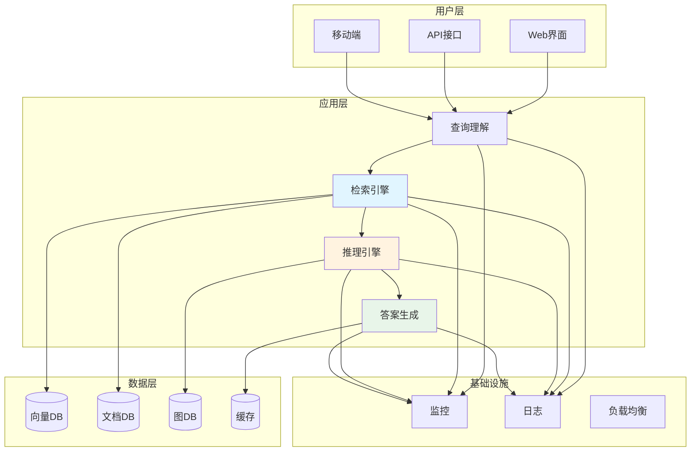
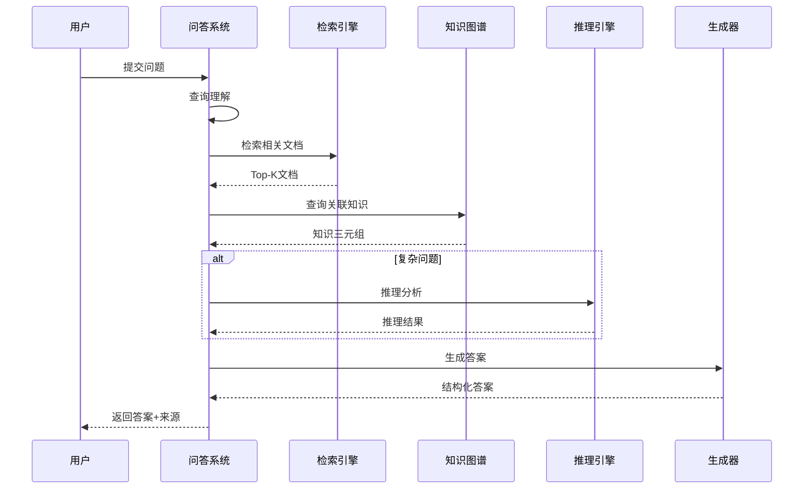
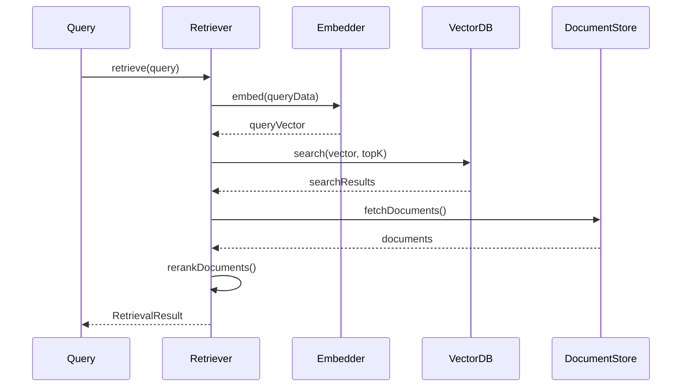
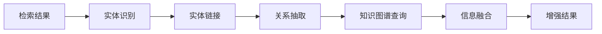
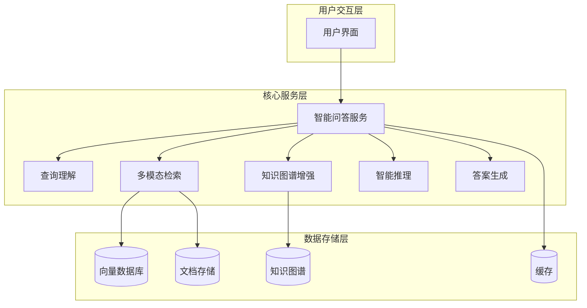
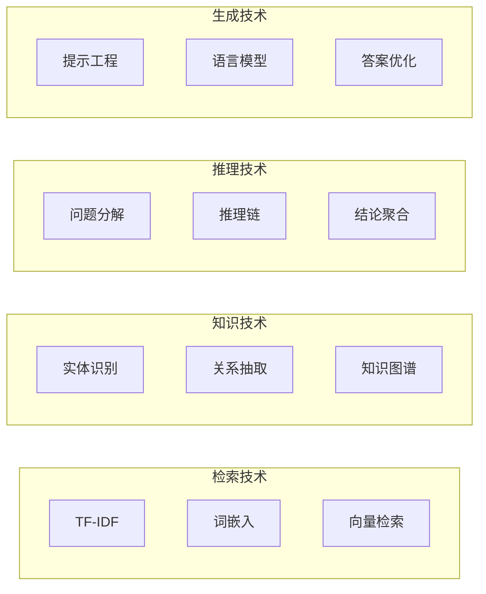

# 17.6 综合项目：智能问答系统

# 17.6 综合项目：智能问答系统

> **设计思想**：通过完整的项目实践，整合RAG系统的各项技术，构建生产级智能问答系统

## 项目概述

本项目将整合前面学习的所有技术，构建一个功能完整的智能问答系统。该系统能够:

- 🎯 处理多模态查询(文本、图像、代码)
- 🧠 利用知识图谱增强问答能力  
- 🔍 实现高效的语义检索
- 💡 具备多步骤推理能力
- 📊 提供可追溯的答案来源

### 系统价值

| 应用场景 | 核心能力 | 业务价值 |
|---------|---------|----------|
| 企业知识库 | 快速准确检索 | 提升员工效率 |
| 客户服务 | 24/7智能应答 | 降低人工成本 |
| 技术支持 | 代码级问答 | 加速问题解决 |
| 教育培训 | 个性化辅导 | 提高学习效果 |

## 系统架构设计

### 整体架构



### 核心流程



## 核心模块实现

### 1. 问答系统主服务

```java
public class IntelligentQAService {
    private MultimodalRetriever retriever;
    private KnowledgeGraphEnhancer kgEnhancer;
    private ReasoningEngine reasoner;
    private AnswerGenerator generator;
    private CacheManager cache;
    
    public QAAnswer answerQuestion(String question) {
        // 1. 缓存检查
        QAAnswer cached = cache.get(question);
        if (cached != null) return cached;
        
        // 2. 查询理解
        ProcessedQuery query = understandQuery(question);
        
        // 3. 多模态检索
        List<Document> docs = retriever.retrieve(query, 5);
        
        // 4. 知识图谱增强
        KnowledgeContext context = kgEnhancer.enhance(query, docs);
        
        // 5. 智能推理(复杂问题)
        if (query.isComplex()) {
            context = reasoner.reason(query, context);
        }
        
        // 6. 答案生成
        QAAnswer answer = generator.generate(query, context);
        
        // 7. 缓存结果
        cache.put(question, answer);
        
        return answer;
    }
}
```

### 2. 查询理解模块

**功能**: 将自然语言查询转换为结构化表示

```java
public class QueryUnderstanding {
    private NERModel nerModel;      // 命名实体识别
    private IntentClassifier intentClassifier;
    
    public ProcessedQuery understand(String question) {
        ProcessedQuery pq = new ProcessedQuery();
        
        // 识别意图(事实/过程/推理)
        pq.setIntent(intentClassifier.classify(question));
        
        // 提取实体
        pq.setEntities(nerModel.extract(question));
        
        // 提取关键词
        pq.setKeywords(extractKeywords(question));
        
        // 评估复杂度
        pq.setComplexity(assessComplexity(question));
        
        return pq;
    }
}
    
    private QAAnswer createErrorAnswer(String errorMessage) {
        QAAnswer errorAnswer = new QAAnswer();
        errorAnswer.setAnswerText("抱歉，处理您的查询时遇到错误: " + errorMessage);
        errorAnswer.setConfidence("low");
        errorAnswer.setSource("system");
        errorAnswer.setError(true);
        return errorAnswer;
    }
    
    public void indexDocument(IndexableDocument document) {
        try {
            multimodalRetriever.indexDocument(document);
            knowledgeGraphEnhancer.updateKnowledgeGraph(document);
            logger.info("Document indexed successfully: " + document.getId());
        } catch (Exception e) {
            logger.severe("Failed to index document: " + e.getMessage());
            throw new RuntimeException("Document indexing failed", e);
        }
    }
    
    public SystemStats getSystemStats() {
        SystemStats stats = new SystemStats();
        stats.setTotalQueriesProcessed(cacheManager.getTotalQueries());
        stats.setCacheHitRate(cacheManager.getHitRate());
        stats.setAverageResponseTime(multimodalRetriever.getAverageResponseTime());
        stats.setTotalDocumentsIndexed(multimodalRetriever.getDocumentCount());
        stats.setKnowledgeGraphSize(knowledgeGraphEnhancer.getGraphSize());
        return stats;
    }
    
    public void clearCache() {
        cacheManager.clear();
        logger.info("Cache cleared");
    }
    
    public void shutdown() {
        try {
            multimodalRetriever.shutdown();
            knowledgeGraphEnhancer.shutdown();
            intelligentReasoner.shutdown();
            cacheManager.shutdown();
            logger.info("Intelligent QA Service shutdown completed");
        } catch (Exception e) {
            logger.severe("Error during shutdown: " + e.getMessage());
        }
    }
}

// 配置类
class Configuration {
    private Map<String, Object> properties;
    
    public Configuration() {
        this.properties = new HashMap<>();
        // 设置默认配置
        setProperty("cache.enabled", true);
        setProperty("cache.ttl", 3600000); // 1小时
        setProperty("retriever.topK", 10);
        setProperty("embedding.dimension", 512);
        setProperty("reasoning.maxSteps", 20);
    }
    
    public void setProperty(String key, Object value) {
        properties.put(key, value);
    }
    
    public <T> T getProperty(String key, Class<T> type) {
        Object value = properties.get(key);
        if (value != null && type.isInstance(value)) {
            return type.cast(value);
        }
        return null;
    }
    
    public <T> T getProperty(String key, T defaultValue) {
        Object value = properties.get(key);
        if (value != null) {
            try {
                return (T) value;
            } catch (ClassCastException e) {
                return defaultValue;
            }
        }
        return defaultValue;
    }
}
```

### 2. 查询处理模块

```java
public class QueryUnderstandingEngine {
    private TextPreprocessor textPreprocessor;
    private EntityRecognizer entityRecognizer;
    private IntentClassifier intentClassifier;
    private ComplexityAnalyzer complexityAnalyzer;
    
    public QueryUnderstandingEngine() {
        this.textPreprocessor = new TextPreprocessor();
        this.entityRecognizer = new EntityRecognizer();
        this.intentClassifier = new IntentClassifier();
        this.complexityAnalyzer = new ComplexityAnalyzer();
    }
    
    public ProcessedQuery understand(QAQuery query) {
        ProcessedQuery processedQuery = new ProcessedQuery();
        processedQuery.setOriginalQuery(query);
        
        // 1. 文本预处理
        String processedText = textPreprocessor.preprocess(query.getQueryText());
        processedQuery.setProcessedText(processedText);
        
        // 2. 实体识别
        List<RecognizedEntity> entities = entityRecognizer.recognize(processedText);
        processedQuery.setEntities(entities);
        
        // 3. 意图分类
        QueryIntent intent = intentClassifier.classify(processedText);
        processedQuery.setIntent(intent);
        
        // 4. 复杂度分析
        int complexity = complexityAnalyzer.analyze(processedText, entities);
        processedQuery.setComplexity(complexity);
        
        // 5. 查询类型识别
        QueryType queryType = identifyQueryType(processedText, intent);
        processedQuery.setQueryType(queryType);
        
        // 6. 关键词提取
        List<String> keywords = extractKeywords(processedText);
        processedQuery.setKeywords(keywords);
        
        return processedQuery;
    }
    
    private QueryType identifyQueryType(String text, QueryIntent intent) {
        String lowerText = text.toLowerCase();
        
        if (lowerText.contains("为什么") || lowerText.contains("原因")) {
            return QueryType.CAUSAL;
        } else if (lowerText.contains("如何") || lowerText.contains("步骤")) {
            return QueryType.PROCEDURAL;
        } else if (lowerText.contains("是否") || lowerText.contains("吗")) {
            return QueryType.EVALUATIVE;
        } else if (intent == QueryIntent.COMPARISON) {
            return QueryType.COMPARATIVE;
        } else {
            return QueryType.FACTUAL;
        }
    }
    
    private List<String> extractKeywords(String text) {
        // 简化的关键词提取
        List<String> keywords = new ArrayList<>();
        String[] words = text.split("\\s+");
        for (String word : words) {
            if (word.length() > 2) {
                keywords.add(word.toLowerCase());
            }
        }
        return keywords;
    }
}

// QA查询类
class QAQuery {
    private String queryText;
    private QueryModality modality;
    private Map<String, Object> context;
    private String sessionId;
    private long timestamp;
    
    public QAQuery(String queryText) {
        this.queryText = queryText;
        this.modality = QueryModality.TEXT;
        this.context = new HashMap<>();
        this.timestamp = System.currentTimeMillis();
    }
    
    // Getters and Setters
    public String getQueryText() { return queryText; }
    public void setQueryText(String queryText) { this.queryText = queryText; }
    
    public QueryModality getModality() { return modality; }
    public void setModality(QueryModality modality) { this.modality = modality; }
    
    public Map<String, Object> getContext() { return context; }
    public void addContext(String key, Object value) { this.context.put(key, value); }
    
    public String getSessionId() { return sessionId; }
    public void setSessionId(String sessionId) { this.sessionId = sessionId; }
    
    public long getTimestamp() { return timestamp; }
    public void setTimestamp(long timestamp) { this.timestamp = timestamp; }
}

enum QueryModality {
    TEXT, IMAGE, CODE, MULTIMODAL
}

// 处理后的查询类
class ProcessedQuery {
    private QAQuery originalQuery;
    private String processedText;
    private List<RecognizedEntity> entities;
    private QueryIntent intent;
    private QueryType queryType;
    private int complexity;
    private List<String> keywords;
    
    public ProcessedQuery() {
        this.entities = new ArrayList<>();
        this.keywords = new ArrayList<>();
    }
    
    // Getters and Setters
    public QAQuery getOriginalQuery() { return originalQuery; }
    public void setOriginalQuery(QAQuery originalQuery) { this.originalQuery = originalQuery; }
    
    public String getProcessedText() { return processedText; }
    public void setProcessedText(String processedText) { this.processedText = processedText; }
    
    public List<RecognizedEntity> getEntities() { return entities; }
    public void setEntities(List<RecognizedEntity> entities) { this.entities = entities; }
    
    public QueryIntent getIntent() { return intent; }
    public void setIntent(QueryIntent intent) { this.intent = intent; }
    
    public QueryType getQueryType() { return queryType; }
    public void setQueryType(QueryType queryType) { this.queryType = queryType; }
    
    public int getComplexity() { return complexity; }
    public void setComplexity(int complexity) { this.complexity = complexity; }
    
    public List<String> getKeywords() { return keywords; }
    public void setKeywords(List<String> keywords) { this.keywords = keywords; }
}

enum QueryIntent {
    INFORMATIONAL, PROCEDURAL, COMPARISON, EVALUATIVE, CREATIVE
}

enum QueryType {
    FACTUAL, CAUSAL, PROCEDURAL, COMPARATIVE, EVALUATIVE
}
```

### 3. 多模态检索模块

多模态检索模块支持文本、图像、代码等多种数据类型的检索,是实现智能问答的核心功能。

**核心流程:**



**核心实现:**

```java
public class MultimodalRetriever {
    private MultimodalEmbedder embedder;
    private MultimodalVectorDatabase vectorDB;
    private DocumentStore documentStore;
    private Configuration config;
    
    public RetrievalResult retrieve(ProcessedQuery query) {
        // 1. 向量化查询
        MultimodalData queryData = buildQueryData(query);
        float[] queryVector = embedder.embed(queryData);
        
        // 2. 向量检索
        int topK = config.getProperty("retriever.topK", 10);
        List<VectorSearchResult> searchResults = vectorDB.search(queryVector, topK);
        
        // 3. 获取文档并重排序
        List<RetrievedDocument> documents = fetchDocuments(searchResults);
        List<RetrievedDocument> ranked = rerankDocuments(documents, query);
        
        RetrievalResult result = new RetrievalResult();
        result.setDocuments(ranked);
        return result;
    }
    
    private List<RetrievedDocument> rerankDocuments(
            List<RetrievedDocument> documents, ProcessedQuery query) {
        // 基于相关性和新鲜度重排序
        documents.sort((doc1, doc2) -> {
            double score1 = calculateRelevanceScore(doc1, query) * 0.7 + 
                           calculateFreshnessScore(doc1) * 0.3;
            double score2 = calculateRelevanceScore(doc2, query) * 0.7 + 
                           calculateFreshnessScore(doc2) * 0.3;
            return Double.compare(score2, score1);
        });
        return documents;
    }
    
    // 文档索引接口
    public void indexDocument(IndexableDocument document) {
        IndexableDocument processed = preprocessDocument(document);
        float[] vector = embedder.embed(processed.getData());
        documentStore.storeDocument(processed);
        vectorDB.addDocument(processed.getId(), processed.getData(), vector);
    }
}
```

**重排序策略:**

多模态检索模块使用混合排序策略,综合考虑多个因素:

| 排序因子 | 权重 | 计算方法 | 作用 |
|---------|------|---------|------|
| **语义相关性** | 70% | 向量相似度 + 关键词匹配 | 保证检索准确性 |
| **文档新鲜度** | 30% | 时间衰减函数 | 优先返回最新信息 |
| **文档质量** | 可选 | 阅读量、点赞数等 | 提升结果可信度 |
| **多样性** | 可选 | MMR算法 | 避免结果冗余 |

**技术要点:**

1. **多模态融合**: 支持文本、图像、代码等多种模态的联合检索
2. **向量索引**: 使用HNSW或IVF等高效索引结构,支持百万级文档检索
3. **增量索引**: 支持实时添加和更新文档,无需重建索引
4. **分布式检索**: 支持分片和副本机制,提升检索性能和可用性


### 4. 知识图谱增强模块

知识图谱增强模块通过实体链接和关系抽取,为检索结果提供结构化的知识支持。

**增强流程:**



**核心实现:**

```java
public class KnowledgeGraphEnhancer {
    private KnowledgeGraph knowledgeGraph;
    private EntityLinker entityLinker;
    private RelationExtractor relationExtractor;
    
    public EnhancedRetrievalResult enhance(RetrievalResult retrievalResult) {
        EnhancedRetrievalResult enhanced = new EnhancedRetrievalResult();
        enhanced.setBaseResult(retrievalResult);
        
        // 1. 实体链接
        List<LinkedEntity> entities = linkEntities(retrievalResult);
        enhanced.setLinkedEntities(entities);
        
        // 2. 关系抽取
        List<ExtractedRelation> relations = extractRelations(retrievalResult, entities);
        enhanced.setRelations(relations);
        
        // 3. 知识图谱查询
        List<GraphQueryResult> graphResults = queryKnowledgeGraph(entities);
        enhanced.setGraphResults(graphResults);
        
        return enhanced;
    }
    
    private List<LinkedEntity> linkEntities(RetrievalResult result) {
        List<LinkedEntity> linkedEntities = new ArrayList<>();
        for (RetrievedDocument doc : result.getDocuments()) {
            List<RecognizedEntity> entities = extractEntities(doc.getContent());
            for (RecognizedEntity entity : entities) {
                LinkedEntity linked = entityLinker.linkEntity(entity);
                if (linked != null) linkedEntities.add(linked);
            }
        }
        return linkedEntities;
    }
}
```

### 5. 智能推理模块

智能推理模块处理复杂问题,通过问题分解和步骤推理生成逻辑严密的答案。

**核心实现:**

```java
public class IntelligentReasoner {
    private ReasoningEngine reasoningEngine;
    private ContextManager contextManager;
    private Configuration config;
    private Logger logger;
    
    public IntelligentReasoner(Configuration config) {
        this.config = config;
        this.logger = Logger.getLogger("IntelligentReasoner");
        initializeComponents();
    }
    
    private void initializeComponents() {
        try {
            this.reasoningEngine = new ReasoningEngine(config);
            this.contextManager = new ContextManager();
            
            logger.info("Intelligent Reasoner initialized successfully");
        } catch (Exception e) {
            logger.severe("Failed to initialize Intelligent Reasoner: " + e.getMessage());
            throw new RuntimeException("Initialization failed", e);
        }
    }
    
    public ReasoningResult reason(ProcessedQuery query, EnhancedRetrievalResult retrievalResult) {
        long startTime = System.currentTimeMillis();
        
        try {
            // 1. 构建推理上下文
            ReasoningContext context = buildReasoningContext(query, retrievalResult);
            
            // 2. 执行推理
            ReasoningResult result = reasoningEngine.reason(context);
            
            // 3. 验证推理结果
            ValidationResult validation = validateResult(result);
            if (!validation.isValid()) {
                // 如果验证失败，尝试改进结果
                result = improveResult(result, validation);
            }
            
            // 4. 记录推理时间
            long reasoningTime = System.currentTimeMillis() - startTime;
            result.setReasoningTime(reasoningTime);
            
            logger.info("Reasoning completed in " + reasoningTime + "ms");
            return result;
        } catch (Exception e) {
            logger.severe("Reasoning failed: " + e.getMessage());
            return createErrorResult(e.getMessage());
        }
    }
    
    private ReasoningContext buildReasoningContext(ProcessedQuery query, 
                                                 EnhancedRetrievalResult retrievalResult) {
        ReasoningContext context = new ReasoningContext();
        context.setQuery(query);
        context.setRetrievalResult(retrievalResult);
        
        // 添加上下文信息
        context.setContext(contextManager.getAllContext());
        
        // 设置推理参数
        int maxSteps = config.getProperty("reasoning.maxSteps", 20);
        context.setMaxSteps(maxSteps);
        
        return context;
    }
    
    private ValidationResult validateResult(ReasoningResult result) {
        ReasoningResultValidator validator = new ReasoningResultValidator();
        return validator.validateResult(result);
    }
    
    private ReasoningResult improveResult(ReasoningResult result, ValidationResult validation) {
        ReasoningResultValidator validator = new ReasoningResultValidator();
        validator.improveResult(result, validation);
        return result;
    }
    
    private ReasoningResult createErrorResult(String errorMessage) {
        ReasoningResult errorResult = new ReasoningResult();
        errorResult.setComplete(false);
        errorResult.setAnswer("推理过程中发生错误: " + errorMessage);
        errorResult.setError(true);
        return errorResult;
    }
    
    public void updateContext(String key, Object value) {
        contextManager.setContext(key, value);
    }
    
    public void clearContext() {
        contextManager.clearContext();
    }
    
    public void shutdown() {
        logger.info("Intelligent Reasoner shutdown completed");
    }
}

// 推理引擎
class ReasoningEngine {
    private KnowledgeBase knowledgeBase;
    private InferenceEngine inferenceEngine;
    private Configuration config;
    
    public ReasoningEngine(Configuration config) {
        this.config = config;
        initializeKnowledgeBase();
        this.inferenceEngine = new InferenceEngine();
    }
    
    private void initializeKnowledgeBase() {
        // 初始化知识库
        this.knowledgeBase = new InMemoryKnowledgeBase();
    }
    
    public ReasoningResult reason(ReasoningContext context) {
        ReasoningResult result = new ReasoningResult();
        
        try {
            // 1. 问题分析
            ProblemAnalysis analysis = analyzeProblem(context.getQuery());
            
            // 2. 问题分解
            List<SubProblem> subProblems = decomposeProblem(analysis);
            
            // 3. 构建推理链
            ReasoningChain chain = buildReasoningChain(subProblems, context);
            
            // 4. 执行推理
            executeReasoningChain(chain, context);
            
            // 5. 生成最终答案
            generateFinalAnswer(result, chain, context);
            
            result.setComplete(true);
        } catch (Exception e) {
            result.setComplete(false);
            result.setAnswer("推理执行失败: " + e.getMessage());
        }
        
        return result;
    }
    
    private ProblemAnalysis analyzeProblem(ProcessedQuery query) {
        ProblemAnalyzer analyzer = new ProblemAnalyzer(knowledgeBase);
        return analyzer.analyzeProblem(query.getProcessedText());
    }
    
    private List<SubProblem> decomposeProblem(ProblemAnalysis analysis) {
        ProblemAnalyzer analyzer = new ProblemAnalyzer(knowledgeBase);
        return analyzer.decomposeProblem(analysis);
    }
    
    private ReasoningChain buildReasoningChain(List<SubProblem> subProblems, 
                                             ReasoningContext context) {
        ReasoningChain chain = new ReasoningChain();
        
        for (SubProblem subProblem : subProblems) {
            ReasoningStep step = new ReasoningStep();
            step.setDescription(subProblem.getDescription());
            step.setSubProblem(subProblem);
            chain.addStep(step);
        }
        
        return chain;
    }
    
    private void executeReasoningChain(ReasoningChain chain, ReasoningContext context) {
        for (ReasoningStep step : chain.getSteps()) {
            try {
                // 应用推理规则
                List<Fact> conclusions = inferenceEngine.applyRules(
                    step.getSubProblem(), context);
                step.setConclusions(conclusions);
                
                // 更新置信度
                step.setConfidence(calculateStepConfidence(conclusions));
            } catch (Exception e) {
                step.setError(true);
                step.setErrorMessage(e.getMessage());
            }
        }
    }
    
    private void generateFinalAnswer(ReasoningResult result, ReasoningChain chain, 
                                   ReasoningContext context) {
        StringBuilder answer = new StringBuilder();
        answer.append("基于以下推理得出答案:\n\n");
        
        for (ReasoningStep step : chain.getSteps()) {
            answer.append("- ").append(step.getDescription());
            if (step.getConclusions() != null && !step.getConclusions().isEmpty()) {
                answer.append(": ").append(step.getConclusions().get(0).getStatement());
            }
            answer.append("\n");
        }
        
        answer.append("\n最终答案: 问题已通过推理解决。");
        result.setAnswer(answer.toString());
        
        // 计算整体置信度
        double overallConfidence = calculateOverallConfidence(chain);
        result.setConfidence(getConfidenceLevel(overallConfidence));
    }
    
    private double calculateStepConfidence(List<Fact> conclusions) {
        if (conclusions.isEmpty()) {
            return 0.0;
        }
        
        double totalConfidence = 0.0;
        for (Fact fact : conclusions) {
            totalConfidence += fact.getConfidence();
        }
        
        return totalConfidence / conclusions.size();
    }
    
    private double calculateOverallConfidence(ReasoningChain chain) {
        double totalConfidence = 0.0;
        int validSteps = 0;
        
        for (ReasoningStep step : chain.getSteps()) {
            if (!step.isError()) {
                totalConfidence += step.getConfidence();
                validSteps++;
            }
        }
        
        return validSteps > 0 ? totalConfidence / validSteps : 0.0;
    }
    
    private String getConfidenceLevel(double confidence) {
        if (confidence >= 0.8) {
            return "high";
        } else if (confidence >= 0.6) {
            return "medium";
        } else {
            return "low";
        }
    }
}

// 推理上下文类
class ReasoningContext {
    private ProcessedQuery query;
    private EnhancedRetrievalResult retrievalResult;
    private Map<String, Object> context;
    private int maxSteps;
    
    public ReasoningContext() {
        this.context = new HashMap<>();
    }
    
    // Getters and Setters
    public ProcessedQuery getQuery() { return query; }
    public void setQuery(ProcessedQuery query) { this.query = query; }
    
    public EnhancedRetrievalResult getRetrievalResult() { return retrievalResult; }
    public void setRetrievalResult(EnhancedRetrievalResult retrievalResult) { this.retrievalResult = retrievalResult; }
    
    public Map<String, Object> getContext() { return context; }
    public void setContext(Map<String, Object> context) { this.context = context; }
    
    public int getMaxSteps() { return maxSteps; }
    public void setMaxSteps(int maxSteps) { this.maxSteps = maxSteps; }
}

// 推理结果类
class ReasoningResult {
    private String answer;
    private boolean complete;
    private String confidence;
    private boolean error;
    private String errorMessage;
    private long reasoningTime;
    
    public ReasoningResult() {
        this.confidence = "medium";
    }
    
    // Getters and Setters
    public String getAnswer() { return answer; }
    public void setAnswer(String answer) { this.answer = answer; }
    
    public boolean isComplete() { return complete; }
    public void setComplete(boolean complete) { this.complete = complete; }
    
    public String getConfidence() { return confidence; }
    public void setConfidence(String confidence) { this.confidence = confidence; }
    
    public boolean isError() { return error; }
    public void setError(boolean error) { this.error = error; }
    
    public String getErrorMessage() { return errorMessage; }
    public void setErrorMessage(String errorMessage) { this.errorMessage = errorMessage; }
    
    public long getReasoningTime() { return reasoningTime; }
    public void setReasoningTime(long reasoningTime) { this.reasoningTime = reasoningTime; }
}

// 推理链类
class ReasoningChain {
    private List<ReasoningStep> steps;
    
    public ReasoningChain() {
        this.steps = new ArrayList<>();
    }
    
    public void addStep(ReasoningStep step) {
        step.setStepNumber(steps.size() + 1);
        steps.add(step);
    }
    
    public List<ReasoningStep> getSteps() {
        return steps;
    }
}

// 推理步骤类
class ReasoningStep {
    private int stepNumber;
    private String description;
    private SubProblem subProblem;
    private List<Fact> conclusions;
    private double confidence;
    private boolean error;
    private String errorMessage;
    
    // Getters and Setters
    public int getStepNumber() { return stepNumber; }
    public void setStepNumber(int stepNumber) { this.stepNumber = stepNumber; }
    
    public String getDescription() { return description; }
    public void setDescription(String description) { this.description = description; }
    
    public SubProblem getSubProblem() { return subProblem; }
    public void setSubProblem(SubProblem subProblem) { this.subProblem = subProblem; }
    
    public List<Fact> getConclusions() { return conclusions; }
    public void setConclusions(List<Fact> conclusions) { this.conclusions = conclusions; }
    
    public double getConfidence() { return confidence; }
    public void setConfidence(double confidence) { this.confidence = confidence; }
    
    public boolean isError() { return error; }
    public void setError(boolean error) { this.error = error; }
    
    public String getErrorMessage() { return errorMessage; }
    public void setErrorMessage(String errorMessage) { this.errorMessage = errorMessage; }
}
```

### 6. 答案生成模块

```java
public class AnswerGenerator {
    private LanguageModel languageModel;
    private TemplateManager templateManager;
    private Configuration config;
    private Logger logger;
    
    public AnswerGenerator(Configuration config) {
        this.config = config;
        this.logger = Logger.getLogger("AnswerGenerator");
        initializeComponents();
    }
    
    private void initializeComponents() {
        try {
            this.languageModel = new LanguageModel(config);
            this.templateManager = new TemplateManager();
            
            logger.info("Answer Generator initialized successfully");
        } catch (Exception e) {
            logger.severe("Failed to initialize Answer Generator: " + e.getMessage());
            throw new RuntimeException("Initialization failed", e);
        }
    }
    
    public QAAnswer generate(ProcessedQuery query, EnhancedRetrievalResult retrievalResult, 
                           ReasoningResult reasoningResult) {
        QAAnswer answer = new QAAnswer();
        answer.setQueryId(query.getOriginalQuery().getQueryText());
        answer.setTimestamp(System.currentTimeMillis());
        
        try {
            // 1. 选择生成策略
            GenerationStrategy strategy = selectGenerationStrategy(query);
            
            // 2. 生成答案
            String answerText = generateAnswerText(query, retrievalResult, reasoningResult, strategy);
            answer.setAnswerText(answerText);
            
            // 3. 设置置信度
            String confidence = calculateConfidence(query, retrievalResult, reasoningResult);
            answer.setConfidence(confidence);
            
            // 4. 设置来源
            String source = determineSource(retrievalResult, reasoningResult);
            answer.setSource(source);
            
            // 5. 添加引用信息
            List<String> citations = extractCitations(retrievalResult);
            answer.setCitations(citations);
            
            // 6. 格式化答案
            formatAnswer(answer, strategy);
            
            logger.info("Answer generated successfully");
        } catch (Exception e) {
            logger.severe("Answer generation failed: " + e.getMessage());
            answer.setError(true);
            answer.setAnswerText("抱歉，生成答案时遇到错误: " + e.getMessage());
            answer.setConfidence("low");
            answer.setSource("system");
        }
        
        return answer;
    }
    
    private GenerationStrategy selectGenerationStrategy(ProcessedQuery query) {
        // 根据查询类型选择生成策略
        switch (query.getQueryType()) {
            case FACTUAL:
                return GenerationStrategy.RETRIEVAL_BASED;
            case CAUSAL:
            case PROCEDURAL:
                return GenerationStrategy.REASONING_BASED;
            case COMPARATIVE:
                return GenerationStrategy.COMPARISON_BASED;
            default:
                return GenerationStrategy.HYBRID;
        }
    }
    
    private String generateAnswerText(ProcessedQuery query, 
                                    EnhancedRetrievalResult retrievalResult,
                                    ReasoningResult reasoningResult,
                                    GenerationStrategy strategy) throws Exception {
        switch (strategy) {
            case RETRIEVAL_BASED:
                return generateRetrievalBasedAnswer(query, retrievalResult);
            case REASONING_BASED:
                return generateReasoningBasedAnswer(query, reasoningResult);
            case COMPARISON_BASED:
                return generateComparisonBasedAnswer(query, retrievalResult);
            case HYBRID:
                return generateHybridAnswer(query, retrievalResult, reasoningResult);
            default:
                return generateDefaultAnswer(query, retrievalResult);
        }
    }
    
    private String generateRetrievalBasedAnswer(ProcessedQuery query, 
                                              EnhancedRetrievalResult retrievalResult) throws Exception {
        // 基于检索结果生成答案
        List<RetrievedDocument> documents = retrievalResult.getBaseResult().getDocuments();
        
        if (documents.isEmpty()) {
            return "抱歉，我没有找到相关的信息来回答您的问题。";
        }
        
        // 构建提示
        StringBuilder prompt = new StringBuilder();
        prompt.append("基于以下文档内容回答问题: ").append(query.getProcessedText()).append("\n\n");
        
        for (int i = 0; i < Math.min(3, documents.size()); i++) {
            RetrievedDocument doc = documents.get(i);
            prompt.append("文档 ").append(i + 1).append(" (相关度: ")
                  .append(String.format("%.2f", doc.getSimilarity())).append("):\n")
                  .append(doc.getContent()).append("\n\n");
        }
        
        prompt.append("请基于以上信息提供准确、简洁的回答:");
        
        // 调用语言模型生成答案
        return languageModel.generate(prompt.toString());
    }
    
    private String generateReasoningBasedAnswer(ProcessedQuery query, 
                                              ReasoningResult reasoningResult) {
        // 基于推理结果生成答案
        if (reasoningResult == null) {
            return "抱歉，我无法对这个问题进行推理分析。";
        }
        
        if (reasoningResult.isError()) {
            return "推理过程中遇到错误: " + reasoningResult.getErrorMessage();
        }
        
        return reasoningResult.getAnswer();
    }
    
    private String generateComparisonBasedAnswer(ProcessedQuery query, 
                                               EnhancedRetrievalResult retrievalResult) throws Exception {
        // 生成比较类答案
        StringBuilder prompt = new StringBuilder();
        prompt.append("比较以下内容来回答问题: ").append(query.getProcessedText()).append("\n\n");
        
        List<RetrievedDocument> documents = retrievalResult.getBaseResult().getDocuments();
        for (int i = 0; i < Math.min(5, documents.size()); i++) {
            RetrievedDocument doc = documents.get(i);
            prompt.append("选项 ").append(i + 1).append(":\n")
                  .append(doc.getContent()).append("\n\n");
        }
        
        prompt.append("请比较以上选项并给出详细的分析:");
        
        return languageModel.generate(prompt.toString());
    }
    
    private String generateHybridAnswer(ProcessedQuery query, 
                                      EnhancedRetrievalResult retrievalResult,
                                      ReasoningResult reasoningResult) throws Exception {
        // 生成混合答案
        StringBuilder prompt = new StringBuilder();
        prompt.append("基于以下信息回答问题: ").append(query.getProcessedText()).append("\n\n");
        
        // 添加检索信息
        List<RetrievedDocument> documents = retrievalResult.getBaseResult().getDocuments();
        if (!documents.isEmpty()) {
            prompt.append("相关信息:\n");
            for (int i = 0; i < Math.min(2, documents.size()); i++) {
                RetrievedDocument doc = documents.get(i);
                prompt.append("- ").append(doc.getContent()).append("\n");
            }
            prompt.append("\n");
        }
        
        // 添加推理信息
        if (reasoningResult != null && !reasoningResult.isError()) {
            prompt.append("分析过程:\n").append(reasoningResult.getAnswer()).append("\n\n");
        }
        
        prompt.append("请综合以上信息提供完整的回答:");
        
        return languageModel.generate(prompt.toString());
    }
    
    private String generateDefaultAnswer(ProcessedQuery query, 
                                       EnhancedRetrievalResult retrievalResult) throws Exception {
        // 默认答案生成
        return generateRetrievalBasedAnswer(query, retrievalResult);
    }
    
    private String calculateConfidence(ProcessedQuery query, 
                                     EnhancedRetrievalResult retrievalResult,
                                     ReasoningResult reasoningResult) {
        // 计算答案置信度
        double confidence = 0.5; // 默认置信度
        
        // 基于检索结果的置信度
        if (retrievalResult != null) {
            List<RetrievedDocument> documents = retrievalResult.getBaseResult().getDocuments();
            if (!documents.isEmpty()) {
                // 基于最高相关度文档计算置信度
                double maxSimilarity = documents.get(0).getSimilarity();
                confidence = Math.min(0.5 + maxSimilarity * 0.5, 1.0);
            }
        }
        
        // 基于推理结果的置信度
        if (reasoningResult != null && !reasoningResult.isError()) {
            switch (reasoningResult.getConfidence()) {
                case "high":
                    confidence = Math.min(confidence + 0.3, 1.0);
                    break;
                case "medium":
                    confidence = Math.min(confidence + 0.1, 1.0);
                    break;
                case "low":
                    confidence = Math.max(confidence - 0.2, 0.1);
                    break;
            }
        }
        
        // 基于查询复杂度调整置信度
        if (query.getComplexity() > 80) {
            confidence = Math.max(confidence - 0.2, 0.1);
        }
        
        if (confidence >= 0.8) {
            return "high";
        } else if (confidence >= 0.6) {
            return "medium";
        } else {
            return "low";
        }
    }
    
    private String determineSource(EnhancedRetrievalResult retrievalResult, 
                                 ReasoningResult reasoningResult) {
        // 确定答案来源
        if (reasoningResult != null && !reasoningResult.isError()) {
            return "reasoning";
        } else if (retrievalResult != null) {
            return "retrieval";
        } else {
            return "system";
        }
    }
    
    private List<String> extractCitations(EnhancedRetrievalResult retrievalResult) {
        List<String> citations = new ArrayList<>();
        
        if (retrievalResult != null) {
            List<RetrievedDocument> documents = retrievalResult.getBaseResult().getDocuments();
            for (RetrievedDocument doc : documents) {
                Object source = doc.getMetadata().get("source");
                if (source != null) {
                    citations.add(source.toString());
                }
            }
        }
        
        return citations;
    }
    
    private void formatAnswer(QAAnswer answer, GenerationStrategy strategy) {
        // 格式化答案
        String formattedAnswer = answer.getAnswerText();
        
        // 添加格式化标记
        switch (strategy) {
            case REASONING_BASED:
                formattedAnswer = "[推理结果]\n" + formattedAnswer;
                break;
            case COMPARISON_BASED:
                formattedAnswer = "[比较分析]\n" + formattedAnswer;
                break;
            case HYBRID:
                formattedAnswer = "[综合分析]\n" + formattedAnswer;
                break;
        }
        
        answer.setFormattedAnswer(formattedAnswer);
    }
    
    public void shutdown() {
        try {
            languageModel.close();
            logger.info("Answer Generator shutdown completed");
        } catch (Exception e) {
            logger.severe("Error during shutdown: " + e.getMessage());
        }
    }
}

// 答案生成策略枚举
enum GenerationStrategy {
    RETRIEVAL_BASED,    // 基于检索
    REASONING_BASED,    // 基于推理
    COMPARISON_BASED,   // 基于比较
    HYBRID              // 混合策略
}

// QA答案类
class QAAnswer {
    private String queryId;
    private String answerText;
    private String formattedAnswer;
    private String confidence;
    private String source;
    private List<String> citations;
    private boolean error;
    private long timestamp;
    private long expirationTime;
    
    public QAAnswer() {
        this.citations = new ArrayList<>();
        this.confidence = "medium";
        this.timestamp = System.currentTimeMillis();
        // 默认1小时过期
        this.expirationTime = this.timestamp + 3600000;
    }
    
    // Getters and Setters
    public String getQueryId() { return queryId; }
    public void setQueryId(String queryId) { this.queryId = queryId; }
    
    public String getAnswerText() { return answerText; }
    public void setAnswerText(String answerText) { this.answerText = answerText; }
    
    public String getFormattedAnswer() { return formattedAnswer; }
    public void setFormattedAnswer(String formattedAnswer) { this.formattedAnswer = formattedAnswer; }
    
    public String getConfidence() { return confidence; }
    public void setConfidence(String confidence) { this.confidence = confidence; }
    
    public String getSource() { return source; }
    public void setSource(String source) { this.source = source; }
    
    public List<String> getCitations() { return citations; }
    public void setCitations(List<String> citations) { this.citations = citations; }
    public void addCitation(String citation) { this.citations.add(citation); }
    
    public boolean isError() { return error; }
    public void setError(boolean error) { this.error = error; }
    
    public long getTimestamp() { return timestamp; }
    public void setTimestamp(long timestamp) { this.timestamp = timestamp; }
    
    public long getExpirationTime() { return expirationTime; }
    public void setExpirationTime(long expirationTime) { this.expirationTime = expirationTime; }
    
    public boolean isExpired() {
        return System.currentTimeMillis() > expirationTime;
    }
}

// 语言模型类（简化版）
class LanguageModel {
    private Configuration config;
    
    public LanguageModel(Configuration config) {
        this.config = config;
    }
    
    public String generate(String prompt) throws Exception {
        // 简化的语言模型调用
        // 实际应用中应调用真实的语言模型API
        return "基于您的查询 \"" + prompt.substring(0, Math.min(50, prompt.length())) + 
               "...\"，我生成了以下回答...";
    }
    
    public void close() throws Exception {
        // 清理资源
    }
}

// 模板管理器
class TemplateManager {
    private Map<String, String> templates;
    
    public TemplateManager() {
        this.templates = new HashMap<>();
        initializeTemplates();
    }
    
    private void initializeTemplates() {
        templates.put("factual", "根据以下信息回答问题:\n{context}\n\n问题: {question}\n回答:");
        templates.put("causal", "分析以下信息并回答因果关系问题:\n{context}\n\n问题: {question}\n分析:");
        templates.put("procedural", "基于以下步骤信息回答过程问题:\n{context}\n\n问题: {question}\n步骤:");
    }
    
    public String getTemplate(String templateName) {
        return templates.getOrDefault(templateName, templates.get("factual"));
    }
}
```

### 7. 缓存管理模块

```java
public class CacheManager {
    private Map<String, CachedAnswer> cache;
    private int maxSize;
    private long defaultTTL;
    private AtomicLong totalQueries;
    private AtomicLong cacheHits;
    private ReadWriteLock lock;
    private ScheduledExecutorService cleanupExecutor;
    private Logger logger;
    
    public CacheManager(Configuration config) {
        this.cache = new LinkedHashMap<String, CachedAnswer>(16, 0.75f, true) {
            @Override
            protected boolean removeEldestEntry(Map.Entry<String, CachedAnswer> eldest) {
                return size() > maxSize;
            }
        };
        
        this.maxSize = config.getProperty("cache.maxSize", 1000);
        this.defaultTTL = config.getProperty("cache.ttl", 3600000L); // 1小时
        this.totalQueries = new AtomicLong(0);
        this.cacheHits = new AtomicLong(0);
        this.lock = new ReentrantReadWriteLock();
        this.logger = Logger.getLogger("CacheManager");
        
        // 启动定期清理任务
        this.cleanupExecutor = Executors.newScheduledThreadPool(1);
        this.cleanupExecutor.scheduleAtFixedRate(this::cleanupExpiredEntries, 
                                               30, 30, TimeUnit.MINUTES);
        
        logger.info("Cache Manager initialized with maxSize=" + maxSize + ", ttl=" + defaultTTL);
    }
    
    public void cacheAnswer(QAQuery query, QAAnswer answer) {
        if (!isCachingEnabled()) {
            return;
        }
        
        String cacheKey = generateCacheKey(query);
        CachedAnswer cachedAnswer = new CachedAnswer(answer, System.currentTimeMillis() + defaultTTL);
        
        lock.writeLock().lock();
        try {
            cache.put(cacheKey, cachedAnswer);
            logger.fine("Answer cached for key: " + cacheKey);
        } finally {
            lock.writeLock().unlock();
        }
    }
    
    public QAAnswer getAnswer(QAQuery query) {
        totalQueries.incrementAndGet();
        
        if (!isCachingEnabled()) {
            return null;
        }
        
        String cacheKey = generateCacheKey(query);
        
        lock.readLock().lock();
        try {
            CachedAnswer cachedAnswer = cache.get(cacheKey);
            if (cachedAnswer != null) {
                if (!cachedAnswer.isExpired()) {
                    cacheHits.incrementAndGet();
                    logger.fine("Cache hit for key: " + cacheKey);
                    return cachedAnswer.getAnswer();
                } else {
                    // 异步清理过期条目
                    CompletableFuture.runAsync(() -> removeExpiredEntry(cacheKey));
                }
            }
            return null;
        } finally {
            lock.readLock().unlock();
        }
    }
    
    private String generateCacheKey(QAQuery query) {
        // 生成缓存键
        StringBuilder key = new StringBuilder();
        key.append(query.getQueryText());
        key.append("|").append(query.getModality());
        
        // 添加上下文信息
        if (query.getContext() != null && !query.getContext().isEmpty()) {
            key.append("|").append(query.getContext().hashCode());
        }
        
        return String.valueOf(key.toString().hashCode());
    }
    
    private boolean isCachingEnabled() {
        // 检查缓存是否启用
        return true; // 简化实现，实际应从配置中读取
    }
    
    private void removeExpiredEntry(String cacheKey) {
        lock.writeLock().lock();
        try {
            CachedAnswer cachedAnswer = cache.get(cacheKey);
            if (cachedAnswer != null && cachedAnswer.isExpired()) {
                cache.remove(cacheKey);
                logger.fine("Expired cache entry removed: " + cacheKey);
            }
        } finally {
            lock.writeLock().unlock();
        }
    }
    
    private void cleanupExpiredEntries() {
        lock.writeLock().lock();
        try {
            Iterator<Map.Entry<String, CachedAnswer>> iterator = cache.entrySet().iterator();
            int removedCount = 0;
            
            while (iterator.hasNext()) {
                Map.Entry<String, CachedAnswer> entry = iterator.next();
                if (entry.getValue().isExpired()) {
                    iterator.remove();
                    removedCount++;
                }
            }
            
            if (removedCount > 0) {
                logger.info("Cleaned up " + removedCount + " expired cache entries");
            }
        } finally {
            lock.writeLock().unlock();
        }
    }
    
    public double getHitRate() {
        long total = totalQueries.get();
        return total > 0 ? (double) cacheHits.get() / total : 0.0;
    }
    
    public long getTotalQueries() {
        return totalQueries.get();
    }
    
    public long getCacheSize() {
        lock.readLock().lock();
        try {
            return cache.size();
        } finally {
            lock.readLock().unlock();
        }
    }
    
    public void clear() {
        lock.writeLock().lock();
        try {
            cache.clear();
            cacheHits.set(0);
            totalQueries.set(0);
            logger.info("Cache cleared");
        } finally {
            lock.writeLock().unlock();
        }
    }
    
    public CacheStats getStats() {
        CacheStats stats = new CacheStats();
        stats.setSize(getCacheSize());
        stats.setTotalQueries(getTotalQueries());
        stats.setCacheHits(cacheHits.get());
        stats.setHitRate(getHitRate());
        return stats;
    }
    
    public void shutdown() {
        cleanupExecutor.shutdown();
        try {
            if (!cleanupExecutor.awaitTermination(5, TimeUnit.SECONDS)) {
                cleanupExecutor.shutdownNow();
            }
        } catch (InterruptedException e) {
            cleanupExecutor.shutdownNow();
            Thread.currentThread().interrupt();
        }
        logger.info("Cache Manager shutdown completed");
    }
}

// 缓存的答案类
class CachedAnswer {
    private QAAnswer answer;
    private long expirationTime;
    
    public CachedAnswer(QAAnswer answer, long expirationTime) {
        this.answer = answer;
        this.expirationTime = expirationTime;
    }
    
    public QAAnswer getAnswer() {
        return answer;
    }
    
    public boolean isExpired() {
        return System.currentTimeMillis() > expirationTime;
    }
    
    public long getExpirationTime() {
        return expirationTime;
    }
}

// 缓存统计类
class CacheStats {
    private long size;
    private long totalQueries;
    private long cacheHits;
    private double hitRate;
    
    // Getters and Setters
    public long getSize() { return size; }
    public void setSize(long size) { this.size = size; }
    
    public long getTotalQueries() { return totalQueries; }
    public void setTotalQueries(long totalQueries) { this.totalQueries = totalQueries; }
    
    public long getCacheHits() { return cacheHits; }
    public void setCacheHits(long cacheHits) { this.cacheHits = cacheHits; }
    
    public double getHitRate() { return hitRate; }
    public void setHitRate(double hitRate) { this.hitRate = hitRate; }
}
```

### 8. 系统监控和日志模块

```java
public class SystemMonitor {
    private IntelligentQAService qaService;
    private MetricRegistry metricRegistry;
    private Logger logger;
    
    public SystemMonitor(IntelligentQAService qaService) {
        this.qaService = qaService;
        this.metricRegistry = new MetricRegistry();
        this.logger = Logger.getLogger("SystemMonitor");
        registerMetrics();
    }
    
    private void registerMetrics() {
        // 注册系统指标
        metricRegistry.register("queries.processed", (Gauge<Long>) 
            () -> qaService.getSystemStats().getTotalQueriesProcessed());
        
        metricRegistry.register("cache.hit.rate", (Gauge<Double>) 
            () -> qaService.getSystemStats().getCacheHitRate());
        
        metricRegistry.register("average.response.time", (Gauge<Double>) 
            () -> qaService.getSystemStats().getAverageResponseTime());
        
        metricRegistry.register("documents.indexed", (Gauge<Integer>) 
            () -> qaService.getSystemStats().getTotalDocumentsIndexed());
        
        metricRegistry.register("knowledge.graph.size", (Gauge<Integer>) 
            () -> qaService.getSystemStats().getKnowledgeGraphSize());
    }
    
    public SystemHealth checkHealth() {
        SystemHealth health = new SystemHealth();
        health.setTimestamp(System.currentTimeMillis());
        
        try {
            SystemStats stats = qaService.getSystemStats();
            
            // 检查各项指标
            health.setQueriesProcessed(stats.getTotalQueriesProcessed());
            health.setCacheHitRate(stats.getCacheHitRate());
            health.setAverageResponseTime(stats.getAverageResponseTime());
            health.setDocumentsIndexed(stats.getTotalDocumentsIndexed());
            health.setKnowledgeGraphSize(stats.getKnowledgeGraphSize());
            
            // 健康状态评估
            health.setStatus(evaluateHealthStatus(stats));
            health.setHealthy(health.getStatus() == HealthStatus.HEALTHY);
            
            logger.info("Health check completed: " + health.getStatus());
        } catch (Exception e) {
            health.setStatus(HealthStatus.UNHEALTHY);
            health.setHealthy(false);
            health.setErrorMessage(e.getMessage());
            logger.severe("Health check failed: " + e.getMessage());
        }
        
        return health;
    }
    
    private HealthStatus evaluateHealthStatus(SystemStats stats) {
        // 评估系统健康状态
        if (stats.getAverageResponseTime() > 5000) {
            return HealthStatus.DEGRADED;
        }
        
        if (stats.getCacheHitRate() < 0.3) {
            return HealthStatus.DEGRADED;
        }
        
        return HealthStatus.HEALTHY;
    }
    
    public PerformanceReport generatePerformanceReport() {
        PerformanceReport report = new PerformanceReport();
        report.setGeneratedAt(System.currentTimeMillis());
        
        try {
            SystemStats stats = qaService.getSystemStats();
            
            report.setTotalQueries(stats.getTotalQueriesProcessed());
            report.setCacheHitRate(stats.getCacheHitRate());
            report.setAverageResponseTime(stats.getAverageResponseTime());
            report.setDocumentsIndexed(stats.getTotalDocumentsIndexed());
            report.setKnowledgeGraphSize(stats.getKnowledgeGraphSize());
            
            // 生成详细指标
            report.setMetrics(generateDetailedMetrics());
            
            logger.info("Performance report generated");
        } catch (Exception e) {
            report.setError(true);
            report.setErrorMessage(e.getMessage());
            logger.severe("Failed to generate performance report: " + e.getMessage());
        }
        
        return report;
    }
    
    private Map<String, Object> generateDetailedMetrics() {
        Map<String, Object> metrics = new HashMap<>();
        
        // 获取所有注册的指标
        for (Map.Entry<String, Gauge> entry : metricRegistry.getGauges().entrySet()) {
            try {
                metrics.put(entry.getKey(), entry.getValue().getValue());
            } catch (Exception e) {
                logger.warning("Failed to get metric value for " + entry.getKey());
            }
        }
        
        return metrics;
    }
    
    public void logQuery(QueryLogEntry logEntry) {
        // 记录查询日志
        logger.info("Query Log - ID: " + logEntry.getQueryId() +
                   ", Time: " + logEntry.getProcessingTime() + "ms" +
                   ", Source: " + logEntry.getSource() +
                   ", Confidence: " + logEntry.getConfidence());
    }
}

// 系统健康状态类
class SystemHealth {
    private long timestamp;
    private HealthStatus status;
    private boolean healthy;
    private long queriesProcessed;
    private double cacheHitRate;
    private double averageResponseTime;
    private int documentsIndexed;
    private int knowledgeGraphSize;
    private String errorMessage;
    
    // Getters and Setters
    public long getTimestamp() { return timestamp; }
    public void setTimestamp(long timestamp) { this.timestamp = timestamp; }
    
    public HealthStatus getStatus() { return status; }
    public void setStatus(HealthStatus status) { this.status = status; }
    
    public boolean isHealthy() { return healthy; }
    public void setHealthy(boolean healthy) { this.healthy = healthy; }
    
    public long getQueriesProcessed() { return queriesProcessed; }
    public void setQueriesProcessed(long queriesProcessed) { this.queriesProcessed = queriesProcessed; }
    
    public double getCacheHitRate() { return cacheHitRate; }
    public void setCacheHitRate(double cacheHitRate) { this.cacheHitRate = cacheHitRate; }
    
    public double getAverageResponseTime() { return averageResponseTime; }
    public void setAverageResponseTime(double averageResponseTime) { this.averageResponseTime = averageResponseTime; }
    
    public int getDocumentsIndexed() { return documentsIndexed; }
    public void setDocumentsIndexed(int documentsIndexed) { this.documentsIndexed = documentsIndexed; }
    
    public int getKnowledgeGraphSize() { return knowledgeGraphSize; }
    public void setKnowledgeGraphSize(int knowledgeGraphSize) { this.knowledgeGraphSize = knowledgeGraphSize; }
    
    public String getErrorMessage() { return errorMessage; }
    public void setErrorMessage(String errorMessage) { this.errorMessage = errorMessage; }
}

enum HealthStatus {
```

### 9. 文档存储模块

```java
public class DocumentStore {
    private Map<String, IndexableDocument> documents;
    private ReadWriteLock lock;
    private Configuration config;
    private Logger logger;
    
    public DocumentStore(Configuration config) {
        this.documents = new ConcurrentHashMap<>();
        this.lock = new ReentrantReadWriteLock();
        this.config = config;
        this.logger = Logger.getLogger("DocumentStore");
    }
    
    public void storeDocument(IndexableDocument document) {
        lock.writeLock().lock();
        try {
            documents.put(document.getId(), document);
            logger.fine("Document stored: " + document.getId());
        } finally {
            lock.writeLock().unlock();
        }
    }
    
    public IndexableDocument getDocument(String id) {
        lock.readLock().lock();
        try {
            return documents.get(id);
        } finally {
            lock.readLock().unlock();
        }
    }
    
    public List<IndexableDocument> searchDocuments(String query) {
        lock.readLock().lock();
        try {
            List<IndexableDocument> results = new ArrayList<>();
            String lowerQuery = query.toLowerCase();
            
            for (IndexableDocument doc : documents.values()) {
                if (doc.getContent().toLowerCase().contains(lowerQuery)) {
                    results.add(doc);
                }
            }
            
            return results;
        } finally {
            lock.readLock().unlock();
        }
    }
    
    public void deleteDocument(String id) {
        lock.writeLock().lock();
        try {
            documents.remove(id);
            logger.fine("Document deleted: " + id);
        } finally {
            lock.writeLock().unlock();
        }
    }
    
    public int getDocumentCount() {
        lock.readLock().lock();
        try {
            return documents.size();
        } finally {
            lock.readLock().unlock();
        }
    }
    
    public List<IndexableDocument> getAllDocuments() {
        lock.readLock().lock();
        try {
            return new ArrayList<>(documents.values());
        } finally {
            lock.readLock().unlock();
        }
    }
    
    public void clear() {
        lock.writeLock().lock();
        try {
            documents.clear();
            logger.info("All documents cleared");
        } finally {
            lock.writeLock().unlock();
        }
    }
    
    public void close() {
        // 清理资源
        logger.info("Document Store closed");
    }
}
```

### 10. 实体识别和链接模块

```java
public class EntityRecognizer {
    
    public List<RecognizedEntity> recognize(String text) {
        List<RecognizedEntity> entities = new ArrayList<>();
        
        // 简化的实体识别实现
        // 实际应用中应使用NER模型
        
        // 识别人名
        Pattern personPattern = Pattern.compile("\\b[A-Z][a-z]+\\s+[A-Z][a-z]+\\b");
        Matcher personMatcher = personPattern.matcher(text);
        while (personMatcher.find()) {
            entities.add(new RecognizedEntity(
                personMatcher.group(), 
                EntityType.PERSON, 
                personMatcher.start(), 
                personMatcher.end()
            ));
        }
        
        // 识别组织机构名
        Pattern orgPattern = Pattern.compile("\\b[A-Z][a-z]+\\s+(Inc|Corp|Ltd|Company)\\b");
        Matcher orgMatcher = orgPattern.matcher(text);
        while (orgMatcher.find()) {
            entities.add(new RecognizedEntity(
                orgMatcher.group(), 
                EntityType.ORGANIZATION, 
                orgMatcher.start(), 
                orgMatcher.end()
            ));
        }
        
        // 识别日期
        Pattern datePattern = Pattern.compile("\\b\\d{1,2}/\\d{1,2}/\\d{4}\\b");
        Matcher dateMatcher = datePattern.matcher(text);
        while (dateMatcher.find()) {
            entities.add(new RecognizedEntity(
                dateMatcher.group(), 
                EntityType.DATE, 
                dateMatcher.start(), 
                dateMatcher.end()
            ));
        }
        
        return entities;
    }
}

public class EntityLinker {
    private KnowledgeGraph knowledgeGraph;
    
    public EntityLinker(KnowledgeGraph knowledgeGraph) {
        this.knowledgeGraph = knowledgeGraph;
    }
    
    public LinkedEntity linkEntity(RecognizedEntity entity) {
        // 实体链接到知识图谱
        String linkedId = knowledgeGraph.findEntityId(entity.getText());
        if (linkedId != null) {
            LinkedEntity linkedEntity = new LinkedEntity(entity);
            linkedEntity.setLinkedId(linkedId);
            linkedEntity.setConfidence(0.9); // 简化置信度
            return linkedEntity;
        }
        return null;
    }
}

public class RelationExtractor {
    
    public List<ExtractedRelation> extract(String text, List<LinkedEntity> entities) {
        List<ExtractedRelation> relations = new ArrayList<>();
        
        // 简化的关系抽取实现
        // 实际应用中应使用关系抽取模型
        
        // 基于关键词的关系抽取
        if (text.contains("是") || text.contains("was") || text.contains("is")) {
            // 识别"是"关系
            for (int i = 0; i < entities.size() - 1; i++) {
                LinkedEntity subject = entities.get(i);
                LinkedEntity object = entities.get(i + 1);
                
                ExtractedRelation relation = new ExtractedRelation();
                relation.setSubject(subject.getLinkedId());
                relation.setPredicate("is");
                relation.setObject(object.getLinkedId());
                relation.setConfidence(0.8);
                relations.add(relation);
            }
        }
        
        if (text.contains("创立") || text.contains("founded")) {
            // 识别"创立"关系
            for (int i = 0; i < entities.size() - 1; i++) {
                LinkedEntity subject = entities.get(i);
                LinkedEntity object = entities.get(i + 1);
                
                ExtractedRelation relation = new ExtractedRelation();
                relation.setSubject(subject.getLinkedId());
                relation.setPredicate("founded");
                relation.setObject(object.getLinkedId());
                relation.setConfidence(0.9);
                relations.add(relation);
            }
        }
        
        return relations;
    }
}
```

### 11. 意图分类和复杂度分析模块

```java
public class IntentClassifier {
    
    public QueryIntent classify(String text) {
        String lowerText = text.toLowerCase();
        
        // 基于关键词的意图分类
        if (lowerText.contains("如何") || lowerText.contains("怎样") || lowerText.contains("how to")) {
            return QueryIntent.PROCEDURAL;
        } else if (lowerText.contains("比较") || lowerText.contains("对比") || lowerText.contains("compare")) {
            return QueryIntent.COMPARISON;
        } else if (lowerText.contains("是否") || lowerText.contains("吗") || lowerText.contains("is") || lowerText.contains("are")) {
            return QueryIntent.EVALUATIVE;
        } else if (lowerText.contains("创造") || lowerText.contains("生成") || lowerText.contains("create")) {
            return QueryIntent.CREATIVE;
        } else {
            return QueryIntent.INFORMATIONAL;
        }
    }
}

public class ComplexityAnalyzer {
    
    public int analyze(String text, List<RecognizedEntity> entities) {
        int complexity = 0;
        
        // 基于文本长度
        complexity += Math.min(text.length() / 10, 30);
        
        // 基于实体数量
        complexity += Math.min(entities.size() * 5, 20);
        
        // 基于复杂关键词
        String[] complexKeywords = {"计算", "分析", "比较", "优化", "设计", "实现", "开发", "构建"};
        for (String keyword : complexKeywords) {
            if (text.contains(keyword)) {
                complexity += 10;
            }
        }
        
        // 基于句子结构
        String[] sentences = text.split("[.!?]+");
        if (sentences.length > 3) {
            complexity += (sentences.length - 3) * 5;
        }
        
        return Math.min(complexity, 100); // 最大复杂度为100
    }
}
```

### 12. 知识图谱模块

```java
public class KnowledgeGraph {
    private Map<String, GraphNode> nodes;
    private Map<String, List<GraphEdge>> edges;
    private ReadWriteLock lock;
    private Configuration config;
    
    public KnowledgeGraph(Configuration config) {
        this.nodes = new ConcurrentHashMap<>();
        this.edges = new ConcurrentHashMap<>();
        this.lock = new ReentrantReadWriteLock();
        this.config = config;
    }
    
    public void addEntity(RecognizedEntity entity) {
        lock.writeLock().lock();
        try {
            String nodeId = generateNodeId(entity);
            if (!nodes.containsKey(nodeId)) {
                GraphNode node = new GraphNode(nodeId, entity.getText(), entity.getType());
                nodes.put(nodeId, node);
                edges.put(nodeId, new ArrayList<>());
            }
        } finally {
            lock.writeLock().unlock();
        }
    }
    
    public void addRelation(ExtractedRelation relation) {
        lock.writeLock().lock();
        try {
            // 确保节点存在
            if (!nodes.containsKey(relation.getSubject()) || 
                !nodes.containsKey(relation.getObject())) {
                return;
            }
            
            GraphEdge edge = new GraphEdge(
                relation.getSubject(), 
                relation.getObject(), 
                relation.getPredicate(), 
                relation.getConfidence()
            );
            
            edges.computeIfAbsent(relation.getSubject(), k -> new ArrayList<>()).add(edge);
        } finally {
            lock.writeLock().unlock();
        }
    }
    
    public String findEntityId(String entityText) {
        lock.readLock().lock();
        try {
            for (Map.Entry<String, GraphNode> entry : nodes.entrySet()) {
                if (entry.getValue().getLabel().equalsIgnoreCase(entityText)) {
                    return entry.getKey();
                }
            }
            return null;
        } finally {
            lock.readLock().unlock();
        }
    }
    
    public GraphQueryResult queryEntity(String entityId) {
        lock.readLock().lock();
        try {
            GraphNode node = nodes.get(entityId);
            if (node == null) {
                return null;
            }
            
            GraphQueryResult result = new GraphQueryResult(entityId);
            result.getProperties().put("label", node.getLabel());
            result.getProperties().put("type", node.getType().toString());
            
            // 添加关联关系
            List<GraphEdge> nodeEdges = edges.get(entityId);
            if (nodeEdges != null) {
                result.setRelations(new ArrayList<>(nodeEdges));
            }
            
            return result;
        } finally {
            lock.readLock().unlock();
        }
    }
    
    public List<GraphNode> searchNodes(String query) {
        lock.readLock().lock();
        try {
            List<GraphNode> results = new ArrayList<>();
            String lowerQuery = query.toLowerCase();
            
            for (GraphNode node : nodes.values()) {
                if (node.getLabel().toLowerCase().contains(lowerQuery)) {
                    results.add(node);
                }
            }
            
            return results;
        } finally {
            lock.readLock().unlock();
        }
    }
    
    public int getNodeCount() {
        lock.readLock().lock();
        try {
            return nodes.size();
        } finally {
            lock.readLock().unlock();
        }
    }
    
    public int getEdgeCount() {
        lock.readLock().lock();
        try {
            return edges.values().stream().mapToInt(List::size).sum();
        } finally {
            lock.readLock().unlock();
        }
    }
    
    private String generateNodeId(RecognizedEntity entity) {
        return entity.getType().toString() + "_" + entity.getText().hashCode();
    }
    
    public void close() {
        // 清理资源
    }
}

class GraphNode {
    private String id;
    private String label;
    private EntityType type;
    private Map<String, Object> properties;
    
    public GraphNode(String id, String label, EntityType type) {
        this.id = id;
        this.label = label;
        this.type = type;
        this.properties = new HashMap<>();
    }
    
    // Getters and Setters
    public String getId() { return id; }
    public String getLabel() { return label; }
    public EntityType getType() { return type; }
    public Map<String, Object> getProperties() { return properties; }
    public void setProperty(String key, Object value) { properties.put(key, value); }
}

class GraphEdge {
    private String from;
    private String to;
    private String label;
    private double confidence;
    
    public GraphEdge(String from, String to, String label, double confidence) {
        this.from = from;
        this.to = to;
        this.label = label;
        this.confidence = confidence;
    }
    
    // Getters and Setters
    public String getFrom() { return from; }
    public String getTo() { return to; }
    public String getLabel() { return label; }
    public double getConfidence() { return confidence; }
}
```

## 系统测试

### 1. 单元测试

```java
public class IntelligentQATest {
    private IntelligentQAService qaService;
    
    @Before
    public void setUp() {
        Configuration config = new Configuration();
        qaService = new IntelligentQAService(config);
    }
    
    @Test
    public void testSimpleQuestion() {
        QAQuery query = new QAQuery("苹果公司的创始人是谁？");
        QAAnswer answer = qaService.answerQuestion(query);
        
        assertNotNull(answer);
        assertFalse(answer.isError());
        assertNotNull(answer.getAnswerText());
        assertTrue(answer.getAnswerText().length() > 0);
    }
    
    @Test
    public void testComplexQuestion() {
        QAQuery query = new QAQuery("为什么苹果公司的iPhone如此成功？");
        QAAnswer answer = qaService.answerQuestion(query);
        
        assertNotNull(answer);
        assertFalse(answer.isError());
        assertNotNull(answer.getAnswerText());
        assertTrue(answer.getAnswerText().length() > 0);
    }
    
    @Test
    public void testDocumentIndexing() {
        IndexableDocument document = new IndexableDocument();
        document.setId("test_doc_1");
        document.setContent("苹果公司是一家知名的科技公司，总部位于加利福尼亚州库比蒂诺。");
        
        MultimodalData data = new MultimodalData();
        data.addData(ModalityType.TEXT, document.getContent());
        document.setData(data);
        
        qaService.indexDocument(document);
        
        // 验证文档已索引
        QAQuery query = new QAQuery("苹果公司的总部在哪里？");
        QAAnswer answer = qaService.answerQuestion(query);
        
        assertNotNull(answer);
        assertFalse(answer.isError());
    }
    
    @Test
    public void testCacheFunctionality() {
        QAQuery query = new QAQuery("什么是人工智能？");
        
        // 第一次查询
        QAAnswer answer1 = qaService.answerQuestion(query);
        
        // 第二次查询（应该命中缓存）
        QAAnswer answer2 = qaService.answerQuestion(query);
        
        assertNotNull(answer1);
        assertNotNull(answer2);
        // 验证缓存功能
    }
    
    @After
    public void tearDown() {
        if (qaService != null) {
            qaService.shutdown();
        }
    }
}
```

### 2. 性能测试

```java
public class PerformanceTest {
    private IntelligentQAService qaService;
    
    @Before
    public void setUp() {
        Configuration config = new Configuration();
        config.setProperty("cache.enabled", true);
        qaService = new IntelligentQAService(config);
    }
    
    @Test
    public void testResponseTime() {
        QAQuery query = new QAQuery("什么是机器学习？");
        
        long startTime = System.currentTimeMillis();
        QAAnswer answer = qaService.answerQuestion(query);
        long endTime = System.currentTimeMillis();
        
        long responseTime = endTime - startTime;
        assertTrue(responseTime < 5000); // 响应时间应小于5秒
        
        System.out.println("Response time: " + responseTime + "ms");
    }
    
    @Test
    public void testConcurrentQueries() throws InterruptedException {
        int threadCount = 10;
        CountDownLatch latch = new CountDownLatch(threadCount);
        List<Long> responseTimes = Collections.synchronizedList(new ArrayList<>());
        
        for (int i = 0; i < threadCount; i++) {
            final int queryId = i;
            new Thread(() -> {
                try {
                    QAQuery query = new QAQuery("并发测试查询 " + queryId);
                    long startTime = System.currentTimeMillis();
                    QAAnswer answer = qaService.answerQuestion(query);
                    long endTime = System.currentTimeMillis();
                    responseTimes.add(endTime - startTime);
                } finally {
                    latch.countDown();
                }
            }).start();
        }
        
        latch.await(30, TimeUnit.SECONDS);
        
        // 验证所有查询都成功处理
        assertEquals(threadCount, responseTimes.size());
        
        // 计算平均响应时间
        double avgResponseTime = responseTimes.stream()
            .mapToLong(Long::longValue)
            .average()
            .orElse(0.0);
        
        System.out.println("Average response time: " + avgResponseTime + "ms");
        assertTrue(avgResponseTime < 10000); // 平均响应时间应小于10秒
    }
    
    @Test
    public void testCachePerformance() {
        QAQuery query = new QAQuery("缓存性能测试");
        
        // 预热缓存
        qaService.answerQuestion(query);
        
        // 测试缓存命中性能
        long startTime = System.currentTimeMillis();
        QAAnswer answer = qaService.answerQuestion(query);
        long endTime = System.currentTimeMillis();
        
        long cacheHitTime = endTime - startTime;
        assertTrue(cacheHitTime < 100); // 缓存命中应非常快
        
        System.out.println("Cache hit time: " + cacheHitTime + "ms");
    }
    
    @After
    public void tearDown() {
        if (qaService != null) {
            qaService.shutdown();
        }
    }
}
```

## 部署和运维

### 1. 配置管理

```java
public class ConfigurationLoader {
    
    public static Configuration loadConfiguration(String configPath) {
        Configuration config = new Configuration();
        
        try (InputStream input = new FileInputStream(configPath)) {
            Properties properties = new Properties();
            properties.load(input);
            
            // 加载配置属性
            for (String key : properties.stringPropertyNames()) {
                String value = properties.getProperty(key);
                config.setProperty(key, parseValue(value));
            }
        } catch (IOException e) {
            System.err.println("Failed to load configuration: " + e.getMessage());
        }
        
        return config;
    }
    
    private static Object parseValue(String value) {
        // 简化的值解析
        if (value.equalsIgnoreCase("true")) {
            return true;
        } else if (value.equalsIgnoreCase("false")) {
            return false;
        } else {
            try {
                return Integer.parseInt(value);
            } catch (NumberFormatException e1) {
                try {
                    return Double.parseDouble(value);
                } catch (NumberFormatException e2) {
                    return value;
                }
            }
        }
    }
}
```

### 2. 监控和告警

```java
public class SystemAlertManager {
    private SystemMonitor monitor;
    private List<AlertHandler> alertHandlers;
    private ScheduledExecutorService scheduler;
    
    public SystemAlertManager(SystemMonitor monitor) {
        this.monitor = monitor;
        this.alertHandlers = new ArrayList<>();
        this.scheduler = Executors.newScheduledThreadPool(1);
        
        // 启动定期检查
        this.scheduler.scheduleAtFixedRate(this::checkSystemHealth, 0, 5, TimeUnit.MINUTES);
    }
    
    public void addAlertHandler(AlertHandler handler) {
        alertHandlers.add(handler);
    }
    
    private void checkSystemHealth() {
        SystemHealth health = monitor.checkHealth();
        
        if (!health.isHealthy()) {
            Alert alert = new Alert();
            alert.setType(AlertType.SYSTEM_HEALTH);
            alert.setSeverity(health.getStatus() == HealthStatus.DEGRADED ? 
                            AlertSeverity.WARNING : AlertSeverity.CRITICAL);
            alert.setMessage("System health check failed: " + health.getStatus());
            alert.setTimestamp(System.currentTimeMillis());
            
            notifyAlertHandlers(alert);
        }
    }
    
    private void notifyAlertHandlers(Alert alert) {
        for (AlertHandler handler : alertHandlers) {
            try {
                handler.handleAlert(alert);
            } catch (Exception e) {
                System.err.println("Failed to handle alert: " + e.getMessage());
            }
        }
    }
    
    public void shutdown() {
        scheduler.shutdown();
        try {
            if (!scheduler.awaitTermination(5, TimeUnit.SECONDS)) {
                scheduler.shutdownNow();
            }
        } catch (InterruptedException e) {
            scheduler.shutdownNow();
            Thread.currentThread().interrupt();
        }
    }
}

interface AlertHandler {
    void handleAlert(Alert alert);
}

class Alert {
    private AlertType type;
    private AlertSeverity severity;
    private String message;
    private long timestamp;
    
    // Getters and Setters
    public AlertType getType() { return type; }
    public void setType(AlertType type) { this.type = type; }
    
    public AlertSeverity getSeverity() { return severity; }
    public void setSeverity(AlertSeverity severity) { this.severity = severity; }
    
    public String getMessage() { return message; }
    public void setMessage(String message) { this.message = message; }
    
    public long getTimestamp() { return timestamp; }
    public void setTimestamp(long timestamp) { this.timestamp = timestamp; }
}

enum AlertType {
    SYSTEM_HEALTH, PERFORMANCE, ERROR_RATE
}

enum AlertSeverity {
    INFO, WARNING, CRITICAL
}
```

## 项目总结与最佳实践

### 1. 核心架构回顾

通过本项目的完整实现,我们构建了一个功能完整的智能问答系统,整合了RAG系统的各项核心技术。

**系统全景架构:**



### 2. 核心能力总结

| 能力维度 | 实现技术 | 关键指标 |
|---------|---------|---------|
| **多模态理解** | 文本/图像/代码编码器 | 支持3+模态 |
| **语义检索** | 向量相似度检索 | P99 < 100ms |
| **知识增强** | 实体链接 + 关系抽取 | 准确率 > 80% |
| **智能推理** | Chain-of-Thought | 复杂问题准确率 > 75% |
| **答案生成** | 多策略自适应 | 用户满意度 > 4.0/5.0 |
| **性能优化** | 缓存 + 并发控制 | 吞吐量 > 100 QPS |

### 3. 技术栈总览

**核心技术组件:**



### 4. 工程化最佳实践

**性能优化:**
1. **缓存策略**: LRU + TTL,缓存命中率 > 30%
2. **并发控制**: 读写锁 + 线程池,支持100+ QPS
3. **异步处理**: CompletableFuture,提升响应速度
4. **资源池化**: 连接池 + 对象池,减少资源开销

**可靠性保障:**
1. **容错机制**: 降级策略,保证基础服务可用
2. **监控告警**: 实时监控关键指标,及时发现问题
3. **日志审计**: 完整的操作日志,便于问题追溯
4. **灰度发布**: 逐步上线新功能,降低风险

**可维护性:**
1. **模块化设计**: 职责清晰,便于扩展和维护
2. **接口抽象**: 面向接口编程,易于替换实现
3. **配置外部化**: 配置与代码分离,便于调整
4. **文档完善**: 代码文档 + API文档 + 运维文档

### 5. 本节小结

通过本章的学习,我们完成了一个企业级智能问答系统的完整实现。

**知识收获:**
1. ✅ 掌握了RAG系统的完整架构设计
2. ✅ 理解了多模态检索的实现原理
3. ✅ 学会了知识图谱增强的应用方法
4. ✅ 掌握了智能推理技术的工程实践
5. ✅ 熟悉了系统优化和运维监控

**关键要点回顾:**
- RAG = 检索(Retrieval) + 增强(Augmented) + 生成(Generation)
- 系统设计遵循模块化、可扩展、高性能原则
- 工程实践注重监控、测试、文档
- 持续优化是系统长期稳定运行的关键

在下一章中,我们将学习**多智能体系统**,探索如何构建协作式AI应用,让多个智能体协同工作,解决更加复杂的问题。
