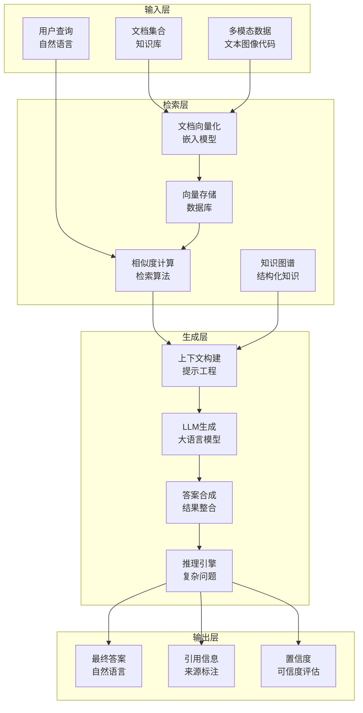

# 第17章：RAG系统与知识管理

> **设计思想**：掌握检索增强生成的核心技术，构建智能的知识管理和问答系统

## 章节概述

检索增强生成（Retrieval-Augmented Generation, RAG）是一种结合信息检索和语言生成的技术，它通过从外部知识源检索相关信息来增强大语言模型的生成能力。这种方法能够有效解决大语言模型的知识局限性问题，使其能够基于最新的、特定领域的信息生成更准确、更相关的回答。

本章将深入探讨RAG系统的核心技术，包括文档向量化、相似度计算、知识图谱构建、多模态检索和智能推理等关键技术，并通过实际项目实践帮助读者掌握构建RAG系统的方法。

## 学习目标

完成本章学习后，你将：

- ✅ **理解RAG系统原理**：掌握检索增强生成的核心概念和工作原理
- ✅ **掌握文档向量化技术**：学会将文本、图像等多模态数据转换为向量表示
- ✅ **实现相似度计算**：掌握各种相似度计算方法和优化技术
- ✅ **构建知识图谱**：理解知识图谱的构建和维护方法
- ✅ **实现多模态检索**：掌握文本、图像、代码等多种数据类型的检索技术
- ✅ **掌握智能推理**：学会实现多步骤问题解决和复杂推理能力

## 章节内容

### 17.1 检索增强生成（RAG）原理
**学习重点**：理解RAG系统的核心概念和工作流程
- RAG的基本原理和优势
- 检索器和生成器的协同工作
- RAG与传统语言模型的对比
- RAG的应用场景和挑战

### 17.2 文档向量化与相似度计算
**学习重点**：掌握文档向量化和相似度计算技术
- 文本嵌入模型的原理和实现
- 向量数据库的选择和使用
- 余弦相似度和欧氏距离计算
- 相似度计算的优化技术

### 17.3 知识图谱构建与维护
**学习重点**：理解知识图谱的构建和维护方法
- 知识图谱的基本概念和结构
- 实体识别和关系抽取
- 知识图谱的存储和查询
- 知识图谱的更新和维护

### 17.4 多模态检索：文本、图像与代码
**学习重点**：掌握多模态数据的检索技术
- 文本检索技术的深入理解
- 图像向量化和相似度计算
- 代码文档的向量化处理
- 多模态融合检索策略

### 17.5 智能推理：多步骤问题解决
**学习重点**：实现复杂的推理和问题解决能力
- 推理链的构建和优化
- 多步骤问题分解技术
- 上下文理解和推理
- 推理结果的验证和优化

## 技术架构图

## 实践项目

**项目名称**：基于TinyAI的智能问答系统

**项目目标**：
- 实现完整的RAG系统架构
- 构建文档向量化和检索流程
- 实现知识图谱的构建和查询
- 开发多模态检索功能
- 构建智能推理和问题解决能力

**技术要求**：
- 代码质量：完整注释、单元测试覆盖率>90%
- 功能完整性：支持文本、图像、代码等多种数据类型的检索
- 性能要求：检索响应时间<100ms，生成响应时间<1秒
- 易用性：提供简洁的API和配置接口

**预期成果**：
- 可运行的完整RAG问答系统
- 详细的性能测试报告和优化建议
- 多模态检索的实现和测试结果
- 技术文档和使用说明

## 本章小结

第17章将为读者建立起RAG系统和知识管理的完整知识体系，从基本原理到核心技术，再到实际应用的全面覆盖。通过本章的学习，读者将具备独立开发RAG系统和知识管理应用的能力，为构建更加智能的AI应用奠定坚实基础。

---

**下一章预告**：第18章我们将学习多智能体系统与应用实战，掌握构建复杂AI应用的关键技术。