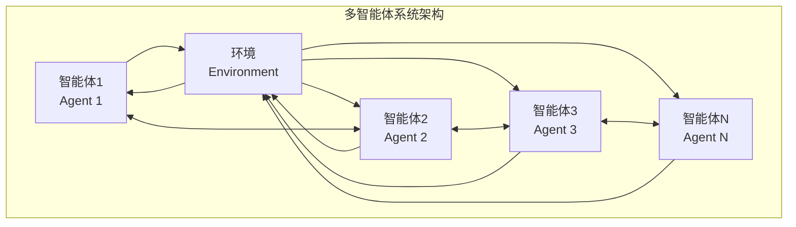

# 18.1 多智能体协作模式

> **设计思想**：理解不同类型的智能体协作模式，掌握多智能体系统的核心架构设计

## 本节概述

多智能体系统（Multi-Agent System, MAS）是由多个自主智能体组成的分布式系统，这些智能体通过交互、协作和竞争来解决复杂问题。在多智能体系统中，不同的协作模式决定了智能体之间如何组织、通信和协调工作。

本节将深入探讨多智能体系统的核心协作模式，包括集中式与分布式架构、主从式协作、对等式协作和联盟式协作等，并通过实际代码实现来加深理解。

## 学习目标

完成本节学习后，你将：

- ✅ **理解多智能体系统架构**：掌握集中式与分布式架构的特点和应用场景
- ✅ **掌握主从式协作模式**：学会实现主从式智能体协作机制
- ✅ **实现对等式协作模式**：掌握对等式智能体间的协作和通信
- ✅ **理解联盟式协作模式**：学会构建动态联盟和任务协作机制
- ✅ **掌握协作模式选择**：理解如何根据应用场景选择合适的协作模式

## 多智能体系统基础概念

### 1. 多智能体系统定义

多智能体系统是由多个智能体组成的计算系统，其中每个智能体都具有以下特征：

1. **自主性**：能够独立运行和做出决策
2. **反应性**：能够感知环境并做出响应
3. **主动性**：能够主动采取行动实现目标
4. **社会性**：能够与其他智能体交互和协作



### 2. 智能体基本结构

```java
public abstract class Agent {
    protected String agentId;
    protected String name;
    protected AgentState state;
    protected EventBus eventBus;
    protected Logger logger;
    
    public Agent(String agentId, String name) {
        this.agentId = agentId;
        this.name = name;
        this.state = AgentState.INITIALIZING;
        this.eventBus = new EventBus();
        this.logger = Logger.getLogger(this.getClass().getName());
    }
    
    // 抽象方法，子类必须实现
    public abstract void initialize();
    public abstract AgentResponse processMessage(AgentMessage message);
    public abstract void shutdown();
    
    // 通用方法
    public void sendMessage(AgentMessage message) {
        eventBus.publish(message);
    }
    
    public void receiveMessage(AgentMessage message) {
        try {
            AgentResponse response = processMessage(message);
            if (response != null) {
                sendResponse(response);
            }
        } catch (Exception e) {
            logger.severe("Error processing message: " + e.getMessage());
            sendErrorResponse(e.getMessage());
        }
    }
    
    protected void sendResponse(AgentResponse response) {
        // 发送响应消息
        AgentMessage responseMessage = new AgentMessage();
        responseMessage.setType(MessageType.RESPONSE);
        responseMessage.setSenderId(this.agentId);
        responseMessage.setReceiverId(response.getTargetAgentId());
        responseMessage.setContent(response);
        sendMessage(responseMessage);
    }
    
    protected void sendErrorResponse(String errorMessage) {
        // 发送错误响应
        AgentResponse errorResponse = new AgentResponse();
        errorResponse.setError(true);
        errorResponse.setErrorMessage(errorMessage);
        sendResponse(errorResponse);
    }
    
    // Getters and Setters
    public String getAgentId() { return agentId; }
    public String getName() { return name; }
    public AgentState getState() { return state; }
    public void setState(AgentState state) { this.state = state; }
    public EventBus getEventBus() { return eventBus; }
}

// 智能体状态枚举
enum AgentState {
    INITIALIZING, READY, BUSY, ERROR, SHUTDOWN
}

// 智能体消息类
class AgentMessage {
    private String messageId;
    private MessageType type;
    private String senderId;
    private String receiverId;
    private Object content;
    private Map<String, Object> metadata;
    private long timestamp;
    
    public AgentMessage() {
        this.messageId = UUID.randomUUID().toString();
        this.metadata = new HashMap<>();
        this.timestamp = System.currentTimeMillis();
    }
    
    // Getters and Setters
    public String getMessageId() { return messageId; }
    public void setMessageId(String messageId) { this.messageId = messageId; }
    
    public MessageType getType() { return type; }
    public void setType(MessageType type) { this.type = type; }
    
    public String getSenderId() { return senderId; }
    public void setSenderId(String senderId) { this.senderId = senderId; }
    
    public String getReceiverId() { return receiverId; }
    public void setReceiverId(String receiverId) { this.receiverId = receiverId; }
    
    public Object getContent() { return content; }
    public void setContent(Object content) { this.content = content; }
    
    public Map<String, Object> getMetadata() { return metadata; }
    public void addMetadata(String key, Object value) { this.metadata.put(key, value); }
    
    public long getTimestamp() { return timestamp; }
    public void setTimestamp(long timestamp) { this.timestamp = timestamp; }
}

// 消息类型枚举
enum MessageType {
    REQUEST, RESPONSE, BROADCAST, ERROR, HEARTBEAT
}

// 智能体响应类
class AgentResponse {
    private String targetAgentId;
    private Object content;
    private boolean error;
    private String errorMessage;
    private Map<String, Object> metadata;
    
    public AgentResponse() {
        this.metadata = new HashMap<>();
    }
    
    // Getters and Setters
    public String getTargetAgentId() { return targetAgentId; }
    public void setTargetAgentId(String targetAgentId) { this.targetAgentId = targetAgentId; }
    
    public Object getContent() { return content; }
    public void setContent(Object content) { this.content = content; }
    
    public boolean isError() { return error; }
    public void setError(boolean error) { this.error = error; }
    
    public String getErrorMessage() { return errorMessage; }
    public void setErrorMessage(String errorMessage) { this.errorMessage = errorMessage; }
    
    public Map<String, Object> getMetadata() { return metadata; }
    public void addMetadata(String key, Object value) { this.metadata.put(key, value); }
}
```

## 集中式与分布式协作架构

### 1. 集中式协作架构

集中式架构中，有一个中央控制器负责协调所有智能体的活动。

```java
public class CentralizedMultiAgentSystem {
    private CentralController controller;
    private Map<String, Agent> agents;
    private AgentRegistry agentRegistry;
    private MessageRouter messageRouter;
    private ReadWriteLock lock;
    
    public CentralizedMultiAgentSystem() {
        this.agents = new ConcurrentHashMap<>();
        this.agentRegistry = new AgentRegistry();
        this.messageRouter = new MessageRouter();
        this.controller = new CentralController(this);
        this.lock = new ReentrantReadWriteLock();
    }
    
    public void addAgent(Agent agent) {
        lock.writeLock().lock();
        try {
            agents.put(agent.getAgentId(), agent);
            agentRegistry.registerAgent(agent);
            messageRouter.registerAgent(agent);
            agent.initialize();
            logger.info("Agent added: " + agent.getAgentId());
        } finally {
            lock.writeLock().unlock();
        }
    }
    
    public void removeAgent(String agentId) {
        lock.writeLock().lock();
        try {
            Agent agent = agents.remove(agentId);
            if (agent != null) {
                agentRegistry.unregisterAgent(agentId);
                messageRouter.unregisterAgent(agentId);
                agent.shutdown();
                logger.info("Agent removed: " + agentId);
            }
        } finally {
            lock.writeLock().unlock();
        }
    }
    
    public AgentResponse sendMessage(AgentMessage message) {
        // 通过中央控制器路由消息
        return controller.routeMessage(message);
    }
    
    public List<Agent> getAllAgents() {
        lock.readLock().lock();
        try {
            return new ArrayList<>(agents.values());
        } finally {
            lock.readLock().unlock();
        }
    }
    
    public Agent getAgent(String agentId) {
        lock.readLock().lock();
        try {
            return agents.get(agentId);
        } finally {
            lock.readLock().unlock();
        }
    }
    
    public void startSystem() {
        controller.start();
        logger.info("Centralized Multi-Agent System started");
    }
    
    public void shutdown() {
        controller.shutdown();
        for (Agent agent : agents.values()) {
            agent.shutdown();
        }
        logger.info("Centralized Multi-Agent System shutdown completed");
    }
    
    // Getters
    public CentralController getController() { return controller; }
    public AgentRegistry getAgentRegistry() { return agentRegistry; }
    public MessageRouter getMessageRouter() { return messageRouter; }
}

// 中央控制器
class CentralController {
    private CentralizedMultiAgentSystem system;
    private TaskScheduler taskScheduler;
    private LoadBalancer loadBalancer;
    private SystemMonitor systemMonitor;
    private ScheduledExecutorService scheduler;
    
    public CentralController(CentralizedMultiAgentSystem system) {
        this.system = system;
        this.taskScheduler = new TaskScheduler();
        this.loadBalancer = new LoadBalancer();
        this.systemMonitor = new SystemMonitor();
        this.scheduler = Executors.newScheduledThreadPool(2);
    }
    
    public AgentResponse routeMessage(AgentMessage message) {
        try {
            // 1. 消息验证
            if (!isValidMessage(message)) {
                return createErrorResponse("Invalid message");
            }
            
            // 2. 负载均衡
            String targetAgentId = loadBalancer.selectAgent(
                message.getReceiverId(), system.getAgentRegistry());
            
            // 3. 任务调度
            Task task = taskScheduler.createTask(message, targetAgentId);
            
            // 4. 执行任务
            AgentResponse response = executeTask(task);
            
            // 5. 记录监控信息
            systemMonitor.recordTaskExecution(task, response);
            
            return response;
        } catch (Exception e) {
            logger.severe("Error routing message: " + e.getMessage());
            return createErrorResponse(e.getMessage());
        }
    }
    
    private boolean isValidMessage(AgentMessage message) {
        return message != null && 
               message.getSenderId() != null && 
               message.getReceiverId() != null;
    }
    
    private AgentResponse executeTask(Task task) {
        Agent targetAgent = system.getAgent(task.getTargetAgentId());
        if (targetAgent == null) {
            return createErrorResponse("Target agent not found: " + task.getTargetAgentId());
        }
        
        try {
            return targetAgent.processMessage(task.getMessage());
        } catch (Exception e) {
            return createErrorResponse("Agent processing error: " + e.getMessage());
        }
    }
    
    private AgentResponse createErrorResponse(String errorMessage) {
        AgentResponse response = new AgentResponse();
        response.setError(true);
        response.setErrorMessage(errorMessage);
        return response;
    }
    
    public void start() {
        // 启动定期监控任务
        scheduler.scheduleAtFixedRate(this::performSystemMonitoring, 
                                    0, 30, TimeUnit.SECONDS);
        
        // 启动负载均衡优化任务
        scheduler.scheduleAtFixedRate(this::optimizeLoadBalancing, 
                                    0, 60, TimeUnit.SECONDS);
        
        logger.info("Central Controller started");
    }
    
    private void performSystemMonitoring() {
        SystemStats stats = systemMonitor.collectSystemStats(system);
        if (stats.needsAttention()) {
            // 发送系统警报
            sendSystemAlert(stats);
        }
    }
    
    private void optimizeLoadBalancing() {
        loadBalancer.optimizeDistribution(system.getAgentRegistry());
    }
    
    private void sendSystemAlert(SystemStats stats) {
        // 发送系统状态警报
        AgentMessage alertMessage = new AgentMessage();
        alertMessage.setType(MessageType.BROADCAST);
        alertMessage.setSenderId("controller");
        alertMessage.setContent(stats);
        system.sendMessage(alertMessage);
    }
    
    public void shutdown() {
        scheduler.shutdown();
        try {
            if (!scheduler.awaitTermination(5, TimeUnit.SECONDS)) {
                scheduler.shutdownNow();
            }
        } catch (InterruptedException e) {
            scheduler.shutdownNow();
            Thread.currentThread().interrupt();
        }
        logger.info("Central Controller shutdown completed");
    }
}

// 任务调度器
class TaskScheduler {
    
    public Task createTask(AgentMessage message, String targetAgentId) {
        Task task = new Task();
        task.setTaskId(UUID.randomUUID().toString());
        task.setMessage(message);
        task.setTargetAgentId(targetAgentId);
        task.setPriority(determinePriority(message));
        task.setCreationTime(System.currentTimeMillis());
        return task;
    }
    
    private int determinePriority(AgentMessage message) {
        // 根据消息类型确定优先级
        switch (message.getType()) {
            case HEARTBEAT:
                return 1; // 最低优先级
            case REQUEST:
                return 5; // 中等优先级
            case ERROR:
                return 10; // 最高优先级
            default:
                return 3; // 默认优先级
        }
    }
}

// 任务类
class Task {
    private String taskId;
    private AgentMessage message;
    private String targetAgentId;
    private int priority;
    private long creationTime;
    private long executionTime;
    
    // Getters and Setters
    public String getTaskId() { return taskId; }
    public void setTaskId(String taskId) { this.taskId = taskId; }
    
    public AgentMessage getMessage() { return message; }
    public void setMessage(AgentMessage message) { this.message = message; }
    
    public String getTargetAgentId() { return targetAgentId; }
    public void setTargetAgentId(String targetAgentId) { this.targetAgentId = targetAgentId; }
    
    public int getPriority() { return priority; }
    public void setPriority(int priority) { this.priority = priority; }
    
    public long getCreationTime() { return creationTime; }
    public void setCreationTime(long creationTime) { this.creationTime = creationTime; }
    
    public long getExecutionTime() { return executionTime; }
    public void setExecutionTime(long executionTime) { this.executionTime = executionTime; }
}

// 负载均衡器
class LoadBalancer {
    
    public String selectAgent(String targetAgentId, AgentRegistry registry) {
        if (targetAgentId != null && !targetAgentId.equals("*")) {
            // 指定目标智能体
            return targetAgentId;
        }
        
        // 负载均衡选择
        List<AgentInfo> availableAgents = registry.getAvailableAgents();
        if (availableAgents.isEmpty()) {
            return null;
        }
        
        // 选择负载最轻的智能体
        AgentInfo selectedAgent = availableAgents.stream()
            .min(Comparator.comparingInt(AgentInfo::getTaskCount))
            .orElse(availableAgents.get(0));
        
        return selectedAgent.getAgentId();
    }
    
    public void optimizeDistribution(AgentRegistry registry) {
        // 优化负载分布
        List<AgentInfo> agents = registry.getAllAgentInfo();
        if (agents.size() < 2) {
            return;
        }
        
        // 计算平均负载
        double averageLoad = agents.stream()
            .mapToInt(AgentInfo::getTaskCount)
            .average()
            .orElse(0);
        
        // 重新分配过载智能体的任务
        for (AgentInfo agent : agents) {
            if (agent.getTaskCount() > averageLoad * 1.5) {
                // 需要重新分配任务
                redistributeTasks(agent, registry, averageLoad);
            }
        }
    }
    
    private void redistributeTasks(AgentInfo overloadedAgent, AgentRegistry registry, double averageLoad) {
        // 简化的任务重新分配逻辑
        // 实际应用中应实现更复杂的任务迁移算法
        logger.info("Redistributing tasks from overloaded agent: " + overloadedAgent.getAgentId());
    }
}

// 系统监控器
class SystemMonitor {
    
    public SystemStats collectSystemStats(CentralizedMultiAgentSystem system) {
        SystemStats stats = new SystemStats();
        stats.setTimestamp(System.currentTimeMillis());
        
        List<Agent> agents = system.getAllAgents();
        stats.setTotalAgents(agents.size());
        
        int activeAgents = 0;
        int busyAgents = 0;
        int errorAgents = 0;
        
        for (Agent agent : agents) {
            switch (agent.getState()) {
                case READY:
                    activeAgents++;
                    break;
                case BUSY:
                    activeAgents++;
                    busyAgents++;
                    break;
                case ERROR:
                    errorAgents++;
                    break;
            }
        }
        
        stats.setActiveAgents(activeAgents);
        stats.setBusyAgents(busyAgents);
        stats.setErrorAgents(errorAgents);
        
        return stats;
    }
    
    public void recordTaskExecution(Task task, AgentResponse response) {
        // 记录任务执行统计信息
        task.setExecutionTime(System.currentTimeMillis() - task.getCreationTime());
        // 实际应用中应存储到数据库或统计系统中
    }
}

// 系统统计类
class SystemStats {
    private long timestamp;
    private int totalAgents;
    private int activeAgents;
    private int busyAgents;
    private int errorAgents;
    
    public boolean needsAttention() {
        // 判断是否需要关注系统状态
        return errorAgents > 0 || 
               (double) busyAgents / Math.max(totalAgents, 1) > 0.8;
    }
    
    // Getters and Setters
    public long getTimestamp() { return timestamp; }
    public void setTimestamp(long timestamp) { this.timestamp = timestamp; }
    
    public int getTotalAgents() { return totalAgents; }
    public void setTotalAgents(int totalAgents) { this.totalAgents = totalAgents; }
    
    public int getActiveAgents() { return activeAgents; }
    public void setActiveAgents(int activeAgents) { this.activeAgents = activeAgents; }
    
    public int getBusyAgents() { return busyAgents; }
    public void setBusyAgents(int busyAgents) { this.busyAgents = busyAgents; }
    
    public int getErrorAgents() { return errorAgents; }
    public void setErrorAgents(int errorAgents) { this.errorAgents = errorAgents; }
}
```

### 2. 分布式协作架构

分布式架构中，智能体之间直接通信，没有中央控制器。

```java
public class DistributedMultiAgentSystem {
    private Map<String, Agent> agents;
    private AgentRegistry agentRegistry;
    private MessageRouter messageRouter;
    private DiscoveryService discoveryService;
    private ReadWriteLock lock;
    
    public DistributedMultiAgentSystem() {
        this.agents = new ConcurrentHashMap<>();
        this.agentRegistry = new AgentRegistry();
        this.messageRouter = new MessageRouter();
        this.discoveryService = new DiscoveryService();
        this.lock = new ReentrantReadWriteLock();
    }
    
    public void addAgent(Agent agent) {
        lock.writeLock().lock();
        try {
            agents.put(agent.getAgentId(), agent);
            agentRegistry.registerAgent(agent);
            messageRouter.registerAgent(agent);
            discoveryService.registerAgent(agent);
            agent.initialize();
            
            // 通知其他智能体新智能体加入
            notifyAgentJoined(agent);
            
            logger.info("Agent added: " + agent.getAgentId());
        } finally {
            lock.writeLock().unlock();
        }
    }
    
    public void removeAgent(String agentId) {
        lock.writeLock().lock();
        try {
            Agent agent = agents.remove(agentId);
            if (agent != null) {
                agentRegistry.unregisterAgent(agentId);
                messageRouter.unregisterAgent(agentId);
                discoveryService.unregisterAgent(agentId);
                agent.shutdown();
                
                // 通知其他智能体智能体离开
                notifyAgentLeft(agentId);
                
                logger.info("Agent removed: " + agentId);
            }
        } finally {
            lock.writeLock().unlock();
        }
    }
    
    public void sendMessage(AgentMessage message) {
        // 在分布式系统中，消息直接路由到目标智能体
        messageRouter.routeMessage(message);
    }
    
    private void notifyAgentJoined(Agent agent) {
        AgentMessage notification = createAgentNotification(
            "agent_joined", agent.getAgentId(), agent.getName());
        broadcastMessage(notification);
    }
    
    private void notifyAgentLeft(String agentId) {
        AgentMessage notification = createAgentNotification(
            "agent_left", agentId, null);
        broadcastMessage(notification);
    }
    
    private AgentMessage createAgentNotification(String eventType, String agentId, String agentName) {
        AgentMessage message = new AgentMessage();
        message.setType(MessageType.BROADCAST);
        message.setSenderId("system");
        message.setContent(Map.of(
            "event", eventType,
            "agent_id", agentId,
            "agent_name", agentName,
            "timestamp", System.currentTimeMillis()
        ));
        return message;
    }
    
    private void broadcastMessage(AgentMessage message) {
        for (Agent agent : agents.values()) {
            if (!agent.getAgentId().equals(message.getSenderId())) {
                try {
                    agent.receiveMessage(message);
                } catch (Exception e) {
                    logger.warning("Failed to deliver broadcast message to agent " + 
                                 agent.getAgentId() + ": " + e.getMessage());
                }
            }
        }
    }
    
    public List<Agent> getAllAgents() {
        lock.readLock().lock();
        try {
            return new ArrayList<>(agents.values());
        } finally {
            lock.readLock().unlock();
        }
    }
    
    public Agent getAgent(String agentId) {
        lock.readLock().lock();
        try {
            return agents.get(agentId);
        } finally {
            lock.readLock().unlock();
        }
    }
    
    public void startSystem() {
        // 在分布式系统中，每个智能体自主运行
        logger.info("Distributed Multi-Agent System started");
    }
    
    public void shutdown() {
        for (Agent agent : agents.values()) {
            agent.shutdown();
        }
        logger.info("Distributed Multi-Agent System shutdown completed");
    }
    
    // Getters
    public AgentRegistry getAgentRegistry() { return agentRegistry; }
    public MessageRouter getMessageRouter() { return messageRouter; }
    public DiscoveryService getDiscoveryService() { return discoveryService; }
}

// 发现服务
class DiscoveryService {
    private Map<String, AgentInfo> agentDirectory;
    private ReadWriteLock lock;
    
    public DiscoveryService() {
        this.agentDirectory = new ConcurrentHashMap<>();
        this.lock = new ReentrantReadWriteLock();
    }
    
    public void registerAgent(Agent agent) {
        AgentInfo info = new AgentInfo(agent.getAgentId(), agent.getName());
        info.setCapabilities(discoverCapabilities(agent));
        info.setLastHeartbeat(System.currentTimeMillis());
        
        lock.writeLock().lock();
        try {
            agentDirectory.put(agent.getAgentId(), info);
        } finally {
            lock.writeLock().unlock();
        }
    }
    
    public void unregisterAgent(String agentId) {
        lock.writeLock().lock();
        try {
            agentDirectory.remove(agentId);
        } finally {
            lock.writeLock().unlock();
        }
    }
    
    public List<AgentInfo> discoverAgents(String capability) {
        lock.readLock().lock();
        try {
            return agentDirectory.values().stream()
                .filter(info -> info.hasCapability(capability))
                .collect(Collectors.toList());
        } finally {
            lock.readLock().unlock();
        }
    }
    
    public AgentInfo findAgent(String agentId) {
        lock.readLock().lock();
        try {
            return agentDirectory.get(agentId);
        } finally {
            lock.readLock().unlock();
        }
    }
    
    private Set<String> discoverCapabilities(Agent agent) {
        // 发现智能体的能力
        // 实际应用中可以通过注解、接口检测等方式实现
        Set<String> capabilities = new HashSet<>();
        
        // 简化的示例
        if (agent instanceof ProcessingAgent) {
            capabilities.add("processing");
        }
        if (agent instanceof CommunicationAgent) {
            capabilities.add("communication");
        }
        if (agent instanceof StorageAgent) {
            capabilities.add("storage");
        }
        
        return capabilities;
    }
    
    public void updateHeartbeat(String agentId) {
        lock.writeLock().lock();
        try {
            AgentInfo info = agentDirectory.get(agentId);
            if (info != null) {
                info.setLastHeartbeat(System.currentTimeMillis());
            }
        } finally {
            lock.writeLock().unlock();
        }
    }
}

// 智能体信息类
class AgentInfo {
    private String agentId;
    private String name;
    private Set<String> capabilities;
    private AgentState state;
    private int taskCount;
    private long lastHeartbeat;
    private Map<String, Object> metadata;
    
    public AgentInfo(String agentId, String name) {
        this.agentId = agentId;
        this.name = name;
        this.capabilities = new HashSet<>();
        this.state = AgentState.READY;
        this.metadata = new HashMap<>();
    }
    
    // Getters and Setters
    public String getAgentId() { return agentId; }
    public String getName() { return name; }
    
    public Set<String> getCapabilities() { return capabilities; }
    public void setCapabilities(Set<String> capabilities) { this.capabilities = capabilities; }
    public boolean hasCapability(String capability) { return capabilities.contains(capability); }
    public void addCapability(String capability) { capabilities.add(capability); }
    
    public AgentState getState() { return state; }
    public void setState(AgentState state) { this.state = state; }
    
    public int getTaskCount() { return taskCount; }
    public void setTaskCount(int taskCount) { this.taskCount = taskCount; }
    public void incrementTaskCount() { this.taskCount++; }
    public void decrementTaskCount() { this.taskCount = Math.max(0, this.taskCount - 1); }
    
    public long getLastHeartbeat() { return lastHeartbeat; }
    public void setLastHeartbeat(long lastHeartbeat) { this.lastHeartbeat = lastHeartbeat; }
    
    public Map<String, Object> getMetadata() { return metadata; }
    public void addMetadata(String key, Object value) { this.metadata.put(key, value); }
}

// 消息路由器
class MessageRouter {
    private Map<String, Agent> agentMap;
    private LoadBalancer loadBalancer;
    private ReadWriteLock lock;
    
    public MessageRouter() {
        this.agentMap = new ConcurrentHashMap<>();
        this.loadBalancer = new LoadBalancer();
        this.lock = new ReentrantReadWriteLock();
    }
    
    public void registerAgent(Agent agent) {
        lock.writeLock().lock();
        try {
            agentMap.put(agent.getAgentId(), agent);
        } finally {
            lock.writeLock().unlock();
        }
    }
    
    public void unregisterAgent(String agentId) {
        lock.writeLock().lock();
        try {
            agentMap.remove(agentId);
        } finally {
            lock.writeLock().unlock();
        }
    }
    
    public void routeMessage(AgentMessage message) {
        String receiverId = message.getReceiverId();
        
        if (receiverId == null) {
            logger.warning("Message has no receiver: " + message.getMessageId());
            return;
        }
        
        // 处理广播消息
        if ("*".equals(receiverId) || "all".equals(receiverId)) {
            broadcastMessage(message);
            return;
        }
        
        // 处理组播消息
        if (receiverId.startsWith("group:")) {
            multicastMessage(message, receiverId);
            return;
        }
        
        // 处理单播消息
        Agent receiver = getAgent(receiverId);
        if (receiver != null) {
            try {
                receiver.receiveMessage(message);
            } catch (Exception e) {
                logger.severe("Error delivering message to agent " + receiverId + ": " + e.getMessage());
            }
        } else {
            logger.warning("Receiver agent not found: " + receiverId);
        }
    }
    
    private void broadcastMessage(AgentMessage message) {
        lock.readLock().lock();
        try {
            for (Agent agent : agentMap.values()) {
                if (!agent.getAgentId().equals(message.getSenderId())) {
                    try {
                        agent.receiveMessage(message);
                    } catch (Exception e) {
                        logger.warning("Failed to deliver broadcast message to agent " + 
                                     agent.getAgentId() + ": " + e.getMessage());
                    }
                }
            }
        } finally {
            lock.readLock().unlock();
        }
    }
    
    private void multicastMessage(AgentMessage message, String groupId) {
        // 简化的组播实现
        // 实际应用中应实现更复杂的组管理机制
        broadcastMessage(message);
    }
    
    private Agent getAgent(String agentId) {
        lock.readLock().lock();
        try {
            return agentMap.get(agentId);
        } finally {
            lock.readLock().unlock();
        }
    }
}

// 智能体注册表
class AgentRegistry {
    private Map<String, AgentInfo> agentInfoMap;
    private ReadWriteLock lock;
    
    public AgentRegistry() {
        this.agentInfoMap = new ConcurrentHashMap<>();
        this.lock = new ReentrantReadWriteLock();
    }
    
    public void registerAgent(Agent agent) {
        AgentInfo info = new AgentInfo(agent.getAgentId(), agent.getName());
        lock.writeLock().lock();
        try {
            agentInfoMap.put(agent.getAgentId(), info);
        } finally {
            lock.writeLock().unlock();
        }
    }
    
    public void unregisterAgent(String agentId) {
        lock.writeLock().lock();
        try {
            agentInfoMap.remove(agentId);
        } finally {
            lock.writeLock().unlock();
        }
    }
    
    public List<AgentInfo> getAvailableAgents() {
        lock.readLock().lock();
        try {
            return agentInfoMap.values().stream()
                .filter(info -> info.getState() == AgentState.READY)
                .collect(Collectors.toList());
        } finally {
            lock.readLock().unlock();
        }
    }
    
    public List<AgentInfo> getAllAgentInfo() {
        lock.readLock().lock();
        try {
            return new ArrayList<>(agentInfoMap.values());
        } finally {
            lock.readLock().unlock();
        }
    }
    
    public AgentInfo getAgentInfo(String agentId) {
        lock.readLock().lock();
        try {
            return agentInfoMap.get(agentId);
        } finally {
            lock.readLock().unlock();
        }
    }
}
```

## 主从式协作模式

### 1. 主从式架构实现

```java
public class MasterSlaveAgentSystem {
    private MasterAgent master;
    private List<SlaveAgent> slaves;
    private TaskQueue taskQueue;
    private ResultCollector resultCollector;
    private ReadWriteLock lock;
    
    public MasterSlaveAgentSystem() {
        this.slaves = new ArrayList<>();
        this.taskQueue = new TaskQueue();
        this.resultCollector = new ResultCollector();
        this.lock = new ReentrantReadWriteLock();
    }
    
    public void initialize() {
        // 创建主智能体
        this.master = new MasterAgent("master", "Master Agent");
        this.master.initialize();
        
        logger.info("Master-Slave Agent System initialized");
    }
    
    public void addSlaveAgent(SlaveAgent slave) {
        lock.writeLock().lock();
        try {
            slaves.add(slave);
            slave.initialize();
            slave.setMaster(master);
            logger.info("Slave agent added: " + slave.getAgentId());
        } finally {
            lock.writeLock().unlock();
        }
    }
    
    public void removeSlaveAgent(String slaveId) {
        lock.writeLock().lock();
        try {
            slaves.removeIf(slave -> slave.getAgentId().equals(slaveId));
            logger.info("Slave agent removed: " + slaveId);
        } finally {
            lock.writeLock().unlock();
        }
    }
    
    public void submitTask(TaskRequest request) {
        Task task = new Task();
        task.setTaskId(UUID.randomUUID().toString());
        task.setRequest(request);
        task.setStatus(TaskStatus.PENDING);
        task.setSubmissionTime(System.currentTimeMillis());
        
        taskQueue.addTask(task);
        master.notifyNewTask(task);
    }
    
    public TaskResult getTaskResult(String taskId) {
        return resultCollector.getResult(taskId);
    }
    
    public List<SlaveAgent> getSlaveAgents() {
        lock.readLock().lock();
        try {
            return new ArrayList<>(slaves);
        } finally {
            lock.readLock().unlock();
        }
    }
    
    public MasterAgent getMaster() {
        return master;
    }
    
    public SystemStatus getSystemStatus() {
        SystemStatus status = new SystemStatus();
        status.setMasterStatus(master.getState());
        status.setSlaveCount(slaves.size());
        status.setPendingTasks(taskQueue.getPendingTaskCount());
        status.setCompletedTasks(resultCollector.getCompletedTaskCount());
        return status;
    }
    
    public void shutdown() {
        if (master != null) {
            master.shutdown();
        }
        for (SlaveAgent slave : slaves) {
            slave.shutdown();
        }
        logger.info("Master-Slave Agent System shutdown completed");
    }
}

// 主智能体
class MasterAgent extends Agent {
    private List<SlaveAgent> slaves;
    private TaskQueue taskQueue;
    private ResultCollector resultCollector;
    private TaskScheduler taskScheduler;
    private LoadBalancer loadBalancer;
    private ReadWriteLock lock;
    
    public MasterAgent(String agentId, String name) {
        super(agentId, name);
        this.slaves = new ArrayList<>();
        this.taskQueue = new TaskQueue();
        this.resultCollector = new ResultCollector();
        this.taskScheduler = new TaskScheduler();
        this.loadBalancer = new LoadBalancer();
        this.lock = new ReentrantReadWriteLock();
    }
    
    @Override
    public void initialize() {
        setState(AgentState.READY);
        logger.info("Master agent initialized");
    }
    
    @Override
    public AgentResponse processMessage(AgentMessage message) {
        AgentResponse response = new AgentResponse();
        
        switch (message.getType()) {
            case REQUEST:
                handleTaskRequest(message, response);
                break;
            case RESPONSE:
                handleTaskResponse(message, response);
                break;
            case HEARTBEAT:
                handleHeartbeat(message, response);
                break;
            default:
                response.setError(true);
                response.setErrorMessage("Unknown message type: " + message.getType());
        }
        
        return response;
    }
    
    private void handleTaskRequest(AgentMessage message, AgentResponse response) {
        try {
            TaskRequest request = (TaskRequest) message.getContent();
            Task task = new Task();
            task.setTaskId(UUID.randomUUID().toString());
            task.setRequest(request);
            task.setStatus(TaskStatus.PENDING);
            task.setSubmissionTime(System.currentTimeMillis());
            
            taskQueue.addTask(task);
            scheduleTask(task);
            
            response.setContent("Task submitted successfully: " + task.getTaskId());
        } catch (Exception e) {
            response.setError(true);
            response.setErrorMessage("Failed to handle task request: " + e.getMessage());
        }
    }
    
    private void handleTaskResponse(AgentMessage message, AgentResponse response) {
        try {
            TaskResult result = (TaskResult) message.getContent();
            resultCollector.collectResult(result);
            
            // 通知任务完成
            notifyTaskCompletion(result);
            
            response.setContent("Task result received successfully");
        } catch (Exception e) {
            response.setError(true);
            response.setErrorMessage("Failed to handle task response: " + e.getMessage());
        }
    }
    
    private void handleHeartbeat(AgentMessage message, AgentResponse response) {
        // 处理从智能体的心跳
        String slaveId = message.getSenderId();
        logger.fine("Received heartbeat from slave: " + slaveId);
        response.setContent("Heartbeat acknowledged");
    }
    
    public void notifyNewTask(Task task) {
        scheduleTask(task);
    }
    
    private void scheduleTask(Task task) {
        lock.readLock().lock();
        try {
            if (slaves.isEmpty()) {
                logger.warning("No slave agents available to execute task: " + task.getTaskId());
                return;
            }
            
            // 选择合适的从智能体
            SlaveAgent selectedSlave = loadBalancer.selectSlave(slaves);
            if (selectedSlave != null) {
                // 分配任务给从智能体
                assignTaskToSlave(task, selectedSlave);
            } else {
                logger.warning("No available slave agent to execute task: " + task.getTaskId());
            }
        } finally {
            lock.readLock().unlock();
        }
    }
    
    private void assignTaskToSlave(Task task, SlaveAgent slave) {
        try {
            AgentMessage message = new AgentMessage();
            message.setType(MessageType.REQUEST);
            message.setSenderId(this.agentId);
            message.setReceiverId(slave.getAgentId());
            message.setContent(task);
            
            slave.receiveMessage(message);
            task.setStatus(TaskStatus.ASSIGNED);
            task.setAssignedAgentId(slave.getAgentId());
            task.setAssignmentTime(System.currentTimeMillis());
            
            logger.info("Task assigned to slave " + slave.getAgentId() + ": " + task.getTaskId());
        } catch (Exception e) {
            logger.severe("Failed to assign task to slave: " + e.getMessage());
            task.setStatus(TaskStatus.FAILED);
        }
    }
    
    private void notifyTaskCompletion(TaskResult result) {
        // 通知相关方任务完成
        // 这里可以实现回调机制或事件发布
        logger.info("Task completed: " + result.getTaskId());
    }
    
    public void addSlave(SlaveAgent slave) {
        lock.writeLock().lock();
        try {
            slaves.add(slave);
            logger.info("Slave added to master: " + slave.getAgentId());
        } finally {
            lock.writeLock().unlock();
        }
    }
    
    public void removeSlave(String slaveId) {
        lock.writeLock().lock();
        try {
            slaves.removeIf(slave -> slave.getAgentId().equals(slaveId));
            logger.info("Slave removed from master: " + slaveId);
        } finally {
            lock.writeLock().unlock();
        }
    }
    
    @Override
    public void shutdown() {
        setState(AgentState.SHUTDOWN);
        logger.info("Master agent shutdown completed");
    }
}

// 从智能体
class SlaveAgent extends Agent {
    private MasterAgent master;
    private Task currentTask;
    private ScheduledExecutorService heartbeatScheduler;
    
    public SlaveAgent(String agentId, String name) {
        super(agentId, name);
        this.heartbeatScheduler = Executors.newScheduledThreadPool(1);
    }
    
    @Override
    public void initialize() {
        setState(AgentState.READY);
        
        // 启动心跳机制
        startHeartbeat();
        
        logger.info("Slave agent initialized: " + agentId);
    }
    
    private void startHeartbeat() {
        heartbeatScheduler.scheduleAtFixedRate(this::sendHeartbeat, 
                                            30, 30, TimeUnit.SECONDS);
    }
    
    private void sendHeartbeat() {
        if (master != null && getState() == AgentState.READY) {
            try {
                AgentMessage heartbeat = new AgentMessage();
                heartbeat.setType(MessageType.HEARTBEAT);
                heartbeat.setSenderId(this.agentId);
                heartbeat.setReceiverId(master.getAgentId());
                heartbeat.setContent("Heartbeat from " + this.agentId);
                
                master.receiveMessage(heartbeat);
            } catch (Exception e) {
                logger.warning("Failed to send heartbeat: " + e.getMessage());
            }
        }
    }
    
    @Override
    public AgentResponse processMessage(AgentMessage message) {
        AgentResponse response = new AgentResponse();
        
        switch (message.getType()) {
            case REQUEST:
                handleTaskAssignment(message, response);
                break;
            case RESPONSE:
                handleMasterResponse(message, response);
                break;
            default:
                response.setError(true);
                response.setErrorMessage("Unknown message type: " + message.getType());
        }
        
        return response;
    }
    
    private void handleTaskAssignment(AgentMessage message, AgentResponse response) {
        try {
            Task task = (Task) message.getContent();
            logger.info("Received task assignment: " + task.getTaskId());
            
            // 执行任务
            TaskResult result = executeTask(task);
            
            // 发送结果给主智能体
            sendTaskResult(result);
            
            response.setContent("Task executed successfully: " + task.getTaskId());
        } catch (Exception e) {
            response.setError(true);
            response.setErrorMessage("Failed to execute task: " + e.getMessage());
        }
    }
    
    private void handleMasterResponse(AgentMessage message, AgentResponse response) {
        // 处理主智能体的响应
        response.setContent("Response received from master");
    }
    
    private TaskResult executeTask(Task task) {
        setState(AgentState.BUSY);
        currentTask = task;
        
        TaskResult result = new TaskResult();
        result.setTaskId(task.getTaskId());
        result.setSlaveId(this.agentId);
        result.setStartTime(System.currentTimeMillis());
        
        try {
            // 执行具体的任务逻辑
            Object taskResult = performTask(task.getRequest());
            result.setResult(taskResult);
            result.setStatus(TaskStatus.COMPLETED);
        } catch (Exception e) {
            result.setError(true);
            result.setErrorMessage(e.getMessage());
            result.setStatus(TaskStatus.FAILED);
        } finally {
            result.setEndTime(System.currentTimeMillis());
            result.setExecutionTime(result.getEndTime() - result.getStartTime());
            setState(AgentState.READY);
            currentTask = null;
        }
        
        return result;
    }
    
    private Object performTask(TaskRequest request) throws Exception {
        // 根据任务类型执行相应的逻辑
        switch (request.getTaskType()) {
            case "calculation":
                return performCalculation(request);
            case "data_processing":
                return processData(request);
            case "file_operation":
                return performFileOperation(request);
            default:
                throw new UnsupportedOperationException("Unsupported task type: " + request.getTaskType());
        }
    }
    
    private Object performCalculation(TaskRequest request) {
        // 执行计算任务
        // 这里简化处理，实际应用中应实现具体的计算逻辑
        return "Calculation result for " + request.getTaskId();
    }
    
    private Object processData(TaskRequest request) {
        // 处理数据任务
        return "Processed data for " + request.getTaskId();
    }
    
    private Object performFileOperation(TaskRequest request) {
        // 执行文件操作任务
        return "File operation completed for " + request.getTaskId();
    }
    
    private void sendTaskResult(TaskResult result) {
        if (master != null) {
            try {
                AgentMessage message = new AgentMessage();
                message.setType(MessageType.RESPONSE);
                message.setSenderId(this.agentId);
                message.setReceiverId(master.getAgentId());
                message.setContent(result);
                
                master.receiveMessage(message);
            } catch (Exception e) {
                logger.severe("Failed to send task result: " + e.getMessage());
            }
        }
    }
    
    public void setMaster(MasterAgent master) {
        this.master = master;
        master.addSlave(this);
    }
    
    @Override
    public void shutdown() {
        setState(AgentState.SHUTDOWN);
        if (heartbeatScheduler != null) {
            heartbeatScheduler.shutdown();
        }
        logger.info("Slave agent shutdown completed: " + agentId);
    }
}

// 任务请求类
class TaskRequest {
    private String taskId;
    private String taskType;
    private Map<String, Object> parameters;
    private long priority;
    private long deadline;
    
    public TaskRequest() {
        this.parameters = new HashMap<>();
    }
    
    // Getters and Setters
    public String getTaskId() { return taskId; }
    public void setTaskId(String taskId) { this.taskId = taskId; }
    
    public String getTaskType() { return taskType; }
    public void setTaskType(String taskType) { this.taskType = taskType; }
    
    public Map<String, Object> getParameters() { return parameters; }
    public void setParameters(Map<String, Object> parameters) { this.parameters = parameters; }
    public void addParameter(String key, Object value) { this.parameters.put(key, value); }
    
    public long getPriority() { return priority; }
    public void setPriority(long priority) { this.priority = priority; }
    
    public long getDeadline() { return deadline; }
    public void setDeadline(long deadline) { this.deadline = deadline; }
}

// 任务类
class Task {
    private String taskId;
    private TaskRequest request;
    private TaskStatus status;
    private String assignedAgentId;
    private long submissionTime;
    private long assignmentTime;
    private long completionTime;
    
    // Getters and Setters
    public String getTaskId() { return taskId; }
    public void setTaskId(String taskId) { this.taskId = taskId; }
    
    public TaskRequest getRequest() { return request; }
    public void setRequest(TaskRequest request) { this.request = request; }
    
    public TaskStatus getStatus() { return status; }
    public void setStatus(TaskStatus status) { this.status = status; }
    
    public String getAssignedAgentId() { return assignedAgentId; }
    public void setAssignedAgentId(String assignedAgentId) { this.assignedAgentId = assignedAgentId; }
    
    public long getSubmissionTime() { return submissionTime; }
    public void setSubmissionTime(long submissionTime) { this.submissionTime = submissionTime; }
    
    public long getAssignmentTime() { return assignmentTime; }
    public void setAssignmentTime(long assignmentTime) { this.assignmentTime = assignmentTime; }
    
    public long getCompletionTime() { return completionTime; }
    public void setCompletionTime(long completionTime) { this.completionTime = completionTime; }
}

// 任务状态枚举
enum TaskStatus {
    PENDING, ASSIGNED, EXECUTING, COMPLETED, FAILED, CANCELLED
}

// 任务结果类
class TaskResult {
    private String taskId;
    private String slaveId;
    private Object result;
    private TaskStatus status;
    private boolean error;
    private String errorMessage;
    private long startTime;
    private long endTime;
    private long executionTime;
    
    // Getters and Setters
    public String getTaskId() { return taskId; }
    public void setTaskId(String taskId) { this.taskId = taskId; }
    
    public String getSlaveId() { return slaveId; }
    public void setSlaveId(String slaveId) { this.slaveId = slaveId; }
    
    public Object getResult() { return result; }
    public void setResult(Object result) { this.result = result; }
    
    public TaskStatus getStatus() { return status; }
    public void setStatus(TaskStatus status) { this.status = status; }
    
    public boolean isError() { return error; }
    public void setError(boolean error) { this.error = error; }
    
    public String getErrorMessage() { return errorMessage; }
    public void setErrorMessage(String errorMessage) { this.errorMessage = errorMessage; }
    
    public long getStartTime() { return startTime; }
    public void setStartTime(long startTime) { this.startTime = startTime; }
    
    public long getEndTime() { return endTime; }
    public void setEndTime(long endTime) { this.endTime = endTime; }
    
    public long getExecutionTime() { return executionTime; }
    public void setExecutionTime(long executionTime) { this.executionTime = executionTime; }
}

// 任务队列
class TaskQueue {
    private Queue<Task> pendingTasks;
    private ReadWriteLock lock;
    
    public TaskQueue() {
        this.pendingTasks = new ConcurrentLinkedQueue<>();
        this.lock = new ReentrantReadWriteLock();
    }
    
    public void addTask(Task task) {
        lock.writeLock().lock();
        try {
            pendingTasks.offer(task);
        } finally {
            lock.writeLock().unlock();
        }
    }
    
    public Task getNextTask() {
        lock.writeLock().lock();
        try {
            return pendingTasks.poll();
        } finally {
            lock.writeLock().unlock();
        }
    }
    
    public int getPendingTaskCount() {
        lock.readLock().lock();
        try {
            return pendingTasks.size();
        } finally {
            lock.readLock().unlock();
        }
    }
    
    public List<Task> getAllPendingTasks() {
        lock.readLock().lock();
        try {
            return new ArrayList<>(pendingTasks);
        } finally {
            lock.readLock().unlock();
        }
    }
}

// 结果收集器
class ResultCollector {
    private Map<String, TaskResult> results;
    private ReadWriteLock lock;
    
    public ResultCollector() {
        this.results = new ConcurrentHashMap<>();
        this.lock = new ReentrantReadWriteLock();
    }
    
    public void collectResult(TaskResult result) {
        lock.writeLock().lock();
        try {
            results.put(result.getTaskId(), result);
        } finally {
            lock.writeLock().unlock();
        }
    }
    
    public TaskResult getResult(String taskId) {
        lock.readLock().lock();
        try {
            return results.get(taskId);
        } finally {
            lock.readLock().unlock();
        }
    }
    
    public int getCompletedTaskCount() {
        lock.readLock().lock();
        try {
            return (int) results.values().stream()
                .filter(result -> result.getStatus() == TaskStatus.COMPLETED)
                .count();
        } finally {
            lock.readLock().unlock();
        }
    }
    
    public List<TaskResult> getAllResults() {
        lock.readLock().lock();
        try {
            return new ArrayList<>(results.values());
        } finally {
            lock.readLock().unlock();
        }
    }
}

// 系统状态类
class SystemStatus {
    private AgentState masterStatus;
    private int slaveCount;
    private int pendingTasks;
    private int completedTasks;
    private long timestamp;
    
    public SystemStatus() {
        this.timestamp = System.currentTimeMillis();
    }
    
    // Getters and Setters
    public AgentState getMasterStatus() { return masterStatus; }
    public void setMasterStatus(AgentState masterStatus) { this.masterStatus = masterStatus; }
    
    public int getSlaveCount() { return slaveCount; }
    public void setSlaveCount(int slaveCount) { this.slaveCount = slaveCount; }
    
    public int getPendingTasks() { return pendingTasks; }
    public void setPendingTasks(int pendingTasks) { this.pendingTasks = pendingTasks; }
    
    public int getCompletedTasks() { return completedTasks; }
    public void setCompletedTasks(int completedTasks) { this.completedTasks = completedTasks; }
    
    public long getTimestamp() { return timestamp; }
    public void setTimestamp(long timestamp) { this.timestamp = timestamp; }
}

// 特定类型的智能体接口
interface ProcessingAgent {}
interface CommunicationAgent {}
interface StorageAgent {}
```

## 对等式协作模式

### 1. 对等式架构实现

```java
public class PeerToPeerAgentSystem {
    private Map<String, PeerAgent> peers;
    private PeerDiscoveryService discoveryService;
    private MessageRouter messageRouter;
    private ConsensusManager consensusManager;
    private ReadWriteLock lock;
    
    public PeerToPeerAgentSystem() {
        this.peers = new ConcurrentHashMap<>();
        this.discoveryService = new PeerDiscoveryService();
        this.messageRouter = new MessageRouter();
        this.consensusManager = new ConsensusManager();
        this.lock = new ReentrantReadWriteLock();
    }
    
    public void addPeer(PeerAgent peer) {
        lock.writeLock().lock();
        try {
            peers.put(peer.getAgentId(), peer);
            discoveryService.registerPeer(peer);
            messageRouter.registerAgent(peer);
            peer.setPeerSystem(this);
            peer.initialize();
            
            // 通知其他对等节点新节点加入
            notifyPeerJoined(peer);
            
            logger.info("Peer added: " + peer.getAgentId());
        } finally {
            lock.writeLock().unlock();
        }
    }
    
    public void removePeer(String peerId) {
        lock.writeLock().lock();
        try {
            PeerAgent peer = peers.remove(peerId);
            if (peer != null) {
                discoveryService.unregisterPeer(peerId);
                messageRouter.unregisterAgent(peerId);
                peer.shutdown();
                
                // 通知其他对等节点节点离开
                notifyPeerLeft(peerId);
                
                logger.info("Peer removed: " + peerId);
            }
        } finally {
            lock.writeLock().unlock();
        }
    }
    
    public void broadcastMessage(AgentMessage message) {
        lock.readLock().lock();
        try {
            for (PeerAgent peer : peers.values()) {
                if (!peer.getAgentId().equals(message.getSenderId())) {
                    try {
                        peer.receiveMessage(message);
                    } catch (Exception e) {
                        logger.warning("Failed to deliver message to peer " + 
                                     peer.getAgentId() + ": " + e.getMessage());
                    }
                }
            }
        } finally {
            lock.readLock().unlock();
        }
    }
    
    public void sendMessageToPeer(String peerId, AgentMessage message) {
        PeerAgent peer = getPeer(peerId);
        if (peer != null) {
            try {
                peer.receiveMessage(message);
            } catch (Exception e) {
                logger.severe("Failed to send message to peer " + peerId + ": " + e.getMessage());
            }
        } else {
            logger.warning("Peer not found: " + peerId);
        }
    }
    
    private void notifyPeerJoined(PeerAgent peer) {
        AgentMessage notification = createPeerNotification(
            "peer_joined", peer.getAgentId(), peer.getName());
        broadcastMessage(notification);
    }
    
    private void notifyPeerLeft(String peerId) {
        AgentMessage notification = createPeerNotification(
            "peer_left", peerId, null);
        broadcastMessage(notification);
    }
    
    private AgentMessage createPeerNotification(String eventType, String peerId, String peerName) {
        AgentMessage message = new AgentMessage();
        message.setType(MessageType.BROADCAST);
        message.setSenderId("system");
        message.setContent(Map.of(
            "event", eventType,
            "peer_id", peerId,
            "peer_name", peerName,
            "timestamp", System.currentTimeMillis()
        ));
        return message;
    }
    
    public List<PeerAgent> getAllPeers() {
        lock.readLock().lock();
        try {
            return new ArrayList<>(peers.values());
        } finally {
            lock.readLock().unlock();
        }
    }
    
    public PeerAgent getPeer(String peerId) {
        lock.readLock().lock();
        try {
            return peers.get(peerId);
        } finally {
            lock.readLock().unlock();
        }
    }
    
    public PeerDiscoveryService getDiscoveryService() {
        return discoveryService;
    }
    
    public ConsensusManager getConsensusManager() {
        return consensusManager;
    }
    
    public void startSystem() {
        logger.info("Peer-to-Peer Agent System started");
    }
    
    public void shutdown() {
        for (PeerAgent peer : peers.values()) {
            peer.shutdown();
        }
        logger.info("Peer-to-Peer Agent System shutdown completed");
    }
}

// 对等节点智能体
class PeerAgent extends Agent {
    private PeerToPeerAgentSystem peerSystem;
    private PeerInfo peerInfo;
    private ScheduledExecutorService heartbeatScheduler;
    private List<PeerAgent> connectedPeers;
    
    public PeerAgent(String agentId, String name) {
        super(agentId, name);
        this.peerInfo = new PeerInfo(agentId, name);
        this.connectedPeers = new ArrayList<>();
        this.heartbeatScheduler = Executors.newScheduledThreadPool(1);
    }
    
    @Override
    public void initialize() {
        setState(AgentState.READY);
        
        // 启动心跳机制
        startHeartbeat();
        
        // 发现其他对等节点
        discoverPeers();
        
        logger.info("Peer agent initialized: " + agentId);
    }
    
    private void startHeartbeat() {
        heartbeatScheduler.scheduleAtFixedRate(this::sendHeartbeat, 
                                            30, 30, TimeUnit.SECONDS);
    }
    
    private void sendHeartbeat() {
        if (getState() == AgentState.READY && peerSystem != null) {
            try {
                AgentMessage heartbeat = new AgentMessage();
                heartbeat.setType(MessageType.HEARTBEAT);
                heartbeat.setSenderId(this.agentId);
                heartbeat.setReceiverId("*"); // 广播到所有对等节点
                heartbeat.setContent(createHeartbeatContent());
                
                peerSystem.broadcastMessage(heartbeat);
            } catch (Exception e) {
                logger.warning("Failed to send heartbeat: " + e.getMessage());
            }
        }
    }
    
    private Map<String, Object> createHeartbeatContent() {
        Map<String, Object> content = new HashMap<>();
        content.put("peer_id", this.agentId);
        content.put("peer_name", this.name);
        content.put("status", this.state.toString());
        content.put("timestamp", System.currentTimeMillis());
        content.put("load", getCurrentLoad());
        return content;
    }
    
    private double getCurrentLoad() {
        // 简化的负载计算
        // 实际应用中应根据CPU、内存、网络等资源使用情况计算
        return Math.random(); // 模拟负载值
    }
    
    private void discoverPeers() {
        if (peerSystem != null) {
            try {
                List<PeerInfo> discoveredPeers = peerSystem.getDiscoveryService().discoverPeers();
                for (PeerInfo peerInfo : discoveredPeers) {
                    if (!peerInfo.getPeerId().equals(this.agentId)) {
                        connectToPeer(peerInfo);
                    }
                }
            } catch (Exception e) {
                logger.warning("Failed to discover peers: " + e.getMessage());
            }
        }
    }
    
    private void connectToPeer(PeerInfo peerInfo) {
        // 建立与对等节点的连接
        logger.info("Connected to peer: " + peerInfo.getPeerId());
    }
    
    @Override
    public AgentResponse processMessage(AgentMessage message) {
        AgentResponse response = new AgentResponse();
        
        try {
            switch (message.getType()) {
                case REQUEST:
                    handleRequestMessage(message, response);
                    break;
                case RESPONSE:
                    handleResponseMessage(message, response);
                    break;
                case BROADCAST:
                    handleBroadcastMessage(message, response);
                    break;
                case HEARTBEAT:
                    handleHeartbeatMessage(message, response);
                    break;
                default:
                    response.setError(true);
                    response.setErrorMessage("Unknown message type: " + message.getType());
            }
        } catch (Exception e) {
            response.setError(true);
            response.setErrorMessage("Error processing message: " + e.getMessage());
            logger.severe("Error processing message: " + e.getMessage(), e);
        }
        
        return response;
    }
    
    private void handleRequestMessage(AgentMessage message, AgentResponse response) {
        // 处理请求消息
        Object requestContent = message.getContent();
        logger.info("Processing request from " + message.getSenderId() + ": " + requestContent);
        
        // 根据请求内容执行相应操作
        Object result = processRequest(requestContent);
        response.setContent(result);
    }
    
    private void handleResponseMessage(AgentMessage message, AgentResponse response) {
        // 处理响应消息
        Object responseContent = message.getContent();
        logger.info("Received response from " + message.getSenderId() + ": " + responseContent);
        
        // 处理响应内容
        processResponse(responseContent);
        response.setContent("Response processed");
    }
    
    private void handleBroadcastMessage(AgentMessage message, AgentResponse response) {
        // 处理广播消息
        Object broadcastContent = message.getContent();
        logger.info("Received broadcast message from " + message.getSenderId() + ": " + broadcastContent);
        
        // 处理广播内容
        processBroadcast(broadcastContent);
        response.setContent("Broadcast message processed");
    }
    
    private void handleHeartbeatMessage(AgentMessage message, AgentResponse response) {
        // 处理心跳消息
        Map<String, Object> heartbeatContent = (Map<String, Object>) message.getContent();
        String peerId = (String) heartbeatContent.get("peer_id");
        
        logger.fine("Received heartbeat from peer: " + peerId);
        
        // 更新对等节点信息
        updatePeerInfo(heartbeatContent);
        
        response.setContent("Heartbeat acknowledged");
    }
    
    private Object processRequest(Object requestContent) {
        // 处理请求的业务逻辑
        // 这里简化处理，实际应用中应根据具体需求实现
        return "Processed request: " + requestContent;
    }
    
    private void processResponse(Object responseContent) {
        // 处理响应的业务逻辑
        logger.info("Processing response content: " + responseContent);
    }
    
    private void processBroadcast(Object broadcastContent) {
        // 处理广播消息的业务逻辑
        logger.info("Processing broadcast content: " + broadcastContent);
    }
    
    private void updatePeerInfo(Map<String, Object> heartbeatContent) {
        // 更新对等节点信息
        String peerId = (String) heartbeatContent.get("peer_id");
        String status = (String) heartbeatContent.get("status");
        Double load = (Double) heartbeatContent.get("load");
        
        if (peerSystem != null) {
            PeerInfo peerInfo = peerSystem.getDiscoveryService().getPeerInfo(peerId);
            if (peerInfo != null) {
                peerInfo.setLastHeartbeat(System.currentTimeMillis());
                peerInfo.setStatus(status);
                peerInfo.setLoad(load != null ? load : 0.0);
            }
        }
    }
    
    public void setPeerSystem(PeerToPeerAgentSystem peerSystem) {
        this.peerSystem = peerSystem;
    }
    
    public PeerInfo getPeerInfo() {
        return peerInfo;
    }
    
    @Override
    public void shutdown() {
        setState(AgentState.SHUTDOWN);
        if (heartbeatScheduler != null) {
            heartbeatScheduler.shutdown();
        }
        logger.info("Peer agent shutdown completed: " + agentId);
    }
}

// 对等节点信息类
class PeerInfo {
    private String peerId;
    private String name;
    private String address;
    private int port;
    private String status;
    private double load;
    private long lastHeartbeat;
    private Set<String> capabilities;
    private Map<String, Object> metadata;
    
    public PeerInfo(String peerId, String name) {
        this.peerId = peerId;
        this.name = name;
        this.status = "UNKNOWN";
        this.load = 0.0;
        this.capabilities = new HashSet<>();
        this.metadata = new HashMap<>();
    }
    
    // Getters and Setters
    public String getPeerId() { return peerId; }
    public void setPeerId(String peerId) { this.peerId = peerId; }
    
    public String getName() { return name; }
    public void setName(String name) { this.name = name; }
    
    public String getAddress() { return address; }
    public void setAddress(String address) { this.address = address; }
    
    public int getPort() { return port; }
    public void setPort(int port) { this.port = port; }
    
    public String getStatus() { return status; }
    public void setStatus(String status) { this.status = status; }
    
    public double getLoad() { return load; }
    public void setLoad(double load) { this.load = load; }
    
    public long getLastHeartbeat() { return lastHeartbeat; }
    public void setLastHeartbeat(long lastHeartbeat) { this.lastHeartbeat = lastHeartbeat; }
    
    public Set<String> getCapabilities() { return capabilities; }
    public void setCapabilities(Set<String> capabilities) { this.capabilities = capabilities; }
    public void addCapability(String capability) { capabilities.add(capability); }
    public boolean hasCapability(String capability) { return capabilities.contains(capability); }
    
    public Map<String, Object> getMetadata() { return metadata; }
    public void setMetadata(Map<String, Object> metadata) { this.metadata = metadata; }
    public void addMetadata(String key, Object value) { metadata.put(key, value); }
}

// 对等节点发现服务
class PeerDiscoveryService {
    private Map<String, PeerInfo> peerDirectory;
    private ReadWriteLock lock;
    
    public PeerDiscoveryService() {
        this.peerDirectory = new ConcurrentHashMap<>();
        this.lock = new ReentrantReadWriteLock();
    }
    
    public void registerPeer(PeerAgent peer) {
        PeerInfo info = peer.getPeerInfo();
        info.setLastHeartbeat(System.currentTimeMillis());
        
        lock.writeLock().lock();
        try {
            peerDirectory.put(peer.getAgentId(), info);
        } finally {
            lock.writeLock().unlock();
        }
    }
    
    public void unregisterPeer(String peerId) {
        lock.writeLock().lock();
        try {
            peerDirectory.remove(peerId);
        } finally {
            lock.writeLock().unlock();
        }
    }
    
    public List<PeerInfo> discoverPeers() {
        lock.readLock().lock();
        try {
            return new ArrayList<>(peerDirectory.values());
        } finally {
            lock.readLock().unlock();
        }
    }
    
    public PeerInfo getPeerInfo(String peerId) {
        lock.readLock().lock();
        try {
            return peerDirectory.get(peerId);
        } finally {
            lock.readLock().unlock();
        }
    }
    
    public List<PeerInfo> getAvailablePeers() {
        lock.readLock().lock();
        try {
            long currentTime = System.currentTimeMillis();
            return peerDirectory.values().stream()
                .filter(info -> (currentTime - info.getLastHeartbeat()) < 60000) // 1分钟内的心跳
                .collect(Collectors.toList());
        } finally {
            lock.readLock().unlock();
        }
    }
    
    public List<PeerInfo> getPeersByCapability(String capability) {
        lock.readLock().lock();
        try {
            return peerDirectory.values().stream()
                .filter(info -> info.hasCapability(capability))
                .collect(Collectors.toList());
        } finally {
            lock.readLock().unlock();
        }
    }
}

// 共识管理器
class ConsensusManager {
    private Map<String, ConsensusProposal> proposals;
    private ReadWriteLock lock;
    
    public ConsensusManager() {
        this.proposals = new ConcurrentHashMap<>();
        this.lock = new ReentrantReadWriteLock();
    }
    
    public String propose(String proposalContent, List<PeerAgent> participants) {
        String proposalId = UUID.randomUUID().toString();
        ConsensusProposal proposal = new ConsensusProposal(proposalId, proposalContent);
        proposal.setParticipants(participants.stream()
            .map(PeerAgent::getAgentId)
            .collect(Collectors.toList()));
        
        lock.writeLock().lock();
        try {
            proposals.put(proposalId, proposal);
        } finally {
            lock.writeLock().unlock();
        }
        
        // 启动共识过程
        startConsensusProcess(proposal, participants);
        
        return proposalId;
    }
    
    private void startConsensusProcess(ConsensusProposal proposal, List<PeerAgent> participants) {
        // 启动共识算法（简化实现）
        for (PeerAgent participant : participants) {
            try {
                AgentMessage message = new AgentMessage();
                message.setType(MessageType.REQUEST);
                message.setSenderId("consensus_manager");
                message.setReceiverId(participant.getAgentId());
                message.setContent(Map.of(
                    "proposal_id", proposal.getProposalId(),
                    "proposal_content", proposal.getContent(),
                    "action", "vote"
                ));
                
                participant.receiveMessage(message);
            } catch (Exception e) {
                logger.warning("Failed to send consensus request to peer " + 
                             participant.getAgentId() + ": " + e.getMessage());
            }
        }
    }
    
    public void receiveVote(String proposalId, String peerId, boolean vote) {
        lock.writeLock().lock();
        try {
            ConsensusProposal proposal = proposals.get(proposalId);
            if (proposal != null) {
                proposal.addVote(peerId, vote);
                
                // 检查是否达成共识
                if (proposal.isConsensusReached()) {
                    proposal.setStatus(ConsensusStatus.REACHED);
                    logger.info("Consensus reached for proposal: " + proposalId);
                }
            }
        } finally {
            lock.writeLock().unlock();
        }
    }
    
    public ConsensusStatus getProposalStatus(String proposalId) {
        lock.readLock().lock();
        try {
            ConsensusProposal proposal = proposals.get(proposalId);
            return proposal != null ? proposal.getStatus() : ConsensusStatus.UNKNOWN;
        } finally {
            lock.readLock().unlock();
        }
    }
    
    public ConsensusProposal getProposal(String proposalId) {
        lock.readLock().lock();
        try {
            return proposals.get(proposalId);
        } finally {
            lock.readLock().unlock();
        }
    }
}

// 共识提案类
class ConsensusProposal {
    private String proposalId;
    private String content;
    private List<String> participants;
    private Map<String, Boolean> votes;
    private ConsensusStatus status;
    private long creationTime;
    
    public ConsensusProposal(String proposalId, String content) {
        this.proposalId = proposalId;
        this.content = content;
        this.participants = new ArrayList<>();
        this.votes = new ConcurrentHashMap<>();
        this.status = ConsensusStatus.PENDING;
        this.creationTime = System.currentTimeMillis();
    }
    
    public void addVote(String peerId, boolean vote) {
        votes.put(peerId, vote);
    }
    
    public boolean isConsensusReached() {
        if (participants.isEmpty()) {
            return false;
        }
        
        // 简单的多数决共识算法
        long yesVotes = votes.values().stream().filter(Boolean::booleanValue).count();
        return yesVotes > participants.size() / 2;
    }
    
    // Getters and Setters
    public String getProposalId() { return proposalId; }
    public String getContent() { return content; }
    public List<String> getParticipants() { return participants; }
    public void setParticipants(List<String> participants) { this.participants = participants; }
    public Map<String, Boolean> getVotes() { return votes; }
    public ConsensusStatus getStatus() { return status; }
    public void setStatus(ConsensusStatus status) { this.status = status; }
    public long getCreationTime() { return creationTime; }
}

// 共识状态枚举
enum ConsensusStatus {
    PENDING, REACHED, REJECTED, TIMEOUT, UNKNOWN
}
```

## 联盟式协作模式

### 1. 联盟式架构实现

```java
public class CoalitionAgentSystem {
    private Map<String, Agent> agents;
    private Map<String, Coalition> coalitions;
    private CoalitionManager coalitionManager;
    private TaskMarket taskMarket;
    private ReadWriteLock lock;
    
    public CoalitionAgentSystem() {
        this.agents = new ConcurrentHashMap<>();
        this.coalitions = new ConcurrentHashMap<>();
        this.coalitionManager = new CoalitionManager();
        this.taskMarket = new TaskMarket();
        this.lock = new ReentrantReadWriteLock();
    }
    
    public void addAgent(Agent agent) {
        lock.writeLock().lock();
        try {
            agents.put(agent.getAgentId(), agent);
            agent.initialize();
            logger.info("Agent added: " + agent.getAgentId());
        } finally {
            lock.writeLock().unlock();
        }
    }
    
    public void removeAgent(String agentId) {
        lock.writeLock().lock();
        try {
            Agent agent = agents.remove(agentId);
            if (agent != null) {
                agent.shutdown();
                // 从所有联盟中移除该智能体
                removeFromAllCoalitions(agentId);
                logger.info("Agent removed: " + agentId);
            }
        } finally {
            lock.writeLock().unlock();
        }
    }
    
    private void removeFromAllCoalitions(String agentId) {
        for (Coalition coalition : coalitions.values()) {
            coalition.removeMember(agentId);
        }
    }
    
    public String formCoalition(String coalitionName, List<String> agentIds) {
        String coalitionId = UUID.randomUUID().toString();
        
        lock.writeLock().lock();
        try {
            Coalition coalition = new Coalition(coalitionId, coalitionName);
            for (String agentId : agentIds) {
                Agent agent = agents.get(agentId);
                if (agent != null) {
                    coalition.addMember(agent);
                }
            }
            
            coalitions.put(coalitionId, coalition);
            logger.info("Coalition formed: " + coalitionName + " (" + coalitionId + ")");
            
            return coalitionId;
        } finally {
            lock.writeLock().unlock();
        }
    }
    
    public void dissolveCoalition(String coalitionId) {
        lock.writeLock().lock();
        try {
            Coalition coalition = coalitions.remove(coalitionId);
            if (coalition != null) {
                coalition.dissolve();
                logger.info("Coalition dissolved: " + coalition.getName() + " (" + coalitionId + ")");
            }
        } finally {
            lock.writeLock().unlock();
        }
    }
    
    public void submitTaskToCoalition(String coalitionId, TaskRequest request) {
        Coalition coalition = getCoalition(coalitionId);
        if (coalition != null) {
            coalition.submitTask(request);
        } else {
            logger.warning("Coalition not found: " + coalitionId);
        }
    }
    
    public void submitTaskToMarket(TaskRequest request) {
        taskMarket.submitTask(request);
    }
    
    public TaskResult getTaskResult(String taskId) {
        // 检查所有联盟的结果
        for (Coalition coalition : coalitions.values()) {
            TaskResult result = coalition.getTaskResult(taskId);
            if (result != null) {
                return result;
            }
        }
        
        // 检查任务市场的结果
        return taskMarket.getTaskResult(taskId);
    }
    
    public List<Coalition> getAllCoalitions() {
        lock.readLock().lock();
        try {
            return new ArrayList<>(coalitions.values());
        } finally {
            lock.readLock().unlock();
        }
    }
    
    public Coalition getCoalition(String coalitionId) {
        lock.readLock().lock();
        try {
            return coalitions.get(coalitionId);
        } finally {
            lock.readLock().unlock();
        }
    }
    
    public CoalitionManager getCoalitionManager() {
        return coalitionManager;
    }
    
    public TaskMarket getTaskMarket() {
        return taskMarket;
    }
    
    public void startSystem() {
        // 启动任务市场
        taskMarket.start();
        logger.info("Coalition Agent System started");
    }
    
    public void shutdown() {
        taskMarket.shutdown();
        for (Coalition coalition : coalitions.values()) {
            coalition.dissolve();
        }
        for (Agent agent : agents.values()) {
            agent.shutdown();
        }
        logger.info("Coalition Agent System shutdown completed");
    }
}

// 联盟类
class Coalition {
    private String coalitionId;
    private String name;
    private Map<String, Agent> members;
    private CoalitionLeader leader;
    private TaskQueue taskQueue;
    private ResultCollector resultCollector;
    private CoalitionStrategy strategy;
    private ReadWriteLock lock;
    
    public Coalition(String coalitionId, String name) {
        this.coalitionId = coalitionId;
        this.name = name;
        this.members = new ConcurrentHashMap<>();
        this.taskQueue = new TaskQueue();
        this.resultCollector = new ResultCollector();
        this.strategy = new DefaultCoalitionStrategy();