# 18.1 多智能体协作模式

> **设计思想**：多智能体系统就像一个高效的团队,不同成员各司其职、相互协作。理解协作模式的本质,就是理解如何让AI智能体像人类团队一样高效工作。

## 引言：从单兵作战到团队协作

想象一下,你正在开发一个复杂的软件系统。一个程序员可以完成简单功能,但当项目规模扩大时,你需要：
- 前端工程师负责用户界面
- 后端工程师处理业务逻辑
- 测试工程师保证质量
- 项目经理协调进度

**多智能体系统（Multi-Agent System, MAS）就是这样的AI团队。** 每个智能体像团队成员一样有自己的专长,通过协作解决复杂问题。

### 为什么需要多智能体系统？

在第17章中,我们学习了单个智能体的能力。但现实世界的AI应用往往需要：

1. **专业分工** - 不同任务需要不同的专业能力
2. **并行处理** - 多个任务同时进行提高效率
3. **容错能力** - 一个智能体失败不影响整体系统
4. **可扩展性** - 随时增加新的智能体应对新需求

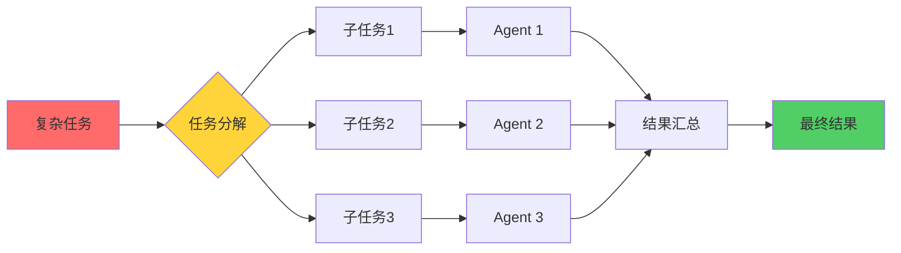

## 学习目标

完成本节学习后,你将：

- ✅ **理解协作模式的本质** - 掌握集中式、分布式等不同架构的设计理念
- ✅ **掌握主从式协作** - 理解有领导的团队如何高效工作
- ✅ **实现对等式协作** - 学会构建平等协作的智能体网络
- ✅ **理解联盟式协作** - 掌握动态组队和任务分配机制
- ✅ **选择合适的模式** - 根据实际场景做出正确的架构决策

## 多智能体系统基础

### 1. 核心概念

在深入协作模式之前,我们先理解什么是智能体（Agent）。一个智能体必须具备四个关键特性：

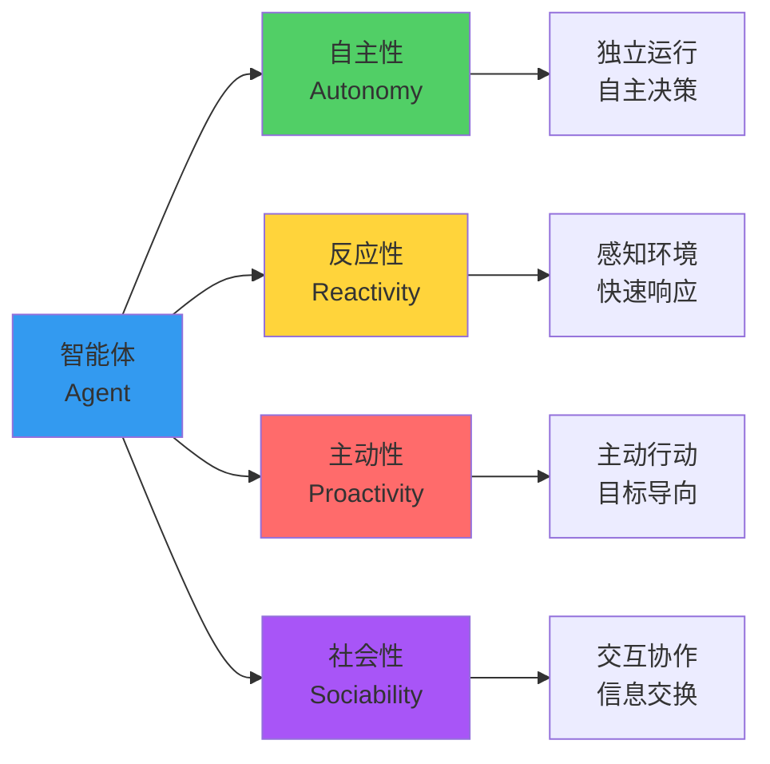

**设计理念**：把智能体想象成一个有思想的团队成员,他不仅能自己工作,还能与其他成员沟通协作。

### 2. 智能体的Java实现

我们使用抽象类定义智能体的基本结构：

```java
public abstract class Agent {
    protected String agentId;        // 唯一标识
    protected String name;           // 智能体名称
    protected AgentState state;      // 当前状态
    
    // 核心方法：子类必须实现
    public abstract void initialize();  
    public abstract AgentResponse processMessage(AgentMessage message);  
    public abstract void shutdown();
    
    // 通信能力
    public void sendMessage(AgentMessage message) { /* ... */ }
    public void receiveMessage(AgentMessage message) { /* ... */ }
}
```

**设计亮点**：
- **抽象类设计**：提供通用实现,减少重复代码
- **状态机模式**：便于跟踪智能体生命周期
- **消息式通信**：实现解耦,提高灵活性

### 3. 多智能体系统架构视图

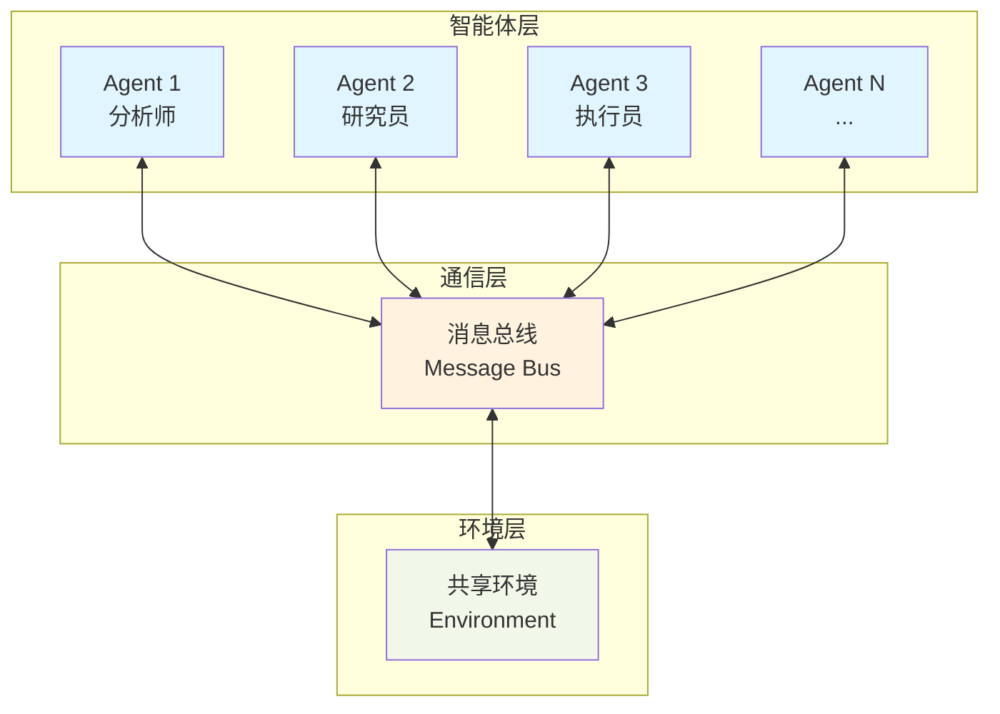

**架构说明**：
- **智能体层**：多个独立的智能体,各自执行不同任务
- **通信层**：消息总线负责路由和传递消息
- **环境层**：共享的数据和资源空间

---

## 一、集中式协作模式：指挥官式管理

### 1. 核心思想

集中式协作就像一个交响乐团,有一个指挥家统一协调所有音乐家的演奏。**中央控制器**负责：
- 任务分配：决定谁来做什么
- 负载均衡：确保工作量分配合理
- 状态监控：实时掌握每个智能体的情况

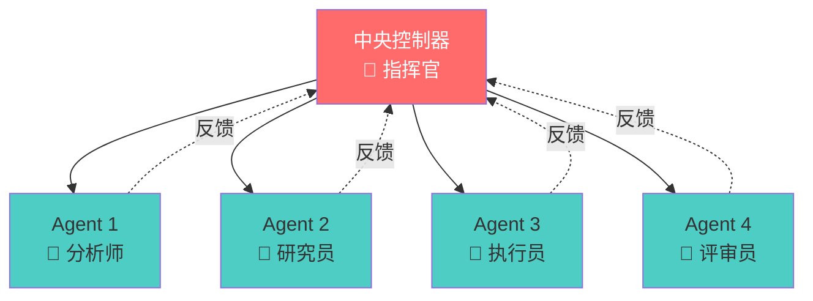

### 2. 优缺点分析

| 维度 | 优势 ✅ | 劣势 ❌ |
|------|---------|----------|
| **控制性** | 统一管理,逻辑清晰 | 中央故障导致系统失效 |
| **性能** | 没有通信开销,决策快 | 中央节点成为性能瓶颈 |
| **可维护性** | 集中管理,易于调试 | 逻辑集中,修改影响大 |
| **扩展性** | 添加智能体简单 | 难以水平扩展 |

### 3. 关键实现

```java
public class CentralizedMultiAgentSystem {
    private CentralController controller;        // 中央控制器
    private Map<String, Agent> agents;           // 智能体池
    
    public AgentResponse sendMessage(AgentMessage message) {
        // 所有消息都通过中央控制器路由
        return controller.routeMessage(message);
    }
}

class CentralController {
    private TaskScheduler taskScheduler;     // 任务调度
    private LoadBalancer loadBalancer;       // 负载均衡
    private SystemMonitor systemMonitor;     // 系统监控
    
    public AgentResponse routeMessage(AgentMessage message) {
        // 1. 选择最佳智能体
        String targetAgentId = loadBalancer.selectAgent(message);
        
        // 2. 创建任务
        Task task = taskScheduler.createTask(message, targetAgentId);
        
        // 3. 执行并监控
        AgentResponse response = executeTask(task);
        systemMonitor.recordTaskExecution(task, response);
        
        return response;
    }
}
```

**设计亮点**：
- **分离关注**：调度、均衡、监控各司其职
- **统一入口**：所有消息经过controller路由
- **可监控性**：记录所有任务执行情况

### 4. 适用场景

✅ **适合使用**：
- 智能体数量少（<20）
- 任务执行时间短
- 需要严格的任务优先级控制
- 需要集中监控和管理

❌ **不适合使用**：
- 大规模分布式系统
- 高可用性要求（单点故障风险）
- 智能体需要自主决策

---

## 二、分布式协作模式：自组织网络

### 1. 核心思想

分布式协作像一个自组织的社区,每个成员都有平等的地位,通过相互协商完成任务。没有中央控制器,智能体之间直接通信。

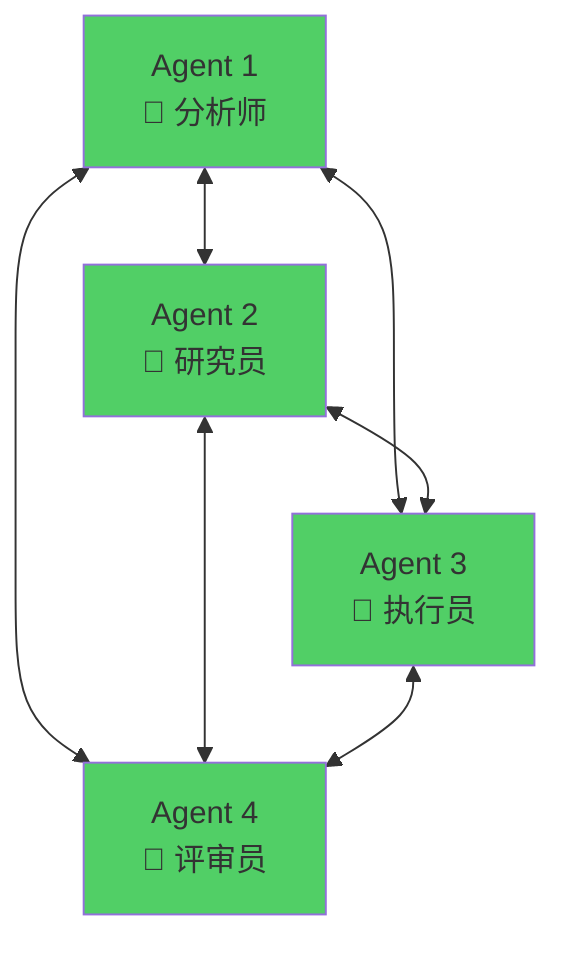

### 2. 优缺点对比

| 维度 | 优势 ✅ | 劣势 ❌ |
|------|---------|----------|
| **可靠性** | 无单点故障,高可用 | 协调复杂,可能冲突 |
| **扩展性** | 易于水平扩展 | 通信开销大 |
| **灵活性** | 智能体自主决策 | 全局优化困难 |
| **复杂度** | 局部逻辑简单 | 整体行为难预测 |

### 3. 关键组件

分布式系统的核心是**服务发现**和**消息路由**：

```java
public class DistributedMultiAgentSystem {
    private Map<String, Agent> agents;
    private DiscoveryService discoveryService;    // 服务发现
    private MessageRouter messageRouter;          // 消息路由
    
    public void sendMessage(AgentMessage message) {
        // 点对点直接通信
        messageRouter.routeMessage(message);
    }
}

class DiscoveryService {
    // 注册智能体
    public void registerAgent(Agent agent) { /* ... */ }
    
    // 发现具有特定能力的智能体
    public List<AgentInfo> discoverAgents(String capability) { /* ... */ }
}
```

**设计要点**：
- **服务发现**：智能体能找到合适的协作伙伴
- **点对点通信**：减少中介,提高效率
- **自主协商**：智能体自己决定如何协作

### 4. 消息路由机制

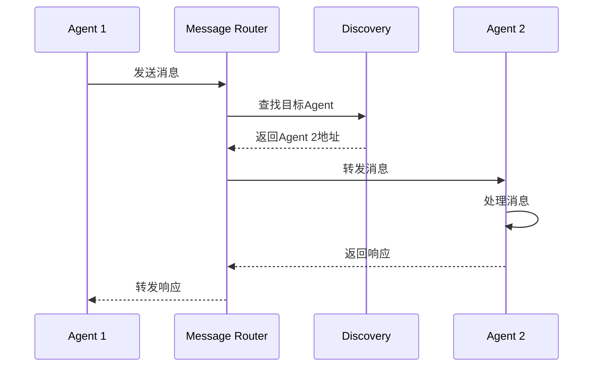

---

## 三、主从式协作模式：有领导的团队

### 1. 核心思想

主从式协作像一个有项目经理的开发团队。**主智能体（Master）** 负责任务分解和协调,**从智能体（Worker）** 执行具体工作。

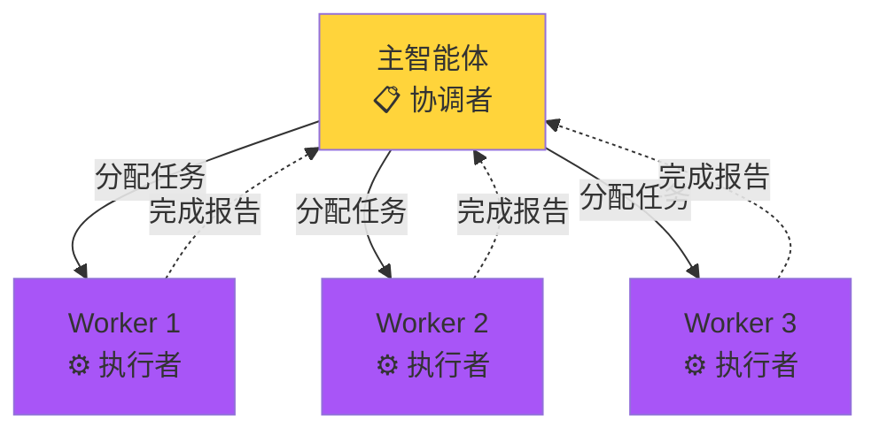

### 2. 工作流程

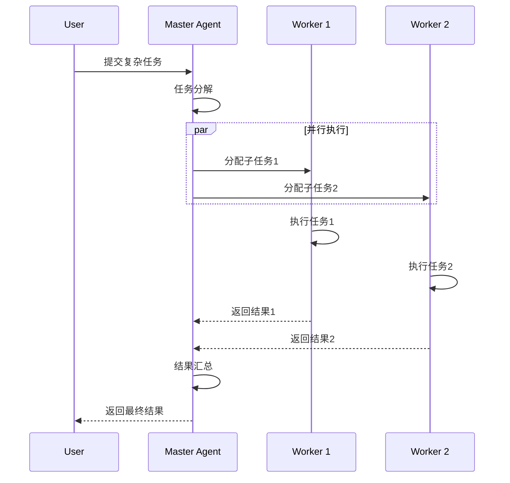

### 3. 核心实现

```java
class MasterAgent extends Agent {
    private List<Agent> workers;
    
    @Override
    public AgentResponse processMessage(AgentMessage message) {
        // 1. 任务分解
        List<SubTask> subTasks = decomposeTask(message);
        
        // 2. 并行分配
        List<CompletableFuture<AgentResponse>> futures = 
            subTasks.stream()
                   .map(task -> assignToWorker(task))
                   .collect(Collectors.toList());
        
        // 3. 等待完成
        CompletableFuture.allOf(futures.toArray(new CompletableFuture[0]))
                        .join();
        
        // 4. 结果汇总
        return aggregateResults(futures);
    }
    
    private CompletableFuture<AgentResponse> assignToWorker(SubTask task) {
        Worker worker = selectAvailableWorker();
        return worker.executeAsync(task);
    }
}
```

### 4. 适用场景

✅ **最佳实践**：
- Map-Reduce类型的任务
- 数据并行处理
- 需要结果汇总的场景

---

## 四、对等式协作模式：平等协商

### 1. 核心思想

对等式协作中,所有智能体地位平等,通过协商和投票做决策。类似于敏捷团队的站会。

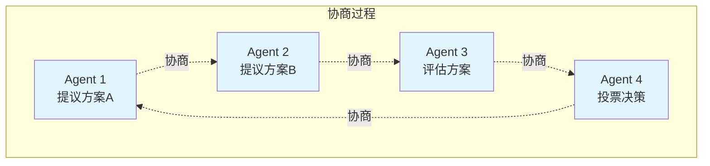

### 2. 共识算法

```java
class PeerAgent extends Agent {
    public ConsensusResult reachConsensus(Proposal proposal) {
        // 1. 广播提案
        broadcastProposal(proposal);
        
        // 2. 收集投票
        Map<String, Vote> votes = collectVotes(proposal.getId());
        
        // 3. 计算结果
        int agreeCount = (int) votes.values().stream()
            .filter(v -> v.isAgree())
            .count();
        
        // 4. 达成共识（超过2/3同意）
        return agreeCount > votes.size() * 2 / 3 
            ? ConsensusResult.AGREED 
            : ConsensusResult.REJECTED;
    }
}
```

---

## 五、联盟式协作模式：动态组队

### 1. 核心思想

智能体根据任务需求动态组建联盟,完成任务后解散。像是临时项目组。

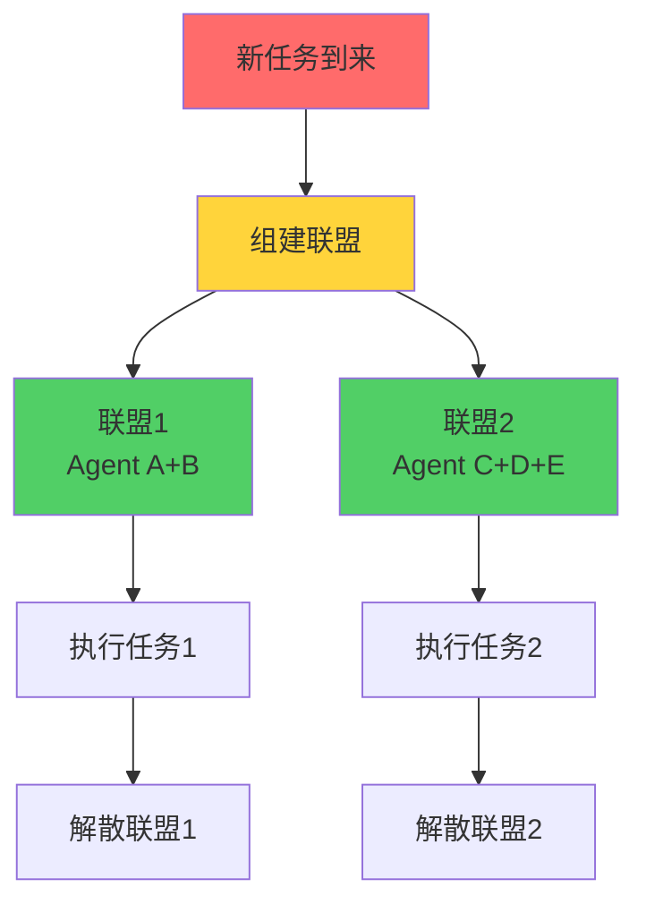

### 2. 联盟生命周期

```java
class CoalitionManager {
    public String formCoalition(Task task) {
        // 1. 分析任务需求
        Set<String> requiredCapabilities = analyzeTask(task);
        
        // 2. 选择合适的智能体
        List<Agent> candidates = findCapableAgents(requiredCapabilities);
        
        // 3. 创建联盟
        Coalition coalition = new Coalition(UUID.randomUUID().toString());
        candidates.forEach(coalition::addMember);
        
        // 4. 分配任务
        coalition.assignTask(task);
        
        return coalition.getId();
    }
}
```

---

## 协作模式选择指南

如何为你的应用选择合适的协作模式？参考以下决策树：

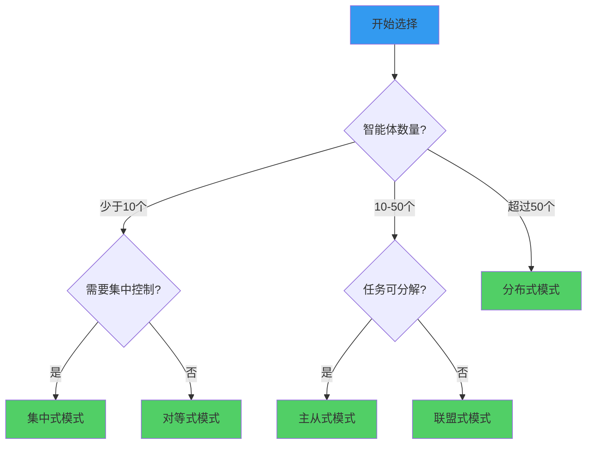

### 模式对比总结表

| 模式 | 适用规模 | 复杂度 | 可靠性 | 性能 | 最佳场景 |
|------|---------|--------|--------|------|---------|
| **集中式** | 小 | ⭐⭐ | ⭐⭐ | ⭐⭐⭐⭐ | 简单任务分配 |
| **分布式** | 大 | ⭐⭐⭐⭐ | ⭐⭐⭐⭐ | ⭐⭐⭐ | 大规模系统 |
| **主从式** | 中 | ⭐⭐⭐ | ⭐⭐⭐ | ⭐⭐⭐⭐ | 并行计算 |
| **对等式** | 中小 | ⭐⭐⭐ | ⭐⭐⭐ | ⭐⭐ | 需要共识决策 |
| **联盟式** | 中大 | ⭐⭐⭐⭐ | ⭐⭐⭐⭐ | ⭐⭐⭐ | 动态任务协作 |

---

## 实战案例：智能客服系统

让我们通过一个实际案例,看看如何应用这些协作模式。

### 系统架构

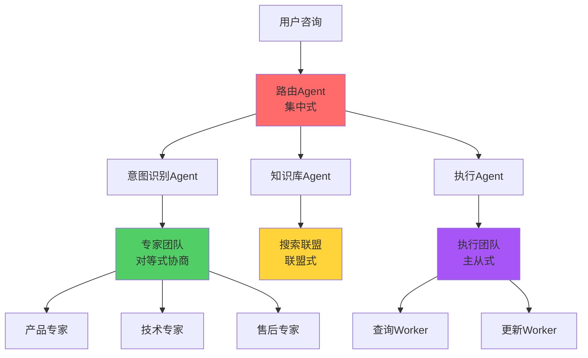

### 核心代码

```java
public class CustomerServiceSystem {
    private RouterAgent router;              // 集中式路由
    private PeerAgentGroup expertTeam;       // 对等式专家团队
    private MasterWorkerGroup actionTeam;    // 主从式执行团队
    
    public Response handleCustomerQuery(CustomerQuery query) {
        // 1. 路由到合适的处理链路
        ProcessingChain chain = router.route(query);
        
        // 2. 专家团队协商最佳方案
        Solution solution = expertTeam.consultAndDecide(query);
        
        // 3. 执行团队并行处理
        Result result = actionTeam.executeInParallel(solution);
        
        return buildResponse(result);
    }
}
```

---

## 本节小结

### 关键要点回顾

1. **协作模式本质**：选择合适的组织方式,让智能体高效协作
2. **没有银弹**：每种模式都有适用场景,需要权衡取舍
3. **可组合性**：实际系统往往混合使用多种模式
4. **设计原则**：
   - 低耦合：智能体之间松散连接
   - 高内聚：每个智能体职责单一
   - 可扩展：易于添加新的智能体
   - 可监控：能追踪系统运行状态

### 学习检查清单

- [ ] 能解释每种协作模式的核心思想
- [ ] 能分析不同模式的优缺点
- [ ] 能根据场景选择合适的模式
- [ ] 能实现基本的智能体协作系统
- [ ] 理解消息传递的重要性

### 进阶阅读

- 《Multi-Agent Systems》- Wooldridge
- 《Distributed Systems》- Tanenbaum
- TinyAI源码：`tinyai-agent-multi`模块

---

**下一节预告**：18.2 AI编程助手 - 我们将构建一个实际的Cursor风格编程助手,应用本节学到的协作模式。

