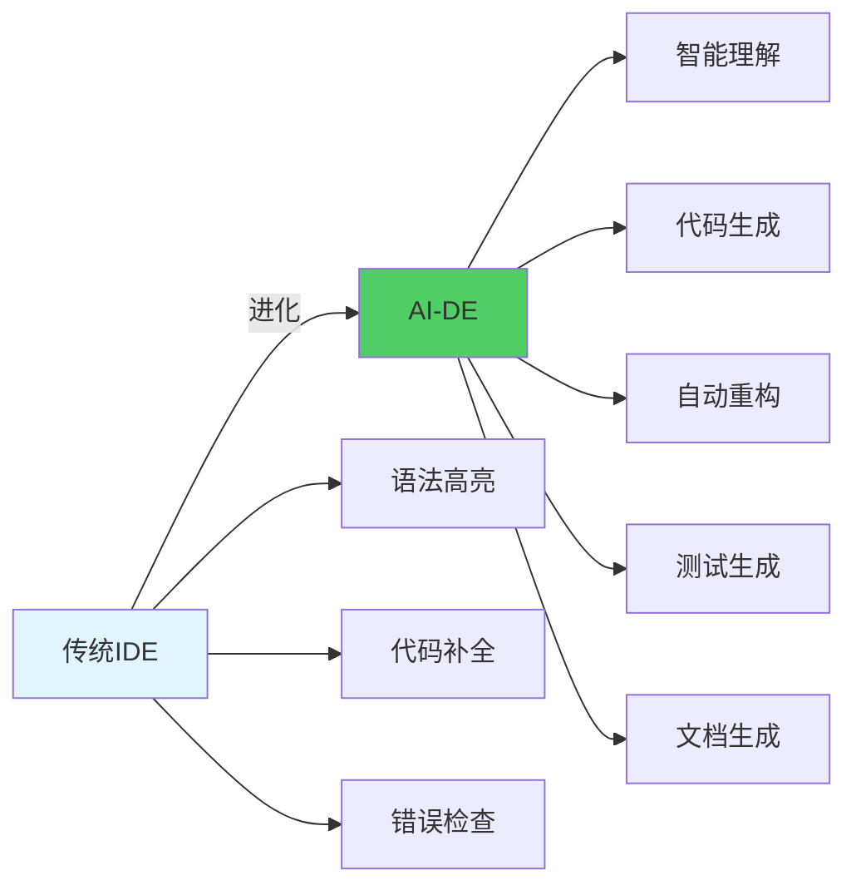
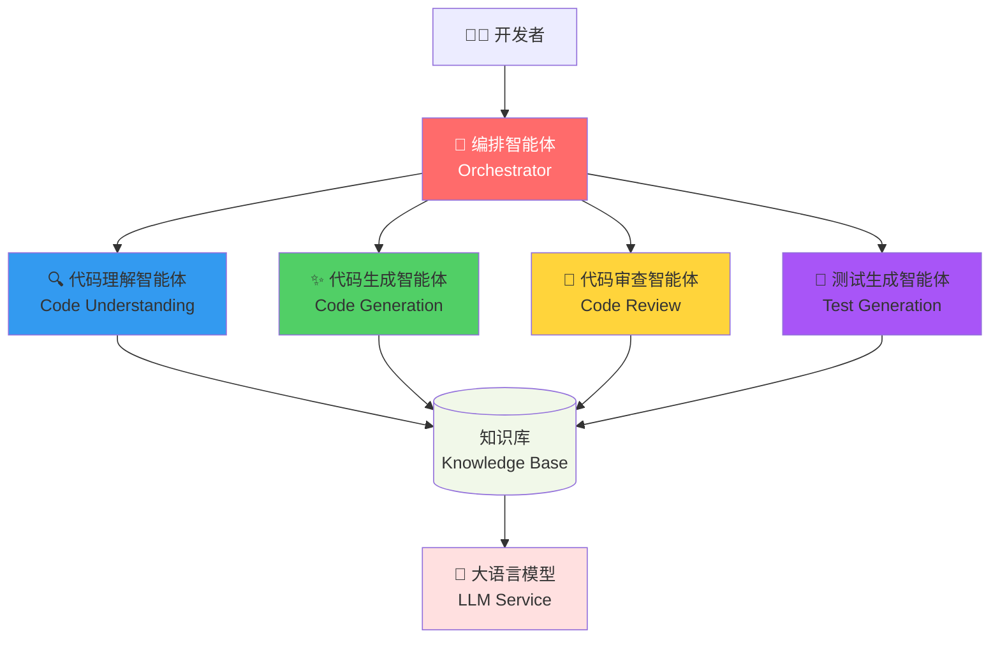
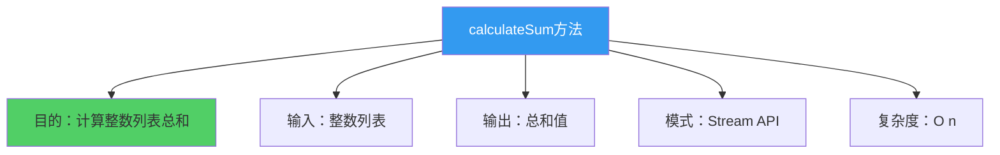
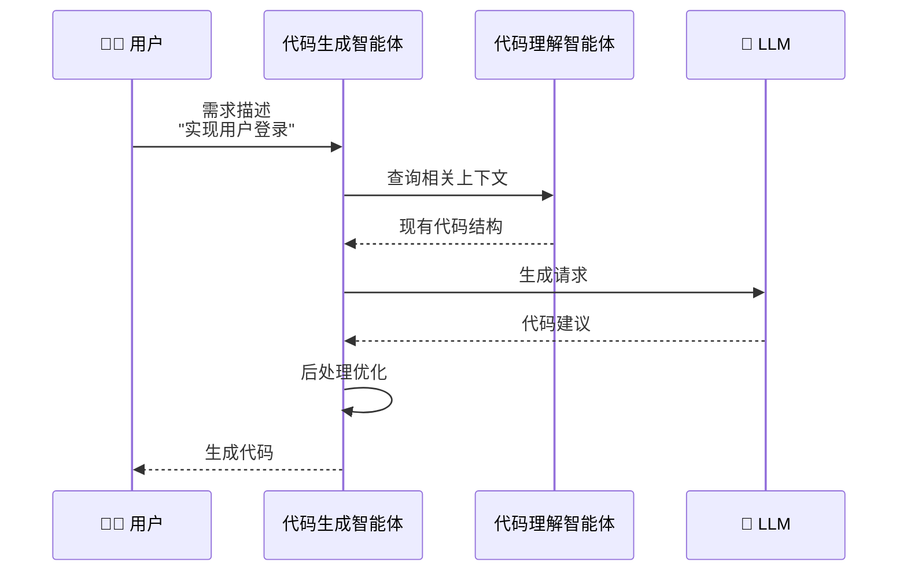
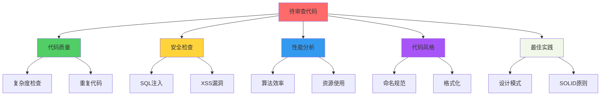
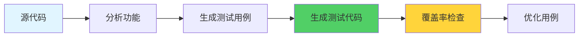
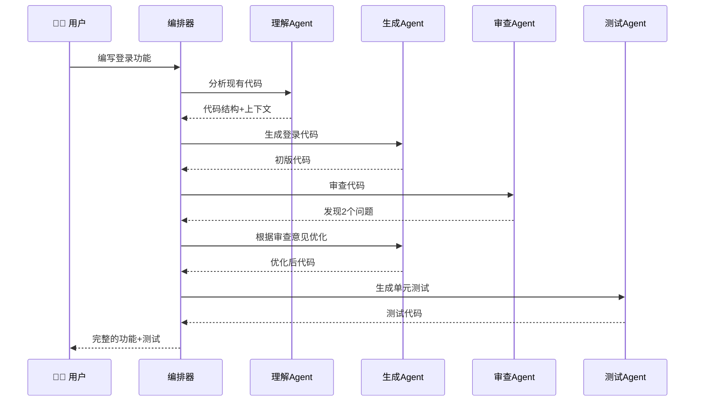
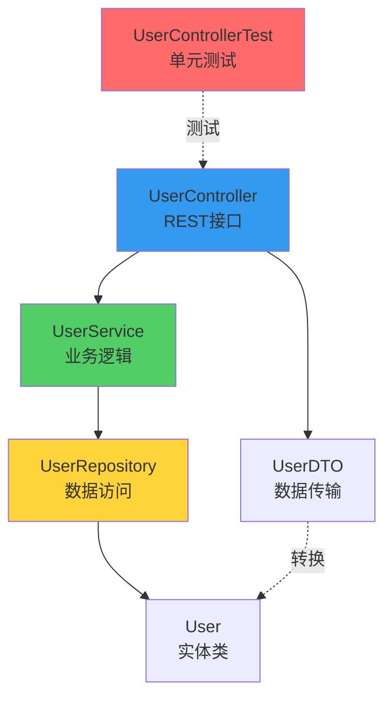
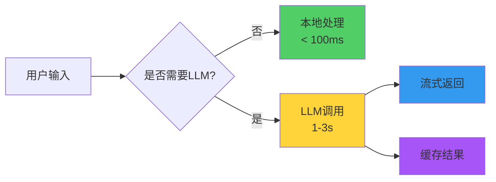
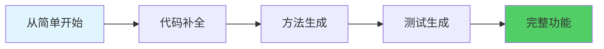

# 18.2 AI编程助手：Cursor智能体

> **设计思想**：AI编程助手不是替代程序员,而是成为程序员最好的搭档。通过多智能体协作,让AI理解代码、生成代码、审查代码,构建完整的编程辅助生态。

## 引言：从IDE到AI-DE

还记得第一次使用IDE的感受吗？自动补全、语法检查、快速重构...这些功能极大提升了开发效率。现在,**AI驱动的编程助手**将这一切提升到了新的高度：



**Cursor** 是这个领域的佼佼者。本节我们将剖析它的核心设计,并用Java实现一个类似的多智能体编程助手系统。

## 学习目标

完成本节学习后,你将能够：

- ✅ **设计编程助手架构** - 理解AI编程助手的核心组件设计
- ✅ **实现代码理解** - 构建能理解代码语义的智能体
- ✅ **开发代码生成** - 实现智能代码生成和重构
- ✅ **构建代码审查** - 开发自动化代码审查系统
- ✅ **掌握智能体协作** - 让多个智能体协同工作

---

## 系统架构设计

### 1. 整体架构

一个完整的AI编程助手需要多个专门智能体的协作：



**架构亮点**：
- **编排智能体**：中央协调器,负责任务分发
- **专业智能体**：各司其职,专注特定领域
- **知识库**：共享代码知识和上下文
- **LLM服务**：统一的AI能力接口

### 2. 核心智能体职责

| 智能体 | 核心能力 | 输入 | 输出 |
|--------|---------|------|------|
| **代码理解** | AST解析、语义分析 | 源代码 | 代码结构、依赖关系 |
| **代码生成** | 智能补全、代码生成 | 需求描述 | 代码实现 |
| **代码审查** | 质量检查、最佳实践 | 代码变更 | 问题报告、改进建议 |
| **测试生成** | 用例生成、覆盖分析 | 功能代码 | 测试代码 |

---

## 一、代码理解智能体

### 1. 核心功能

代码理解智能体是整个系统的基础,它需要：


### 2. 关键实现

```java
public class CodeUnderstandingAgent extends Agent {
    private CodeParser parser;           // 代码解析器
    private SemanticAnalyzer analyzer;   // 语义分析器
    private KnowledgeBase kb;            // 知识库
    
    @Override
    public AgentResponse processMessage(AgentMessage message) {
        CodeAnalysisRequest request = (CodeAnalysisRequest) message.getContent();
        
        // 1. 解析代码结构
        CodeAST ast = parser.parse(request.getCode());
        
        // 2. 语义分析
        SemanticInfo semantics = analyzer.analyze(ast);
        
        // 3. 存储到知识库
        kb.store(request.getFileId(), ast, semantics);
        
        // 4. 返回分析结果
        return createResponse(ast, semantics);
    }
}
```

### 3. 代码解析示例

以下是解析Java方法的示例：

```java
// 输入代码
public int calculateSum(List<Integer> numbers) {
    return numbers.stream()
                 .mapToInt(Integer::intValue)
                 .sum();
}

// 解析结果（简化）
CodeAST {
    type: METHOD,
    name: "calculateSum",
    returnType: "int",
    parameters: [
        { name: "numbers", type: "List<Integer>" }
    ],
    body: {
        type: STREAM_OPERATION,
        operations: ["stream", "mapToInt", "sum"]
    }
}
```

### 4. 语义分析结果



---

## 二、代码生成智能体

### 1. 工作流程

代码生成是最直观的AI能力：



### 2. 核心实现

```java
public class CodeGenerationAgent extends Agent {
    private LLMService llmService;
    private CodeFormatter formatter;
    private ContextBuilder contextBuilder;
    
    public GeneratedCode generateCode(GenerationRequest request) {
        // 1. 构建上下文
        CodeContext context = contextBuilder.build(
            request.getCurrentFile(),
            request.getCursorPosition()
        );
        
        // 2. 准备提示词
        String prompt = buildPrompt(
            request.getDescription(),
            context
        );
        
        // 3. 调用LLM
        String rawCode = llmService.complete(prompt);
        
        // 4. 格式化和优化
        return formatter.format(rawCode, context.getCodeStyle());
    }
    
    private String buildPrompt(String description, CodeContext context) {
        return String.format("""
            # 任务
            %s
            
            # 当前代码上下文
            ```java
            %s
            ```
            
            # 项目依赖
            %s
            
            # 代码风格
            %s
            
            请生成符合上述要求的Java代码。
            """,
            description,
            context.getSurroundingCode(),
            context.getDependencies(),
            context.getCodeStyle()
        );
    }
}
```

### 3. 生成示例

**用户输入**：
```
// 需求：实现一个线程安全的单例模式
```

**AI生成**：
```java
public class Singleton {
    private static volatile Singleton instance;
    private static final Object lock = new Object();
    
    private Singleton() {
        // 私有构造函数
    }
    
    public static Singleton getInstance() {
        if (instance == null) {
            synchronized (lock) {
                if (instance == null) {
                    instance = new Singleton();
                }
            }
        }
        return instance;
    }
}
```

**设计亮点**：
- ✅ 双重检查锁定模式
- ✅ volatile关键字保证可见性
- ✅ 符合Java代码规范

---

## 三、代码审查智能体

### 1. 审查维度

代码审查智能体从多个维度检查代码质量：



### 2. 实现要点

```java
public class CodeReviewAgent extends Agent {
    private QualityAnalyzer qualityAnalyzer;
    private SecurityScanner securityScanner;
    private PerformanceAnalyzer perfAnalyzer;
    
    public ReviewReport review(CodeChange change) {
        ReviewReport report = new ReviewReport();
        
        // 1. 质量检查
        report.addIssues(qualityAnalyzer.analyze(change));
        
        // 2. 安全扫描
        report.addIssues(securityScanner.scan(change));
        
        // 3. 性能分析
        report.addIssues(perfAnalyzer.analyze(change));
        
        // 4. 生成改进建议
        report.setSuggestions(generateSuggestions(report.getIssues()));
        
        return report;
    }
}
```

### 3. 审查报告示例

```markdown
## 代码审查报告

### ❌ 高优先级问题 (2)

1. **潜在的SQL注入风险** (Security)
   - 位置: UserDao.java:45
   - 问题: 直接拼接SQL语句
   - 建议: 使用PreparedStatement

2. **性能问题：循环中的数据库查询** (Performance)
   - 位置: UserService.java:78
   - 问题: N+1查询问题
   - 建议: 使用批量查询或JOIN

### ⚠️ 中优先级问题 (3)

3. **代码复杂度过高** (Quality)
   - 方法: processOrder()
   - 圈复杂度: 15 (建议<10)
   - 建议: 拆分为多个小方法

### ✅ 代码优点

- 命名清晰,遵循驼峰命名规范
- 适当的注释和文档
- 良好的异常处理
```

---

## 四、测试生成智能体

### 1. 测试生成流程



### 2. 核心实现

```java
public class TestGenerationAgent extends Agent {
    private LLMService llmService;
    private CoverageAnalyzer coverageAnalyzer;
    
    public TestSuite generateTests(SourceCode source) {
        // 1. 分析源代码
        List<TestableUnit> units = identifyTestableUnits(source);
        
        // 2. 为每个单元生成测试
        List<TestCase> testCases = units.stream()
            .map(this::generateTestCase)
            .collect(Collectors.toList());
        
        // 3. 检查覆盖率
        CoverageReport coverage = coverageAnalyzer.analyze(testCases);
        
        // 4. 补充缺失的测试
        if (coverage.getLineCoverage() < 0.8) {
            testCases.addAll(generateAdditionalTests(coverage));
        }
        
        return new TestSuite(testCases);
    }
}
```

### 3. 生成示例

**原始代码**：
```java
public class Calculator {
    public int divide(int a, int b) {
        if (b == 0) {
            throw new IllegalArgumentException("除数不能为0");
        }
        return a / b;
    }
}
```

**AI生成的测试**：
```java
@Test
public class CalculatorTest {
    private Calculator calculator;
    
    @BeforeEach
    void setUp() {
        calculator = new Calculator();
    }
    
    @Test
    @DisplayName("正常除法运算")
    void testDivideNormal() {
        assertEquals(2, calculator.divide(10, 5));
        assertEquals(-2, calculator.divide(10, -5));
    }
    
    @Test
    @DisplayName("除数为零抛出异常")
    void testDivideByZero() {
        assertThrows(IllegalArgumentException.class, 
            () -> calculator.divide(10, 0));
    }
    
    @Test
    @DisplayName("边界值测试")
    void testDivideBoundary() {
        assertEquals(1, calculator.divide(1, 1));
        assertEquals(0, calculator.divide(0, 1));
    }
}
```

**测试覆盖**：
- ✅ 正常路径
- ✅ 异常路径
- ✅ 边界值
- ✅ 覆盖率：100%

---

## 五、智能体协作机制

### 1. 典型工作流

一个完整的编程辅助场景：



### 2. 编排器实现

```java
public class CodingAssistantOrchestrator {
    private CodeUnderstandingAgent understandingAgent;
    private CodeGenerationAgent generationAgent;
    private CodeReviewAgent reviewAgent;
    private TestGenerationAgent testAgent;
    
    public CodingResult assistCoding(CodingRequest request) {
        CodingResult result = new CodingResult();
        
        // 第1步：理解上下文
        CodeContext context = understandingAgent.analyze(
            request.getCurrentFile(),
            request.getCursorPosition()
        );
        
        // 第2步：生成代码（可能多次迭代）
        GeneratedCode code = null;
        ReviewReport review = null;
        int maxIterations = 3;
        
        for (int i = 0; i < maxIterations; i++) {
            // 生成代码
            code = generationAgent.generate(request, context);
            
            // 审查代码
            review = reviewAgent.review(code);
            
            // 如果没有严重问题，跳出循环
            if (!review.hasCriticalIssues()) {
                break;
            }
            
            // 根据审查意见优化
            request = request.withReviewFeedback(review);
        }
        
        // 第3步：生成测试
        TestSuite tests = testAgent.generateTests(code);
        
        // 第4步：组装结果
        result.setCode(code);
        result.setTests(tests);
        result.setReview(review);
        
        return result;
    }
}
```

---

## 实战案例：实现RESTful API

让我们看一个完整的例子：用AI助手实现一个用户管理API。

### 1. 用户需求

```java
// 用户输入
/**
 * 实现用户管理的RESTful API
 * 需求：
 * 1. 创建用户（POST /users）
 * 2. 查询用户（GET /users/{id}）  
 * 3. 更新用户（PUT /users/{id}）
 * 4. 删除用户（DELETE /users/{id}）
 * 
 * 要求：
 * - 使用Spring Boot
 * - 参数校验
 * - 异常处理
 * - 包含单元测试
 */
```

### 2. AI生成的代码结构



### 3. 生成的代码片段

```java
@RestController
@RequestMapping("/api/users")
@Validated
public class UserController {
    private final UserService userService;
    
    @PostMapping
    public ResponseEntity<UserDTO> createUser(
            @Valid @RequestBody UserCreateRequest request) {
        User user = userService.createUser(request);
        return ResponseEntity.status(HttpStatus.CREATED)
                           .body(UserDTO.from(user));
    }
    
    @GetMapping("/{id}")
    public ResponseEntity<UserDTO> getUser(@PathVariable Long id) {
        return userService.findById(id)
                         .map(UserDTO::from)
                         .map(ResponseEntity::ok)
                         .orElse(ResponseEntity.notFound().build());
    }
    
    // ... 其他方法
}
```

### 4. 自动生成的测试

```java
@WebMvcTest(UserController.class)
class UserControllerTest {
    @Autowired
    private MockMvc mockMvc;
    
    @MockBean
    private UserService userService;
    
    @Test
    @DisplayName("创建用户 - 成功场景")
    void createUser_Success() throws Exception {
        // Given
        UserCreateRequest request = new UserCreateRequest("test@example.com", "Test User");
        User mockUser = new User(1L, "test@example.com", "Test User");
        when(userService.createUser(any())).thenReturn(mockUser);
        
        // When & Then
        mockMvc.perform(post("/api/users")
                .contentType(MediaType.APPLICATION_JSON)
                .content(objectMapper.writeValueAsString(request)))
            .andExpect(status().isCreated())
            .andExpect(jsonPath("$.id").value(1))
            .andExpect(jsonPath("$.email").value("test@example.com"));
    }
    
    // ... 更多测试用例
}
```

---

## 性能优化与最佳实践

### 1. 响应速度优化



**优化策略**：
- **本地优先**：简单任务（如格式化）不调用LLM
- **流式返回**：生成代码时逐行显示,提升体验
- **智能缓存**：相似请求复用结果

### 2. 上下文管理

```java
public class ContextManager {
    private static final int MAX_CONTEXT_LINES = 100;
    
    public CodeContext buildContext(String fileId, int cursorLine) {
        // 1. 当前文件上下文（优先级最高）
        List<String> currentFile = getRelevantLines(fileId, cursorLine, 50);
        
        // 2. 相关文件（import的类）
        List<String> relatedFiles = getRelatedFiles(fileId, 30);
        
        // 3. 项目全局信息（依赖、配置）
        ProjectInfo projectInfo = getProjectInfo(20);
        
        // 4. 组装并限制总长度
        return buildContext(currentFile, relatedFiles, projectInfo);
    }
}
```

### 3. 错误处理

```java
public class RobustGenerationAgent extends CodeGenerationAgent {
    @Override
    public GeneratedCode generate(GenerationRequest request) {
        try {
            return super.generate(request);
        } catch (LLMTimeoutException e) {
            // 降级策略：使用模板
            return generateFromTemplate(request);
        } catch (InvalidCodeException e) {
            // 重试策略：简化提示词
            return generateWithSimplifiedPrompt(request);
        }
    }
}
```

---

## 本节小结

### 关键要点

1. **分层设计**：理解→生成→审查→测试,各司其职
2. **智能编排**：通过编排器协调多个智能体
3. **上下文为王**：准确的上下文是生成质量的关键
4. **迭代优化**：生成后审查,有问题再优化
5. **人机协作**：AI辅助而非替代,最终决策权在人

### 学习检查清单

- [ ] 理解AI编程助手的整体架构
- [ ] 能实现代码理解智能体
- [ ] 能实现代码生成智能体  
- [ ] 能实现代码审查智能体
- [ ] 能实现测试生成智能体
- [ ] 理解智能体协作机制

### 进阶方向

- 🚀 **支持更多语言**：Python、JavaScript、Go等
- 🚀 **代码重构**：自动识别和应用重构模式
- 🚀 **智能问答**：回答代码相关问题
- 🚀 **Bug修复**：自动定位和修复bug

### 实践建议



---

**下一节预告**：18.3 手稿智能体 - 我们将构建一个文档理解与生成系统,让AI成为你的写作助手。

**参考资源**：
- TinyAI源码：`tinyai-agent-cursor`模块
- Cursor官方文档
- GitHub Copilot技术博客
