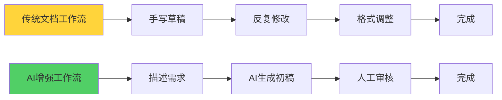
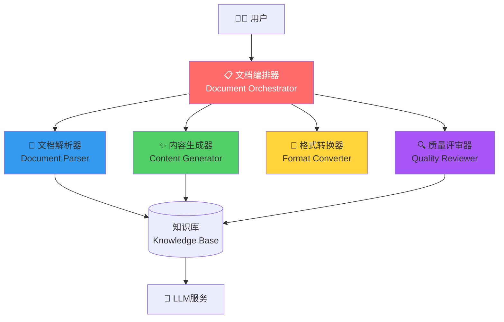
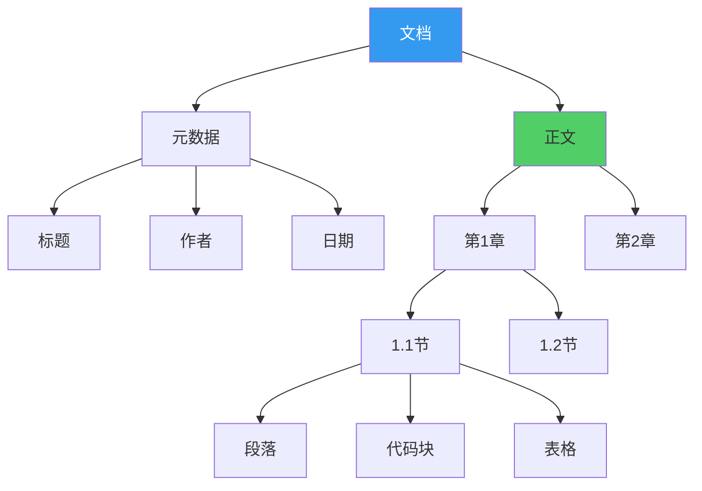
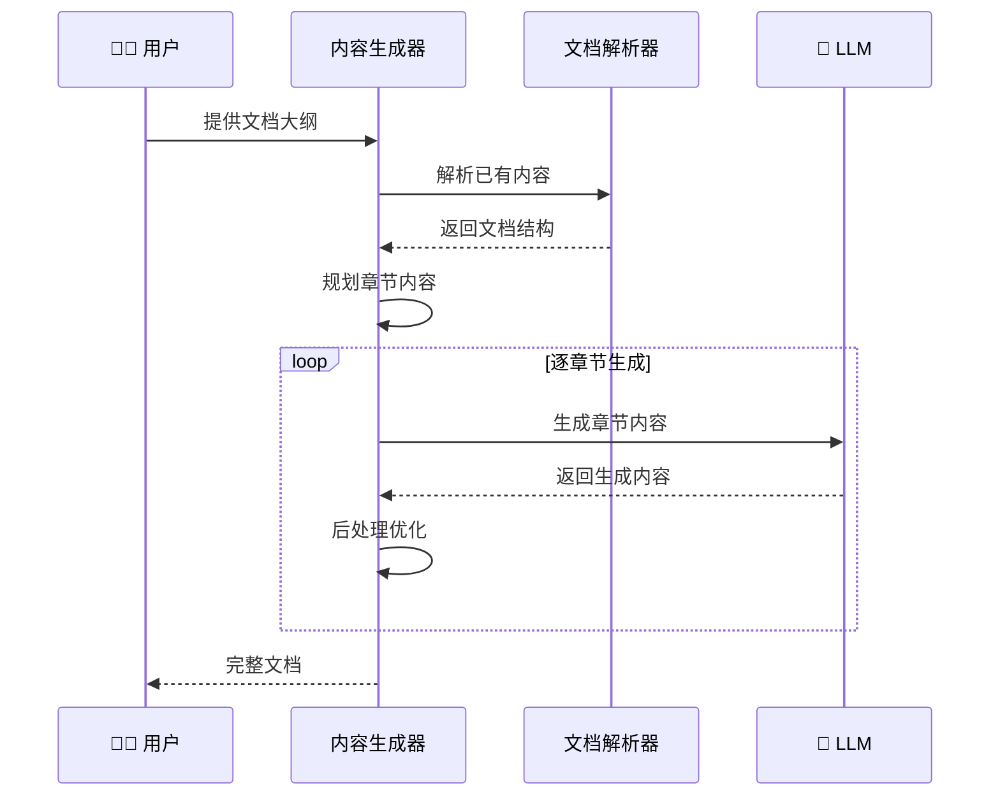
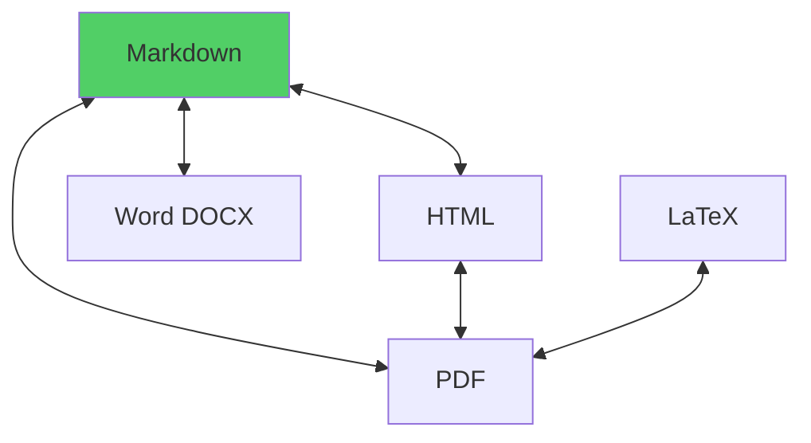
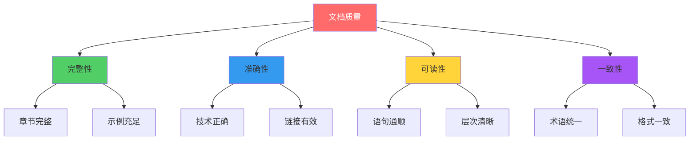
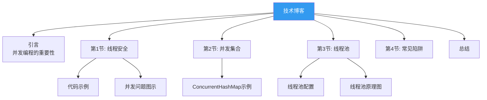
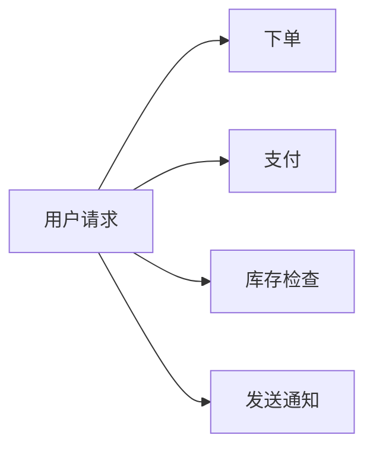
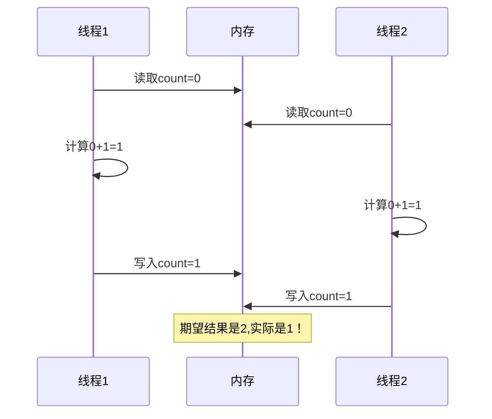
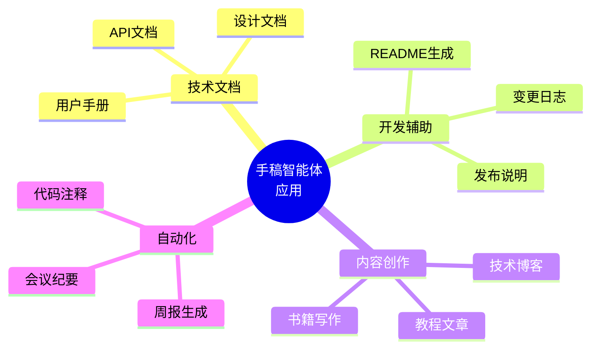

# 18.3 手稿智能体：文档理解与生成

> **设计思想**：好的文档是软件的第二生命。手稿智能体不仅能读懂文档,还能创作文档,成为技术写作的得力助手。

## 引言：从Word到AI Writer

写文档常常是程序员最头疼的事：
- 📝 项目文档总是过时
- 📊 设计文档写得太简略
- 📚 API文档缺少示例
- ✍️ 技术博客不知道怎么开头

**手稿智能体（Manuscript Agent）** 要解决的就是这些痛点。它能理解技术文档的结构和内容,还能生成高质量的文档。



## 学习目标

完成本节学习后,你将能够：

- ✅ **设计文档智能体架构** - 理解文档处理系统的核心组件
- ✅ **实现文档解析** - 构建能理解各种文档格式的解析器
- ✅ **开发内容生成** - 实现智能文档生成功能
- ✅ **构建格式转换** - 支持Markdown、HTML、PDF等多种格式
- ✅ **实现质量评估** - 自动检查文档质量和完整性

---

## 系统架构设计

### 1. 整体架构



### 2. 核心智能体职责

| 智能体 | 主要功能 | 输入 | 输出 |
|--------|---------|------|------|
| **文档解析器** | 提取结构和内容 | 原始文档 | 文档AST |
| **内容生成器** | 创作文档内容 | 大纲/需求 | 完整内容 |
| **格式转换器** | 多格式转换 | 源格式文档 | 目标格式文档 |
| **质量评审器** | 检查文档质量 | 文档内容 | 质量报告 |

---

## 一、文档解析智能体

### 1. 文档结构理解

不同于代码,文档有自己的结构层次：



### 2. Markdown解析示例

```java
public class MarkdownParser {
    public DocumentAST parse(String markdown) {
        DocumentAST ast = new DocumentAST();
        
        // 1. 解析元数据
        ast.setMetadata(extractMetadata(markdown));
        
        // 2. 解析标题层次
        ast.setHeadings(extractHeadings(markdown));
        
        // 3. 解析内容块
        ast.setBlocks(extractBlocks(markdown));
        
        return ast;
    }
    
    private List<Heading> extractHeadings(String markdown) {
        List<Heading> headings = new ArrayList<>();
        Pattern pattern = Pattern.compile("^(#{1,6})\\s+(.+)$", Pattern.MULTILINE);
        Matcher matcher = pattern.matcher(markdown);
        
        while (matcher.find()) {
            int level = matcher.group(1).length();
            String text = matcher.group(2);
            headings.add(new Heading(level, text));
        }
        
        return headings;
    }
}
```

### 3. 文档AST结构

```java
public class DocumentAST {
    private Metadata metadata;           // 文档元数据
    private List<Heading> headings;      // 标题结构
    private List<ContentBlock> blocks;   // 内容块
    private Map<String, Link> links;     // 链接索引
    
    // 提取关键信息
    public List<String> getKeywords() {
        // 从标题和内容中提取关键词
    }
    
    public String getSummary() {
        // 生成文档摘要
    }
}
```

---

## 二、内容生成智能体

### 1. 生成工作流



### 2. 核心实现

```java
public class ContentGenerationAgent extends Agent {
    private LLMService llmService;
    private TemplateEngine templateEngine;
    
    public Document generateDocument(DocumentOutline outline) {
        Document doc = new Document();
        
        // 1. 生成标题和摘要
        doc.setTitle(generateTitle(outline));
        doc.setSummary(generateSummary(outline));
        
        // 2. 逐章节生成
        for (ChapterOutline chapter : outline.getChapters()) {
            Chapter generatedChapter = generateChapter(chapter);
            doc.addChapter(generatedChapter);
        }
        
        // 3. 生成结论
        doc.setConclusion(generateConclusion(doc));
        
        return doc;
    }
    
    private Chapter generateChapter(ChapterOutline outline) {
        Chapter chapter = new Chapter(outline.getTitle());
        
        // 构建提示词
        String prompt = buildChapterPrompt(outline);
        
        // 调用LLM生成
        String content = llmService.generate(prompt);
        
        // 解析并结构化
        chapter.setContent(parseGeneratedContent(content));
        
        return chapter;
    }
}
```

### 3. 提示词工程

好的提示词是生成质量的关键：

```java
private String buildChapterPrompt(ChapterOutline outline) {
    return String.format("""
        # 任务
        为技术文档生成章节内容
        
        # 章节信息
        - 标题: %s
        - 关键点: %s
        - 目标受众: %s
        
        # 写作要求
        1. 通俗易懂,深入浅出
        2. 包含代码示例
        3. 使用Mermaid图表辅助说明
        4. 每个概念先解释"为什么",再讲"怎么做"
        
        # 期望长度
        800-1200字
        
        请生成符合上述要求的章节内容。
        """,
        outline.getTitle(),
        String.join(", ", outline.getKeyPoints()),
        outline.getAudience()
    );
}
```

---

## 三、格式转换智能体

### 1. 多格式支持



### 2. 转换实现

```java
public class FormatConverterAgent extends Agent {
    private Map<FormatPair, Converter> converters;
    
    public Document convert(Document source, DocumentFormat targetFormat) {
        DocumentFormat sourceFormat = source.getFormat();
        FormatPair pair = new FormatPair(sourceFormat, targetFormat);
        
        Converter converter = converters.get(pair);
        if (converter == null) {
            // 尝试间接转换（如MD -> HTML -> PDF）
            return convertIndirect(source, targetFormat);
        }
        
        return converter.convert(source);
    }
}

// Markdown转HTML示例
public class MarkdownToHtmlConverter implements Converter {
    @Override
    public Document convert(Document markdown) {
        String md = markdown.getContent();
        
        // 使用成熟的Markdown处理库
        Parser parser = Parser.builder().build();
        Node document = parser.parse(md);
        
        HtmlRenderer renderer = HtmlRenderer.builder()
            .extensions(List.of(
                TablesExtension.create(),
                StrikethroughExtension.create()
            ))
            .build();
        
        String html = renderer.render(document);
        
        return new Document(html, DocumentFormat.HTML);
    }
}
```

---

## 四、质量评审智能体

### 1. 评审维度



### 2. 质量检查实现

```java
public class QualityReviewerAgent extends Agent {
    public QualityReport review(Document doc) {
        QualityReport report = new QualityReport();
        
        // 1. 完整性检查
        report.addIssues(checkCompleteness(doc));
        
        // 2. 准确性检查
        report.addIssues(checkAccuracy(doc));
        
        // 3. 可读性检查
        report.addIssues(checkReadability(doc));
        
        // 4. 一致性检查
        report.addIssues(checkConsistency(doc));
        
        // 5. 计算总分
        report.calculateScore();
        
        return report;
    }
    
    private List<Issue> checkCompleteness(Document doc) {
        List<Issue> issues = new ArrayList<>();
        
        // 检查是否有目录
        if (doc.getTableOfContents() == null) {
            issues.add(new Issue(
                IssueSeverity.MEDIUM,
                "缺少目录",
                "建议添加文档目录以提升可读性"
            ));
        }
        
        // 检查代码示例
        if (doc.getCodeBlocks().size() < 3) {
            issues.add(new Issue(
                IssueSeverity.LOW,
                "代码示例较少",
                "建议添加更多代码示例帮助理解"
            ));
        }
        
        return issues;
    }
}
```

### 3. 质量报告示例

```markdown
## 文档质量报告

### 总体评分: 85/100 ⭐⭐⭐⭐

### ❌ 高优先级问题 (0)
无

### ⚠️ 中优先级问题 (2)

1. **章节3.2缺少代码示例**
   - 位置: 第3章第2节
   - 建议: 添加实际代码展示概念

2. **术语不一致**
   - "智能体" vs "Agent" 混用
   - 建议: 统一使用中文术语

### ℹ️ 低优先级问题 (3)

3. **图表可以更丰富**
   - 可以添加架构图和流程图
   
4. **缺少总结部分**
   - 建议在章节末尾添加小结

5. **外部链接未检查**
   - 部分链接可能失效

### ✅ 文档优点

- ✓ 结构清晰,层次分明
- ✓ 语言通俗易懂
- ✓ 有实际应用案例
- ✓ 排版美观
```

---

## 五、实战案例：技术博客生成

### 1. 需求描述

用户想写一篇关于"Java并发编程最佳实践"的技术博客：

```java
BlogRequest request = BlogRequest.builder()
    .topic("Java并发编程最佳实践")
    .audience("中高级Java开发者")
    .length("3000-4000字")
    .includeSections(List.of(
        "线程安全", 
        "并发集合",
        "线程池使用",
        "常见陷阱"
    ))
    .includeCode(true)
    .includeDiagrams(true)
    .build();
```

### 2. 生成的文档结构



### 3. 生成的内容片段

```markdown
## 引言：为什么并发编程如此重要

在现代应用中，单线程已无法满足性能需求。想象一个电商网站：



如果这些操作串行执行，用户体验会很差。**并发编程让我们可以同时处理多个任务**。

## 第1节：线程安全的本质

### 什么是线程安全？

线程安全的定义很简单：**当多个线程访问同一个对象时,如果不需要额外的同步措施,程序的行为总是正确的。**

### 经典案例：计数器

```java
// ❌ 不安全的实现
public class UnsafeCounter {
    private int count = 0;
    
    public void increment() {
        count++;  // 非原子操作！
    }
}

// ✅ 安全的实现
public class SafeCounter {
    private AtomicInteger count = new AtomicInteger(0);
    
    public void increment() {
        count.incrementAndGet();  // 原子操作
    }
}
```

### 为什么会不安全？

`count++` 实际包含三个步骤：



... (继续生成其他章节)
```

---

## 性能优化与最佳实践

### 1. 增量生成

对于长文档,采用增量生成策略：

```java
public class IncrementalGenerator {
    public void generateLongDocument(DocumentOutline outline, OutputStream output) {
        // 逐章节生成并写入
        for (ChapterOutline chapter : outline.getChapters()) {
            Chapter generated = generateChapter(chapter);
            output.write(formatChapter(generated));
            output.flush();  // 立即输出,提升体验
        }
    }
}
```

### 2. 模板复用

常见文档类型使用模板加速：

```java
public class TemplateManager {
    private Map<DocumentType, Template> templates;
    
    public Document generateFromTemplate(DocumentType type, Map<String, Object> data) {
        Template template = templates.get(type);
        return template.render(data);
    }
}

// 支持的模板类型
enum DocumentType {
    API_REFERENCE,      // API文档模板
    TUTORIAL,           // 教程模板
    DESIGN_DOC,         // 设计文档模板
    BLOG_POST,          // 博客文章模板
    README              // README模板
}
```

### 3. 协作编辑

多人协作时的冲突处理：

```java
public class CollaborativeEditor {
    public Document mergeChanges(Document base, List<DocumentChange> changes) {
        // 使用操作转换(OT)或CRDT算法
        Document result = base.clone();
        
        for (DocumentChange change : changes) {
            try {
                result = applyChange(result, change);
            } catch (ConflictException e) {
                // 标记冲突供人工解决
                result.markConflict(change);
            }
        }
        
        return result;
    }
}
```

---

## 本节小结

### 关键要点

1. **文档=结构+内容**：理解文档结构是处理的基础
2. **提示词工程**：好的提示词决定生成质量  
3. **质量优先**：自动检查确保文档质量
4. **格式灵活**：支持多种输出格式
5. **人机协作**：AI辅助创作,人工审核把关

### 学习检查清单

- [ ] 理解文档AST结构
- [ ] 能解析常见文档格式
- [ ] 能使用LLM生成文档内容
- [ ] 能实现格式转换
- [ ] 能评估文档质量

### 应用场景



---

**下一节预告**：18.4 深度研究智能体 - 构建知识发现系统,让AI帮你做文献调研和趋势分析。

**实践建议**：
1. 从简单的README生成开始
2. 逐步扩展到技术博客
3. 最后尝试完整的技术文档

**参考资源**：
- TinyAI源码：`tinyai-agent-manus`模块
- Markdown规范
- Pandoc文档转换工具
