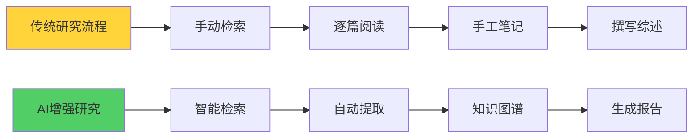
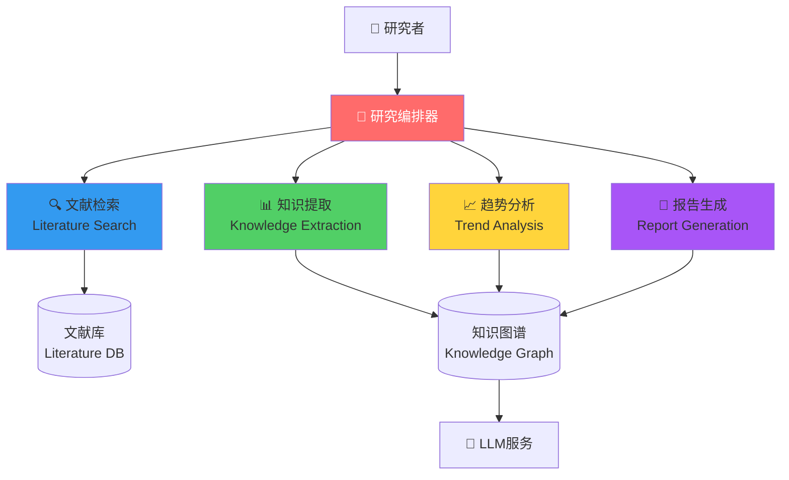
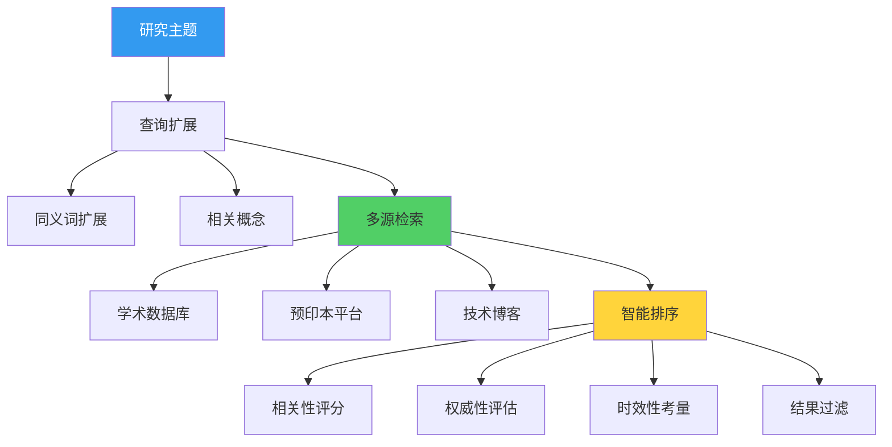
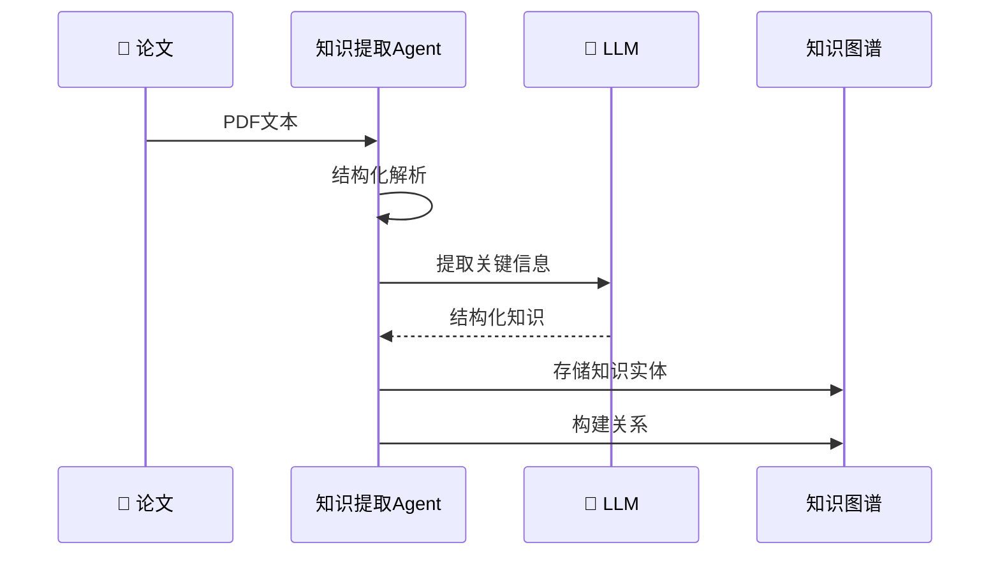
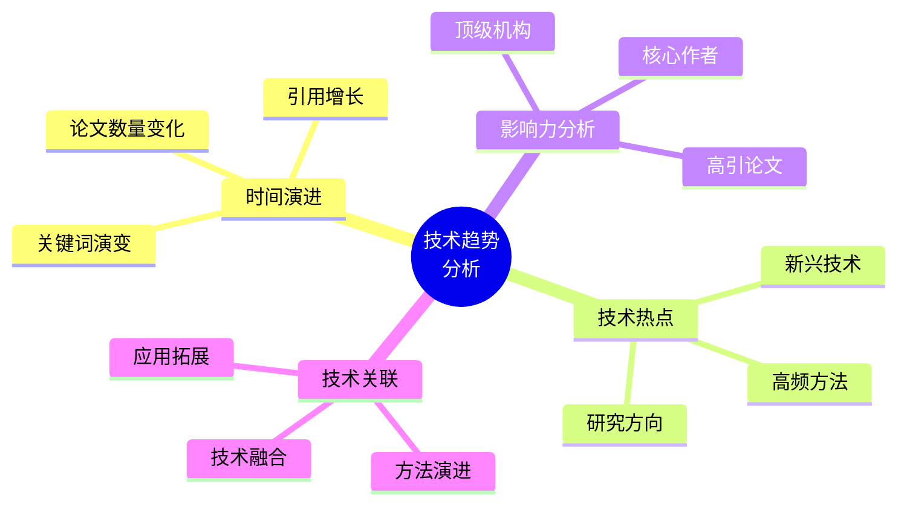
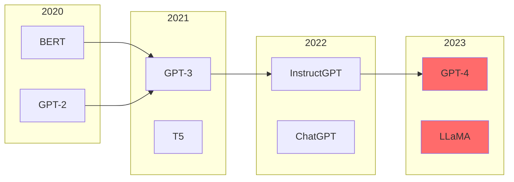
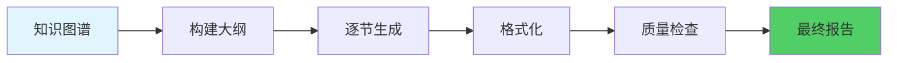
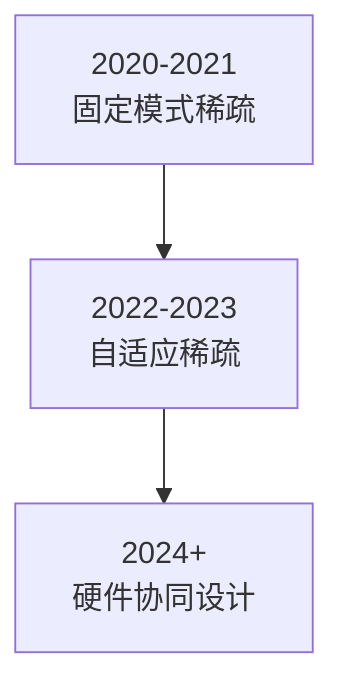
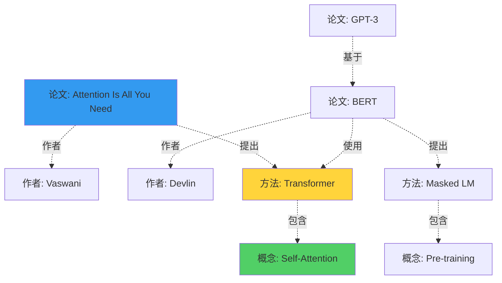
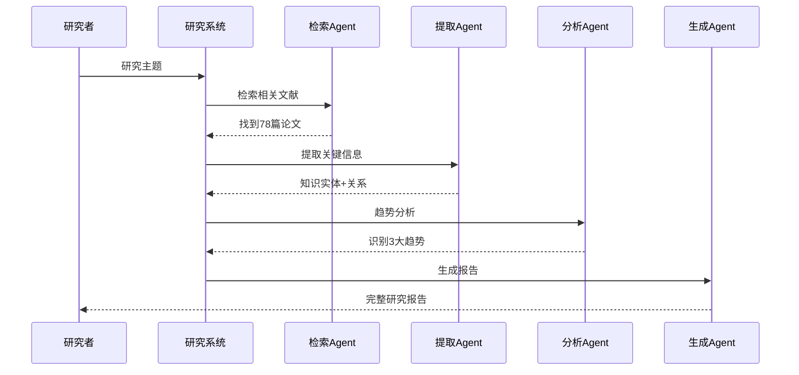

# 18.4 深度研究智能体：知识发现系统

> **设计思想**：在信息爆炸的时代,研究不再是单打独斗。深度研究智能体能帮你阅读海量文献、提取关键见解、发现研究趋势,成为科研的得力助手。

## 引言：从Google Scholar到AI Research Assistant

做技术研究时,你是否遇到过：
- 📚 相关论文太多,读不过来
- 🔍 关键信息分散,难以整合
- 📈 技术趋势不clear,方向难选
- ✍️ 文献综述费时费力

**深度研究智能体（Research Agent）** 就是为解决这些问题而生。



## 学习目标

- ✅ **构建文献检索系统** - 智能搜索和过滤相关文献
- ✅ **实现知识提取** - 从文献中提取关键信息
- ✅ **开发趋势分析** - 识别技术发展趋势
- ✅ **生成研究报告** - 自动撰写文献综述

---

## 系统架构



---

## 一、文献检索智能体

### 1. 智能检索策略



### 2. 核心实现

```java
public class LiteratureSearchAgent extends Agent {
    private QueryExpander queryExpander;
    private MultiSourceSearcher searcher;
    private RelevanceRanker ranker;
    
    public SearchResult search(ResearchQuery query) {
        // 1. 查询扩展
        ExpandedQuery expanded = queryExpander.expand(query);
        
        // 2. 多源检索
        List<Paper> papers = searcher.searchAll(expanded);
        
        // 3. 智能排序
        List<Paper> ranked = ranker.rank(papers, query);
        
        // 4. 去重过滤
        return deduplicate(ranked);
    }
}
```

### 3. 检索示例

```java
// 用户查询
ResearchQuery query = new ResearchQuery()
    .topic("Transformer模型优化")
    .timeRange(2020, 2024)
    .maxResults(50);

// 查询扩展结果
{
  "original": "Transformer模型优化",
  "expanded": [
    "Transformer optimization",
    "efficient transformers",
    "模型压缩", 
    "知识蒸馏",
    "sparse attention"
  ]
}

// 检索结果（简化）
[
  {
    "title": "Efficient Transformers: A Survey",
    "authors": ["Yi Tay", "..."],
    "year": 2023,
    "citations": 856,
    "relevance": 0.95
  },
  ...
]
```

---

## 二、知识提取智能体

### 1. 提取流程



### 2. 提取的知识类型

```java
public class ExtractedKnowledge {
    // 基本信息
    private String title;
    private List<String> authors;
    private String publishYear;
    
    // 核心内容
    private String problemStatement;    // 研究问题
    private String methodology;         // 方法论
    private List<String> keyFindings;   // 关键发现
    private List<String> contributions; // 主要贡献
    
    // 技术细节
    private List<String> algorithms;    // 算法
    private List<String> datasets;      // 数据集
    private Map<String, Double> metrics; // 性能指标
    
    // 关联信息
    private List<String> relatedWorks;  // 相关工作
    private List<String> limitations;   // 局限性
    private List<String> futureWork;    // 未来方向
}
```

### 3. LLM提示词

```java
private String buildExtractionPrompt(Paper paper) {
    return String.format("""
        请从以下论文中提取关键信息：
        
        # 论文标题
        %s
        
        # 摘要
        %s
        
        # 提取任务
        请提取以下信息（JSON格式）：
        1. problemStatement: 研究要解决的核心问题
        2. methodology: 采用的方法（简述）
        3. keyFindings: 3-5个主要发现
        4. contributions: 2-3个主要贡献
        5. limitations: 存在的局限性
        
        输出格式：JSON
        """,
        paper.getTitle(),
        paper.getAbstract()
    );
}
```

---

## 三、趋势分析智能体

### 1. 分析维度



### 2. 时间序列分析

```java
public class TrendAnalysisAgent extends Agent {
    public TrendReport analyzeTrends(List<Paper> papers, String topic) {
        TrendReport report = new TrendReport();
        
        // 1. 按时间聚合
        Map<Integer, List<Paper>> byYear = groupByYear(papers);
        
        // 2. 提取每年的关键词
        Map<Integer, List<String>> keywords = extractKeywordsByYear(byYear);
        
        // 3. 识别趋势
        List<Trend> trends = identifyTrends(keywords);
        
        // 4. 预测未来方向
        List<String> predictions = predictFutureDirections(trends);
        
        report.setTrends(trends);
        report.setPredictions(predictions);
        
        return report;
    }
}
```

### 3. 可视化趋势



---

## 四、报告生成智能体

### 1. 报告结构

```java
public class ResearchReport {
    private String title;                      // 报告标题
    private String executiveSummary;           // 执行摘要
    
    private ResearchBackground background;     // 研究背景
    private List<KeyPaper> keyPapers;         // 关键论文分析
    private TrendAnalysis trends;             // 趋势分析
    private TechnologyComparison comparison;   // 技术对比
    private Recommendations recommendations;   // 研究建议
    
    private List<Reference> references;       // 参考文献
}
```

### 2. 生成流程



### 3. 生成示例

```markdown
# Transformer模型优化技术研究报告

## 执行摘要

本报告分析了2020-2024年间Transformer模型优化领域的主要研究进展。通过分析123篇高质量论文，我们识别出以下关键趋势：

1. **稀疏注意力机制**：从固定模式到自适应模式
2. **模型压缩**：知识蒸馏与量化技术日趋成熟  
3. **高效架构**：Linear Transformer和Flash Attention等新方法

## 1. 研究背景

Transformer自2017年提出以来，已成为NLP领域的标准架构。但其O(n²)的计算复杂度限制了长序列处理能力...

## 2. 关键论文分析

### 2.1 Efficient Transformers: A Survey (2023)

**核心贡献**：
- 系统梳理了高效Transformer的6大类方法
- 提供了详细的性能对比

**关键发现**：
- 稀疏注意力可将复杂度降至O(n log n)
- Flash Attention通过IO优化获得2-4x加速

...

## 3. 技术趋势



## 4. 研究建议

基于以上分析，我们建议：

1. **短期研究方向**：
   - Flash Attention在更多场景的应用
   - 量化感知训练的进一步优化

2. **长期研究方向**：
   - 可学习的注意力模式
   - 硬件-算法协同设计

...
```

---

## 五、知识图谱构建

### 1. 图谱结构



### 2. 图谱查询

```java
public class KnowledgeGraphQuery {
    // 查询：谁提出了Transformer？
    public List<Author> findAuthors(String concept) {
        return graph.query("""
            MATCH (p:Paper)-[:PROPOSES]->(c:Concept {name: $concept})
            MATCH (p)-[:AUTHORED_BY]->(a:Author)
            RETURN a
            """, Map.of("concept", concept));
    }
    
    // 查询：某论文被哪些工作引用？
    public List<Paper> findCitations(String paperTitle) {
        return graph.query("""
            MATCH (p:Paper {title: $title})<-[:CITES]-(citing:Paper)
            RETURN citing
            ORDER BY citing.year DESC
            """, Map.of("title", paperTitle));
    }
}
```

---

## 实战案例：AI安全研究

### 问题

研究"大模型对抗攻击"领域的最新进展。

### 执行过程



### 生成的报告摘录

```markdown
## 大模型对抗攻击研究进展（2023-2024）

### 主要发现

1. **攻击方法演进**
   - 从黑盒到白盒
   - 从单轮到多轮对抗
   - 从文本到多模态

2. **防御策略**
   - 对抗训练效果显著但成本高
   - 输入过滤可防御简单攻击
   - 检测机制是研究热点

3. **未来趋势**
   - 自动化攻击生成
   - 防御的可证明性
   - 攻防博弈理论

### 技术对比

| 方法 | 成功率 | 可检测性 | 通用性 |
|------|--------|---------|--------|
| GCG | 88% | 中 | 高 |
| AutoDAN | 76% | 低 | 中 |
| PAIR | 82% | 低 | 高 |

...
```

---

## 性能优化

### 1. 增量更新

```java
public class IncrementalResearchSystem {
    public void updateKnowledgeBase() {
        // 只检索新发表的论文
        LocalDate lastUpdate = getLastUpdateDate();
        List<Paper> newPapers = searcher.searchSince(lastUpdate);
        
        // 增量提取和更新
        for (Paper paper : newPapers) {
            Knowledge k = extractor.extract(paper);
            knowledgeGraph.merge(k);
        }
    }
}
```

### 2. 并行处理

```java
public class ParallelExtractor {
    public List<Knowledge> extractBatch(List<Paper> papers) {
        return papers.parallelStream()
                    .map(this::extractKnowledge)
                    .collect(Collectors.toList());
    }
}
```

---

## 本节小结

### 关键要点

1. **智能检索**：不只是关键词匹配，而是语义理解
2. **知识提取**：结构化文献中的隐性知识
3. **趋势分析**：从数据中发现规律和趋势
4. **自动报告**：节省大量文献综述时间

### 学习检查清单

- [ ] 理解文献检索的智能化方法
- [ ] 能从论文中提取关键信息
- [ ] 能构建和查询知识图谱
- [ ] 能进行技术趋势分析
- [ ] 能自动生成研究报告

### 应用场景

- 🔬 **学术研究**：文献综述、选题调研
- 💼 **技术选型**：技术调研、方案对比
- 📈 **趋势报告**：行业分析、竞品研究
- 🎓 **学习辅助**：知识梳理、概念理解

---

**下一节预告**：18.5 智能体生态 - 构建可扩展的智能体市场和协作平台。

**参考资源**：
- TinyAI源码：`tinyai-agent-research`模块
- Semantic Scholar API
- arXiv API文档
