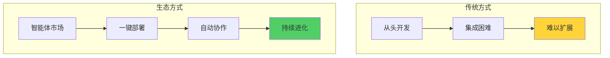
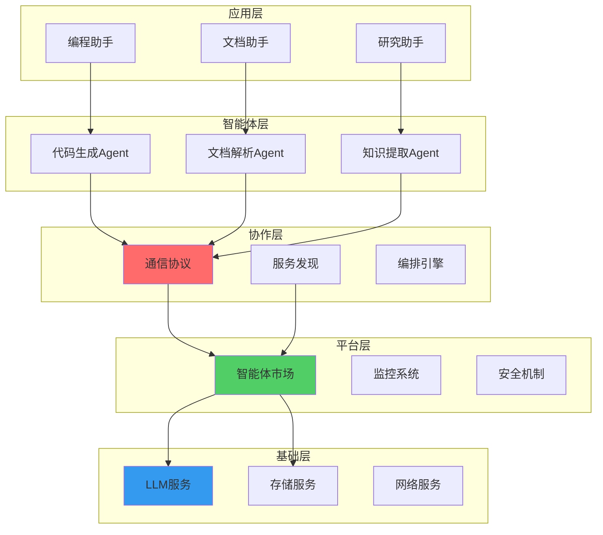
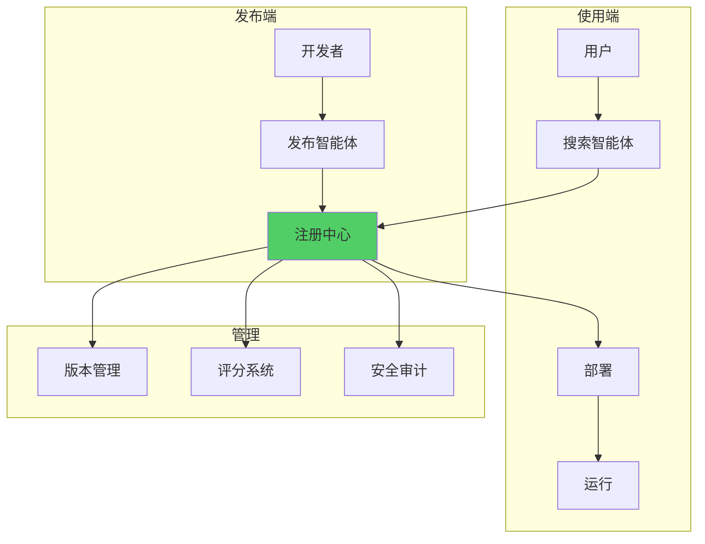
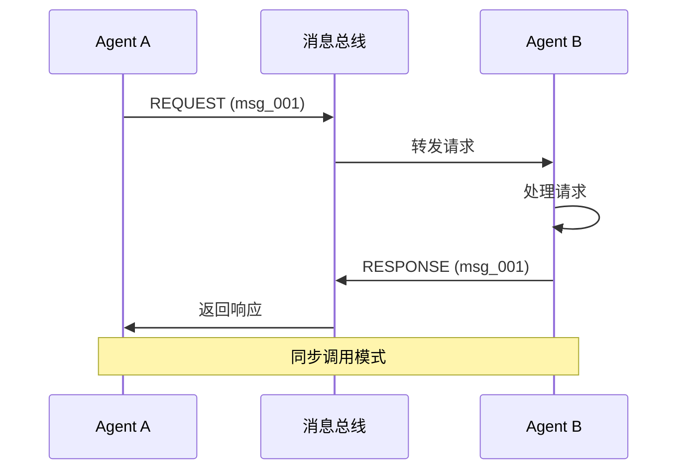
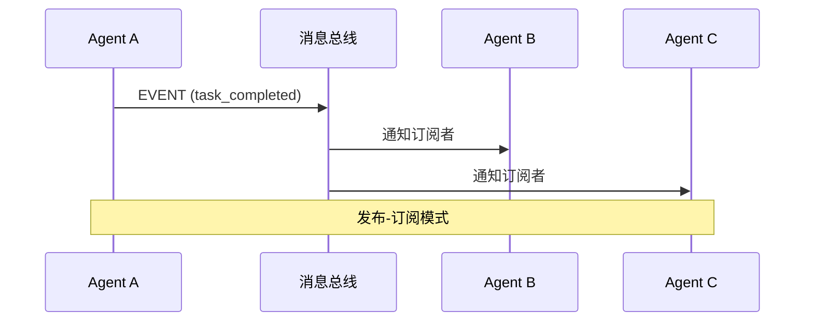
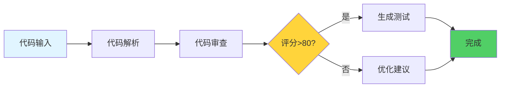
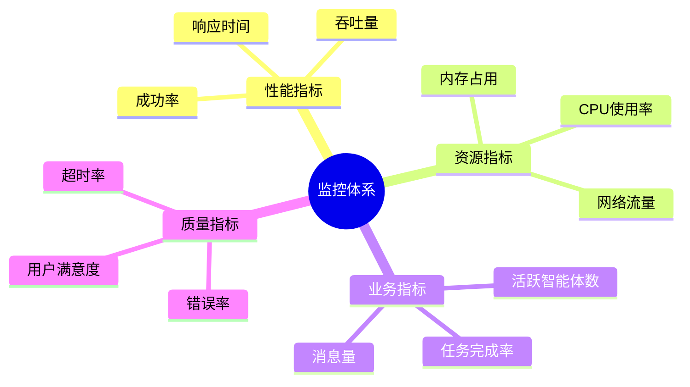
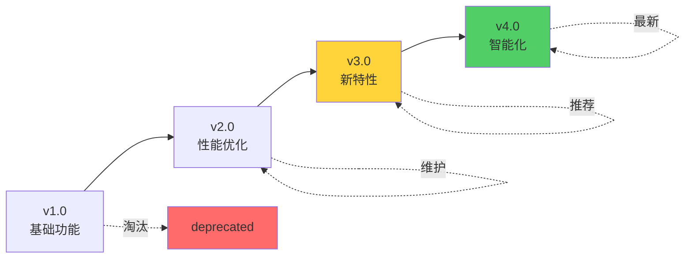
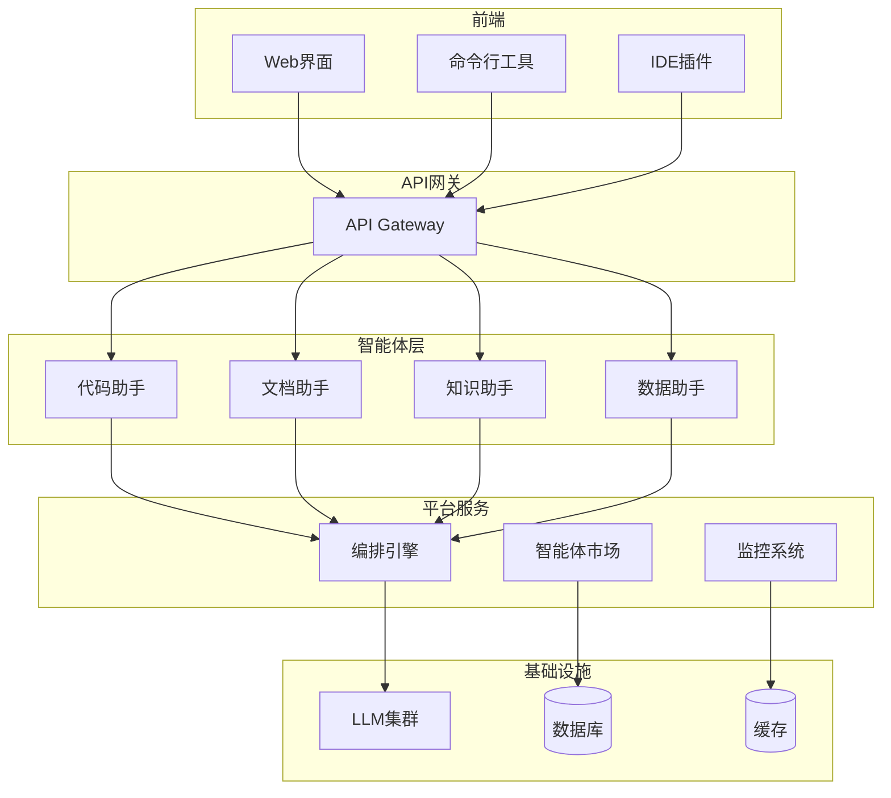
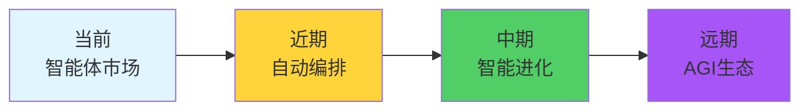

# 18.5 智能体生态：构建AI应用的未来

> **设计思想**：单个智能体是工具,多个智能体是系统,而智能体生态则是一个自组织、可进化的AI平台。就像App Store改变了软件分发,智能体生态将改变AI应用的构建方式。

## 引言：从应用到生态

想象这样一个场景：
- 你需要一个能写代码的智能体
- 只需在"智能体市场"搜索"Code Generator"
- 一键部署,立即使用
- 还能与其他智能体无缝协作

这就是**智能体生态（Agent Ecosystem）** 的愿景。



## 学习目标

- ✅ **理解生态架构** - 掌握可扩展智能体平台设计
- ✅ **实现智能体市场** - 构建发现和部署机制
- ✅ **开发协作协议** - 实现智能体间标准化通信
- ✅ **构建监控系统** - 实时追踪生态健康状况
- ✅ **设计进化机制** - 让生态能够自我优化

---

## 生态系统架构

### 1. 五层架构



### 2. 核心组件

| 组件 | 职责 | 关键技术 |
|------|------|---------|
| **智能体市场** | 发布、发现、部署 | 注册中心、版本管理 |
| **通信协议** | 标准化消息交换 | JSON-RPC、gRPC |
| **服务发现** | 动态定位智能体 | 服务注册、健康检查 |
| **编排引擎** | 协调多智能体协作 | 工作流引擎、DAG调度 |
| **监控系统** | 性能和质量监控 | 指标收集、告警 |

---

## 一、智能体市场

### 1. 市场架构



### 2. 智能体描述符

每个智能体用一个标准描述文件定义：

```yaml
# agent-descriptor.yaml
agent:
  id: code-generator-v2
  name: 代码生成智能体
  version: 2.1.0
  author: TinyAI Team
  
capabilities:
  - code_generation
  - code_optimization
  - unit_test_generation
  
interfaces:
  input:
    - type: text
      description: 代码需求描述
    - type: context
      description: 项目上下文
  output:
    - type: code
      language: [java, python, javascript]
      
requirements:
  llm: gpt-4
  memory: 512MB
  dependencies:
    - agent:code-understanding:1.0.0
    
pricing:
  model: pay-per-use
  cost: 0.01 USD per request
  
metadata:
  category: development
  tags: [code, generation, ai]
  rating: 4.8
  downloads: 10240
```

### 3. 核心实现

```java
public class AgentMarketplace {
    private AgentRegistry registry;
    private VersionManager versionManager;
    private DeploymentService deploymentService;
    
    // 发布智能体
    public void publishAgent(AgentDescriptor descriptor, byte[] agentPackage) {
        // 1. 验证描述符
        validateDescriptor(descriptor);
        
        // 2. 安全扫描
        securityAudit(agentPackage);
        
        // 3. 注册到市场
        registry.register(descriptor);
        
        // 4. 存储智能体包
        versionManager.store(descriptor.getId(), descriptor.getVersion(), agentPackage);
    }
    
    // 搜索智能体
    public List<AgentDescriptor> searchAgents(SearchQuery query) {
        // 支持多维度搜索
        return registry.search(query)
                      .stream()
                      .filter(agent -> matchesCapabilities(agent, query.getCapabilities()))
                      .sorted(Comparator.comparing(AgentDescriptor::getRating).reversed())
                      .limit(query.getLimit())
                      .collect(Collectors.toList());
    }
    
    // 部署智能体
    public AgentInstance deployAgent(String agentId, String version) {
        // 1. 获取智能体包
        byte[] agentPackage = versionManager.getPackage(agentId, version);
        
        // 2. 解析依赖
        List<Dependency> deps = parseDependencies(agentPackage);
        
        // 3. 部署依赖
        for (Dependency dep : deps) {
            deployDependency(dep);
        }
        
        // 4. 部署智能体
        return deploymentService.deploy(agentPackage);
    }
}
```

---

## 二、通信协议

### 1. 标准消息格式

```java
public class AgentMessage {
    private String messageId;      // 消息ID
    private String senderId;       // 发送者
    private String receiverId;     // 接收者
    private String messageType;    // 消息类型
    private Object payload;        // 载荷
    private Map<String, String> metadata;  // 元数据
    private long timestamp;        // 时间戳
}

// 消息类型
enum MessageType {
    REQUEST,       // 请求
    RESPONSE,      // 响应
    EVENT,         // 事件
    STREAM,        // 流式数据
    ERROR          // 错误
}
```

### 2. 请求-响应模式



### 3. 事件驱动模式



---

## 三、服务发现

### 1. 注册机制

```java
public class ServiceDiscovery {
    private Map<String, ServiceInfo> services = new ConcurrentHashMap<>();
    
    // 注册服务
    public void register(String agentId, ServiceInfo info) {
        services.put(agentId, info);
        scheduleHealthCheck(agentId);
    }
    
    // 发现服务
    public List<ServiceInfo> discover(String capability) {
        return services.values().stream()
                      .filter(info -> info.hasCapability(capability))
                      .filter(ServiceInfo::isHealthy)
                      .collect(Collectors.toList());
    }
    
    // 健康检查
    private void scheduleHealthCheck(String agentId) {
        scheduler.scheduleAtFixedRate(() -> {
            ServiceInfo info = services.get(agentId);
            if (!checkHealth(info)) {
                info.setHealthy(false);
                notifyServiceUnavailable(agentId);
            }
        }, 0, 30, TimeUnit.SECONDS);
    }
}
```

### 2. 负载均衡

```java
public class LoadBalancer {
    public ServiceInfo selectService(List<ServiceInfo> services) {
        // 加权轮询算法
        int totalWeight = services.stream()
                                 .mapToInt(ServiceInfo::getWeight)
                                 .sum();
        
        int random = ThreadLocalRandom.current().nextInt(totalWeight);
        int累计 = 0;
        
        for (ServiceInfo service : services) {
            累计 += service.getWeight();
            if (random < 累计) {
                return service;
            }
        }
        
        return services.get(0);
    }
}
```

---

## 四、编排引擎

### 1. 工作流定义

```yaml
# workflow.yaml
workflow:
  name: code-review-workflow
  description: 代码审查工作流
  
  stages:
    - stage: parse
      agent: code-understanding
      input: ${code}
      output: code_ast
      
    - stage: review
      agent: code-reviewer
      input: ${code_ast}
      output: review_report
      parallel: 3  # 并行审查
      
    - stage: suggest
      agent: code-optimizer
      input: 
        ast: ${code_ast}
        issues: ${review_report.issues}
      output: suggestions
      
    - stage: generate_tests
      agent: test-generator
      input: ${code}
      output: test_code
      condition: ${review_report.score} > 80
```

### 2. 编排引擎实现

```java
public class OrchestrationEngine {
    public WorkflowResult execute(Workflow workflow, Map<String, Object> inputs) {
        WorkflowContext context = new WorkflowContext(inputs);
        
        for (Stage stage : workflow.getStages()) {
            try {
                // 检查执行条件
                if (!evaluateCondition(stage.getCondition(), context)) {
                    continue;
                }
                
                // 准备输入
                Map<String, Object> stageInput = prepareInput(stage, context);
                
                // 执行阶段
                Object result = executeStage(stage, stageInput);
                
                // 保存结果
                context.put(stage.getOutput(), result);
                
            } catch (Exception e) {
                return handleError(stage, e, context);
            }
        }
        
        return new WorkflowResult(context);
    }
}
```

### 3. 可视化工作流



---

## 五、监控与治理

### 1. 监控指标



### 2. 监控实现

```java
public class MonitoringSystem {
    private MetricsCollector collector;
    private AlertManager alertManager;
    
    @Scheduled(fixedRate = 60000)  // 每分钟
    public void collectMetrics() {
        // 收集各类指标
        Map<String, Metric> metrics = new HashMap<>();
        
        metrics.put("active_agents", new Metric(getActiveAgentCount()));
        metrics.put("message_rate", new Metric(getMessageRate()));
        metrics.put("avg_response_time", new Metric(getAvgResponseTime()));
        metrics.put("error_rate", new Metric(getErrorRate()));
        
        // 存储指标
        collector.collect(metrics);
        
        // 检查告警
        checkAlerts(metrics);
    }
    
    private void checkAlerts(Map<String, Metric> metrics) {
        // 错误率过高
        if (metrics.get("error_rate").getValue() > 0.05) {
            alertManager.sendAlert(
                AlertLevel.HIGH,
                "错误率超过5%",
                metrics
            );
        }
        
        // 响应时间过长
        if (metrics.get("avg_response_time").getValue() > 5000) {
            alertManager.sendAlert(
                AlertLevel.MEDIUM,
                "平均响应时间超过5秒",
                metrics
            );
        }
    }
}
```

### 3. 监控仪表盘

```markdown
## 智能体生态监控仪表盘

### 实时状态
- 🟢 运行中的智能体: 156
- 📊 每秒消息数: 1,234
- ⚡ 平均响应时间: 287ms
- ✅ 成功率: 99.2%

### 热门智能体（24小时）
1. code-generator (12,345 次调用)
2. code-reviewer (8,901 次调用)
3. doc-generator (6,789 次调用)

### 告警
⚠️ code-optimizer-v3 响应时间过长 (6.8s)
ℹ️ knowledge-extractor 内存使用偏高 (85%)
```

---

## 六、进化机制

### 1. 自动优化

```java
public class EvolutionEngine {
    // 基于性能数据自动优化
    public void evolveAgents() {
        List<AgentMetrics> metrics = collectAgentMetrics();
        
        for (AgentMetrics m : metrics) {
            // 识别低性能智能体
            if (m.getSuccessRate() < 0.9 || m.getAvgResponseTime() > 3000) {
                // 尝试自动优化
                optimizeAgent(m.getAgentId());
            }
        }
    }
    
    private void optimizeAgent(String agentId) {
        Agent agent = getAgent(agentId);
        
        // 1. 分析性能瓶颈
        BottleneckAnalysis analysis = analyzeBottleneck(agent);
        
        // 2. 生成优化方案
        OptimizationPlan plan = generatePlan(analysis);
        
        // 3. 应用优化
        applyOptimization(agent, plan);
        
        // 4. A/B测试验证
        abTest(agent);
    }
}
```

### 2. 版本演进



---

## 实战案例：构建企业级智能体平台

### 1. 需求场景

某公司要构建内部智能体平台,支持：
- 代码开发辅助
- 文档自动生成
- 知识库问答
- 数据分析

### 2. 架构设计



### 3. 关键指标

部署3个月后的运营数据：

```markdown
## 平台运营数据（3个月）

### 使用情况
- 注册用户: 1,245
- 活跃智能体: 23个
- 日均调用: 45,678次
- 平均响应时间: 312ms

### TOP智能体
1. 代码补全助手 (35% 使用率)
2. SQL生成助手 (22% 使用率)
3. 文档生成助手 (18% 使用率)

### 效率提升
- 代码编写效率: ↑ 40%
- 文档产出速度: ↑ 60%
- Bug修复时间: ↓ 30%

### 用户反馈
- 满意度: 4.6/5.0
- NPS得分: 72
```

---

## 本节小结

### 关键要点

1. **生态思维**：从单点工具到系统平台
2. **标准化**：统一的协议和接口是基础
3. **可扩展性**：支持动态添加新智能体
4. **可观测性**：全面的监控和治理
5. **持续进化**：系统能够自我优化

### 未来展望



### 学习检查清单

- [ ] 理解生态系统的五层架构
- [ ] 能设计智能体市场
- [ ] 能实现标准通信协议
- [ ] 能构建服务发现机制
- [ ] 能开发编排引擎
- [ ] 能部署监控系统

---

**下一节预告**：18.6 综合项目 - 构建一个完整的智能体协作开发平台。

**参考资源**：
- TinyAI源码：`tinyai-agent-multi`模块
- OpenAI Assistants API
- LangChain Agent文档
