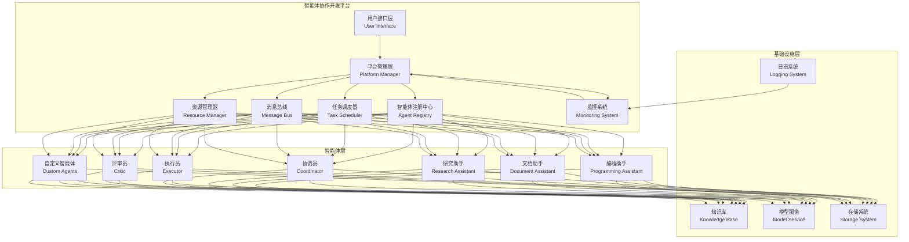

# 18.6 综合项目：智能体协作开发平台

> **设计思想**：构建一个完整的多智能体协作开发平台，整合前面章节中实现的各种智能体模式，创建一个功能完备的AI应用生态系统

## 本节概述

在前面的章节中，我们已经学习了多智能体系统的各种协作模式，包括集中式、分布式、主从式、对等式和联盟式协作，并通过实际案例实现了AI编程助手、文档处理助手、研究助手等专门化智能体。本节将把这些知识整合起来，构建一个完整的智能体协作开发平台。

这个平台将集成多种类型的智能体，包括编程助手、文档助手、研究助手、协调员等，通过统一的协作机制和通信协议，形成一个功能完备的AI应用生态系统。我们将重点关注平台的架构设计、智能体间的协作机制、任务调度和资源管理等方面。

## 学习目标

完成本节学习后，你将：

- ✅ **掌握综合项目架构设计**：理解如何整合多种智能体模式构建复杂AI应用
- ✅ **实现智能体协作平台**：构建支持多类型智能体协作的统一平台
- ✅ **掌握任务调度机制**：实现智能的任务分配和调度算法
- ✅ **实现资源管理机制**：构建高效的资源分配和管理系统
- ✅ **掌握平台监控能力**：实现全面的系统状态监控和性能分析
- ✅ **具备平台扩展能力**：学会设计可扩展的智能体平台架构

## 智能体协作开发平台架构

智能体协作开发平台是一个集成多种智能体类型的综合系统，通过统一的架构设计和协作机制，为用户提供完整的AI辅助开发体验。

### 1. 平台整体架构



### 2. 核心组件设计

#### 平台管理器 (PlatformManager)
平台管理器是整个系统的中枢，负责协调各个组件的工作，管理智能体的生命周期，处理用户请求等。

```pseudocode
// 平台管理器伪代码
class PlatformManager {
    private MultiAgentSystem agentSystem;
    private TaskScheduler taskScheduler;
    private ResourceManager resourceManager;
    private MonitoringService monitoringService;
    private MessageBus messageBus;
    
    // 初始化平台
    public void initialize() {
        // 初始化各个子系统
        agentSystem = new MultiAgentSystem();
        taskScheduler = new TaskScheduler();
        resourceManager = new ResourceManager();
        monitoringService = new MonitoringService();
        messageBus = new MessageBus();
        
        // 启动各个服务
        agentSystem.start();
        taskScheduler.start();
        resourceManager.start();
        monitoringService.start();
        messageBus.start();
        
        log("Platform Manager initialized successfully");
    }
    
    // 注册智能体
    public String registerAgent(AgentType type, AgentConfig config) {
        // 根据类型创建智能体
        BaseAgent agent = createAgent(type, config);
        
        // 注册到智能体系统
        String agentId = agentSystem.addAgent(agent);
        
        // 注册到注册中心
        agentRegistry.register(agentId, agent);
        
        log("Agent registered: " + agentId + " (" + type + ")");
        return agentId;
    }
    
    // 处理用户请求
    public PlatformResponse processUserRequest(UserRequest request) {
        // 1. 解析用户请求
        RequestAnalysis analysis = analyzeRequest(request);
        
        // 2. 分配任务
        Task task = taskScheduler.createTask(analysis);
        
        // 3. 分配资源
        ResourceAllocation allocation = resourceManager.allocate(task);
        
        // 4. 调度执行
        TaskExecutionResult result = taskScheduler.schedule(task, allocation);
        
        // 5. 返回结果
        return buildResponse(result);
    }
    
    // 获取系统状态
    public SystemStatus getSystemStatus() {
        SystemStatus status = new SystemStatus();
        status.setAgentCount(agentSystem.getAgentCount());
        status.setActiveTasks(taskScheduler.getActiveTaskCount());
        status.setAvailableResources(resourceManager.getAvailableResources());
        status.setSystemMetrics(monitoringService.getMetrics());
        return status;
    }
    
    // 关闭平台
    public void shutdown() {
        agentSystem.shutdown();
        taskScheduler.shutdown();
        resourceManager.shutdown();
        monitoringService.shutdown();
        messageBus.shutdown();
        
        log("Platform Manager shutdown completed");
    }
}
```

#### 智能体注册中心 (AgentRegistry)
智能体注册中心负责管理所有已注册的智能体，提供发现、查询和管理功能。

```pseudocode
// 智能体注册中心伪代码
class AgentRegistry {
    private Map<String, RegisteredAgent> agents;
    private Map<AgentType, List<String>> typeIndex;
    private Map<String, Set<String>> capabilityIndex;
    
    // 注册智能体
    public void register(String agentId, BaseAgent agent) {
        RegisteredAgent registeredAgent = new RegisteredAgent();
        registeredAgent.setAgentId(agentId);
        registeredAgent.setAgent(agent);
        registeredAgent.setType(agent.getType());
        registeredAgent.setCapabilities(agent.getCapabilities());
        registeredAgent.setRegistrationTime(currentTime());
        
        // 添加到主索引
        agents.put(agentId, registeredAgent);
        
        // 添加到类型索引
        typeIndex.computeIfAbsent(agent.getType(), k -> new ArrayList<>()).add(agentId);
        
        // 添加到能力索引
        for (String capability : agent.getCapabilities()) {
            capabilityIndex.computeIfAbsent(capability, k -> new HashSet<>()).add(agentId);
        }
        
        log("Agent registered: " + agentId);
    }
    
    // 根据ID查找智能体
    public BaseAgent findAgentById(String agentId) {
        RegisteredAgent registeredAgent = agents.get(agentId);
        return registeredAgent != null ? registeredAgent.getAgent() : null;
    }
    
    // 根据类型查找智能体
    public List<BaseAgent> findAgentsByType(AgentType type) {
        List<String> agentIds = typeIndex.get(type);
        if (agentIds == null) return new ArrayList<>();
        
        List<BaseAgent> result = new ArrayList<>();
        for (String agentId : agentIds) {
            BaseAgent agent = findAgentById(agentId);
            if (agent != null) {
                result.add(agent);
            }
        }
        return result;
    }
    
    // 根据能力查找智能体
    public List<BaseAgent> findAgentsByCapability(String capability) {
        Set<String> agentIds = capabilityIndex.get(capability);
        if (agentIds == null) return new ArrayList<>();
        
        List<BaseAgent> result = new ArrayList<>();
        for (String agentId : agentIds) {
            BaseAgent agent = findAgentById(agentId);
            if (agent != null) {
                result.add(agent);
            }
        }
        return result;
    }
    
    // 获取所有智能体信息
    public List<AgentInfo> getAllAgentInfo() {
        List<AgentInfo> result = new ArrayList<>();
        for (RegisteredAgent registeredAgent : agents.values()) {
            AgentInfo info = new AgentInfo();
            info.setAgentId(registeredAgent.getAgentId());
            info.setType(registeredAgent.getType());
            info.setCapabilities(registeredAgent.getCapabilities());
            info.setRegistrationTime(registeredAgent.getRegistrationTime());
            info.setStatus(registeredAgent.getAgent().getStatus());
            result.add(info);
        }
        return result;
    }
}
```

#### 任务调度器 (TaskScheduler)
任务调度器负责任务的创建、分配和调度执行，确保任务能够高效地分配给合适的智能体。

```pseudocode
// 任务调度器伪代码
class TaskScheduler {
    private PriorityQueue<Task> taskQueue;
    private Map<String, Task> activeTasks;
    private LoadBalancer loadBalancer;
    private TaskAllocator taskAllocator;
    
    // 创建任务
    public Task createTask(RequestAnalysis analysis) {
        Task task = new Task();
        task.setTaskId(generateTaskId());
        task.setType(analysis.getTaskType());
        task.setPriority(analysis.getPriority());
        task.setRequiredCapabilities(analysis.getRequiredCapabilities());
        task.setEstimatedExecutionTime(analysis.getEstimatedTime());
        task.setCreationTime(currentTime());
        task.setStatus(TaskStatus.PENDING);
        
        // 添加到任务队列
        taskQueue.add(task);
        
        log("Task created: " + task.getTaskId() + " (" + task.getType() + ")");
        return task;
    }
    
    // 调度任务执行
    public TaskExecutionResult schedule(Task task, ResourceAllocation allocation) {
        // 1. 更新任务状态
        task.setStatus(TaskStatus.SCHEDULED);
        activeTasks.put(task.getTaskId(), task);
        
        // 2. 选择合适的智能体
        BaseAgent selectedAgent = selectAgent(task);
        if (selectedAgent == null) {
            task.setStatus(TaskStatus.FAILED);
            return TaskExecutionResult.failed("No suitable agent found");
        }
        
        // 3. 分配任务给智能体
        TaskAssignment assignment = new TaskAssignment();
        assignment.setTask(task);
        assignment.setAgent(selectedAgent);
        assignment.setResourceAllocation(allocation);
        assignment.setAssignmentTime(currentTime());
        
        // 4. 执行任务
        TaskExecutionResult result = executeTask(assignment);
        
        // 5. 更新任务状态
        task.setStatus(result.isSuccess() ? TaskStatus.COMPLETED : TaskStatus.FAILED);
        activeTasks.remove(task.getTaskId());
        
        // 6. 释放资源
        resourceManager.release(allocation);
        
        return result;
    }
    
    // 选择合适的智能体
    private BaseAgent selectAgent(Task task) {
        // 1. 根据任务能力要求查找智能体
        List<BaseAgent> candidates = agentRegistry.findAgentsByCapability(
            task.getRequiredCapabilities());
        
        if (candidates.isEmpty()) {
            // 如果没有完全匹配的，查找部分匹配的
            candidates = findPartiallyMatchingAgents(task);
        }
        
        if (candidates.isEmpty()) {
            return null;
        }
        
        // 2. 使用负载均衡器选择最优智能体
        return loadBalancer.select(candidates);
    }
    
    // 执行任务
    private TaskExecutionResult executeTask(TaskAssignment assignment) {
        Task task = assignment.getTask();
        BaseAgent agent = assignment.getAgent();
        
        try {
            // 发送任务给智能体
            AgentMessage message = new AgentMessage();
            message.setType(MessageType.TASK);
            message.setSenderId("scheduler");
            message.setReceiverId(agent.getAgentId());
            message.setContent(task);
            
            AgentResponse response = agent.processMessage(message);
            
            TaskExecutionResult result = new TaskExecutionResult();
            result.setTaskId(task.getTaskId());
            result.setAgentId(agent.getAgentId());
            result.setSuccess(response.isSuccess());
            result.setResult(response.getContent());
            result.setExecutionTime(currentTime() - task.getCreationTime());
            
            return result;
        } catch (Exception e) {
            log("Task execution failed: " + e.getMessage());
            return TaskExecutionResult.failed(e.getMessage());
        }
    }
}
```

#### 资源管理器 (ResourceManager)
资源管理器负责管理系统中的各种资源，包括计算资源、存储资源和网络资源等。

```pseudocode
// 资源管理器伪代码
class ResourceManager {
    private ResourcePool cpuPool;
    private ResourcePool memoryPool;
    private ResourcePool storagePool;
    private Map<String, ResourceAllocation> activeAllocations;
    
    // 初始化资源池
    public void initialize() {
        // 获取系统资源信息
        SystemResources systemResources = getSystemResources();
        
        // 创建资源池
        cpuPool = new ResourcePool("CPU", systemResources.getCpuCores());
        memoryPool = new ResourcePool("Memory", systemResources.getTotalMemory());
        storagePool = new ResourcePool("Storage", systemResources.getTotalStorage());
        
        log("Resource Manager initialized with " + 
            systemResources.getCpuCores() + " CPU cores, " +
            formatBytes(systemResources.getTotalMemory()) + " memory, " +
            formatBytes(systemResources.getTotalStorage()) + " storage");
    }
    
    // 分配资源
    public ResourceAllocation allocate(Task task) {
        ResourceRequirements requirements = task.getResourceRequirements();
        
        // 检查资源是否足够
        if (!hasSufficientResources(requirements)) {
            throw new InsufficientResourcesException("Insufficient resources for task");
        }
        
        // 分配资源
        ResourceAllocation allocation = new ResourceAllocation();
        allocation.setAllocationId(generateAllocationId());
        allocation.setTaskId(task.getTaskId());
        allocation.setCpuAllocation(cpuPool.allocate(requirements.getCpuCores()));
        allocation.setMemoryAllocation(memoryPool.allocate(requirements.getMemory()));
        allocation.setStorageAllocation(storagePool.allocate(requirements.getStorage()));
        allocation.setAllocationTime(currentTime());
        
        // 记录活跃分配
        activeAllocations.put(allocation.getAllocationId(), allocation);
        
        log("Resources allocated for task " + task.getTaskId() + 
            ": " + allocation.getCpuAllocation() + " CPU, " +
            formatBytes(allocation.getMemoryAllocation()) + " memory");
        
        return allocation;
    }
    
    // 释放资源
    public void release(ResourceAllocation allocation) {
        // 释放各个资源池中的资源
        cpuPool.release(allocation.getCpuAllocation());
        memoryPool.release(allocation.getMemoryAllocation());
        storagePool.release(allocation.getStorageAllocation());
        
        // 从活跃分配中移除
        activeAllocations.remove(allocation.getAllocationId());
        
        log("Resources released for allocation " + allocation.getAllocationId());
    }
    
    // 获取可用资源
    public AvailableResources getAvailableResources() {
        AvailableResources resources = new AvailableResources();
        resources.setAvailableCpu(cpuPool.getAvailable());
        resources.setAvailableMemory(memoryPool.getAvailable());
        resources.setAvailableStorage(storagePool.getAvailable());
        resources.setTotalCpu(cpuPool.getTotal());
        resources.setTotalMemory(memoryPool.getTotal());
        resources.setTotalStorage(storagePool.getTotal());
        return resources;
    }
    
    // 检查是否有足够资源
    private boolean hasSufficientResources(ResourceRequirements requirements) {
        return cpuPool.hasAvailable(requirements.getCpuCores()) &&
               memoryPool.hasAvailable(requirements.getMemory()) &&
               storagePool.hasAvailable(requirements.getStorage());
    }
}
```

#### 监控系统 (MonitoringService)
监控系统负责收集和分析系统的各种指标，包括性能指标、资源使用情况和错误统计等。

```pseudocode
// 监控系统伪代码
class MonitoringService {
    private MetricsCollector metricsCollector;
    private AlertManager alertManager;
    private LogManager logManager;
    private Map<String, PerformanceMetrics> agentMetrics;
    private SystemMetrics systemMetrics;
    
    // 初始化监控服务
    public void initialize() {
        metricsCollector = new MetricsCollector();
        alertManager = new AlertManager();
        logManager = new LogManager();
        agentMetrics = new ConcurrentHashMap<>();
        systemMetrics = new SystemMetrics();
        
        // 启动定期收集任务
        schedulePeriodicCollection();
        
        log("Monitoring Service initialized");
    }
    
    // 收集系统指标
    public SystemMetrics collectSystemMetrics() {
        SystemMetrics metrics = new SystemMetrics();
        
        // 收集CPU使用率
        metrics.setCpuUsage(metricsCollector.getCpuUsage());
        
        // 收集内存使用情况
        metrics.setMemoryUsage(metricsCollector.getMemoryUsage());
        
        // 收集磁盘使用情况
        metrics.setDiskUsage(metricsCollector.getDiskUsage());
        
        // 收集网络使用情况
        metrics.setNetworkUsage(metricsCollector.getNetworkUsage());
        
        // 收集智能体指标
        metrics.setAgentMetrics(collectAgentMetrics());
        
        // 收集任务指标
        metrics.setTaskMetrics(collectTaskMetrics());
        
        return metrics;
    }
    
    // 记录智能体指标
    public void recordAgentMetrics(String agentId, AgentMetrics metrics) {
        agentMetrics.put(agentId, convertToPerformanceMetrics(metrics));
    }
    
    // 检查是否需要告警
    public void checkAlerts(SystemMetrics metrics) {
        // 检查CPU使用率
        if (metrics.getCpuUsage() > 90.0) {
            alertManager.sendAlert("High CPU usage: " + metrics.getCpuUsage() + "%");
        }
        
        // 检查内存使用率
        if (metrics.getMemoryUsage() > 85.0) {
            alertManager.sendAlert("High memory usage: " + metrics.getMemoryUsage() + "%");
        }
        
        // 检查错误率
        if (metrics.getErrorRate() > 5.0) {
            alertManager.sendAlert("High error rate: " + metrics.getErrorRate() + "%");
        }
    }
    
    // 获取历史指标
    public List<SystemMetrics> getHistoricalMetrics(long startTime, long endTime) {
        return metricsCollector.getHistoricalMetrics(startTime, endTime);
    }
    
    // 生成性能报告
    public PerformanceReport generatePerformanceReport() {
        PerformanceReport report = new PerformanceReport();
        report.setSystemMetrics(systemMetrics);
        report.setAgentMetrics(new ArrayList<>(agentMetrics.values()));
        report.setRecommendations(generateRecommendations());
        return report;
    }
}
```

## 智能体协作机制

智能体协作开发平台的核心在于各种智能体之间的有效协作。我们将实现多种协作机制来支持不同场景下的协作需求。

### 1. 消息传递机制

```pseudocode
// 消息总线伪代码
class MessageBus {
    private Map<String, List<Consumer<AgentMessage>>> subscribers;
    private BlockingQueue<AgentMessage> messageQueue;
    private ExecutorService messageProcessor;
    
    // 订阅消息
    public void subscribe(String agentId, Consumer<AgentMessage> callback) {
        subscribers.computeIfAbsent(agentId, k -> new ArrayList<>()).add(callback);
    }
    
    // 发布消息
    public void publish(AgentMessage message) {
        messageQueue.offer(message);
    }
    
    // 异步发布消息
    public CompletableFuture<Void> publishAsync(AgentMessage message) {
        return CompletableFuture.runAsync(() -> publish(message));
    }
    
    // 处理消息
    private void processMessage(AgentMessage message) {
        String receiverId = message.getReceiverId();
        
        // 点对点消息
        if (!"*".equals(receiverId)) {
            List<Consumer<AgentMessage>> callbacks = subscribers.get(receiverId);
            if (callbacks != null) {
                for (Consumer<AgentMessage> callback : callbacks) {
                    try {
                        callback.accept(message);
                    } catch (Exception e) {
                        log("Error in message callback: " + e.getMessage());
                    }
                }
            }
        } else {
            // 广播消息
            for (List<Consumer<AgentMessage>> callbacks : subscribers.values()) {
                for (Consumer<AgentMessage> callback : callbacks) {
                    try {
                        callback.accept(message);
                    } catch (Exception e) {
                        log("Error in broadcast callback: " + e.getMessage());
                    }
                }
            }
        }
    }
}
```

### 2. 任务协作机制

```pseudocode
// 任务协作伪代码
class TaskCollaboration {
    // 协作执行复杂任务
    public CollaborationResult collaborateOnTask(ComplexTask task) {
        // 1. 任务分解
        List<SubTask> subTasks = decomposeTask(task);
        
        // 2. 分配子任务给不同智能体
        Map<SubTask, BaseAgent> assignments = assignSubTasks(subTasks);
        
        // 3. 并行执行子任务
        Map<SubTask, CompletableFuture<SubTaskResult>> futures = new HashMap<>();
        for (Map.Entry<SubTask, BaseAgent> entry : assignments.entrySet()) {
            SubTask subTask = entry.getKey();
            BaseAgent agent = entry.getValue();
            futures.put(subTask, executeSubTaskAsync(subTask, agent));
        }
        
        // 4. 等待所有子任务完成
        List<SubTaskResult> results = new ArrayList<>();
        for (Map.Entry<SubTask, CompletableFuture<SubTaskResult>> entry : futures.entrySet()) {
            try {
                SubTaskResult result = entry.getValue().get(30, TimeUnit.SECONDS);
                results.add(result);
            } catch (Exception e) {
                log("SubTask execution failed: " + e.getMessage());
                results.add(SubTaskResult.failed(entry.getKey(), e.getMessage()));
            }
        }
        
        // 5. 整合结果
        CollaborationResult collaborationResult = integrateResults(task, results);
        
        return collaborationResult;
    }
    
    // 任务分解
    private List<SubTask> decomposeTask(ComplexTask task) {
        List<SubTask> subTasks = new ArrayList<>();
        
        // 根据任务类型进行分解
        switch (task.getType()) {
            case SOFTWARE_DEVELOPMENT:
                subTasks.add(createSubTask("REQUIREMENT_ANALYSIS", task.getRequirements()));
                subTasks.add(createSubTask("DESIGN", task.getRequirements()));
                subTasks.add(createSubTask("IMPLEMENTATION", task.getRequirements()));
                subTasks.add(createSubTask("TESTING", task.getRequirements()));
                break;
            case RESEARCH_PROJECT:
                subTasks.add(createSubTask("LITERATURE_REVIEW", task.getTopic()));
                subTasks.add(createSubTask("EXPERIMENT_DESIGN", task.getTopic()));
                subTasks.add(createSubTask("DATA_COLLECTION", task.getTopic()));
                subTasks.add(createSubTask("ANALYSIS", task.getTopic()));
                break;
            default:
                subTasks.add(createSubTask("DEFAULT_EXECUTION", task.getContent()));
        }
        
        return subTasks;
    }
    
    // 分配子任务
    private Map<SubTask, BaseAgent> assignSubTasks(List<SubTask> subTasks) {
        Map<SubTask, BaseAgent> assignments = new HashMap<>();
        
        for (SubTask subTask : subTasks) {
            // 根据子任务类型选择合适的智能体
            BaseAgent agent = selectAgentForSubTask(subTask);
            if (agent != null) {
                assignments.put(subTask, agent);
            }
        }
        
        return assignments;
    }
}
```

## 平台功能演示

让我们通过一个具体的演示来展示智能体协作开发平台的功能。

### 1. 平台初始化

```pseudocode
// 平台初始化演示
public class PlatformDemo {
    public static void main(String[] args) {
        // 1. 创建平台管理器
        PlatformManager platform = new PlatformManager();
        
        // 2. 初始化平台
        platform.initialize();
        
        // 3. 注册各种智能体
        registerAgents(platform);
        
        // 4. 显示平台状态
        displayPlatformStatus(platform);
        
        // 5. 运行演示任务
        runDemoTasks(platform);
        
        // 6. 关闭平台
        platform.shutdown();
    }
    
    private static void registerAgents(PlatformManager platform) {
        System.out.println("Registering agents...");
        
        // 注册编程助手
        AgentConfig programmingConfig = new AgentConfig();
        programmingConfig.setName("编程助手");
        programmingConfig.setCapabilities(Arrays.asList("code_generation", "code_review", "debugging"));
        platform.registerAgent(AgentType.PROGRAMMING_ASSISTANT, programmingConfig);
        
        // 注册文档助手
        AgentConfig documentConfig = new AgentConfig();
        documentConfig.setName("文档助手");
        documentConfig.setCapabilities(Arrays.asList("document_generation", "formatting", "translation"));
        platform.registerAgent(AgentType.DOCUMENT_ASSISTANT, documentConfig);
        
        // 注册研究助手
        AgentConfig researchConfig = new AgentConfig();
        researchConfig.setName("研究助手");
        researchConfig.setCapabilities(Arrays.asList("research", "analysis", "reporting"));
        platform.registerAgent(AgentType.RESEARCH_ASSISTANT, researchConfig);
        
        // 注册协调员
        AgentConfig coordinatorConfig = new AgentConfig();
        coordinatorConfig.setName("项目协调员");
        coordinatorConfig.setCapabilities(Arrays.asList("task_management", "coordination", "planning"));
        platform.registerAgent(AgentType.COORDINATOR, coordinatorConfig);
        
        System.out.println("All agents registered successfully!");
    }
    
    private static void displayPlatformStatus(PlatformManager platform) {
        SystemStatus status = platform.getSystemStatus();
        System.out.println("\n=== 平台状态 ===");
        System.out.println("智能体数量: " + status.getAgentCount());
        System.out.println("活跃任务数: " + status.getActiveTasks());
        System.out.println("系统指标: " + status.getSystemMetrics());
    }
}
```

### 2. 复杂任务协作演示

```pseudocode
// 复杂任务协作演示
private static void runDemoTasks(PlatformManager platform) {
    System.out.println("\n=== 复杂任务协作演示 ===");
    
    // 创建一个软件开发任务
    UserRequest request = new UserRequest();
    request.setType("software_development");
    request.setContent("开发一个简单的待办事项应用，包含前端界面和后端API");
    request.setRequirements(Arrays.asList(
        "前端使用React框架",
        "后端使用Spring Boot",
        "数据库使用MySQL",
        "包含用户认证功能"
    ));
    
    // 处理用户请求
    PlatformResponse response = platform.processUserRequest(request);
    
    // 显示结果
    System.out.println("任务处理结果: " + response.getStatus());
    System.out.println("结果内容: " + response.getContent());
    System.out.println("执行时间: " + response.getExecutionTime() + "ms");
}
```

## 平台扩展与优化

智能体协作开发平台具有良好的扩展性，可以根据需要添加新的功能和优化现有性能。

### 1. 插件化架构

```pseudocode
// 插件管理器伪代码
class PluginManager {
    private Map<String, Plugin> loadedPlugins;
    private PluginLoader pluginLoader;
    
    // 加载插件
    public void loadPlugin(String pluginPath) {
        try {
            Plugin plugin = pluginLoader.load(pluginPath);
            loadedPlugins.put(plugin.getId(), plugin);
            plugin.initialize();
            log("Plugin loaded: " + plugin.getName());
        } catch (Exception e) {
            log("Failed to load plugin: " + e.getMessage());
        }
    }
    
    // 卸载插件
    public void unloadPlugin(String pluginId) {
        Plugin plugin = loadedPlugins.remove(pluginId);
        if (plugin != null) {
            plugin.shutdown();
            log("Plugin unloaded: " + plugin.getName());
        }
    }
    
    // 获取插件
    public Plugin getPlugin(String pluginId) {
        return loadedPlugins.get(pluginId);
    }
    
    // 执行插件功能
    public PluginResult executePlugin(String pluginId, PluginRequest request) {
        Plugin plugin = getPlugin(pluginId);
        if (plugin == null) {
            return PluginResult.failed("Plugin not found: " + pluginId);
        }
        
        return plugin.execute(request);
    }
}
```

### 2. 性能优化策略

```pseudocode
// 性能优化器伪代码
class PerformanceOptimizer {
    private MonitoringService monitoringService;
    private ResourceManager resourceManager;
    private TaskScheduler taskScheduler;
    
    // 优化资源分配
    public void optimizeResourceAllocation() {
        SystemMetrics metrics = monitoringService.getLatestMetrics();
        
        // 如果CPU使用率过高，调整任务优先级
        if (metrics.getCpuUsage() > 80.0) {
            taskScheduler.adjustPriorities(TaskPriority.LOW);
        }
        
        // 如果内存使用率过高，触发垃圾回收
        if (metrics.getMemoryUsage() > 85.0) {
            System.gc();
        }
    }
    
    // 优化任务调度
    public void optimizeTaskScheduling() {
        // 分析任务执行模式
        TaskExecutionPattern pattern = analyzeExecutionPatterns();
        
        // 根据模式调整调度策略
        if (pattern.isBatchProcessing()) {
            taskScheduler.setSchedulingStrategy(new BatchSchedulingStrategy());
        } else if (pattern.isRealTime()) {
            taskScheduler.setSchedulingStrategy(new RealTimeSchedulingStrategy());
        }
    }
    
    // 缓存优化
    public void optimizeCaching() {
        // 分析缓存命中率
        CacheMetrics cacheMetrics = getCacheMetrics();
        
        // 如果命中率低，调整缓存策略
        if (cacheMetrics.getHitRate() < 0.7) {
            cacheManager.adjustCacheSize(CacheSize.INCREASE);
        }
    }
}
```

## 本章小结

在本章中，我们构建了一个完整的智能体协作开发平台，整合了前面章节中学习的各种智能体模式和协作机制。通过这个综合项目，我们实现了以下关键功能：

1. **统一平台架构**：设计了包含平台管理层、智能体注册中心、任务调度器、资源管理器和监控系统在内的完整架构。

2. **多智能体协作**：集成了编程助手、文档助手、研究助手、协调员等多种类型的智能体，实现了它们之间的有效协作。

3. **任务调度机制**：实现了智能的任务分解、分配和调度算法，确保任务能够高效地执行。

4. **资源管理机制**：构建了完整的资源管理体系，包括CPU、内存、存储等资源的分配和回收。

5. **系统监控能力**：实现了全面的系统监控和性能分析功能，能够实时了解系统状态。

6. **可扩展设计**：采用了插件化架构，支持功能扩展和性能优化。

这个智能体协作开发平台展示了如何将理论知识应用到实际项目中，构建功能完备的AI应用生态系统。通过这种方式，我们可以充分发挥多智能体系统的优势，为用户提供更智能、更高效的服务。

在实际应用中，这个平台可以进一步扩展，添加更多类型的智能体，集成更强大的AI模型，实现更复杂的协作机制，从而构建更加完善的智能体生态系统。