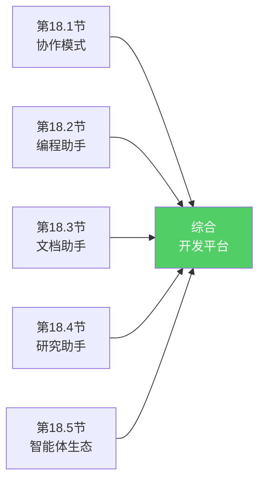
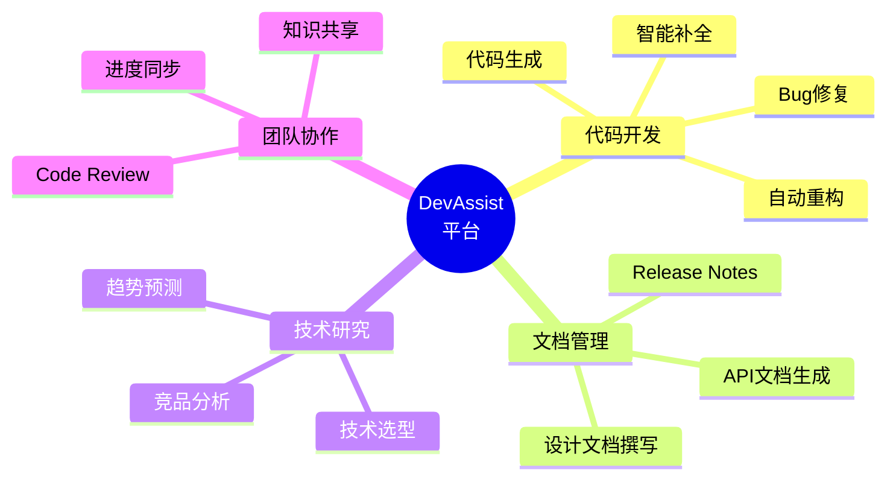
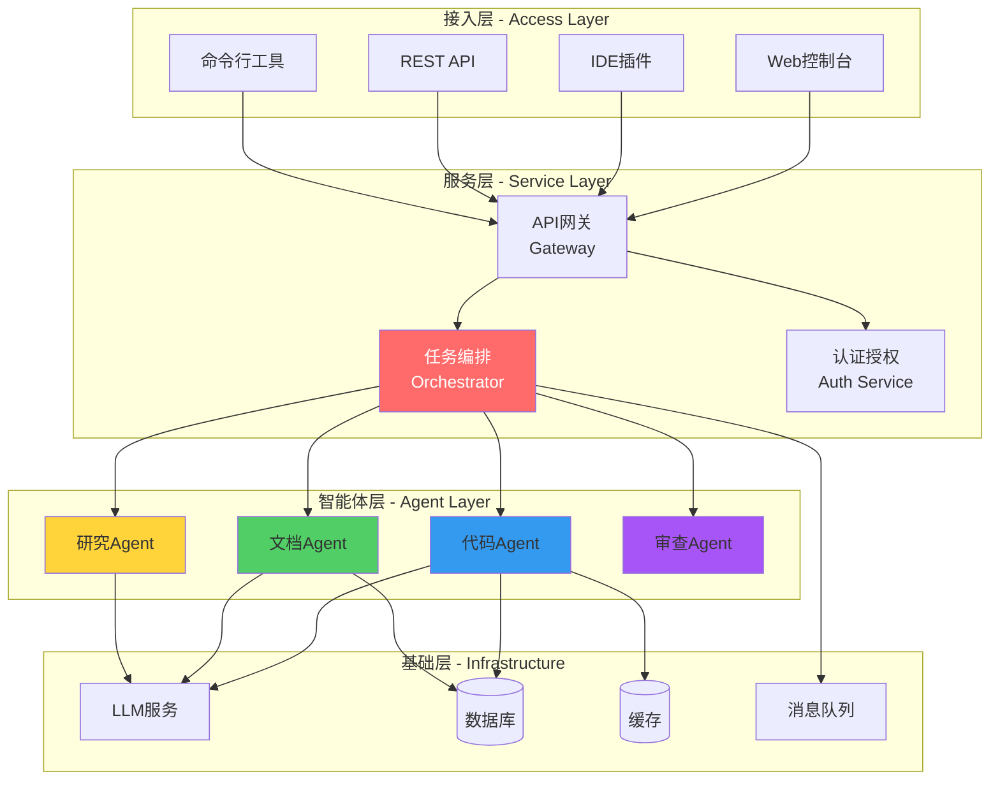
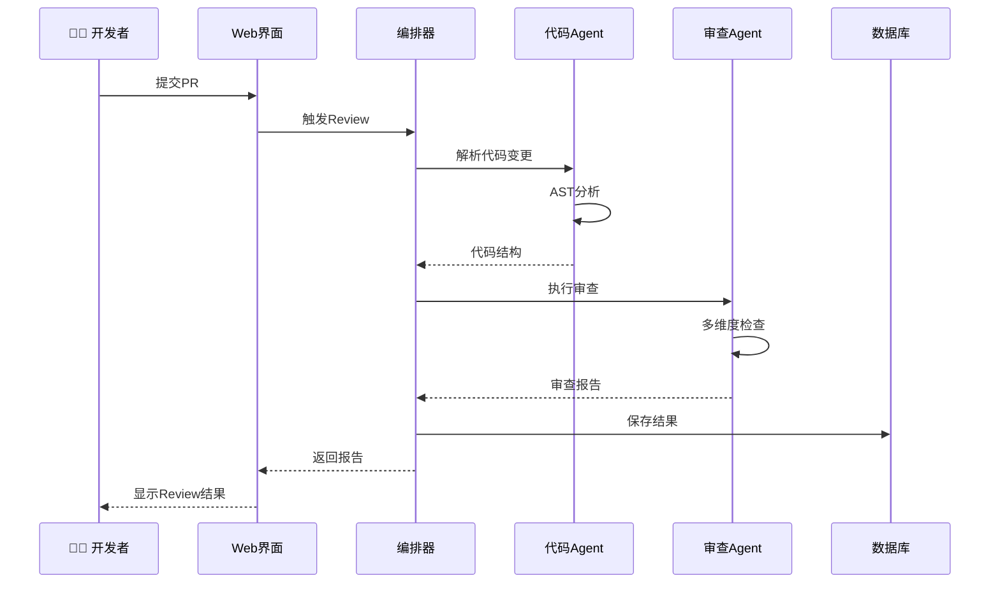
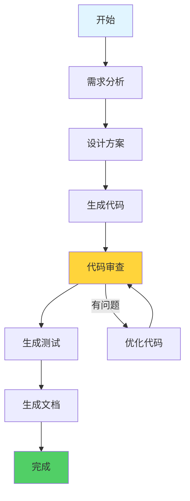

# 18.6 综合项目：智能体协作开发平台

> **设计思想**：将前面5节学到的知识融会贯通,构建一个完整的AI辅助开发生态。这不仅是技术的综合应用,更是对多智能体系统设计理念的深度实践。

## 引言：从学习到实战

经过前面的学习,我们掌握了：
- 💡 多种协作模式（集中式、分布式、主从式...）
- 🤖 专业智能体（代码、文档、研究...）
- 🌐 生态系统（市场、协议、监控...）

现在,让我们把这些拼图组合起来,构建一个**完整的智能体协作开发平台**。



## 学习目标

- ✅ **综合应用**：整合多种协作模式和专业智能体
- ✅ **系统设计**：掌握复杂系统的架构设计方法
- ✅ **实战能力**：能独立构建完整的多智能体系统
- ✅ **扩展思维**：理解如何持续演进和优化系统

---

## 项目需求：DevAssist平台

### 1. 目标用户

**目标**：构建一个面向Java开发团队的AI辅助开发平台。

**用户画像**：
- 👨‍💻 **Java开发者**：需要代码生成、审查、优化
- 📝 **技术写作者**：需要文档自动化生成
- 🔬 **技术Leader**：需要技术调研和决策支持

### 2. 核心功能



---

## 系统架构设计

### 1. 分层架构

采用经典的四层架构：



### 2. 核心组件

| 组件 | 职责 | 技术选型 |
|------|------|---------|
| **任务编排器** | 协调智能体协作 | Spring Boot + CompletableFuture |
| **代码Agent** | 代码相关功能 | LangChain4j + GPT-4 |
| **文档Agent** | 文档处理 | Markdown Parser + LLM |
| **研究Agent** | 技术调研 | RAG + Semantic Search |
| **消息队列** | 异步通信 | RabbitMQ / Kafka |
| **数据库** | 数据持久化 | PostgreSQL + Redis |

---

## 核心流程实现

### 1. 典型工作流：代码Review

从一个实际场景入手：开发者提交代码,系统自动Review。



### 2. 核心Java代码

```java
@Service
public class DevAssistOrchestrator {
    @Autowired
    private CodeAgent codeAgent;
    
    @Autowired
    private CodeReviewAgent reviewAgent;
    
    @Autowired
    private NotificationService notificationService;
    
    public ReviewResult handlePullRequest(PullRequest pr) {
        // 1. 解析代码变更
        CodeChange change = codeAgent.parseChanges(pr.getDiff());
        
        // 2. 并行执行多项检查
        CompletableFuture<QualityReport> qualityCheck = 
            CompletableFuture.supplyAsync(() -> 
                reviewAgent.checkQuality(change));
        
        CompletableFuture<SecurityReport> securityCheck = 
            CompletableFuture.supplyAsync(() -> 
                reviewAgent.checkSecurity(change));
        
        CompletableFuture<PerformanceReport> perfCheck = 
            CompletableFuture.supplyAsync(() -> 
                reviewAgent.checkPerformance(change));
        
        // 3. 等待所有检查完成
        CompletableFuture.allOf(qualityCheck, securityCheck, perfCheck).join();
        
        // 4. 汇总结果
        ReviewResult result = new ReviewResult();
        result.setQualityReport(qualityCheck.join());
        result.setSecurityReport(securityCheck.join());
        result.setPerformanceReport(perfCheck.join());
        result.calculateOverallScore();
        
        // 5. 通知开发者
        notificationService.notifyReviewComplete(pr.getAuthor(), result);
        
        return result;
    }
}
```

**设计亮点**：
- ✅ 异步并行执行提升效率
- ✅ 结果汇总统一展示
- ✅ 自动通知无需等待

---

## 关键技术实现

### 1. 智能体注册与发现

```java
@Component
public class AgentRegistry {
    private final Map<String, AgentDescriptor> agents = new ConcurrentHashMap<>();
    
    @Autowired
    private ApplicationEventPublisher eventPublisher;
    
    // 注册智能体
    public void register(AgentDescriptor descriptor) {
        validateDescriptor(descriptor);
        agents.put(descriptor.getId(), descriptor);
        eventPublisher.publishEvent(new AgentRegisteredEvent(descriptor));
        log.info("Agent registered: {}", descriptor.getId());
    }
    
    // 发现智能体（按能力）
    public List<AgentDescriptor> discover(String capability) {
        return agents.values().stream()
                    .filter(agent -> agent.hasCapability(capability))
                    .filter(AgentDescriptor::isHealthy)
                    .sorted(Comparator.comparing(AgentDescriptor::getRating)
                                     .reversed())
                    .collect(Collectors.toList());
    }
    
    // 健康检查
    @Scheduled(fixedRate = 30000)
    public void healthCheck() {
        agents.values().forEach(agent -> {
            if (!checkHealth(agent)) {
                agent.setHealthy(false);
                eventPublisher.publishEvent(new AgentUnhealthyEvent(agent));
            }
        });
    }
}
```

### 2. 任务编排引擎

支持YAML工作流定义：

```yaml
# code-review-workflow.yaml
workflow:
  name: code-review
  
  steps:
    - id: parse
      agent: code-understanding
      action: parse_diff
      input: ${pr.diff}
      output: code_change
      
    - id: quality
      agent: code-reviewer
      action: check_quality
      input: ${code_change}
      output: quality_report
      
    - id: security
      agent: security-scanner
      action: scan_vulnerabilities  
      input: ${code_change}
      output: security_report
      parallel_with: [quality]  # 并行执行
      
    - id: suggest
      agent: code-optimizer
      action: generate_suggestions
      input:
        change: ${code_change}
        issues: ${quality_report.issues}
      output: suggestions
      condition: ${quality_report.score} < 80  # 条件执行
```

对应的Java执行引擎：

```java
@Service
public class WorkflowEngine {
    @Autowired
    private AgentRegistry agentRegistry;
    
    public WorkflowResult execute(Workflow workflow, 
                                  Map<String, Object> initialContext) {
        WorkflowContext context = new WorkflowContext(initialContext);
        
        for (WorkflowStep step : workflow.getSteps()) {
            // 检查执行条件
            if (!evaluateCondition(step.getCondition(), context)) {
                continue;
            }
            
            // 准备输入并执行
            Map<String, Object> input = resolveInput(step.getInput(), context);
            Agent agent = agentRegistry.findById(step.getAgentId());
            
            Object result = agent.execute(step.getAction(), input);
            context.put(step.getOutput(), result);
        }
        
        return new WorkflowResult(context);
    }
}
```

### 3. 监控与可观测性

```java
@Component
public class MonitoringService {
    @Autowired
    private MeterRegistry meterRegistry;
    
    // 记录指标
    public void recordAgentExecution(String agentId, 
                                     long duration, 
                                     boolean success) {
        meterRegistry.counter("agent.executions", 
            "agent", agentId,
            "success", String.valueOf(success)
        ).increment();
        
        meterRegistry.timer("agent.execution.time", "agent", agentId)
                    .record(Duration.ofMillis(duration));
    }
    
    // 获取仪表盘数据
    public DashboardData getDashboardData() {
        return DashboardData.builder()
            .totalAgents(agentRegistry.count())
            .activeAgents(agentRegistry.countHealthy())
            .totalExecutions(getTotalExecutions())
            .avgResponseTime(getAvgResponseTime())
            .successRate(getSuccessRate())
            .build();
    }
}
```

---

## 实战演练：完整案例

### 场景：实现用户登录功能

#### 1. 用户提交需求

```java
TaskRequest request = TaskRequest.builder()
    .type("feature_development")
    .title("实现用户登录功能")
    .description("需要实现用户名密码登录,包括Token生成和验证")
    .requirements(List.of(
        "使用Spring Security",
        "JWT Token认证",
        "支持记住我功能"
    ))
    .build();
```

#### 2. 系统执行流程



#### 3. 生成的核心代码示例

```java
@RestController
@RequestMapping("/api/auth")
@Validated
public class LoginController {
    @Autowired
    private LoginService loginService;
    
    @PostMapping("/login")
    public ResponseEntity<LoginResponse> login(
            @Valid @RequestBody LoginRequest request) {
        LoginResponse response = loginService.authenticate(
            request.getUsername(), 
            request.getPassword(),
            request.isRememberMe()
        );
        return ResponseEntity.ok(response);
    }
}

@Service
public class LoginService {
    @Autowired
    private UserRepository userRepository;
    
    @Autowired
    private JwtTokenProvider tokenProvider;
    
    public LoginResponse authenticate(String username, 
                                     String password, 
                                     boolean rememberMe) {
        // 查找并验证用户
        User user = userRepository.findByUsername(username)
            .orElseThrow(() -> new BadCredentialsException("用户不存在"));
        
        if (!passwordEncoder.matches(password, user.getPassword())) {
            throw new BadCredentialsException("密码错误");
        }
        
        // 生成Token
        long expiration = rememberMe ? 30 * 24 * 60 * 60 : 24 * 60 * 60;
        String token = tokenProvider.generateToken(user, expiration);
        
        return LoginResponse.builder()
            .token(token)
            .username(user.getUsername())
            .expiresIn(expiration)
            .build();
    }
}
```

---

## 扩展与优化

### 1. 插件机制

```java
public interface DevAssistPlugin {
    String getId();
    String getName();
    void initialize(PluginContext context);
    PluginResult execute(PluginRequest request);
}

@Component
public class CustomFormatterPlugin implements DevAssistPlugin {
    @Override
    public PluginResult execute(PluginRequest request) {
        String code = request.getCode();
        String formatted = customFormat(code);
        return PluginResult.success(formatted);
    }
}
```

### 2. 持续学习机制

```java
@Service
public class LearningService {
    @Autowired
    private FeedbackRepository feedbackRepository;
    
    // 从用户反馈学习
    public void learnFromFeedback(TaskResult result, UserFeedback feedback) {
        if (feedback.getRating() >= 4) {
            savePositiveExample(result);
        } else {
            analyzeProblem(result, feedback);
            optimizeAgent(result.getAgentId());
        }
    }
    
    // 定期优化提示词
    @Scheduled(cron = "0 0 2 * * ?")
    public void optimizePrompts() {
        List<PromptTemplate> templates = getAllPrompts();
        templates.stream()
                .filter(t -> t.getPerformance() < 0.8)
                .forEach(this::improvePrompt);
    }
}
```

---

## 部署架构

### 容器化部署

```yaml
# docker-compose.yml
version: '3.8'

services:
  devassist-backend:
    image: devassist/backend:latest
    ports:
      - "8080:8080"
    environment:
      - SPRING_PROFILES_ACTIVE=prod
      - LLM_API_KEY=${LLM_API_KEY}
    depends_on:
      - postgres
      - redis
      - rabbitmq
  
  postgres:
    image: postgres:15
    environment:
      - POSTGRES_DB=devassist
  
  redis:
    image: redis:7-alpine
  
  rabbitmq:
    image: rabbitmq:3-management
```

---

## 本章总结

通过这个综合项目,我们：
- ✅ 整合了多种协作模式和专业智能体
- ✅ 实现了完整的开发辅助平台
- ✅ 掌握了复杂系统的架构设计
- ✅ 积累了Java工程实践经验

**最重要的是**,我们学会了如何将技术落地,构建真正有价值的AI应用。

---

**恭喜你完成第18章！** 🎉

**继续前进**：
- 📚 复习本章知识点
- 💻 动手实现自己的项目
- 🌟 探索更多可能性

**参考资源**：
- TinyAI完整源码：`tinyai-agent-multi`模块
- Spring Boot官方文档
- LangChain4j项目
