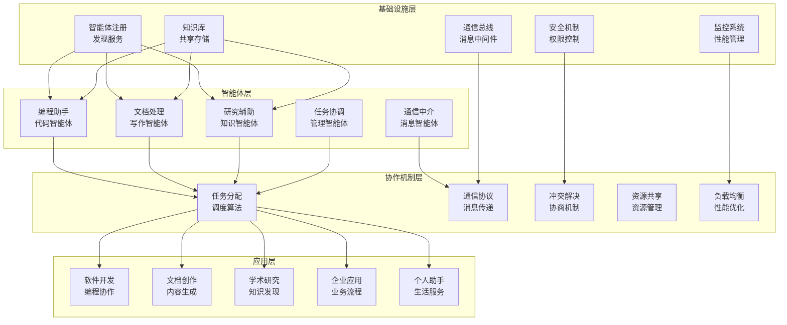

# 第18章：多智能体系统与应用实战

> **设计思想**：掌握多智能体协作模式，构建复杂的AI应用生态系统

## 章节概述

多智能体系统（Multi-Agent System, MAS）是由多个相互作用的智能体组成的系统，这些智能体能够通过协作、竞争或协商来解决复杂问题。在现代AI应用中，单一智能体往往难以满足复杂任务的需求，而多智能体系统通过分工协作能够实现更强大的功能。

本章将深入探讨多智能体系统的核心技术，包括协作模式、通信机制、任务分配和协调策略等，并通过多个实际应用案例帮助读者掌握构建复杂AI应用生态系统的方法。

## 学习目标

完成本章学习后，你将：

- ✅ **理解多智能体系统原理**：掌握多智能体系统的基本概念和架构设计
- ✅ **掌握协作模式**：学会实现不同类型的智能体协作机制
- ✅ **实现通信机制**：掌握智能体间的通信和信息交换技术
- ✅ **构建任务分配系统**：理解任务分解和智能体任务分配策略
- ✅ **掌握协调策略**：学会实现智能体间的协调和冲突解决
- ✅ **具备应用开发能力**：能够开发复杂的多智能体应用系统

## 章节内容

### 18.1 多智能体协作模式
**学习重点**：理解不同类型的智能体协作模式
- 集中式vs分布式协作架构
- 主从式协作模式
- 对等式协作模式
- 联盟式协作模式
- 协作模式的选择和优化

### 18.2 AI编程助手：Cursor智能体
**学习重点**：构建AI编程助手应用
- 代码理解智能体的设计
- 代码生成和优化智能体
- 代码审查和测试智能体
- 编程助手的协作机制
- 开发效率提升策略

### 18.3 手稿智能体：文档理解与生成
**学习重点**：实现文档处理智能体系统
- 文档解析和理解智能体
- 内容生成和编辑智能体
- 格式转换和排版智能体
- 文档协作和版本控制
- 文档质量评估和优化

### 18.4 深度研究智能体：知识发现系统
**学习重点**：构建知识发现和研究辅助系统
- 文献检索和筛选智能体
- 知识提取和整理智能体
- 趋势分析和预测智能体
- 研究报告生成智能体
- 知识图谱构建和维护

### 18.5 智能体生态：构建AI应用的未来
**学习重点**：设计和实现智能体生态系统
- 智能体市场的概念和实现
- 智能体发现和组合机制
- 动态任务分配和负载均衡
- 智能体性能监控和优化
- 生态系统的扩展性和可维护性

## 技术架构图

## 实践项目

**项目名称**：智能体协作开发平台

**项目目标**：
- 实现多智能体协作开发环境
- 构建编程助手、文档助手和研究助手的协作机制
- 开发任务分配和协调系统
- 实现智能体间的通信和信息共享
- 构建可扩展的智能体生态系统

**技术要求**：
- 代码质量：完整注释、单元测试覆盖率>90%
- 功能完整性：支持多种类型智能体的协作和通信
- 性能要求：智能体响应时间<200ms，任务分配时间<500ms
- 可扩展性：支持动态添加和移除智能体
- 易用性：提供简洁的API和可视化管理界面

**预期成果**：
- 可运行的完整多智能体协作平台
- 详细的性能测试报告和扩展性分析
- 多种智能体应用的实现和集成
- 技术文档和使用说明
- 智能体生态系统的架构设计

## 本章小结

第18章将为读者建立起多智能体系统和应用实战的完整知识体系，从基本概念到核心技术，再到实际应用的全面覆盖。通过本章的学习，读者将具备独立设计和开发复杂多智能体应用系统的能力，为构建更加智能和强大的AI应用生态系统奠定坚实基础。

---

**全书总结**：我们即将完成《Java程序员的AI之路》的学习，回顾整个学习历程并展望AI技术的未来发展。