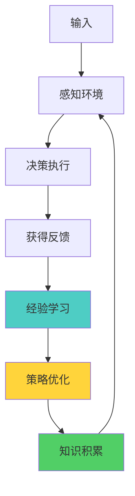
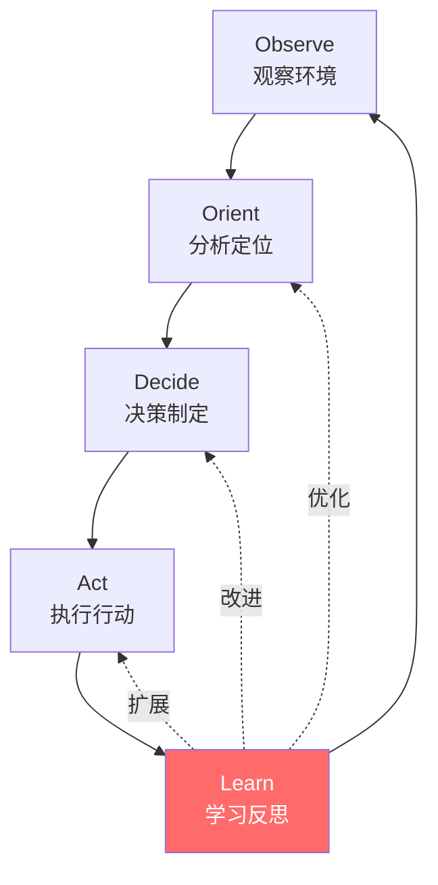
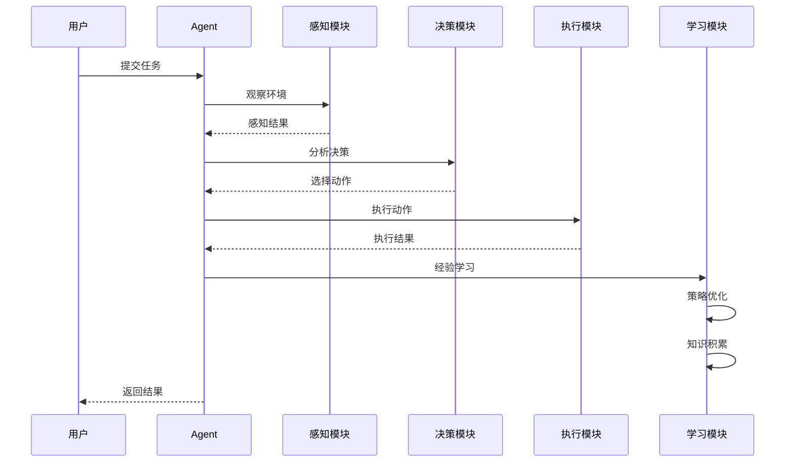
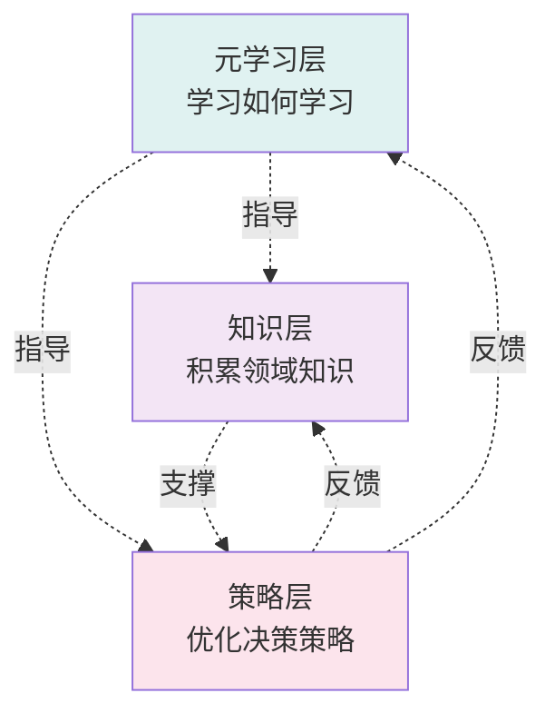
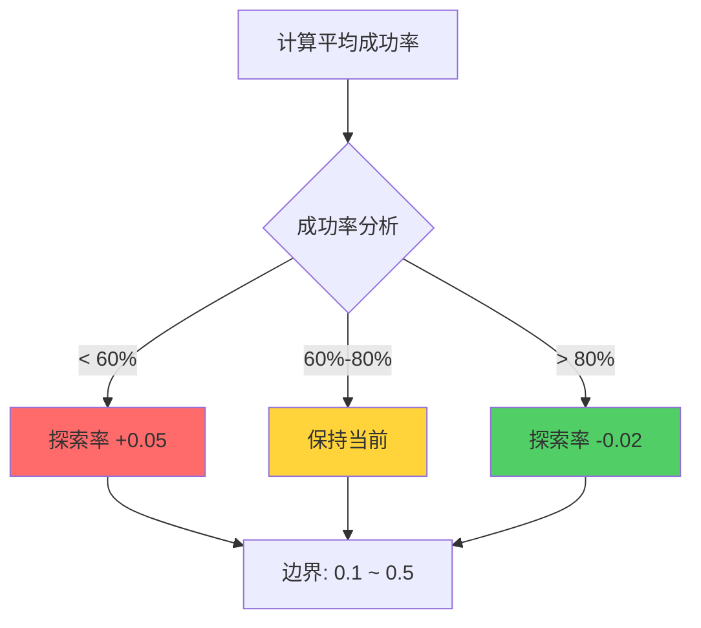
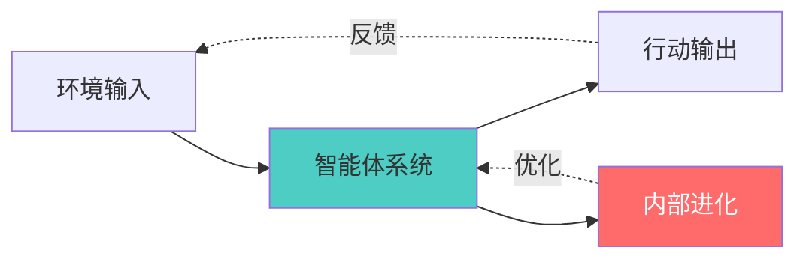

# 19.1 自进化智能体原理 - 理论基础与设计思想

> **从人类学习到AI自进化**

## 引言

想象一下,一个刚出生的婴儿如何学会走路:最初他会不断尝试和失败,但每一次跌倒都在积累经验,逐渐掌握平衡和协调。几个月后,他不仅能稳步行走,甚至能跑能跳。这就是学习的力量。

传统AI系统像是"程序化机器",而自进化智能体则像"成长中的生命":



本节将深入探讨自进化智能体的核心原理,帮助你理解从"被动执行"到"主动学习"的跨越。

## 核心概念

### 什么是自进化智能体?

**定义**: 自进化智能体(Self-Evolving Agent)是一种能够通过与环境交互,从经验中学习,持续优化策略,积累知识,最终实现自我提升的智能系统。

**核心特征**:
- 🧠 **自学习能力**: 从经验中提取知识,自动发现规律
- 🔄 **自适应能力**: 动态调整策略,适应环境变化
- ⚡ **自优化能力**: 持续提升性能,淘汰低效策略
- 💡 **自反思能力**: 分析成功失败,生成改进建议

### 自学习、自适应、自进化的区别

| 能力层次 | 定义 | 示例 |
|---------|------|------|
| **自学习** | 从数据/经验中获取知识 | 识别哪些策略有效 |
| **自适应** | 根据环境变化调整行为 | 根据用户反馈调整方式 |
| **自进化** | 持续优化并提升整体能力 | 发现新工具组合,创建新策略 |

**演进路径**:
1. 自学习: "我知道了什么有效"
2. 自适应: "我根据情况调整行为"
3. 自进化: "我创造了更好的方法"

### 为什么需要自进化?

传统AI系统的局限性:

| 问题 | 传统方式 | 自进化方式 |
|------|----------|------------|
| **适应性差** | 固定规则,环境变化失效 | 动态学习,持续适应 |
| **扩展困难** | 人工编写新规则 | 自动发现新策略 |
| **无法优化** | 性能固化 | 持续改进 |
| **缺乏个性化** | 通用方案 | 适应每个场景 |

## 核心架构设计

### OODA-L循环:感知-学习闭环

我们扩展军事战略中的OODA循环为**OODA-L循环**(Learn):



**各阶段详解**:

**1. Observe (观察环境)**
- 接收任务输入
- 分析当前上下文
- 检索相关历史经验

**2. Orient (分析定位)**
- 匹配适用策略
- 评估可用工具
- 建立决策上下文

**3. Decide (决策制定)**
- 探索vs利用权衡
- 选择最佳策略/工具
- 生成执行计划

**4. Act (执行行动)**
- 调用工具执行
- 记录执行过程
- 收集反馈

**5. Learn (学习反思)**
- 记录完整经验
- 更新策略成功率
- 更新知识图谱
- 触发反思分析

### 完整工作流程



### 多层次学习架构

自进化智能体实现三个层次的学习:



| 学习层次 | 学习内容 | 更新频率 | 示例 |
|---------|---------|---------|------|
| **策略层** | 哪些策略有效 | 每次任务 | "search→analyze" 成功率85% |
| **知识层** | 领域概念和关联 | 每次任务 | "机器学习" is_a "人工智能" |
| **元学习层** | 如何优化学习过程 | 每10-20个任务 | "性能下降→增加探索率" |

## 探索-利用平衡策略

### 问题背景

这是强化学习中的经典难题,类比"餐厅点菜困境":
- **利用 (Exploitation)**: 点自己知道好吃的菜 → 稳定但可能错过更好选择
- **探索 (Exploration)**: 尝试没点过的新菜 → 可能发现惊喜但也可能踩雷

### 动态探索率算法

采用**性能驱动的动态探索率**:



**代码实现**:

```java
public void adjustExplorationRate(double avgSuccessRate) {
    if (avgSuccessRate < 0.6) {
        // 表现不佳,增加探索
        explorationRate += 0.05;
    } else if (avgSuccessRate > 0.8) {
        // 表现优秀,减少探索
        explorationRate -= 0.02;
    }
    // 边界限制: [0.1, 0.5]
    explorationRate = Math.max(0.1, Math.min(0.5, explorationRate));
}
```

### 决策算法

```java
public Decision makeDecision(List<Strategy> strategies) {
    if (Math.random() < explorationRate) {
        // 探索: 尝试新方法
        return explore(strategies);
    } else {
        // 利用: 使用最佳策略
        return exploit(strategies);
    }
}

private Decision exploit(List<Strategy> strategies) {
    return strategies.stream()
        .max(Comparator.comparing(Strategy::getSuccessRate))
        .map(Decision::new)
        .orElseThrow();
}
```

### 探索率演进示例

| 阶段 | 任务范围 | 平均成功率 | 探索率 | 状态 |
|------|---------|------------|--------|------|
| 冷启动 | 1-10 | 45% | 0.3→0.35 | 频繁探索,快速学习 |
| 快速成长 | 11-20 | 62% | 0.35→0.28 | 开始稳定,逐步利用 |
| 稳定提升 | 21-30 | 75% | 0.28→0.22 | 策略有效,减少探索 |
| 成熟运行 | 31-40 | 85% | 0.22→0.15 | 以利用为主 |
| 持续优化 | 41+ | 88% | 0.15 | 保持10%基线探索 |

## 设计理念与技术选型

### 设计原则

**1. 增量式学习**

不依赖大规模训练数据,每次任务都是学习机会。

优势:
- ✅ 无需预训练阶段
- ✅ 适应性强
- ✅ 持续改进

**2. 经验驱动**

所有学习都基于真实的任务执行经验:

```java
Experience exp = new Experience(
    task,           // 做了什么
    context,        // 在什么情况下
    action,         // 采取了什么行动
    result,         // 结果如何
    success,        // 是否成功
    reward,         // 质量评分
    timestamp,      // 什么时候
    reflection      // 反思和洞察
);
```

**3. 多维度优化**

全方位提升:策略质量、知识深度、自我认知、用户体验

**4. 优雅降级**

确保系统在各种情况下都能稳定运行,LLM失效时自动回退到规则系统。

### 技术选型理由

**为什么选择Java?**

| 考虑因素 | Java优势 |
|---------|---------|
| **生态成熟** | 丰富的企业级框架 |
| **类型安全** | 编译期错误检测 |
| **性能表现** | JVM优化,多线程优势 |
| **工程实践** | 易于大规模团队协作 |

**为什么选择内存存储?**

- 快速原型: 无需配置数据库
- 性能优先: 内存访问最快
- 简化部署: 单一JAR包
- 易于扩展: 后续可替换持久化方案

**为什么设计LLM模拟器?**

统一接口,实现可替换:

```java
public interface LLMInterface {
    String reason(String prompt);
}

// 模拟实现 - 用于学习和测试
public class EvolLLMSimulator implements LLMInterface {
    // 基于规则的模拟推理
}

// 真实实现 - 用于生产环境
public class RealLLMClient implements LLMInterface {
    // 调用GPT/Claude API
}
```

## 技术原理深化

### 强化学习的启发

自进化智能体借鉴了强化学习的核心思想:

| 强化学习概念 | 自进化智能体实现 |
|-------------|-----------------|
| State (状态) | context (上下文) |
| Action (动作) | tool execution (工具执行) |
| Reward (奖励) | success + quality score |
| Policy (策略) | Strategy with successRate |
| Exploration | 动态探索率机制 |

**关键区别**:

| 维度 | 传统强化学习 | 自进化智能体 |
|------|-------------|-------------|
| 训练方式 | 大量episode训练 | 每次任务即学习 |
| 状态空间 | 通常离散/有限 | 开放式上下文 |
| 奖励设计 | 需精心设计 | 成功/失败 + 质量 |
| 泛化能力 | 特定环境 | 跨任务泛化 |

### 认知科学的启发

借鉴人类认知模型:

| 人类认知 | 自进化智能体 |
|---------|-------------|
| 感知 | Observe |
| 注意 | Orient |
| 思考+决策 | Decide |
| 行动 | Act |
| 记忆+反思 | Learn + Reflect |

### 系统论的启发

智能体作为一个**开放系统**:



**特征**:
- 与环境交互: 开放性
- 内部进化: 自组织性
- 适应变化: 动态性
- 持续优化: 目的性

## 实践指南

### 冷启动策略

**第1-10个任务**:

1. **高探索率**: 设置0.3-0.5
2. **广泛尝试**: 每个工具都试一遍
3. **细致记录**: 详细记录上下文和结果
4. **快速反馈**: 及时评估每次执行

```java
// 初始化配置
SelfEvolvingAgent agent = new SelfEvolvingAgent(
    0.1,        // learningRate
    0.4,        // explorationRate (高探索)
    1000        // memorySize
);
```

### 成长期策略

**第11-50个任务**:

1. **逐步降低探索率**: 从0.4降到0.2
2. **策略优化**: 每10个任务触发自进化
3. **知识整合**: 构建领域知识图谱
4. **反思总结**: 分析成功和失败模式

### 成熟期策略

**第50+个任务**:

1. **保持基线探索**: 维持10%-15%
2. **定期进化**: 每20个任务自进化一次
3. **持续监控**: 关注性能指标变化
4. **能力扩展**: 创建高级组合工具

## 常见问题

**Q1: 探索率多久调整一次?**

A: 每完成10个任务计算一次平均成功率,然后调整探索率。

**Q2: 如何评估"成功"?**

A: 多维度评估:
- 任务是否完成(二值)
- 结果质量评分(0-1)
- 用户满意度(可选)

**Q3: 经验库会不会无限增长?**

A: 不会,设置了memorySize限制,超出时清理低价值经验。

**Q4: 如何避免遗忘重要经验?**

A: 基于重要性保留:
- 高奖励经验
- 近期经验
- 罕见场景经验
- 被频繁引用的经验

## 小结

本节介绍了自进化智能体的核心原理:

**关键要点**:

1. **OODA-L循环**: 观察→定位→决策→行动→学习的闭环
2. **探索-利用平衡**: 动态调整探索率,平衡稳定性和创新性
3. **多层次学习**: 策略层、知识层、元学习层协同进化
4. **设计原则**: 增量式学习、经验驱动、多维优化、优雅降级

**核心价值**:

自进化智能体将AI系统从"被动执行工具"提升为"主动学习伙伴",能够:
- 从经验中持续学习
- 适应环境变化
- 自我优化提升
- 积累领域知识

下一节,我们将深入探讨自进化智能体的第一个核心模块:**经验记录与管理系统**,了解如何完整记录、高效检索和智能管理经验数据。

---

**思考题**:

1. 如果你要设计一个自进化的代码审查助手,初始探索率应该设置为多少?为什么?
2. 在什么情况下应该增加探索率?在什么情况下应该减少?
3. 除了成功率,还可以用哪些指标来评估智能体的性能?
