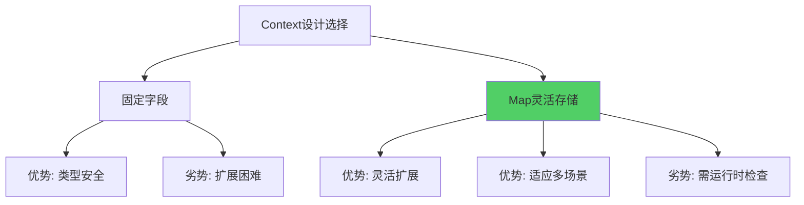
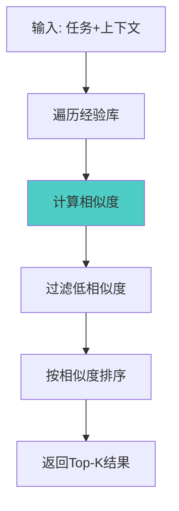
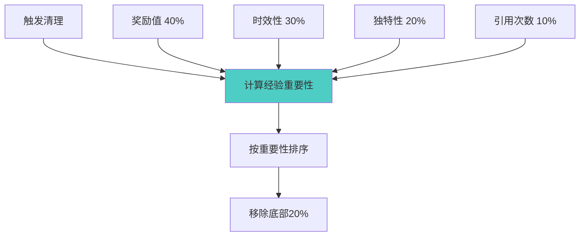

# 19.2 经验记录与管理 - 从过去中学习

> **记忆是学习的基础**

## 引言

人类的学习离不开记忆。我们记住成功的经验以便重复,记住失败的教训以便避免。智能体也是如此。

一个没有记忆的智能体就像患有健忘症的人,每次都从零开始,永远无法成长。而一个拥有完善经验管理系统的智能体,则能够:
- 📝 完整记录每次任务的执行细节
- 🔍 快速检索相似的历史经验
- 📊 分析经验模式发现规律
- 🧹 智能清理无用的冗余数据

本节将深入探讨如何设计和实现一个高效的经验记录与管理系统。

## Experience数据结构设计

### 核心字段设计

Experience类是经验系统的基石,需要记录任务执行的完整信息:

```java
public class Experience {
    private String task;                    // 任务描述
    private Map<String, Object> context;    // 上下文信息
    private String action;                  // 执行的动作
    private Object result;                  // 执行结果
    private boolean success;                // 是否成功
    private double reward;                  // 奖励值(0-1)
    private long timestamp;                 // 时间戳
    private String reflection;              // 反思内容
}
```

**字段说明**:

| 字段 | 类型 | 作用 | 示例 |
|------|------|------|------|
| task | String | 任务描述,用于快速匹配 | "搜索机器学习相关资料" |
| context | Map | 执行时的环境状态 | {domain: "AI", difficulty: "medium"} |
| action | String | 具体执行的动作 | "search_web" |
| result | Object | 执行结果 | 搜索到的文章列表 |
| success | boolean | 成功标志 | true |
| reward | double | 质量评分(0-1) | 0.85 |
| timestamp | long | 记录时间 | 1697123456789 |
| reflection | String | 反思和洞察 | "搜索关键词需要更精确" |

### 完整实现

```java
public class Experience {
    private String task;
    private Map<String, Object> context;
    private String action;
    private Object result;
    private boolean success;
    private double reward;
    private long timestamp;
    private String reflection;
    
    // 构造函数
    public Experience(String task, Map<String, Object> context,
                     String action, Object result, boolean success,
                     double reward) {
        this.task = task;
        this.context = new HashMap<>(context);
        this.action = action;
        this.result = result;
        this.success = success;
        this.reward = reward;
        this.timestamp = System.currentTimeMillis();
        this.reflection = "";
    }
    
    /**
     * 计算与另一个经验的相似度
     */
    public double similarityWith(Experience other) {
        double similarity = 0.0;
        
        // 1. 任务描述相似度 (权重40%)
        similarity += 0.4 * taskSimilarity(this.task, other.task);
        
        // 2. 上下文相似度 (权重60%)
        similarity += 0.6 * contextSimilarity(this.context, other.context);
        
        return similarity;
    }
    
    /**
     * 任务描述相似度(基于关键词重叠)
     */
    private double taskSimilarity(String task1, String task2) {
        Set<String> words1 = extractKeywords(task1);
        Set<String> words2 = extractKeywords(task2);
        
        Set<String> intersection = new HashSet<>(words1);
        intersection.retainAll(words2);
        
        Set<String> union = new HashSet<>(words1);
        union.addAll(words2);
        
        return union.isEmpty() ? 0.0 : 
               (double) intersection.size() / union.size();
    }
    
    /**
     * 上下文相似度(基于共同字段)
     */
    private double contextSimilarity(Map<String, Object> ctx1,
                                     Map<String, Object> ctx2) {
        if (ctx1.isEmpty() && ctx2.isEmpty()) return 1.0;
        if (ctx1.isEmpty() || ctx2.isEmpty()) return 0.0;
        
        Set<String> allKeys = new HashSet<>(ctx1.keySet());
        allKeys.addAll(ctx2.keySet());
        
        int matchCount = 0;
        for (String key : allKeys) {
            if (ctx1.containsKey(key) && ctx2.containsKey(key)) {
                if (Objects.equals(ctx1.get(key), ctx2.get(key))) {
                    matchCount++;
                }
            }
        }
        
        return (double) matchCount / allKeys.size();
    }
    
    /**
     * 提取关键词
     */
    private Set<String> extractKeywords(String text) {
        return Arrays.stream(text.toLowerCase()
                .split("[\\s,\\.;:!?]+"))
                .filter(w -> w.length() > 2)
                .collect(Collectors.toSet());
    }
    
    // Getters and Setters
    // ...
}
```

### 设计考量

**为什么使用Map存储context?**



选择Map的原因:
- ✅ 不同任务的上下文字段差异大
- ✅ 易于扩展,无需修改类定义
- ✅ 支持动态场景

## 经验检索算法

### 相似经验查找

经验检索是经验管理的核心功能,目标是找到与当前任务最相关的历史经验。

**检索流程**:



**实现代码**:

```java
public class ExperienceManager {
    private List<Experience> experiences;
    private final int memorySize;
    
    public ExperienceManager(int memorySize) {
        this.experiences = Collections.synchronizedList(new ArrayList<>());
        this.memorySize = memorySize;
    }
    
    /**
     * 查找相似经验
     * @param task 当前任务
     * @param context 当前上下文
     * @param topK 返回数量
     * @return 相似经验列表
     */
    public List<Experience> findSimilar(String task,
                                       Map<String, Object> context,
                                       int topK) {
        // 创建临时经验用于比较
        Experience current = new Experience(task, context, "", null, false, 0.0);
        
        return experiences.stream()
            .map(exp -> new ScoredExperience(
                exp,
                current.similarityWith(exp)
            ))
            .filter(se -> se.score > 0.3)  // 过滤相似度阈值
            .sorted(Comparator.comparing(ScoredExperience::getScore).reversed())
            .limit(topK)
            .map(ScoredExperience::getExperience)
            .collect(Collectors.toList());
    }
    
    /**
     * 辅助类: 带评分的经验
     */
    private static class ScoredExperience {
        Experience experience;
        double score;
        
        ScoredExperience(Experience experience, double score) {
            this.experience = experience;
            this.score = score;
        }
        
        Experience getExperience() { return experience; }
        double getScore() { return score; }
    }
}
```

### 检索优化策略

**1. 分类索引**

将经验按类别建立索引,加速检索:

```java
// 按任务类型分组
Map<String, List<Experience>> typeIndex = new HashMap<>();

public void buildIndex() {
    experiences.forEach(exp -> {
        String type = extractTaskType(exp.getTask());
        typeIndex.computeIfAbsent(type, k -> new ArrayList<>())
                 .add(exp);
    });
}

public List<Experience> findSimilarFast(String task, 
                                       Map<String, Object> context,
                                       int topK) {
    String type = extractTaskType(task);
    List<Experience> candidates = typeIndex.getOrDefault(type, experiences);
    
    // 只在候选集中搜索
    return findSimilarInList(candidates, task, context, topK);
}
```

**2. 时间窗口过滤**

优先检索近期经验:

```java
public List<Experience> findRecentSimilar(String task,
                                         Map<String, Object> context,
                                         int topK,
                                         long timeWindow) {
    long cutoffTime = System.currentTimeMillis() - timeWindow;
    
    return experiences.stream()
        .filter(exp -> exp.getTimestamp() > cutoffTime)
        .map(exp -> new ScoredExperience(exp, calculateSimilarity(exp)))
        .sorted(Comparator.comparing(ScoredExperience::getScore).reversed())
        .limit(topK)
        .map(ScoredExperience::getExperience)
        .collect(Collectors.toList());
}
```

**3. 成功经验优先**

优先返回成功的经验:

```java
public List<Experience> findSuccessfulSimilar(String task,
                                              Map<String, Object> context,
                                              int topK) {
    return experiences.stream()
        .filter(Experience::isSuccess)  // 只要成功的
        .map(exp -> new ScoredExperience(exp, calculateSimilarity(exp)))
        .sorted(Comparator.comparing(ScoredExperience::getScore).reversed())
        .limit(topK)
        .map(ScoredExperience::getExperience)
        .collect(Collectors.toList());
}
```

## 经验库管理策略

### 添加经验

```java
/**
 * 添加新经验
 */
public void addExperience(Experience experience) {
    synchronized (experiences) {
        experiences.add(experience);
        
        // 超出容量限制时清理
        if (experiences.size() > memorySize) {
            cleanup();
        }
    }
}
```

### 智能清理策略

当经验库满时,需要清理低价值经验:



**重要性评分算法**:

```java
/**
 * 计算经验重要性
 */
private double calculateImportance(Experience exp) {
    double score = 0.0;
    
    // 1. 奖励值 (40%)
    score += 0.4 * exp.getReward();
    
    // 2. 时效性 (30%)
    long age = System.currentTimeMillis() - exp.getTimestamp();
    long maxAge = 30L * 24 * 60 * 60 * 1000; // 30天
    double recency = Math.max(0, 1.0 - (double) age / maxAge);
    score += 0.3 * recency;
    
    // 3. 独特性 (20%)
    double uniqueness = calculateUniqueness(exp);
    score += 0.2 * uniqueness;
    
    // 4. 引用次数 (10%)
    int refCount = getReferenceCount(exp);
    double popularity = Math.min(1.0, refCount / 10.0);
    score += 0.1 * popularity;
    
    return score;
}

/**
 * 执行清理
 */
private void cleanup() {
    // 计算所有经验的重要性
    List<ScoredExperience> scored = experiences.stream()
        .map(exp -> new ScoredExperience(exp, calculateImportance(exp)))
        .sorted(Comparator.comparing(ScoredExperience::getScore))
        .collect(Collectors.toList());
    
    // 移除底部20%
    int removeCount = (int) (experiences.size() * 0.2);
    for (int i = 0; i < removeCount; i++) {
        experiences.remove(scored.get(i).getExperience());
    }
    
    System.out.println("清理了 " + removeCount + " 条低价值经验");
}
```

### 经验统计

```java
/**
 * 获取经验统计信息
 */
public Map<String, Object> getStatistics() {
    Map<String, Object> stats = new HashMap<>();
    
    stats.put("total", experiences.size());
    stats.put("successful", experiences.stream()
        .filter(Experience::isSuccess)
        .count());
    stats.put("averageReward", experiences.stream()
        .mapToDouble(Experience::getReward)
        .average()
        .orElse(0.0));
    stats.put("oldestTimestamp", experiences.stream()
        .mapToLong(Experience::getTimestamp)
        .min()
        .orElse(0L));
    
    return stats;
}
```

## 经验序列化与持久化

### 序列化设计

支持将经验保存到文件:

```java
/**
 * 保存经验到文件
 */
public void saveToFile(String filepath) throws IOException {
    try (ObjectOutputStream oos = new ObjectOutputStream(
            new FileOutputStream(filepath))) {
        oos.writeObject(new ArrayList<>(experiences));
    }
}

/**
 * 从文件加载经验
 */
@SuppressWarnings("unchecked")
public void loadFromFile(String filepath) throws IOException, 
                                                 ClassNotFoundException {
    try (ObjectInputStream ois = new ObjectInputStream(
            new FileInputStream(filepath))) {
        List<Experience> loaded = (List<Experience>) ois.readObject();
        experiences.clear();
        experiences.addAll(loaded);
    }
}
```

### JSON格式支持

更易读的JSON格式:

```java
/**
 * 导出为JSON
 */
public String toJson() {
    StringBuilder json = new StringBuilder("[");
    for (int i = 0; i < experiences.size(); i++) {
        if (i > 0) json.append(",");
        json.append(experiences.get(i).toJson());
    }
    json.append("]");
    return json.toString();
}
```

## 实践案例

### 案例1: 学习助手的经验积累

```java
ExperienceManager manager = new ExperienceManager(1000);

// 第1次任务: 解释机器学习概念
Map<String, Object> context1 = new HashMap<>();
context1.put("topic", "machine_learning");
context1.put("difficulty", "beginner");

Experience exp1 = new Experience(
    "解释什么是机器学习",
    context1,
    "provide_simple_explanation",
    "机器学习是让计算机从数据中学习的技术",
    true,
    0.9
);
manager.addExperience(exp1);

// 第10次任务: 又遇到类似问题
Map<String, Object> context2 = new HashMap<>();
context2.put("topic", "machine_learning");
context2.put("difficulty", "beginner");

List<Experience> similar = manager.findSimilar(
    "机器学习是什么",
    context2,
    3
);

// 找到了第1次的经验,可以复用成功的解释方式
System.out.println("找到 " + similar.size() + " 条相似经验");
```

### 案例2: 经验库演进


## 性能分析

### 时间复杂度

| 操作 | 复杂度 | 说明 |
|------|--------|------|
| 添加经验 | O(1) | 直接追加 |
| 查找相似 | O(n) | 遍历所有经验 |
| 清理 | O(n log n) | 排序+删除 |

### 空间优化

**经验压缩**:

```java
// 对于结果很大的经验,只保留摘要
if (result.toString().length() > 1000) {
    exp.setResult(result.toString().substring(0, 1000) + "...");
}
```

## 小结

本节介绍了经验记录与管理系统的设计与实现:

**关键要点**:

1. **Experience数据结构**: 完整记录任务执行的所有关键信息
2. **相似度计算**: 基于任务描述和上下文的多维度匹配
3. **检索优化**: 分类索引、时间窗口、成功经验优先
4. **智能清理**: 基于重要性评分的自动清理机制
5. **持久化支持**: 序列化和JSON格式存储

**核心价值**:

经验管理系统是自进化智能体的"记忆中枢",使智能体能够:
- 从过去的成功中学习最佳实践
- 从过去的失败中吸取教训
- 快速找到相关经验指导当前决策
- 持续积累知识不断成长

下一节,我们将探讨**策略学习与优化系统**,了解如何基于经验动态优化决策策略。

---

**思考题**:

1. 如何设计经验的"遗忘曲线",让久未使用的经验逐渐降低权重?
2. 如果要支持跨会话的经验共享,需要考虑哪些问题?
3. 除了相似度,还可以用哪些维度来检索经验?
