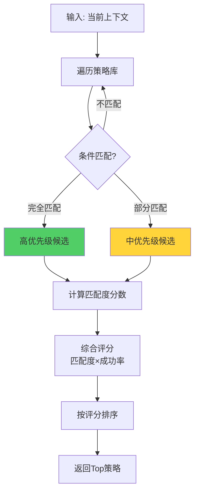
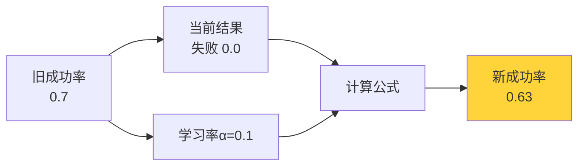
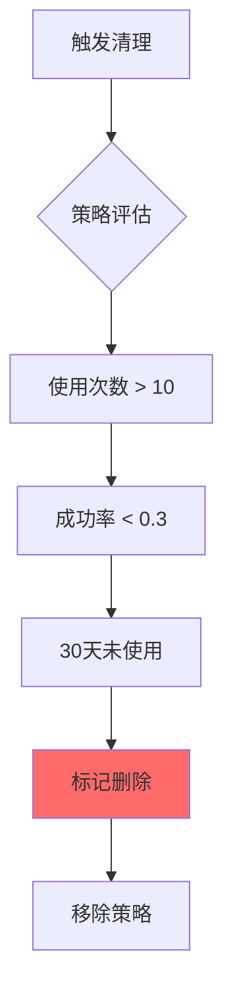
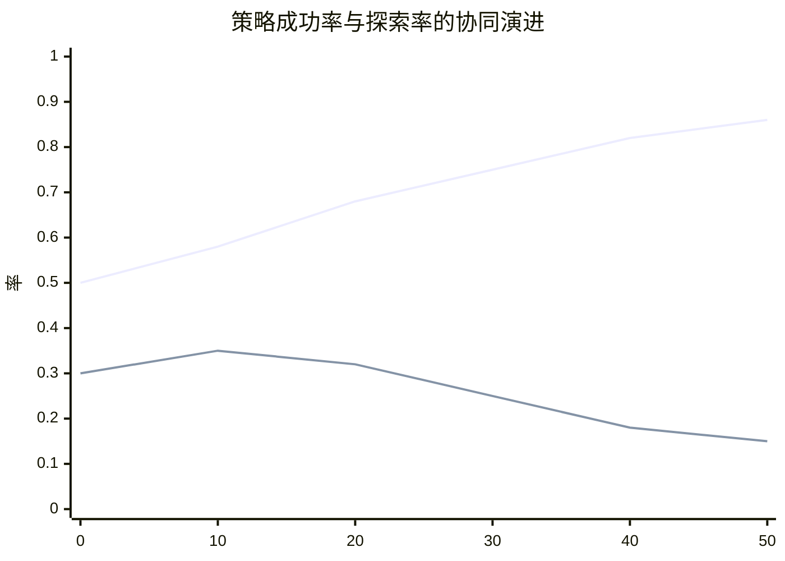

# 19.3 策略学习与优化 - 智能决策的进化

> **策略是智能的核心**

## 引言

如果说经验是智能体的"记忆",那么策略就是智能体的"武器库"。每个策略代表在特定情境下的最佳行动方案。

想象一个象棋大师:他不是记住每一局棋的每一步,而是掌握了在各种局面下的应对策略——"中局控制中心"、"残局兑子简化"等。这些策略在无数实战中不断打磨,成功率越来越高。

自进化智能体的策略系统也是如此:
- 📋 维护一套动态的策略库
- 📈 跟踪每个策略的成功率
- 🔄 根据实战表现持续优化
- 🗑️ 淘汰低效策略,保留精华
- ✨ 创造新的组合策略

本节将深入探讨策略的设计、匹配、更新和进化机制。

## Strategy数据结构设计

### 核心字段

```java
public class Strategy {
    private String name;                        // 策略名称
    private String description;                 // 策略描述
    private Map<String, Object> conditions;     // 适用条件
    private List<String> actions;               // 动作序列
    private double successRate;                 // 成功率
    private int usageCount;                     // 使用次数
    private long lastUsedTime;                  // 最后使用时间
}
```

**字段说明**:

| 字段 | 类型 | 作用 | 示例 |
|------|------|------|------|
| name | String | 策略唯一标识 | "search_then_analyze" |
| description | String | 可读性描述 | "先搜索信息再分析" |
| conditions | Map | 适用条件(上下文匹配) | {task_type: "research"} |
| actions | List | 执行步骤 | ["search", "analyze"] |
| successRate | double | 成功率(0-1) | 0.85 |
| usageCount | int | 使用次数 | 42 |
| lastUsedTime | long | 最后使用时间戳 | 1697123456789 |

### 完整实现

```java
public class Strategy {
    private String name;
    private String description;
    private Map<String, Object> conditions;
    private List<String> actions;
    private double successRate;
    private int usageCount;
    private long lastUsedTime;
    
    public Strategy(String name, String description,
                   Map<String, Object> conditions,
                   List<String> actions) {
        this.name = name;
        this.description = description;
        this.conditions = new HashMap<>(conditions);
        this.actions = new ArrayList<>(actions);
        this.successRate = 0.5;  // 初始成功率50%
        this.usageCount = 0;
        this.lastUsedTime = 0;
    }
    
    /**
     * 检查策略是否适用于当前上下文
     */
    public boolean isApplicable(Map<String, Object> context) {
        if (conditions.isEmpty()) {
            return true;  // 无条件策略总是适用
        }
        
        // 计算匹配度
        int matchCount = 0;
        for (Map.Entry<String, Object> entry : conditions.entrySet()) {
            String key = entry.getKey();
            Object expectedValue = entry.getValue();
            
            if (context.containsKey(key)) {
                Object actualValue = context.get(key);
                if (Objects.equals(expectedValue, actualValue)) {
                    matchCount++;
                }
            }
        }
        
        // 至少匹配50%的条件
        return matchCount >= conditions.size() * 0.5;
    }
    
    /**
     * 计算与上下文的匹配度
     */
    public double matchScore(Map<String, Object> context) {
        if (conditions.isEmpty()) {
            return 0.5;  // 通用策略基准分
        }
        
        int matchCount = 0;
        for (Map.Entry<String, Object> entry : conditions.entrySet()) {
            if (context.containsKey(entry.getKey()) &&
                Objects.equals(entry.getValue(), context.get(entry.getKey()))) {
                matchCount++;
            }
        }
        
        return (double) matchCount / conditions.size();
    }
    
    /**
     * 记录一次使用
     */
    public void recordUsage() {
        this.usageCount++;
        this.lastUsedTime = System.currentTimeMillis();
    }
    
    // Getters and Setters
    public String getName() { return name; }
    public double getSuccessRate() { return successRate; }
    public void setSuccessRate(double rate) { this.successRate = rate; }
    public int getUsageCount() { return usageCount; }
    public List<String> getActions() { return new ArrayList<>(actions); }
}
```

## 策略匹配机制

### 匹配流程



### 实现代码

```java
public class StrategyManager {
    private Map<String, Strategy> strategies;
    
    public StrategyManager() {
        this.strategies = new ConcurrentHashMap<>();
        initializeDefaultStrategies();
    }
    
    /**
     * 查找适用的策略
     */
    public List<Strategy> findApplicable(Map<String, Object> context) {
        return strategies.values().stream()
            .filter(s -> s.isApplicable(context))
            .sorted(Comparator.comparing((Strategy s) -> 
                s.matchScore(context) * s.getSuccessRate())
                .reversed())
            .collect(Collectors.toList());
    }
    
    /**
     * 选择最佳策略
     */
    public Strategy selectBest(Map<String, Object> context) {
        List<Strategy> applicable = findApplicable(context);
        
        if (applicable.isEmpty()) {
            return getDefaultStrategy();
        }
        
        // 返回综合评分最高的
        return applicable.get(0);
    }
    
    /**
     * 初始化默认策略
     */
    private void initializeDefaultStrategies() {
        // 策略1: 搜索-分析
        addStrategy(new Strategy(
            "search_analyze",
            "先搜索信息再分析",
            Map.of("task_type", "research"),
            List.of("search", "analyze")
        ));
        
        // 策略2: 直接计算
        addStrategy(new Strategy(
            "direct_compute",
            "直接计算结果",
            Map.of("task_type", "calculation"),
            List.of("calculate")
        ));
        
        // 策略3: 查询-总结
        addStrategy(new Strategy(
            "query_summarize",
            "查询数据后总结",
            Map.of("task_type", "summary"),
            List.of("query", "summarize")
        ));
    }
}
```

## 成功率更新算法

### 指数移动平均 (EMA)

采用EMA算法平滑更新成功率,避免过度反应单次结果:

```
newSuccessRate = (1 - α) × oldSuccessRate + α × currentResult
```

其中:
- α: 学习率 (learningRate),默认0.1
- currentResult: 本次结果 (1.0成功, 0.0失败)

**原理图**:



### 实现代码

```java
/**
 * 更新策略成功率
 */
public void updateSuccessRate(String strategyName, boolean success) {
    Strategy strategy = strategies.get(strategyName);
    if (strategy == null) {
        return;
    }
    
    double currentResult = success ? 1.0 : 0.0;
    double oldRate = strategy.getSuccessRate();
    
    // 指数移动平均
    double newRate = (1 - learningRate) * oldRate + 
                     learningRate * currentResult;
    
    strategy.setSuccessRate(newRate);
    strategy.recordUsage();
    
    System.out.println(String.format(
        "策略 [%s] 成功率: %.2f -> %.2f",
        strategyName, oldRate, newRate
    ));
}
```

### 学习率选择

| 学习率 | 特点 | 适用场景 |
|--------|------|----------|
| 0.05 | 慢速学习,稳定 | 环境稳定,长期运行 |
| 0.1 | 平衡(推荐) | 一般场景 |
| 0.3 | 快速响应 | 环境动态变化 |

**演进示例**:

```java
// 模拟策略成功率演进
Strategy s = new Strategy("test", "测试", Map.of(), List.of("action"));
s.setSuccessRate(0.5);

// 连续5次成功
for (int i = 0; i < 5; i++) {
    updateSuccessRate("test", true);
}
// 成功率: 0.5 -> 0.55 -> 0.60 -> 0.64 -> 0.67 -> 0.70

// 连续3次失败
for (int i = 0; i < 3; i++) {
    updateSuccessRate("test", false);
}
// 成功率: 0.70 -> 0.63 -> 0.57 -> 0.51
```

## 策略生成与淘汰

### 策略生成机制

发现高频成功的动作组合,自动创建新策略:

```java
/**
 * 分析经验,发现新策略
 */
public void discoverNewStrategies(List<Experience> experiences) {
    // 提取成功的动作序列
    Map<List<String>, Integer> sequences = new HashMap<>();
    
    for (int i = 0; i < experiences.size() - 1; i++) {
        Experience exp1 = experiences.get(i);
        Experience exp2 = experiences.get(i + 1);
        
        if (exp1.isSuccess() && exp2.isSuccess()) {
            List<String> seq = List.of(exp1.getAction(), exp2.getAction());
            sequences.merge(seq, 1, Integer::sum);
        }
    }
    
    // 高频序列(≥3次)创建新策略
    sequences.entrySet().stream()
        .filter(e -> e.getValue() >= 3)
        .forEach(e -> {
            List<String> actions = e.getKey();
            String name = String.join("_then_", actions);
            
            if (!strategies.containsKey(name)) {
                Strategy newStrategy = new Strategy(
                    name,
                    "自动发现的组合策略",
                    Map.of(),
                    actions
                );
                addStrategy(newStrategy);
                System.out.println("发现新策略: " + name);
            }
        });
}
```

### 策略淘汰机制

移除低效策略:



**实现代码**:

```java
/**
 * 清理低效策略
 */
public void cleanupStrategies() {
    long now = System.currentTimeMillis();
    long monthAgo = now - 30L * 24 * 60 * 60 * 1000;
    
    List<String> toRemove = new ArrayList<>();
    
    for (Strategy strategy : strategies.values()) {
        boolean shouldRemove = 
            strategy.getUsageCount() > 10 &&
            strategy.getSuccessRate() < 0.3 &&
            strategy.getLastUsedTime() < monthAgo;
        
        if (shouldRemove) {
            toRemove.add(strategy.getName());
        }
    }
    
    toRemove.forEach(name -> {
        strategies.remove(name);
        System.out.println("淘汰低效策略: " + name);
    });
}
```

## 动态探索率调整

### 调整触发

每完成10个任务,根据平均成功率调整:

```java
/**
 * 根据性能调整探索率
 */
public void adjustExplorationRate(List<Experience> recentExps) {
    if (recentExps.size() < 10) {
        return;
    }
    
    // 计算平均成功率
    double avgSuccess = recentExps.stream()
        .mapToDouble(exp -> exp.isSuccess() ? 1.0 : 0.0)
        .average()
        .orElse(0.5);
    
    double oldRate = explorationRate;
    
    if (avgSuccess < 0.6) {
        // 表现不佳,增加探索
        explorationRate = Math.min(0.5, explorationRate + 0.05);
    } else if (avgSuccess > 0.8) {
        // 表现优秀,减少探索
        explorationRate = Math.max(0.1, explorationRate - 0.02);
    }
    
    if (oldRate != explorationRate) {
        System.out.println(String.format(
            "探索率调整: %.2f -> %.2f (成功率: %.2f)",
            oldRate, explorationRate, avgSuccess
        ));
    }
}
```

### 可视化演进



## 策略优化示例

### 案例: 代码助手策略进化

**初始状态** (第1周):

| 策略名 | 适用场景 | 动作 | 成功率 | 使用次数 |
|--------|---------|------|--------|---------|
| quick_fix | bug修复 | [analyze, fix] | 0.50 | 0 |
| full_review | 代码审查 | [read, analyze, suggest] | 0.50 | 0 |

**成长期** (第4周):

| 策略名 | 适用场景 | 动作 | 成功率 | 使用次数 |
|--------|---------|------|--------|---------|
| quick_fix | bug修复 | [analyze, fix] | 0.75 | 32 |
| full_review | 代码审查 | [read, analyze, suggest] | 0.68 | 28 |
| test_driven_fix | 有测试的bug | [write_test, fix, verify] | 0.82 | 15 |

**成熟期** (第12周):

| 策略名 | 适用场景 | 动作 | 成功率 | 使用次数 |
|--------|---------|------|--------|---------|
| test_driven_fix | 有测试的bug | [write_test, fix, verify] | 0.88 | 67 |
| quick_fix | 简单bug | [analyze, fix] | 0.79 | 89 |
| full_review | 代码审查 | [read, analyze, suggest] | 0.72 | 54 |
| refactor_then_fix | 复杂bug | [refactor, fix, test] | 0.76 | 23 |

**观察**:
- ✅ 成功率持续提升
- ✅ 自动发现了新策略 (test_driven_fix, refactor_then_fix)
- ✅ 策略使用分布更合理

## 性能优化

### 策略缓存

对常见上下文的匹配结果进行缓存:

```java
private Map<String, List<Strategy>> matchCache = new LinkedHashMap<>(100, 0.75f, true) {
    @Override
    protected boolean removeEldestEntry(Map.Entry eldest) {
        return size() > 100;  // LRU缓存,最多100条
    }
};

public List<Strategy> findApplicableCached(Map<String, Object> context) {
    String cacheKey = context.toString();
    
    return matchCache.computeIfAbsent(cacheKey, 
        k -> findApplicable(context));
}
```

### 并发安全

使用ConcurrentHashMap保证线程安全:

```java
private Map<String, Strategy> strategies = new ConcurrentHashMap<>();
```

## 小结

本节介绍了策略学习与优化系统:

**关键要点**:

1. **Strategy数据结构**: 包含条件、动作、成功率等核心信息
2. **匹配机制**: 基于上下文的条件匹配和综合评分
3. **EMA更新**: 平滑更新成功率,平衡历史和当前
4. **策略生成**: 自动发现高频成功的动作组合
5. **策略淘汰**: 移除低效策略,保持策略库精炼
6. **探索率调整**: 根据性能动态平衡探索和利用

**核心价值**:

策略系统使智能体能够:
- 在特定情境下选择最优方案
- 从实战中持续优化决策
- 自动发现新的有效策略
- 淘汰过时的低效方法

下一节,我们将探讨**知识图谱构建**,了解如何将离散的经验和概念连接成知识网络。

---

**思考题**:

1. 如果一个策略长期未使用但成功率很高,是否应该保留?
2. 如何设计策略的"继承"机制,让新策略继承已有策略的经验?
3. 除了成功率,还可以用哪些指标评估策略质量?
