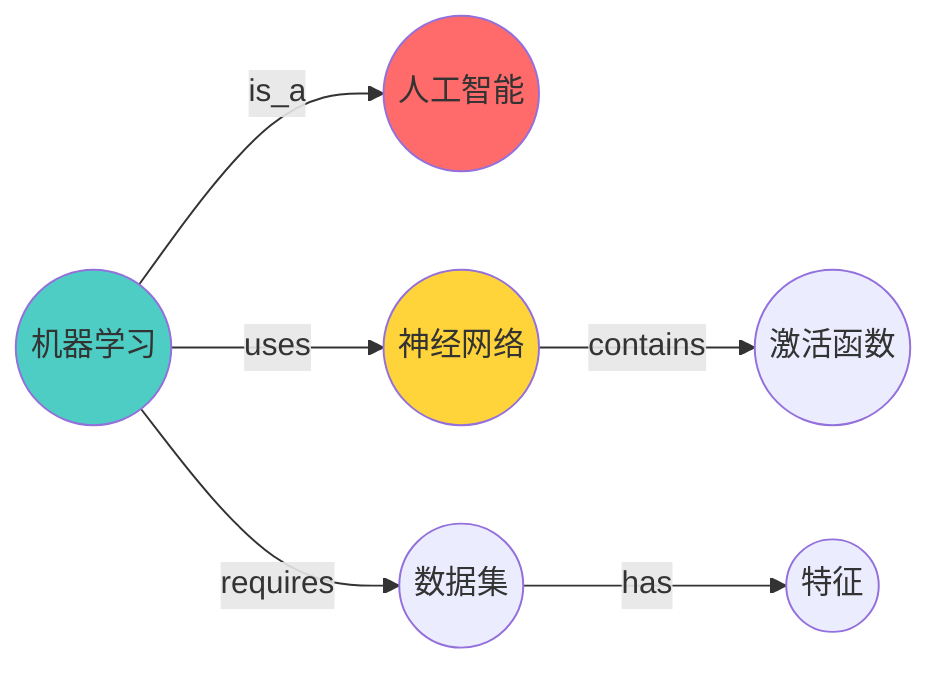
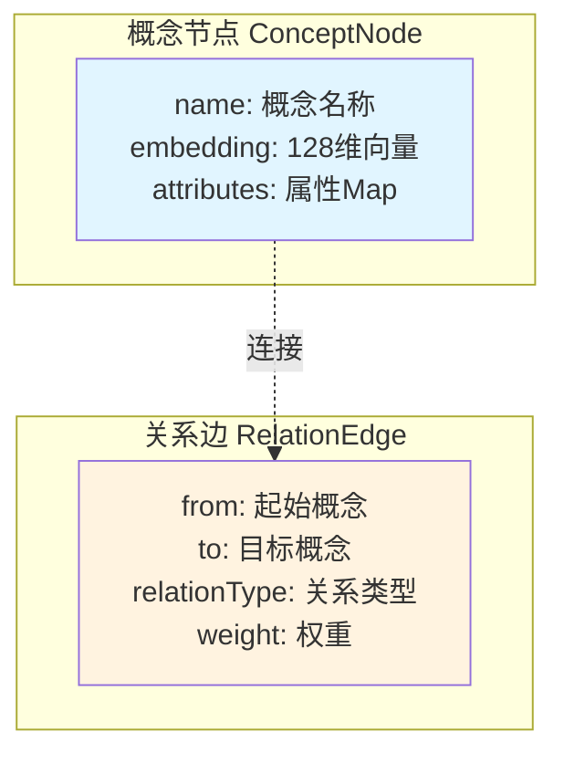
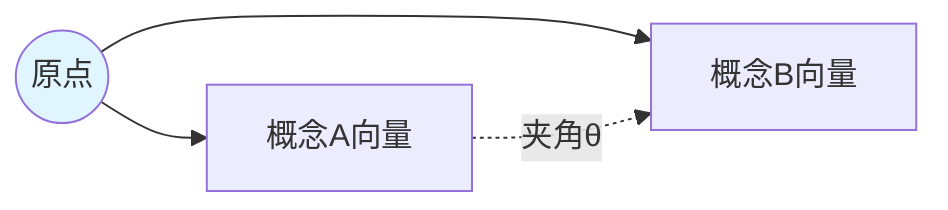
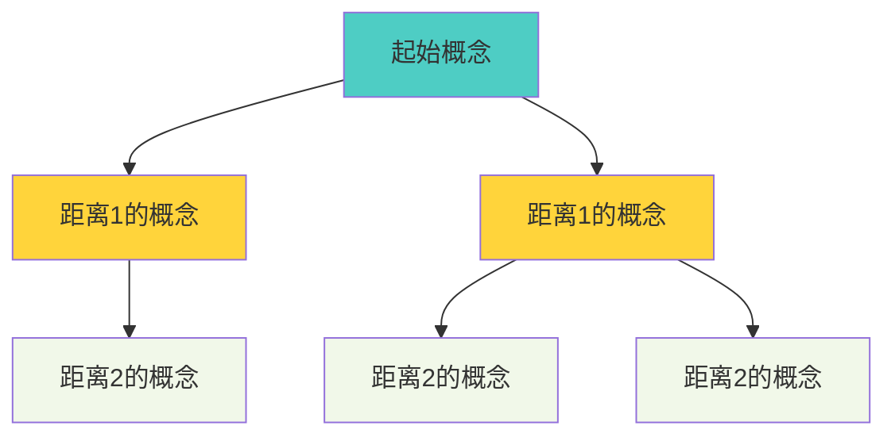
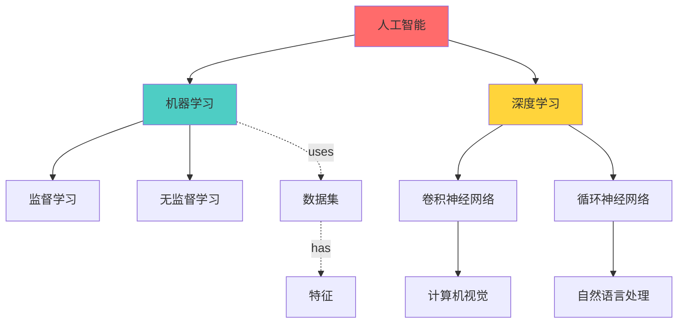

# 19.4 知识图谱构建 - 概念网络与推理

> **知识网络的力量**

## 引言

人类的知识不是孤立存储的,而是通过关联形成网络。当你想到"机器学习",大脑会自动联想到"人工智能"、"神经网络"、"数据集"等相关概念。这种网状的知识结构使我们能够进行类比推理、知识迁移和创造性思考。

知识图谱就是这样一个概念关系网络:



本节将探讨如何为自进化智能体构建知识图谱,实现概念表示、相似度计算和智能推理。

## KnowledgeGraph核心设计

### 图结构组成

知识图谱由**节点**和**边**组成:



### ConceptNode实现

```java
public class ConceptNode {
    private String name;                    // 概念名称
    private double[] embedding;             // 向量表示(128维)
    private Map<String, Object> attributes; // 属性
    private long createdTime;               // 创建时间
    private int referenceCount;             // 被引用次数
    
    public ConceptNode(String name) {
        this.name = name;
        this.embedding = generateRandomEmbedding(128);
        this.attributes = new HashMap<>();
        this.createdTime = System.currentTimeMillis();
        this.referenceCount = 0;
    }
    
    /**
     * 生成随机嵌入向量(简化版)
     */
    private double[] generateRandomEmbedding(int dim) {
        double[] vec = new double[dim];
        Random rand = new Random(name.hashCode());
        for (int i = 0; i < dim; i++) {
            vec[i] = rand.nextGaussian();
        }
        // 归一化
        normalize(vec);
        return vec;
    }
    
    /**
     * 计算与另一个概念的相似度(余弦相似度)
     */
    public double similarityWith(ConceptNode other) {
        return cosineSimilarity(this.embedding, other.embedding);
    }
    
    /**
     * 余弦相似度计算
     */
    private double cosineSimilarity(double[] vec1, double[] vec2) {
        double dotProduct = 0.0;
        double norm1 = 0.0;
        double norm2 = 0.0;
        
        for (int i = 0; i < vec1.length; i++) {
            dotProduct += vec1[i] * vec2[i];
            norm1 += vec1[i] * vec1[i];
            norm2 += vec2[i] * vec2[i];
        }
        
        return dotProduct / (Math.sqrt(norm1) * Math.sqrt(norm2));
    }
}
```

### RelationEdge实现

```java
public class RelationEdge {
    private String from;                // 起始概念
    private String to;                  // 目标概念
    private String relationType;        // 关系类型
    private double weight;              // 权重(0-1)
    private long createdTime;
    private long lastActivatedTime;     // 最后激活时间
    
    public RelationEdge(String from, String to, String relationType) {
        this.from = from;
        this.to = to;
        this.relationType = relationType;
        this.weight = 0.5;  // 初始权重
        this.createdTime = System.currentTimeMillis();
        this.lastActivatedTime = createdTime;
    }
    
    /**
     * 激活关系(增强权重)
     */
    public void activate() {
        this.weight = Math.min(1.0, weight + 0.1);
        this.lastActivatedTime = System.currentTimeMillis();
    }
    
    /**
     * 权重衰减(长期未使用)
     */
    public void decay(double decayRate) {
        this.weight *= (1 - decayRate);
    }
}
```

### KnowledgeGraph主类

```java
public class KnowledgeGraph {
    // 节点存储: 概念名 -> 节点
    private Map<String, ConceptNode> nodes;
    
    // 边存储: from -> to -> relationType -> edge
    private Map<String, Map<String, Map<String, RelationEdge>>> edges;
    
    public KnowledgeGraph() {
        this.nodes = new ConcurrentHashMap<>();
        this.edges = new ConcurrentHashMap<>();
    }
    
    /**
     * 添加概念节点
     */
    public void addConcept(String concept) {
        nodes.putIfAbsent(concept, new ConceptNode(concept));
    }
    
    /**
     * 添加关系边
     */
    public void addRelation(String from, String to, String relationType) {
        // 确保节点存在
        addConcept(from);
        addConcept(to);
        
        // 添加边
        edges.computeIfAbsent(from, k -> new ConcurrentHashMap<>())
             .computeIfAbsent(to, k -> new ConcurrentHashMap<>())
             .putIfAbsent(relationType, new RelationEdge(from, to, relationType));
    }
}
```

## 概念相似度计算

### 余弦相似度原理

余弦相似度衡量两个向量的夹角,值域[-1, 1]:

```
similarity(A, B) = cos(θ) = (A · B) / (||A|| × ||B||)
```

**几何意义**:



- cos(θ) = 1: 完全相同
- cos(θ) = 0: 完全无关
- cos(θ) = -1: 完全相反

### 实现代码

```java
/**
 * 查找相似概念
 */
public List<String> findSimilarConcepts(String concept, int topK) {
    ConceptNode node = nodes.get(concept);
    if (node == null) {
        return Collections.emptyList();
    }
    
    return nodes.values().stream()
        .filter(n -> !n.getName().equals(concept))
        .map(n -> new ScoredConcept(n.getName(), node.similarityWith(n)))
        .sorted(Comparator.comparing(ScoredConcept::getScore).reversed())
        .limit(topK)
        .map(ScoredConcept::getName)
        .collect(Collectors.toList());
}

private static class ScoredConcept {
    String name;
    double score;
    
    ScoredConcept(String name, double score) {
        this.name = name;
        this.score = score;
    }
    
    String getName() { return name; }
    double getScore() { return score; }
}
```

## 关系类型设计

### 常见关系类型

| 关系类型 | 含义 | 示例 | 用途 |
|---------|------|------|------|
| is_a | 类别关系 | 机器学习 is_a 人工智能 | 分类推理 |
| uses | 使用关系 | 训练 uses 数据集 | 依赖分析 |
| requires | 依赖关系 | 神经网络 requires 激活函数 | 需求推理 |
| produces | 产出关系 | 训练 produces 模型 | 因果推理 |
| related_to | 相关关系 | 分类 related_to 回归 | 关联发现 |
| part_of | 组成关系 | 神经元 part_of 神经网络 | 层次推理 |

### 关系权重更新

```java
/**
 * 更新关系权重
 */
public void updateRelationWeight(String from, String to, 
                                String relationType,
                                boolean strengthen) {
    RelationEdge edge = getEdge(from, to, relationType);
    if (edge == null) {
        return;
    }
    
    if (strengthen) {
        edge.activate();  // 增强
    } else {
        edge.decay(0.05);  // 衰减
    }
}
```

## 图遍历与推理

### 广度优先搜索

查找与起始概念相关的所有概念(限定距离):



**实现代码**:

```java
/**
 * 查找相关概念(BFS)
 */
public Set<String> findRelatedConcepts(String startConcept, 
                                       int maxDistance) {
    Set<String> result = new HashSet<>();
    Set<String> visited = new HashSet<>();
    Queue<ConceptDistance> queue = new LinkedList<>();
    
    queue.offer(new ConceptDistance(startConcept, 0));
    visited.add(startConcept);
    
    while (!queue.isEmpty()) {
        ConceptDistance current = queue.poll();
        String concept = current.concept;
        int distance = current.distance;
        
        if (distance > 0) {
            result.add(concept);
        }
        
        if (distance < maxDistance) {
            // 找出所有邻居
            Set<String> neighbors = getNeighbors(concept);
            for (String neighbor : neighbors) {
                if (!visited.contains(neighbor)) {
                    visited.add(neighbor);
                    queue.offer(new ConceptDistance(neighbor, distance + 1));
                }
            }
        }
    }
    
    return result;
}

/**
 * 获取邻居概念
 */
private Set<String> getNeighbors(String concept) {
    Set<String> neighbors = new HashSet<>();
    
    // 出边
    Map<String, Map<String, RelationEdge>> outEdges = edges.get(concept);
    if (outEdges != null) {
        neighbors.addAll(outEdges.keySet());
    }
    
    // 入边
    edges.forEach((from, toMap) -> {
        if (toMap.containsKey(concept)) {
            neighbors.add(from);
        }
    });
    
    return neighbors;
}

private static class ConceptDistance {
    String concept;
    int distance;
    
    ConceptDistance(String concept, int distance) {
        this.concept = concept;
        this.distance = distance;
    }
}
```

### 路径查找

找到两个概念之间的连接路径:

```java
/**
 * 查找两概念间的路径
 */
public List<String> findPath(String from, String to, int maxDepth) {
    Map<String, String> parent = new HashMap<>();
    Queue<String> queue = new LinkedList<>();
    Set<String> visited = new HashSet<>();
    
    queue.offer(from);
    visited.add(from);
    parent.put(from, null);
    
    int depth = 0;
    while (!queue.isEmpty() && depth < maxDepth) {
        int size = queue.size();
        for (int i = 0; i < size; i++) {
            String current = queue.poll();
            
            if (current.equals(to)) {
                // 找到目标,回溯路径
                return reconstructPath(parent, from, to);
            }
            
            for (String neighbor : getNeighbors(current)) {
                if (!visited.contains(neighbor)) {
                    visited.add(neighbor);
                    parent.put(neighbor, current);
                    queue.offer(neighbor);
                }
            }
        }
        depth++;
    }
    
    return Collections.emptyList();  // 未找到路径
}

private List<String> reconstructPath(Map<String, String> parent,
                                     String from, String to) {
    List<String> path = new ArrayList<>();
    String current = to;
    
    while (current != null) {
        path.add(0, current);
        current = parent.get(current);
    }
    
    return path;
}
```

## 从经验构建知识

### 概念提取

从任务和上下文中提取概念:

```java
/**
 * 从经验中提取概念
 */
public void learnFromExperience(Experience exp) {
    // 1. 提取任务中的概念
    List<String> concepts = extractConcepts(exp.getTask());
    concepts.forEach(this::addConcept);
    
    // 2. 从上下文提取
    exp.getContext().forEach((key, value) -> {
        addConcept(key);
        addConcept(String.valueOf(value));
    });
    
    // 3. 建立关系
    String action = exp.getAction();
    addConcept(action);
    
    for (String concept : concepts) {
        addRelation(concept, action, "uses");
    }
    
    // 4. 如果成功,强化关系
    if (exp.isSuccess()) {
        concepts.forEach(c -> 
            updateRelationWeight(c, action, "uses", true));
    }
}

/**
 * 提取概念(简化版)
 */
private List<String> extractConcepts(String text) {
    return Arrays.stream(text.toLowerCase().split("[\\s,\\.]+"))
        .filter(w -> w.length() > 3)
        .distinct()
        .collect(Collectors.toList());
}
```

### 知识积累示例

```java
// 任务1: 搜索机器学习资料
Experience exp1 = new Experience(
    "搜索机器学习相关资料",
    Map.of("domain", "AI"),
    "search",
    "...",
    true,
    0.9
);
kg.learnFromExperience(exp1);

// 形成的知识:
// 机器学习 --uses--> search
// AI --uses--> search

// 任务2: 分析神经网络原理
Experience exp2 = new Experience(
    "分析神经网络工作原理",
    Map.of("domain", "AI"),
    "analyze",
    "...",
    true,
    0.85
);
kg.learnFromExperience(exp2);

// 新增知识:
// 神经网络 --uses--> analyze
// AI --uses--> analyze

// 任务3: 机器学习使用神经网络
Experience exp3 = new Experience(
    "机器学习使用神经网络实现",
    Map.of(),
    "explain",
    "...",
    true,
    0.95
);
kg.learnFromExperience(exp3);

// 发现关联:
// 机器学习 --uses--> 神经网络
```

## 知识图谱可视化

### 图谱统计

```java
/**
 * 获取图谱统计
 */
public Map<String, Object> getStatistics() {
    Map<String, Object> stats = new HashMap<>();
    
    stats.put("conceptCount", nodes.size());
    stats.put("relationCount", countAllEdges());
    stats.put("avgDegree", calculateAvgDegree());
    stats.put("mostConnected", findMostConnected(5));
    
    return stats;
}

private int countAllEdges() {
    return edges.values().stream()
        .mapToInt(m -> m.values().stream()
            .mapToInt(Map::size)
            .sum())
        .sum();
}
```

### 导出为DOT格式

```java
/**
 * 导出为Graphviz DOT格式
 */
public String toDot() {
    StringBuilder dot = new StringBuilder();
    dot.append("digraph KnowledgeGraph {\n");
    dot.append("  node [shape=circle];\n");
    
    // 输出边
    edges.forEach((from, toMap) -> {
        toMap.forEach((to, typeMap) -> {
            typeMap.forEach((type, edge) -> {
                dot.append(String.format(
                    "  \"%s\" -> \"%s\" [label=\"%s\"];\n",
                    from, to, type
                ));
            });
        });
    });
    
    dot.append("}\n");
    return dot.toString();
}
```

## 实践案例

### 案例: AI学习助手的知识图谱

经过50个任务后,构建的知识图谱:



**知识应用**:

```java
// 用户问: "卷积神经网络是什么?"
String query = "卷积神经网络";

// 1. 查找相关概念
Set<String> related = kg.findRelatedConcepts(query, 2);
// 结果: [深度学习, 计算机视觉, 人工智能, ...]

// 2. 查找路径
List<String> path = kg.findPath(query, "人工智能", 5);
// 路径: [卷积神经网络 -> 深度学习 -> 人工智能]

// 3. 生成回答
String answer = String.format(
    "%s 是 %s 的一种技术,属于 %s 领域,主要用于 %s",
    query, 
    path.get(1),  // 深度学习
    path.get(2),  // 人工智能
    String.join(", ", related)  // 相关应用
);
```

## 小结

本节介绍了知识图谱的构建与应用:

**关键要点**:

1. **图结构设计**: ConceptNode + RelationEdge
2. **概念嵌入**: 128维向量表示,支持相似度计算
3. **关系类型**: is_a, uses, requires等语义关系
4. **图遍历**: BFS查找相关概念,路径发现
5. **知识学习**: 从经验自动提取概念和关系
6. **权重更新**: 激活强化,衰减遗忘

**核心价值**:

知识图谱使智能体能够:
- 理解概念之间的关联
- 进行类比推理和知识迁移
- 发现隐含的知识关联
- 构建领域知识体系

下一节,我们将探讨**反思模块实现**,了解如何让智能体进行自我反思和改进。

---

**思考题**:

1. 如何处理概念的歧义(如"网络"可能指神经网络或计算机网络)?
2. 如何设计知识的"遗忘"机制,避免图谱无限增长?
3. 除了余弦相似度,还可以用哪些方法计算概念相似度?
