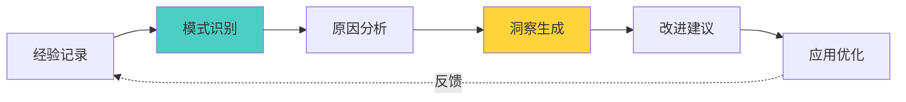
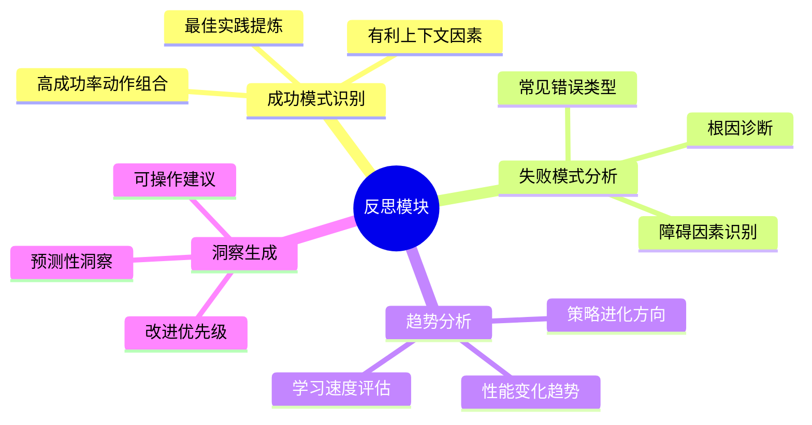
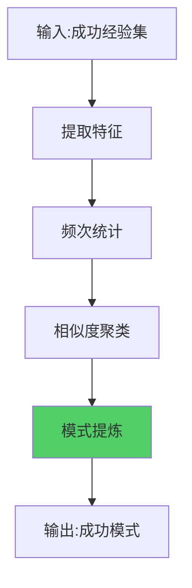
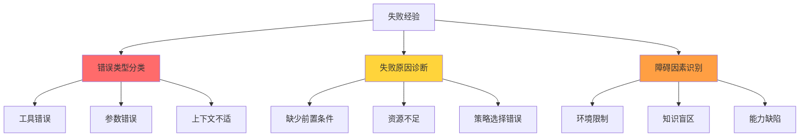

# 19.5 反思模块实现 - 自我认知与改进

> **反思让智能体更聪明**

## 引言

苏格拉底说:"未经审视的生活不值得过"。对AI而言亦然——没有反思能力的智能体无法真正成长。

人类通过反思实现进步:
- 🎯 成功后:分析成功因素,提炼最佳实践
- 💔 失败后:诊断失败原因,避免重蹈覆辙
- 📊 定期回顾:发现长期趋势,调整策略方向

自进化智能体的反思模块实现了类似的能力:



本节将探讨如何实现一个强大的反思引擎。

## ReflectionModule设计

### 核心职责



### 数据结构

```java
public class ReflectionModule {
    private List<String> reflectionHistory;     // 反思历史
    private Map<String, Integer> patternCache;  // 模式缓存
    
    public ReflectionModule() {
        this.reflectionHistory = Collections.synchronizedList(
            new ArrayList<>()
        );
        this.patternCache = new ConcurrentHashMap<>();
    }
    
    /**
     * 反思结果
     */
    public static class ReflectionResult {
        private String summary;                 // 总结
        private List<String> successPatterns;   // 成功模式
        private List<String> failurePatterns;   // 失败模式
        private List<String> insights;          // 洞察
        private List<String> recommendations;   // 建议
        
        // 构造函数和getter
    }
}
```

## 成功模式识别

### 识别流程



### 实现代码

```java
/**
 * 识别成功模式
 */
public List<String> identifySuccessPatterns(List<Experience> experiences) {
    List<String> patterns = new ArrayList<>();
    
    // 1. 过滤成功经验
    List<Experience> successful = experiences.stream()
        .filter(Experience::isSuccess)
        .collect(Collectors.toList());
    
    if (successful.size() < 3) {
        return patterns;  // 样本太少
    }
    
    // 2. 分析高频动作
    Map<String, Long> actionFreq = successful.stream()
        .collect(Collectors.groupingBy(
            Experience::getAction,
            Collectors.counting()
        ));
    
    actionFreq.entrySet().stream()
        .filter(e -> e.getValue() >= 3)
        .forEach(e -> patterns.add(String.format(
            "动作'%s'表现优秀,成功率%.0f%%",
            e.getKey(),
            100.0 * e.getValue() / successful.size()
        )));
    
    // 3. 分析有利上下文
    Map<String, Object> favorableContext = analyzeFavorableContext(successful);
    if (!favorableContext.isEmpty()) {
        patterns.add("有利条件: " + favorableContext);
    }
    
    // 4. 分析动作组合
    List<String> actionSequences = findSuccessfulSequences(successful);
    patterns.addAll(actionSequences);
    
    return patterns;
}

/**
 * 分析有利上下文
 */
private Map<String, Object> analyzeFavorableContext(List<Experience> exps) {
    Map<String, Object> favorable = new HashMap<>();
    
    // 统计上下文字段
    Map<String, Map<Object, Long>> contextStats = new HashMap<>();
    
    for (Experience exp : exps) {
        exp.getContext().forEach((key, value) -> {
            contextStats.computeIfAbsent(key, k -> new HashMap<>())
                .merge(value, 1L, Long::sum);
        });
    }
    
    // 找出高频值
    contextStats.forEach((key, valueFreq) -> {
        valueFreq.entrySet().stream()
            .max(Map.Entry.comparingByValue())
            .filter(e -> e.getValue() >= exps.size() * 0.6)
            .ifPresent(e -> favorable.put(key, e.getKey()));
    });
    
    return favorable;
}

/**
 * 发现成功的动作序列
 */
private List<String> findSuccessfulSequences(List<Experience> exps) {
    List<String> sequences = new ArrayList<>();
    
    for (int i = 0; i < exps.size() - 1; i++) {
        Experience curr = exps.get(i);
        Experience next = exps.get(i + 1);
        
        if (curr.isSuccess() && next.isSuccess()) {
            String seq = curr.getAction() + " -> " + next.getAction();
            patternCache.merge(seq, 1, Integer::sum);
            
            if (patternCache.get(seq) >= 3) {
                sequences.add(String.format(
                    "有效序列: %s (出现%d次)",
                    seq, patternCache.get(seq)
                ));
            }
        }
    }
    
    return sequences;
}
```

## 失败模式分析

### 分析维度



### 实现代码

```java
/**
 * 分析失败模式
 */
public List<String> analyzeFailurePatterns(List<Experience> experiences) {
    List<String> patterns = new ArrayList<>();
    
    // 过滤失败经验
    List<Experience> failed = experiences.stream()
        .filter(e -> !e.isSuccess())
        .collect(Collectors.toList());
    
    if (failed.isEmpty()) {
        return patterns;
    }
    
    // 1. 高频失败动作
    Map<String, Long> failureActions = failed.stream()
        .collect(Collectors.groupingBy(
            Experience::getAction,
            Collectors.counting()
        ));
    
    failureActions.entrySet().stream()
        .filter(e -> e.getValue() >= 2)
        .forEach(e -> patterns.add(String.format(
            "动作'%s'失败率高,需要优化或避免使用",
            e.getKey()
        )));
    
    // 2. 失败的上下文模式
    Map<String, Object> problemContext = analyzeProblematicContext(failed);
    if (!problemContext.isEmpty()) {
        patterns.add("问题场景: " + problemContext + ",需特别注意");
    }
    
    // 3. 常见失败原因
    List<String> commonReasons = extractCommonFailureReasons(failed);
    patterns.addAll(commonReasons);
    
    return patterns;
}

/**
 * 分析问题上下文
 */
private Map<String, Object> analyzeProblematicContext(List<Experience> failed) {
    Map<String, Object> problematic = new HashMap<>();
    
    Map<String, Map<Object, Long>> contextStats = new HashMap<>();
    
    for (Experience exp : failed) {
        exp.getContext().forEach((key, value) -> {
            contextStats.computeIfAbsent(key, k -> new HashMap<>())
                .merge(value, 1L, Long::sum);
        });
    }
    
    // 找出在失败中高频出现的上下文
    contextStats.forEach((key, valueFreq) -> {
        valueFreq.entrySet().stream()
            .filter(e -> e.getValue() >= failed.size() * 0.5)
            .forEach(e -> problematic.put(key, e.getKey()));
    });
    
    return problematic;
}

/**
 * 提取常见失败原因
 */
private List<String> extractCommonFailureReasons(List<Experience> failed) {
    List<String> reasons = new ArrayList<>();
    
    // 从反思内容中提取(如果有)
    Map<String, Long> reasonFreq = failed.stream()
        .map(Experience::getReflection)
        .filter(r -> r != null && !r.isEmpty())
        .collect(Collectors.groupingBy(r -> r, Collectors.counting()));
    
    reasonFreq.entrySet().stream()
        .filter(e -> e.getValue() >= 2)
        .forEach(e -> reasons.add("重复问题: " + e.getKey()));
    
    return reasons;
}
```

## 趋势分析

### 性能趋势

分析成功率随时间的变化:

```java
/**
 * 分析性能趋势
 */
public String analyzePerformanceTrend(List<Experience> experiences) {
    if (experiences.size() < 10) {
        return "数据不足,无法分析趋势";
    }
    
    // 计算前半段和后半段的成功率
    int mid = experiences.size() / 2;
    List<Experience> firstHalf = experiences.subList(0, mid);
    List<Experience> secondHalf = experiences.subList(mid, experiences.size());
    
    double earlySuccessRate = calculateSuccessRate(firstHalf);
    double lateSuccessRate = calculateSuccessRate(secondHalf);
    
    double improvement = lateSuccessRate - earlySuccessRate;
    
    if (improvement > 0.1) {
        return String.format(
            "性能持续提升: %.1f%% -> %.1f%% (+%.1f%%)",
            earlySuccessRate * 100,
            lateSuccessRate * 100,
            improvement * 100
        );
    } else if (improvement < -0.1) {
        return String.format(
            "性能下降: %.1f%% -> %.1f%% (%.1f%%),需要重新探索",
            earlySuccessRate * 100,
            lateSuccessRate * 100,
            improvement * 100
        );
    } else {
        return String.format(
            "性能平稳: %.1f%%左右,已进入成熟期",
            lateSuccessRate * 100
        );
    }
}

private double calculateSuccessRate(List<Experience> exps) {
    long successCount = exps.stream()
        .filter(Experience::isSuccess)
        .count();
    return (double) successCount / exps.size();
}
```

### 学习速度评估

```java
/**
 * 评估学习速度
 */
public String assessLearningSpeed(List<Experience> experiences) {
    if (experiences.size() < 20) {
        return "样本不足";
    }
    
    // 分成4个阶段
    int quarterSize = experiences.size() / 4;
    List<Double> quarterRates = new ArrayList<>();
    
    for (int i = 0; i < 4; i++) {
        int start = i * quarterSize;
        int end = Math.min((i + 1) * quarterSize, experiences.size());
        List<Experience> quarter = experiences.subList(start, end);
        quarterRates.add(calculateSuccessRate(quarter));
    }
    
    // 计算平均增长率
    double avgGrowth = 0.0;
    for (int i = 1; i < quarterRates.size(); i++) {
        avgGrowth += quarterRates.get(i) - quarterRates.get(i - 1);
    }
    avgGrowth /= (quarterRates.size() - 1);
    
    if (avgGrowth > 0.05) {
        return "学习速度: 快速 (平均每阶段提升" + 
               String.format("%.1f%%)", avgGrowth * 100);
    } else if (avgGrowth > 0) {
        return "学习速度: 稳定 (持续小幅进步)";
    } else {
        return "学习速度: 停滞 (建议增加探索率)";
    }
}
```

## 洞察生成

### 洞察模板

```java
/**
 * 生成综合洞察
 */
public List<String> generateInsights(List<Experience> experiences) {
    List<String> insights = new ArrayList<>();
    
    // 1. 最有效的工具
    String bestTool = findBestTool(experiences);
    if (bestTool != null) {
        insights.add("最有效工具: " + bestTool);
    }
    
    // 2. 需要改进的领域
    String weakArea = identifyWeakArea(experiences);
    if (weakArea != null) {
        insights.add("薄弱环节: " + weakArea);
    }
    
    // 3. 策略建议
    String strategyAdvice = suggestStrategy(experiences);
    if (strategyAdvice != null) {
        insights.add(strategyAdvice);
    }
    
    return insights;
}

/**
 * 找出最有效的工具
 */
private String findBestTool(List<Experience> exps) {
    Map<String, Double> toolPerformance = new HashMap<>();
    Map<String, Long> toolCount = new HashMap<>();
    
    exps.forEach(exp -> {
        String action = exp.getAction();
        toolCount.merge(action, 1L, Long::sum);
        toolPerformance.merge(action, 
            exp.isSuccess() ? 1.0 : 0.0,
            Double::sum);
    });
    
    return toolPerformance.entrySet().stream()
        .filter(e -> toolCount.get(e.getKey()) >= 3)
        .max(Comparator.comparing(e -> 
            e.getValue() / toolCount.get(e.getKey())))
        .map(e -> String.format(
            "%s (成功率%.0f%%)",
            e.getKey(),
            100.0 * e.getValue() / toolCount.get(e.getKey())
        ))
        .orElse(null);
}

/**
 * 识别薄弱环节
 */
private String identifyWeakArea(List<Experience> exps) {
    Map<String, Long> failures = exps.stream()
        .filter(e -> !e.isSuccess())
        .collect(Collectors.groupingBy(
            e -> e.getContext().getOrDefault("domain", "unknown").toString(),
            Collectors.counting()
        ));
    
    return failures.entrySet().stream()
        .max(Map.Entry.comparingByValue())
        .filter(e -> e.getValue() >= 2)
        .map(e -> e.getKey() + "领域 (失败" + e.getValue() + "次)")
        .orElse(null);
}
```

## 反思内容生成

### 完整反思流程

```java
/**
 * 执行完整反思
 */
public ReflectionResult reflect(List<Experience> experiences) {
    if (experiences.size() < 5) {
        return new ReflectionResult(
            "经验不足,暂无反思",
            Collections.emptyList(),
            Collections.emptyList(),
            Collections.emptyList(),
            Collections.emptyList()
        );
    }
    
    // 1. 识别模式
    List<String> successPatterns = identifySuccessPatterns(experiences);
    List<String> failurePatterns = analyzeFailurePatterns(experiences);
    
    // 2. 趋势分析
    String performanceTrend = analyzePerformanceTrend(experiences);
    String learningSpeed = assessLearningSpeed(experiences);
    
    // 3. 生成洞察
    List<String> insights = generateInsights(experiences);
    insights.add("性能趋势: " + performanceTrend);
    insights.add(learningSpeed);
    
    // 4. 生成建议
    List<String> recommendations = generateRecommendations(
        successPatterns,
        failurePatterns,
        experiences
    );
    
    // 5. 生成总结
    String summary = generateSummary(experiences, insights);
    
    // 6. 记录反思
    String reflection = String.format(
        "[%s] 反思: %s",
        new SimpleDateFormat("yyyy-MM-dd HH:mm:ss").format(new Date()),
        summary
    );
    reflectionHistory.add(reflection);
    
    return new ReflectionResult(
        summary,
        successPatterns,
        failurePatterns,
        insights,
        recommendations
    );
}

/**
 * 生成改进建议
 */
private List<String> generateRecommendations(
        List<String> successPatterns,
        List<String> failurePatterns,
        List<Experience> experiences) {
    
    List<String> recommendations = new ArrayList<>();
    
    // 基于成功模式的建议
    if (!successPatterns.isEmpty()) {
        recommendations.add("继续使用已验证有效的策略");
    }
    
    // 基于失败模式的建议
    if (!failurePatterns.isEmpty()) {
        recommendations.add("避免或改进高失败率的操作");
    }
    
    // 基于性能的建议
    double successRate = calculateSuccessRate(experiences);
    if (successRate < 0.6) {
        recommendations.add("建议: 增加探索率,尝试新的方法");
    } else if (successRate > 0.8) {
        recommendations.add("建议: 当前策略有效,可适当减少探索");
    }
    
    return recommendations;
}

/**
 * 生成总结
 */
private String generateSummary(List<Experience> exps, List<String> insights) {
    double successRate = calculateSuccessRate(exps);
    return String.format(
        "完成%d个任务,成功率%.1f%%。%s",
        exps.size(),
        successRate * 100,
        insights.isEmpty() ? "持续学习中" : insights.get(0)
    );
}
```

## 反思应用

### 触发时机

```java
// 定期反思
if (taskCount % 10 == 0) {
    ReflectionResult reflection = reflectionModule.reflect(
        experienceManager.getRecentExperiences(10)
    );
    processReflection(reflection);
}

// 性能下降时反思
if (recentSuccessRate < 0.5) {
    ReflectionResult reflection = reflectionModule.reflect(
        experienceManager.getRecentExperiences(20)
    );
    urgentProcessReflection(reflection);
}
```

### 反思结果应用

```java
/**
 * 应用反思结果
 */
private void processReflection(ReflectionResult reflection) {
    System.out.println("=== 反思结果 ===");
    System.out.println("总结: " + reflection.getSummary());
    
    // 成功模式 -> 强化相关策略
    reflection.getSuccessPatterns().forEach(pattern -> {
        System.out.println("✓ " + pattern);
        // 可以自动调整相关策略权重
    });
    
    // 失败模式 -> 调整策略或增加探索
    reflection.getFailurePatterns().forEach(pattern -> {
        System.out.println("✗ " + pattern);
        // 可以降低相关策略权重或增加探索率
    });
    
    // 洞察 -> 记录到知识库
    reflection.getInsights().forEach(insight -> {
        System.out.println("💡 " + insight);
    });
    
    // 建议 -> 指导下一步行动
    reflection.getRecommendations().forEach(rec -> {
        System.out.println("📌 " + rec);
    });
}
```

## 实践案例

### 案例: 学习助手的反思输出

```
=== 反思结果 ===
总结: 完成20个任务,成功率75.0%。性能趋势: 性能持续提升: 65.0% -> 85.0% (+20.0%)

成功模式:
✓ 动作'search'表现优秀,成功率80%
✓ 有利条件: {difficulty=beginner, domain=AI}
✓ 有效序列: search -> analyze (出现5次)

失败模式:
✗ 动作'直接解答'失败率高,需要优化或避免使用
✗ 问题场景: {difficulty=advanced},需特别注意

洞察:
💡 最有效工具: search (成功率80%)
💡 薄弱环节: advanced领域 (失败3次)
💡 性能趋势: 性能持续提升
💡 学习速度: 快速

建议:
📌 继续使用已验证有效的策略
📌 避免或改进高失败率的操作
📌 建议: 当前策略有效,可适当减少探索
```

## 小结

本节介绍了反思模块的设计与实现:

**关键要点**:

1. **成功模式识别**: 提取高频成功动作、有利上下文、有效序列
2. **失败模式分析**: 诊断失败原因、识别问题场景
3. **趋势分析**: 性能变化趋势、学习速度评估
4. **洞察生成**: 最有效工具、薄弱环节、策略建议
5. **反思应用**: 定期触发、结果应用、持续优化

**核心价值**:

反思模块使智能体能够:
- 从经验中发现模式和规律
- 诊断问题根因,针对性改进
- 评估学习进度,调整策略
- 生成可操作的改进建议

下一节,我们将探讨**LLM增强的自进化**,了解如何利用大语言模型实现更深度的智能推理。

---

**思考题**:

1. 如何设计"元反思",让智能体反思自己的反思质量?
2. 除了频次统计,还可以用哪些方法发现模式?
3. 如何量化"洞察"的质量和价值?
