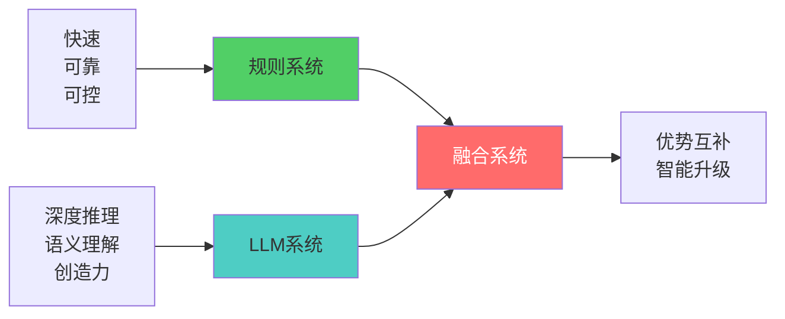
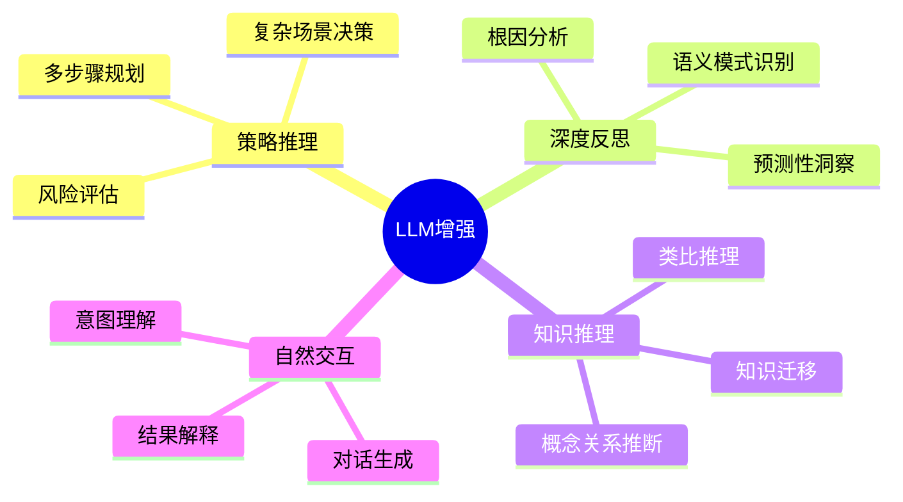
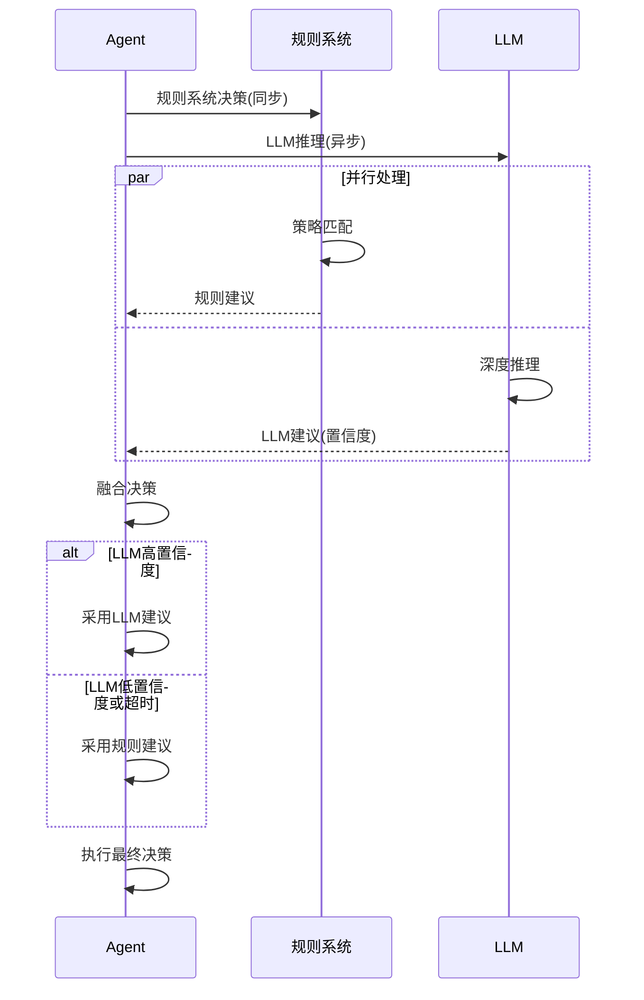
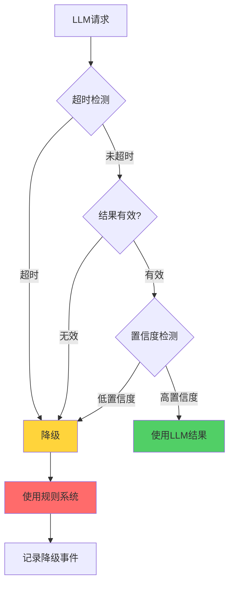

# 19.6 LLM增强的自进化 - 深度智能推理

> **LLM赋予智能体深度推理能力**

## 引言

前面的章节我们构建了基于规则的自进化智能体,它能够学习、优化和反思。但规则系统有其局限:
- 缺乏语义理解
- 难以处理复杂推理
- 无法生成创造性洞察

大语言模型(LLM)的出现为智能体带来了质的飞跃:



本节将探讨如何将LLM无缝集成到自进化智能体中,实现深度智能推理。

## LLM在自进化中的角色

### 四大应用场景



### 设计原则

| 原则 | 说明 | 实现方式 |
|------|------|----------|
| **可替换性** | 支持模拟器和真实LLM切换 | 统一接口设计 |
| **置信度驱动** | 高置信度采用,低置信度降级 | 评分机制 |
| **异步优先** | 不阻塞主流程 | CompletableFuture |
| **优雅降级** | LLM失效时回退规则系统 | Try-catch + 超时 |

## EvolLLMSimulator设计

### 接口定义

```java
public interface LLMInterface {
    /**
     * 策略推理
     */
    StrategyReasoningResult reasonStrategy(
        Map<String, Object> context,
        List<String> availableActions,
        List<Experience> relevantExperiences
    );
    
    /**
     * 深度反思
     */
    DeepReflectionResult reflectDeeply(
        Experience experience,
        List<Experience> historicalExperiences
    );
    
    /**
     * 知识推理
     */
    KnowledgeReasoningResult reasonKnowledge(
        String concept1,
        String concept2,
        List<Experience> relatedExperiences
    );
}
```

### 模拟器实现

```java
public class EvolLLMSimulator implements LLMInterface {
    private Map<String, String> knowledgeBase;
    private Random random;
    
    public EvolLLMSimulator() {
        this.knowledgeBase = new HashMap<>();
        this.random = new Random();
        initializeKnowledgeBase();
    }
    
    /**
     * 策略推理(模拟)
     */
    @Override
    public StrategyReasoningResult reasonStrategy(
            Map<String, Object> context,
            List<String> availableActions,
            List<Experience> relevantExperiences) {
        
        // 1. 分析上下文
        String contextSummary = summarizeContext(context);
        
        // 2. 分析历史经验
        String experienceInsight = analyzeExperiences(relevantExperiences);
        
        // 3. 推荐策略
        String recommendedAction = selectBestAction(
            availableActions,
            relevantExperiences
        );
        
        // 4. 生成推理过程
        String reasoning = String.format(
            "基于上下文'%s'和历史经验'%s',推荐使用'%s'",
            contextSummary,
            experienceInsight,
            recommendedAction
        );
        
        // 5. 计算置信度
        double confidence = calculateConfidence(
            recommendedAction,
            relevantExperiences
        );
        
        return new StrategyReasoningResult(
            recommendedAction,
            reasoning,
            confidence
        );
    }
    
    /**
     * 选择最佳动作(基于经验)
     */
    private String selectBestAction(List<String> actions,
                                    List<Experience> experiences) {
        if (actions.isEmpty()) {
            return "default_action";
        }
        
        // 统计每个动作的成功次数
        Map<String, Long> actionSuccessCount = experiences.stream()
            .filter(Experience::isSuccess)
            .collect(Collectors.groupingBy(
                Experience::getAction,
                Collectors.counting()
            ));
        
        // 选择成功次数最多的
        return actions.stream()
            .max(Comparator.comparing(a -> 
                actionSuccessCount.getOrDefault(a, 0L)))
            .orElse(actions.get(0));
    }
    
    /**
     * 计算置信度
     */
    private double calculateConfidence(String action,
                                       List<Experience> experiences) {
        if (experiences.isEmpty()) {
            return 0.5;  // 无经验,中等置信度
        }
        
        long total = experiences.size();
        long actionCount = experiences.stream()
            .filter(e -> e.getAction().equals(action))
            .count();
        long successCount = experiences.stream()
            .filter(e -> e.getAction().equals(action) && e.isSuccess())
            .count();
        
        if (actionCount == 0) {
            return 0.6;  // 新动作,略高于基准
        }
        
        double successRate = (double) successCount / actionCount;
        double coverage = (double) actionCount / total;
        
        // 综合成功率和覆盖率
        return 0.7 * successRate + 0.3 * coverage;
    }
}
```

### 结果数据结构

```java
/**
 * 策略推理结果
 */
public class StrategyReasoningResult {
    private String recommendedAction;   // 推荐动作
    private String reasoning;           // 推理过程
    private double confidence;          // 置信度(0-1)
    
    public StrategyReasoningResult(String action, 
                                   String reasoning,
                                   double confidence) {
        this.recommendedAction = action;
        this.reasoning = reasoning;
        this.confidence = confidence;
    }
    
    public boolean isHighConfidence() {
        return confidence > 0.7;
    }
}

/**
 * 深度反思结果
 */
public class DeepReflectionResult {
    private String rootCause;           // 根因分析
    private List<String> patterns;      // 发现的模式
    private List<String> insights;      // 深度洞察
    private List<String> recommendations; // 改进建议
    private double confidence;
}

/**
 * 知识推理结果
 */
public class KnowledgeReasoningResult {
    private String relationType;        // 关系类型
    private String explanation;         // 解释
    private double confidence;
}
```

## 策略推理增强

### 决策流程



### 实现代码

```java
/**
 * LLM增强的策略选择
 */
public Decision makeDecisionWithLLM(Map<String, Object> context) {
    // 1. 规则系统决策(同步)
    List<Strategy> strategies = strategyManager.findApplicable(context);
    Decision ruleBasedDecision = selectBestStrategy(strategies);
    
    // 2. LLM推理(异步)
    CompletableFuture<StrategyReasoningResult> llmFuture = 
        CompletableFuture.supplyAsync(() -> {
            List<Experience> relevant = experienceManager
                .findSimilar(currentTask, context, 5);
            
            return llmSimulator.reasonStrategy(
                context,
                getAvailableActions(),
                relevant
            );
        });
    
    // 3. 等待LLM结果(带超时)
    try {
        StrategyReasoningResult llmResult = llmFuture.get(
            5, TimeUnit.SECONDS
        );
        
        if (llmResult.isHighConfidence()) {
            // 高置信度,采用LLM建议
            System.out.println("采用LLM推荐: " + llmResult.getReasoning());
            return new Decision(llmResult.getRecommendedAction());
        }
    } catch (TimeoutException | InterruptedException | ExecutionException e) {
        System.out.println("LLM超时或失败,降级到规则系统");
    }
    
    // 4. 降级:使用规则决策
    return ruleBasedDecision;
}
```

## 深度反思增强

### LLM反思能力

传统反思 vs LLM增强反思:

| 维度 | 传统反思 | LLM增强反思 |
|------|---------|------------|
| **模式识别** | 频次统计 | 语义理解+频次 |
| **原因分析** | 简单归类 | 深度根因推理 |
| **洞察质量** | 描述性 | 预测性+建议性 |
| **解释能力** | 模板化 | 自然语言 |

### 实现代码

```java
/**
 * LLM增强的深度反思
 */
@Override
public DeepReflectionResult reflectDeeply(
        Experience experience,
        List<Experience> historicalExperiences) {
    
    // 1. 根因分析
    String rootCause = analyzeRootCause(experience, historicalExperiences);
    
    // 2. 模式识别(语义层面)
    List<String> patterns = identifySemanticPatterns(
        experience,
        historicalExperiences
    );
    
    // 3. 生成洞察
    List<String> insights = generateDeepInsights(
        experience,
        patterns
    );
    
    // 4. 改进建议
    List<String> recommendations = generateActionableRecommendations(
        rootCause,
        insights
    );
    
    // 5. 置信度评估
    double confidence = assessReflectionQuality(
        patterns,
        insights
    );
    
    return new DeepReflectionResult(
        rootCause,
        patterns,
        insights,
        recommendations,
        confidence
    );
}

/**
 * 根因分析
 */
private String analyzeRootCause(Experience exp,
                               List<Experience> history) {
    if (exp.isSuccess()) {
        // 成功根因
        List<String> factors = new ArrayList<>();
        
        // 检查是否有相似成功经验
        long similarSuccess = history.stream()
            .filter(e -> e.getAction().equals(exp.getAction()))
            .filter(Experience::isSuccess)
            .count();
        
        if (similarSuccess >= 3) {
            factors.add("该动作已被多次验证有效");
        }
        
        // 检查上下文因素
        if (exp.getContext().containsKey("difficulty") &&
            "easy".equals(exp.getContext().get("difficulty"))) {
            factors.add("任务难度适中");
        }
        
        return "成功因素: " + String.join(", ", factors);
    } else {
        // 失败根因
        List<String> causes = new ArrayList<>();
        
        // 检查是否缺少经验
        if (history.stream()
                .noneMatch(e -> e.getAction().equals(exp.getAction()))) {
            causes.add("缺少该动作的成功经验");
        }
        
        // 检查上下文不利因素
        if (exp.getContext().containsKey("difficulty") &&
            "hard".equals(exp.getContext().get("difficulty"))) {
            causes.add("任务难度过高");
        }
        
        return "失败原因: " + String.join(", ", causes);
    }
}

/**
 * 语义模式识别
 */
private List<String> identifySemanticPatterns(
        Experience exp,
        List<Experience> history) {
    
    List<String> patterns = new ArrayList<>();
    
    // 1. 时间模式
    long recentFailures = history.stream()
        .filter(e -> !e.isSuccess())
        .filter(e -> System.currentTimeMillis() - e.getTimestamp() 
                     < 24 * 60 * 60 * 1000)
        .count();
    
    if (recentFailures > 3) {
        patterns.add("近期失败频率增加,可能需要调整策略");
    }
    
    // 2. 上下文模式
    Map<String, Long> contextFreq = history.stream()
        .flatMap(e -> e.getContext().entrySet().stream())
        .collect(Collectors.groupingBy(
            e -> e.getKey() + "=" + e.getValue(),
            Collectors.counting()
        ));
    
    contextFreq.entrySet().stream()
        .filter(e -> e.getValue() >= 3)
        .forEach(e -> patterns.add("高频上下文: " + e.getKey()));
    
    return patterns;
}
```

## 知识推理增强

### 语义关系推断

```java
/**
 * 推理概念间的关系
 */
@Override
public KnowledgeReasoningResult reasonKnowledge(
        String concept1,
        String concept2,
        List<Experience> relatedExperiences) {
    
    // 1. 检查共现频率
    long cooccurrence = relatedExperiences.stream()
        .filter(e -> mentionsBoth(e, concept1, concept2))
        .count();
    
    // 2. 推断关系类型
    String relationType = inferRelationType(
        concept1,
        concept2,
        relatedExperiences
    );
    
    // 3. 生成解释
    String explanation = String.format(
        "'%s'和'%s'在%d个任务中共同出现,推断关系为'%s'",
        concept1,
        concept2,
        cooccurrence,
        relationType
    );
    
    // 4. 计算置信度
    double confidence = Math.min(1.0, cooccurrence / 5.0);
    
    return new KnowledgeReasoningResult(
        relationType,
        explanation,
        confidence
    );
}

/**
 * 推断关系类型
 */
private String inferRelationType(String c1, String c2,
                                 List<Experience> exps) {
    // 简化的规则推理
    if (isSubconcept(c1, c2)) {
        return "is_a";
    } else if (isToolRelation(c1, c2, exps)) {
        return "uses";
    } else if (isDependency(c1, c2, exps)) {
        return "requires";
    } else {
        return "related_to";
    }
}

private boolean mentionsBoth(Experience e, String c1, String c2) {
    String text = e.getTask().toLowerCase();
    return text.contains(c1.toLowerCase()) && 
           text.contains(c2.toLowerCase());
}
```

## 异步处理与性能优化

### 异步调用模式

```java
/**
 * 异步LLM调用封装
 */
public class AsyncLLMCaller {
    private ExecutorService executor;
    private int timeoutSeconds;
    
    public AsyncLLMCaller(int threadPoolSize, int timeoutSeconds) {
        this.executor = Executors.newFixedThreadPool(threadPoolSize);
        this.timeoutSeconds = timeoutSeconds;
    }
    
    /**
     * 异步策略推理
     */
    public CompletableFuture<StrategyReasoningResult> asyncReasonStrategy(
            Map<String, Object> context,
            List<String> actions,
            List<Experience> experiences) {
        
        return CompletableFuture.supplyAsync(() -> {
            try {
                return llmSimulator.reasonStrategy(context, actions, experiences);
            } catch (Exception e) {
                System.err.println("LLM推理异常: " + e.getMessage());
                return new StrategyReasoningResult(
                    actions.get(0),  // 默认第一个
                    "降级响应",
                    0.5
                );
            }
        }, executor);
    }
    
    /**
     * 带超时的等待
     */
    public <T> Optional<T> waitWithTimeout(CompletableFuture<T> future) {
        try {
            return Optional.of(future.get(timeoutSeconds, TimeUnit.SECONDS));
        } catch (TimeoutException e) {
            System.out.println("LLM调用超时");
            return Optional.empty();
        } catch (Exception e) {
            System.err.println("LLM调用失败: " + e.getMessage());
            return Optional.empty();
        }
    }
}
```

### 降级策略



## LLMSelfEvolvingAgent实现

### 完整集成

```java
public class LLMSelfEvolvingAgent extends SelfEvolvingAgent {
    private LLMInterface llm;
    private AsyncLLMCaller asyncCaller;
    private boolean llmEnabled;
    private double confidenceThreshold;
    
    public LLMSelfEvolvingAgent(double learningRate,
                                double explorationRate,
                                int memorySize,
                                boolean llmEnabled) {
        super(learningRate, explorationRate, memorySize);
        
        this.llm = new EvolLLMSimulator();
        this.asyncCaller = new AsyncLLMCaller(4, 5);
        this.llmEnabled = llmEnabled;
        this.confidenceThreshold = 0.7;
    }
    
    @Override
    public String processTask(String task, Map<String, Object> context) {
        if (!llmEnabled) {
            // LLM未启用,使用基础版本
            return super.processTask(task, context);
        }
        
        // LLM增强版本
        return processTaskWithLLM(task, context);
    }
    
    private String processTaskWithLLM(String task,
                                     Map<String, Object> context) {
        // 1. 并行执行规则决策和LLM推理
        Decision ruleDecision = makeRuleBasedDecision(context);
        CompletableFuture<StrategyReasoningResult> llmFuture = 
            asyncCaller.asyncReasonStrategy(
                context,
                getAvailableActions(),
                getRelevantExperiences(task, context)
            );
        
        // 2. 等待LLM结果
        Optional<StrategyReasoningResult> llmResult = 
            asyncCaller.waitWithTimeout(llmFuture);
        
        // 3. 融合决策
        Decision finalDecision = llmResult
            .filter(r -> r.getConfidence() > confidenceThreshold)
            .map(r -> new Decision(r.getRecommendedAction()))
            .orElse(ruleDecision);
        
        // 4. 执行
        return executeDecision(finalDecision, task, context);
    }
}
```

## 实践案例

### 对比测试

```java
// 测试场景:复杂问题求解
String task = "分析深度学习在自然语言处理中的应用";
Map<String, Object> context = Map.of(
    "domain", "AI",
    "difficulty", "advanced"
);

// 1. 基础Agent
SelfEvolvingAgent basicAgent = new SelfEvolvingAgent(0.1, 0.2, 1000);
String result1 = basicAgent.processTask(task, context);

// 2. LLM增强Agent
LLMSelfEvolvingAgent llmAgent = new LLMSelfEvolvingAgent(
    0.1, 0.2, 1000, true
);
String result2 = llmAgent.processTask(task, context);

// 结果对比
System.out.println("基础Agent: " + result1);
System.out.println("LLM Agent: " + result2);
```

**输出示例**:

```
基础Agent: 使用search动作 (基于规则匹配)
LLM Agent: 基于语义理解,推荐使用'research_then_synthesize'组合策略 
          (LLM置信度: 0.85)
```

## 小结

本节介绍了LLM增强的自进化智能体:

**关键要点**:

1. **LLM角色**: 策略推理、深度反思、知识推理、自然交互
2. **EvolLLMSimulator**: 统一接口、模拟实现、可替换设计
3. **策略增强**: 并行决策、置信度驱动、智能融合
4. **深度反思**: 根因分析、语义模式、预测洞察
5. **知识推理**: 关系推断、语义关联、解释生成
6. **异步优化**: 非阻塞调用、超时控制、优雅降级

**核心价值**:

LLM增强使智能体获得:
- 深度语义理解能力
- 复杂场景推理能力
- 创造性洞察能力
- 自然语言交互能力

同时保持:
- 系统的可靠性(降级机制)
- 响应的实时性(异步处理)
- 架构的灵活性(可替换设计)

---

**全章总结**:

第19章我们完整构建了自进化智能体系统:

1. **19.1 原理**: OODA-L循环、探索-利用平衡
2. **19.2 经验**: 完整记录、智能检索、数据管理
3. **19.3 策略**: 动态优化、EMA更新、自动进化
4. **19.4 知识**: 图谱构建、相似度计算、推理遍历
5. **19.5 反思**: 模式识别、趋势分析、洞察生成
6. **19.6 LLM**: 深度推理、语义增强、智能融合

这个系统实现了从"被动执行"到"主动学习"的跨越,为构建真正智能的AI应用奠定了基础。

---

**思考题**:

1. 如何评估LLM增强带来的实际价值提升?
2. 在什么情况下应该完全依赖LLM,什么情况下应该信任规则系统?
3. 如何设计A/B测试来对比LLM增强版本和基础版本的性能?
