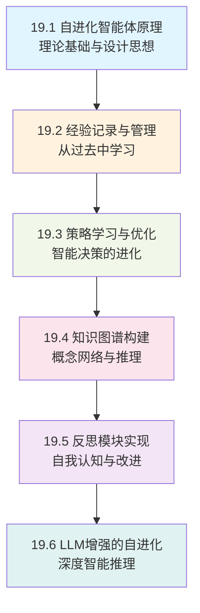
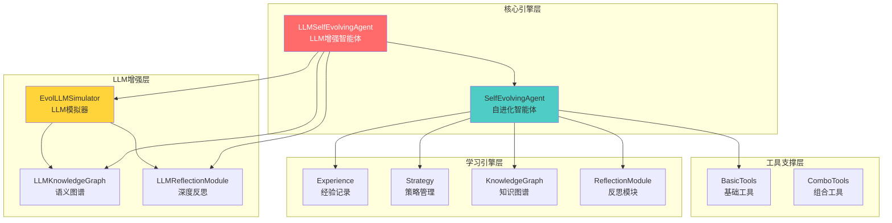
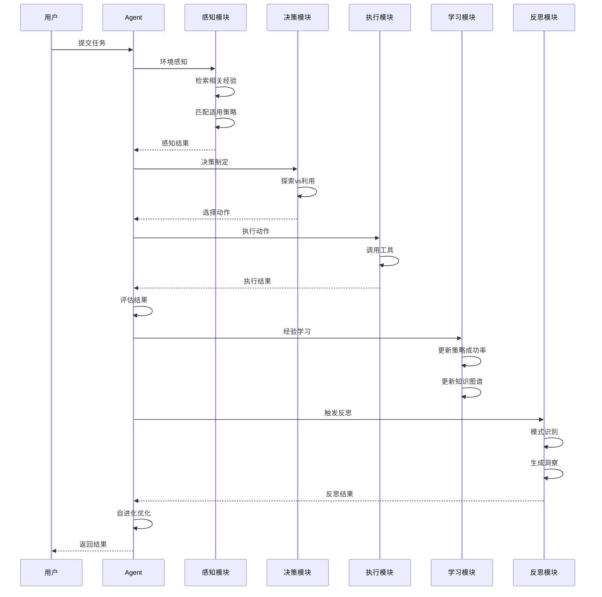
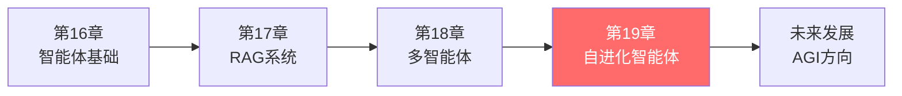

# 第19章：自进化智能体

> **从被动执行到主动学习的跨越**

## 章节概述

自进化智能体代表了AI系统从"被动执行"向"主动学习"的质的飞跃。就像人类通过经验不断成长一样,自进化智能体能够从每次任务执行中学习、优化策略、积累知识,最终实现自我提升。

本章将带领你构建一个真正具备"学习能力"的AI系统,它能够:
- 🧠 从经验中学习和成长
- 🔄 持续优化决策策略
- 🌐 构建领域知识图谱
- 💡 进行自我反思和改进
- 🚀 利用LLM实现深度推理

## 学习目标

完成本章学习后,你将能够:

- ✅ **理解自进化的本质** - 掌握智能体如何从经验中学习和成长
- ✅ **掌握经验管理机制** - 实现完整的经验记录、检索和利用系统
- ✅ **实现策略优化系统** - 构建动态策略学习和进化机制
- ✅ **构建知识图谱** - 理解概念关系网络的构建和推理
- ✅ **实现反思模块** - 让智能体具备自我反思和改进能力
- ✅ **掌握LLM增强技术** - 结合大语言模型实现深度智能推理

## 章节结构



### 小节列表

| 小节 | 标题 | 核心内容 | 预计篇幅 |
|-----|------|---------|---------|
| 19.1 | 自进化智能体原理 | 自学习原理、架构设计、探索-利用平衡 | ~20页 |
| 19.2 | 经验记录与管理 | Experience设计、经验检索、数据管理 | ~18页 |
| 19.3 | 策略学习与优化 | Strategy设计、成功率更新、策略进化 | ~20页 |
| 19.4 | 知识图谱构建 | 图结构、概念嵌入、相似度计算 | ~19页 |
| 19.5 | 反思模块实现 | 模式识别、反思生成、洞察提取 | ~18页 |
| 19.6 | LLM增强的自进化 | LLM模拟器、深度推理、异步处理 | ~25页 |

## 核心架构

### 系统整体架构



### 核心工作流程



## 核心模块

### 1. Experience - 经验记录系统

经验是学习的基石。完整记录每次任务执行的上下文、动作、结果和反思。

**核心字段**:
- task: 任务描述
- context: 上下文信息
- action: 执行动作
- result: 执行结果
- success: 成功标志
- reward: 奖励值
- timestamp: 时间戳
- reflection: 反思内容

### 2. Strategy - 策略管理系统

策略是智能体的"武器库",每个策略代表在特定情境下的最佳行动方案。

**核心字段**:
- name: 策略名称
- description: 策略描述
- conditions: 适用条件
- actions: 动作序列
- successRate: 成功率
- usageCount: 使用次数

**成功率更新算法** (指数移动平均):
```
newSuccessRate = (1 - α) × oldSuccessRate + α × currentResult
```

### 3. KnowledgeGraph - 知识图谱系统

知识图谱将离散的经验片段连接成网络,通过概念和关系的表示实现类比推理、知识迁移和关联发现。

**核心组件**:
- ConceptNode: 概念节点 (含128维嵌入向量)
- RelationEdge: 关系边 (记录关系类型和权重)
- 余弦相似度计算
- 广度优先搜索

### 4. ReflectionModule - 反思分析引擎

反思是智能体的"自我批评"能力。通过分析经验中的模式,发现规律、识别错误、生成改进建议。

**模式类型**:
- 成功模式: 高成功率的动作组合
- 失败模式: 常见的失败场景
- 时间模式: 性能的趋势变化
- 上下文模式: 环境因素的影响

### 5. LLM增强组件

**EvolLLMSimulator** - 将大语言模型作为"智能顾问",提供:
- 策略推理: 复杂决策场景的建议
- 深度反思: 根因分析和改进建议
- 知识推理: 语义关系推断
- 模式分析: 趋势发现和预测

**置信度驱动决策**: 高置信度采用LLM建议,低置信度回退到规则系统

## 自进化机制

### 探索-利用平衡 (Exploration-Exploitation)

就像一个人在餐厅点菜:
- **利用 (Exploitation)**: 点自己知道好吃的菜 (使用已知的高成功率策略)
- **探索 (Exploration)**: 尝试没点过的新菜 (尝试新策略或工具)

**动态调整策略**:

| 性能状态 | 平均成功率 | 探索率调整 | 原因 |
|----------|------------|------------|------|
| 表现不佳 | < 60% | 增加探索 (+0.05) | 当前策略不理想,需要寻找新方法 |
| 表现优秀 | > 80% | 减少探索 (-0.02) | 当前策略有效,应多利用 |
| 表现一般 | 60%-80% | 保持当前 | 平衡状态 |

探索率边界: 最小值0.1,最大值0.5

### 策略进化机制

**触发条件**:
- 每执行10个任务
- 性能出现显著变化
- 手动调用selfEvolve()

**进化流程**:
1. 策略优化: 清理低效策略、合并相似策略
2. 知识整合: 更新知识图谱、建立新关联
3. 能力扩展: 发现动作组合、创建组合工具
4. 参数调整: 调整学习率、调整探索率

## 应用场景

### 场景1: 智能学习助手

为学生提供个性化学习辅导,根据学生的学习表现动态调整教学策略。

**学习到的知识**:
- 学生的知识薄弱点
- 有效的解释方式
- 不同难度的适配策略
- 学习进度跟踪

### 场景2: 自适应代码助手

辅助开发者编写代码,根据项目特点、编程语言和开发者风格提供个性化建议。

**积累的能力**:
- 项目的编码规范
- 常用的设计模式
- 开发者的偏好风格
- 高频Bug类型

### 场景3: 智能数据分析平台

自动分析业务数据,发现趋势和异常,随着分析经验积累不断优化分析方法。

**自进化价值**:
- 自动发现数据间的关联
- 学习有效的分析指标
- 适应不同行业特点
- 预测未来趋势

### 场景4: LLM增强的研究助手

辅助研究人员阅读文献、提取关键信息、构建领域知识图谱。

**LLM的价值**:
- 语义理解: 更准确的相关文献
- 因果推理: 深层关联发现
- 灵活总结: 更好的可读性
- 智能组织: 知识体系化

## 技术亮点

### 1. 增量式学习

每次任务都是学习机会,不断积累改进,无需大规模训练数据。

### 2. 多层次学习

- **策略层面**: 学习哪些策略有效
- **知识层面**: 积累领域知识图谱
- **元学习层面**: 学习如何更好地学习

### 3. 智能增强

- **LLM提供**: 深度推理、语义理解
- **规则保证**: 可靠性、可控性
- **置信度驱动**: 智能融合两者优势

### 4. 优雅降级

LLM失效时自动回退到规则系统,保证系统稳定性。

### 5. 异步处理

LLM推理异步执行,不阻塞主流程,提升响应速度。

## 性能优化

### 内存管理

- 经验库限制: 最大1000条,智能清理低价值经验
- 知识图谱清理: 移除弱关系边和孤立节点
- 策略优化: 淘汰低成功率策略

### 并发安全

- 使用ConcurrentHashMap和Collections.synchronizedList
- 关键操作加锁保护
- 线程安全的数据结构

### 检索优化

- 按任务类型、时间窗口、成功/失败分索引
- LRU缓存常见上下文的匹配结果
- 减少重复计算

## 实践建议

### 开发阶段

1. **第一阶段**: 实现基础版本 (不含LLM)
   - 先掌握核心机制
   - 验证学习效果
   - 建立基准性能

2. **第二阶段**: 集成LLM增强
   - 逐步开启LLM功能
   - 对比增强效果
   - 优化置信度阈值

3. **第三阶段**: 性能优化
   - 启用异步处理
   - 实现缓存机制
   - 优化内存使用

### 应用阶段

1. **冷启动期** (第1-10次任务)
   - 设置高探索率 (0.4-0.5)
   - 重点收集经验
   - 观察学习趋势

2. **快速成长期** (第11-50次任务)
   - 逐步降低探索率
   - 关注策略质量
   - 优化知识图谱

3. **稳定运行期** (第50次任务以后)
   - 保持10%-15%探索率
   - 定期反思和进化
   - 监控性能指标

## 与前后章节的关系



**承接关系**:
- 基于第16章的基础智能体架构
- 利用第17章的RAG知识管理能力
- 可与第18章的多智能体系统协作

**创新点**:
- 引入自学习和自进化能力
- 实现经验驱动的策略优化
- 构建智能反思和元学习机制

## 核心代码模块

本章对应的代码实现位于 `tinyai-agent-evol` 模块:

```
tinyai-agent-evol/
├── src/main/java/io/leavesfly/tinyai/agent/evol/
│   ├── SelfEvolvingAgent.java           # 自进化智能体核心
│   ├── LLMSelfEvolvingAgent.java        # LLM增强智能体
│   ├── Experience.java                  # 经验记录
│   ├── Strategy.java                    # 策略管理
│   ├── KnowledgeGraph.java              # 知识图谱
│   ├── ReflectionModule.java            # 反思模块
│   ├── EvolLLMSimulator.java            # LLM模拟器
│   ├── LLMKnowledgeGraph.java           # 语义知识图谱
│   ├── LLMReflectionModule.java         # 深度反思
│   └── tools/                           # 工具类
└── src/test/java/io/leavesfly/tinyai/agent/evol/
    └── ...                              # 单元测试
```

## 学习路径

**理论学习**:
1. 阅读 [19.1 自进化智能体原理](19.1-self-evolving-agent-principles.md) - 理解自进化原理
2. 阅读 [19.2 经验记录与管理](19.2-experience-recording-management.md) - 掌握经验系统
3. 阅读 [19.3 策略学习与优化](19.3-strategy-learning-optimization.md) - 理解策略进化
4. 阅读 [19.4 知识图谱构建](19.4-knowledge-graph-construction.md) - 掌握知识网络
5. 阅读 [19.5 反思模块实现](19.5-reflection-module-implementation.md) - 理解自我反思
6. 阅读 [19.6 LLM增强的自进化](19.6-llm-enhanced-self-evolution.md) - 了解深度推理

**实践开发**:
1. 实现 Experience 和 Strategy 类
2. 构建 KnowledgeGraph 和 ReflectionModule
3. 实现 SelfEvolvingAgent 主类
4. 编写测试用例
5. 运行演示程序
6. (可选) 集成LLM增强

**进阶提升**:
1. 实现自定义工具
2. 设计领域特定策略
3. 构建专业知识图谱
4. 优化性能和内存
5. 尝试分布式部署

## 成果预期

完成本章学习后,你将能够:

✅ **理解深刻**: 掌握自进化智能体的内核原理  
✅ **动手实现**: 独立开发具备自学习能力的AI系统  
✅ **灵活设计**: 根据实际场景选择合适的架构和策略  
✅ **性能优化**: 优化内存、并发和响应性能  
✅ **生产部署**: 将系统部署到真实业务环境  
✅ **持续改进**: 监控和调优智能体的学习过程

## 参考资料

### 核心论文

1. **强化学习基础**
   - Sutton & Barto, "Reinforcement Learning: An Introduction"
   - 经典的强化学习教材,介绍探索-利用、价值函数等

2. **知识图谱**
   - Ehrlinger & Wöß, "Towards a Definition of Knowledge Graphs"
   - 知识图谱的定义和构建方法

3. **元学习**
   - Thrun & Pratt, "Learning to Learn"
   - 元学习的理论和应用

### 技术博客

1. **强化学习**
   - OpenAI Spinning Up: https://spinningup.openai.com/
   - 实用的强化学习教程

2. **知识图谱**
   - Neo4j Graph Academy: https://graphacademy.neo4j.com/
   - 图数据库和知识图谱实践

### 开源项目

1. **AutoGPT**
   - https://github.com/Significant-Gravitas/AutoGPT
   - 自主学习的GPT智能体

2. **LangChain**
   - https://github.com/langchain-ai/langchain
   - LLM应用开发框架

### 相关文档

1. **TinyAI项目文档**
   - `tinyai-agent-evol/doc/技术架构文档.md`
   - `tinyai-agent-evol/doc/LLM改造技术文档.md`

2. **相关章节**
   - [第16章: 智能体基础架构](../chapter16-agent-foundation/README.md)
   - [第17章: RAG系统与知识管理](../chapter17-rag-system/README.md)
   - [第18章: 多智能体系统](../chapter18-multi-agent/README.md)

---

**章节总结**:

自进化智能体代表了AI系统从"被动执行"向"主动学习"的跨越。通过经验积累、策略优化、知识构建和反思改进的闭环机制,智能体能够像人类一样从经验中不断成长。结合LLM的深度推理能力,自进化智能体展现出了趋向通用人工智能的广阔前景。

希望通过本章的学习,你能够掌握自进化智能体的核心技术,并在实际应用中构建具备真正智能的AI系统。这不仅是Java程序员的AI之路,更是通向智能未来的重要里程碑。
