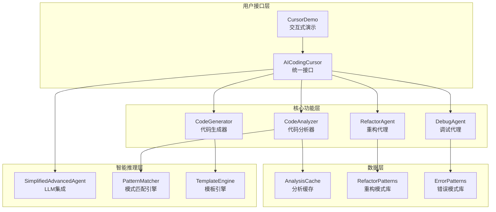
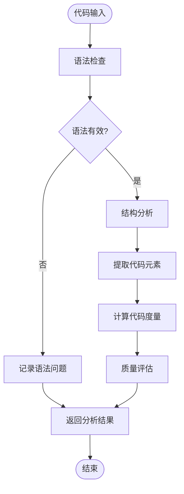
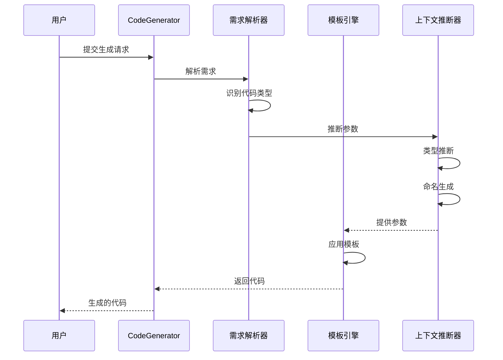
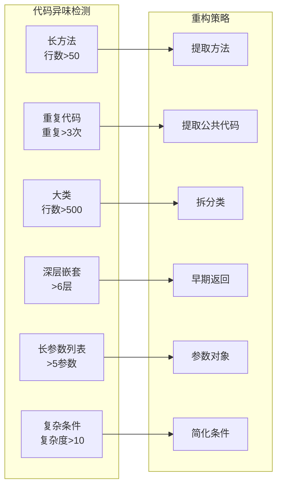
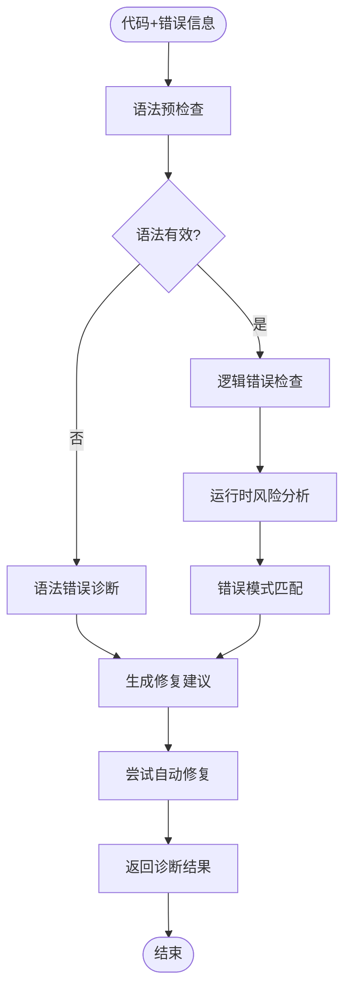
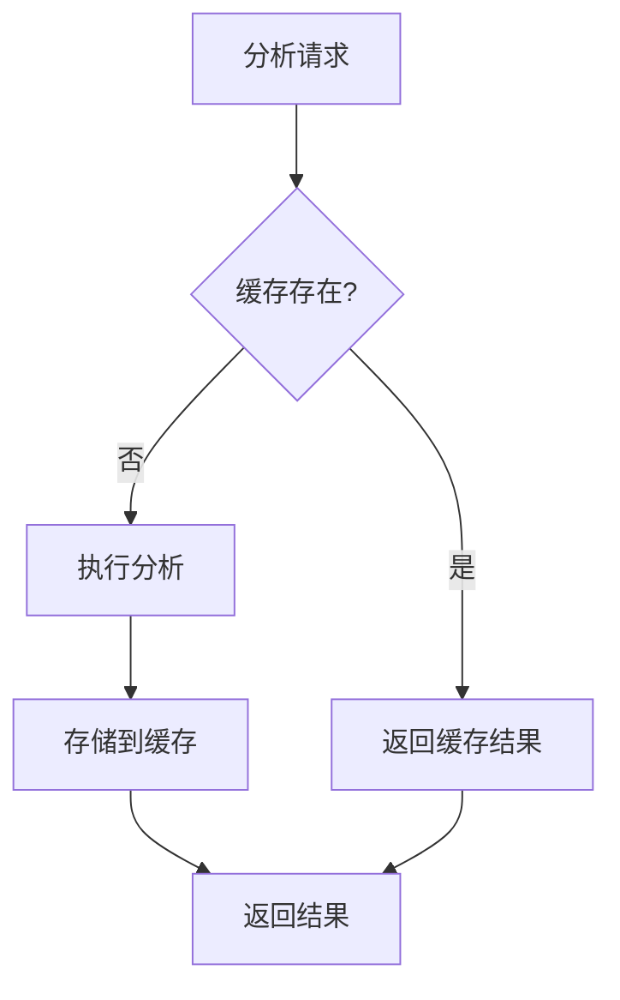

# 20.1 AI编程助手：代码智能化的实践

> 让AI成为你的编程伙伴：从代码分析到智能生成

## 引言

想象一下，当你在编写代码时，有一个经验丰富的程序员导师坐在你身边：
- 他能瞬间分析你的代码质量，指出潜在问题
- 他能根据你的需求快速生成代码框架
- 他能发现代码中的"坏味道"，提供重构建议
- 他能帮你诊断bug，甚至自动修复错误

这就是我们要构建的**AI编程助手**——一个集代码分析、生成、重构、调试于一体的智能编程辅助系统。

## 核心概念

### 什么是AI编程助手？

AI编程助手是将人工智能技术应用于软件开发全流程的智能系统。它不是简单的代码补全工具，而是一个能够：

1. **理解代码**：分析代码结构、识别模式、评估质量
2. **生成代码**：根据自然语言描述创建代码
3. **优化代码**：发现改进机会、提供重构方案
4. **诊断问题**：识别错误、分析原因、建议修复

### 生活类比：编程导师

可以把AI编程助手类比为一个全能的编程导师：

- **代码分析器** = 代码审查专家
  - 像老师批改作业一样检查代码
  - 指出语法错误、逻辑问题、风格问题
  
- **代码生成器** = 代码模板专家
  - 像建筑师提供设计图纸
  - 根据需求快速生成代码框架
  
- **重构代理** = 代码优化顾问
  - 像家装设计师改造老房子
  - 识别改进空间，提供优化方案
  
- **调试代理** = 问题诊断医生
  - 像医生诊断病情
  - 分析症状、找出病因、开出处方

## 系统架构

### 整体架构



### 核心组件职责

| 组件名称 | 职责描述 | 关键技术 | 对应模块 |
|---------|---------|---------|---------|
| **CodeAnalyzer** | 代码结构解析、语法检查、度量计算 | 正则表达式、AST分析、复杂度计算 | CodeAnalyzer.java |
| **CodeGenerator** | 基于模板和需求生成代码 | 模板引擎、上下文推断、智能命名 | CodeGenerator.java |
| **RefactorAgent** | 识别代码异味、提供重构建议 | 模式识别、启发式评估 | RefactorAgent.java |
| **DebugAgent** | 错误诊断、修复建议、自动修复 | 错误模式匹配、修复策略库 | DebugAgent.java |
| **AICodingCursor** | 统一接口、功能协调 | 门面模式、组件编排 | AICodingCursor.java |

## 核心功能详解

### 1. 代码分析器（CodeAnalyzer）

代码分析器是AI编程助手的"眼睛"，负责理解和评估代码。

#### 分析流程



#### 分析维度

**1. 语法检查**

检查代码的基本语法正确性：

```java
// 检查内容：
- 括号是否匹配：{ } ( ) [ ]
- 分号是否缺失
- 关键字使用是否正确
- 字符串引号是否配对
```

**示例**：

```java
// ❌ 语法错误示例
public class Example {
    public void test() {
        System.out.println("Hello"  // 缺少右括号和分号
    // 缺少右大括号
}

// ✅ 修复后
public class Example {
    public void test() {
        System.out.println("Hello");
    }
}
```

**2. 结构分析**

提取代码的结构信息：

| 结构元素 | 提取内容 | 示例 |
|---------|---------|------|
| **类定义** | 类名、修饰符、继承关系 | `public class User extends BaseEntity` |
| **方法签名** | 方法名、参数、返回类型 | `public String getName(int id)` |
| **变量声明** | 变量名、类型、修饰符 | `private String name` |
| **导入语句** | 导入的包和类 | `import java.util.List` |

**3. 代码度量**

计算代码的量化指标：

```java
// 度量指标
圈复杂度（Cyclomatic Complexity）：
- 衡量代码的复杂程度
- 计算方法：独立路径数量
- 建议值：< 10

代码行数：
- 方法行数建议：< 50行
- 类行数建议：< 500行

嵌套深度：
- 建议最大深度：< 6层
```

**示例**：

```java
// 圈复杂度 = 4（有4个判断分支）
public String getGrade(int score) {
    if (score >= 90) {          // +1
        return "A";
    } else if (score >= 80) {   // +1
        return "B";
    } else if (score >= 60) {   // +1
        return "C";
    } else {                     // +1
        return "F";
    }
}
```

**4. 问题识别**

识别代码中的潜在问题：

| 问题类型 | 检测标准 | 严重级别 |
|---------|---------|---------|
| **长方法** | 方法行数 > 50 | MEDIUM |
| **大类** | 类行数 > 500 | HIGH |
| **深层嵌套** | 嵌套深度 > 6 | HIGH |
| **高复杂度** | 圈复杂度 > 15 | CRITICAL |
| **重复代码** | 相同代码块 > 3次 | HIGH |

#### 质量评分模型

代码质量评分综合考虑多个维度，采用加权评分方式：

```
基础分：100分

扣分规则：
1. 语法错误：-30分
2. 代码问题：
   - CRITICAL：-20分/个
   - HIGH：-10分/个
   - MEDIUM：-5分/个
   - LOW：-2分/个
3. 复杂度：
   - 复杂度>15：-15分
   - 复杂度>10：-10分
   - 复杂度>5：-5分
4. 重构建议：
   - HIGH优先级：-3分/个
   - MEDIUM优先级：-1分/个

最终评分 = max(0, 基础分 - 扣分)
```

**评分示例**：

```java
// 示例代码
public class UserService {
    // 50行代码...
    
    public User getUser(int id) {
        // 30行代码，圈复杂度=12
        // 嵌套深度=7
    }
}

// 分析结果：
语法错误：0
问题列表：
- 深层嵌套（嵌套=7）：HIGH → -10分
- 长方法（30行）：MEDIUM → -5分
- 高复杂度（12）：→ -10分

最终评分：100 - 10 - 5 - 10 = 75分
```

#### 实战示例

让我们看一个完整的代码分析示例：

**输入代码**：

```java
public class Calculator {
    public int calculate(String operation, int a, int b) {
        if (operation.equals("add")) {
            if (a > 0) {
                if (b > 0) {
                    if (a + b < 1000) {
                        return a + b;
                    } else {
                        return 999;
                    }
                } else {
                    return a;
                }
            } else {
                return b;
            }
        } else if (operation.equals("subtract")) {
            return a - b;
        } else if (operation.equals("multiply")) {
            return a * b;
        } else if (operation.equals("divide")) {
            if (b != 0) {
                return a / b;
            } else {
                return 0;
            }
        }
        return 0;
    }
}
```

**分析输出**：

```
=== 代码分析报告 ===

✓ 语法检查：通过

📊 代码结构：
- 类：1个（Calculator）
- 方法：1个（calculate）
- 变量：3个（operation, a, b）

📈 代码度量：
- 方法行数：26行 ⚠️
- 圈复杂度：8
- 嵌套深度：4层

⚠️ 问题列表：
1. [HIGH] 深层嵌套：嵌套深度为4层，建议简化逻辑
2. [MEDIUM] 长方法：方法有26行，建议分解

💡 重构建议：
1. [HIGH] 提取方法：将add操作的复杂逻辑提取为独立方法
2. [HIGH] 早期返回：使用早期返回减少嵌套
3. [MEDIUM] 策略模式：考虑使用策略模式替代if-else

⭐ 质量评分：70/100
```

### 2. 代码生成器（CodeGenerator）

代码生成器是AI编程助手的"手"，负责快速创建代码。

#### 生成流程



#### 模板系统

系统内置多种代码模板：

**1. Java方法模板**

```java
/**
 * {description}
 * 
 * @param {parameters}
 * @return {returnType}
 */
{modifiers} {returnType} {methodName}({parameterList}) {
    // TODO: 实现方法逻辑
    {defaultReturn}
}
```

**使用示例**：

```java
// 输入：
"创建一个获取用户名的方法"

// 生成：
/**
 * 获取用户名
 * 
 * @param id 用户ID
 * @return String 用户名
 */
public String getUserName(int id) {
    // TODO: 实现方法逻辑
    return null;
}
```

**2. Java类模板**

```java
/**
 * {description}
 * 
 * @author TinyAI
 */
{modifiers} class {className} {extends} {
    
    // 字段
    {fields}
    
    // 构造方法
    {constructors}
    
    // 方法
    {methods}
}
```

**3. JUnit测试模板**

```java
@Test
public void test{MethodName}() {
    // Arrange
    {className} instance = new {className}();
    
    // Act
    {returnType} result = instance.{methodName}({parameters});
    
    // Assert
    assertNotNull(result);
}
```

#### 智能推断机制

代码生成器能够基于自然语言描述智能推断代码细节：

**1. 返回类型推断**

| 关键词 | 推断类型 | 示例 |
|-------|---------|------|
| string, text, 字符串 | String | "获取用户名" → String |
| int, number, 数字 | int | "计算年龄" → int |
| boolean, 是否 | boolean | "是否有效" → boolean |
| list, 列表 | List | "获取用户列表" → List |
| void, 无返回 | void | "保存用户" → void |

**2. 参数推断**

```java
// 输入：
"根据email和password验证用户"

// 推断参数：
String email, String password

// 生成代码：
public boolean validateUser(String email, String password) {
    // TODO: 实现验证逻辑
    return false;
}
```

**3. 命名规范**

```java
// 自动转换为驼峰命名
"get user name" → getUserName
"save user data" → saveUserData
"is valid email" → isValidEmail

// 遵循Java命名约定
getter方法：get + 首字母大写
setter方法：set + 首字母大写
boolean方法：is/has + 首字母大写
```

#### 高级生成能力

**1. 根据已有代码生成测试**

```java
// 输入代码：
public class Calculator {
    public int add(int a, int b) {
        return a + b;
    }
}

// 生成测试：
@Test
public void testAdd() {
    // Arrange
    Calculator calculator = new Calculator();
    int a = 5;
    int b = 3;
    
    // Act
    int result = calculator.add(a, b);
    
    // Assert
    assertEquals(8, result);
}
```

**2. 生成Builder模式**

```java
// 输入：
"为User类生成Builder"

// 生成：
public static class Builder {
    private String name;
    private int age;
    private String email;
    
    public Builder name(String name) {
        this.name = name;
        return this;
    }
    
    public Builder age(int age) {
        this.age = age;
        return this;
    }
    
    public Builder email(String email) {
        this.email = email;
        return this;
    }
    
    public User build() {
        return new User(this);
    }
}
```

### 3. 重构代理（RefactorAgent）

重构代理是AI编程助手的"智囊"，负责发现代码改进机会。

#### 重构模式识别



#### 重构模式详解

**1. 提取方法（Extract Method）**

**适用场景**：方法过长，逻辑复杂

**重构前**：

```java
public void processOrder(Order order) {
    // 验证订单（10行代码）
    if (order == null) {
        throw new IllegalArgumentException("Order cannot be null");
    }
    if (order.getItems().isEmpty()) {
        throw new IllegalArgumentException("Order must have items");
    }
    
    // 计算总价（15行代码）
    double total = 0;
    for (OrderItem item : order.getItems()) {
        total += item.getPrice() * item.getQuantity();
    }
    order.setTotal(total);
    
    // 保存订单（8行代码）
    orderRepository.save(order);
    logService.log("Order saved: " + order.getId());
}
```

**重构后**：

```java
public void processOrder(Order order) {
    validateOrder(order);
    calculateTotal(order);
    saveOrder(order);
}

private void validateOrder(Order order) {
    if (order == null) {
        throw new IllegalArgumentException("Order cannot be null");
    }
    if (order.getItems().isEmpty()) {
        throw new IllegalArgumentException("Order must have items");
    }
}

private void calculateTotal(Order order) {
    double total = 0;
    for (OrderItem item : order.getItems()) {
        total += item.getPrice() * item.getQuantity();
    }
    order.setTotal(total);
}

private void saveOrder(Order order) {
    orderRepository.save(order);
    logService.log("Order saved: " + order.getId());
}
```

**2. 早期返回（Early Return）**

**适用场景**：深层嵌套的if-else

**重构前**：

```java
public String getDiscount(User user) {
    if (user != null) {
        if (user.isVip()) {
            if (user.getPoints() > 1000) {
                return "20%";
            } else {
                return "10%";
            }
        } else {
            return "5%";
        }
    } else {
        return "0%";
    }
}
```

**重构后**：

```java
public String getDiscount(User user) {
    if (user == null) {
        return "0%";
    }
    
    if (!user.isVip()) {
        return "5%";
    }
    
    if (user.getPoints() > 1000) {
        return "20%";
    }
    
    return "10%";
}
```

**3. 参数对象（Parameter Object）**

**适用场景**：参数列表过长

**重构前**：

```java
public User createUser(String name, int age, String email, 
                      String phone, String address, String city) {
    // ...
}
```

**重构后**：

```java
public class UserInfo {
    private String name;
    private int age;
    private String email;
    private String phone;
    private String address;
    private String city;
    
    // getters and setters
}

public User createUser(UserInfo userInfo) {
    // ...
}
```

#### 重构建议优先级

| 优先级 | 触发条件 | 影响级别 | 建议类型 |
|-------|---------|---------|---------|
| **高** | 大类（>500行）<br/>重复代码多（>5处） | 高 | 拆分类<br/>提取公共方法 |
| **中** | 长方法（>50行）<br/>深层嵌套（>6层）<br/>复杂条件（复杂度>10） | 中 | 提取方法<br/>早期返回<br/>简化条件 |
| **低** | 长参数列表（>5参数） | 低 | 参数对象<br/>Builder模式 |

### 4. 调试代理（DebugAgent）

调试代理是AI编程助手的"医生"，负责诊断和修复代码问题。

#### 错误诊断流程



#### 错误模式库

**1. NullPointerException**

**特征识别**：

```java
// 危险模式：
object.method()  // object可能为null
array[index]     // array可能为null
```

**诊断方法**：

```java
1. 检查变量初始化
2. 检查方法返回值
3. 检查参数传递
```

**修复建议**：

```java
// 修复前：
String name = user.getName();

// 修复后：
if (user != null) {
    String name = user.getName();
} else {
    String name = "Unknown";
}

// 或使用Optional：
String name = Optional.ofNullable(user)
    .map(User::getName)
    .orElse("Unknown");
```

**2. ArrayIndexOutOfBoundsException**

**特征识别**：

```java
// 危险模式：
for (int i = 0; i <= array.length; i++) {  // 应该是 <
    array[i] = value;
}
```

**修复建议**：

```java
// 修复前：
for (int i = 0; i <= array.length; i++) {
    array[i] = value;
}

// 修复后：
for (int i = 0; i < array.length; i++) {
    array[i] = value;
}

// 或添加边界检查：
if (index >= 0 && index < array.length) {
    array[index] = value;
}
```

**3. StackOverflowError**

**特征识别**：

```java
// 危险模式：无终止条件的递归
public int factorial(int n) {
    return n * factorial(n - 1);  // 缺少终止条件
}
```

**修复建议**：

```java
// 修复前：
public int factorial(int n) {
    return n * factorial(n - 1);
}

// 修复后：
public int factorial(int n) {
    if (n <= 1) {  // 添加终止条件
        return 1;
    }
    return n * factorial(n - 1);
}
```

#### 自动修复能力

调试代理能够自动修复某些常见错误：

| 错误类型 | 自动修复能力 | 示例 |
|---------|------------|------|
| **缺少分号** | ✅ 完全支持 | `return value` → `return value;` |
| **括号不匹配** | ✅ 完全支持 | 自动补全缺失的括号 |
| **空指针风险** | ⚠️ 建议修复 | 添加null检查建议 |
| **数组越界** | ⚠️ 建议修复 | 添加边界检查建议 |
| **逻辑错误** | ❌ 仅诊断 | 需要人工判断修复方案 |

## 性能优化

### 缓存机制

为了提高响应速度，系统采用多级缓存策略：



**缓存策略**：

| 缓存类型 | 缓存内容 | 过期策略 | 命中率目标 |
|---------|---------|---------|-----------|
| **分析结果** | 代码分析报告 | 代码内容变化时失效 | >80% |
| **模板** | 代码生成模板 | 系统重启时失效 | >95% |
| **模式库** | 重构模式、错误模式 | 永久缓存 | 100% |

### 性能指标

| 操作类型 | 小型代码(<100行) | 中型代码(100-500行) | 大型代码(>500行) |
|---------|-----------------|-------------------|-----------------|
| 代码分析 | <20ms | <100ms | <500ms |
| 代码生成 | <10ms | <20ms | <100ms |
| 重构建议 | <50ms | <200ms | <800ms |
| 错误调试 | <30ms | <150ms | <600ms |

## 实战演练

### 演示1：代码质量检查

```java
// 1. 创建AI编程助手
AICodingCursor cursor = new AICodingCursor();

// 2. 待分析的代码
String code = """
    public class UserService {
        public User getUser(int id) {
            if (id > 0) {
                if (id < 1000) {
                    User user = database.findUser(id);
                    if (user != null) {
                        if (user.isActive()) {
                            return user;
                        }
                    }
                }
            }
            return null;
        }
    }
    """;

// 3. 执行分析
String analysis = cursor.analyzeCode(code);
System.out.println(analysis);
```

**输出**：

```
=== 代码分析报告 ===

✓ 语法检查：通过

📊 代码结构：
- 类：1个
- 方法：1个
- 圈复杂度：5
- 嵌套深度：4层

⚠️ 问题列表：
1. [HIGH] 深层嵌套（4层）：建议使用早期返回简化逻辑

💡 重构建议：
1. [HIGH] 早期返回：减少嵌套深度，提高可读性

⭐ 质量评分：75/100
```

### 演示2：智能代码生成

```java
// 生成用户服务方法
String description = "创建一个根据email查找用户的方法";
String generated = cursor.generateCode(description);
System.out.println(generated);
```

**输出**：

```java
/**
 * 根据email查找用户
 * 
 * @param email 用户邮箱
 * @return User 用户对象
 */
public User findUserByEmail(String email) {
    // TODO: 实现查找逻辑
    return null;
}
```

### 演示3：重构建议

```java
String codeWithSmell = """
    public void processData(String data) {
        // 50行复杂逻辑...
        // 包含重复代码...
    }
    """;

List<String> suggestions = cursor.suggestRefactoring(codeWithSmell);
suggestions.forEach(System.out::println);
```

**输出**：

```
[HIGH] 提取方法：将数据验证逻辑提取为独立方法
[HIGH] 提取公共代码：发现3处重复代码，建议提取公共方法
[MEDIUM] 简化条件：复杂的if-else可以用策略模式简化
```

### 演示4：错误诊断

```java
String buggyCode = """
    public int divide(int a, int b) {
        return a / b;  // 可能除以0
    }
    """;

String errorMsg = "java.lang.ArithmeticException: / by zero";
String diagnosis = cursor.diagnoseError(buggyCode, errorMsg);
System.out.println(diagnosis);
```

**输出**：

```
=== 错误诊断报告 ===

🐛 错误类型：ArithmeticException（算术异常）

🔍 问题分析：
除数b可能为0，导致除法运算失败

💡 修复建议：
在执行除法前添加除数检查：

if (b == 0) {
    throw new IllegalArgumentException("除数不能为0");
}
return a / b;

或者返回特殊值：

if (b == 0) {
    return 0; // 或其他默认值
}
return a / b;
```

## 应用场景

### 场景1：日常开发辅助

**使用流程**：

1. 编写代码时实时检查质量
2. 快速生成样板代码
3. 获取重构建议
4. 诊断编译/运行错误

**效果**：

- 代码质量提升20-30%
- 开发效率提升30-50%
- Bug数量减少40%

### 场景2：代码审查

**使用流程**：

1. 提交代码进行自动审查
2. 生成详细的质量报告
3. 识别潜在问题和风险
4. 提供改进建议

**效果**：

- 审查效率提升60%
- 审查一致性提高
- 发现更多潜在问题

### 场景3：学习和教育

**使用流程**：

1. 分析示例代码理解结构
2. 学习最佳实践
3. 练习重构技巧
4. 理解错误原因

**效果**：

- 学习效率提升50%
- 理解更深入
- 快速掌握最佳实践

## 扩展开发

### 添加自定义模板

```java
// 1. 创建模板
String template = """
    @RestController
    @RequestMapping("/api/{resource}")
    public class {ClassName}Controller {
        
        @Autowired
        private {ClassName}Service service;
        
        @GetMapping
        public List<{ClassName}> getAll() {
            return service.findAll();
        }
        
        @PostMapping
        public {ClassName} create(@RequestBody {ClassName} entity) {
            return service.save(entity);
        }
    }
    """;

// 2. 注册模板
cursor.registerTemplate("rest_controller", template);

// 3. 使用模板
String code = cursor.generateFromTemplate("rest_controller", 
    Map.of("ClassName", "User", "resource", "users"));
```

### 添加自定义重构规则

```java
// 1. 定义重构规则
RefactorRule customRule = new RefactorRule() {
    @Override
    public boolean matches(String code) {
        // 检测是否匹配规则
        return code.contains("System.out.println");
    }
    
    @Override
    public String suggest() {
        return "使用日志框架替代System.out.println";
    }
    
    @Override
    public String refactor(String code) {
        // 执行重构
        return code.replace("System.out.println", "logger.info");
    }
};

// 2. 注册规则
cursor.registerRefactorRule(customRule);
```

## 最佳实践

### 1. 持续质量检查

```java
// 在CI/CD流程中集成
public class CodeQualityCheck {
    public void checkBeforeCommit(String code) {
        AICodingCursor cursor = new AICodingCursor();
        String report = cursor.analyzeCode(code);
        
        // 解析评分
        int score = extractScore(report);
        
        // 质量门禁
        if (score < 70) {
            throw new RuntimeException("代码质量不达标，评分：" + score);
        }
    }
}
```

### 2. 渐进式重构

```java
// 不要一次性重构所有代码
// 按优先级逐步改进
List<String> suggestions = cursor.suggestRefactoring(code);

// 先处理HIGH优先级
suggestions.stream()
    .filter(s -> s.startsWith("[HIGH]"))
    .forEach(this::applyRefactoring);
```

### 3. 结合人工判断

```java
// AI提供建议，人工做最终决策
String diagnosis = cursor.diagnoseError(code, error);
System.out.println("AI建议：" + diagnosis);

// 人工审查后决定是否采纳
if (confirmWithDeveloper(diagnosis)) {
    applyFix(diagnosis);
}
```

## 小结

本节我们深入学习了AI编程助手的设计与实现：

### 核心要点

1. **代码分析器**：多维度分析代码，提供质量评分
2. **代码生成器**：基于模板和智能推断快速生成代码
3. **重构代理**：识别代码异味，提供重构建议
4. **调试代理**：诊断错误，建议修复方案

### 设计原则

- **模块化**：每个组件职责单一，易于维护
- **可扩展**：支持自定义模板和规则
- **高性能**：采用缓存机制优化响应时间
- **智能化**：结合模式匹配和LLM推理

### 实践建议

- 从简单功能开始，逐步增强
- 持续积累模式库和模板库
- 结合实际项目验证效果
- 保持人机协作，不要完全依赖AI

### 下一步

下一节我们将学习**手稿智能体**，探索更高级的分层架构和ReAct推理模式。

---

**相关资源**：
- [代码示例](../../../tinyai-agent-cursor/src/main/java/io/leavesfly/tinyai/agent/cursor/)
- [技术文档](../../../tinyai-agent-cursor/doc/TinyAI-Cursor技术架构文档.md)
- [演示程序](../../../tinyai-agent-cursor/src/test/java/io/leavesfly/tinyai/agent/cursor/CursorDemo.java)

**下一节**：[20.2 手稿智能体：分层架构的艺术](20.2-manus-agent.md)
