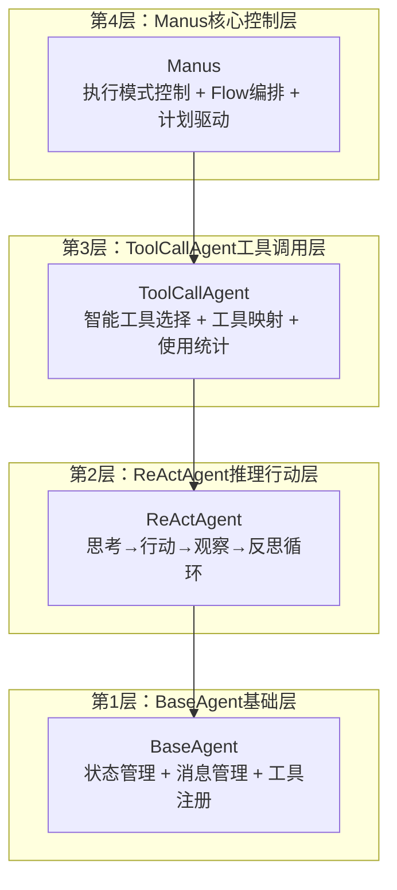
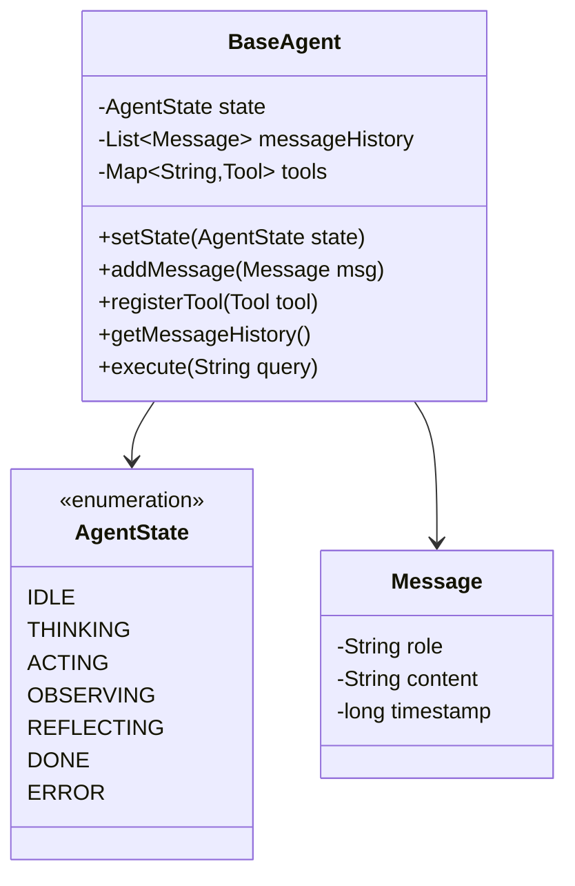
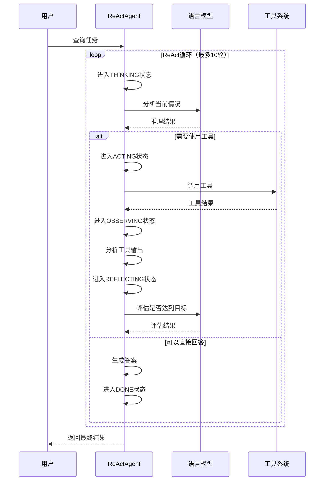
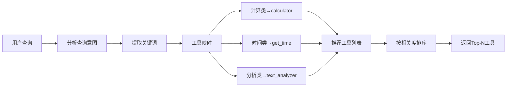
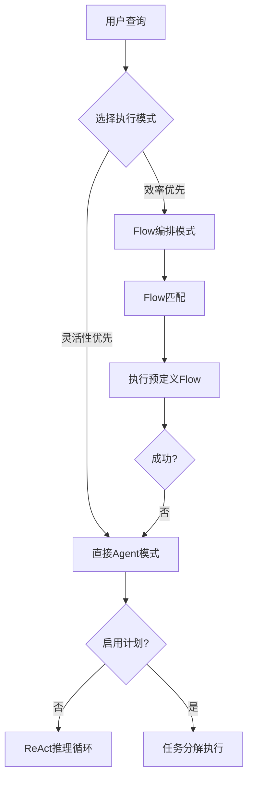
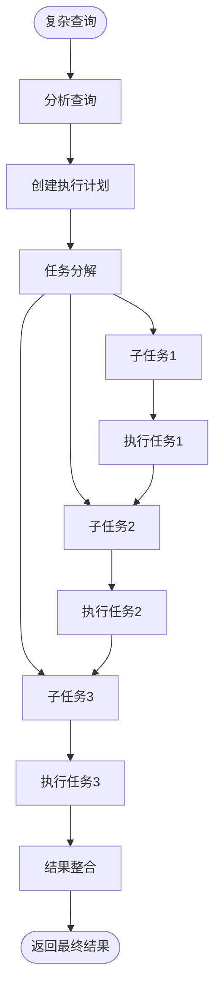
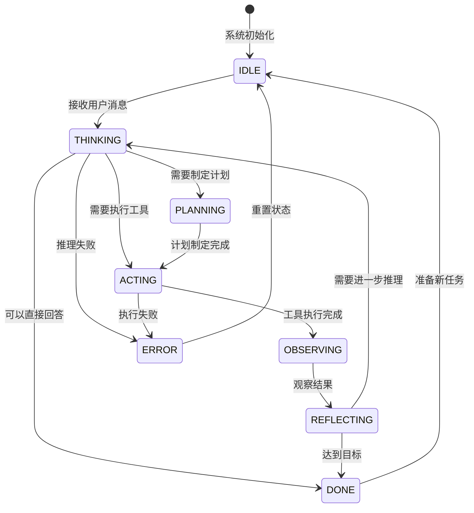
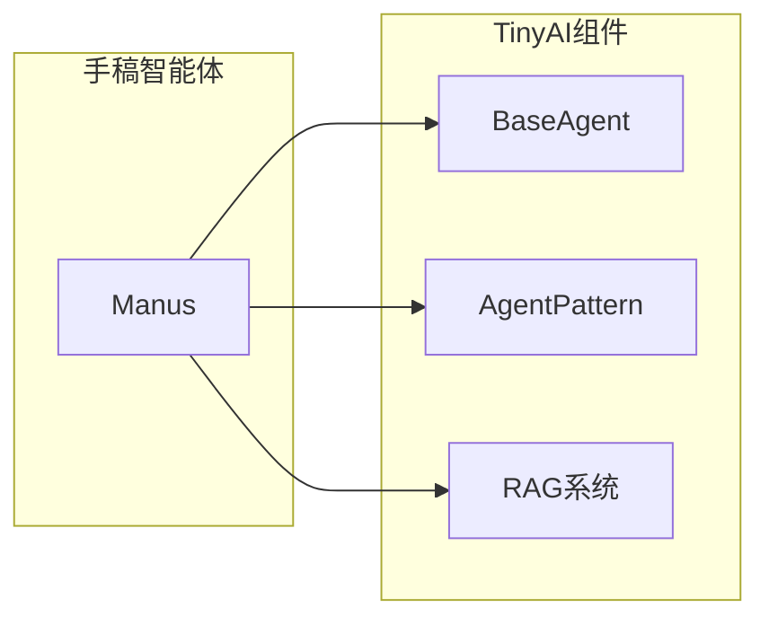

# 20.2 手稿智能体：分层架构的艺术

## 概念导入

想象你有一个非常能干的助手，你只需要告诉他"帮我预订明天去北京的机票"，他就会：
1. **思考**：需要查询航班信息、比较价格
2. **行动**：调用航班查询工具
3. **观察**：分析查询结果
4. **反思**：价格合理吗？还需要其他信息吗？
5. **继续行动**：如果满意就预订，否则重新查询

这就是**手稿智能体（Manus）**的工作方式。它采用**ReAct**（Reasoning + Acting）模式，像人类一样进行思考和行动的循环，直到完成任务。

### 为什么叫"手稿"（Manus）？

Manus在拉丁语中意为"手"，象征着这个智能体像人的双手一样，能够灵活地执行各种任务。它不仅能思考，更重要的是能**行动**——通过调用各种工具来完成实际任务。

## 四层架构设计

手稿智能体采用**分层架构设计**，每一层都在前一层的基础上增加新能力：



### 层次职责表

| 架构层次 | 核心职责 | 关键能力 | 生活类比 |
|---------|---------|---------|---------|
| **BaseAgent** | 基础能力提供 | 状态管理、消息历史、工具注册 | 大脑的基础记忆系统 |
| **ReActAgent** | 推理循环实现 | 思考→行动→观察→反思 | 大脑的决策系统 |
| **ToolCallAgent** | 工具增强 | 智能工具选择、工具链执行 | 知道何时使用哪个工具 |
| **Manus** | 系统控制 | 双执行机制、计划驱动 | 项目经理级别的统筹 |

### 为什么要分层？

就像建房子一样：
- **第1层（BaseAgent）**：地基，提供基本支撑
- **第2层（ReActAgent）**：框架，支持基本推理
- **第3层（ToolCallAgent）**：装修，增加工具能力
- **第4层（Manus）**：智能家居，提供高级控制

每一层都可以独立使用，也可以组合使用，这就是**分层架构的灵活性**。

## 第1层：BaseAgent基础层

### 核心功能

BaseAgent提供智能体的"基础设施"：



### 状态管理

智能体在执行过程中会经历不同的状态：

| 状态 | 含义 | 示例场景 |
|------|------|---------|
| **IDLE** | 空闲等待 | 刚启动，等待用户输入 |
| **THINKING** | 思考分析 | 分析用户问题，规划方案 |
| **ACTING** | 执行行动 | 调用工具执行任务 |
| **OBSERVING** | 观察结果 | 分析工具执行结果 |
| **REFLECTING** | 反思评估 | 评估是否达成目标 |
| **DONE** | 任务完成 | 成功完成任务 |
| **ERROR** | 错误状态 | 执行过程中出错 |

**状态转换示例**：

```java
BaseAgent agent = new BaseAgent();
agent.setState(AgentState.IDLE);           // 初始状态
agent.setState(AgentState.THINKING);       // 开始思考
agent.setState(AgentState.ACTING);         // 执行行动
agent.setState(AgentState.DONE);           // 完成任务
```

### 消息管理

智能体需要记住对话历史，就像人类记住谈话内容一样：

```java
// 添加用户消息
agent.addMessage(new Message("user", "帮我查询北京的天气"));

// 添加智能体回复
agent.addMessage(new Message("assistant", "我将为您查询北京的天气"));

// 获取历史消息
List<Message> history = agent.getMessageHistory();
```

### 工具注册

BaseAgent提供工具注册机制，就像给智能体提供工具箱：

```java
// 注册计算器工具
agent.registerTool("calculator", new CalculatorTool());

// 注册天气查询工具
agent.registerTool("weather", new WeatherTool());

// 注册时间查询工具
agent.registerTool("get_time", new TimeTool());
```

## 第2层：ReActAgent推理行动层

### ReAct循环详解

ReAct是"Reasoning + Acting"的缩写，代表**推理与行动的循环**。这是手稿智能体的核心机制。



### ReAct循环的生活类比

把ReAct循环想象成你在做饭：

1. **思考（Think）**："我要做什么菜？需要什么食材？"
   - 分析目标
   - 规划步骤
   - 决定下一步

2. **行动（Act）**："去冰箱拿鸡蛋"
   - 执行具体操作
   - 使用工具（冰箱）
   - 获取资源（鸡蛋）

3. **观察（Observe）**："鸡蛋新鲜吗？够用吗？"
   - 检查结果
   - 收集信息
   - 更新认知

4. **反思（Reflect）**："食材齐了吗？可以开始做了吗？"
   - 评估进度
   - 决定是否继续
   - 调整计划

### ReAct实现示例

```java
public class ReActAgent extends BaseAgent {
    private static final int MAX_ITERATIONS = 10;
    
    @Override
    public String execute(String query) {
        addMessage(new Message("user", query));
        
        for (int i = 0; i < MAX_ITERATIONS; i++) {
            // 1. 思考阶段
            setState(AgentState.THINKING);
            String thought = think(query);
            
            // 2. 判断是否需要工具
            if (needsTools(thought)) {
                // 3. 行动阶段
                setState(AgentState.ACTING);
                String action = decideAction(thought);
                String observation = performAction(action);
                
                // 4. 观察阶段
                setState(AgentState.OBSERVING);
                String analysis = analyzeObservation(observation);
                
                // 5. 反思阶段
                setState(AgentState.REFLECTING);
                if (goalAchieved(analysis)) {
                    setState(AgentState.DONE);
                    return generateFinalAnswer(analysis);
                }
            } else {
                // 可以直接回答
                setState(AgentState.DONE);
                return generateDirectAnswer(thought);
            }
        }
        
        return "达到最大迭代次数，任务未完成";
    }
}
```

## 第3层：ToolCallAgent工具调用层

### 智能工具选择

ToolCallAgent在ReActAgent的基础上，增加了**智能工具选择**能力：



### 工具映射机制

工具映射就像一个"智能索引"，根据查询内容自动推荐合适的工具：

| 查询特征 | 关键词 | 推荐工具 |
|---------|-------|---------|
| **计算类** | 计算、加、减、乘、除 | calculator |
| **时间类** | 时间、日期、今天 | get_time |
| **文本类** | 分析、统计、字数 | text_analyzer |
| **天气类** | 天气、温度、下雨 | weather |

**实现示例**：

```java
public List<String> recommendTools(String query) {
    List<String> recommendations = new ArrayList<>();
    
    // 计算类关键词
    if (query.matches(".*[计算加减乘除].*")) {
        recommendations.add("calculator");
    }
    
    // 时间类关键词
    if (query.matches(".*[时间日期今天].*")) {
        recommendations.add("get_time");
    }
    
    // 按相关度排序
    return sortByRelevance(recommendations, query);
}
```

### 工具链执行

有时需要**组合多个工具**才能完成任务，这就是工具链：

**示例场景**："查询北京今天的天气，如果温度超过30度，提醒我"

工具链：
1. **get_time** → 获取今天的日期
2. **weather** → 查询北京天气
3. **calculator** → 判断温度是否>30
4. **notification** → 发送提醒

```java
public String executeToolChain(String query) {
    String date = callTool("get_time", null);
    String weather = callTool("weather", Map.of("city", "北京", "date", date));
    boolean needAlert = callTool("calculator", Map.of("expr", "temp > 30"));
    if (needAlert) {
        callTool("notification", Map.of("message", "今天温度超过30度"));
    }
    return "任务完成";
}
```

### 工具使用统计

ToolCallAgent跟踪工具使用情况，用于优化推荐：

| 统计维度 | 用途 | 示例 |
|---------|------|------|
| **调用次数** | 评估工具热度 | calculator被调用100次 |
| **成功率** | 评估工具可靠性 | weather成功率95% |
| **平均响应时间** | 评估工具效率 | get_time平均10ms |

## 第4层：Manus核心控制层

### 双执行机制

Manus提供**两种执行模式**，就像汽车的手动挡和自动挡：



### 模式1：直接Agent模式

**适用场景**：探索性任务、灵活查询

**特点**：
- ✅ 灵活自适应
- ✅ 能处理未知任务
- ⚠️ 响应时间较长

**示例**：
```java
Manus manus = new Manus();
manus.setExecutionMode(ExecutionMode.DIRECT_AGENT);
String result = manus.execute("帮我分析这段代码的性能");
```

### 模式2：Flow编排模式

**适用场景**：重复性任务、特定领域

**特点**：
- ✅ 执行效率高
- ✅ 结果可预测
- ⚠️ 需要预定义Flow

**Flow定义示例**：
```java
Flow weatherFlow = new Flow("weather_query")
    .addStep("get_location", "获取用户位置")
    .addStep("query_weather", "查询天气")
    .addStep("format_response", "格式化响应");

manus.registerFlow(weatherFlow);
manus.setExecutionMode(ExecutionMode.FLOW_ORCHESTRATION);
String result = manus.execute("今天天气怎么样？");
```

### 计划驱动系统

对于复杂任务，Manus可以先制定**执行计划**，然后逐步执行：



**计划数据结构**：

```java
public class Plan {
    private String title;           // 计划标题
    private String goal;            // 目标描述
    private List<Task> tasks;       // 任务列表
    private PlanStatus status;      // 执行状态
    private boolean parallelExecution;  // 是否并行执行
    
    public void start() {
        status = PlanStatus.IN_PROGRESS;
    }
    
    public Task getNextTask() {
        return tasks.stream()
            .filter(t -> t.getStatus() == TaskStatus.PENDING)
            .findFirst()
            .orElse(null);
    }
}
```

**计划执行示例**：

```java
// 创建计划
Plan plan = manus.createPlan("数据分析任务");
plan.addTask(new Task("收集数据", "从数据库获取数据"));
plan.addTask(new Task("清洗数据", "去除异常值"));
plan.addTask(new Task("统计分析", "计算关键指标"));
plan.addTask(new Task("生成报告", "创建可视化报告"));

// 执行计划
String result = manus.executePlan(plan);
```

## 状态管理机制

### 状态转换图



## 实际应用示例

### 示例1：简单查询

**场景**：用户问"现在几点了？"

**执行流程**：
```
1. [THINKING] 分析查询：需要获取当前时间
2. [ACTING] 调用工具：get_time()
3. [OBSERVING] 观察结果：2024-10-15 14:30:00
4. [REFLECTING] 评估：已获得答案，可以回复
5. [DONE] 返回：现在是下午2点30分
```

### 示例2：复杂任务

**场景**："帮我分析最近一周的销售数据，生成报告"

**执行计划**：
```
计划：销售数据分析
├── 任务1：查询数据（get_sales_data, 日期范围=最近7天）
├── 任务2：数据清洗（clean_data, 去除异常值）
├── 任务3：统计分析（analyze_data, 计算总额、平均值、趋势）
├── 任务4：生成图表（create_chart, 折线图、柱状图）
└── 任务5：生成报告（generate_report, 整合所有结果）
```

**执行流程**：
```
1. [PLANNING] 创建执行计划，分解为5个任务
2. [ACTING] 执行任务1：查询数据 → 获得1000条记录
3. [ACTING] 执行任务2：数据清洗 → 去除50条异常
4. [ACTING] 执行任务3：统计分析 → 计算关键指标
5. [ACTING] 执行任务4：生成图表 → 创建可视化
6. [ACTING] 执行任务5：生成报告 → 整合结果
7. [DONE] 返回完整的分析报告
```

## 与TinyAI生态的集成



## 实践练习

### 练习1：实现简单智能体

**任务**：创建一个BaseAgent，实现基础的状态管理和消息管理

### 练习2：实现ReAct循环

**任务**：基于BaseAgent，实现一个简单的ReAct智能体，支持思考-行动-观察-反思循环

### 练习3：工具集成

**任务**：为ToolCallAgent添加3个自定义工具

## 小结

本节介绍了手稿智能体的四层架构：

1. **BaseAgent**：提供基础能力（状态、消息、工具管理）
2. **ReActAgent**：实现推理循环（思考-行动-观察-反思）
3. **ToolCallAgent**：增强工具能力（智能选择、工具链）
4. **Manus**：系统控制（双执行机制、计划驱动）

核心设计原则：
- ✅ **分层设计**：职责清晰，易于扩展
- ✅ **ReAct模式**：灵活的推理-行动循环
- ✅ **工具集成**：强大的工具调用能力
- ✅ **双执行模式**：灵活性与效率的平衡

## 扩展阅读

- [手稿智能体技术架构文档](../../../tinyai-agent-manus/doc/技术架构文档.md)
- [OpenManus项目](https://github.com/openmanus/manus)

---

**导航**：
- [上一节：20.1 AI编程助手](20.1-ai-coding-assistant.md)
- [下一节：20.3 深度研究智能体](20.3-research-agent.md)
- [返回章节目录](README.md)
