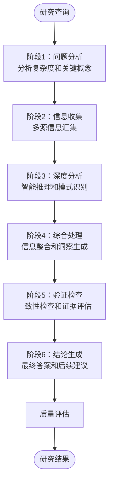
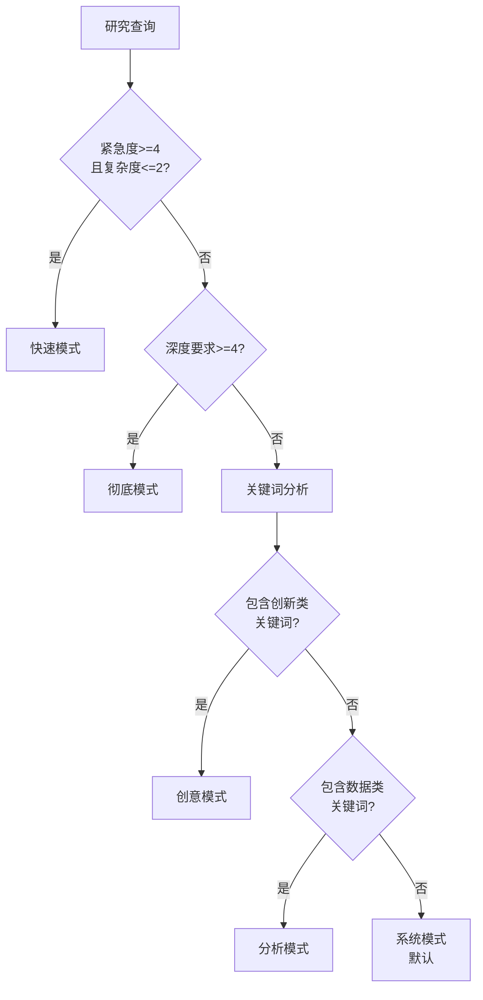
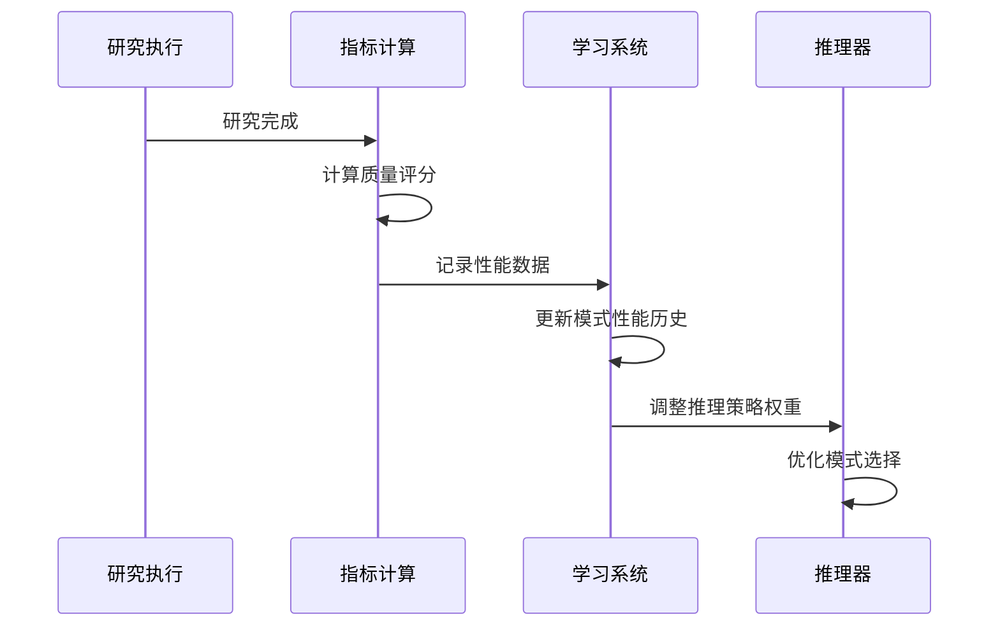

# 20.3 深度研究智能体：知识发现系统

## 概念导入

在学术研究或深入学习某个主题时，我们通常会：
1. 分析问题，确定研究方向
2. 收集相关资料和数据
3. 深入分析，提炼观点
4. 综合信息，形成见解
5. 验证结论，确保准确
6. 总结成果，提出建议

**深度研究智能体（DeepResearchAgent）**正是模拟这个过程，通过系统化的研究管道和多模式推理，帮助用户进行深度知识发现。

### 核心价值

深度研究智能体的独特价值在于：
- 📚 **系统化研究**：六阶段研究管道，确保全面深入
- 🧠 **多模式推理**：根据任务特点自适应选择推理模式
- 🕸️ **知识图谱**：动态构建知识关联，发现隐藏联系
- 📈 **持续学习**：从每次研究中积累经验，不断改进

## 六阶段研究管道



### 各阶段详解

#### 阶段1：问题分析

**目标**：理解查询意图，识别关键概念

**处理步骤**：
1. 提取关键词
2. 评估复杂度（1-5级）
3. 识别研究领域
4. 确定深度要求

**示例**：
```
输入："深度学习在计算机视觉中的应用"

分析结果：
- 关键概念：深度学习、计算机视觉、应用
- 复杂度：4（较高）
- 领域：人工智能
- 深度要求：需要详细分析
```

#### 阶段2：信息收集

**目标**：从多个来源收集相关信息

**信息源**：
- 知识图谱查询
- 工具调用结果
- 历史研究记录
- 外部数据源

#### 阶段3：深度分析

**目标**：应用智能推理，提取关键洞察

**分析方法**：
- 因果分析
- 对比分析
- 趋势分析
- 关联分析

#### 阶段4：综合处理

**目标**：整合信息，生成综合洞察

**处理技术**：
- 信息融合
- 知识抽取
- 观点提炼
- 结构化组织

#### 阶段5：验证检查

**目标**：确保结论的准确性和一致性

**验证维度**：
- 逻辑一致性
- 证据充分性
- 结论合理性
- 来源可靠性

#### 阶段6：结论生成

**目标**：生成最终答案和后续建议

**输出内容**：
- 核心观点
- 支撑证据
- 关键洞察
- 后续建议

## 五种推理模式

### 推理模式选择策略



### 推理模式对比

| 推理模式 | 适用场景 | 推理步骤 | 响应速度 |
|---------|---------|---------|---------|
| **Quick** | 简单问题、紧急查询 | 3-5步 | 最快 |
| **Thorough** | 复杂问题、深度研究 | 10-15步 | 较慢 |
| **Creative** | 创新问题、发散思维 | 6-10步 | 中等 |
| **Analytical** | 数据分析、比较研究 | 7-12步 | 中等 |
| **Systematic** | 结构化研究、梳理 | 8-12步 | 较慢 |

### 模式详解

**Quick模式**：快速响应
```
步骤：
1. 识别关键词
2. 检索已知知识
3. 生成简要答案
```

**Thorough模式**：全面深入
```
步骤：
1. 问题分解
2. 理论基础收集
3. 应用场景分析
4. 典型案例研究
5. 技术挑战分析
6. 前沿趋势研究
7. 综合洞察生成
```

**Creative模式**：创新思维
```
步骤：
1. 发散思考
2. 跨领域联想
3. 假设生成
4. 创新方案构思
5. 可行性评估
```

**Analytical模式**：数据驱动
```
步骤：
1. 因素识别
2. 数据收集
3. 量化分析
4. 对比评估
5. 结论推导
```

**Systematic模式**：系统梳理
```
步骤：
1. 框架构建
2. 要素识别
3. 关系梳理
4. 逻辑组织
5. 系统总结
```

## 动态知识图谱

### 知识节点结构

```java
public class KnowledgeNode {
    private String id;              // 节点ID
    private String content;         // 节点内容
    private String nodeType;        // 类型：concept/fact/relation/hypothesis
    private String domain;          // 所属领域
    private double confidence;      // 置信度（0-1）
    private Set<String> connections;  // 连接的节点ID
    private List<String> evidence;  // 证据来源
    private long timestamp;         // 创建时间
}
```

### 知识发现机制

**相似度计算**：
```java
public double calculateSimilarity(KnowledgeNode node1, KnowledgeNode node2) {
    Set<String> words1 = extractWords(node1.getContent());
    Set<String> words2 = extractWords(node2.getContent());
    
    // Jaccard相似度
    Set<String> intersection = new HashSet<>(words1);
    intersection.retainAll(words2);
    
    Set<String> union = new HashSet<>(words1);
    union.addAll(words2);
    
    return (double) intersection.size() / union.size();
}
```

**自动关联**：
```
阈值：相似度 > 0.3 → 建立连接
权重：相似度值作为连接权重
更新：定期重新计算相似度
```

### 知识图谱应用

1. **知识检索**：快速查找相关概念
2. **关联发现**：发现隐藏的知识联系
3. **知识推理**：基于图谱进行推理
4. **知识可视化**：直观展示知识结构

## 质量评估体系

### 评估维度

| 评估维度 | 计算方法 | 权重 |
|---------|---------|------|
| **完整性** | min(1.0, 步骤数/15) | 20% |
| **深度** | min(1.0, 思考数/8) | 25% |
| **多样性** | min(1.0, 工具数/3) | 20% |
| **洞察力** | min(1.0, 洞察数/3) | 20% |
| **置信度** | 平均置信度 | 15% |

### 质量评分计算

```java
public double calculateQualityScore(ResearchResult result) {
    double completeness = Math.min(1.0, result.getStepCount() / 15.0) * 0.20;
    double depth = Math.min(1.0, result.getThinkingSteps() / 8.0) * 0.25;
    double diversity = Math.min(1.0, result.getToolTypes() / 3.0) * 0.20;
    double insight = Math.min(1.0, result.getInsightCount() / 3.0) * 0.20;
    double confidence = result.getAverageConfidence() * 0.15;
    
    return (completeness + depth + diversity + insight + confidence) * 100;
}
```

## 自适应学习机制

### 学习流程



### 学习指标

| 指标类别 | 具体指标 | 更新频率 |
|---------|---------|---------|
| **性能指标** | 质量评分、响应时间 | 每次研究后 |
| **使用统计** | 模式使用次数、成功率 | 每次研究后 |
| **趋势分析** | 性能移动平均 | 每10次研究 |

## 应用场景

### 场景1：探索性研究

**用途**：深入探索某个主题

**示例**：
```java
DeepResearchAgent agent = new DeepResearchAgent();
ResearchResult result = agent.exploreTopic("量子计算的发展历程");
```

### 场景2：协作式研究

**用途**：多视角分析问题

**示例**：
```java
String[] perspectives = {"技术视角", "商业视角", "社会视角"};
ResearchResult result = agent.collaborativeResearch(
    "人工智能的伦理问题", 
    perspectives
);
```

### 场景3：持续学习

**用途**：积累领域知识

**示例**：
```java
agent.continuousLearning("深度学习", 30);  // 持续学习30天
```

## 实践练习

### 练习1：实现研究管道

**任务**：实现六阶段研究管道的基本框架

### 练习2：推理模式选择

**任务**：实现自适应的推理模式选择算法

### 练习3：知识图谱构建

**任务**：构建简单的知识图谱，实现知识节点的自动关联

## 小结

本节介绍了深度研究智能体的核心机制：

1. **六阶段研究管道**：系统化的研究流程
2. **五种推理模式**：自适应的推理策略
3. **动态知识图谱**：智能的知识组织
4. **质量评估体系**：可量化的质量保证
5. **自适应学习**：持续改进的能力

核心设计思想：
- ✅ **系统化**：结构化的研究流程
- ✅ **智能化**：自适应的推理选择
- ✅ **知识化**：动态的知识图谱
- ✅ **可进化**：持续学习机制

## 扩展阅读

- [深度研究智能体技术架构文档](../../../tinyai-agent-research/doc/技术架构文档.md)

---

**导航**：
- [上一节：20.2 手稿智能体](20.2-manus-agent.md)
- [下一节：20.4 智能体应用设计模式](20.4-design-patterns.md)
- [返回章节目录](README.md)
