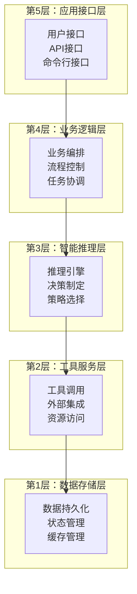
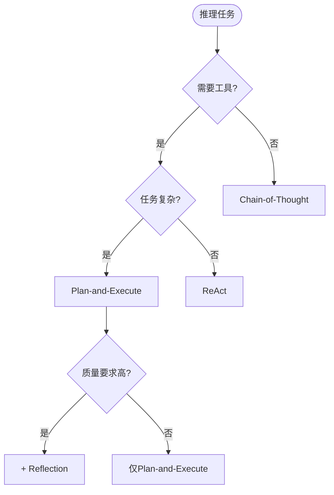
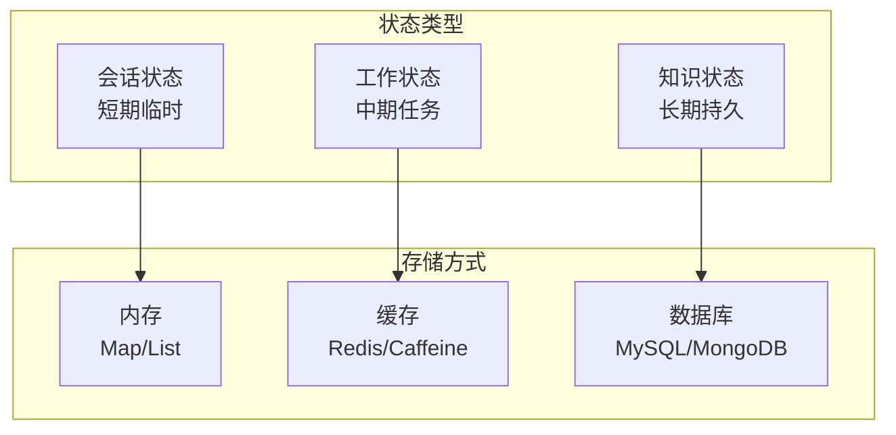
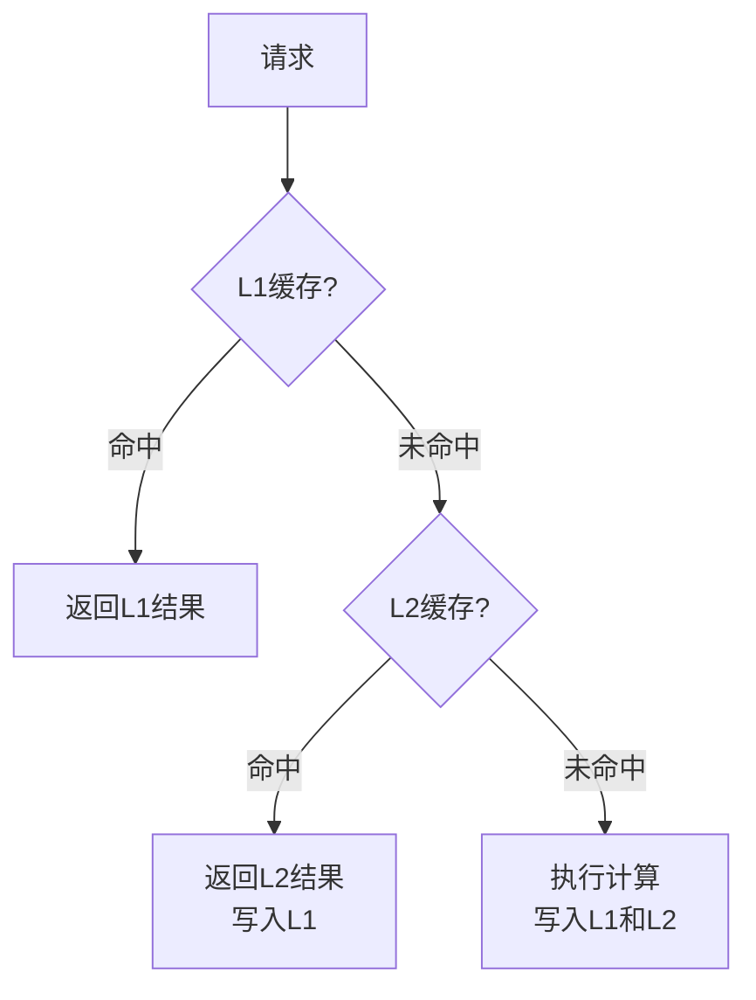

# 20.4 智能体应用设计模式

## 概念导入

在软件工程中，设计模式是对常见问题的通用解决方案。智能体应用开发同样有一些经过验证的设计模式，可以帮助我们构建更好的系统。

本节将总结前面三个智能体应用（AI编程助手、手稿智能体、深度研究智能体）中的通用设计模式，帮助读者在开发新的智能体应用时做出更好的设计决策。

## 分层架构模式

### 模式概述

**定义**：将系统按职责划分为多个层次，每层专注于特定功能。

**优势**：
- ✅ 职责清晰，易于理解
- ✅ 降低耦合，提高复用性
- ✅ 便于测试和维护
- ✅ 支持渐进式开发

### 通用分层模型



### 层次划分原则

| 原则 | 说明 | 示例 |
|------|------|------|
| **单一职责** | 每层只负责特定功能 | 推理层不直接操作数据库 |
| **依赖方向** | 上层依赖下层 | 业务层调用推理层 |
| **抽象隔离** | 通过接口隔离 | 使用ToolRegistry接口 |
| **可替换性** | 同层组件可替换 | 更换不同的LLM实现 |

### 三种应用中的分层

| 层次 | AI编程助手 | 手稿智能体 | 深度研究智能体 |
|------|-----------|----------|--------------|
| **应用层** | AICodingCursor | Manus | DeepResearchAgent |
| **推理层** | SimplifiedAdvancedAgent | ReActAgent | IntelligentReasoner |
| **工具层** | 分析/生成工具 | ToolCallAgent | 研究工具集 |
| **数据层** | 缓存系统 | MessageHistory | KnowledgeGraph |

## 推理模式选择策略

### 常见推理模式对比

| 推理模式 | 核心机制 | 适用场景 | 优势 | 劣势 |
|---------|---------|---------|------|------|
| **ReAct** | 思考-行动-观察循环 | 需要工具交互 | 灵活、可解释 | 步骤多、耗时 |
| **Chain-of-Thought** | 逐步推理链 | 复杂逻辑推理 | 推理清晰 | 可能偏离 |
| **Plan-and-Execute** | 先规划后执行 | 多步骤任务 | 结构化 | 规划开销 |
| **Reflection** | 自我评估改进 | 质量要求高 | 质量高 | 迭代多 |

### 选择决策树



### 模式组合策略

**组合1：ReAct + Reflection**
```java
public String executeWithReflection(String query) {
    String result = reactExecute(query);
    String reflection = reflect(result);
    if (needsImprovement(reflection)) {
        result = reactExecute(query + "\n改进建议：" + reflection);
    }
    return result;
}
```

**组合2：Plan-and-Execute + ReAct**
```java
public String executePlanWithReact(String query) {
    Plan plan = createPlan(query);
    for (Task task : plan.getTasks()) {
        String result = reactExecute(task.getDescription());
        task.setResult(result);
    }
    return integratePlanResults(plan);
}
```

## 工具集成最佳实践

### 工具抽象模型

```java
public interface Tool {
    // 工具名称
    String getName();
    
    // 工具描述（用于LLM理解）
    String getDescription();
    
    // 执行工具
    Object execute(Map<String, Object> parameters);
    
    // 参数验证
    boolean validate(Map<String, Object> parameters);
    
    // 参数模式（JSON Schema）
    String getParameterSchema();
}
```

### 工具设计原则

| 原则 | 说明 | 示例 |
|------|------|------|
| **单一功能** | 每个工具专注一项任务 | calculator只做计算 |
| **标准接口** | 统一的调用规范 | 实现Tool接口 |
| **参数验证** | 执行前验证 | validate()方法 |
| **错误处理** | 优雅处理异常 | 返回错误而非抛异常 |
| **可组合性** | 支持工具链 | 输出格式标准化 |

### 工具注册模式

**方式1：静态注册**
```java
public class ToolRegistry {
    private Map<String, Tool> tools = new HashMap<>();
    
    public void registerTool(Tool tool) {
        tools.put(tool.getName(), tool);
    }
    
    public Tool getTool(String name) {
        return tools.get(name);
    }
}
```

**方式2：动态发现**
```java
public class DynamicToolRegistry {
    public void scanAndRegister(String packageName) {
        // 扫描包下的所有Tool实现
        // 自动注册
    }
}
```

### 工具链模式

```java
public class ToolChain {
    private List<ToolStep> steps = new ArrayList<>();
    
    public ToolChain addStep(String toolName, Map<String, Object> params) {
        steps.add(new ToolStep(toolName, params));
        return this;
    }
    
    public Object execute() {
        Object input = null;
        for (ToolStep step : steps) {
            input = step.execute(input);
        }
        return input;
    }
}
```

## 状态管理模式

### 状态类型划分



### 状态管理策略

| 状态类型 | 存储方式 | 生命周期 | 同步策略 |
|---------|---------|---------|---------|
| **消息历史** | 内存List | 会话期间 | 同步更新 |
| **执行计划** | 内存Map | 任务期间 | 同步更新 |
| **知识图谱** | 内存+DB | 永久 | 异步持久化 |
| **工具统计** | 内存Map | 运行期 | 定期持久化 |

### 状态持久化模式

**模式1：写时持久化**
```java
public void updateState(String key, Object value) {
    stateMap.put(key, value);
    persistToDatabase(key, value);  // 立即持久化
}
```

**模式2：定期持久化**
```java
@Scheduled(fixedRate = 60000)  // 每分钟
public void persistState() {
    database.saveAll(stateMap);
}
```

**模式3：写时复制（COW）**
```java
public void updateState(String key, Object value) {
    Map<String, Object> newState = new HashMap<>(stateMap);
    newState.put(key, value);
    stateMap = newState;  // 原子替换
}
```

## 性能优化模式

### 缓存模式

**多级缓存架构**



**缓存策略**

| 缓存级别 | 存储介质 | 容量 | 失效策略 |
|---------|---------|------|---------|
| **L1** | JVM内存 | 100项 | LRU |
| **L2** | 本地缓存 | 1000项 | LRU + 时间 |
| **L3** | Redis | 10000项 | TTL |

### 并行处理模式

**模式1：任务并行**
```java
public List<String> processInParallel(List<String> tasks) {
    return tasks.parallelStream()
        .map(this::processTask)
        .collect(Collectors.toList());
}
```

**模式2：流水线并行**
```java
public void pipelineProcess(List<Data> dataList) {
    ExecutorService stage1 = Executors.newFixedThreadPool(2);
    ExecutorService stage2 = Executors.newFixedThreadPool(2);
    
    dataList.forEach(data -> {
        stage1.submit(() -> {
            Data processed = processStage1(data);
            stage2.submit(() -> processStage2(processed));
        });
    });
}
```

### 资源池化模式

```java
public class ToolConnectionPool {
    private BlockingQueue<ToolConnection> pool;
    
    public ToolConnection acquire() throws InterruptedException {
        return pool.take();
    }
    
    public void release(ToolConnection conn) {
        pool.offer(conn);
    }
}
```

## 错误处理模式

### 重试模式

```java
public <T> T retryOnFailure(Supplier<T> operation, int maxRetries) {
    int attempts = 0;
    while (attempts < maxRetries) {
        try {
            return operation.get();
        } catch (Exception e) {
            attempts++;
            if (attempts >= maxRetries) {
                throw new MaxRetriesExceededException(e);
            }
            sleep(calculateBackoff(attempts));
        }
    }
    throw new IllegalStateException();
}
```

### 降级模式

```java
public String executeWithFallback(String query) {
    try {
        return primaryAgent.execute(query);
    } catch (Exception e) {
        log.warn("Primary agent failed, using fallback", e);
        return fallbackAgent.execute(query);
    }
}
```

### 熔断模式

```java
public class CircuitBreaker {
    private int failureCount = 0;
    private int threshold = 5;
    private State state = State.CLOSED;
    
    public <T> T execute(Supplier<T> operation) {
        if (state == State.OPEN) {
            throw new CircuitOpenException();
        }
        
        try {
            T result = operation.get();
            onSuccess();
            return result;
        } catch (Exception e) {
            onFailure();
            throw e;
        }
    }
    
    private void onFailure() {
        failureCount++;
        if (failureCount >= threshold) {
            state = State.OPEN;
        }
    }
}
```

## 可观测性模式

### 日志记录模式

**结构化日志**
```java
public void logStructured(String event, Map<String, Object> context) {
    logger.info("{} | {}", 
        event, 
        objectMapper.writeValueAsString(context)
    );
}
```

### 指标收集模式

```java
public class MetricsCollector {
    private Map<String, Counter> counters = new HashMap<>();
    private Map<String, Histogram> histograms = new HashMap<>();
    
    public void incrementCounter(String name) {
        counters.computeIfAbsent(name, k -> new Counter()).increment();
    }
    
    public void recordDuration(String name, long duration) {
        histograms.computeIfAbsent(name, k -> new Histogram()).record(duration);
    }
}
```

### 追踪模式

```java
public String executeWithTracing(String query) {
    Span span = tracer.startSpan("agent.execute");
    try {
        span.setTag("query", query);
        String result = doExecute(query);
        span.setTag("success", true);
        return result;
    } catch (Exception e) {
        span.setTag("error", true);
        span.log(e.getMessage());
        throw e;
    } finally {
        span.finish();
    }
}
```

## 扩展性模式

### 插件模式

```java
public interface AgentPlugin {
    void initialize(AgentContext context);
    void beforeExecution(String query);
    void afterExecution(String result);
}

public class PluginManager {
    private List<AgentPlugin> plugins = new ArrayList<>();
    
    public void registerPlugin(AgentPlugin plugin) {
        plugins.add(plugin);
        plugin.initialize(context);
    }
    
    public void triggerBeforeExecution(String query) {
        plugins.forEach(p -> p.beforeExecution(query));
    }
}
```

### 策略模式

```java
public interface ReasoningStrategy {
    String reason(String query);
}

public class ReasoningContext {
    private ReasoningStrategy strategy;
    
    public void setStrategy(ReasoningStrategy strategy) {
        this.strategy = strategy;
    }
    
    public String execute(String query) {
        return strategy.reason(query);
    }
}
```

## 实践建议

### 模式选择指南

| 场景 | 推荐模式 | 原因 |
|------|---------|------|
| **新项目** | 分层架构 | 结构清晰，易于开始 |
| **高并发** | 缓存+并行 | 提升性能 |
| **高可靠** | 重试+降级+熔断 | 容错能力强 |
| **可扩展** | 插件+策略 | 灵活扩展 |

### 设计原则总结

1. **简单优先**：从简单开始，逐步演进
2. **职责分离**：单一职责，降低耦合
3. **接口隔离**：依赖抽象，易于替换
4. **性能优化**：合理使用缓存和并行
5. **可观测性**：充分的日志和监控

## 小结

本节介绍了智能体应用的通用设计模式：

1. **分层架构模式**：清晰的职责划分
2. **推理模式**：灵活的推理策略选择
3. **工具集成**：标准化的工具管理
4. **状态管理**：分层的状态存储
5. **性能优化**：缓存、并行、池化
6. **错误处理**：重试、降级、熔断
7. **可观测性**：日志、指标、追踪
8. **扩展性**：插件、策略模式

这些模式可以组合使用，帮助构建高质量的智能体应用。

---

**导航**：
- [上一节：20.3 深度研究智能体](20.3-research-agent.md)
- [下一节：20.5 从理论到实践：智能体开发全流程](20.5-development-lifecycle.md)
- [返回章节目录](README.md)
