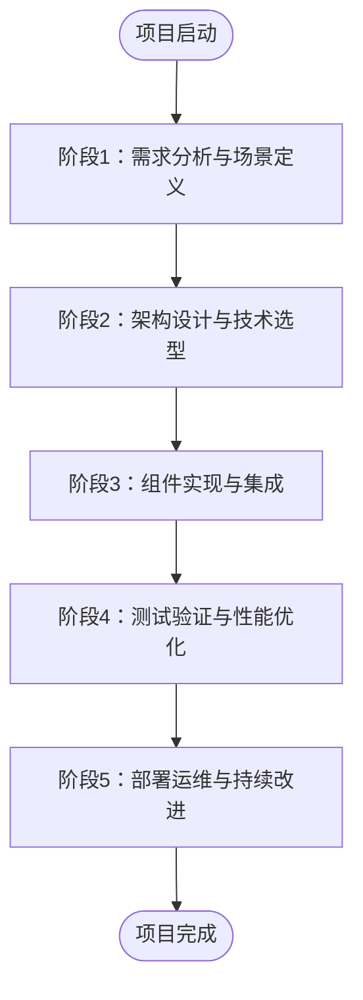
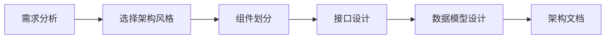
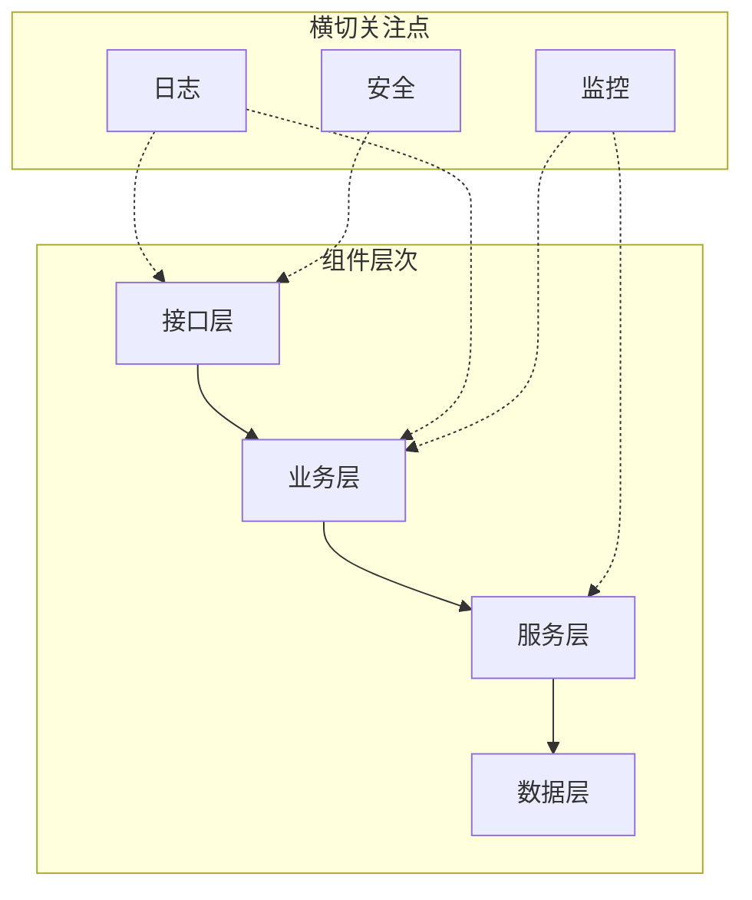
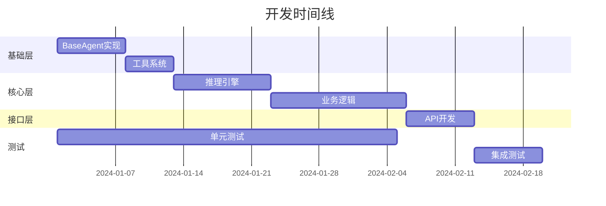
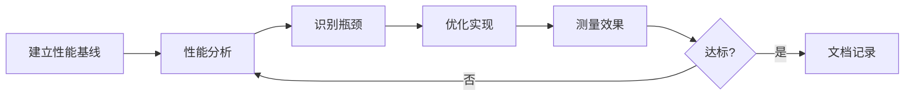
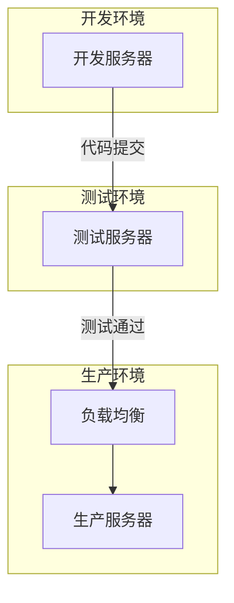
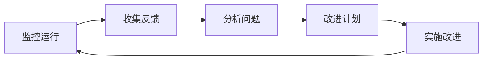

# 20.5 从理论到实践：智能体开发全流程

## 概念导入

前面几节我们学习了三个具体的智能体应用和通用的设计模式。但是，如何从零开始开发一个智能体应用呢？本节将介绍智能体应用的**完整开发流程**，从需求分析到部署运维，帮助读者系统地掌握智能体应用的开发方法。

## 开发流程概览



## 阶段1：需求分析与场景定义

### 1.1 需求收集

**关键问题清单**：

| 问题类别 | 具体问题 | 输出 |
|---------|---------|------|
| **用户定位** | 目标用户是谁？ | 用户画像 |
| **核心痛点** | 要解决什么问题？ | 问题列表 |
| **使用场景** | 在什么情况下使用？ | 场景描述 |
| **成功标准** | 如何衡量成功？ | 评估指标 |
| **约束条件** | 有哪些限制？ | 约束清单 |

**示例：AI编程助手需求**

```
用户：Java开发者、学生、代码审查者
痛点：
  - 代码质量难以把控
  - 重复代码编写耗时
  - 重构方向不明确
场景：
  - 日常编码：实时质量检查
  - 代码审查：自动化分析
  - 学习教育：理解代码结构
成功标准：
  - 分析准确率 > 90%
  - 响应时间 < 1秒
  - 用户满意度 > 85%
约束：
  - 仅支持Java
  - 本地运行，无需网络
```

### 1.2 场景定义

**场景描述模板**：

```
场景名称：【场景名称】
场景描述：【1-2句话描述场景】
参与角色：【用户、系统、外部系统】
前置条件：【场景发生的前提】
主流程：
  1. 【步骤1】
  2. 【步骤2】
  3. 【步骤3】
异常流程：
  - 【异常情况1及处理】
  - 【异常情况2及处理】
期望结果：【场景完成后的状态】
```

**示例场景**：

```
场景名称：代码质量实时检查
场景描述：开发者编写代码时，系统实时分析代码质量
参与角色：开发者、AI编程助手
前置条件：IDE已集成AI编程助手
主流程：
  1. 开发者编写/修改代码
  2. 系统自动触发分析
  3. 系统返回分析结果
  4. 开发者查看建议
异常流程：
  - 分析失败：显示错误信息，不影响编码
  - 超时：使用缓存结果或跳过
期望结果：开发者获得即时的代码质量反馈
```

### 1.3 需求优先级

**MoSCoW方法**：

- **Must Have（必须有）**：核心功能，没有则项目失败
- **Should Have（应该有）**：重要但非关键
- **Could Have（可以有）**：锦上添花
- **Won't Have（不需要）**：明确不包含

**示例**：

```
Must Have:
  ✓ 代码质量分析
  ✓ 基础代码生成
  
Should Have:
  ○ 重构建议
  ○ 错误调试
  
Could Have:
  △ 代码审查报告
  △ 学习模式
  
Won't Have:
  ✗ 支持其他语言
  ✗ 云端部署
```

## 阶段2：架构设计与技术选型

### 2.1 架构设计

**设计步骤**：



**架构风格选择**：

| 架构风格 | 适用场景 | 优势 | 劣势 |
|---------|---------|------|------|
| **分层架构** | 中小型应用 | 结构清晰 | 可能性能损失 |
| **微服务** | 大型分布式 | 独立部署 | 复杂度高 |
| **事件驱动** | 异步处理 | 解耦好 | 调试困难 |
| **插件架构** | 高扩展性需求 | 灵活扩展 | 管理复杂 |

### 2.2 技术选型

**技术选型决策表**：

| 决策点 | 选项 | 评估维度 | 推荐 |
|-------|------|---------|------|
| **编程语言** | Java/Python | 团队能力、性能需求 | Java（项目统一） |
| **LLM集成** | 本地/API | 成本、性能、隐私 | 视具体需求 |
| **存储方案** | 内存/DB | 数据量、持久化 | 分层使用 |
| **缓存方案** | Caffeine/Redis | 分布式需求 | Caffeine（单机） |
| **测试框架** | JUnit/TestNG | 团队习惯 | JUnit 5 |

### 2.3 组件设计

**组件职责矩阵**：



## 阶段3：组件实现与集成

### 3.1 开发流程



### 3.2 编码规范

**命名规范**：

| 类型 | 规范 | 示例 |
|------|------|------|
| **类名** | 大驼峰 | `CodeAnalyzer` |
| **方法名** | 小驼峰 | `analyzeCode()` |
| **常量** | 全大写+下划线 | `MAX_ITERATIONS` |
| **包名** | 全小写 | `io.leavesfly.tinyai.agent` |

**注释规范**：

```java
/**
 * 代码分析器
 * 
 * <p>负责分析Java代码的质量，包括：
 * <ul>
 *   <li>语法检查</li>
 *   <li>结构分析</li>
 *   <li>复杂度计算</li>
 * </ul>
 * 
 * @author TinyAI Team
 * @since 1.0.0
 */
public class CodeAnalyzer {
    /**
     * 分析代码质量
     * 
     * @param code 待分析的代码
     * @return 分析结果
     * @throws IllegalArgumentException 如果代码为空
     */
    public AnalysisResult analyzeCode(String code) {
        // 实现代码
    }
}
```

### 3.3 集成策略

**集成方法**：

| 集成方式 | 描述 | 适用场景 |
|---------|------|---------|
| **大爆炸集成** | 一次性集成所有组件 | 小型项目 |
| **自顶向下** | 从上层逐步集成 | 接口先行 |
| **自底向上** | 从底层逐步集成 | 基础先行 |
| **持续集成** | 频繁小步集成 | 推荐方式 |

## 阶段4：测试验证与性能优化

### 4.1 测试策略

**测试金字塔**：

```
        /\
       /E2E\      ← 端到端测试（少量）
      /------\
     /集成测试 \    ← 集成测试（适量）
    /----------\
   /  单元测试   \  ← 单元测试（大量）
  /--------------\
```

**测试类型与目标**：

| 测试类型 | 覆盖目标 | 覆盖率目标 | 工具 |
|---------|---------|-----------|------|
| **单元测试** | 单个方法/类 | >80% | JUnit 5 |
| **集成测试** | 组件交互 | >70% | JUnit + Mock |
| **功能测试** | 业务功能 | 100%核心 | 手工/自动化 |
| **性能测试** | 响应时间、吞吐量 | 达标 | JMeter |

### 4.2 性能优化

**优化流程**：



**常见优化点**：

| 优化目标 | 优化技术 | 预期效果 |
|---------|---------|---------|
| **减少延迟** | 缓存 | 降低80%+ |
| **提高吞吐** | 并行处理 | 提升2-4倍 |
| **降低内存** | 对象复用 | 降低30%+ |

## 阶段5：部署运维与持续改进

### 5.1 部署架构



### 5.2 监控体系

**监控指标**：

| 指标类别 | 具体指标 | 正常范围 |
|---------|---------|---------|
| **可用性** | 系统在线率 | >99.9% |
| **性能** | 平均响应时间 | <500ms |
| **错误率** | 请求失败率 | <0.1% |
| **资源** | CPU使用率 | <70% |
| **资源** | 内存使用率 | <80% |

### 5.3 持续改进



## 实践案例：开发简单对话智能体

### 需求定义

```
项目名称：SimpleDialogAgent
目标：实现基础的对话能力和工具调用
功能：
  - 维护对话历史
  - 调用2-3个工具
  - 简单的推理能力
约束：
  - 仅命令行交互
  - 本地运行
```

### 架构设计

```java
// 组件结构
SimpleDialogAgent
├── Agent（对话管理）
├── ToolRegistry（工具注册）
├── Tools
│   ├── CalculatorTool
│   ├── TimeTool
│   └── WeatherTool
└── Main（命令行入口）
```

### 实现代码

```java
// 1. 工具接口
public interface Tool {
    String getName();
    String execute(Map<String, String> params);
}

// 2. 计算器工具
public class CalculatorTool implements Tool {
    public String getName() { return "calculator"; }
    
    public String execute(Map<String, String> params) {
        String expr = params.get("expression");
        // 简单实现：仅支持加法
        String[] parts = expr.split("\\+");
        int sum = Arrays.stream(parts)
            .mapToInt(Integer::parseInt)
            .sum();
        return String.valueOf(sum);
    }
}

// 3. 智能体
public class SimpleDialogAgent {
    private List<String> history = new ArrayList<>();
    private Map<String, Tool> tools = new HashMap<>();
    
    public void registerTool(Tool tool) {
        tools.put(tool.getName(), tool);
    }
    
    public String chat(String message) {
        history.add("User: " + message);
        
        // 简单的工具选择逻辑
        if (message.contains("计算") || message.contains("+")) {
            String result = tools.get("calculator")
                .execute(Map.of("expression", extractExpression(message)));
            history.add("Agent: 计算结果是 " + result);
            return result;
        }
        
        // 默认回复
        String reply = "我理解了：" + message;
        history.add("Agent: " + reply);
        return reply;
    }
}
```

## 开发检查清单

### 设计阶段

- [ ] 需求文档完成
- [ ] 场景定义清晰
- [ ] 架构设计评审通过
- [ ] 技术选型确定

### 开发阶段

- [ ] 代码符合规范
- [ ] 单元测试覆盖率>80%
- [ ] 集成测试通过
- [ ] 代码审查完成

### 测试阶段

- [ ] 功能测试通过
- [ ] 性能测试达标
- [ ] 安全测试通过
- [ ] 用户验收通过

### 部署阶段

- [ ] 部署文档完成
- [ ] 监控配置就绪
- [ ] 灰度发布计划
- [ ] 回滚方案准备

## 常见问题与解决方案

| 问题 | 原因 | 解决方案 |
|------|------|---------|
| **性能不达标** | 缓存不足、算法低效 | 增加缓存、优化算法 |
| **内存泄漏** | 对象未释放 | 使用弱引用、及时清理 |
| **响应慢** | 同步阻塞 | 改为异步、增加并行 |
| **测试覆盖低** | 测试不足 | 补充单元测试 |

## 小结

本节介绍了智能体应用的完整开发流程：

1. **需求分析**：明确用户、场景、目标
2. **架构设计**：选择架构风格、划分组件
3. **组件实现**：遵循规范、持续集成
4. **测试优化**：全面测试、性能优化
5. **部署运维**：监控告警、持续改进

核心要点：
- ✅ **需求驱动**：从需求出发，明确目标
- ✅ **设计先行**：架构设计在实现之前
- ✅ **质量保证**：充分的测试和优化
- ✅ **持续改进**：监控反馈，不断迭代

---

**导航**：
- [上一节：20.4 智能体应用设计模式](20.4-design-patterns.md)
- [返回章节目录](README.md)
