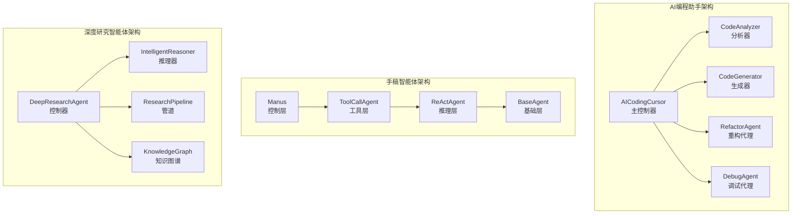

# 第20章：智能体应用实战

## 章节概述

本章将结合TinyAI项目中的三个实战智能体模块（tinyai-agent-cursor、tinyai-agent-manus、tinyai-agent-research），展示如何将智能体技术应用到真实场景中。通过这三个典型应用案例，读者将学会如何设计和实现不同领域的智能体系统，掌握从理论到实践的完整技术路径。

## 学习目标

完成本章学习后，读者将能够：

- ✅ **掌握AI编程助手的设计与实现**：理解代码分析、生成、重构和调试的智能化方法
- ✅ **理解手稿智能体的分层架构**：掌握ReAct推理模式和双执行机制的设计思想
- ✅ **学会构建深度研究智能体**：理解多阶段推理和知识图谱在研究场景中的应用
- ✅ **具备智能体应用开发能力**：能够独立设计和实现特定领域的智能体系统

## 章节内容

### [20.1 AI编程助手：代码智能化的实践](20.1-ai-coding-assistant.md)

**学习重点**：构建智能编程辅助系统

**核心内容**：
- 代码分析器的设计理念与实现
- 智能代码生成与模板系统
- 重构建议与模式识别
- 调试辅助与错误诊断
- 综合代码审查系统

**实践项目**：基于Java实现的AI编程助手（tinyai-agent-cursor）

### [20.2 手稿智能体：分层架构的艺术](20.2-manus-agent.md)

**学习重点**：掌握分层智能体架构设计

**核心内容**：
- 四层架构设计原则（BaseAgent → ReActAgent → ToolCallAgent → Manus）
- ReAct推理循环的实现机制
- 双执行机制（直接Agent模式 vs Flow编排模式）
- 计划驱动的任务分解
- 动态工具调用与智能推荐

**实践项目**：OpenManus手稿智能体系统（tinyai-agent-manus）

### [20.3 深度研究智能体：知识发现系统](20.3-research-agent.md)

**学习重点**：构建知识发现和研究辅助系统

**核心内容**：
- 六阶段研究管道设计
- 五种推理模式的自适应选择
- 动态知识图谱构建
- 探索性研究与协作式研究
- 质量评估与持续学习

**实践项目**：深度研究智能体系统（tinyai-agent-research）

### [20.4 智能体应用设计模式](20.4-design-patterns.md)

**学习重点**：总结智能体应用的通用设计模式

**核心内容**：
- 分层架构模式的应用场景
- 推理模式的选择策略
- 工具集成的最佳实践
- 状态管理与监控
- 性能优化与扩展性设计

### [20.5 从理论到实践：智能体开发全流程](20.5-development-lifecycle.md)

**学习重点**：掌握智能体应用的完整开发流程

**核心内容**：
- 需求分析与场景定义
- 架构设计与技术选型
- 组件实现与集成
- 测试验证与性能优化
- 部署运维与持续改进

## 三大智能体应用对比

| 特性维度 | AI编程助手 | 手稿智能体 | 深度研究智能体 |
|---------|-----------|----------|-------------|
| **核心能力** | 代码理解与生成 | 推理与工具调用 | 知识发现与研究 |
| **架构模式** | 模块化分层 | 四层分层架构 | 管道式处理 |
| **推理方式** | 模式匹配+LLM | ReAct循环 | 多模式自适应 |
| **工具依赖** | 代码分析工具 | 动态工具注册 | 研究工具集 |
| **典型场景** | 编程辅助 | 复杂任务执行 | 学术研究 |
| **技术难点** | 代码理解 | 推理控制 | 知识管理 |
| **扩展性** | 模式扩展 | 工具扩展 | 推理模式扩展 |

## 技术架构总览

## 核心设计原则

本章介绍的三个智能体应用虽然场景不同，但都遵循以下核心设计原则：

1. **模块化设计**：清晰的职责分离，便于维护和扩展
2. **分层架构**：从基础到高级的层次化组织
3. **工具集成**：支持动态工具注册和调用
4. **状态管理**：完整的状态跟踪和监控机制
5. **可扩展性**：支持自定义功能和策略扩展

## 实践项目建议

### 初级项目：简单对话智能体

**目标**：实现基础的对话能力和工具调用

**核心功能**：
- BaseAgent基础功能
- 简单的ReAct推理循环
- 2-3个基础工具
- 对话历史管理

**技术栈**：Java + TinyAI基础模块

### 中级项目：任务执行智能体

**目标**：实现复杂任务的分解和执行

**核心功能**：
- 完整的ReAct推理循环
- 计划驱动的任务分解
- 5-10个实用工具
- 执行状态跟踪

**技术栈**：Java + TinyAI生态系统

### 高级项目：领域专家智能体

**目标**：在特定领域提供专业服务

**核心功能**：
- 多模式推理能力
- 领域知识图谱
- 10+专业工具
- 自适应学习机制

**技术栈**：完整的TinyAI技术栈 + 领域专业工具

## 参考资料

### 项目模块

- [tinyai-agent-cursor](../../../tinyai-agent-cursor)：AI编程助手实现
- [tinyai-agent-manus](../../../tinyai-agent-manus)：手稿智能体实现
- [tinyai-agent-research](../../../tinyai-agent-research)：深度研究智能体实现

### 技术文档

- [AI编程助手技术架构文档](../../../tinyai-agent-cursor/doc/TinyAI-Cursor技术架构文档.md)
- [手稿智能体技术架构文档](../../../tinyai-agent-manus/doc/技术架构文档.md)
- [深度研究智能体技术架构文档](../../../tinyai-agent-research/doc/技术架构文档.md)

### 学术参考

- ReAct: Synergizing Reasoning and Acting in Language Models
- Chain-of-Thought Prompting Elicits Reasoning in Large Language Models
- Tree of Thoughts: Deliberate Problem Solving with Large Language Models

## 下一步学习

完成本章学习后，建议：

1. **实践练习**：选择一个实践项目动手实现
2. **深入研究**：阅读源代码，理解实现细节
3. **创新应用**：思考在其他领域的应用可能性
4. **社区交流**：分享经验，参与开源贡献

---

**导航**：
- [上一章：第19章 自进化智能体](../chapter19-self-evolving/README.md)
- [返回目录](../../README.md)
