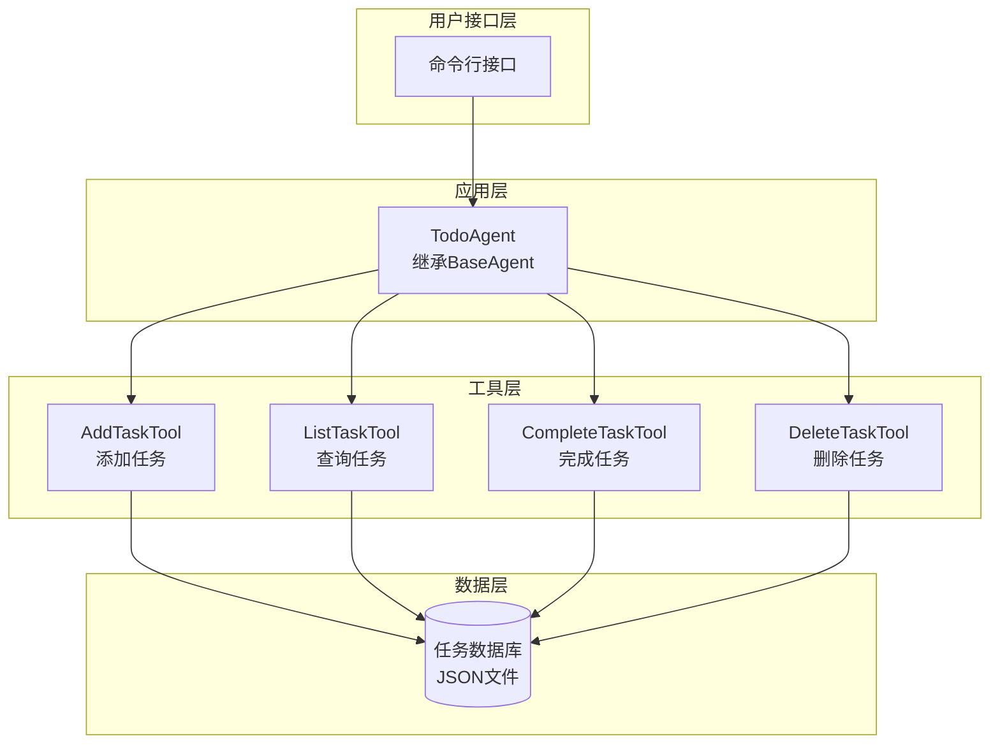
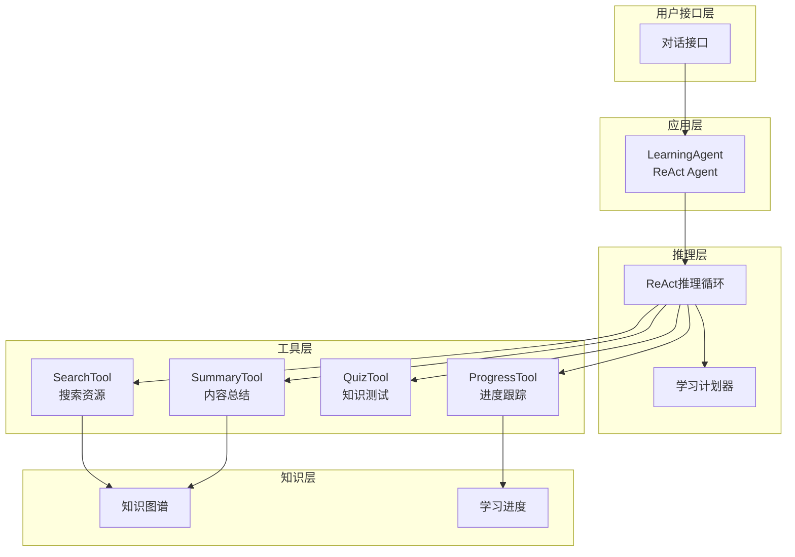
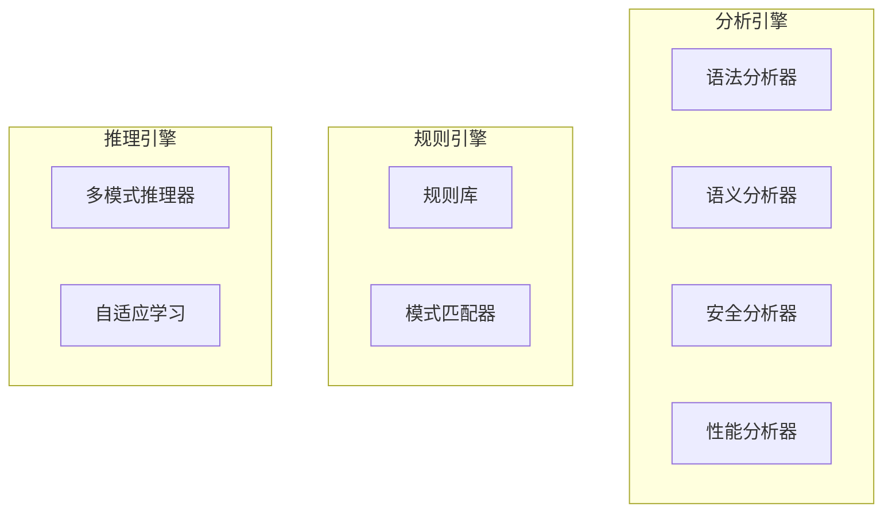

# 实践项目指南

> 从入门到精通:三个精心设计的实战项目

## 项目概述

本指南提供三个难度递进的实践项目,帮助你从理论走向实践,逐步掌握智能体应用开发的核心技能。

### 项目对比

| 项目 | 难度 | 时间 | 核心技能 | 适合人群 |
|------|------|------|---------|---------|
| **待办事项智能体** | ⭐⭐ | 2-3周 | BaseAgent、基础工具 | 初学者 |
| **学习助手智能体** | ⭐⭐⭐ | 4-6周 | ReAct循环、知识管理 | 进阶者 |
| **代码审查智能体** | ⭐⭐⭐⭐ | 6-8周 | 多模式推理、深度分析 | 高级开发者 |

---

## 项目1: 待办事项智能体

### 项目简介

构建一个智能待办事项管理助手,支持自然语言交互、智能分类和优先级推荐。

**核心价值**:
- 学习BaseAgent基础框架
- 掌握简单的NLP意图识别
- 实践工具集成
- 理解状态管理

### 功能需求

#### 核心功能

1. **自然语言任务添加**
   ```
   用户: "提醒我明天下午3点开会"
   系统: ✅ 已添加任务: 开会
         时间: 明天 15:00
         分类: 工作
   ```

2. **智能任务分类**
   - 工作(Work)
   - 学习(Study)
   - 生活(Life)
   - 健康(Health)

3. **优先级自动推荐**
   - 高(High): 紧急重要
   - 中(Medium): 普通任务
   - 低(Low): 可延期任务

4. **任务查询**
   ```
   用户: "今天有什么任务?"
   系统: 📋 今天的任务:
         1. [高] 开会 - 15:00
         2. [中] 写报告 - 18:00
   ```

5. **任务完成**
   ```
   用户: "完成开会任务"
   系统: ✅ 任务已完成: 开会
   ```

### 技术架构



### 实现步骤

#### 第1周: 基础框架

**任务清单**:
- [ ] 创建项目结构
- [ ] 实现Task数据模型
- [ ] 实现TodoAgent基类
- [ ] 实现JSON持久化

**Task数据模型**:

```java
public class Task {
    private String id;
    private String title;
    private String description;
    private LocalDateTime deadline;
    private TaskCategory category;
    private TaskPriority priority;
    private TaskStatus status;
    
    // getters and setters
}

enum TaskCategory {
    WORK, STUDY, LIFE, HEALTH
}

enum TaskPriority {
    HIGH, MEDIUM, LOW
}

enum TaskStatus {
    PENDING, COMPLETED
}
```

**TodoAgent基类**:

```java
public class TodoAgent extends BaseAgent {
    private TaskRepository repository;
    
    public TodoAgent() {
        super("TodoAgent");
        this.repository = new TaskRepository();
        registerTools();
    }
    
    private void registerTools() {
        registerTool(new AddTaskTool(repository));
        registerTool(new ListTaskTool(repository));
        registerTool(new CompleteTaskTool(repository));
        registerTool(new DeleteTaskTool(repository));
    }
    
    @Override
    public String process(String input) {
        // 意图识别和工具调用
        Intent intent = recognizeIntent(input);
        return executeIntent(intent);
    }
}
```

#### 第2周: 核心功能

**任务清单**:
- [ ] 实现意图识别
- [ ] 实现四个核心工具
- [ ] 实现智能分类
- [ ] 实现优先级推荐

**意图识别**:

```java
public class IntentRecognizer {
    public Intent recognize(String input) {
        // 关键词匹配
        if (containsKeywords(input, "添加", "新建", "创建")) {
            return new Intent(IntentType.ADD_TASK, 
                             extractTaskInfo(input));
        }
        if (containsKeywords(input, "查询", "列表", "今天")) {
            return new Intent(IntentType.LIST_TASKS, 
                             extractTimeFilter(input));
        }
        if (containsKeywords(input, "完成", "做完")) {
            return new Intent(IntentType.COMPLETE_TASK, 
                             extractTaskId(input));
        }
        if (containsKeywords(input, "删除", "取消")) {
            return new Intent(IntentType.DELETE_TASK, 
                             extractTaskId(input));
        }
        return new Intent(IntentType.UNKNOWN, null);
    }
}
```

**智能分类**:

```java
public class TaskClassifier {
    public TaskCategory classify(String title, String description) {
        String text = (title + " " + description).toLowerCase();
        
        if (containsKeywords(text, "会议", "报告", "项目")) {
            return TaskCategory.WORK;
        }
        if (containsKeywords(text, "学习", "课程", "阅读")) {
            return TaskCategory.STUDY;
        }
        if (containsKeywords(text, "运动", "健身", "体检")) {
            return TaskCategory.HEALTH;
        }
        return TaskCategory.LIFE;
    }
}
```

#### 第3周: 优化完善

**任务清单**:
- [ ] 添加单元测试
- [ ] 优化用户交互
- [ ] 实现截止日期提醒
- [ ] 完善文档

**截止日期提醒**:

```java
public class ReminderService {
    private ScheduledExecutorService scheduler;
    
    public void scheduleReminder(Task task) {
        long delay = calculateDelay(task.getDeadline());
        
        scheduler.schedule(() -> {
            System.out.println("⏰ 提醒: " + task.getTitle() 
                             + " 即将到期!");
        }, delay, TimeUnit.MILLISECONDS);
    }
    
    private long calculateDelay(LocalDateTime deadline) {
        LocalDateTime reminderTime = deadline.minusHours(1);
        return Duration.between(LocalDateTime.now(), 
                               reminderTime).toMillis();
    }
}
```

### 测试用例

```java
@Test
public void testAddTask() {
    TodoAgent agent = new TodoAgent();
    
    String result = agent.process("提醒我明天下午3点开会");
    
    assertTrue(result.contains("已添加任务"));
    assertTrue(result.contains("开会"));
}

@Test
public void testListTasks() {
    TodoAgent agent = new TodoAgent();
    agent.process("添加任务: 写报告");
    
    String result = agent.process("今天有什么任务?");
    
    assertTrue(result.contains("写报告"));
}

@Test
public void testCompleteTask() {
    TodoAgent agent = new TodoAgent();
    agent.process("添加任务: 测试任务");
    
    String result = agent.process("完成测试任务");
    
    assertTrue(result.contains("任务已完成"));
}
```

### 扩展功能

**进阶挑战**:
1. 添加任务优先级自动调整
2. 实现任务依赖关系
3. 添加统计报表功能
4. 集成日历系统

---

## 项目2: 学习助手智能体

### 项目简介

构建一个智能学习助手,帮助用户规划学习路径、整理知识点、跟踪学习进度。

**核心价值**:
- 掌握ReAct推理循环
- 学习工具链编排
- 实践知识图谱构建
- 理解多工具协作

### 功能需求

#### 核心功能

1. **生成学习计划**
   ```
   用户: "我想学习Java编程"
   
   系统: 📚 为你生成学习计划:
         
         第1周: Java基础
         - 环境搭建
         - 基本语法
         - 数据类型
         
         第2周: 面向对象
         - 类和对象
         - 继承和多态
         - 接口和抽象类
         
         ...
   ```

2. **搜索学习资源**
   ```
   用户: "帮我找Java继承的教程"
   
   系统: 🔍 找到以下资源:
         1. 官方文档: Java继承详解
         2. 视频教程: 30分钟掌握继承
         3. 实战项目: 继承应用案例
   ```

3. **知识点整理**
   ```
   用户: "总结一下今天学的内容"
   
   系统: 📝 学习总结:
         
         核心概念:
         - 继承(Inheritance)
         - 多态(Polymorphism)
         
         关键点:
         - 子类继承父类的特性
         - 可以重写父类方法
         
         需要复习:
         - super关键字的使用
   ```

4. **学习进度跟踪**
   ```
   用户: "我的学习进度如何?"
   
   系统: 📊 学习进度报告:
         
         Java编程学习计划
         总体进度: 35% ████████░░░░░░░░
         
         已完成: 7个知识点
         进行中: 2个知识点
         待学习: 11个知识点
   ```

5. **智能答疑**
   ```
   用户: "什么是多态?"
   
   系统: 💡 多态(Polymorphism)是指:
         
         同一个接口,不同的实现方式。
         
         例如:
         Animal animal = new Dog();
         animal.makeSound(); // 调用Dog的实现
         
         animal = new Cat();
         animal.makeSound(); // 调用Cat的实现
   ```

### 技术架构



### 实现步骤

#### 第1-2周: ReAct框架

**任务清单**:
- [ ] 实现ReAct Agent基类
- [ ] 实现思考-行动-观察循环
- [ ] 实现工具注册机制
- [ ] 实现对话历史管理

**ReAct Agent**:

```java
public class LearningAgent extends ReActAgent {
    
    public LearningAgent() {
        super("LearningAgent");
        registerTools();
    }
    
    private void registerTools() {
        registerTool(new SearchTool());
        registerTool(new SummaryTool());
        registerTool(new QuizTool());
        registerTool(new ProgressTool());
    }
    
    @Override
    protected String think(String query) {
        // 思考: 分析用户需求
        return "用户想要学习" + extractTopic(query) + 
               ",我需要生成学习计划并提供资源";
    }
    
    @Override
    protected String act(String thought) {
        // 行动: 选择并执行工具
        if (thought.contains("生成学习计划")) {
            return executeTool("plan_generator", 
                             Map.of("topic", extractTopic(thought)));
        }
        if (thought.contains("搜索资源")) {
            return executeTool("search", 
                             Map.of("query", extractQuery(thought)));
        }
        return "继续思考...";
    }
    
    @Override
    protected String observe(String actionResult) {
        // 观察: 分析执行结果
        return "工具返回了" + analyzeResult(actionResult);
    }
    
    @Override
    protected boolean reflect(String observation) {
        // 反思: 判断是否达成目标
        return observation.contains("计划已生成") || 
               getIterations() >= 5;
    }
}
```

#### 第3-4周: 核心工具

**学习计划生成器**:

```java
public class PlanGenerator {
    
    public LearningPlan generate(String topic) {
        LearningPlan plan = new LearningPlan(topic);
        
        // 分析主题,生成学习路径
        List<String> concepts = extractConcepts(topic);
        
        for (int i = 0; i < concepts.size(); i++) {
            Week week = new Week(i + 1);
            week.addConcept(concepts.get(i));
            week.addResources(findResources(concepts.get(i)));
            plan.addWeek(week);
        }
        
        return plan;
    }
    
    private List<String> extractConcepts(String topic) {
        // 基于知识图谱提取核心概念
        return knowledgeGraph.getConcepts(topic);
    }
}
```

**知识图谱**:

```java
public class KnowledgeGraph {
    private Map<String, Concept> concepts = new HashMap<>();
    private Map<String, List<String>> relations = new HashMap<>();
    
    public void addConcept(Concept concept) {
        concepts.put(concept.getId(), concept);
    }
    
    public void addRelation(String from, String to, String type) {
        relations.computeIfAbsent(from, k -> new ArrayList<>())
                 .add(to);
    }
    
    public List<String> getConcepts(String topic) {
        // 基于主题获取相关概念
        return concepts.values().stream()
            .filter(c -> c.getTopic().equals(topic))
            .map(Concept::getName)
            .collect(Collectors.toList());
    }
    
    public List<String> getPrerequisites(String concept) {
        // 获取前置概念
        return relations.getOrDefault(concept, List.of());
    }
}
```

#### 第5-6周: 进度跟踪和优化

**进度跟踪**:

```java
public class ProgressTracker {
    private Map<String, LearningProgress> userProgress = new HashMap<>();
    
    public void updateProgress(String userId, String concept, 
                              ProgressStatus status) {
        LearningProgress progress = userProgress
            .computeIfAbsent(userId, k -> new LearningProgress());
        
        progress.updateConcept(concept, status);
        progress.calculateOverallProgress();
    }
    
    public ProgressReport getReport(String userId) {
        LearningProgress progress = userProgress.get(userId);
        return new ProgressReport(progress);
    }
}

class LearningProgress {
    private Map<String, ConceptProgress> concepts = new HashMap<>();
    private double overallProgress = 0.0;
    
    public void updateConcept(String concept, ProgressStatus status) {
        concepts.put(concept, new ConceptProgress(concept, status));
    }
    
    public void calculateOverallProgress() {
        long completed = concepts.values().stream()
            .filter(c -> c.getStatus() == ProgressStatus.COMPLETED)
            .count();
        overallProgress = (double) completed / concepts.size();
    }
}
```

### 测试用例

```java
@Test
public void testGeneratePlan() {
    LearningAgent agent = new LearningAgent();
    
    String result = agent.process("我想学习Java编程");
    
    assertTrue(result.contains("学习计划"));
    assertTrue(result.contains("第1周"));
}

@Test
public void testSearchResources() {
    LearningAgent agent = new LearningAgent();
    
    String result = agent.process("帮我找Java继承的教程");
    
    assertTrue(result.contains("找到"));
    assertTrue(result.contains("资源"));
}

@Test
public void testProgressTracking() {
    LearningAgent agent = new LearningAgent();
    agent.process("我学完了Java基础");
    
    String result = agent.process("我的学习进度如何?");
    
    assertTrue(result.contains("进度"));
    assertTrue(result.contains("%"));
}
```

### 扩展功能

**进阶挑战**:
1. 添加个性化推荐算法
2. 实现学习效果评估
3. 集成社区问答功能
4. 添加学习数据分析

---

## 项目3: 代码审查智能体

### 项目简介

构建一个智能代码审查系统,自动检查代码质量、发现安全漏洞、提供优化建议。

**核心价值**:
- 掌握深度代码分析技术
- 学习多模式推理应用
- 实践规则引擎设计
- 理解自适应学习机制

### 功能需求

#### 核心功能

1. **代码质量检查**
2. **安全漏洞扫描**
3. **性能问题识别**
4. **最佳实践建议**
5. **自动修复建议**

### 技术架构



### 实现步骤

详细实现步骤请参考设计文档中的20.1节内容,这里提供核心框架。

### 测试用例

```java
@Test
public void testCodeQualityCheck() {
    CodeReviewAgent agent = new CodeReviewAgent();
    
    String code = """
        public class Test {
            public void longMethod() {
                // 100行代码...
            }
        }
        """;
    
    ReviewReport report = agent.review(code);
    
    assertTrue(report.hasIssue("长方法"));
}
```

---

## 通用开发指南

### 环境搭建

```bash
# 1. 克隆TinyAI项目
git clone https://github.com/your-repo/TinyAI.git

# 2. 导入IDE
# 使用IntelliJ IDEA或Eclipse导入Maven项目

# 3. 安装依赖
mvn clean install

# 4. 运行测试
mvn test
```

### 项目结构模板

```
your-agent-project/
├── src/
│   ├── main/java/
│   │   ├── agent/        # Agent实现
│   │   ├── tool/         # 工具实现
│   │   ├── model/        # 数据模型
│   │   └── util/         # 工具类
│   └── test/java/        # 测试代码
├── doc/                  # 文档
├── README.md
└── pom.xml
```

### 开发流程建议

1. **第1步**: 阅读需求,理解目标
2. **第2步**: 设计架构,绘制图表
3. **第3步**: 实现数据模型
4. **第4步**: 实现核心Agent
5. **第5步**: 实现工具集
6. **第6步**: 编写测试用例
7. **第7步**: 集成测试
8. **第8步**: 优化性能
9. **第9步**: 完善文档

### 常见问题

**Q: 如何选择合适的项目?**  
A: 根据你的经验水平选择。初学者从项目1开始,有经验的可以直接挑战项目2或3。

**Q: 项目可以修改吗?**  
A: 当然!这些项目是模板,鼓励你根据兴趣定制功能。

**Q: 遇到困难怎么办?**  
A: 1) 查阅TinyAI源代码 2) 阅读技术文档 3) 参与社区讨论

**Q: 如何验证项目完成质量?**  
A: 1) 功能完整性 2) 测试覆盖率>80% 3) 代码质量评分>75 4) 性能达标

## 总结

通过完成这三个实践项目,你将:

- ✅ 掌握智能体应用开发的完整流程
- ✅ 理解不同架构模式的应用场景
- ✅ 积累丰富的实战经验
- ✅ 建立自己的技术能力体系

**记住**: 实践是最好的老师,现在就开始你的第一个项目吧! 🚀

---

**返回**: [章节总结](summary.md) | [README](README.md)
