# 全书导览

## 学习地图

本书采用渐进式的学习设计，从基础数值计算到高级AI应用，每一步都建立在前一步的基础之上。以下是完整的学习地图：

```mermaid
graph TB
    subgraph "🎯 学习目标分解"
        Goal1[掌握AI数学基础]
        Goal2[理解深度学习原理] 
        Goal3[实现神经网络框架]
        Goal4[构建大语言模型]
        Goal5[开发智能体系统]
        Goal6[部署AI应用]
        
        Goal1 --> Goal2
        Goal2 --> Goal3
        Goal3 --> Goal4
        Goal4 --> Goal5
        Goal5 --> Goal6
    end
    
    subgraph "📚 知识体系架构"
        Level1[🧮 数值计算层<br/>NdArray + Variable]
        Level2[⚡ 计算引擎层<br/>Function + 自动微分]
        Level3[🧱 网络组件层<br/>Layer + Block]
        Level4[🎯 模型管理层<br/>Model + Trainer]
        Level5[🧠 语言模型层<br/>GPT + Transformer]
        Level6[🤖 智能体层<br/>Agent + RAG]
        
        Level1 --> Level2
        Level2 --> Level3
        Level3 --> Level4
        Level4 --> Level5
        Level5 --> Level6
    end
```

## 第一部分：深度学习基础篇（第1-12章）

### 核心主题：构建计算基石

这一部分是整本书的基础，我们将从零开始构建一个完整的深度学习框架。每个组件都结合数学原理和工程实现，确保理论与实践的完美结合。

#### 第1章：走进AI的Java世界
**学习重点**：建立AI认知框架，明确学习路径
- TinyAI项目总体架构
- Java在AI生态中的优势
- 开发环境配置
- 第一个神经网络程序

**实践项目**：手写数字识别系统

#### 第2章：多维数组的艺术 - NdArray核心  
**学习重点**：高性能数值计算基础
- 张量的内存布局设计
- 广播机制的数学原理
- 性能优化策略
- 并行计算实现

**核心技能**：掌握深度学习的数据结构基础

#### 第3章：自动微分引擎 - Variable系统
**学习重点**：现代深度学习的计算图基础
- 动态计算图vs静态计算图
- 前向传播与反向传播
- 链式法则的工程化实现
- 梯度累积机制

**核心技能**：理解深度学习的"魔法"原理

#### 第4章：函数抽象与数学运算
**学习重点**：构建可组合的运算体系
- Function设计模式
- 数学函数的梯度计算
- 激活函数家族实现
- 损失函数设计

**核心技能**：掌握深度学习的数学基础

#### 第5章：神经网络构建块 - Layer与Block
**学习重点**：模块化神经网络设计
- Layer抽象的设计哲学
- 全连接层、卷积层实现
- 归一化技术
- 组合模式的应用

**核心技能**：构建复杂网络架构的能力

#### 第6章：模型封装与管理 - Model系统
**学习重点**：完整的模型生命周期管理
- 模型参数管理
- 序列化与持久化
- 模型验证机制
- 分布式训练支持

**核心技能**：工业级模型开发能力

#### 第7章：训练引擎 - Trainer系统
**学习重点**：高效稳定的训练流程
- 训练循环的统一管理
- 优化器算法实现
- 学习率调度策略
- 并行训练技术

**核心技能**：掌握现代深度学习训练技巧

#### 第8章：计算机视觉基础
**学习重点**：将深度学习应用于图像处理
- CNN网络架构演进
- 图像分类实战
- 特征可视化技术
- 迁移学习应用

**实践项目**：CIFAR-10图像分类系统

#### 第9章：自然语言处理入门
**学习重点**：为语言模型学习奠定基础
- 文本预处理流程
- 词嵌入技术实现
- RNN/LSTM网络
- 序列建模技术

**实践项目**：情感分析系统

#### 第10章：强化学习基础
**学习重点**：智能体决策的数学基础
- 马尔可夫决策过程
- Q-Learning算法
- DQN深度强化学习
- 探索与利用平衡

**实践项目**：CartPole游戏智能体

#### 第11章：模型评估与诊断
**学习重点**：科学的模型评估体系
- 评估指标设计
- 交叉验证策略
- 过拟合诊断
- 模型解释性

**核心技能**：确保模型的可靠性和泛化能力

#### 第12章：深度学习进阶技巧
**学习重点**：现代深度学习的高级技术
- 正则化技术
- 批量归一化
- 梯度优化技巧
- 模型压缩技术

**核心技能**：提升模型性能的专业技能

### 第一部分学习成果

完成第一部分学习后，你将：

- ✅ **掌握深度学习的数学基础**：理解张量运算、自动微分等核心概念
- ✅ **具备框架开发能力**：能够从零构建深度学习框架
- ✅ **熟练使用Java进行AI开发**：掌握Java在AI领域的最佳实践
- ✅ **理解现代网络架构**：CNN、RNN、DQN等经典架构的原理和实现
- ✅ **具备工程实践能力**：模型训练、评估、部署的完整技能

## 第二部分：大语言模型篇（第13-15章）

### 核心主题：掌握语言智能

这一部分将深入学习现代语言模型技术，从Transformer架构到GPT系列模型，从基础原理到优化技术。

#### 第13章：Transformer革命 - 注意力机制详解
**学习重点**：理解现代NLP的核心技术
- 注意力机制的数学原理
- 自注意力与多头注意力
- 位置编码技术
- Transformer完整架构

**核心突破**：掌握"Attention is All You Need"的精髓

#### 第14章：GPT系列模型深度剖析
**学习重点**：系统学习GPT模型演进
- GPT-1的预训练+微调范式
- GPT-2的规模化探索
- GPT-3的涌现能力
- 因果语言建模技术

**实践项目**：实现完整的GPT模型

#### 第15章：大模型优化与微调技术
**学习重点**：大模型的高效训练和适配
- LoRA低秩适应技术
- MoE专家混合架构
- 模型并行策略
- 推理优化技术

**核心技能**：掌握大模型的工程化技术

### 第二部分学习成果

完成第二部分学习后，你将：

- ✅ **深入理解Transformer架构**：掌握现代NLP的核心技术
- ✅ **具备大模型开发能力**：能够实现和优化GPT系列模型
- ✅ **掌握高效微调技术**：LoRA、MoE等前沿优化方法
- ✅ **理解语言建模原理**：自回归生成、采样策略等核心概念
- ✅ **具备工业级部署能力**：大模型的推理优化和服务化

## 第三部分：智能体系统篇（第16-18章）

### 核心主题：构建AI应用

这一部分将学习如何构建具备推理和行动能力的智能体系统，从基础架构到多智能体协作。

#### 第16章：智能体基础架构
**学习重点**：构建智能体系统的核心框架
- 智能体的概念模型
- 记忆管理系统
- 工具调用机制
- LLM集成技术

**核心能力**：建立智能体系统的基础架构

#### 第17章：RAG系统与知识管理
**学习重点**：构建知识增强的智能体系统
- 检索增强生成原理
- 文档向量化技术
- 知识图谱构建
- 多模态检索系统

**实践项目**：企业知识库问答系统

#### 第18章：多智能体系统与应用实战
**学习重点**：构建复杂的智能体协作系统
- 多智能体协作模式
- AI编程助手实现
- 文档智能处理系统
- 智能体生态构建

**实践项目**：多智能体协作的技术文档生成系统

### 第三部分学习成果

完成第三部分学习后，你将：

- ✅ **具备智能体开发能力**：构建具备推理和行动能力的AI系统
- ✅ **掌握RAG技术**：检索增强生成和知识管理技术
- ✅ **理解多智能体协作**：复杂任务的分工合作机制
- ✅ **具备应用开发能力**：能够开发实用的AI应用系统
- ✅ **掌握前沿AI技术**：跟上AI技术发展的最新趋势

## 学习建议

### 不同背景读者的学习路径

#### 🔰 AI初学者
**建议路径**：严格按照章节顺序学习
1. 重点掌握数学基础（第2-4章）
2. 深入理解自动微分（第3章）
3. 通过实践项目加深理解（第8-10章）
4. 循序渐进学习高级内容

#### 🎯 有AI基础的Java开发者
**建议路径**：重点关注Java实现细节
1. 快速浏览基础概念（第1-2章）
2. 重点学习架构设计（第5-7章）
3. 深入研究模型实现（第13-15章）
4. 专注于智能体应用（第16-18章）

#### 🚀 高级开发者
**建议路径**：重点关注系统架构和工程实践
1. 重点研究框架设计（第5-7章）
2. 深入分析大模型优化（第15章）
3. 专注于智能体系统（第16-18章）
4. 扩展开发自己的应用

### 实践学习方法

#### 1. 动手实践
- 每个代码示例都要亲自运行
- 尝试修改参数，观察效果变化
- 完成每章的实践项目

#### 2. 理论结合
- 理解代码背后的数学原理
- 对比不同实现方式的优缺点
- 思考设计决策的权衡考虑

#### 3. 扩展应用
- 基于书中示例开发自己的应用
- 尝试解决实际的业务问题
- 分享你的实践成果

### 学习时间规划

#### 📚 基础学习阶段（8-12周）
- **第1-4章**：2-3周，建立基础
- **第5-7章**：2-3周，掌握框架
- **第8-12章**：4-6周，应用实践

#### 🧠 进阶学习阶段（4-6周）
- **第13-15章**：4-6周，深入大模型技术

#### 🤖 高级应用阶段（4-6周）
- **第16-18章**：4-6周，构建智能体系统

#### 🚀 项目实践阶段（4-8周）
- 选择感兴趣的领域深入开发
- 完成一个完整的AI项目
- 准备技术分享或开源贡献

## 配套资源

### 代码仓库
- **GitHub地址**：https://github.com/leavesfly/TinyAI
- **完整源码**：所有章节的示例代码
- **实践项目**：每个实践项目的完整代码
- **测试用例**：完整的单元测试覆盖

### 数据集
- **MNIST**：手写数字识别数据集
- **CIFAR-10**：图像分类数据集
- **文本数据**：情感分析和语言模型训练数据
- **知识库**：RAG系统的示例知识库

### 开发工具
- **开发环境**：Java 17+ + Maven 3.6+
- **IDE推荐**：IntelliJ IDEA / Eclipse
- **可视化工具**：训练过程可视化组件
- **性能分析**：JProfiler等性能分析工具

### 社区支持
- **技术讨论**：GitHub Discussions
- **问题反馈**：GitHub Issues
- **技术博客**：定期更新的技术文章
- **视频教程**：重点章节的视频讲解

## 成功案例

### 读者反馈

> "作为一名10年经验的Java开发者，这本书让我终于理解了AI的本质。通过Java语言学习AI，让我感觉非常亲切和自然。" —— 张工程师，某互联网公司技术总监

> "书中的TinyAI框架设计非常精妙，每个模块都有清晰的职责边界。我已经在公司内部推广，用于新人AI技术培训。" —— 李架构师，某金融科技公司

> "最喜欢书中的渐进式学习设计，从数学原理到工程实现，再到实际应用，非常系统。现在我已经能够独立开发AI应用了。" —— 王同学，某985高校计算机专业

### 应用案例

#### 企业内训系统
某大型企业基于本书内容开发了内部AI技术培训体系，帮助Java开发团队快速转型AI方向。

#### 开源项目贡献
多位读者基于TinyAI框架开发了扩展模块，贡献了新的算法实现和应用示例。

#### 技术创新应用
读者将书中学到的技术应用到实际项目中，开发了智能客服、代码生成助手等创新应用。

## 开始你的学习之旅

现在，你已经对整本书有了全面的了解。无论你是AI初学者还是经验丰富的开发者，这本书都能为你提供价值。

让我们从第一章开始，踏上这段精彩的Java AI学习之旅！

---

*"千里之行，始于足下。每一个伟大的AI系统，都始于第一行代码。"*