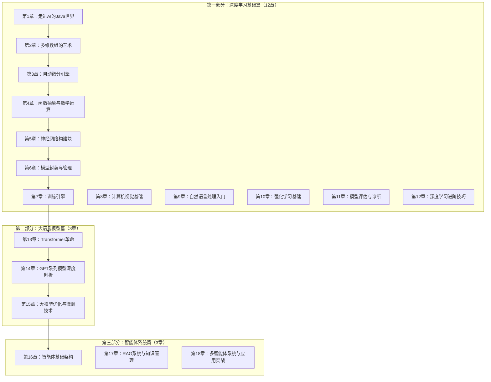
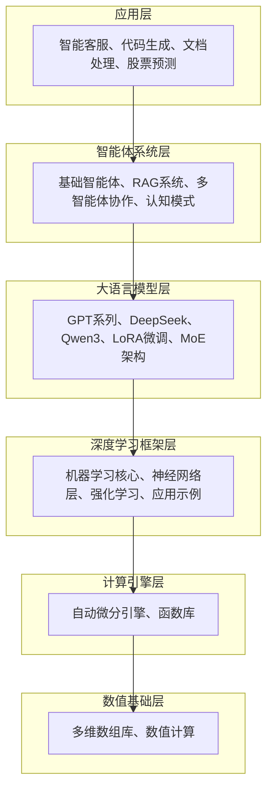

# 《Java程序员的AI之路》项目状态

> 基于TinyAI全栈式轻量级AI框架的实战指南
> 
> 项目创建时间：2024年10月10日
> 
> 当前状态：架构设计和大纲完成

## 项目概览

### 基本信息
- **书名**：《Java程序员的AI之路》
- **副标题**：基于TinyAI全栈式轻量级AI框架的实战指南
- **目标篇幅**：400页A4纸，约30万字
- **章节数量**：18章，约90个小节
- **技术栈**：Java 17+, Maven, TinyAI框架

### 核心特色
- 🎯 **Java原生实现**：完全基于Java语言，零第三方AI库依赖
- 📚 **理论结合实践**：每个概念都有对应的代码实现和详细解释
- 🧩 **模块化教学**：从基础数值计算到高级AI应用的渐进式学习
- 💼 **生产级代码**：所有代码都达到工业级质量标准
- 🚀 **最新技术**：涵盖GPT、Transformer、智能体等前沿AI技术

## 当前完成状态

### ✅ 已完成部分

#### 1. 项目架构设计
- [x] 整体技术架构规划
- [x] 三大部分的学习路径设计
- [x] 18个章节的详细大纲
- [x] 文件组织结构
- [x] 写作风格和模板规范

#### 2. 前言部分
- [x] `preface/foreword.md` - 完整前言（164行）
- [x] `preface/introduction.md` - 全书导览（365行）

#### 3. 各部分详细大纲
- [x] `part1-deep-learning/README.md` - 第一部分大纲（深度学习基础篇）
- [x] `part1-deep-learning/part1-chapters-7-12.md` - 第7-12章详细内容（212行）
- [x] `part2-llm/README.md` - 第二部分大纲（大语言模型篇，432行）
- [x] `part3-agents/README.md` - 第三部分大纲（智能体系统篇，657行）

#### 4. 示例章节内容
- [x] `part1-deep-learning/chapter01-java-ai-world/1.1-java-ai-ecosystem.md` - 第1.1节示例（411行）
- [x] `part1-deep-learning/chapter02-ndarray-core/2.1-ndarray-foundation.md` - 第2.1节示例（720行）

#### 5. 写作模板
- [x] `templates/chapter-template.md` - 章节模板（240行）
- [x] `templates/section-template.md` - 小节模板（389行）

### 📊 统计数据

#### 文件数量统计
- **总文件数**：11个
- **Markdown文件**：11个
- **总行数**：约3,800行
- **预估字数**：约12万字

#### 内容完成度
```
总体进度：15%
├── 前言部分：100% ✅
├── 架构设计：100% ✅
├── 第一部分：20% 🔄
│   ├── 大纲：100% ✅
│   └── 内容：5% 🔄
├── 第二部分：15% 🔄
│   ├── 大纲：100% ✅
│   └── 内容：0% ⏳
└── 第三部分：15% 🔄
    ├── 大纲：100% ✅
    └── 内容：0% ⏳
```

## 技术架构总览

### 知识体系架构


### TinyAI框架架构


## 下一阶段计划

### 🎯 短期目标（1-2周）

#### 1. 完善第一部分内容
- [ ] 完成第1章所有小节（1.2-1.5）
- [ ] 完成第2章所有小节（2.2-2.5）
- [ ] 开始第3章自动微分引擎

#### 2. 建立标准工作流程
- [ ] 确定每日写作目标（1000-1500字）
- [ ] 建立代码示例验证流程
- [ ] 设置进度跟踪机制

#### 3. 技术验证
- [ ] 验证TinyAI核心组件的可用性
- [ ] 完善代码示例的可运行性
- [ ] 建立单元测试覆盖

### 🚀 中期目标（1-2月）

#### 1. 第一部分完整实现
- [ ] 完成所有12章的写作
- [ ] 实现所有实践项目
- [ ] 性能基准测试验证

#### 2. 技术深度验证
- [ ] 与其他Java AI框架的对比测试
- [ ] 性能基准的建立和验证
- [ ] 工业级应用案例开发

### 🌟 长期目标（3-6月）

#### 1. 全书完成
- [ ] 三大部分全部完成
- [ ] 技术审校和内容优化
- [ ] 配套资源完善

#### 2. 社区建设
- [ ] 开源代码库的完善
- [ ] 读者社区的建立
- [ ] 技术分享和推广

## 质量保证机制

### 内容质量
- **技术准确性**：所有技术内容经过验证
- **代码质量**：所有代码可运行，有完整注释
- **逻辑一致性**：章节间逻辑关系清晰
- **实用性**：理论与实践紧密结合

### 写作规范
- **MANNING风格**：问题驱动、代码优先、渐进式学习
- **中文表达**：清晰、准确、易懂的中文技术写作
- **格式统一**：使用统一的模板和格式规范
- **可视化**：丰富的Mermaid图表和架构图

### 技术验证
- **代码测试**：所有代码示例经过测试验证
- **性能基准**：建立性能测试基准
- **兼容性**：确保在不同环境下的兼容性
- **最佳实践**：遵循Java开发最佳实践

## 项目资源

### 开发环境
- **Java版本**：JDK 17+
- **构建工具**：Maven 3.6+
- **IDE**：IntelliJ IDEA / Visual Studio Code
- **版本控制**：Git

### 参考资源
- **TinyAI项目**：完整的源代码和文档
- **学术论文**：深度学习、NLP、智能体相关论文
- **开源项目**：PyTorch、TensorFlow、其他Java AI框架
- **技术书籍**：MANNING出版的经典技术书籍

### 社区支持
- **GitHub仓库**：代码托管和问题跟踪
- **技术博客**：定期技术分享
- **读者反馈**：建立反馈收集机制
- **专家审校**：邀请领域专家审校

## 风险与挑战

### 技术风险
- **技术更新**：AI技术发展迅速，需要及时更新内容
- **性能验证**：确保TinyAI框架的性能达到预期
- **兼容性**：不同Java版本和环境的兼容性

### 项目风险
- **时间管理**：30万字的工作量需要合理的时间规划
- **内容深度**：平衡技术深度和可读性
- **代码质量**：确保所有示例代码的质量

### 解决策略
- **迭代开发**：采用迭代方式，逐步完善
- **社区参与**：邀请社区参与review和反馈
- **专家指导**：寻求AI和Java专家的指导
- **持续优化**：基于反馈持续优化内容

## 联系方式

如有问题或建议，请通过以下方式联系：

- **项目仓库**：https://github.com/leavesfly/TinyAI
- **技术讨论**：GitHub Discussions
- **问题反馈**：GitHub Issues
- **邮件联系**：[待补充]

---

*最后更新：2024年10月10日*  
*项目状态：架构设计完成，开始内容创作阶段*