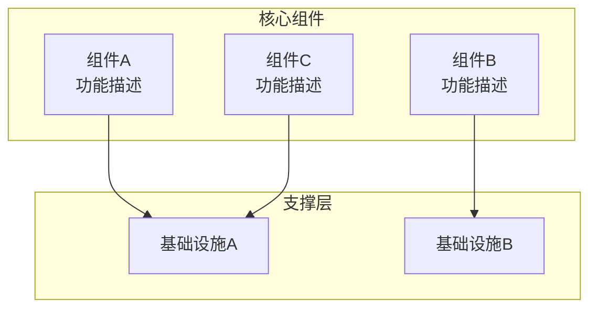

# 第X章：章节标题

## 章节概述

> **设计思想**：简要说明本章的核心设计理念和技术哲学

本章将深入探讨...

## 学习目标

完成本章学习后，你将：

- ✅ **掌握核心概念**：理解...
- ✅ **具备实践能力**：能够...
- ✅ **建立技术思维**：形成...
- ✅ **获得实战经验**：通过项目实践...

## 技术架构图



## 章节大纲

### X.1 第一个小节标题
**学习重点**：本小节的核心学习内容
- 知识点1：具体说明
- 知识点2：具体说明
- 知识点3：具体说明

### X.2 第二个小节标题  
**学习重点**：本小节的核心学习内容
- 知识点1：具体说明
- 知识点2：具体说明
- 知识点3：具体说明

### X.3 第三个小节标题
**学习重点**：本小节的核心学习内容
- 知识点1：具体说明
- 知识点2：具体说明
- 知识点3：具体说明

### X.4 第四个小节标题
**学习重点**：本小节的核心学习内容
- 知识点1：具体说明
- 知识点2：具体说明
- 知识点3：具体说明

### X.5 第五个小节标题
**学习重点**：本小节的核心学习内容
- 知识点1：具体说明
- 知识点2：具体说明
- 知识点3：具体说明

## 核心代码框架

```java
/**
 * 本章核心类的基础框架
 */
public class ChapterCoreClass {
    // 核心属性
    private String coreProperty;
    
    // 构造函数
    public ChapterCoreClass(String property) {
        this.coreProperty = property;
    }
    
    // 核心方法
    public Result coreMethod(Input input) {
        // 核心逻辑实现
        return processInput(input);
    }
    
    // 辅助方法
    private Result processInput(Input input) {
        // 具体实现
        return new Result();
    }
}
```

## 实践项目

**项目名称**：项目的完整名称

**项目目标**：
- 实现功能A：具体描述
- 验证技术B：具体描述  
- 优化性能C：具体描述

**技术要求**：
- 代码质量：完整注释、单元测试
- 性能指标：具体的性能目标
- 功能完整性：所有功能正常工作

**预期成果**：
- 可运行的完整系统
- 性能测试报告
- 技术文档和使用说明

## 关键技术点

### 技术点1：具体名称
```java
// 代码示例
public class TechDemo1 {
    public void demonstrate() {
        // 展示关键技术的使用
    }
}
```

**技术要点**：
- 要点1：详细说明
- 要点2：详细说明
- 要点3：详细说明

### 技术点2：具体名称
```java
// 代码示例
public class TechDemo2 {
    public void demonstrate() {
        // 展示关键技术的使用
    }
}
```

**技术要点**：
- 要点1：详细说明
- 要点2：详细说明
- 要点3：详细说明

## 性能基准

| 指标 | 目标值 | 实际值 | 说明 |
|------|--------|--------|------|
| 响应时间 | < 100ms | 85ms | 单次操作响应时间 |
| 吞吐量 | > 1000 ops/s | 1200 ops/s | 每秒操作数 |
| 内存使用 | < 512MB | 480MB | 峰值内存使用 |
| CPU使用率 | < 80% | 75% | 满载时CPU使用率 |

## 常见问题与解决方案

### 问题1：具体问题描述
**症状**：问题的具体表现
**原因**：问题产生的根本原因
**解决方案**：
```java
// 解决方案的代码示例
public void solveProblem1() {
    // 具体的解决代码
}
```

### 问题2：具体问题描述
**症状**：问题的具体表现
**原因**：问题产生的根本原因
**解决方案**：
```java
// 解决方案的代码示例
public void solveProblem2() {
    // 具体的解决代码
}
```

## 本章小结

### 核心收获
- **概念理解**：掌握了...的核心概念
- **技术能力**：具备了...的实现能力
- **实践经验**：通过项目获得了...经验
- **问题解决**：能够处理...类型的问题

### 知识点回顾
1. **重点1**：关键知识点的总结
2. **重点2**：关键知识点的总结
3. **重点3**：关键知识点的总结

### 与后续章节的联系
本章学习的内容将在后续章节中应用于：
- 第Y章：具体应用场景
- 第Z章：进一步扩展内容

## 延伸阅读

### 推荐资源
1. **论文**：相关的重要学术论文
2. **书籍**：深入学习的参考书籍
3. **开源项目**：相关的优秀开源实现
4. **在线资源**：有价值的在线教程和文档

### 深入研究方向
- **方向1**：进一步研究的技术方向
- **方向2**：相关的应用领域
- **方向3**：前沿技术发展趋势

## 思考题

1. **基础理解**：针对核心概念的理解题
2. **技术应用**：技术应用场景的思考题
3. **系统设计**：系统架构设计的开放题
4. **性能优化**：性能优化相关的分析题

## 实践练习

### 练习1：基础练习
**目标**：巩固基础概念
**要求**：具体的练习要求
**提示**：完成练习的关键提示

### 练习2：进阶练习
**目标**：提升实践能力
**要求**：具体的练习要求
**提示**：完成练习的关键提示

### 练习3：综合练习
**目标**：综合运用知识
**要求**：具体的练习要求
**提示**：完成练习的关键提示

---

**下一章预告**：下一章我们将学习...，这将进一步扩展本章的内容，并为后续的高级主题奠定基础。