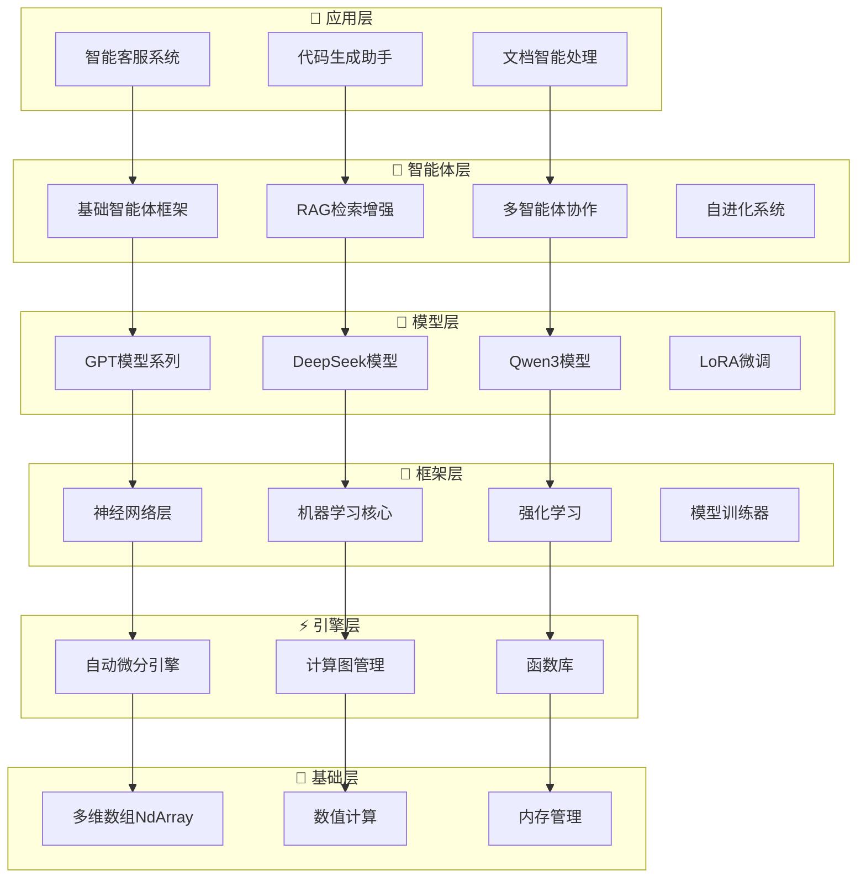
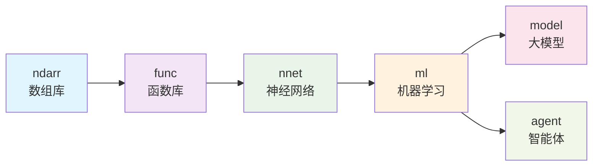
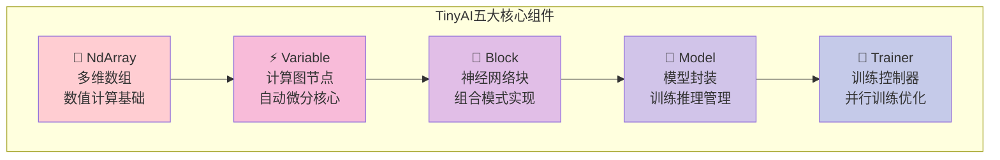
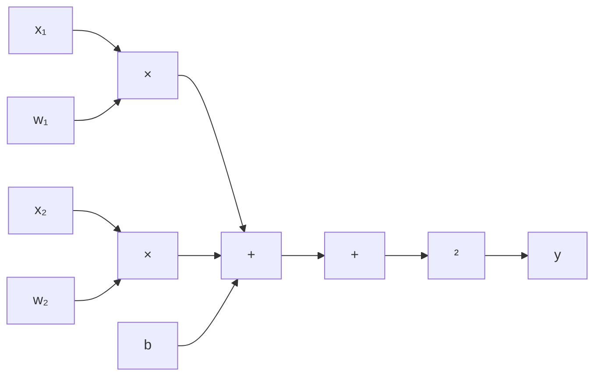
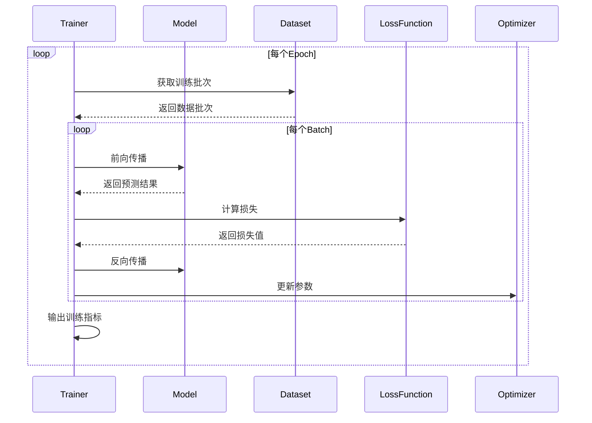
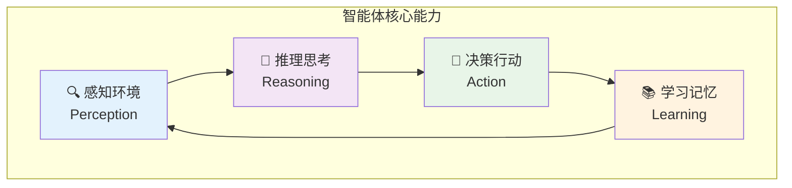
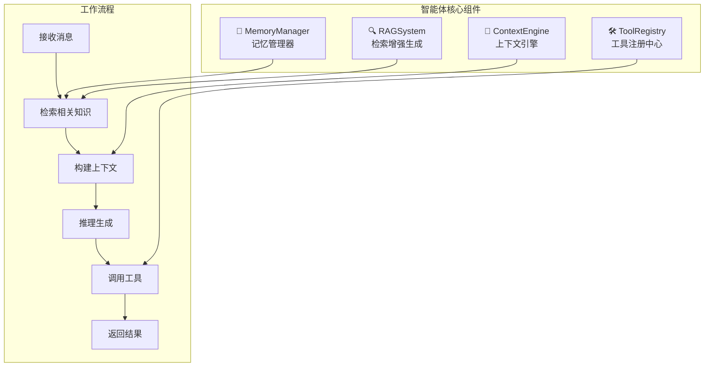
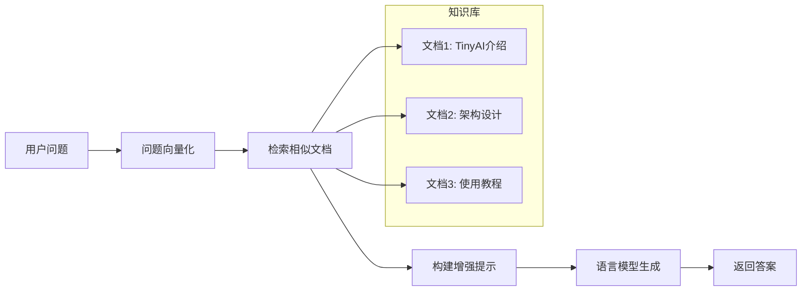
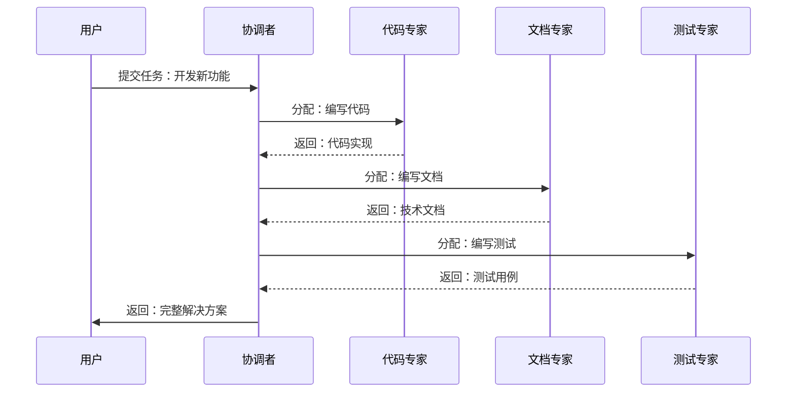

# TinyAI - 从零开始的Java AI之旅
## 技术分享文档

> **撰写者**: 山泽  
> **版本**: v1.0  
> **日期**: 2025年10月3日  

---

## 📖 目录

1. [为什么要有TinyAI？](#1-为什么要有tinyai)
2. [TinyAI是什么？](#2-tinyai是什么)
3. [架构设计：搭积木的艺术](#3-架构设计搭积木的艺术)
4. [核心技术解析](#4-核心技术解析)
5. [智能体系统：AI的未来形态](#5-智能体系统ai的未来形态)

---

## 1. 为什么要有TinyAI？

### 1.1 现状分析：Java在AI领域的困境

想象一下，当大家都在用Python玩转AI的时候，Java开发者只能眼睁睁地看着：

```python
# Python的AI世界
import torch
import tensorflow as tf
model = torch.nn.Sequential(...)  # 几行代码就搞定
```

而Java开发者想要做AI？要么：
- 🔗 调用Python接口（隔靴搔痒）
- 📚 学习复杂的第三方库（学习成本高）
- 🌐 依赖云端API（网络依赖，成本高）

### 1.2 TinyAI的使命：让Java也能原生AI

**问题**：为什么不能有一个**纯Java**的AI框架？
**答案**：当然可以！这就是TinyAI的诞生初衷。

TinyAI要解决的核心问题：
- ✅ **零依赖**：纯Java实现，不依赖任何第三方AI库
- ✅ **易理解**：清晰的中文注释，教育友好
- ✅ **全功能**：从基础张量到大模型，一应俱全
- ✅ **可扩展**：模块化设计，想要什么功能就加什么

---

## 2. TinyAI是什么？

### 2.1 一句话概括

> TinyAI是一个**完全用Java写的**、**从底层数组到大模型**的**全栈式AI框架**

### 2.2 技术全景图

```
🏗️ TinyAI技术栈
├── 📱 应用层：智能客服、代码助手、文档分析...
├── 🤖 智能体层：RAG系统、多智能体协作、自进化...
├── 🧠 模型层：GPT、DeepSeek、Qwen、LoRA、MoE...
├── 🚀 框架层：神经网络、训练器、优化器...
├── ⚡ 引擎层：自动微分、计算图、函数库...
└── 🧮 基础层：多维数组、数值计算、内存管理...
```

### 2.3 模块一览

| 模块类别 | 数量 | 核心功能 | 代表模块 |
|---------|------|---------|---------|
| **🤖 智能体系统** | 7个 | 智能对话、知识管理、多智能体协作 | `agent-base`, `agent-rag`, `agent-multi` |
| **🧠 大语言模型** | 5个 | GPT/DeepSeek/Qwen模型实现 | `model-gpt`, `model-deepseek`, `model-qwen` |
| **🚀 深度学习** | 6个 | 神经网络、训练、强化学习 | `dl-ml`, `dl-nnet`, `dl-rl` |

---

## 3. 架构设计：搭积木的艺术

### 3.1 分层架构：从下往上的设计哲学

TinyAI采用经典的分层架构，就像搭积木一样，每一层都有明确的职责：



### 3.2 依赖关系：单向依赖的稳定设计



**设计原则**：
- 🔗 **单向依赖**：下层不依赖上层，保证模块独立性
- 🧩 **职责分离**：每个模块只做一件事，但要做好
- 🔄 **可替换性**：接口抽象，实现可替换

### 3.3 核心组件：五大金刚



---

## 4. 核心技术解析

### 4.1 NdArray：一切计算的基石

#### 什么是NdArray？
简单来说，NdArray就是**多维数组**，但不是普通的数组，它是专门为AI计算优化的数组。

```java
// 创建一个2x3的矩阵
NdArray matrix = NdArray.create(new float[][]{{1, 2, 3}, {4, 5, 6}});

// 矩阵相乘
NdArray result = matrix.mul(another);

// 广播操作（小数组自动扩展匹配大数组）
NdArray scalar = NdArray.scalar(2.0f);
NdArray doubled = matrix.mul(scalar);  // 每个元素都乘以2
```

#### 为什么需要NdArray？
- 🚀 **高效计算**：批量操作，一次处理成千上万个数据
- 🔄 **广播机制**：自动处理不同形状的数组运算
- 💾 **内存优化**：连续内存布局，缓存友好

### 4.2 Variable：让计算图活起来

#### 什么是计算图？
想象一下数学公式的执行过程：

```
y = (x₁ * w₁ + x₂ * w₂ + b) 的平方
```

在TinyAI中，这会变成：



#### Variable的神奇之处

```java
// 前向计算：正常计算结果
Variable x = new Variable(NdArray.create(new float[]{1, 2, 3}));
Variable w = new Variable(NdArray.create(new float[]{0.5f, 0.3f, 0.2f}));
Variable y = x.mul(w).sum();  // 自动构建计算图

// 反向传播：自动计算梯度
y.backward();  // 神奇！所有参数的梯度都算出来了
System.out.println("w的梯度: " + w.getGrad());  // [1, 2, 3]
```

**核心优势**：
- 🧠 **自动微分**：不用手算导数，框架自动搞定
- 📈 **动态图**：运行时构建，调试友好
- 🔗 **链式法则**：复杂函数的梯度自动传播

### 4.3 Block：搭建神经网络的积木

#### 组合模式的威力

Block采用了**组合模式**，就像搭乐高积木一样：

```java
// 创建一个多层感知机
MlpBlock mlp = new MlpBlock("classifier", 
    784,  // 输入维度（28x28图片展平）
    new int[]{128, 64, 10},  // 隐藏层：128 -> 64 -> 10
    Config.ActiveFunc.RELU   // 激活函数
);

// 或者手工搭建
SequentialBlock network = new SequentialBlock("my_net", new Shape(784));
network.addLayer(new DenseLayer("fc1", 784, 128));
network.addLayer(new ReluLayer("relu1"));
network.addLayer(new DenseLayer("fc2", 128, 64));
network.addLayer(new ReluLayer("relu2"));
network.addLayer(new DenseLayer("fc3", 64, 10));
```

#### 为什么用组合模式？
- 🧩 **可复用**：一个Block可以在多个地方使用
- 🔧 **易扩展**：想加新层？直接插入即可
- 🎯 **易理解**：网络结构一目了然

### 4.4 Model & Trainer：训练的指挥中心

#### Model：模型的生命周期管理

```java
// 创建模型
Model model = new Model("image_classifier", mlpBlock);

// 前向推理
NdArray prediction = model.forward(inputData);

// 保存模型
model.save("my_model.tinyai");

// 加载模型
Model loadedModel = Model.load("my_model.tinyai");
```

#### Trainer：智能训练控制

```java
// 配置训练器
Trainer trainer = new Trainer(
    100,        // epochs
    monitor,    // 训练监控
    evaluator,  // 模型评估
    true,       // 启用并行训练
    4           // 4个线程
);

// 一键训练
trainer.init(dataset, model, lossFunction, optimizer);
trainer.train(true);  // 显示进度条
```

**训练过程可视化**：



---

## 5. 智能体系统：AI的未来形态

### 5.1 什么是智能体？

智能体（Agent）不是简单的问答机器人，而是具有**感知、思考、行动**能力的AI系统。



### 5.2 TinyAI智能体架构

#### 基础智能体：AdvancedAgent

```java
// 创建智能体
AdvancedAgent agent = new AdvancedAgent("小助手", "你是一个专业的技术助手");

// 添加知识
agent.addKnowledge("TinyAI是Java AI框架", "tinyai_info");

// 注册工具
agent.getToolRegistry().registerTool("calculator", new CalculatorTool(), "计算器");

// 对话交互
String response = agent.processMessage("什么是TinyAI？请帮我计算2+3");
```

#### 核心组件详解



### 5.3 RAG系统：让AI有知识

#### 什么是RAG？
RAG（Retrieval-Augmented Generation）= 检索 + 生成，让AI能够使用外部知识。

```java
// 创建RAG系统
RAGSystem rag = new RAGSystem();

// 添加文档
rag.addDocument(new Document("doc1", "TinyAI是一个Java AI框架"));
rag.addDocument(new Document("doc2", "支持深度学习和大语言模型"));

// 检索相关文档
List<RetrievalResult> results = rag.retrieve("Java AI框架", 3);

// 基于检索结果生成答案
String answer = rag.generateAnswer("什么是TinyAI？", results);
```

#### RAG工作原理



### 5.4 多智能体系统：团队协作

想象一个AI团队，每个成员都有专长：

```java
// 创建多智能体系统
MultiAgentSystem mas = new MultiAgentSystem();

// 添加专业智能体
mas.addAgent(new SpecializedAgent("代码专家", "专门处理编程问题"));
mas.addAgent(new SpecializedAgent("文档专家", "专门处理文档编写"));
mas.addAgent(new SpecializedAgent("测试专家", "专门处理测试相关"));

// 协作处理任务
CollaborationResult result = mas.processTask("开发一个新功能");
```

#### 协作流程



### 5.5 自进化智能体：持续学习

```java
// 创建自进化智能体
SelfEvolvingAgent evolAgent = new SelfEvolvingAgent("学习助手");

// 处理任务并学习
TaskResult result = evolAgent.processTask("解决编程问题", context);

// 根据反馈进化
evolAgent.receiveHumanFeedback(feedback);
evolAgent.selfEvolve();  // 自我优化策略
```

**进化机制**：
- 📊 **经验收集**：记录每次任务的执行情况
- 🔍 **模式发现**：分析成功和失败的模式
- ⚡ **策略优化**：调整决策和行为策略
- 🔄 **持续改进**：在实践中不断完善

---

*（文档第一部分完成，包含了TinyAI的核心概念、架构设计和智能体系统。第二部分将继续介绍大语言模型、实战案例和技术优势等内容。）*