# TinyAI：Java生态中的深度学习与智能体全栈框架 V2.0

> 山泽 著
> 
> 用Java的方式，拥抱AI的未来 —— 更少代码，更多图表，更易理解

## 前言：Java AI的新篇章

在AI浪潮中，Python虽是主流，但对于Java开发者而言，技术栈的割裂往往成为进入AI领域的门槛。TinyAI正是为了解决这一痛点而生——**让Java开发者用最熟悉的语言，做最前沿的AI**。

### 核心价值主张

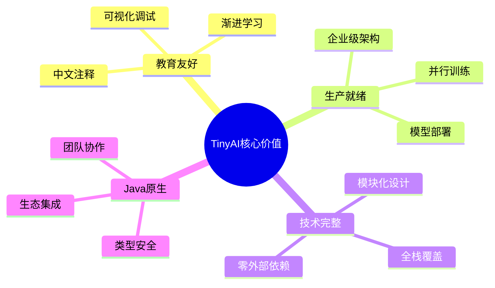

## 第一章：架构全景——16个模块的和谐协奏

### 1.1 分层架构设计

TinyAI采用自底向上的分层设计，每一层都为上层提供坚实的基础：

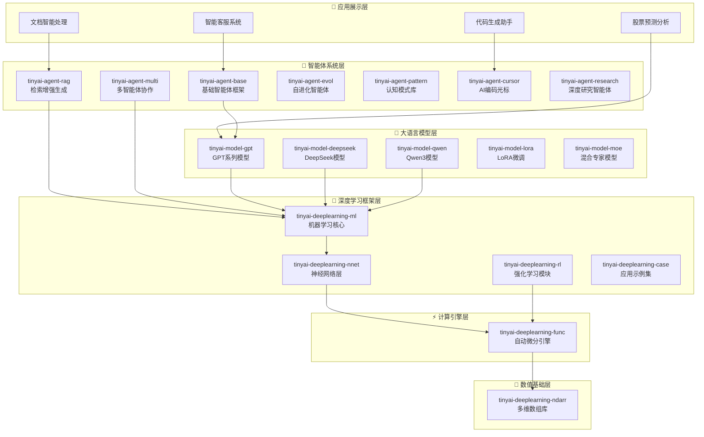

### 1.2 核心组件的设计哲学

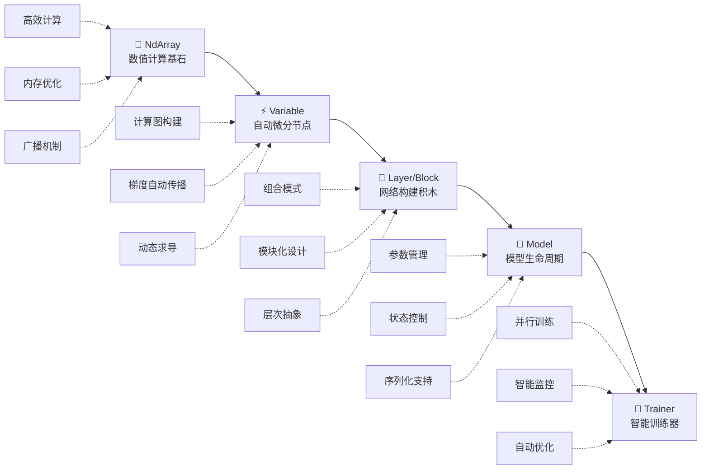

## 第二章：技术核心——从数学到智慧的转换

### 2.1 自动微分：深度学习的心脏

自动微分是深度学习的核心技术，TinyAI通过`Variable`类实现了优雅的计算图构建：

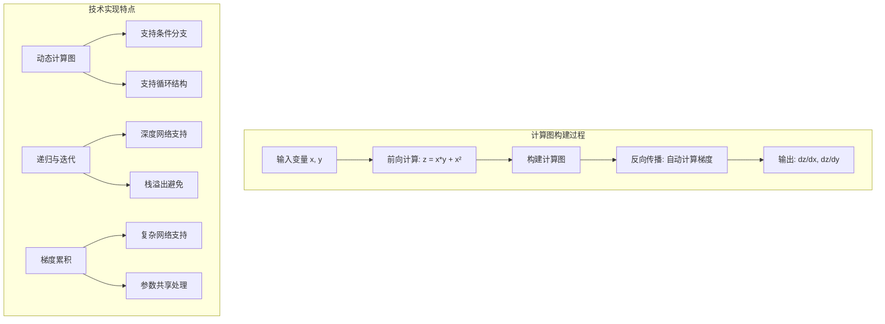

**核心API示例**：
```java
// 简洁的计算图构建
Variable x = new Variable(NdArray.of(2.0f), "x");
Variable y = new Variable(NdArray.of(3.0f), "y");
Variable z = x.mul(y).add(x.squ());  // z = x*y + x²

// 一键反向传播
z.backward();  // 魔法时刻！
```

### 2.2 神经网络：积木式的网络构建

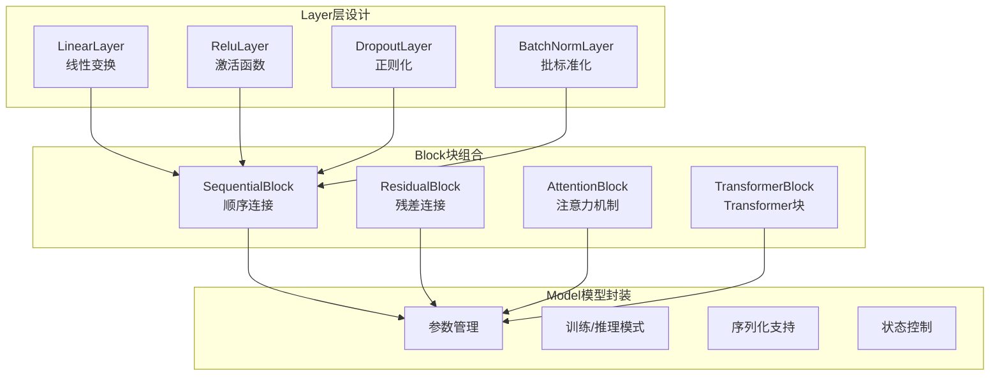

### 2.3 训练流程：从数据到智慧

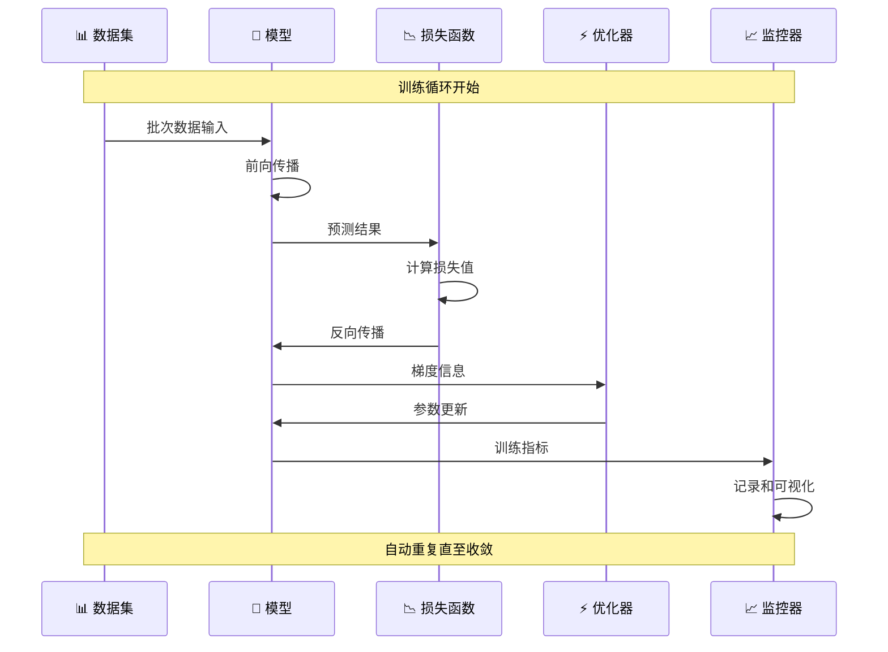

## 第三章：大语言模型——从GPT到现代架构

### 3.1 GPT系列的演进历程

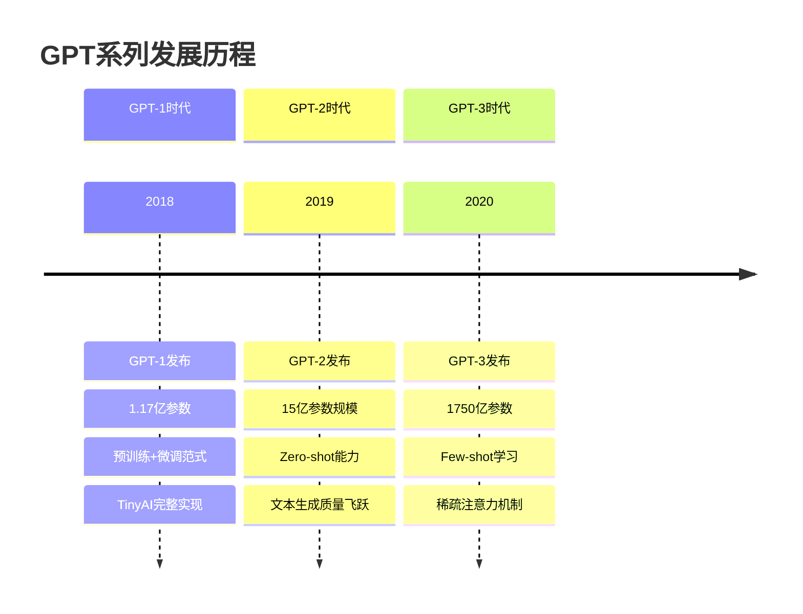

### 3.2 现代架构的技术创新

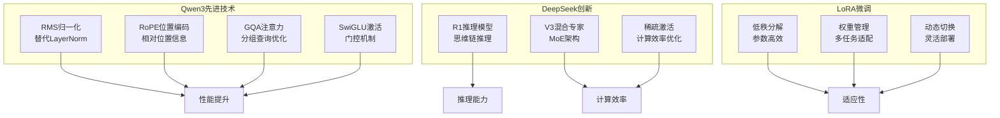

### 3.3 模型使用的简化API

```java
// GPT-2文本生成（简化示例）
GPT2Model model = GPT2Model.createMediumModel("gpt2-medium");
String generated = model.generateText("人工智能的未来", maxLength: 100);

// Qwen3对话（简化示例）  
Qwen3Model qwen = new Qwen3Model(Qwen3Config.createDefault());
String response = qwen.chat("解释一下深度学习的原理");

// LoRA微调（简化示例）
LoraConfig config = LoraConfig.createMediumRank();
model.enableLora(config);
model.fineTune(customDataset);
```

## 第四章：智能体系统——赋予AI思考的能力

### 4.1 智能体能力层次

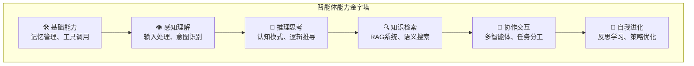

### 4.2 RAG系统：知识驱动的智能对话

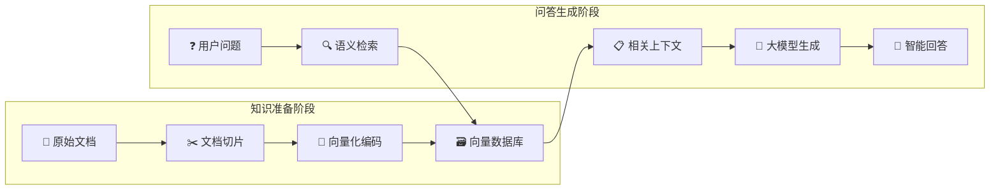

**RAG的技术优势**：
- ✅ 知识时效性：实时更新知识库
- ✅ 回答准确性：基于真实文档生成
- ✅ 可解释性：提供信息来源追溯
- ✅ 成本效益：无需重新训练大模型

### 4.3 多智能体协作模式

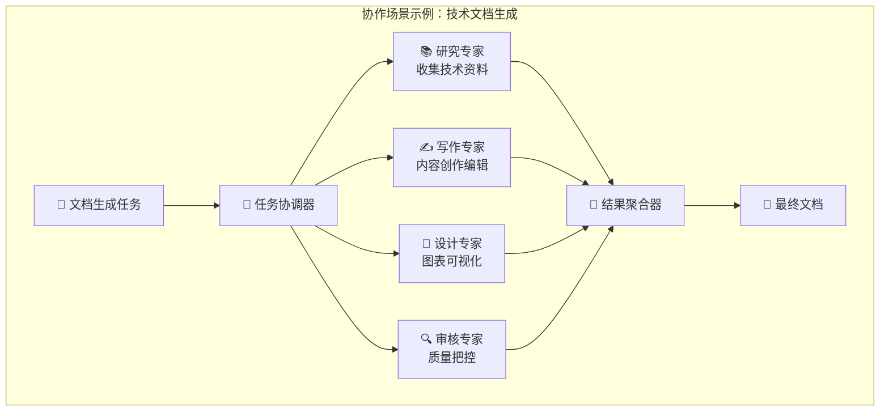

### 4.4 自进化智能体：从经验中学习

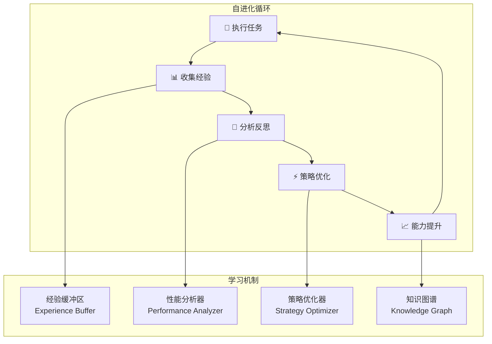

## 第五章：实际应用案例展示

### 5.1 MNIST手写数字识别

**问题场景**：经典的计算机视觉入门任务

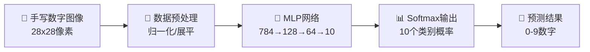

**训练效果可视化**：
```
📈 训练进度展示
Epoch 1/50:  Loss=2.156, Accuracy=23.4% ████▒▒▒▒▒▒
Epoch 10/50: Loss=0.845, Accuracy=75.6% ████████▒▒
Epoch 25/50: Loss=0.234, Accuracy=89.3% █████████▒
Epoch 50/50: Loss=0.089, Accuracy=97.3% ██████████

🎯 最终测试准确率: 97.3%
```

### 5.2 智能客服系统架构

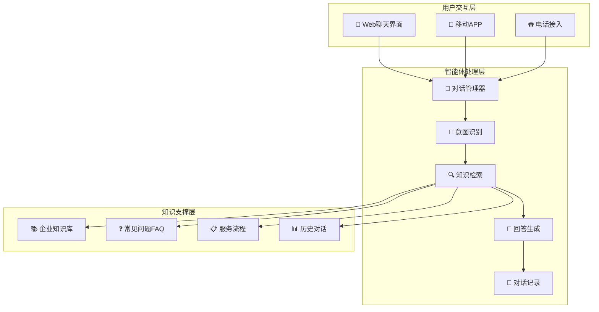

### 5.3 股票预测系统

**技术架构**：
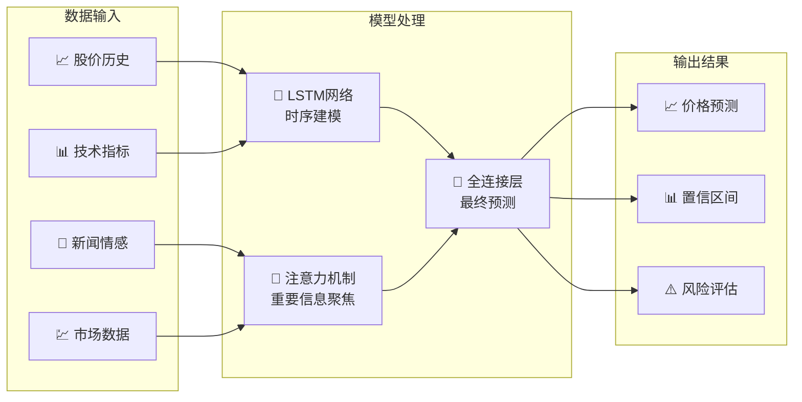

## 第六章：性能优化与最佳实践

### 6.1 性能优化策略

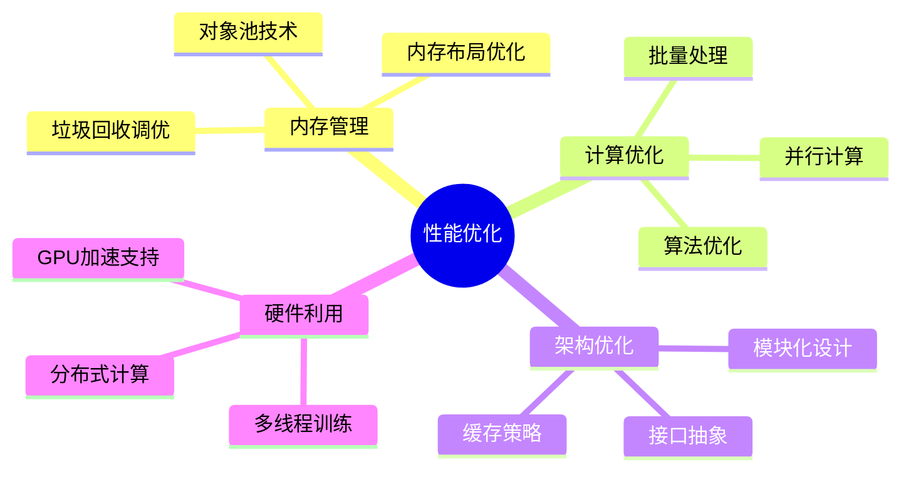

### 6.2 开发最佳实践

**✅ 推荐的代码结构**：
```java
// 清晰的模型组织
public class RecommendedModelDesign {
    public Model createModel() {
        // 特征提取器
        Block featureExtractor = new SequentialBlock("feature_extractor")
            .addLayer(new LinearLayer("fe1", 784, 512))
            .addLayer(new BatchNormalizationLayer("bn1"))
            .addLayer(new ReluLayer("relu1"));
        
        // 分类器
        Block classifier = new SequentialBlock("classifier")
            .addLayer(new LinearLayer("cls", 512, 10))
            .addLayer(new SoftmaxLayer("softmax"));
        
        return new Model("organized_model", 
            new SequentialBlock("full").addBlock(featureExtractor).addBlock(classifier));
    }
}
```

### 6.3 训练监控与调试

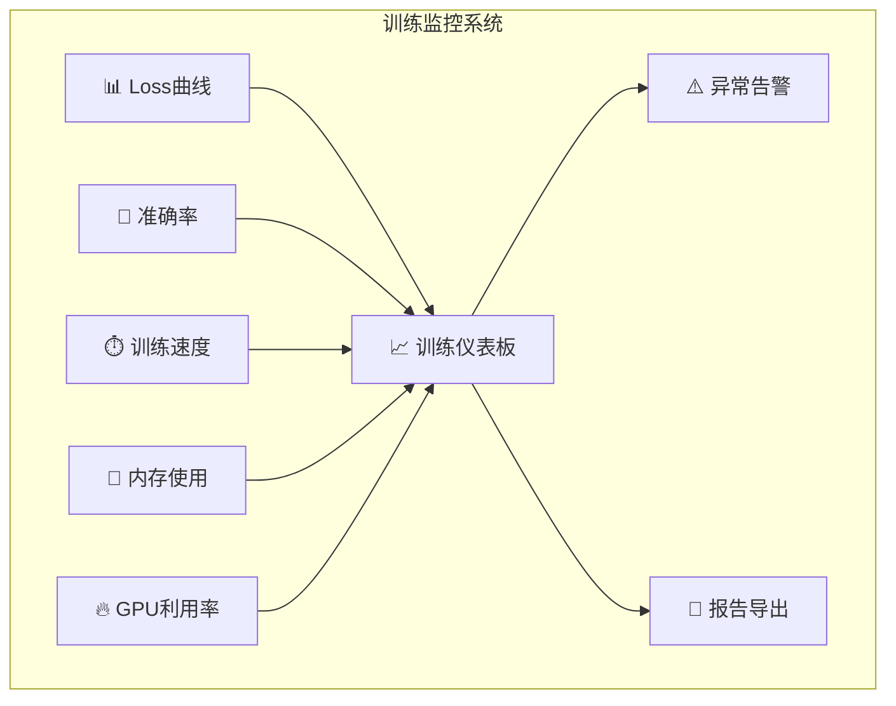

## 第七章：未来发展与生态建设

### 7.1 技术发展路线图

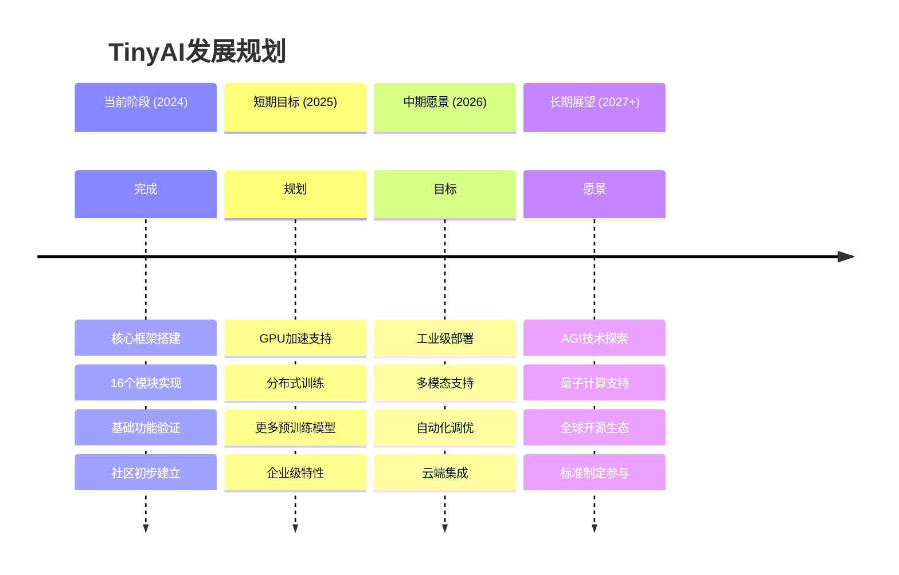

### 7.2 应用场景展望

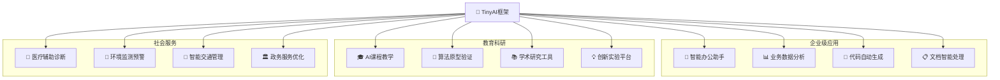

### 7.3 社区生态愿景

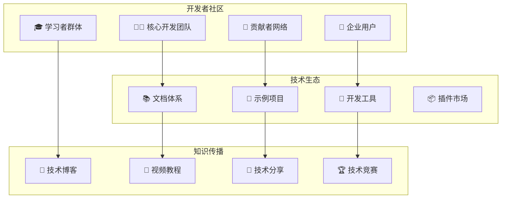

## 结语：Java AI生态的新时代

TinyAI不仅仅是一个技术框架，更是一个理念的体现——**让AI开发在Java生态中焕发新的活力**。

### 🎯 核心成就

```mermaid
graph LR
    Achievement1[🏗️ 技术完整性<br/>全栈AI覆盖] --> Value[💎 TinyAI价值]
    Achievement2[🧩 架构优雅性<br/>模块化设计] --> Value
    Achievement3[🎓 教育友好性<br/>学习门槛低] --> Value
    Achievement4[🚀 生产就绪性<br/>企业级特性] --> Value
```

### 🌟 社区愿景

我们的目标是构建一个充满活力的Java AI生态：

- **开发者友好**：让每个Java开发者都能轻松上手AI
- **技术先进**：跟上AI技术发展的最新趋势
- **应用广泛**：在各行各业发挥Java+AI的优势
- **持续创新**：通过社区力量推动技术进步

### 📞 加入我们

**无论您是**：
- 🤔 对AI感兴趣的Java开发者
- 🎓 希望学习AI的学生
- 🏢 寻求AI解决方案的企业
- 🔬 进行AI研究的学者

**都欢迎您**：
- ⭐ 给项目点星支持
- 🐛 提交问题和建议  
- 💡 贡献代码和想法
- 📢 分享使用经验

---

**让我们一起，用Java的力量，开启AI的无限可能！**

> *"Simple things should be simple, complex things should be possible."*  
> —— TinyAI设计哲学

<div align="center">

**🎯 让AI开发在Java生态中焕发新的活力！**

**如果这个项目对您有帮助，请给我们一个 ⭐️**

[📚 查看完整文档](https://github.com/leavesfly/TinyAI) | [🚀 快速开始](https://github.com/leavesfly/TinyAI/blob/main/README.md) | [💬 社区交流](https://github.com/leavesfly/TinyAI/discussions)

</div>