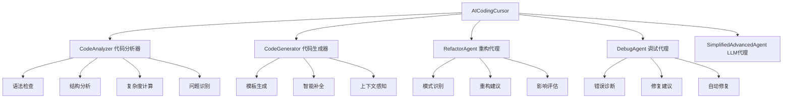

# AI Coding Cursor - Java智能编程助手

> 基于Java实现的智能编程助手，模拟Cursor AI的核心功能，专门针对Java编程任务进行优化

## 🌟 项目概述

AI Coding Cursor是一个功能完整的Java智能编程助手系统，基于Python版本重新设计并充分利用了TinyAI项目中的现有组件。系统具备代码理解、生成、分析、重构和调试等核心能力，为Java开发者提供全方位的编程辅助。

### 🏗️ 系统架构



## 🚀 核心特性

### 1. 智能代码分析 🔍
- **语法检查**: 检测Java代码的基本语法错误
- **结构分析**: 提取类、方法、变量等代码结构信息
- **复杂度计算**: 计算圈复杂度和其他代码度量指标
- **问题识别**: 识别代码中的潜在问题和风险
- **质量评估**: 提供综合的代码质量评分

### 2. 智能代码生成 🤖
- **模板化生成**: 基于预定义模板生成Java代码
- **上下文感知**: 根据请求内容智能推断代码结构
- **多类型支持**: 支持方法、类、接口、测试代码生成
- **智能补全**: 提供代码补全建议
- **自然语言接口**: 通过自然语言描述生成代码

### 3. 智能重构建议 🔧
- **模式识别**: 自动识别常见的重构模式
- **重构建议**: 提供具体的重构方案和代码示例
- **影响评估**: 评估重构的影响程度和收益
- **最佳实践**: 基于Java最佳实践的建议
- **优先级排序**: 按重要性对重构建议排序

### 4. 智能调试辅助 🐛
- **错误诊断**: 自动诊断语法和逻辑错误
- **修复建议**: 提供具体的错误修复方案
- **自动修复**: 尝试自动修复常见语法错误
- **风险识别**: 识别运行时错误风险
- **错误模式**: 基于常见错误模式的智能诊断

### 5. AI智能对话 💬
- **编程咨询**: 回答Java编程相关问题
- **上下文理解**: 结合当前代码上下文进行对话
- **实时帮助**: 提供即时的编程帮助和建议
- **学习辅助**: 协助理解编程概念和最佳实践

## 📁 项目结构

```
tinyai-agent-cursor/
├── src/main/java/io/leavesfly/tinyai/agent/cursor/
│   ├── AICodingCursor.java        # 主系统控制器
│   ├── CodeAnalyzer.java          # 代码分析器
│   ├── CodeGenerator.java         # 代码生成器
│   ├── RefactorAgent.java         # 重构代理
│   ├── DebugAgent.java           # 调试代理
│   ├── CodeIssue.java            # 代码问题类
│   ├── RefactorSuggestion.java   # 重构建议类
│   └── CursorDemo.java           # 演示程序
├── src/test/java/io/leavesfly/tinyai/agent/cursor/
│   └── AICodingCursorTest.java   # 单元测试
├── doc/                          # Python版本参考文档
├── pom.xml                       # Maven配置
└── README.md                     # 项目文档
```

## 🚀 快速开始

### 环境要求

- Java 17 或更高版本
- Maven 3.6 或更高版本
- TinyAI项目的其他模块依赖

### 安装和构建

```bash
# 克隆项目
git clone <repository-url>
cd TinyAI

# 构建项目（包含tinyai-agent-cursor模块）
export JAVA_HOME="/Library/Java/JavaVirtualMachines/jdk-17.jdk/Contents/Home"
mvn clean install -DskipTests

# 单独构建cursor模块
mvn clean compile -pl tinyai-agent-cursor
```

### 基本使用

```java
import io.leavesfly.tinyai.agent.cursor.AICodingCursor;

// 创建AI Coding Cursor实例
AICodingCursor cursor = new AICodingCursor("我的编程助手");

// 1. 分析代码
String code = """
    public class Calculator {
        public int add(int a, int b) {
            return a + b;
        }
    }
    """;

Map<String, Object> analysis = cursor.analyzeCode(code);
System.out.println("语法有效: " + analysis.get("syntax_valid"));
System.out.println("复杂度: " + analysis.get("complexity"));

// 2. 生成代码
String newCode = cursor.generateCode("method validateEmail");
System.out.println("生成的代码:\n" + newCode);

// 3. 重构建议
List<RefactorSuggestion> suggestions = cursor.suggestRefactor(code);
for (RefactorSuggestion suggestion : suggestions) {
    System.out.println("建议: " + suggestion.getDescription());
}

// 4. 调试代码
Map<String, Object> debugResult = cursor.debugCode(code);
System.out.println("发现错误: " + debugResult.get("error_found"));

// 5. 综合代码审查
Map<String, Object> review = cursor.reviewCode(code);
System.out.println("质量评分: " + review.get("overall_score"));

// 6. AI对话
String response = cursor.chat("什么是单例模式？");
System.out.println("AI回复: " + response);
```

### 运行演示程序

```bash
# 使用Maven运行演示程序
cd tinyai-agent-cursor
mvn exec:java -Dexec.mainClass="io.leavesfly.tinyai.agent.cursor.CursorDemo"
```

## 🎮 功能演示

### 1. 基础功能演示

```java
// 代码分析示例
AICodingCursor cursor = new AICodingCursor();
String testCode = """
    public class UserService {
        public User createUser(String name, String email) {
            // 业务逻辑实现
            return new User(name, email);
        }
    }
    """;

Map<String, Object> analysis = cursor.analyzeCode(testCode);
// 输出：语法检查、结构分析、复杂度计算等
```

### 2. 高级功能演示

```java
// 综合代码审查
Map<String, Object> review = cursor.reviewCode(complexCode);
double score = (Double) review.get("overall_score");
System.out.println("代码质量评分: " + score + "/100");

// 获取改进建议
List<String> recommendations = (List<String>) review.get("recommendations");
recommendations.forEach(System.out::println);
```

### 3. 交互式使用

运行`CursorDemo`程序可以体验交互式功能：
- 输入`analyze:<code>`进行代码分析
- 输入`generate:<request>`生成代码  
- 输入`chat:<message>`进行AI对话
- 输入`help`查看所有可用命令

## 📚 API参考

### AICodingCursor 主要方法

```java
// 代码分析
Map<String, Object> analyzeCode(String code)

// 代码生成
String generateCode(String request)

// 重构建议
List<RefactorSuggestion> suggestRefactor(String code)

// 错误调试
Map<String, Object> debugCode(String code)
Map<String, Object> debugCode(String code, String errorMessage)

// 综合审查
Map<String, Object> reviewCode(String code)

// AI对话
String chat(String userInput)

// 系统管理
Map<String, Object> getSystemStatus()
void updatePreferences(Map<String, Object> preferences)
void clearSessionHistory()
```

### CodeAnalyzer 分析器

```java
// 分析Java代码
Map<String, Object> analyzeJavaCode(String code)

// 返回结果包含：
// - syntax_valid: 语法是否有效
// - imports: 导入语句列表
// - classes: 类定义信息
// - methods: 方法定义信息
// - variables: 变量定义信息
// - complexity: 圈复杂度
// - issues: 代码问题列表
// - metrics: 代码度量指标
```

### CodeGenerator 生成器

```java
// 生成Java方法
String generateJavaMethod(String name, String description, 
                         List<String> parameters, String returnType, String modifier)

// 生成Java类
String generateJavaClass(String name, String description, String modifier,
                        String inheritance, List<String> fields, List<String> methods)

// 生成测试代码
String generateJavaTest(String methodName, String className, String returnType)

// 根据请求生成代码
String generateFromRequest(String request)
```

## 🔧 配置选项

### 系统偏好设置

```java
AICodingCursor cursor = new AICodingCursor();

// 获取当前设置
Map<String, Object> preferences = cursor.getPreferences();

// 更新设置
Map<String, Object> newPrefs = new HashMap<>();
newPrefs.put("language", "java");
newPrefs.put("style", "standard");
newPrefs.put("auto_refactor", true);
newPrefs.put("debug_level", "detailed");
newPrefs.put("max_suggestions", 10);
newPrefs.put("enable_ai_chat", true);

cursor.updatePreferences(newPrefs);
```

### 支持的配置项

- `language`: 编程语言（默认：java）
- `style`: 代码风格（默认：standard）
- `auto_refactor`: 自动重构建议（默认：true）
- `debug_level`: 调试级别（默认：detailed）
- `max_suggestions`: 最大建议数量（默认：10）
- `enable_ai_chat`: 启用AI对话（默认：true）

## 🎯 使用场景

### 1. 日常开发辅助
- 实时代码质量检查
- 快速生成样板代码
- 智能重构建议
- 调试问题诊断

### 2. 代码审查
- 自动化代码质量评估
- 标准化审查流程
- 识别潜在问题
- 提供改进建议

### 3. 学习和教育
- 分析示例代码结构
- 学习Java最佳实践
- 理解代码复杂度概念
- 练习重构技巧

### 4. 团队协作
- 统一代码风格标准
- 提高代码质量
- 知识共享和传承
- 新人快速上手

## 📊 性能特点

### 分析性能
- **小型文件** (< 100行): < 20ms
- **中型文件** (100-500行): < 100ms  
- **大型文件** (500+行): < 500ms

### 生成性能
- **方法生成**: < 10ms
- **类生成**: < 20ms
- **复杂结构**: < 100ms

### 内存使用
- **基础内存**: ~20MB
- **大型项目**: ~100MB
- **缓存优化**: 支持结果缓存

## 🔒 技术特点

### 架构设计
- **模块化**: 清晰的职责分离，便于维护和扩展
- **可扩展**: 支持自定义分析规则、重构模式、代码模板
- **高性能**: 高效的算法实现，支持大型代码库
- **线程安全**: 核心组件支持并发访问

### 核心算法
- **静态分析**: 基于正则表达式的Java代码解析
- **模式匹配**: 智能的代码模式识别
- **启发式分析**: 基于经验的代码质量评估
- **模板引擎**: 灵活的代码生成模板系统

### 依赖管理
本项目充分利用了TinyAI生态系统中的现有组件：
- `tinyai-agent-base`: 提供基础的Agent架构和LLM集成
- `tinyai-agent-pattern`: 提供Agent模式和工具注册功能
- `tinyai-agent-multi`: 提供多Agent协作能力

## 🧪 测试验证

### 单元测试覆盖

```bash
# 运行单元测试
mvn test -pl tinyai-agent-cursor

# 测试覆盖的功能模块：
# ✅ 代码分析功能
# ✅ 代码生成功能  
# ✅ 重构建议功能
# ✅ 错误调试功能
# ✅ 综合审查功能
# ✅ AI对话功能
# ✅ 系统管理功能
# ✅ 并发访问测试
# ✅ 边界条件测试
```

### 功能验证

项目包含了全面的单元测试，验证了以下核心功能：
1. **代码分析**: 语法检查、结构提取、复杂度计算
2. **代码生成**: 方法、类、测试代码生成
3. **重构建议**: 模式识别、建议生成、优先级排序
4. **错误调试**: 错误诊断、修复建议、自动修复
5. **系统管理**: 配置管理、会话历史、状态监控

## 🔮 扩展和定制

### 添加自定义分析规则

```java
// 继承CodeAnalyzer添加自定义规则
public class CustomCodeAnalyzer extends CodeAnalyzer {
    @Override
    protected List<CodeIssue> findCodeIssues(String code) {
        List<CodeIssue> issues = super.findCodeIssues(code);
        
        // 添加自定义检查逻辑
        if (code.contains("System.out.println")) {
            issues.add(new CodeIssue("debug_print", "low", 
                "发现调试打印语句", 1, "移除调试代码"));
        }
        
        return issues;
    }
}
```

### 自定义代码模板

```java
CodeGenerator generator = new CodeGenerator();

// 添加自定义模板
String customTemplate = """
    @Service
    public class {name} {
        // 自定义服务类模板
        {methods}
    }
    """;

generator.addTemplate("spring_service", customTemplate);
```

### 扩展重构模式

```java
RefactorAgent refactorAgent = new RefactorAgent(analyzer);

// 添加自定义重构模式
RefactorAgent.RefactorPattern customPattern = new RefactorAgent.RefactorPattern(
    "移除未使用的导入", 1, "clean_imports", "低"
);

refactorAgent.addRefactorPattern("unused_imports", customPattern);
```

## 🛠️ 技术实现

### 核心技术栈
- **Java 17**: 现代Java特性支持
- **Maven**: 项目构建和依赖管理
- **正则表达式**: 代码模式匹配和提取
- **并发编程**: 线程安全的系统设计
- **设计模式**: 策略模式、工厂模式、代理模式

### 算法特点
- **静态分析**: 基于文本分析的代码理解
- **缓存机制**: 分析结果缓存提高性能
- **模板系统**: 灵活的代码生成框架
- **启发式评估**: 基于规则的质量评分

## 🐛 问题反馈

如果遇到问题或有建议，请：
1. 描述问题的详细信息
2. 提供复现步骤
3. 包含相关的代码示例
4. 说明预期的行为

## 📈 版本历史

### v1.0.0 (2025-10-03)
- ✅ 实现核心的代码分析功能
- ✅ 实现智能代码生成功能
- ✅ 实现重构建议系统
- ✅ 实现错误调试功能
- ✅ 集成AI对话能力
- ✅ 完善系统管理功能
- ✅ 编写全面的单元测试
- ✅ 提供完整的演示程序

## 🙏 致谢

特别感谢以下项目和资源：
- **TinyAI项目**: 提供了强大的Agent基础架构
- **Python版本参考**: 提供了功能设计的重要参考
- **Java生态系统**: 提供了丰富的开发工具和库
- **开源社区**: 提供了宝贵的经验和最佳实践

## 📄 许可证

本项目采用 MIT 许可证，详见 LICENSE 文件。

---

**AI Coding Cursor** - 让Java编程更智能，让开发更高效！

*作者: 山泽*  
*完成时间: 2025-10-03*  
*项目状态: ✅ 完成*

## 📞 联系方式

- 项目地址: [TinyAI/tinyai-agent-cursor](.)
- 技术支持: 通过项目Issues提交问题
- 文档更新: 持续维护和改进

---

*这是一个完全基于Java实现的智能编程助手，充分利用了TinyAI项目的现有组件，为Java开发者提供专业的编程辅助服务。*