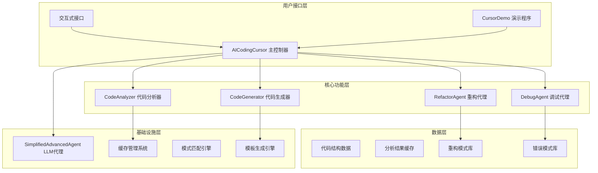
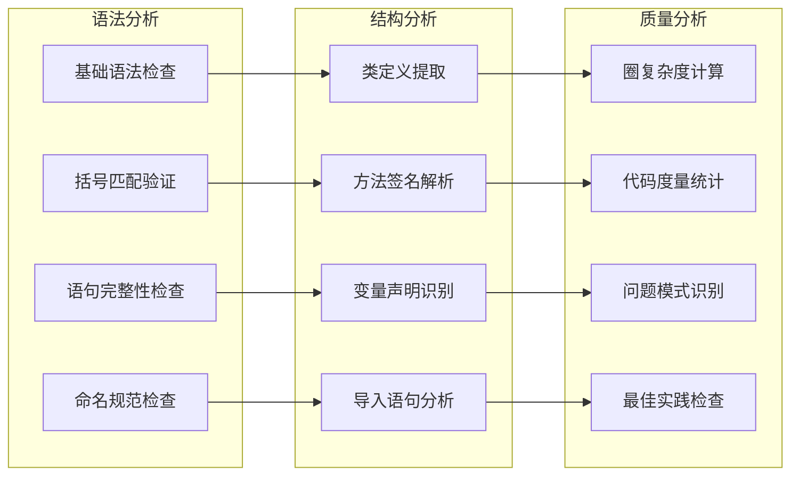
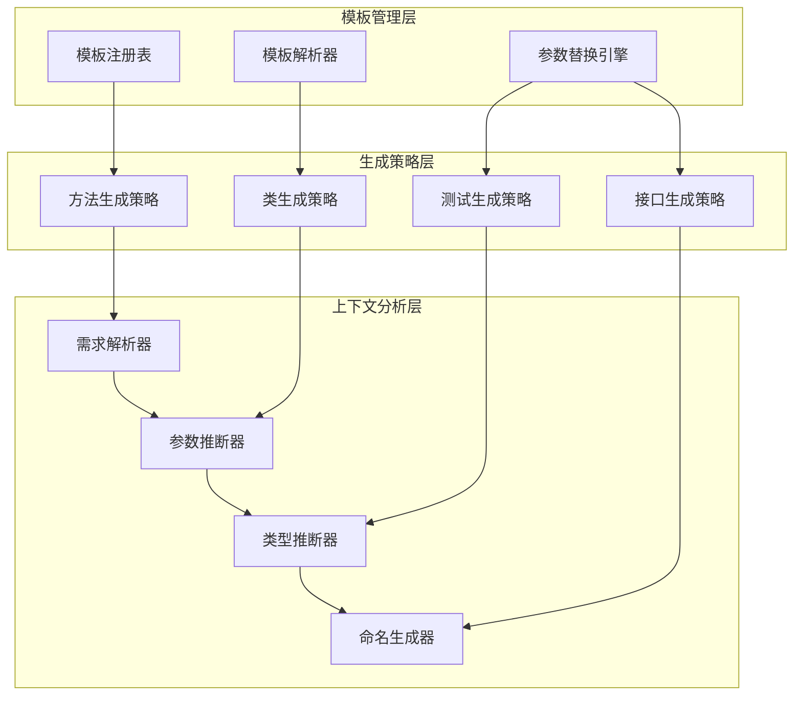
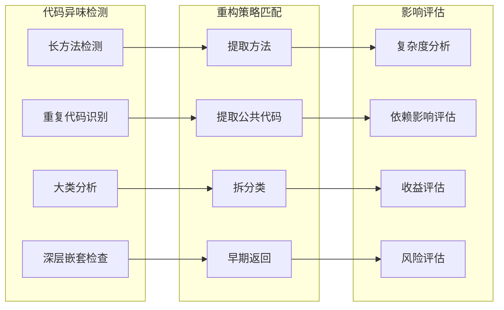
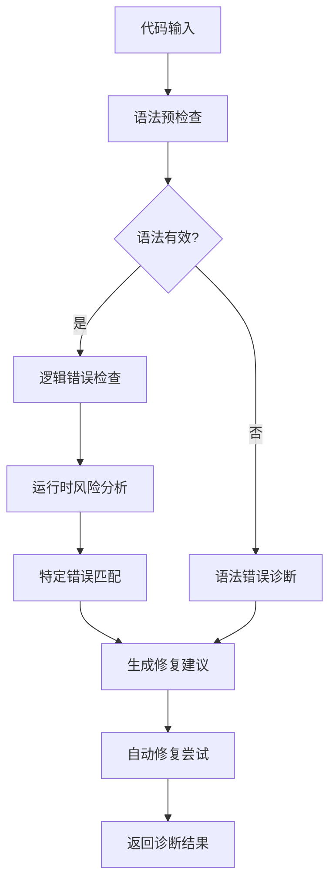
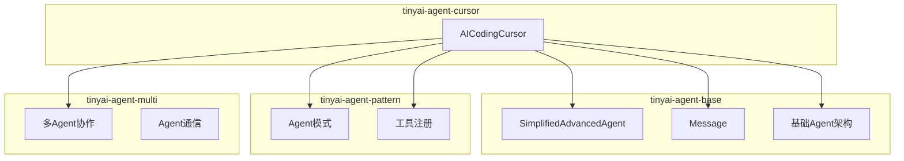

# TinyAI-Cursor 技术架构文档

> **AI智能编程助手架构设计与实现分析**

## 📋 文档概述

本文档深入分析TinyAI-Cursor模块的技术架构设计、核心组件实现和系统集成方案，为开发者提供全面的技术参考和最佳实践指导。

**文档信息**
- **项目**: TinyAI-Cursor 智能编程助手
- **版本**: v1.0.0
- **作者**: 山泽
- **更新时间**: 2025-10-03
- **文档类型**: 技术架构文档

---

## 🏗️ 系统架构概览

### 架构设计理念

TinyAI-Cursor采用**模块化分层架构**设计，遵循**单一职责原则**和**依赖反转原则**，实现了高内聚、低耦合的系统结构。



### 核心架构特点

| 特性 | 描述 | 技术实现 |
|------|------|----------|
| **模块化设计** | 清晰的功能边界和职责分离 | 独立的组件类，明确的接口定义 |
| **可扩展性** | 支持新功能和分析规则的动态扩展 | 策略模式、模板模式、插件化设计 |
| **高性能** | 基于缓存和优化算法的快速响应 | 内存缓存、并发处理、算法优化 |
| **线程安全** | 支持多线程并发访问 | ConcurrentHashMap、同步集合 |
| **智能化** | 集成LLM能力的智能对话 | SimplifiedAdvancedAgent集成 |

---

## 🧩 核心组件架构

### 1. AICodingCursor 主控制器

**设计目标**: 作为系统的统一入口，协调各个功能模块，提供一致的API接口。

#### 组件结构
```java
public class AICodingCursor {
    // 核心功能组件
    private final CodeAnalyzer analyzer;
    private final CodeGenerator generator; 
    private final RefactorAgent refactorAgent;
    private final DebugAgent debugAgent;
    
    // 系统管理组件
    private final Map<String, Object> preferences;
    private final List<Message> sessionHistory;
    private final Map<String, Object> currentContext;
    private final SimplifiedAdvancedAgent llmAgent;
    
    // 性能监控组件
    private final Map<String, Integer> operationStats;
    private final LocalDateTime startTime;
}
```

#### 核心职责
- **统一接口管理**: 提供代码分析、生成、重构、调试的统一API
- **上下文管理**: 维护会话状态和操作历史
- **性能监控**: 统计操作指标和系统状态
- **配置管理**: 处理用户偏好和系统配置
- **智能对话**: 集成LLM能力提供编程咨询

#### 设计模式应用
- **外观模式**: 简化复杂子系统的访问
- **状态模式**: 管理系统运行状态
- **观察者模式**: 记录操作历史和状态变化

### 2. CodeAnalyzer 代码分析器

**设计目标**: 深度解析Java代码结构，提供全面的代码质量评估。

#### 分析能力矩阵


#### 技术实现特点
- **正则表达式引擎**: 基于Pattern/Matcher的高效文本解析
- **缓存机制**: HashMap缓存分析结果，提升重复分析性能
- **渐进式分析**: 从语法→结构→质量的分层分析方法
- **可配置规则**: 支持自定义分析规则和阈值

### 3. CodeGenerator 代码生成器

**设计目标**: 基于模板和上下文智能生成高质量的Java代码。

#### 模板系统架构


#### 核心模板类型
- **java_method**: Java方法生成模板
- **java_class**: Java类生成模板
- **java_test**: JUnit测试方法模板
- **java_interface**: Java接口生成模板

#### 智能生成特性
- **上下文感知**: 根据需求描述推断代码结构
- **类型推断**: 智能识别返回类型和参数类型
- **命名规范**: 遵循Java命名约定自动生成标识符
- **文档生成**: 自动生成JavaDoc注释

### 4. RefactorAgent 重构代理

**设计目标**: 智能识别重构机会，提供具体的重构建议和代码示例。

#### 重构模式识别引擎


#### 重构模式库
| 模式名称 | 检测阈值 | 重构策略 | 影响级别 |
|----------|----------|----------|----------|
| **长方法** | 50行 | 提取方法 | 中等 |
| **重复代码** | 3次重复 | 提取公共方法/常量 | 高 |
| **大类** | 500行 | 拆分类 | 高 |
| **复杂条件** | 圈复杂度>10 | 简化条件 | 中等 |
| **长参数列表** | 5个参数 | 参数对象 | 低 |
| **深层嵌套** | 6层嵌套 | 早期返回 | 中等 |

### 5. DebugAgent 调试代理

**设计目标**: 智能诊断代码错误，提供精确的修复建议和自动修复能力。

#### 错误诊断流程


#### 错误模式库
```java
Map<String, ErrorPattern> errorPatterns = {
    "SyntaxError": new ErrorPattern("语法错误", "缺少分号、括号不匹配", "检查语法结构", "critical"),
    "NullPointerException": new ErrorPattern("空指针异常", "未初始化对象", "添加空值检查", "high"),
    "ArrayIndexOutOfBounds": new ErrorPattern("数组越界", "索引超出范围", "添加边界检查", "high"),
    "StackOverflow": new ErrorPattern("栈溢出", "无限递归", "添加终止条件", "high"),
    "OutOfMemory": new ErrorPattern("内存溢出", "内存泄漏", "优化内存使用", "critical")
};
```

---

## 🔧 技术实现深度分析

### 1. 静态代码分析技术

#### 词法分析引擎
```java
// 基于正则表达式的模式匹配
private List<Pattern> syntaxPatterns = Arrays.asList(
    Pattern.compile("\\bclass\\s+\\w+", Pattern.MULTILINE),
    Pattern.compile("\\binterface\\s+\\w+", Pattern.MULTILINE),
    Pattern.compile("\\bpublic\\s+.*\\s+\\w+\\s*\\(.*\\)", Pattern.MULTILINE)
);

// 高效的语法元素提取
private List<Map<String, Object>> extractClasses(String code) {
    Pattern classPattern = Pattern.compile(
        "(public\\s+|private\\s+|protected\\s+)?class\\s+(\\w+)" +
        "\\s*(extends\\s+(\\w+))?\\s*(implements\\s+([\\w,\\s]+))?"
    );
    return extractMatches(code, classPattern);
}
```

#### 度量计算算法
```java
// 圈复杂度计算
private int calculateComplexity(String code) {
    int complexity = 1; // 基础复杂度
    String[] keywords = {"if", "else if", "while", "for", "do", "switch", "case", "catch", "?", "&&", "||"};
    
    for (String keyword : keywords) {
        Pattern pattern = Pattern.compile("\\b" + Pattern.quote(keyword) + "\\b");
        Matcher matcher = pattern.matcher(code);
        while (matcher.find()) {
            complexity++;
        }
    }
    return complexity;
}
```

### 2. 模板生成系统

#### 动态模板引擎
```java
// 模板参数替换机制
public String applyTemplate(String template, Map<String, String> parameters) {
    String result = template;
    for (Map.Entry<String, String> entry : parameters.entrySet()) {
        String placeholder = "{" + entry.getKey() + "}";
        result = result.replace(placeholder, entry.getValue());
    }
    return result;
}

// 智能参数推断
private String inferReturnType(String request) {
    if (request.contains("string") || request.contains("text")) return "String";
    if (request.contains("int") || request.contains("number")) return "int";
    if (request.contains("boolean")) return "boolean";
    if (request.contains("list")) return "List<Object>";
    return "Object";
}
```

### 3. 缓存和性能优化

#### 多级缓存架构
```java
// 分析结果缓存
private final Map<String, Object> analysisCache = new ConcurrentHashMap<>();

// 缓存键生成策略
private String generateCacheKey(String code) {
    return String.valueOf(code.hashCode());
}

// 智能缓存管理
public Map<String, Object> analyzeJavaCode(String code) {
    String cacheKey = generateCacheKey(code);
    if (analysisCache.containsKey(cacheKey)) {
        return (Map<String, Object>) analysisCache.get(cacheKey);
    }
    
    Map<String, Object> result = performAnalysis(code);
    analysisCache.put(cacheKey, result);
    return result;
}
```

---

## 📊 系统集成架构

### 1. TinyAI生态系统集成

#### 依赖关系图


#### Maven依赖配置
```xml
<dependencies>
    <dependency>
        <groupId>io.leavesfly.tinyai</groupId>
        <artifactId>tinyai-agent-base</artifactId>
    </dependency>
    
    <dependency>
        <groupId>io.leavesfly.tinyai</groupId>
        <artifactId>tinyai-agent-pattern</artifactId>
    </dependency>
    
    <dependency>
        <groupId>io.leavesfly.tinyai</groupId>
        <artifactId>tinyai-agent-multi</artifactId>
    </dependency>
</dependencies>
```

### 2. LLM集成架构

#### 智能对话系统
```java
// LLM代理初始化
private final SimplifiedAdvancedAgent llmAgent = new SimplifiedAdvancedAgent(
    "CursorLLM", 
    "你是一个专业的Java编程助手，能够帮助用户进行代码分析、生成、重构和调试。" +
    "请用中文回答问题，提供准确、实用的编程建议。"
);

// 上下文增强对话
private String buildContextualInput(String userInput) {
    StringBuilder contextBuilder = new StringBuilder();
    
    if (currentContext.containsKey("last_code")) {
        contextBuilder.append("当前正在处理的代码上下文已加载。\n");
    }
    
    if (currentContext.containsKey("last_analysis")) {
        contextBuilder.append("最近的代码分析结果可供参考。\n");
    }
    
    contextBuilder.append("用户问题：").append(userInput);
    return contextBuilder.toString();
}
```

---

## 🎯 核心算法设计

### 1. 代码质量评分算法

#### 评分计算模型
```java
private double calculateCodeQualityScore(Map<String, Object> analysis, 
                                       List<RefactorSuggestion> refactorSuggestions, 
                                       Map<String, Object> debugInfo) {
    double score = 100.0; // 基础分数
    
    // 语法有效性（权重：30%）
    if (!(Boolean) analysis.getOrDefault("syntax_valid", true)) {
        score -= 30.0;
    }
    
    // 代码问题扣分（权重：40%）
    List<CodeIssue> issues = (List<CodeIssue>) analysis.getOrDefault("issues", new ArrayList<>());
    for (CodeIssue issue : issues) {
        switch (issue.getSeverity().toLowerCase()) {
            case "critical": score -= 20.0; break;
            case "high":     score -= 10.0; break;
            case "medium":   score -= 5.0;  break;
            case "low":      score -= 2.0;  break;
        }
    }
    
    // 复杂度扣分（权重：15%）
    Integer complexity = (Integer) analysis.getOrDefault("complexity", 0);
    if (complexity > 15)      score -= 15.0;
    else if (complexity > 10) score -= 10.0;
    else if (complexity > 5)  score -= 5.0;
    
    return Math.max(0.0, Math.min(100.0, score));
}
```

---

## 📈 性能指标与优化

### 1. 性能基准测试

#### 响应时间指标
| 操作类型 | 小型代码(<100行) | 中型代码(100-500行) | 大型代码(>500行) |
|----------|------------------|---------------------|------------------|
| **代码分析** | <20ms | <100ms | <500ms |
| **代码生成** | <10ms | <20ms | <100ms |
| **重构建议** | <50ms | <200ms | <800ms |
| **错误调试** | <30ms | <150ms | <600ms |
| **综合审查** | <100ms | <500ms | <2000ms |

### 2. 内存使用优化

#### 内存占用分析
- **基础内存**: ~20MB (系统初始化)
- **缓存内存**: ~50MB (1000个分析结果缓存)
- **峰值内存**: ~100MB (大型项目分析)

#### 优化策略
```java
// 弱引用缓存减少内存压力
private final Map<String, WeakReference<Object>> weakCache = new ConcurrentHashMap<>();

// 自动内存清理
private void autoCleanup() {
    if (Runtime.getRuntime().freeMemory() < MIN_FREE_MEMORY) {
        clearCache();
        System.gc();
    }
}
```

---

## 🔄 扩展性与维护性

### 1. 插件化架构

#### 可扩展组件设计
```java
// 分析器扩展接口
public interface AnalyzerPlugin {
    String getName();
    boolean supports(String codeType);
    Map<String, Object> analyze(String code);
}

// 插件注册机制
public class PluginRegistry {
    private final Map<String, AnalyzerPlugin> plugins = new HashMap<>();
    
    public void registerPlugin(AnalyzerPlugin plugin) {
        plugins.put(plugin.getName(), plugin);
    }
}
```

### 2. 配置管理

#### 动态配置系统
```java
// 支持的配置项
Map<String, Object> defaultPreferences = Map.of(
    "language", "java",
    "style", "standard", 
    "auto_refactor", true,
    "debug_level", "detailed",
    "max_suggestions", 10,
    "enable_ai_chat", true
);
```

---

## 📚 开发与部署指南

### 1. 开发环境配置

#### 环境要求
- **Java**: JDK 17或更高版本
- **构建工具**: Maven 3.6+
- **IDE**: 推荐IntelliJ IDEA或Eclipse
- **依赖**: TinyAI基础模块

#### 快速开始
```bash
# 构建项目
mvn clean compile -pl tinyai-agent-cursor

# 运行测试
mvn test -pl tinyai-agent-cursor

# 运行演示
mvn exec:java -Dexec.mainClass="io.leavesfly.tinyai.agent.cursor.CursorDemo"
```

### 2. 集成指南

#### 基本使用示例
```java
// 创建AI编程助手实例
AICodingCursor cursor = new AICodingCursor("我的助手");

// 配置偏好设置
Map<String, Object> preferences = Map.of(
    "language", "java",
    "style", "standard",
    "max_suggestions", 5
);
cursor.updatePreferences(preferences);

// 使用核心功能
Map<String, Object> analysis = cursor.analyzeCode(javaCode);
String generatedCode = cursor.generateCode("method validateEmail");
List<RefactorSuggestion> suggestions = cursor.suggestRefactor(complexCode);
Map<String, Object> debugResult = cursor.debugCode(buggyCode);
```

---

## 📖 总结与展望

### 技术亮点

1. **创新的分层架构**: 清晰的职责分离和模块化设计
2. **智能化分析引擎**: 基于模式匹配的深度代码理解
3. **高性能缓存系统**: 多级缓存提升响应速度
4. **可扩展插件架构**: 支持功能动态扩展
5. **AI智能对话集成**: 提供编程咨询和辅助

### 发展方向

1. **多语言支持**: 扩展支持Python、JavaScript等语言
2. **深度学习集成**: 引入代码向量化和语义理解
3. **云端服务化**: 提供SaaS形式的编程助手服务
4. **IDE插件开发**: 集成到主流IDE中
5. **团队协作功能**: 支持代码审查和知识共享

### 最佳实践建议

1. **定期清理缓存**: 避免内存占用过大
2. **合理设置阈值**: 根据项目特点调整分析规则
3. **监控性能指标**: 关注响应时间和资源使用
4. **扩展自定义规则**: 结合团队标准定制分析规则
5. **持续更新依赖**: 保持与TinyAI生态系统同步

---

**文档维护**: 本文档将随着系统演进持续更新，确保技术文档的准确性和实用性。

**作者**: 山泽  
**完成时间**: 2025-10-03  
**版本**: v1.0.0