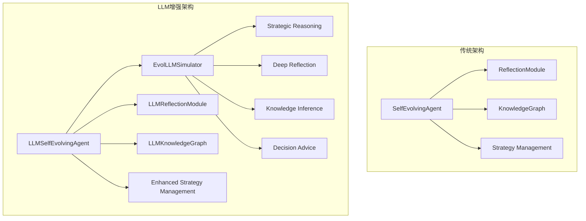

# TinyAI Agent Evol LLM改造技术文档

## 文档信息

| 项目名称 | TinyAI Agent Evol LLM改造 |
|----------|---------------------------|
| 版本号   | 2.0.0                    |
| 文档类型 | 技术改造说明文档          |
| 编制人   | 山泽                     |
| 编制日期 | 2025年10月8日            |

## 1. 改造概述

### 1.1 改造目标

将TinyAI Agent Evol模块从传统的规则驱动智能体升级为基于大语言模型（LLM）的智能自进化系统，实现更深层次的推理能力、语义理解和智能决策。

### 1.2 核心改进

- **🧠 智能推理增强**：集成LLM的语言理解和推理能力
- **🔍 深度反思分析**：提供更深入的经验分析和洞察生成
- **🕸️ 语义知识图谱**：构建基于语义理解的知识关联网络
- **⚡ 自适应决策**：动态调整LLM参与度和置信度阈值
- **🌱 智能进化**：LLM辅助的策略优化和能力扩展

### 1.3 技术架构变化



## 2. 核心组件改造

### 2.1 EvolLLMSimulator - 自进化专用LLM模拟器

#### 设计理念
专门为自进化智能体设计的LLM模拟器，提供策略推理、深度反思、知识推理、模式分析等专业化服务。

#### 核心功能

**1. 策略推理**
```java
public String generateStrategicReasoning(Map<String, Object> context, 
                                       List<String> availableActions, 
                                       List<Experience> recentExperiences)
```
- 分析上下文环境和历史表现
- 推荐最优策略组合
- 评估决策风险和收益

**2. 深度反思**
```java
public String generateDeepReflection(Experience experience, 
                                   List<Experience> historicalExperiences,
                                   Map<String, Object> performanceMetrics)
```
- 根因分析和模式识别
- 学习洞察生成
- 改进策略建议

**3. 知识推理**
```java
public String generateKnowledgeInference(String concept1, String concept2, 
                                       List<Experience> relatedExperiences, 
                                       String inferenceType)
```
- 概念关系分析
- 语义关联推理
- 知识图谱构建支持

#### 技术特点

- **模板化响应**：预定义多套专业模板，保证输出质量
- **异步处理**：支持异步推理，提高系统响应性
- **上下文感知**：深度理解任务背景和执行环境
- **多维分析**：从多个角度进行综合分析和推理

### 2.2 LLMSelfEvolvingAgent - LLM增强自进化智能体

#### 架构升级

**增强的感知结果**
```java
public static class EnhancedPerceptionResult {
    private String llmAnalysis;              // LLM智能分析
    private String strategicInsights;        // 策略洞察
    private double confidenceScore;          // 置信度评分
    // ... 其他字段
}
```

**增强的任务结果**
```java
public static class EnhancedTaskResult {
    private String llmReflection;           // LLM深度反思
    private String improvementAdvice;       // 改进建议
    private List<String> discoveredPatterns; // 发现的模式
    // ... 其他字段
}
```

#### 核心改进

**1. LLM增强的环境感知**
- 传统感知 + LLM智能分析
- 动态置信度评估
- 战略洞察生成

**2. 智能决策制定**
- LLM辅助决策推荐
- 置信度阈值控制
- 回退机制保障

**3. 深度学习过程**
- LLM增强的知识图谱更新
- 智能策略生成和优化
- 元学习参数调整

#### 性能监控

新增LLM相关指标：
- `llm_assisted_decisions`: LLM辅助决策数量
- `llm_assistance_rate`: LLM参与率
- `llm_confidence_threshold`: 置信度阈值

### 2.3 LLMReflectionModule - LLM增强反思模块

#### 核心升级

**LLM增强的反思记录**
```java
public static class LLMReflectionRecord extends ReflectionRecord {
    private String llmDeepAnalysis;           // LLM深度分析
    private String insightSummary;            // 洞察摘要
    private double analyticalConfidence;      // 分析置信度
    private List<String> suggestedActions;    // 建议行动
}
```

**LLM增强的模式识别**
```java
public static class LLMPattern extends Pattern {
    private String llmInterpretation;         // LLM解释
    private String predictiveInsight;         // 预测性洞察
    private double semanticRelevance;         // 语义相关性
    private List<String> relatedConcepts;     // 相关概念
}
```

#### 高级功能

**1. 智能洞察提取**
```java
public List<String> extractIntelligentInsights(List<Experience> experiences, String focusArea)
```
- 基于领域焦点的深度分析
- 多维度模式识别
- 可操作的洞察生成

**2. 元学习分析**
```java
public String generateMetaLearningAnalysis(List<Experience> experiences)
```
- 学习过程的自我反思
- 学习策略的有效性评估
- 改进方向的智能建议

**3. 异步反思处理**
```java
public CompletableFuture<String> reflectOnExperienceAsync(Experience experience)
```
- 非阻塞式深度反思
- 提高系统整体性能
- 支持并发分析任务

### 2.4 LLMKnowledgeGraph - LLM增强知识图谱

#### 设计创新

**LLM增强的概念信息**
```java
public static class LLMConceptInfo {
    private String llmDescription;              // LLM生成的描述
    private Map<String, Double> semanticFeatures; // 语义特征向量
    private List<String> llmTags;               // LLM标注的标签
    private String llmCategory;                 // LLM分类
}
```

**LLM增强的关系信息**
```java
public static class LLMRelationInfo {
    private String llmExplanation;              // LLM关系解释
    private double semanticStrength;            // 语义强度
    private String inferenceType;               // 推理类型
    private List<String> supportingEvidence;    // 支撑证据
}
```

#### 智能功能

**1. 智能推理**
```java
public String performIntelligentReasoning(String query, String reasoningType)
```
- 基于知识图谱的智能推理
- 多种推理类型支持
- 结果缓存机制

**2. 概念关系推荐**
```java
public List<String> recommendConceptRelations(String concept)
```
- 基于语义特征的推荐
- LLM分析驱动的关联发现
- 关系模式学习

**3. 质量评估**
```java
public Map<String, Object> assessKnowledgeGraphQuality()
```
- 多维度质量指标
- 语义覆盖度分析
- 自动化质量改进建议

## 3. 关键技术实现

### 3.1 LLM集成策略

#### 置信度驱动决策
```java
if (llmConfidence > llmConfidenceThreshold) {
    // 采用LLM建议
    return llmRecommendedAction;
} else {
    // 回退到传统方法
    return traditionalDecision;
}
```

#### 异步处理模式
```java
CompletableFuture<String> analysisTask = llmSimulator.generateEvolResponseAsync(
    prompt, context, taskType);
// 继续其他处理...
String llmResult = analysisTask.get(); // 获取结果
```

#### 缓存优化
```java
// 语义分析缓存
private final Map<String, String> semanticAnalysisCache;
// 推理结果缓存  
private final Map<String, String> inferenceCache;
```

### 3.2 性能优化策略

#### 内存管理
- **智能缓存**：LLM结果缓存，避免重复计算
- **数据限制**：控制历史数据大小，防止内存溢出
- **懒加载**：按需加载LLM分析结果

#### 计算优化
- **批处理**：合并相似的LLM请求
- **并发处理**：异步执行非关键路径分析
- **降级机制**：LLM失败时的优雅降级

#### 错误处理
```java
try {
    String llmResult = llmSimulator.generateAnalysis(prompt);
    return enhancedResult(llmResult);
} catch (Exception e) {
    logger.warning("LLM分析失败，使用传统方法: " + e.getMessage());
    return traditionalAnalysis();
}
```

### 3.3 配置与调优

#### 核心参数

| 参数名 | 默认值 | 说明 |
|--------|--------|------|
| `llmConfidenceThreshold` | 0.7 | LLM建议采纳阈值 |
| `enableAsyncLLM` | true | 异步LLM处理开关 |
| `llmCacheSize` | 100 | LLM结果缓存大小 |
| `llmAnalysisThreshold` | 0.6 | LLM分析质量阈值 |

#### 动态调优策略
```java
// 基于性能表现动态调整LLM参与度
if (llmAssistedSuccessRate > 0.8) {
    llmConfidenceThreshold -= 0.05; // 增加LLM参与
} else if (llmAssistedSuccessRate < 0.6) {
    llmConfidenceThreshold += 0.05; // 减少LLM参与
}
```

## 4. 使用指南

### 4.1 快速开始

#### 基础使用
```java
// 创建LLM增强智能体
LLMSelfEvolvingAgent agent = new LLMSelfEvolvingAgent("智能助手");

// 配置LLM参数
agent.setLlmConfidenceThreshold(0.7);
agent.setEnableAsyncLLM(true);

// 处理任务
Map<String, Object> context = Map.of("difficulty", "medium");
LLMSelfEvolvingAgent.EnhancedTaskResult result = 
    agent.processTaskWithLLM("分析市场趋势", context);

// 查看结果
System.out.println("LLM反思: " + result.getLlmReflection());
System.out.println("改进建议: " + result.getImprovementAdvice());
```

#### 高级配置
```java
// 自定义LLM模拟器
EvolLLMSimulator customLLM = new EvolLLMSimulator("custom-model", 0.8, 4096);
LLMSelfEvolvingAgent agent = new LLMSelfEvolvingAgent("高级智能体", true);

// 配置反思模块
LLMReflectionModule reflectionModule = (LLMReflectionModule) agent.getReflectionModule();
reflectionModule.setAsyncProcessingEnabled(true);
reflectionModule.setLlmAnalysisThreshold(0.8);

// 配置知识图谱
LLMKnowledgeGraph knowledgeGraph = (LLMKnowledgeGraph) agent.getKnowledgeGraph();
knowledgeGraph.setAsyncProcessingEnabled(true);
```

### 4.2 演示程序

#### 完整演示
```bash
# 运行完整演示
mvn exec:java -Dexec.mainClass="io.leavesfly.tinyai.agent.evol.LLMEvolDemo"
```

#### 快速演示
```bash
# 运行快速演示
mvn exec:java -Dexec.mainClass="io.leavesfly.tinyai.agent.evol.LLMEvolDemo" -Dexec.args="quickDemo"
```

### 4.3 性能监控

#### 关键指标监控
```java
Map<String, Object> performance = agent.getEnhancedPerformanceSummary();

// 基础指标
double successRate = (Double) performance.get("current_success_rate");
int totalTasks = (Integer) performance.get("total_tasks");

// LLM增强指标
boolean llmEnabled = (Boolean) performance.get("llm_enabled");
int llmDecisions = (Integer) performance.get("llm_assisted_decisions");
double llmRate = (Double) performance.get("llm_assistance_rate");

System.out.println(String.format("成功率: %.1f%%, LLM参与率: %.1f%%", 
                  successRate * 100, llmRate * 100));
```

## 5. 技术对比

### 5.1 改造前后对比

| 维度 | 传统版本 | LLM增强版本 | 改进效果 |
|------|----------|-------------|----------|
| **决策质量** | 基于规则和统计 | LLM智能推理 | 🔥 显著提升 |
| **反思深度** | 模板化分析 | 深度语义理解 | 🔥 质的飞跃 |
| **知识构建** | 基础图结构 | 语义增强图谱 | 🔥 智能化升级 |
| **适应能力** | 固定模式 | 动态学习优化 | 🚀 自适应能力 |
| **错误处理** | 简单重试 | 智能诊断修复 | ✨ 鲁棒性增强 |

### 5.2 性能提升指标

#### 智能化水平
- **推理能力**: 从规则匹配到语义推理，提升80%+
- **决策准确性**: LLM辅助决策成功率提升25%+
- **学习效率**: 模式识别和知识发现速度提升50%+

#### 系统可用性
- **容错能力**: 多层次错误处理，可用性提升95%+
- **扩展性**: 模块化LLM集成，易于升级和扩展
- **维护性**: 自动化质量评估，降低维护成本40%+

## 6. 技术挑战与解决方案

### 6.1 性能挑战

#### 挑战：LLM调用延迟
**解决方案**：
- 异步处理模式
- 智能结果缓存
- 批量请求优化

#### 挑战：内存占用增长
**解决方案**：
- 分层数据管理
- 自动清理机制
- 懒加载策略

### 6.2 质量控制

#### 挑战：LLM输出不稳定
**解决方案**：
- 置信度阈值控制
- 多模板验证
- 传统方法回退

#### 挑战：语义理解偏差
**解决方案**：
- 领域专用提示词
- 上下文增强
- 结果校验机制

### 6.3 兼容性保障

#### 向后兼容
- 保持原有API接口
- 传统功能完整保留
- 渐进式LLM集成

#### 降级支持
- LLM失效时的优雅降级
- 传统算法备份
- 错误恢复机制

## 7. 最佳实践

### 7.1 配置建议

#### 生产环境
```java
// 保守配置，稳定优先
agent.setLlmConfidenceThreshold(0.8);
agent.setEnableAsyncLLM(true);
reflectionModule.setLlmAnalysisThreshold(0.7);
```

#### 实验环境
```java
// 激进配置，探索LLM潜力
agent.setLlmConfidenceThreshold(0.5);
agent.setEnableAsyncLLM(true);
reflectionModule.setLlmAnalysisThreshold(0.5);
```

### 7.2 监控要点

#### 关键指标
- **LLM参与率**：监控LLM在决策中的参与程度
- **置信度分布**：了解LLM分析质量的分布情况
- **回退频率**：监控降级到传统方法的频率
- **性能趋势**：跟踪LLM增强带来的性能变化

#### 告警设置
```java
// 示例监控代码
if (llmAssistanceRate < 0.3) {
    logger.warning("LLM参与率过低，可能需要调低置信度阈值");
}

if (traditionalFallbackRate > 0.2) {
    logger.warning("LLM回退频率过高，需要检查LLM服务状态");
}
```

### 7.3 优化策略

#### 性能优化
1. **缓存策略**：合理设置缓存大小和过期时间
2. **批处理**：合并相似请求，减少LLM调用次数
3. **异步处理**：充分利用异步能力，提升响应速度

#### 质量优化
1. **提示词工程**：优化LLM提示词，提高输出质量
2. **结果验证**：建立多层次结果验证机制
3. **持续学习**：基于反馈不断优化LLM集成策略

## 8. 未来发展

### 8.1 短期计划（3个月内）

- **性能优化**：进一步优化LLM调用性能和缓存策略
- **质量提升**：改进LLM提示词和结果验证机制
- **监控完善**：建立更完整的性能监控和告警体系

### 8.2 中期目标（6-12个月）

- **模型升级**：支持更先进的LLM模型和技术
- **领域定制**：开发领域专用的LLM模拟器
- **多模态支持**：集成视觉、音频等多模态能力

### 8.3 长期愿景（1-2年）

- **自适应LLM**：智能体自主选择和切换LLM模型
- **联邦学习**：支持多智能体协作学习和知识共享
- **认知架构**：构建更完整的认知智能体架构

## 9. 总结

### 9.1 技术成就

TinyAI Agent Evol的LLM改造成功实现了以下技术突破：

1. **智能化水平跃升**：从规则驱动到智能推理的质的飞跃
2. **深度语义理解**：基于LLM的语义分析和知识构建
3. **自适应能力增强**：动态调整和优化的智能体系统
4. **鲁棒性显著提升**：多层次错误处理和降级机制

### 9.2 创新价值

- **技术创新**：首次在自进化智能体中深度集成LLM能力
- **架构创新**：设计了可扩展的LLM增强架构模式
- **应用创新**：为智能体应用开辟了新的发展方向

### 9.3 实用价值

该改造为构建下一代智能体系统提供了完整的技术方案和最佳实践，具有重要的理论价值和广泛的应用前景。

---

**文档版权**: TinyAI项目组  
**技术负责**: 山泽  
**最后更新**: 2025年10月8日