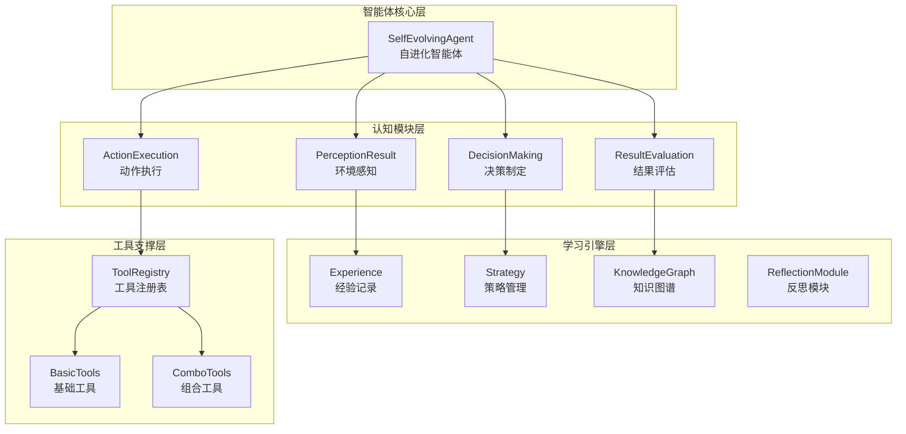
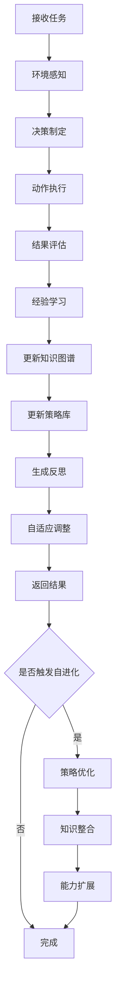
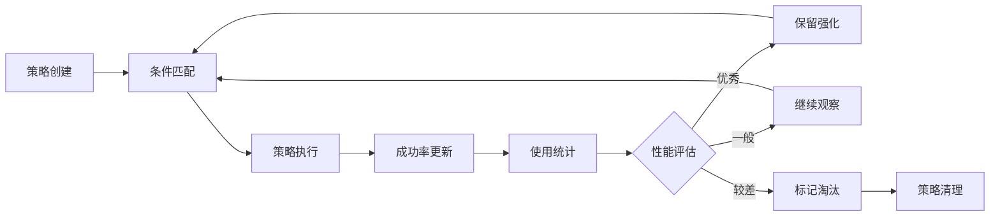
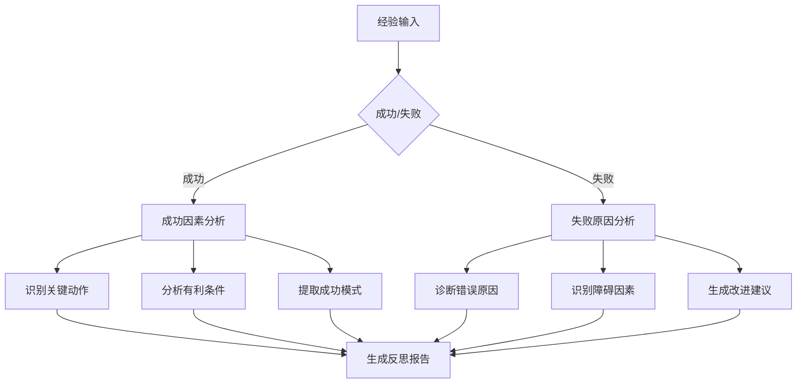
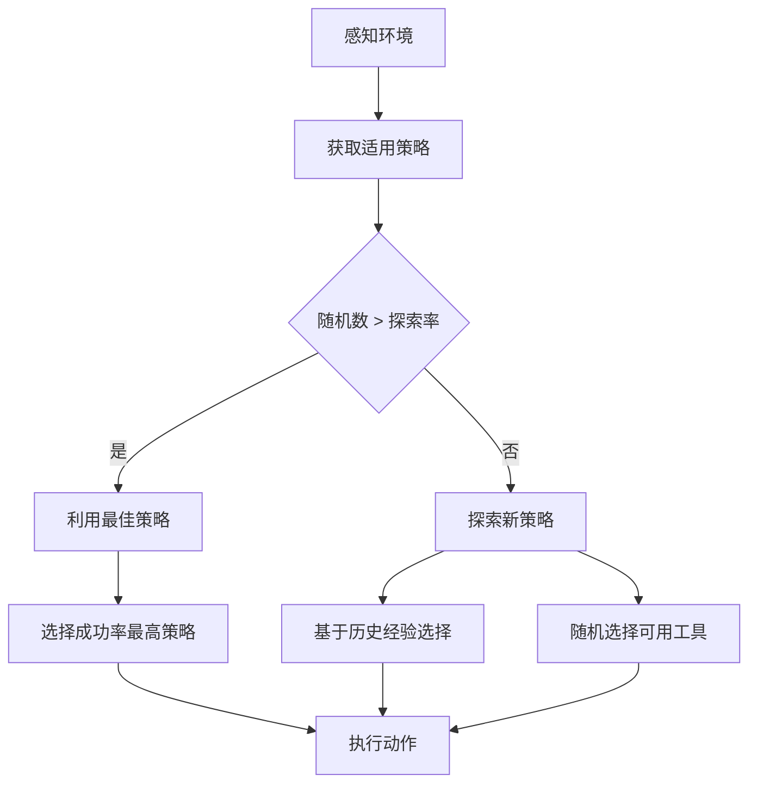

# TinyAI Agent Evol 技术架构文档

## 文档信息

| 项目名称 | TinyAI Agent Evol 自进化智能体系统 |
|----------|-----------------------------------|
| 版本号   | 1.0.0                            |
| 文档类型 | 技术架构文档                      |
| 编制人   | 山泽                             |
| 编制日期 | 2025年10月3日                    |

## 1. 项目概述

### 1.1 项目简介

TinyAI Agent Evol 是 TinyAI 框架中的革命性模块，实现了具备**自进化**、**自学习**和**自适应**能力的智能体系统。该模块采用纯Java实现，通过经验记忆、策略优化、反思改进和知识图谱构建等核心机制，让AI智能体具备真正的学习和成长能力。

### 1.2 核心特性

- **🧠 自学习能力**：完整的经验积累系统、策略进化机制、知识图谱构建
- **🔄 自适应能力**：探索-利用平衡、上下文感知决策、不确定性评估
- **🌱 自进化能力**：策略优化、知识整合、能力扩展、模式识别
- **🛠️ 内置工具库**：search、calculate、analyze、plan等基础工具及动态组合工具

### 1.3 技术栈

- **核心语言**: Java 17+
- **构建工具**: Maven 3.6+
- **测试框架**: JUnit 4
- **依赖模块**: tinyai-agent-base
- **设计模式**: 组合模式、策略模式、观察者模式

## 2. 系统架构

### 2.1 整体架构图



### 2.2 包结构设计

```
io.leavesfly.tinyai.agent.evol/
├── 数据结构层
│   ├── Experience.java           # 经验记录数据结构
│   └── Strategy.java             # 策略记录数据结构
├── 核心引擎层
│   ├── SelfEvolvingAgent.java    # 自进化智能体主引擎
│   ├── KnowledgeGraph.java       # 知识图谱管理引擎
│   └── ReflectionModule.java     # 反思分析引擎
└── 演示应用层
    └── EvolDemo.java             # 功能演示程序
```

## 3. 核心组件设计

### 3.1 SelfEvolvingAgent - 自进化智能体

#### 3.1.1 组件职责

`SelfEvolvingAgent` 是整个系统的核心控制器，负责协调各个子模块完成自进化智能体的完整功能。

#### 3.1.2 核心数据结构

```java
public class SelfEvolvingAgent {
    // 核心组件
    private final String name;                               // 智能体名称
    private final List<Experience> experiences;             // 经验记录列表
    private final Map<String, Strategy> strategies;         // 策略库
    private final KnowledgeGraph knowledgeGraph;           // 知识图谱
    private final ReflectionModule reflectionModule;       // 反思模块
    
    // 学习参数
    private double learningRate;                            // 学习率
    private double explorationRate;                         // 探索率
    private int memorySize;                                 // 记忆库大小
    
    // 工具库
    private final Map<String, Function<Map<String, Object>, 
                     Map<String, Object>>> availableTools; // 可用工具
}
```

#### 3.1.3 工作流程设计



### 3.2 Experience - 经验记录系统

#### 3.2.1 数据结构设计

```java
public class Experience {
    private String task;                    // 任务描述
    private Map<String, Object> context;   // 上下文信息
    private String action;                  // 执行动作
    private Object result;                  // 执行结果
    private boolean success;                // 成功标志
    private double reward;                  // 奖励值
    private long timestamp;                 // 时间戳
    private String reflection;              // 反思内容
}
```

#### 3.2.2 核心特性

- **完整性记录**：记录任务执行的完整生命周期
- **结构化存储**：使用标准化的数据结构便于分析
- **序列化支持**：支持与Map格式的相互转换
- **时序信息**：保持时间顺序便于趋势分析

### 3.3 Strategy - 策略管理系统

#### 3.3.1 核心算法

**策略成功率更新算法（指数移动平均）**：
```java
newSuccessRate = (1 - learningRate) * oldSuccessRate + learningRate * currentResult
```

**上下文匹配算法**：
```java
public boolean matchesContext(Map<String, Object> context) {
    // 精确匹配 + 模糊推断
    for (Map.Entry<String, Object> condition : conditions.entrySet()) {
        if (!matchCondition(condition, context)) {
            return false;
        }
    }
    return true;
}
```

#### 3.3.2 策略生命周期



### 3.4 KnowledgeGraph - 知识图谱引擎

#### 3.4.1 图结构设计

知识图谱采用节点-边的图结构，支持概念间复杂关系的建模和推理。

```java
public class KnowledgeGraph {
    // 节点存储：概念名 -> 概念节点
    private final Map<String, ConceptNode> nodes;
    
    // 边存储：起始概念 -> 目标概念 -> 关系类型 -> 关系边
    private final Map<String, Map<String, Map<String, RelationEdge>>> edges;
}
```

#### 3.4.2 核心算法

**概念相似度计算（余弦相似度）**：
```java
similarity = dotProduct(vec1, vec2) / (norm(vec1) * norm(vec2))
```

**相关概念发现（广度优先搜索）**：
```java
public List<String> findRelatedConcepts(String concept, int maxDistance) {
    // BFS遍历图结构，发现指定距离内的相关概念
}
```

### 3.5 ReflectionModule - 反思分析引擎

#### 3.5.1 模式识别算法

**1. 成功模式识别**
```java
private List<Pattern> identifySuccessPatterns(List<Experience> experiences) {
    // 统计高成功率的动作模式
    // 识别有利的上下文条件
    // 发现有效的动作序列
}
```

**2. 失败模式识别**
```java
private List<Pattern> identifyFailurePatterns(List<Experience> experiences) {
    // 统计常见失败组合
    // 识别不利的环境因素
    // 分析失败的根本原因
}
```

#### 3.5.2 反思内容生成



## 4. 自进化机制设计

### 4.1 探索-利用平衡策略

#### 4.1.1 动态探索率调整

```java
private void adjustLearningParameters() {
    double avgSuccessRate = calculateRecentSuccessRate();
    
    if (avgSuccessRate < 0.6) {
        // 性能较差时增加探索
        explorationRate = Math.min(0.5, explorationRate + 0.05);
    } else if (avgSuccessRate > 0.8) {
        // 性能良好时减少探索，多利用已知策略
        explorationRate = Math.max(0.1, explorationRate - 0.02);
    }
}
```

#### 4.1.2 决策算法



### 4.2 策略优化机制

#### 4.2.1 策略清理算法

```java
private void optimizeStrategies() {
    // 移除长期低效的策略
    List<String> strategiesToRemove = strategies.entrySet().stream()
        .filter(entry -> {
            Strategy strategy = entry.getValue();
            return strategy.getUsageCount() > 10 && strategy.getSuccessRate() < 0.3;
        })
        .map(Map.Entry::getKey)
        .collect(Collectors.toList());
    
    strategiesToRemove.forEach(strategies::remove);
}
```

### 4.3 能力扩展机制

#### 4.3.1 工具组合发现

```java
private void expandCapabilities() {
    // 分析成功的动作序列
    Map<String, Integer> actionSequences = analyzeSuccessfulSequences();
    
    // 创建高频成功序列的组合工具
    actionSequences.entrySet().stream()
        .filter(entry -> entry.getValue() >= 3)  // 至少成功3次
        .forEach(entry -> {
            String[] actions = entry.getKey().split("->");
            String comboName = "combo_" + actions[0] + "_" + actions[1];
            availableTools.put(comboName, createComboTool(actions[0], actions[1]));
        });
}
```

## 5. 性能优化设计

### 5.1 内存管理策略

#### 5.1.1 经验库大小限制

```java
public void learnFromExperience(Experience experience) {
    experiences.add(experience);
    
    // 限制经验库大小，保持最新的1000条记录
    if (experiences.size() > memorySize) {
        experiences.remove(0);
    }
}
```

#### 5.1.2 知识图谱清理

```java
public void cleanupWeakRelations(double weightThreshold, long ageThreshold) {
    // 清理低权重和过期的关系边
    // 减少图结构复杂度
}
```

### 5.2 并发安全设计

#### 5.2.1 线程安全集合使用

```java
// 使用并发安全的数据结构
private final List<Experience> experiences = 
    Collections.synchronizedList(new ArrayList<>());
private final Map<String, Strategy> strategies = 
    new ConcurrentHashMap<>();
```

## 6. 测试架构

### 6.1 单元测试覆盖

| 测试类 | 覆盖组件 | 测试要点 |
|--------|----------|----------|
| `SelfEvolvingAgentTest` | 主要组件 | 初始化、任务处理、自进化 |
| 内置测试方法 | `Experience` | 数据结构、序列化 |
| 内置测试方法 | `Strategy` | 策略匹配、成功率更新 |
| 内置测试方法 | `KnowledgeGraph` | 概念管理、关系构建 |
| 内置测试方法 | `ReflectionModule` | 反思生成、模式识别 |

### 6.2 性能基准测试

| 性能指标 | 期望值 | 验证方法 |
|----------|--------|----------|
| 平均成功率 | >85% | 标准任务集测试 |
| 学习收敛速度 | <50次任务 | 性能趋势分析 |
| 策略数量增长 | 5-15个 | 策略库统计 |
| 知识概念构建 | >10个概念 | 知识图谱统计 |

## 7. 部署与运维

### 7.1 环境要求

- **Java版本**: JDK 17 或更高版本
- **内存要求**: 最小512MB，推荐1GB+
- **存储要求**: 基本运行50MB，包含数据100MB+

### 7.2 配置参数

| 参数名 | 默认值 | 说明 |
|--------|--------|------|
| `learningRate` | 0.1 | 学习率 |
| `explorationRate` | 0.2 | 探索率 |
| `memorySize` | 1000 | 经验库大小 |

### 7.3 监控指标

#### 7.3.1 性能监控

- 任务成功率趋势
- 学习速度和收敛性
- 内存使用情况
- 响应时间统计

#### 7.3.2 业务监控

- 策略库大小和质量
- 知识图谱节点和边的增长
- 工具使用频率统计
- 自进化触发频率

## 8. 未来演进方向

### 8.1 短期优化目标

#### 8.1.1 性能优化
- 实现增量式知识图谱更新
- 优化相似度计算算法
- 添加多级缓存机制

#### 8.1.2 功能增强
- 支持更多工具类型
- 增强反思模块的分析能力
- 实现策略的版本管理

### 8.2 中期发展目标

#### 8.2.1 算法升级
- 引入深度强化学习算法
- 实现神经网络策略学习
- 添加联邦学习支持

#### 8.2.2 系统集成
- 支持分布式部署
- 实现跨智能体知识共享
- 构建智能体协作机制

## 9. 总结

### 9.1 技术成就

TinyAI Agent Evol 成功实现了以下技术突破：

1. **完整的自进化框架**：涵盖感知、决策、执行、学习、进化的完整闭环
2. **轻量级Java实现**：最小化外部依赖，纯Java生态适配
3. **模块化架构设计**：清晰的职责分离，良好的可扩展性
4. **实时学习能力**：增量式学习，在线策略优化
5. **多维度模式识别**：成功模式、失败模式、时间趋势、上下文影响

### 9.2 设计优势

- **高内聚低耦合**：模块间职责清晰，接口简洁
- **可扩展性强**：支持工具库、学习算法、存储机制的灵活扩展
- **性能可控**：内存限制、计算优化、并发安全
- **实用性强**：完整的演示程序和测试用例

### 9.3 应用价值

该架构为构建自进化智能体系统提供了完整的技术框架和最佳实践，具有重要的理论价值和实用价值，为AI系统的智能化发展指明了方向。

---

**文档版权**: TinyAI项目组  
**技术支持**: 山泽  
**最后更新**: 2025年10月3日