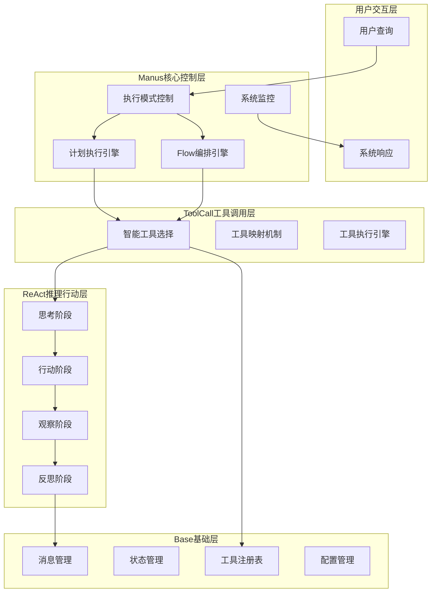
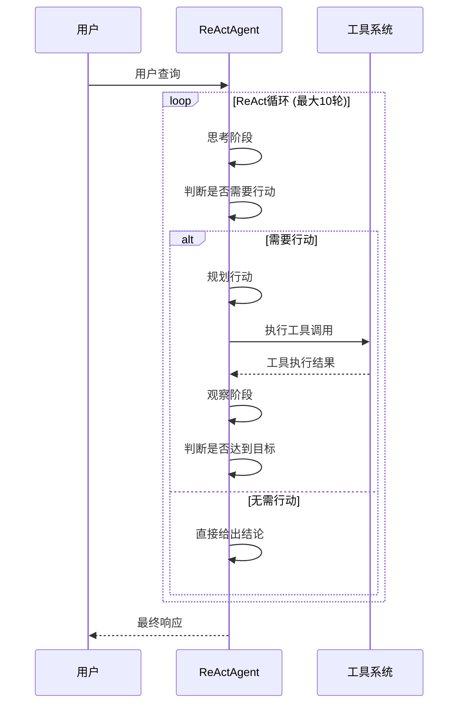
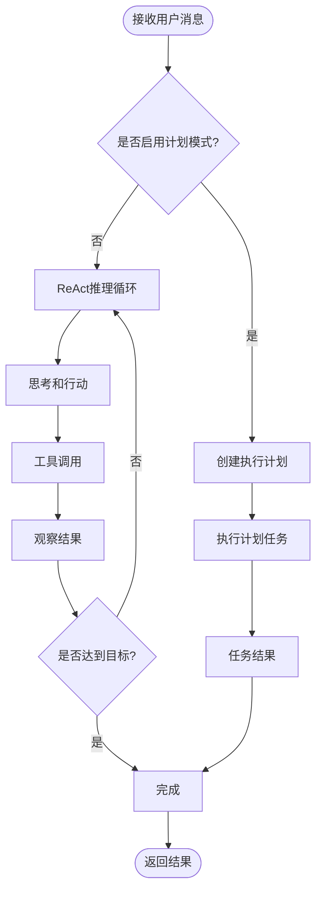
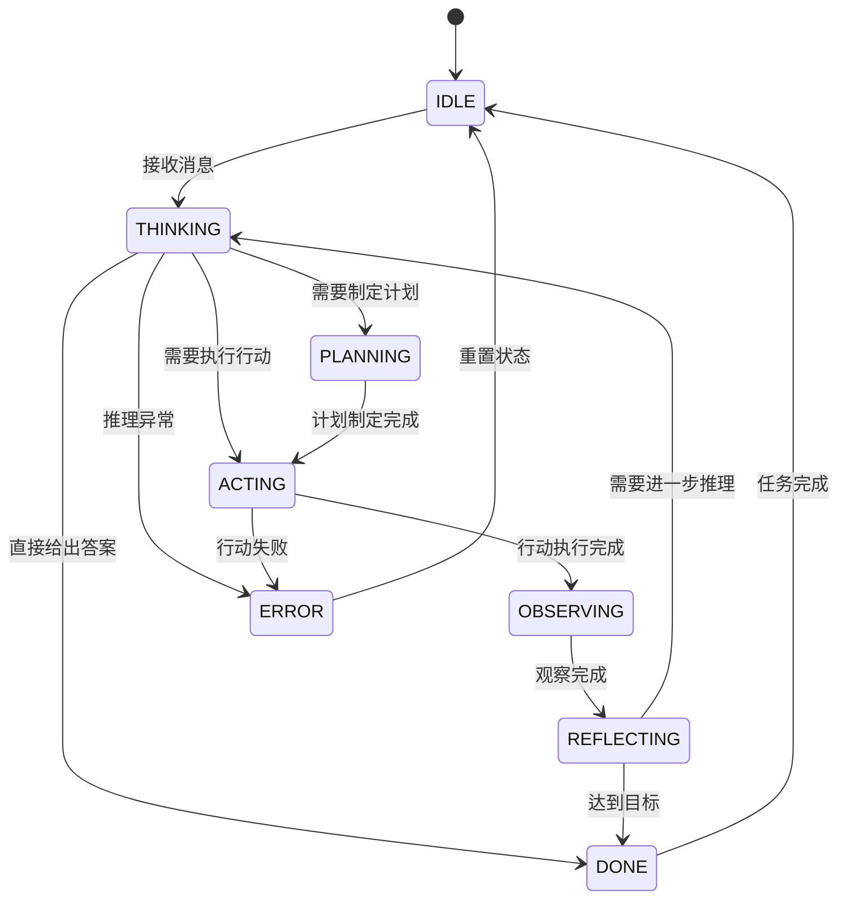
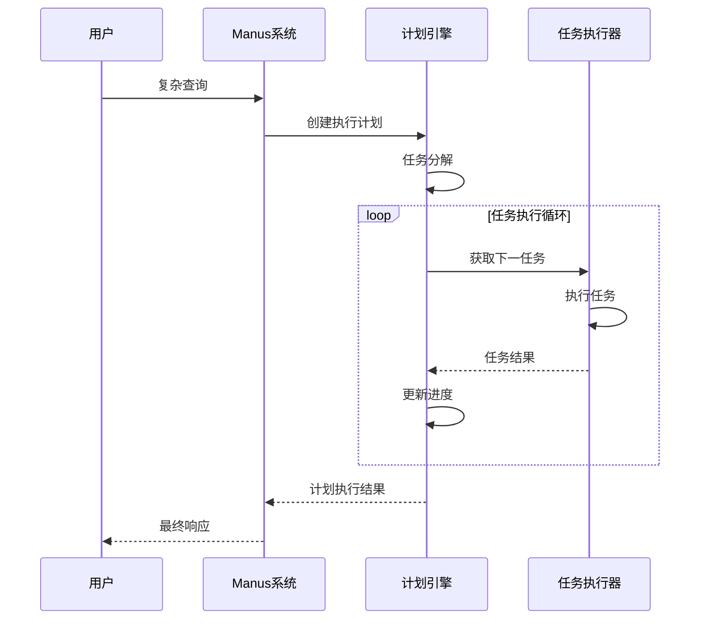

# TinyAI Manus手稿智能体技术架构文档

## 项目概述

TinyAI Manus手稿智能体是基于OpenManus项目的Java实现，是TinyAI框架中的高级智能体系统。该模块采用分层架构设计，实现了双执行机制、计划驱动任务分解和动态工具调用，为构建复杂的AI应用提供了坚实的基础架构。

### 核心特征

- **分层架构设计**: 四层清晰的架构层次，每层职责明确
- **双执行机制**: 支持直接Agent模式和Flow编排模式
- **计划驱动**: 复杂任务的自动分解和执行
- **智能推理**: ReAct（推理-行动）模式的智能推理能力
- **工具集成**: 动态工具调用和智能工具选择
- **状态管理**: 完整的状态跟踪和监控体系

## 技术架构

### 1. 整体架构设计



### 2. 分层架构详解

#### 2.1 BaseAgent（基础层）

**核心职责**: 提供Agent的基础功能和通用能力

**主要组件**:
- **状态管理**: 8种状态的完整生命周期管理（空闲、思考、行动、观察、反思、计划、完成、错误）
- **消息系统**: 消息历史记录和管理
- **工具注册表**: 内置工具注册和自定义工具扩展
- **配置管理**: Agent配置信息管理

**核心类结构**:
```java
public abstract class BaseAgent {
    protected String name;                          // Agent名称
    protected AgentState state;                     // 当前状态
    protected List<Message> messages;               // 消息历史
    protected List<ToolCall> toolCallHistory;       // 工具调用历史
    protected ToolRegistry toolRegistry;            // 工具注册表
    protected LocalDateTime createdAt;              // 创建时间
    protected LocalDateTime lastActiveAt;           // 最后活跃时间
    protected Map<String, Object> configuration;    // 配置信息
}
```

**内置工具**:
- `calculator`: 数学表达式计算工具
- `get_time`: 时间获取工具
- `text_analyzer`: 文本分析工具

#### 2.2 ReActAgent（推理行动层）

**核心职责**: 实现ReAct（推理-行动）循环机制

**推理循环流程**:


**核心特性**:
- **智能推理**: 基于上下文的思考逻辑
- **行动规划**: 自动选择合适的工具和行动
- **观察反馈**: 对行动结果的智能分析
- **迭代控制**: 最大迭代次数控制，避免无限循环

**配置参数**:
- `verboseMode`: 详细模式开关
- `maxIterations`: 最大迭代次数（默认10）

#### 2.3 ToolCallAgent（工具调用层）

**核心职责**: 增强工具选择和调用能力

**工具映射机制**:
```java
// 关键词到工具的智能映射
private void initializeToolMappings() {
    toolMappings.put("计算", "calculator");
    toolMappings.put("加", "calculator");
    toolMappings.put("减", "calculator");
    // ... 更多映射
}
```

**智能功能**:
- **自动工具推荐**: 基于查询内容推荐合适工具
- **工具链执行**: 支持多工具顺序执行
- **使用统计**: 工具使用频率和成功率统计
- **偏好设置**: 支持用户自定义工具偏好

#### 2.4 Manus（核心控制层）

**核心职责**: 系统的最高层控制和协调

**双执行机制**:

1. **直接Agent模式**:
   - 基础ReAct模式
   - 计划驱动模式

2. **Flow编排模式**:
   - 自动Flow选择
   - 工作流程执行

**核心组件**:

**执行模式控制**:
```java
public enum ExecutionMode {
    DIRECT_AGENT("直接Agent模式"),
    FLOW_ORCHESTRATION("Flow编排模式");
}
```

**Flow管理系统**:
```java
public class FlowDefinition {
    private String name;
    private String description;
    private Map<String, Object> nodes;
    private LocalDateTime createdAt;
}
```

### 3. 执行模式详解

#### 3.1 直接Agent模式

**执行流程**:


**特点**:
- 适合简单到中等复杂度的任务
- 支持计划驱动的复杂任务分解
- 灵活的推理和行动循环

#### 3.2 Flow编排模式

**Flow映射机制**:
```java
private void initializeFlowMappings() {
    flowMappings.put("计算", "calculation_flow");
    flowMappings.put("数学", "calculation_flow");
    flowMappings.put("时间", "time_flow");
    flowMappings.put("分析", "analysis_flow");
}
```

**预定义Flow**:
- `calculation_flow`: 数学计算专用流程
- `time_flow`: 时间查询专用流程
- `analysis_flow`: 文本分析专用流程

**特点**:
- 针对特定领域的优化流程
- 更高的执行效率
- 可扩展的Flow定义系统

### 4. 状态管理系统

#### 4.1 Agent状态枚举

```java
public enum AgentState {
    IDLE("空闲"),        // 初始状态
    THINKING("思考"),    // 分析问题状态
    ACTING("行动"),      // 执行操作状态
    OBSERVING("观察"),   // 观察结果状态
    REFLECTING("反思"),  // 反思评估状态
    PLANNING("计划"),    // 制定计划状态
    DONE("完成"),        // 任务完成状态
    ERROR("错误");       // 错误状态
}
```

#### 4.2 状态转换图



### 5. 计划驱动系统

#### 5.1 任务管理

**Task类结构**:
```java
public class Task {
    private String id;                    // 任务ID
    private String title;                 // 任务标题
    private String description;           // 任务描述
    private TaskStatus status;            // 任务状态
    private Map<String, Object> parameters; // 任务参数
    private Object result;                // 执行结果
    private LocalDateTime startTime;      // 开始时间
    private LocalDateTime endTime;        // 结束时间
}
```

**任务状态**:
- `PENDING`: 待执行
- `IN_PROGRESS`: 执行中
- `COMPLETED`: 已完成
- `FAILED`: 执行失败

#### 5.2 计划管理

**Plan类结构**:
```java
public class Plan {
    private String title;                 // 计划标题
    private String goal;                  // 计划目标
    private List<Task> tasks;             // 任务列表
    private PlanStatus status;            // 计划状态
    private boolean parallelExecution;    // 是否并行执行
}
```

**计划执行流程**:


### 6. 监控和统计系统

#### 6.1 系统指标

**核心指标**:
- `totalProcessedMessages`: 处理的消息总数
- `totalExecutedPlans`: 执行的计划总数
- `totalFlowExecutions`: Flow执行总数
- `systemStartTime`: 系统启动时间
- `toolUsageStats`: 工具使用统计

#### 6.2 性能监控

**监控维度**:
- **响应时间**: 消息处理时间
- **成功率**: 任务执行成功率
- **资源使用**: 内存和CPU使用情况
- **工具效率**: 各工具的调用频率和成功率

### 7. 扩展机制

#### 7.1 自定义工具注册

```java
// 注册自定义工具
manus.registerCustomTool("custom_tool", args -> {
    // 自定义工具逻辑
    return "处理结果";
}, "自定义工具描述");
```

#### 7.2 自定义Flow定义

```java
// 创建自定义Flow
FlowDefinition customFlow = new FlowDefinition("自定义流程", "处理特定任务的流程");
customFlow.addNode("step1", "步骤1配置");
customFlow.addNode("step2", "步骤2配置");
manus.registerFlow("custom_flow", customFlow);
```

## 技术实现细节

### 1. 依赖管理

**内部依赖**:
- `tinyai-agent-base`: 基础Agent功能和工具注册表
- `tinyai-agent-pattern`: Agent模式相关实现
- `tinyai-agent-multi`: 多Agent协作功能

**设计原则**:
- 最大化复用已有模块实现
- 最小化第三方库依赖
- 保持模块间的低耦合

### 2. 并发和线程安全

**线程安全措施**:
- 使用`ConcurrentHashMap`存储Flow注册表
- 消息处理的原子性保证
- 状态更新的同步控制

**并发支持**:
- 计划中的任务支持并行执行
- 多个Agent实例可以并发运行
- 工具调用的并发控制

### 3. 错误处理机制

**错误分类**:
- **系统错误**: JVM级别的异常
- **逻辑错误**: 推理过程中的逻辑异常
- **工具错误**: 工具调用失败
- **超时错误**: 推理循环超时

**错误恢复**:
- 自动重试机制
- 状态回滚功能
- 优雅降级处理

### 4. 性能优化

**优化策略**:
- **缓存机制**: 工具调用结果缓存
- **惰性加载**: Flow定义的按需加载
- **内存管理**: 消息历史的定期清理
- **计算优化**: 表达式计算的优化算法

## 使用示例

### 1. 基础使用

```java
// 创建Manus实例
Manus manus = new Manus("MyManusAgent");

// 配置执行模式
manus.setExecutionMode(ExecutionMode.DIRECT_AGENT);
manus.setPlanningEnabled(false);

// 处理用户消息
Message userMessage = new Message("user", "计算 100 * 25 + 50");
Message response = manus.processMessage(userMessage);
System.out.println(response.getContent());
```

### 2. 计划驱动模式

```java
// 启用计划驱动模式
manus.setPlanningEnabled(true);

// 处理复杂任务
Message complexQuery = new Message("user", "分析用户数据并生成报告");
Message result = manus.processMessage(complexQuery);
```

### 3. Flow编排模式

```java
// 切换到Flow编排模式
manus.setExecutionMode(ExecutionMode.FLOW_ORCHESTRATION);

// 注册自定义Flow
FlowDefinition reportFlow = new FlowDefinition("报告生成流程", "数据分析和报告生成");
manus.registerFlow("report_flow", reportFlow);

// 处理消息
Message query = new Message("user", "生成销售数据分析报告");
Message response = manus.processMessage(query);
```

### 4. 系统监控

```java
// 获取系统状态
Map<String, Object> status = manus.getSystemStatus();
System.out.println("系统状态: " + status);

// 获取工具使用统计
Map<String, Integer> toolStats = manus.getToolUsageStatistics();
System.out.println("工具使用统计: " + toolStats);
```

## 测试和验证

### 1. 单元测试覆盖

**测试模块**:
- `ManusTest`: 核心功能测试
- `PlanTaskTest`: 计划任务测试

**测试用例**:
- 基础功能测试
- 执行模式切换测试
- 工具调用测试
- Flow执行测试
- 错误处理测试
- 性能基准测试

### 2. 集成测试

**测试场景**:
- 端到端的用户查询处理
- 复杂任务的计划驱动执行
- 多种工具的组合使用
- 异常情况的处理验证

### 3. 性能测试

**测试指标**:
- 响应时间
- 吞吐量
- 内存使用
- CPU使用率

## 部署和运维

### 1. 系统要求

- **Java版本**: Java 17+
- **内存**: 建议2GB+
- **存储**: 100MB+

### 2. 配置参数

**核心配置**:
```java
// 执行模式配置
manus.setExecutionMode(ExecutionMode.DIRECT_AGENT);

// 计划驱动配置
manus.setPlanningEnabled(true);

// ReAct配置
manus.setVerboseMode(true);
manus.setMaxIterations(15);
```

### 3. 监控建议

**关键指标监控**:
- 消息处理成功率
- 平均响应时间
- 工具调用成功率
- 系统资源使用率

**告警设置**:
- 响应时间超过阈值
- 错误率超过5%
- 内存使用超过80%

## 未来发展方向

### 1. 功能增强

- **多模态支持**: 图像、音频等多模态输入处理
- **知识图谱**: 集成知识图谱提升推理能力
- **强化学习**: 基于反馈的自我优化机制

### 2. 性能优化

- **分布式部署**: 支持集群部署和负载均衡
- **GPU加速**: 利用GPU加速复杂计算
- **流式处理**: 实时数据流处理能力

### 3. 生态扩展

- **工具生态**: 更丰富的工具库
- **Flow模板**: 预定义的业务流程模板
- **插件系统**: 第三方插件集成机制

## 总结

TinyAI Manus手稿智能体通过分层架构设计，实现了从基础消息处理到高级智能推理的完整能力栈。其双执行机制、计划驱动和Flow编排的设计，为不同复杂度的任务提供了灵活的解决方案。

该模块在保持与TinyAI生态系统一致性的同时，充分复用了已有模块的功能，最小化了外部依赖，体现了良好的工程实践。通过完善的测试覆盖和监控机制，确保了系统的稳定性和可维护性。

---

**文档版本**: 1.0.0  
**最后更新**: 2025-10-03  
**作者**: TinyAI团队