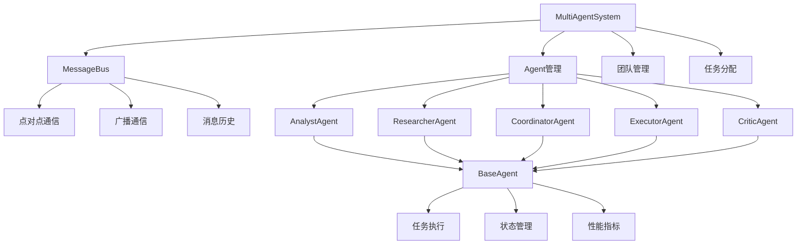

# TinyAI Agent Multi 多智能体系统

[](https://openjdk.org/projects/jdk/17/)
[](https://maven.apache.org/)
[](https://opensource.org/licenses/Apache-2.0)

## 🌟 项目简介

TinyAI Agent Multi 是 TinyAI 框架的核心模块之一，提供了一个完整的多智能体系统实现。该模块基于纯Java开发，实现了智能Agent间的协作、通信和任务分配功能，为构建复杂的AI应用提供了坚实的基础架构。

## 🚀 核心特性

### 🤖 多样化智能体类型
- **分析师Agent** (`AnalystAgent`) - 专注数据分析、趋势预测和报告生成
- **研究员Agent** (`ResearcherAgent`) - 负责文献调研、实验设计和理论分析
- **协调员Agent** (`CoordinatorAgent`) - 管理任务分配、进度跟踪和团队协调
- **执行员Agent** (`ExecutorAgent`) - 高效执行具体任务和操作自动化
- **评审员Agent** (`CriticAgent`) - 提供质量评估、代码审查和改进建议

### 🌐 先进的通信系统
- **消息总线** (`MessageBus`) - 支持点对点通信和广播机制
- **异步消息处理** - 基于CompletableFuture的高性能异步通信
- **消息历史管理** - 完整的对话历史记录和检索功能
- **优先级队列** - 支持消息优先级和智能调度

### 🏗️ 灵活的架构设计
- **模块化设计** - 可扩展的Agent基类和插件化架构
- **线程安全** - 完整的并发控制和线程安全保证
- **状态管理** - 全面的Agent状态跟踪和生命周期管理
- **指标监控** - 实时性能指标和系统状态监控

### 🎯 智能任务管理
- **任务分配** - 智能的任务分配和负载均衡
- **团队协作** - 支持多Agent团队协作模式
- **依赖管理** - 任务依赖关系和执行顺序控制
- **结果追踪** - 完整的任务执行结果和状态跟踪

## 📦 模块结构

```
tinyai-agent-multi/
├── src/main/java/io/leavesfly/tinyai/agent/multi/
│   ├── 核心枚举类
│   │   ├── MessageType.java          # 消息类型定义
│   │   ├── AgentState.java           # Agent状态枚举
│   │   └── TaskStatus.java           # 任务状态枚举
│   ├── 数据结构
│   │   ├── AgentMessage.java         # Agent消息实体
│   │   ├── AgentTask.java            # 任务定义实体
│   │   └── AgentMetrics.java         # 性能指标实体
│   ├── 核心组件
│   │   ├── MessageBus.java           # 消息总线系统
│   │   └── BaseAgent.java            # Agent抽象基类
│   ├── Agent实现
│   │   ├── AnalystAgent.java         # 分析师Agent
│   │   ├── ResearcherAgent.java      # 研究员Agent
│   │   ├── CoordinatorAgent.java     # 协调员Agent
│   │   ├── ExecutorAgent.java        # 执行员Agent
│   │   └── CriticAgent.java          # 评审员Agent
│   ├── 系统管理
│   │   └── MultiAgentSystem.java     # 多Agent系统管理器
│   └── 演示程序
│       ├── MultiAgentDemo.java       # 完整功能演示
│       └── QuickDemo.java            # 快速入门演示
├── src/test/java/io/leavesfly/tinyai/agent/multi/
│   └── MultiAgentSystemTest.java     # 单元测试
├── doc/
│   ├── README_MultiAgent.md          # 详细技术文档
│   └── multi_agent.txt              # 设计参考文档
└── pom.xml
```

## 🛠️ 快速开始

### 环境要求

- **Java版本**: JDK 17 或更高版本
- **构建工具**: Maven 3.6+
- **依赖模块**: `tinyai-agent-base`

### 安装配置

1. **添加依赖**
```xml
<dependency>
    <groupId>io.leavesfly.tinyai</groupId>
    <artifactId>tinyai-agent-multi</artifactId>
    <version>1.0-SNAPSHOT</version>
</dependency>
```

2. **编译项目**
```bash
cd tinyai-agent-multi
mvn clean compile
```

3. **运行测试**
```bash
mvn test
```

### 快速使用示例

#### 创建多Agent系统

```java
import io.leavesfly.tinyai.agent.multi.*;

// 创建多Agent系统
MultiAgentSystem system = new MultiAgentSystem();

// 添加不同类型的Agent
String analystId = system.addAgent(AnalystAgent.class).get();
String researcherId = system.addAgent(ResearcherAgent.class).get();
String coordId = system.addAgent(CoordinatorAgent.class).get();

// 创建团队
system.createTeam("研发团队", Arrays.asList(analystId, researcherId, coordId));

// 启动系统
system.startSystem().get();
```

#### 任务分配和执行

```java
// 创建任务
AgentTask analysisTask = new AgentTask(
    "市场数据分析", 
    "分析2024年市场趋势数据", 
    "system"
);

// 分配任务给特定Agent
system.assignTask(analysisTask, analystId);

// 或分配给团队
system.assignTask(analysisTask, "研发团队", true);

// 等待任务完成
Thread.sleep(5000);

// 查看系统状态
Map<String, Object> status = system.getSystemStatus();
System.out.println("系统状态: " + status);
```

#### Agent间通信

```java
// 模拟Agent对话
List<AgentMessage> conversation = system.simulateConversation(
    analystId, researcherId, 
    "你好，我需要最新的研究数据", 
    3
).get();

// 广播消息
system.broadcastMessage("项目启动会议将于明天举行", coordId);
```

## 📊 功能演示

### 运行完整演示

```bash
# 运行完整的多Agent系统演示
mvn exec:java -Dexec.mainClass="io.leavesfly.tinyai.agent.multi.MultiAgentDemo"

# 运行快速演示
mvn exec:java -Dexec.mainClass="io.leavesfly.tinyai.agent.multi.QuickDemo"
```

### 演示内容

**完整演示** (`MultiAgentDemo`) 包含：
- 🤖 基本Agent通信演示
- 📋 任务分配和执行演示  
- 👥 团队协作演示
- 📊 系统状态监控演示

**快速演示** (`QuickDemo`) 包含：
- ⚡ 快速系统创建
- 🎯 简单任务分配
- 📈 基础状态查看

## 🏛️ 技术架构

### 核心设计模式

- **组合模式** - Agent组件的层次化管理
- **观察者模式** - 消息订阅和通知机制
- **策略模式** - 不同Agent类型的处理策略
- **工厂模式** - Agent实例的创建和管理

### 关键技术特性

- **异步处理** - 基于CompletableFuture的异步操作
- **线程安全** - ConcurrentHashMap和原子操作保证并发安全
- **内存管理** - 智能的历史记录管理和内存优化
- **扩展性** - 开放的接口设计，支持自定义Agent类型

### 系统流程图



## 📚 API参考

### MultiAgentSystem 核心API

| 方法 | 说明 | 返回类型 |
|------|------|----------|
| `addAgent(Class<? extends BaseAgent>)` | 添加新的Agent | `CompletableFuture<String>` |
| `removeAgent(String agentId)` | 移除指定Agent | `CompletableFuture<Boolean>` |
| `createTeam(String teamName, List<String> agentIds)` | 创建Agent团队 | `boolean` |
| `assignTask(AgentTask task, String agentId)` | 分配任务给Agent | `CompletableFuture<Boolean>` |
| `startSystem()` | 启动多Agent系统 | `CompletableFuture<Void>` |
| `stopSystem()` | 停止多Agent系统 | `CompletableFuture<Void>` |
| `getSystemStatus()` | 获取系统状态 | `Map<String, Object>` |

### BaseAgent 基础API

| 方法 | 说明 | 返回类型 |
|------|------|----------|
| `start()` | 启动Agent | `CompletableFuture<Void>` |
| `stop()` | 停止Agent | `CompletableFuture<Void>` |
| `sendMessage(String receiverId, Object content, MessageType type)` | 发送消息 | `void` |
| `getStatus()` | 获取Agent状态 | `Map<String, Object>` |
| `getMetrics()` | 获取性能指标 | `AgentMetrics` |

### MessageBus 通信API

| 方法 | 说明 | 返回类型 |
|------|------|----------|
| `subscribe(String agentId, Consumer<AgentMessage> callback)` | 订阅消息 | `void` |
| `publishAsync(AgentMessage message)` | 异步发布消息 | `void` |
| `getConversationHistory(String agent1Id, String agent2Id, int limit)` | 获取对话历史 | `List<AgentMessage>` |
| `getStatistics()` | 获取统计信息 | `Map<String, Object>` |

## 🔧 扩展开发

### 创建自定义Agent

```java
public class CustomAgent extends BaseAgent {
    
    public CustomAgent(String agentId, MessageBus messageBus, LLMSimulator llm) {
        super(agentId, "自定义Agent", "custom_role", messageBus, llm);
    }
    
    @Override
    protected void initializeCapabilities() {
        capabilities.add("自定义能力1");
        capabilities.add("自定义能力2");
    }
    
    @Override
    protected Object performTask(AgentTask task) throws Exception {
        // 实现自定义任务处理逻辑
        return "任务完成结果";
    }
    
    @Override
    protected String getAgentType() {
        return "custom";
    }
}
```

### 自定义消息处理

```java
// 自定义消息监听器
messageBus.subscribe("my_agent", message -> {
    if (message.getMessageType() == MessageType.CUSTOM) {
        // 处理自定义消息类型
        processCustomMessage(message);
    }
});
```

## 🧪 测试验证

### 单元测试

```bash
# 运行所有测试
mvn test

# 运行特定测试类
mvn test -Dtest=MultiAgentSystemTest

# 查看测试覆盖率
mvn jacoco:report
```

### 集成测试

系统提供完整的集成测试，验证：
- ✅ Agent创建和生命周期管理
- ✅ 消息通信机制
- ✅ 任务分配和执行
- ✅ 团队协作功能
- ✅ 系统状态监控

## 🎯 使用场景

### 企业级应用

- **客服系统** - 多个专业客服Agent协作处理用户咨询
- **数据分析平台** - 分析师、研究员、报告员协作完成数据分析
- **项目管理系统** - 协调员、执行员、评审员协作管理项目进度

### 研究与教育

- **AI研究** - 多Agent协作进行复杂的AI实验和研究
- **教学演示** - 展示多Agent系统的设计原理和实现方法
- **算法验证** - 验证多Agent协作算法的有效性

## 📈 性能特性

### 并发性能

- **支持数百个并发Agent** - 高效的线程池管理
- **毫秒级消息传递** - 优化的消息总线设计
- **内存高效** - 智能的历史记录管理和垃圾回收

### 可扩展性

- **水平扩展** - 支持分布式Agent部署
- **垂直扩展** - 支持单机多核并行处理
- **动态扩展** - 运行时动态添加和移除Agent

## 🚧 未来规划

### 短期目标 (v1.1)

- [ ] 集成真实LLM API (OpenAI, Azure OpenAI)
- [ ] 添加持久化存储支持
- [ ] 实现Web管理界面
- [ ] 增强监控和告警功能

### 中期目标 (v1.5)

- [ ] 支持分布式Agent部署
- [ ] 添加更多专业Agent类型
- [ ] 实现工具调用能力
- [ ] 增强安全和权限控制

### 长期目标 (v2.0)

- [ ] 支持多模态Agent交互
- [ ] 实现自适应负载均衡
- [ ] 添加机器学习优化
- [ ] 构建Agent市场和插件生态

## 🤝 贡献指南

我们欢迎社区贡献！请参考以下步骤：

1. **Fork 项目** - 创建你的项目分支
2. **创建特性分支** - `git checkout -b feature/AmazingFeature`
3. **提交更改** - `git commit -m '添加某个特性'`
4. **推送分支** - `git push origin feature/AmazingFeature`
5. **创建Pull Request** - 提交你的贡献

### 贡献方向

- 🐛 Bug修复和问题报告
- ✨ 新功能和改进建议
- 📝 文档完善和示例代码
- 🧪 测试用例和性能优化
- 🌍 国际化和本地化支持

## 📄 许可证

本项目基于 [Apache License 2.0](https://opensource.org/licenses/Apache-2.0) 开源许可证发布。

## 👥 维护团队

- **山泽** - 项目创建者和主要维护者
- **TinyAI团队** - 核心开发团队

## 📞 支持与反馈

如果你在使用过程中遇到问题或有改进建议：

- 📧 **邮件联系**: [项目邮箱]
- 🐛 **问题反馈**: 在GitHub Issues中提交
- 💬 **讨论交流**: 加入项目讨论组
- 📖 **文档贡献**: 帮助完善项目文档

---

<div align="center">
  
**感谢你选择 TinyAI Agent Multi！🎉**

*让多智能体协作变得简单而强大*

[⭐ 给项目点个星](https://github.com/your-repo/TinyAI) | [📚 查看文档](./doc/) | [🚀 快速开始](#🛠️-快速开始)

</div>