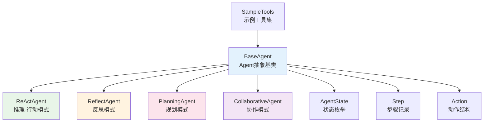
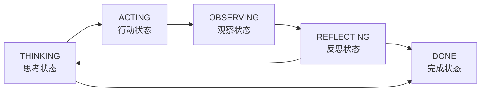

# TinyAI Agent Pattern - 智能体认知模式库


## 📖 项目简介

TinyAI Agent Pattern 是 TinyAI 框架的智能体认知模式实现模块，提供了多种经典的智能体行为模式和推理范式。该模块基于现代AI Agent理论，实现了包括 ReAct、Reflection、Planning、Collaborative 等多种认知模式，为构建智能化应用提供了强大的Agent架构支持。

## ⭐ 核心特性

### 🧠 多种认知模式
- **ReAct模式**：推理-行动交替循环，通过观察结果优化决策
- **Reflection模式**：具备自我反思能力，持续优化回答质量
- **Planning模式**：先制定计划再执行，适合复杂任务分解
- **Collaborative模式**：多专家Agent协同工作，发挥群体智慧

### 🔧 架构设计优势
- **标准化接口**：统一的Agent基类和状态管理
- **可扩展性**：支持自定义Agent模式和工具集成
- **轻量级实现**：纯Java实现，无重度外部依赖
- **完整追踪**：详细的执行步骤记录和状态跟踪

### 🛠️ 工具生态
- **内置工具集**：计算器、搜索、记忆查找等基础工具
- **自定义工具**：灵活的工具注册和调用机制
- **示例工具库**：天气查询、文本翻译、时间获取等演示工具

## 🏗️ 模块架构

### 核心类图


### 认知流程模型


## 🚀 快速开始

### 环境要求
- Java 17+
- Maven 3.6+
- TinyAI Core 模块

### 1. 添加依赖
```xml
<dependency>
    <groupId>io.leavesfly.tinyai</groupId>
    <artifactId>tinyai-agent-pattern</artifactId>
    <version>1.0-SNAPSHOT</version>
</dependency>
```

### 2. 基本使用

#### ReAct Agent - 推理行动模式
```java
// 创建ReAct Agent
ReActAgent agent = new ReActAgent("数学专家");

// 处理数学计算问题
String result = agent.process("计算 25 * 4 + 10");
System.out.println("结果: " + result);

// 查看执行步骤
System.out.println("执行轨迹:");
System.out.println(agent.getStepsSummary());
```

#### Reflection Agent - 反思模式
```java
// 创建Reflection Agent
ReflectAgent agent = new ReflectAgent("分析专家");

// 分析复杂问题
String result = agent.process("分析人工智能发展趋势");
System.out.println("分析结果: " + result);

// 查看反思记录
System.out.println("反思过程:");
agent.getReflections().forEach(System.out::println);
```

#### Planning Agent - 规划模式
```java
// 创建Planning Agent
PlanningAgent agent = new PlanningAgent("项目经理");

// 制定学习计划
String result = agent.process("制定深度学习的学习计划");
System.out.println("学习方案: " + result);

// 查看详细计划
System.out.println("执行计划:");
agent.getPlan().forEach(task -> 
    System.out.println("- " + task.getDescription()));
```

#### Collaborative Agent - 协作模式
```java
// 创建协作Agent
CollaborativeAgent coordinator = new CollaborativeAgent("协调者");

// 添加专家团队
coordinator.addSpecialist("calculator_expert", new ReActAgent("计算专家"));
coordinator.addSpecialist("analysis_expert", new ReflectAgent("分析专家"));
coordinator.addSpecialist("planning_expert", new PlanningAgent("规划专家"));

// 处理复合问题
String result = coordinator.process("分析并计算项目投资回报率");
System.out.println("协作结果: " + result);
```

### 3. 运行演示程序

#### 快速演示
```bash
cd /Users/yefei.yf/Qoder/TinyAI
export JAVA_HOME="/Library/Java/JavaVirtualMachines/jdk-17.jdk/Contents/Home"
mvn clean compile -pl tinyai-agent-pattern
mvn exec:java -pl tinyai-agent-pattern -Dexec.mainClass="io.leavesfly.tinyai.agent.pattern.QuickDemo"
```

#### 完整演示
```bash
mvn exec:java -pl tinyai-agent-pattern -Dexec.mainClass="io.leavesfly.tinyai.agent.pattern.AgentPatternMain"
```

## 📋 API详解

### BaseAgent - 抽象基类

BaseAgent是所有Agent的基础，提供了统一的接口和核心功能：

```java
public abstract class BaseAgent {
    // 核心方法
    public abstract String process(String query);
    public void addTool(String name, Function<Map<String, Object>, Object> function, String description);
    public Object callTool(Action action);
    
    // 状态管理
    public AgentState getState();
    public void setState(AgentState state);
    
    // 步骤记录
    public Step addStep(String stepType, String content);
    public String getStepsSummary();
    
    // 记忆管理
    public void addToMemory(String memory);
    public List<String> getMemory();
}
```

### Agent状态枚举
```java
public enum AgentState {
    THINKING,    // 思考状态
    ACTING,      // 行动状态  
    OBSERVING,   // 观察状态
    REFLECTING,  // 反思状态
    DONE         // 完成状态
}
```

### 自定义工具

#### 创建简单工具
```java
// 添加天气查询工具
agent.addTool("weather", SampleTools.createWeatherTool(), "天气查询工具");

// 添加自定义计算工具
agent.addTool("advanced_calc", args -> {
    String expression = (String) args.get("expression");
    // 实现复杂数学计算逻辑
    return calculateComplexExpression(expression);
}, "高级计算器");
```

#### 工具调用示例
```java
// 构建工具调用
Map<String, Object> args = new HashMap<>();
args.put("city", "北京");
Action action = new Action("weather", args);

// 执行工具
Object result = agent.callTool(action);
System.out.println("天气信息: " + result);
```

## 🎯 演示程序说明

### 1. QuickDemo - 快速演示
展示各种Agent模式的基本功能，适合快速了解框架能力。

### 2. AgentPatternDemo - 详细演示
提供完整的演示场景，包括：
- 各种Agent模式的详细对比
- 复杂任务处理演示
- 高级模式概念介绍

### 3. AgentPatternMain - 交互式演示
交互式的演示程序，可以动态测试不同的Agent和查询。

## 🎬 应用场景

### 1. 智能问答系统
```java
ReActAgent qa = new ReActAgent("问答助手");
qa.addTool("knowledge_search", knowledgeSearchTool, "知识库搜索");
qa.addTool("web_search", webSearchTool, "网络搜索");

String answer = qa.process("什么是量子计算？");
```

### 2. 任务规划助手
```java
PlanningAgent planner = new PlanningAgent("任务规划师");
String plan = planner.process("制定开发一个Web应用的详细计划");
```

### 3. 多专家咨询系统
```java
CollaborativeAgent consultant = new CollaborativeAgent("专家咨询");
consultant.addSpecialist("tech_expert", new ReActAgent("技术专家"));
consultant.addSpecialist("business_expert", new ReflectAgent("商业专家"));

String advice = consultant.process("评估这个创业项目的可行性");
```

### 4. 智能写作助手
```java
ReflectAgent writer = new ReflectAgent("写作助手");
String article = writer.process("写一篇关于AI发展的技术文章");
// 自动进行多轮反思优化
```

## 🧪 测试验证

### 运行单元测试
```bash
mvn test -pl tinyai-agent-pattern
```

### 测试覆盖范围
- Agent基础功能测试
- 各种认知模式验证
- 工具调用机制测试
- 状态转换验证
- 步骤记录完整性测试

### 性能测试示例
```java
@Test
public void performanceTest() {
    ReActAgent agent = new ReActAgent();
    long startTime = System.currentTimeMillis();
    
    for (int i = 0; i < 100; i++) {
        agent.process("计算 " + i + " * 2");
        agent.reset(); // 重置状态
    }
    
    long duration = System.currentTimeMillis() - startTime;
    System.out.println("100次处理耗时: " + duration + "ms");
}
```

## 🔧 扩展开发

### 创建自定义Agent模式

```java
public class TreeOfThoughtsAgent extends BaseAgent {
    
    private final List<ThoughtNode> thoughtTree;
    
    public TreeOfThoughtsAgent() {
        super("Tree of Thoughts Agent", 20);
        this.thoughtTree = new ArrayList<>();
        registerDefaultTools();
    }
    
    @Override
    public String process(String query) {
        // 1. 生成多个思考分支
        List<ThoughtNode> branches = generateThoughts(query);
        
        // 2. 评估各分支质量
        evaluateThoughts(branches);
        
        // 3. 选择最优路径
        ThoughtNode bestPath = selectBestPath(branches);
        
        // 4. 执行最优方案
        return executeBestSolution(bestPath);
    }
    
    private List<ThoughtNode> generateThoughts(String query) {
        // 实现多分支思考生成逻辑
        return new ArrayList<>();
    }
    
    // 其他辅助方法...
}
```

### 高级工具开发

```java
public class AdvancedTools {
    
    /**
     * 创建机器学习预测工具
     */
    public static Function<Map<String, Object>, Object> createMLPredictTool() {
        return args -> {
            String modelType = (String) args.get("model_type");
            List<Double> features = (List<Double>) args.get("features");
            
            // 实现机器学习预测逻辑
            double prediction = performMLPrediction(modelType, features);
            
            return Map.of(
                "prediction", prediction,
                "confidence", 0.85,
                "model", modelType
            );
        };
    }
    
    /**
     * 创建代码分析工具
     */
    public static Function<Map<String, Object>, Object> createCodeAnalysisTool() {
        return args -> {
            String code = (String) args.get("code");
            String language = (String) args.get("language");
            
            return analyzeCode(code, language);
        };
    }
}
```

### 自定义状态管理

```java
public enum ExtendedAgentState {
    INITIALIZING,    // 初始化状态
    THINKING,        // 思考状态
    PLANNING,        // 规划状态
    ACTING,          // 行动状态
    OBSERVING,       // 观察状态
    REFLECTING,      // 反思状态
    COLLABORATING,   // 协作状态
    FINALIZING,      // 最终化状态
    DONE             // 完成状态
}
```

## 📊 性能特性

### Agent模式对比

| Agent模式 | 适用场景 | 平均步骤数 | 内存使用 | 计算复杂度 |
|-----------|----------|------------|----------|------------|
| ReAct | 逻辑推理、工具调用 | 3-8步 | 低 | O(n) |
| Reflection | 质量要求高的任务 | 5-12步 | 中等 | O(n·log n) |
| Planning | 复杂任务分解 | 8-15步 | 中等 | O(n²) |
| Collaborative | 多领域复合任务 | 10-20步 | 高 | O(n·m) |

### 优化建议

1. **内存管理**：定期清理Agent的记忆和步骤历史
2. **并发处理**：使用线程池管理多Agent并发执行
3. **缓存策略**：对频繁调用的工具结果进行缓存
4. **懒加载**：按需加载专家Agent和工具

## 🏷️ 最佳实践

### 1. Agent选择指南
- **简单查询**：使用ReAct Agent
- **需要质量保证**：使用Reflection Agent  
- **复杂项目**：使用Planning Agent
- **多领域问题**：使用Collaborative Agent

### 2. 工具设计原则
- 保持工具功能单一职责
- 提供清晰的参数说明和错误处理
- 实现幂等性，避免副作用
- 支持参数验证和类型检查

### 3. 性能优化技巧
```java
// 1. 复用Agent实例
private static final ReActAgent SHARED_AGENT = new ReActAgent();

// 2. 使用对象池管理Agent
ObjectPool<BaseAgent> agentPool = new GenericObjectPool<>();

// 3. 异步处理长时间任务
CompletableFuture<String> future = CompletableFuture.supplyAsync(() -> 
    agent.process(complexQuery));
```

## 📚 相关模块

本模块与TinyAI其他模块的集成关系：

- **tinyai-agent-base**：提供基础智能体框架
- **tinyai-agent-rag**：检索增强生成系统
- **tinyai-agent-multi**：多智能体协同系统
- **tinyai-agent-evol**：自进化智能体系统

## 👨‍💻 开发团队

**作者**：山泽  
**项目**：TinyAI Framework  
**模块**：Agent Pattern Library

## 📄 许可证

本项目采用 Apache 2.0 许可证 - 详见 [LICENSE](../LICENSE) 文件

---

🌟 **Star this project** if you find it helpful!

📧 **Questions?** Please open an issue or contact the development team.

🤝 **Contributing?** We welcome contributions! Please read our contributing guidelines.