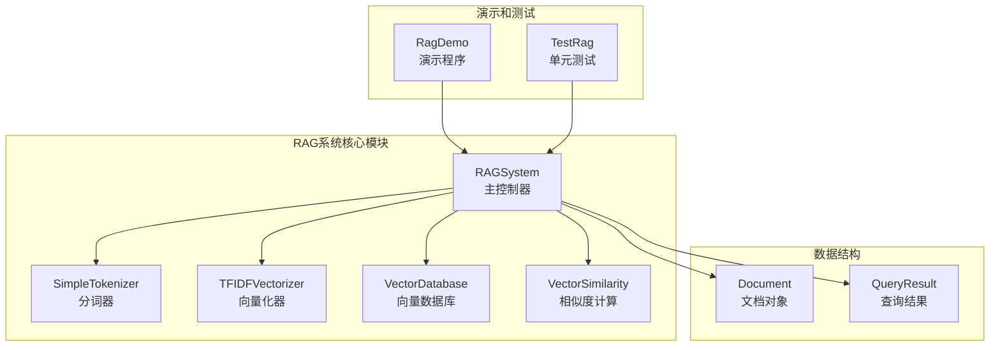
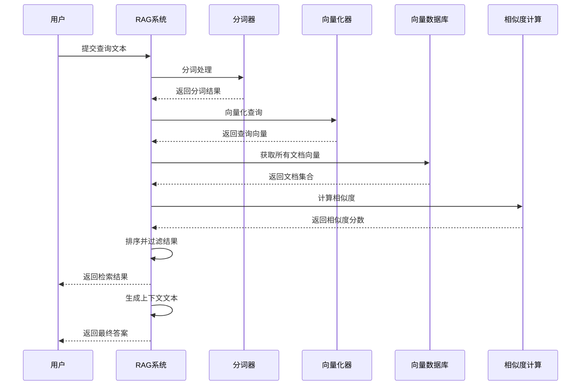

# TinyAI Agent RAG - 检索增强生成系统

## 项目简介

TinyAI Agent RAG 是一个基于 Java 实现的检索增强生成（Retrieval-Augmented Generation）系统。该模块提供了完整的 RAG 功能链条，从文本分词到向量检索，为智能问答和知识检索提供强大支持。

### 核心特性

- **🚀 零第三方依赖**：核心功能完全基于 Java 标准库实现，仅测试时依赖 JUnit
- **🌏 中文友好**：专门优化的中英文混合文本处理能力
- **⚡ 高性能设计**：支持批量文档处理和内存优化
- **🔧 灵活扩展**：模块化架构，支持多种相似度计算方法
- **📊 丰富API**：提供完整的文档管理和检索接口
- **🧪 全面测试**：完整的单元测试覆盖

## 模块架构

### 架构概览



### 核心组件

| 组件 | 功能描述 | 主要特性 |
|------|----------|----------|
| **RAGSystem** | RAG系统主控制器 | 整合所有功能模块，提供统一检索接口 |
| **SimpleTokenizer** | 智能分词器 | 支持中英文混合文本，按字符/单词分词 |
| **TFIDFVectorizer** | TF-IDF向量化器 | 基于词频-逆文档频率算法的文本向量化 |
| **VectorDatabase** | 向量数据库 | 基于 SQLite 的文档存储和管理 |
| **VectorSimilarity** | 相似度计算 | 支持余弦、欧几里得、曼哈顿等多种相似度 |
| **Document** | 文档数据结构 | 包含ID、内容、元数据、向量嵌入 |
| **QueryResult** | 查询结果结构 | 包含匹配文档、相似度分数和排名 |

### 工作流程



## 快速开始

### 环境要求

- Java 8 或更高版本
- Maven 3.6 或更高版本

### 安装依赖

```bash
# 克隆项目
git clone <repository-url>
cd TinyAI/tinyai-agent-rag

# 编译项目
mvn clean compile
```

### 基本使用示例

```java
import io.leavesfly.tinyai.agent.rag.*;
import java.util.*;

public class RAGExample {
    public static void main(String[] args) {
        // 1. 创建RAG系统实例
        RAGSystem rag = new RAGSystem(256, 0.05);
        
        // 2. 准备文档数据
        List<Map<String, Object>> documents = new ArrayList<>();
        
        Map<String, Object> doc1 = new HashMap<>();
        doc1.put("id", "python_intro");
        doc1.put("content", "Python是一种高级编程语言，具有简洁的语法和强大的功能。");
        doc1.put("metadata", Map.of("category", "编程语言", "difficulty", "入门"));
        documents.add(doc1);
        
        Map<String, Object> doc2 = new HashMap<>();
        doc2.put("id", "ml_basics");
        doc2.put("content", "机器学习是人工智能的一个分支，使计算机能够从数据中学习。");
        doc2.put("metadata", Map.of("category", "人工智能", "difficulty", "中级"));
        documents.add(doc2);
        
        // 3. 添加文档到系统
        rag.addDocuments(documents);
        
        // 4. 执行检索
        List<QueryResult> results = rag.search("编程语言", 5);
        
        // 5. 处理检索结果
        for (QueryResult result : results) {
            Document doc = result.getDocument();
            System.out.println("文档ID: " + doc.getId());
            System.out.println("相似度: " + result.getSimilarity());
            System.out.println("内容: " + doc.getContent());
            System.out.println("---");
        }
        
        // 6. 生成上下文
        String context = rag.generateContext("编程语言", 500);
        System.out.println("生成的上下文: " + context);
        
        // 7. 关闭系统
        rag.close();
    }
}
```

### 高级功能示例

```java
// 使用不同相似度计算方法
List<QueryResult> results = rag.search("查询文本", 5, 
    RAGSystem.SimilarityMethod.EUCLIDEAN);

// 添加单个文档
rag.addDocument("doc_id", "文档内容", 
    Map.of("category", "技术文档"));

// 获取系统统计信息
Map<String, Object> stats = rag.getStatistics();
System.out.println("文档总数: " + stats.get("documents_count"));
System.out.println("向量维度: " + stats.get("vector_dimension"));

// 文档管理操作
Document doc = rag.getDocument("doc_id");
boolean deleted = rag.deleteDocument("doc_id");
rag.clearAllDocuments();
```

## API 详解

### RAGSystem 核心API

#### 构造函数

```java
// 默认构造函数（向量维度512，相似度阈值0.1）
RAGSystem rag = new RAGSystem();

// 自定义参数构造函数
RAGSystem rag = new RAGSystem(vectorDim, similarityThreshold);
```

#### 文档管理

```java
// 批量添加文档
void addDocuments(List<Map<String, Object>> documentsData)

// 添加单个文档
void addDocument(String docId, String content, Map<String, Object> metadata)

// 获取文档
Document getDocument(String docId)

// 删除文档
boolean deleteDocument(String docId)

// 清空所有文档
void clearAllDocuments()

// 获取系统统计信息
Map<String, Object> getStatistics()
```

#### 检索功能

```java
// 基本检索（默认参数）
List<QueryResult> search(String query)

// 指定返回数量
List<QueryResult> search(String query, int topK)

// 指定相似度计算方法
List<QueryResult> search(String query, int topK, SimilarityMethod method)

// 生成上下文
String generateContext(String query)
String generateContext(String query, int maxContextLength)
```

### 相似度计算方法

| 方法 | 枚举值 | 描述 | 适用场景 |
|------|--------|------|----------|
| 余弦相似度 | `COSINE` | 计算向量夹角余弦值 | 文本相似度（推荐） |
| 欧几里得距离 | `EUCLIDEAN` | 计算向量欧几里得距离 | 数值型特征比较 |
| 曼哈顿距离 | `MANHATTAN` | 计算向量曼哈顿距离 | 稀疏向量比较 |
| 皮尔逊相关 | `PEARSON` | 计算皮尔逊相关系数 | 线性关系检测 |

### 数据结构说明

#### Document 文档对象

```java
public class Document {
    private String id;                    // 文档唯一标识
    private String content;               // 文档内容
    private Map<String, Object> metadata; // 文档元数据
    private List<Double> embedding;       // 文档向量表示
    private LocalDateTime createdAt;      // 创建时间
    
    // getter/setter 方法...
}
```

#### QueryResult 查询结果

```java
public class QueryResult {
    private Document document;    // 匹配的文档
    private double similarity;    // 相似度分数
    private int rank;            // 结果排名
    
    // getter/setter 方法...
}
```

## 演示程序说明

### 运行演示程序

```bash
# 方式1：使用Maven
mvn exec:java -Dexec.mainClass="io.leavesfly.tinyai.agent.rag.RagDemo"

# 方式2：直接运行Java类
java -cp target/classes io.leavesfly.tinyai.agent.rag.RagDemo
```

### 演示功能包括

1. **RAG系统演示**
   - 10个示例文档的完整检索流程
   - 多个查询示例和结果分析
   - 上下文生成演示

2. **向量操作演示**
   - TF-IDF向量化过程展示
   - 相似度矩阵计算
   - 不同相似度方法对比

3. **交互式查询**
   - 用户实时输入查询
   - 即时返回检索结果
   - 基于检索结果生成上下文

### 示例输出

```
==========================================================
🔍 RAG检索增强生成系统演示
==========================================================

📚 准备示例文档...
正在添加 10 个文档...
训练向量化器...
已处理 10/10 个文档
文档添加完成！当前共有 10 个文档

📊 系统统计信息:
  documents_count: 10
  vector_dimension: 256
  similarity_threshold: 0.05
  trained_status: true

🔎 查询: 'Python编程语言的特点'
--------------------------------------------------
📄 文档ID: python_intro
📊 相似度: 0.8234
📝 内容: Python是一种高级编程语言，由Guido van Rossum于1991年创建...
🏷️  类别: 编程语言
```

## 应用场景

### 1. 智能问答系统
- **企业知识库问答**：构建企业内部文档检索系统
- **客服机器人**：基于FAQ文档的自动回复
- **学术文献检索**：科研论文的智能搜索和推荐

### 2. 内容推荐系统
- **文章推荐**：基于用户兴趣的内容匹配
- **产品推荐**：电商平台的商品描述匹配
- **新闻聚合**：相关新闻的自动聚类和推荐

### 3. 文档管理系统
- **企业文档搜索**：跨部门文档的统一检索
- **代码文档检索**：技术文档的语义搜索
- **法律文书检索**：法律条文的智能匹配

### 4. 教育培训领域
- **在线学习系统**：课程内容的智能匹配
- **题库系统**：试题的相似度分析
- **学习资源推荐**：个性化学习路径规划

## 测试验证

### 单元测试覆盖

项目提供了全面的单元测试，覆盖以下功能点：

1. **SimpleTokenizer测试**
   - 中英文分词功能
   - 词汇表构建和管理
   - 边界情况处理

2. **TFIDFVectorizer测试**
   - 模型训练和向量转换
   - 特征维度控制
   - 数据预处理

3. **VectorSimilarity测试**
   - 各种相似度计算方法
   - 向量标准化
   - 性能对比

4. **VectorDatabase测试**
   - 文档存储和检索
   - 批量操作
   - 数据持久化

5. **RAGSystem集成测试**
   - 端到端检索流程
   - 系统性能测试
   - 异常情况处理

### 运行测试

```bash
# 运行所有测试
mvn test

# 运行指定测试类
mvn test -Dtest=TestRag

# 查看测试覆盖率
mvn test jacoco:report
```

### 性能指标

| 操作类型 | 时间复杂度 | 空间复杂度 | 说明 |
|----------|------------|------------|------|
| 文档添加 | O(n×m) | O(d×v) | n=文档数，m=平均文档长度 |
| 检索查询 | O(d×v) | O(d) | d=文档数，v=向量维度 |
| 向量化 | O(t×f) | O(f) | t=token数，f=特征数 |

## 扩展开发

### 1. 算法优化扩展

```java
// 实现自定义相似度计算方法
public class CustomSimilarity extends VectorSimilarity {
    public static double customSimilarity(List<Double> vec1, List<Double> vec2) {
        // 自定义相似度算法实现
        return similarity;
    }
}

// 扩展向量化器
public class AdvancedVectorizer extends TFIDFVectorizer {
    // 添加词向量嵌入支持
    // 实现更复杂的特征提取
}
```

### 2. 功能扩展示例

```java
// 添加文档分类功能
public class ClassifiedRAGSystem extends RAGSystem {
    public List<QueryResult> searchByCategory(String query, String category) {
        // 按类别过滤检索结果
    }
}

// 添加增量索引更新
public class IncrementalRAGSystem extends RAGSystem {
    public void updateDocumentIndex(String docId) {
        // 增量更新文档索引
    }
}
```

### 3. 性能优化建议

1. **索引优化**
   - 实现倒排索引加速检索
   - 使用局部敏感哈希（LSH）
   - 添加向量量化压缩

2. **并发优化**
   - 多线程文档处理
   - 并行相似度计算
   - 异步索引更新

3. **内存优化**
   - 延迟加载大文档
   - 向量稀疏化存储
   - 缓存机制优化

### 4. 集成扩展

```java
// Web API 集成示例
@RestController
public class RAGController {
    private RAGSystem ragSystem;
    
    @PostMapping("/search")
    public List<QueryResult> search(@RequestParam String query) {
        return ragSystem.search(query);
    }
    
    @PostMapping("/documents")
    public void addDocument(@RequestBody DocumentRequest request) {
        ragSystem.addDocument(request.getId(), 
                             request.getContent(), 
                             request.getMetadata());
    }
}
```

---

## 总结

TinyAI Agent RAG 模块为 Java 开发者提供了一个功能完整、性能优良的检索增强生成系统。通过零第三方依赖的设计，确保了系统的轻量级和可部署性；通过中文友好的文本处理，满足了中文应用场景的需求；通过模块化的架构设计，为系统扩展提供了良好的基础。

无论是构建企业级知识库、智能问答系统，还是进行学术研究和原型开发，该模块都能提供可靠的技术支撑。完善的文档、丰富的示例和全面的测试，让开发者能够快速上手并深入使用。

**开始使用 TinyAI Agent RAG，构建您的下一代智能检索系统！**