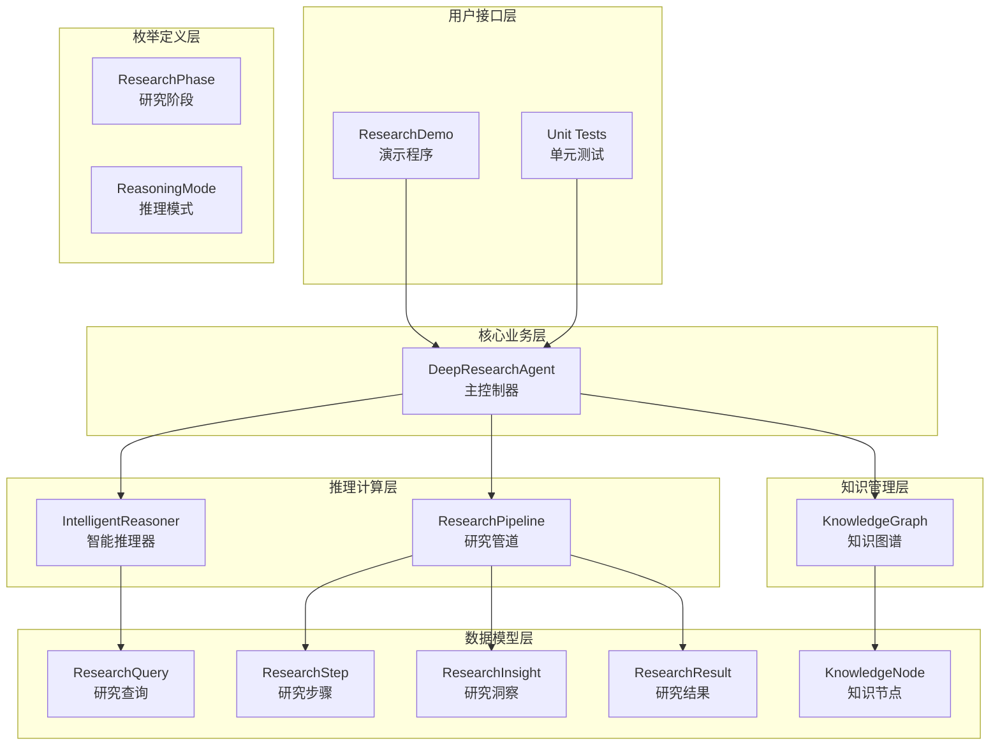
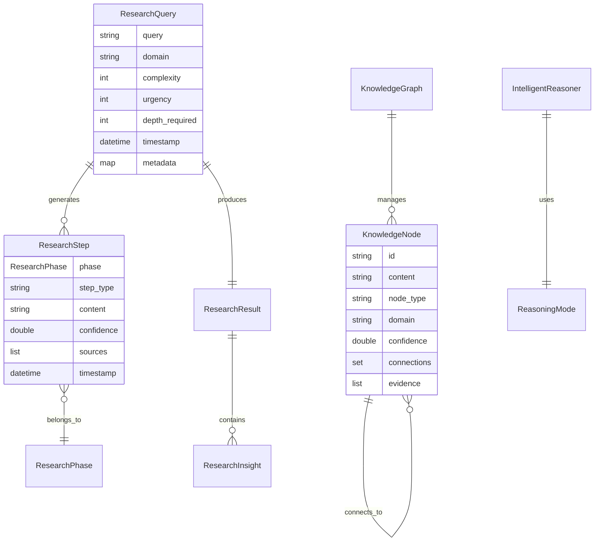

# TinyAI 深度研究智能体模块技术架构文档

## 文档信息

- **文档标题**: TinyAI 深度研究智能体模块技术架构文档
- **版本**: v1.0.0
- **创建时间**: 2025年10月4日
- **作者**: 山泽
- **模块**: tinyai-agent-research

## 1. 项目概述

### 1.1 项目背景

TinyAI 深度研究智能体模块是基于Python原型实现，参考现有Java架构设计的高级研究AI系统。该模块将Python版本的DeepResearch Agent成功迁移到Java平台，保持了原有的核心功能和架构理念，同时充分利用了TinyAI框架下已有的智能体基础设施。

### 1.2 项目目标

- 🎯 实现基于Java的深度研究智能体系统
- 🔗 复用TinyAI框架下的已有实现，减少第三方依赖
- 🧠 提供多阶段推理、知识图谱构建、自适应学习等高级功能
- 📚 建立可扩展的研究工具和推理策略框架
- 🔄 支持探索性研究和协作式研究模式

## 2. 系统架构

### 2.1 整体架构设计



### 2.2 核心组件架构

#### 2.2.1 DeepResearchAgent（主控制器）

```java
public class DeepResearchAgent {
    // 核心组件
    private final KnowledgeGraph knowledgeGraph;
    private final IntelligentReasoner reasoner;
    private final ResearchPipeline pipeline;
    
    // 学习和适应参数
    private double learningRate;
    private double confidenceThreshold;
    private int maxResearchDepth;
}
```

**职责**:
- 协调各组件完成研究任务
- 管理研究历史和性能指标
- 提供探索性和协作式研究接口
- 实现自适应学习机制

#### 2.2.2 IntelligentReasoner（智能推理器）

```java
public class IntelligentReasoner {
    // 推理策略映射
    private final Map<ReasoningMode, BiFunction<ResearchQuery, Map<String, Object>, List<String>>> reasoningPatterns;
    
    // 性能历史记录
    private final Map<ReasoningMode, List<Double>> performanceHistory;
}
```

**职责**:
- 自适应选择推理模式
- 执行不同策略的推理任务
- 跟踪和优化推理性能

#### 2.2.3 ResearchPipeline（研究管道）

```java
public class ResearchPipeline {
    // 研究工具映射
    private final Map<String, Function<String, String>> researchTools;
    
    // 阶段处理器映射
    private final Map<ResearchPhase, Function<ResearchContext, ResearchPhaseResult>> phaseHandlers;
}
```

**职责**:
- 管理六阶段研究流程
- 集成多种研究工具
- 执行质量评估和结果整合

#### 2.2.4 KnowledgeGraph（知识图谱）

```java
public class KnowledgeGraph {
    // 知识节点存储
    private final Map<String, KnowledgeNode> nodes;
    
    // 连接权重映射
    private final Map<String, Map<String, Double>> connections;
    
    // 领域节点映射
    private final Map<String, Set<String>> domains;
}
```

**职责**:
- 动态管理知识节点和连接
- 自动发现知识关联
- 提供知识检索和统计功能

## 3. 核心设计模式

### 3.1 策略模式（推理策略）

```java
// 推理策略接口
BiFunction<ResearchQuery, Map<String, Object>, List<String>> reasoningFunction

// 具体策略实现
private List<String> quickReasoning(ResearchQuery query, Map<String, Object> context)
private List<String> thoroughReasoning(ResearchQuery query, Map<String, Object> context)
private List<String> creativeReasoning(ResearchQuery query, Map<String, Object> context)
```

### 3.2 管道模式（研究流程）

```java
// 阶段处理器映射
Map<ResearchPhase, Function<ResearchContext, ResearchPhaseResult>> phaseHandlers

// 流水线执行
for (ResearchPhase phase : ResearchPhase.values()) {
    ResearchPhaseResult phaseResult = executePhase(phase, context);
    context.addPhaseResult(phase, phaseResult);
}
```

### 3.3 观察者模式（性能跟踪）

```java
// 性能记录
public void recordPerformance(ReasoningMode mode, double score) {
    List<Double> scores = performanceHistory.get(mode);
    scores.add(score);
}

// 学习指标更新
private void updateLearningMetrics(ResearchQuery query, ResearchResult result, ReasoningMode reasoningMode)
```

## 4. 数据模型设计

### 4.1 核心实体关系



### 4.2 枚举类型设计

#### ResearchPhase（研究阶段）
```java
public enum ResearchPhase {
    PROBLEM_ANALYSIS("problem_analysis", "问题分析"),
    INFORMATION_GATHERING("information_gathering", "信息收集"),
    DEEP_ANALYSIS("deep_analysis", "深度分析"),
    SYNTHESIS("synthesis", "综合处理"),
    VALIDATION("validation", "验证检查"),
    CONCLUSION("conclusion", "结论生成");
}
```

#### ReasoningMode（推理模式）
```java
public enum ReasoningMode {
    QUICK("quick", "快速推理", "简单问题，基础概念分析"),
    THOROUGH("thorough", "彻底推理", "复杂问题，全面深入分析"),
    CREATIVE("creative", "创意推理", "创新问题，发散思维"),
    ANALYTICAL("analytical", "分析推理", "数据驱动，系统分析"),
    SYSTEMATIC("systematic", "系统推理", "结构化研究，系统梳理");
}
```

## 5. 核心算法实现

### 5.1 推理模式选择算法

```java
public ReasoningMode selectReasoningMode(ResearchQuery query, Map<String, Object> context) {
    // 基于查询复杂度和紧急度的基础选择
    if (query.getComplexity() <= 2 && query.getUrgency() >= 4) {
        return ReasoningMode.QUICK;
    }
    
    if (query.getDepthRequired() >= 4) {
        return ReasoningMode.THOROUGH;
    }
    
    // 基于查询内容的关键词匹配
    String queryText = query.getQuery().toLowerCase();
    
    if (containsKeywords(queryText, "创新", "新", "发明", "原创")) {
        return ReasoningMode.CREATIVE;
    }
    
    // 考虑历史性能，选择表现最好的模式
    ReasoningMode bestMode = getBestPerformingMode();
    if (bestMode != null) {
        return bestMode;
    }
    
    return ReasoningMode.SYSTEMATIC;  // 默认选择
}
```

### 5.2 知识相似度计算算法

```java
private double calculateSimilarity(String text1, String text2) {
    Set<String> words1 = extractWords(text1.toLowerCase());
    Set<String> words2 = extractWords(text2.toLowerCase());
    
    if (words1.isEmpty() || words2.isEmpty()) {
        return 0.0;
    }
    
    Set<String> intersection = new HashSet<>(words1);
    intersection.retainAll(words2);
    
    Set<String> union = new HashSet<>(words1);
    union.addAll(words2);
    
    return union.isEmpty() ? 0.0 : (double) intersection.size() / union.size();
}
```

### 5.3 质量评估算法

```java
private double assessQualityScore() {
    Map<String, Double> factors = new HashMap<>();
    factors.put("completeness", Math.min(1.0, allSteps.size() / 15.0));  // 完整性
    factors.put("depth", Math.min(1.0, thoughtSteps / 8.0));  // 思考深度
    factors.put("diversity", Math.min(1.0, uniqueTools.size() / 3.0));  // 工具多样性
    factors.put("insights", Math.min(1.0, allInsights.size() / 3.0));  // 洞察数量
    factors.put("confidence", totalConfidence);  // 平均置信度
    
    // 加权平均
    Map<String, Double> weights = Map.of(
        "completeness", 0.2, "depth", 0.25, "diversity", 0.2,
        "insights", 0.2, "confidence", 0.15
    );
    
    return factors.entrySet().stream()
            .mapToDouble(entry -> entry.getValue() * weights.get(entry.getKey()))
            .sum();
}
```

## 6. 性能优化

### 6.1 缓存机制

```java
// 相似度计算缓存
private final Map<String, Double> similarityCache;

// 缓存键生成
private String generateCacheKey(String text1, String text2) {
    String[] texts = {text1, text2};
    Arrays.sort(texts);
    return String.join("|||", texts);
}
```

### 6.2 内存管理

```java
// 保持历史记录在合理范围内
if (researchHistory.size() > 1000) {
    researchHistory.remove(0);
}

// 保持性能历史在合理范围内
if (scores.size() > 100) {
    scores.remove(0);
}
```

### 6.3 并发安全

采用不可变对象和函数式编程风格，避免并发问题：

```java
// 使用不可变的枚举和数据类
public enum ResearchPhase { /* immutable */ }

// 返回防御性副本
public List<ResearchStep> getSteps() {
    return new ArrayList<>(steps);
}
```

## 7. 扩展性设计

### 7.1 推理策略扩展

```java
// 添加新的推理策略
reasoningPatterns.put(NewReasoningMode.CUSTOM, this::customReasoning);

private List<String> customReasoning(ResearchQuery query, Map<String, Object> context) {
    // 自定义推理逻辑
    return customSteps;
}
```

### 7.2 研究工具扩展

```java
// 添加自定义研究工具
public void addResearchTool(String name, Function<String, String> tool) {
    researchTools.put(name, tool);
}
```

### 7.3 知识节点类型扩展

```java
// 支持新的节点类型
public KnowledgeNode(String id, String content, String nodeType, String domain) {
    // nodeType 可以是 "concept", "fact", "relation", "hypothesis" 或自定义类型
}
```

## 8. 测试策略

### 8.1 单元测试覆盖

- ✅ Agent创建和初始化测试
- ✅ 基础研究功能测试
- ✅ 知识管理功能测试
- ✅ 推理模式选择测试
- ✅ 探索性研究测试
- ✅ 协作式研究测试
- ✅ 性能跟踪测试
- ✅ 数据模型验证测试

### 8.2 集成测试

```java
@Test
public void testCompleteResearchWorkflow() {
    // 测试完整的研究工作流程
    DeepResearchAgent agent = new DeepResearchAgent();
    
    // 添加知识
    agent.addDomainKnowledge("测试知识", "测试领域");
    
    // 执行研究
    Map<String, Object> result = agent.research("测试查询", 3, 3, 2);
    
    // 验证结果
    assertNotNull(result.get("finalAnswer"));
    assertTrue((Double) result.get("totalConfidence") > 0);
}
```

### 8.3 性能测试

```java
@Test
public void testPerformanceUnderLoad() {
    DeepResearchAgent agent = new DeepResearchAgent();
    
    long startTime = System.currentTimeMillis();
    
    // 执行多次研究
    for (int i = 0; i < 100; i++) {
        agent.research("测试查询" + i, 2, 2, 2);
    }
    
    long endTime = System.currentTimeMillis();
    long duration = endTime - startTime;
    
    assertTrue("性能测试: 100次研究应在合理时间内完成", duration < 10000);
}
```

## 9. 部署和运维

### 9.1 环境要求

- **Java版本**: JDK 8 或更高版本
- **内存要求**: 最少2GB RAM，推荐4GB+
- **存储空间**: 至少100MB可用空间
- **网络**: 如需外部API集成

### 9.2 构建和打包

```bash
# 清理和编译
mvn clean compile

# 运行测试
mvn test

# 打包
mvn package

# 运行演示
mvn exec:java -Dexec.mainClass="io.leavesfly.tinyai.agent.research.ResearchDemo"
```

### 9.3 配置管理

```java
// 可配置的参数
private double learningRate = 0.1;          // 学习率
private double confidenceThreshold = 0.7;   // 置信度阈值
private int maxResearchDepth = 5;           // 最大研究深度

// 推理器配置
config.put("maxReasoningSteps", 10);
config.put("confidenceThreshold", 0.7);
config.put("performanceWeight", 0.3);
```

## 10. 未来发展规划

### 10.1 短期目标（3个月内）

- 🔗 集成真实LLM API（OpenAI、Claude等）
- 📊 添加可视化界面支持
- 💾 实现持久化存储功能
- 🌐 支持分布式部署

### 10.2 中期目标（6个月内）

- 🎯 多模态信息处理能力
- 🤖 增强的协作智能体网络
- 📈 高级分析和报告功能
- 🔐 企业级安全和权限管理

### 10.3 长期目标（1年内）

- 🧠 自主学习和知识发现
- 🌍 跨语言研究支持
- 🎨 个性化研究风格
- 📱 移动端应用支持

## 11. 总结

TinyAI 深度研究智能体模块成功实现了从Python到Java的架构迁移，保持了原有设计的核心理念，同时充分利用了Java生态系统的优势。该模块具备：

### 11.1 技术优势

- **架构清晰**: 分层设计，职责明确
- **扩展性强**: 支持多种扩展机制
- **性能优良**: 优化的算法和缓存机制
- **测试完善**: 全面的单元测试覆盖

### 11.2 业务价值

- **研究效率**: 显著提升复杂问题研究效率
- **结果质量**: 多阶段验证保证研究质量
- **应用广泛**: 适用于学术、商业、技术等多个领域
- **易于集成**: 良好的API设计和文档支持

### 11.3 创新亮点

- **自适应推理**: 智能选择最优推理策略
- **动态知识图谱**: 实时构建和更新知识网络
- **多模式研究**: 支持探索性和协作式研究
- **持续学习**: 基于历史表现的自我优化

本模块为TinyAI框架增加了强大的研究能力，为构建更智能的AI应用提供了坚实的基础。

---

**文档版本**: v1.0.0  
**最后更新**: 2025年10月4日  
**维护者**: 山泽