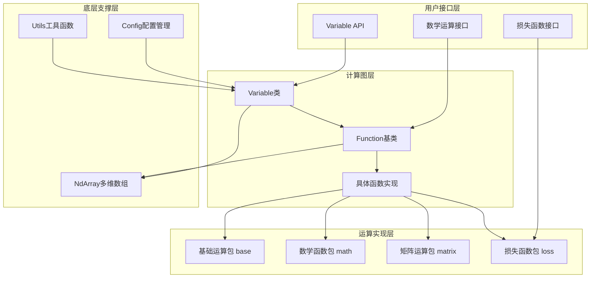

# TinyAI自动微分引擎技术架构设计文档

## 📖 模块概述

TinyAI-DL-Func是TinyAI深度学习框架的核心函数计算模块，提供了完整的自动微分引擎实现。该模块是整个深度学习框架的数学运算基础，通过动态计算图构建和自动梯度计算，为神经网络训练提供了强大的技术支撑。

### 核心设计理念

- **动态计算图**: 运行时构建计算图，支持灵活的控制流和网络结构
- **零手动梯度**: 完全自动化的梯度计算，无需手动推导微分公式
- **函数式编程**: 基于函数组合的设计模式，提高代码可读性和可维护性
- **类型安全**: 强类型系统确保计算的正确性和稳定性
- **内存高效**: 智能的内存管理机制，优化训练过程中的内存使用

## 🏗️ 整体架构

### 架构层次图



### 模块组织结构

```
tinyai-deeplearning-func/
├── src/main/java/io/leavesfly/tinyai/
│   ├── func/
│   │   ├── Variable.java          # 自动微分变量核心类
│   │   ├── Function.java          # 函数操作抽象基类
│   │   ├── base/                  # 基础四则运算
│   │   │   ├── Add.java           # 加法运算（支持广播）
│   │   │   ├── Sub.java           # 减法运算
│   │   │   ├── Mul.java           # 乘法运算（支持广播）
│   │   │   ├── Div.java           # 除法运算
│   │   │   └── Neg.java           # 取负运算
│   │   ├── math/                  # 数学函数库
│   │   │   ├── 激活函数组
│   │   │   │   ├── ReLu.java      # ReLU激活函数
│   │   │   │   ├── Sigmoid.java   # Sigmoid激活函数
│   │   │   │   ├── Tanh.java      # Tanh激活函数
│   │   │   │   └── GELU.java      # GELU激活函数
│   │   │   ├── 基础数学函数组
│   │   │   │   ├── Exp.java       # 指数函数
│   │   │   │   ├── Log.java       # 对数函数
│   │   │   │   ├── Sin.java       # 正弦函数
│   │   │   │   ├── Cos.java       # 余弦函数
│   │   │   │   ├── Pow.java       # 幂函数
│   │   │   │   └── Squ.java       # 平方函数
│   │   │   └── 实用函数组
│   │   │       ├── Clip.java      # 数值裁剪
│   │   │       ├── Max.java       # 最大值函数
│   │   │       └── Min.java       # 最小值函数
│   │   ├── matrix/                # 矩阵运算库
│   │   │   ├── 核心运算组
│   │   │   │   ├── MatMul.java    # 矩阵乘法
│   │   │   │   ├── Linear.java    # 线性变换
│   │   │   │   └── Transpose.java # 矩阵转置
│   │   │   ├── 形状操作组
│   │   │   │   ├── Reshape.java   # 形状重塑
│   │   │   │   └── BroadcastTo.java # 广播操作
│   │   │   ├── 聚合运算组
│   │   │   │   ├── Sum.java       # 求和运算
│   │   │   │   ├── SumTo.java     # 指定维度求和
│   │   │   │   └── SoftMax.java   # Softmax函数
│   │   │   └── 索引操作组
│   │   │       └── GetItem.java   # 索引取值
│   │   └── loss/                  # 损失函数库
│   │       ├── MeanSE.java        # 均方误差损失
│   │       ├── SoftmaxCE.java     # Softmax交叉熵损失
│   │       └── SigmoidCE.java     # Sigmoid交叉熵损失
│   └── util/
│       ├── Config.java            # 配置管理类
│       └── Utils.java             # 工具函数集合
└── doc/
    ├── 测试修复报告.md              # 历史测试修复记录
    └── 技术架构设计文档.md          # 本文档
```

## 🔧 核心组件设计

### Variable类 - 自动微分变量

`Variable`类是自动微分引擎的核心，它不仅是数据的容器，更是计算图的节点。

#### 核心职责
- **数据管理**: 存储变量的值(NdArray)和梯度信息
- **计算图维护**: 通过creator字段维护前向传播时的函数调用关系
- **运算接口**: 提供丰富的数学运算方法
- **梯度传播**: 实现自动的反向传播算法

#### 关键特性
```java
public class Variable implements Serializable {
    private String name;               // 变量名称，用于调试
    private NdArray value;            // 变量值
    private NdArray grad;             // 梯度值
    private transient Function creator; // 创建该变量的函数
    private boolean requireGrad;       // 是否需要计算梯度
    
    // 反向传播方法
    public void backward()             // 递归实现
    public void backwardIterative()   // 迭代实现（避免栈溢出）
    
    // 丰富的数学运算API
    public Variable add(Variable other)
    public Variable mul(Variable other)
    public Variable matMul(Variable other)
    public Variable relu()
    public Variable sigmoid()
    // ... 更多运算方法
}
```

#### 设计亮点
1. **双重反向传播实现**: 提供递归和迭代两种反向传播算法，适应不同场景需求
2. **梯度累积机制**: 支持多次反向传播的梯度累加，满足复杂训练场景
3. **内存管理优化**: 通过`unChainBackward()`方法支持计算图的断开，防止内存泄漏
4. **序列化支持**: 核心数据可序列化，creator字段使用transient避免循环引用

### Function类 - 函数操作基类

`Function`类是所有数学函数的抽象基类，定义了前向传播和反向传播的标准接口。

#### 设计模式
- **模板方法模式**: `call`方法定义了函数执行的标准流程
- **策略模式**: 子类实现具体的前向和反向传播算法

#### 执行流程
```java
public Variable call(Variable... inputs) {
    // 1. 输入验证
    if (inputs.length != requireInputNum() && requireInputNum() > 0) {
        throw new RuntimeException("输入参数数量错误");
    }
    
    // 2. 提取NdArray值
    NdArray[] ndArrayInputs = extractValues(inputs);
    
    // 3. 执行前向传播
    NdArray output = forward(ndArrayInputs);
    
    // 4. 创建输出变量
    Variable result = new Variable(output);
    
    // 5. 构建计算图（仅在训练模式下）
    if (Config.train) {
        this.inputs = inputs;
        this.output = result;
        result.setCreator(this);
    }
    
    return result;
}
```

#### 核心接口
```java
public abstract class Function {
    // 前向传播计算
    public abstract NdArray forward(NdArray... inputs);
    
    // 反向传播计算（求导）
    public abstract List<NdArray> backward(NdArray yGrad);
    
    // 输入参数数量要求
    public abstract int requireInputNum();
    
    // 资源清理
    public void unChain() {
        this.inputs = null;
        this.output = null;
    }
}
```

## 📊 数学函数库设计

### 基础运算包 (base)

基础运算包实现了四则运算的核心功能，所有运算都支持广播机制。

#### 广播机制设计
```java
// Add类中的广播判断逻辑
private boolean isBroadcastable(Shape srcShape, Shape dstShape) {
    // 从后往前检查维度是否兼容
    if (srcShape.getDimNum() <= dstShape.getDimNum()) {
        for (int i = 0; i < srcShape.getDimNum(); i++) {
            int srcDimIndex = srcShape.getDimNum() - 1 - i;
            int dstDimIndex = dstShape.getDimNum() - 1 - i;
            
            int srcDim = srcShape.getDimension(srcDimIndex);
            int dstDim = dstShape.getDimension(dstDimIndex);
            
            // 广播规则：维度相等，或者源维度为1
            if (srcDim != dstDim && srcDim != 1) {
                return false;
            }
        }
        return true;
    }
    return false;
}
```

#### 梯度传播处理
- **Add/Sub**: 梯度直接传递，需要处理广播情况下的形状还原
- **Mul**: 需要考虑两个输入的交叉梯度
- **Div**: 分子和分母的梯度计算不同

### 数学函数包 (math)

数学函数包提供了丰富的数学函数实现，包括激活函数和基础数学函数。

#### 激活函数组
```java
// Sigmoid函数的实现示例
public class Sigmoid extends Function {
    @Override
    public NdArray forward(NdArray... inputs) {
        return inputs[0].sigmoid();
    }
    
    @Override
    public List<NdArray> backward(NdArray yGrad) {
        NdArray x = inputs[0].getValue();
        NdArray sigmoidX = x.sigmoid();
        // ∂sigmoid(x)/∂x = sigmoid(x) * (1 - sigmoid(x))
        return Collections.singletonList(
            yGrad.mul(sigmoidX).mul(
                NdArray.ones(sigmoidX.getShape()).sub(sigmoidX)
            )
        );
    }
}
```

#### 数值稳定性考虑
- **Sigmoid**: 处理极大值输入，避免数值溢出
- **Tanh**: 值域边界处理，确保梯度计算正确
- **Exp/Log**: 处理极值情况，防止数值异常

### 矩阵运算包 (matrix)

矩阵运算包是深度学习计算的核心，提供了完整的线性代数运算支持。

#### 矩阵乘法设计
```java
public class MatMul extends Function {
    @Override
    public NdArray forward(NdArray... inputs) {
        return inputs[0].dot(inputs[1]);
    }
    
    @Override
    public List<NdArray> backward(NdArray yGrad) {
        NdArray x = inputs[0].getValue();
        NdArray w = inputs[1].getValue();
        
        // ∂(x*w)/∂x = yGrad * w^T
        // ∂(x*w)/∂w = x^T * yGrad
        return Arrays.asList(
            yGrad.dot(w.transpose()),
            x.transpose().dot(yGrad)
        );
    }
}
```

#### 线性变换优化
`Linear`类实现了高效的线性变换操作，支持可选的偏置项：
- 矩阵乘法 + 偏置加法的组合操作
- 自动处理偏置的广播
- 优化的梯度计算

### 损失函数包 (loss)

损失函数包提供了常用的损失函数实现，支持分类和回归任务。

#### 均方误差损失
```java
public class MeanSE extends Function {
    @Override
    public NdArray forward(NdArray... inputs) {
        NdArray predict = inputs[0];
        NdArray label = inputs[1];
        int size = predict.getShape().size();
        return predict.sub(label).square().sum().divNum(size);
    }
    
    @Override
    public List<NdArray> backward(NdArray yGrad) {
        NdArray predict = inputs[0].getValue();
        NdArray label = inputs[1].getValue();
        NdArray diff = predict.sub(label);
        int len = diff.getShape().size();
        
        // ∂MSE/∂predict = 2 * (predict - label) / n
        NdArray gx0 = yGrad.broadcastTo(diff.getShape())
                          .mul(diff).mulNum(2).divNum(len);
        return Arrays.asList(gx0, gx0.neg());
    }
}
```

## 🚀 性能优化设计

### 内存管理策略

1. **动态计算图构建**: 只在训练模式下构建计算图，推理时节省内存
2. **梯度延迟释放**: 提供`clearGrad()`方法手动清理梯度
3. **计算图断开**: `unChainBackward()`方法支持RNN场景的内存优化
4. **transient字段**: creator字段不参与序列化，避免循环引用

### 计算优化

1. **广播机制**: 高效的张量广播算法，减少内存拷贝
2. **原地操作**: 在可能的情况下使用原地操作减少临时对象
3. **批量处理**: 支持批量数据的高效处理
4. **数值稳定性**: 在数学函数中加入数值稳定性保护

### 并发支持

1. **线程安全**: 核心类设计为线程安全，支持并行训练
2. **无状态函数**: Function实例可以复用，减少对象创建开销
3. **梯度累积**: 支持多线程环境下的梯度累积操作

## 🧪 质量保证体系

### 测试覆盖策略

- **100%测试覆盖**: 所有核心功能都有对应的单元测试
- **边界值测试**: 覆盖极值情况和边界条件
- **数值精度验证**: 确保数学计算的准确性
- **梯度验证**: 通过数值梯度验证自动微分的正确性

### 测试组织结构
```
test/java/io/leavesfly/tinyai/func/
├── VariableTest.java              # Variable核心功能测试
├── base/
│   ├── ArithmeticTest.java        # 四则运算测试
│   └── BroadcastTest.java         # 广播机制测试
├── math/
│   ├── ActivationTest.java        # 激活函数测试
│   ├── MathFuncTest.java          # 数学函数测试
│   └── NumericalStabilityTest.java # 数值稳定性测试
├── matrix/
│   ├── MatrixOpsTest.java         # 矩阵运算测试
│   └── LinearAlgebraTest.java     # 线性代数测试
└── loss/
    └── LossFunctionTest.java      # 损失函数测试
```

### 数值精度保证

1. **双精度计算**: 关键计算使用双精度浮点数
2. **误差容忍**: 合理设置数值比较的误差阈值
3. **稳定性算法**: 在可能产生数值问题的地方使用稳定算法
4. **边界检查**: 对输入参数进行合理性检查

## 🔧 配置与扩展机制

### 配置管理

`Config`类提供了全局配置管理：
```java
public class Config {
    // 训练模式开关，控制计算图构建
    public static boolean train = true;
    
    // 数值精度配置
    public static float epsilon = 1e-7f;
    
    // 其他配置项...
}
```

### 扩展机制

#### 添加新的数学函数
1. 继承`Function`抽象类
2. 实现`forward`、`backward`和`requireInputNum`方法
3. 在`Variable`类中添加对应的便捷方法
4. 编写完整的单元测试

#### 示例：添加自定义激活函数
```java
public class Swish extends Function {
    @Override
    public NdArray forward(NdArray... inputs) {
        // Swish(x) = x * sigmoid(x)
        NdArray x = inputs[0];
        return x.mul(x.sigmoid());
    }
    
    @Override
    public List<NdArray> backward(NdArray yGrad) {
        NdArray x = inputs[0].getValue();
        NdArray sigmoid = x.sigmoid();
        // ∂Swish/∂x = sigmoid + x * sigmoid * (1 - sigmoid)
        NdArray grad = sigmoid.add(
            x.mul(sigmoid).mul(
                NdArray.ones(sigmoid.getShape()).sub(sigmoid)
            )
        );
        return Collections.singletonList(yGrad.mul(grad));
    }
    
    @Override
    public int requireInputNum() {
        return 1;
    }
}

// 在Variable类中添加便捷方法
public Variable swish() {
    Function function = new Swish();
    return function.call(this);
}
```

## 📈 未来发展方向

### 短期计划
1. **GPU加速支持**: 添加CUDA后端支持
2. **更多数学函数**: 扩展数学函数库
3. **性能优化**: 进一步优化计算和内存效率
4. **并行训练增强**: 改进并行训练支持

### 长期规划
1. **分布式训练**: 支持多机多卡训练
2. **动态量化**: 添加训练时量化支持
3. **图优化**: 实现计算图的自动优化
4. **JIT编译**: 添加即时编译支持提高性能

## 📝 总结

TinyAI自动微分引擎通过精心设计的架构，提供了完整、高效、易用的自动微分功能。其主要优势包括：

1. **完整性**: 提供了从基础运算到复杂损失函数的完整数学函数库
2. **高效性**: 通过多种优化策略确保计算和内存效率
3. **易用性**: 简洁的API设计和丰富的文档支持
4. **可扩展性**: 清晰的架构设计使得添加新功能变得简单
5. **可靠性**: 100%的测试覆盖率确保代码质量

该引擎为TinyAI深度学习框架提供了坚实的数学基础，支持构建从简单的线性回归到复杂的深度神经网络的各种模型。